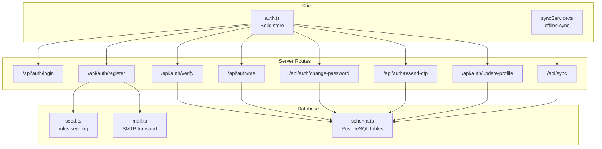
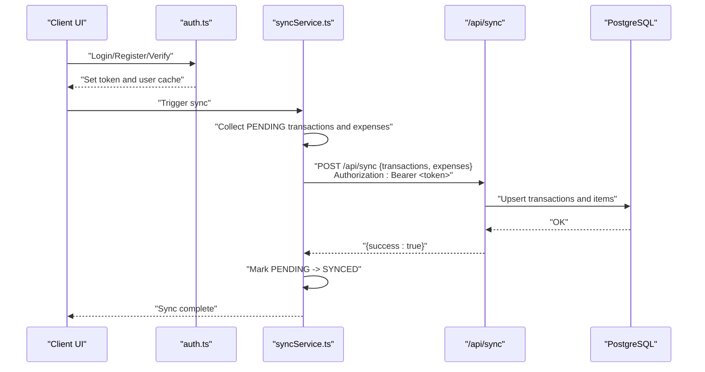
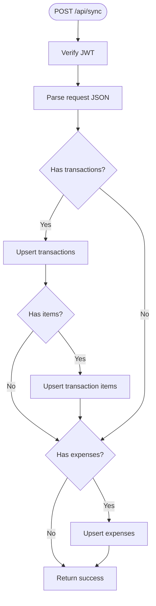
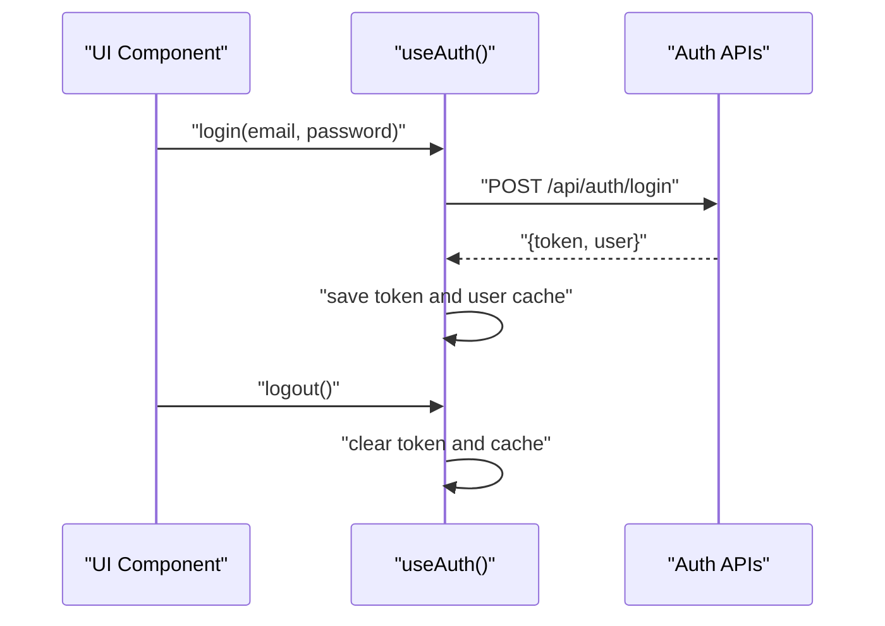
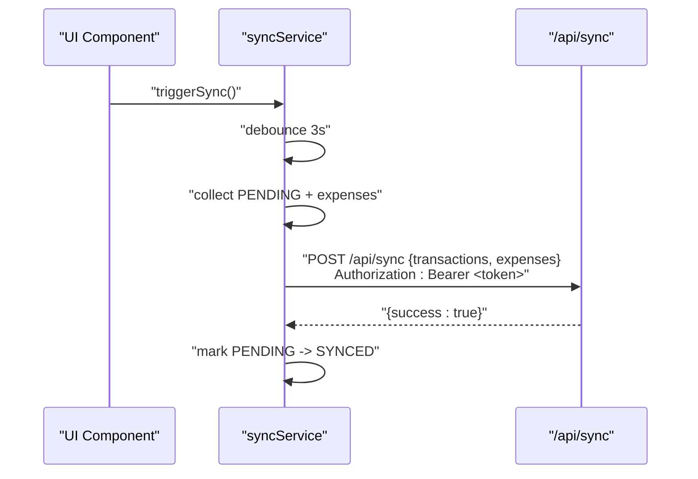
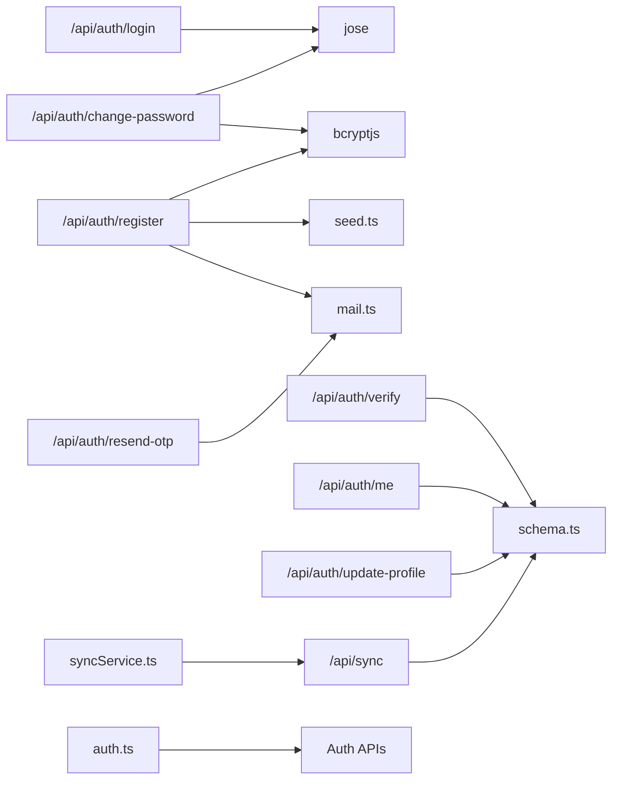
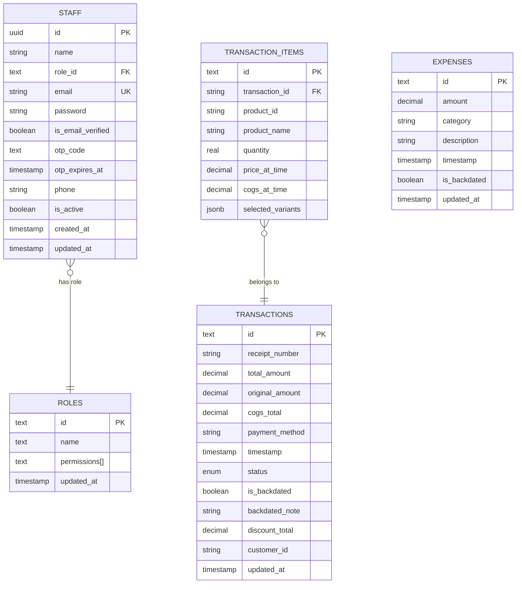

# API Reference

<cite>
**Referenced Files in This Document**
- [login.ts](file://src/routes/api/auth/login.ts)
- [register.ts](file://src/routes/api/auth/register.ts)
- [verify.ts](file://src/routes/api/auth/verify.ts)
- [change-password.ts](file://src/routes/api/auth/change-password.ts)
- [me.ts](file://src/routes/api/auth/me.ts)
- [resend-otp.ts](file://src/routes/api/auth/resend-otp.ts)
- [update-profile.ts](file://src/routes/api/auth/update-profile.ts)
- [sync/index.ts](file://src/routes/api/sync/index.ts)
- [syncService.ts](file://src/lib/syncService.ts)
- [auth.ts](file://src/stores/auth.ts)
- [schema.ts](file://src/server/db/schema.ts)
- [db.ts](file://src/db/db.ts)
- [mail.ts](file://src/server/utils/mail.ts)
- [seed.ts](file://src/server/db/seed.ts)
- [package.json](file://package.json)
</cite>

## Table of Contents
1. [Introduction](#introduction)
2. [Project Structure](#project-structure)
3. [Core Components](#core-components)
4. [Architecture Overview](#architecture-overview)
5. [Detailed Component Analysis](#detailed-component-analysis)
6. [Dependency Analysis](#dependency-analysis)
7. [Performance Considerations](#performance-considerations)
8. [Troubleshooting Guide](#troubleshooting-guide)
9. [Conclusion](#conclusion)
10. [Appendices](#appendices)

## Introduction
This document provides a comprehensive API reference for the NgePos POS system. It covers:
- Authentication API: login, registration, email verification, password management, profile updates, and session retrieval
- Synchronization API for offline-first operations: data sync endpoint, conflict resolution, batch processing, and error handling
- Security considerations, rate limiting, API versioning, and debugging tools
- Practical examples and client integration patterns

## Project Structure
NgePos is a SolidStart application with a serverless-friendly routing model under src/routes/api/. Authentication endpoints reside under src/routes/api/auth/, while synchronization logic is under src/routes/api/sync/. Client-side integration is handled by a Solid store and a dedicated sync service.

**Diagram sources**
- [auth.ts:11-204](file://src/stores/auth.ts#L11-L204)
- [syncService.ts:4-58](file://src/lib/syncService.ts#L4-L58)
- [login.ts:11-54](file://src/routes/api/auth/login.ts#L11-L54)
- [register.ts:8-58](file://src/routes/api/auth/register.ts#L8-L58)
- [verify.ts:5-55](file://src/routes/api/auth/verify.ts#L5-L55)
- [me.ts:10-59](file://src/routes/api/auth/me.ts#L10-L59)
- [change-password.ts:11-71](file://src/routes/api/auth/change-password.ts#L11-L71)
- [resend-otp.ts:6-57](file://src/routes/api/auth/resend-otp.ts#L6-L57)
- [update-profile.ts:10-57](file://src/routes/api/auth/update-profile.ts#L10-L57)
- [sync/index.ts:10-97](file://src/routes/api/sync/index.ts#L10-L97)
- [schema.ts:4-134](file://src/server/db/schema.ts#L4-L134)
- [seed.ts:5-35](file://src/server/db/seed.ts#L5-L35)
- [mail.ts:10-68](file://src/server/utils/mail.ts#L10-L68)

**Section sources**
- [auth.ts:11-204](file://src/stores/auth.ts#L11-L204)
- [syncService.ts:4-58](file://src/lib/syncService.ts#L4-L58)
- [login.ts:11-54](file://src/routes/api/auth/login.ts#L11-L54)
- [register.ts:8-58](file://src/routes/api/auth/register.ts#L8-L58)
- [verify.ts:5-55](file://src/routes/api/auth/verify.ts#L5-L55)
- [me.ts:10-59](file://src/routes/api/auth/me.ts#L10-L59)
- [change-password.ts:11-71](file://src/routes/api/auth/change-password.ts#L11-L71)
- [resend-otp.ts:6-57](file://src/routes/api/auth/resend-otp.ts#L6-L57)
- [update-profile.ts:10-57](file://src/routes/api/auth/update-profile.ts#L10-L57)
- [sync/index.ts:10-97](file://src/routes/api/sync/index.ts#L10-L97)
- [schema.ts:4-134](file://src/server/db/schema.ts#L4-L134)
- [seed.ts:5-35](file://src/server/db/seed.ts#L5-L35)
- [mail.ts:10-68](file://src/server/utils/mail.ts#L10-L68)

## Core Components
- Authentication endpoints: handle user lifecycle from registration to session retrieval
- Synchronization endpoint: accepts batches of transactions and expenses, upserts into PostgreSQL, and marks local records as synced
- Client integration: Solid store manages auth state and token caching; sync service batches and debounces local changes

Key implementation references:
- Authentication routes: [login.ts:11-54](file://src/routes/api/auth/login.ts#L11-L54), [register.ts:8-58](file://src/routes/api/auth/register.ts#L8-L58), [verify.ts:5-55](file://src/routes/api/auth/verify.ts#L5-L55), [me.ts:10-59](file://src/routes/api/auth/me.ts#L10-L59), [change-password.ts:11-71](file://src/routes/api/auth/change-password.ts#L11-L71), [resend-otp.ts:6-57](file://src/routes/api/auth/resend-otp.ts#L6-L57), [update-profile.ts:10-57](file://src/routes/api/auth/update-profile.ts#L10-L57)
- Sync route: [sync/index.ts:10-97](file://src/routes/api/sync/index.ts#L10-L97)
- Client store: [auth.ts:11-204](file://src/stores/auth.ts#L11-L204)
- Offline sync service: [syncService.ts:4-58](file://src/lib/syncService.ts#L4-L58)
- Data models: [schema.ts:4-134](file://src/server/db/schema.ts#L4-L134), [db.ts:82-137](file://src/db/db.ts#L82-L137)

**Section sources**
- [login.ts:11-54](file://src/routes/api/auth/login.ts#L11-L54)
- [register.ts:8-58](file://src/routes/api/auth/register.ts#L8-L58)
- [verify.ts:5-55](file://src/routes/api/auth/verify.ts#L5-L55)
- [me.ts:10-59](file://src/routes/api/auth/me.ts#L10-L59)
- [change-password.ts:11-71](file://src/routes/api/auth/change-password.ts#L11-L71)
- [resend-otp.ts:6-57](file://src/routes/api/auth/resend-otp.ts#L6-L57)
- [update-profile.ts:10-57](file://src/routes/api/auth/update-profile.ts#L10-L57)
- [sync/index.ts:10-97](file://src/routes/api/sync/index.ts#L10-L97)
- [auth.ts:11-204](file://src/stores/auth.ts#L11-L204)
- [syncService.ts:4-58](file://src/lib/syncService.ts#L4-L58)
- [schema.ts:4-134](file://src/server/db/schema.ts#L4-L134)
- [db.ts:82-137](file://src/db/db.ts#L82-L137)

## Architecture Overview
NgePos follows an offline-first architecture:
- Client stores data locally using Dexie and marks transactions as PENDING
- A sync service periodically pushes PENDING records to the server
- The server validates JWT, upserts transactions and items, and returns success
- Local state is updated to reflect SYNCED status

**Diagram sources**
- [auth.ts:58-79](file://src/stores/auth.ts#L58-L79)
- [syncService.ts:5-48](file://src/lib/syncService.ts#L5-L48)
- [sync/index.ts:10-97](file://src/routes/api/sync/index.ts#L10-L97)

**Section sources**
- [auth.ts:58-79](file://src/stores/auth.ts#L58-L79)
- [syncService.ts:5-48](file://src/lib/syncService.ts#L5-L48)
- [sync/index.ts:10-97](file://src/routes/api/sync/index.ts#L10-L97)

## Detailed Component Analysis

### Authentication API

#### Login
- Method: POST
- URL: /api/auth/login
- Headers: Content-Type: application/json
- Request body:
  - email: string (required)
  - password: string (required)
- Response:
  - 200 OK: { token: string, user: { id, name, email, role } }
  - 400 Bad Request: { error: string } (missing credentials)
  - 401 Unauthorized: { error: string } (invalid credentials)
  - 403 Forbidden: { error: string, requireVerification: boolean, email: string } (inactive or unverified account)
  - 500 Internal Server Error: { error: string }

Security and behavior:
- Validates presence of email/password
- Checks user existence and activation status
- Requires email verification before login
- Uses bcrypt for password comparison
- Issues JWT with HS256, 30-day expiration

**Section sources**
- [login.ts:11-54](file://src/routes/api/auth/login.ts#L11-L54)

#### Registration
- Method: POST
- URL: /api/auth/register
- Headers: Content-Type: application/json
- Request body:
  - name: string (required)
  - email: string (required)
  - password: string (required, minimum length 6)
- Response:
  - 201 Created or 200 OK: { success: boolean, message: string, requireVerification: boolean, email: string } (email sent or not)
  - 400 Bad Request: { error: string } (duplicate email or invalid input)
  - 500 Internal Server Error: { error: string }

Behavior:
- Seeds roles if missing
- Hashes password using bcrypt
- Generates 6-digit OTP with 15-minute expiry
- Inserts user with isEmailVerified=false and OTP fields
- Attempts to send verification email; returns appropriate status regardless of mail outcome

**Section sources**
- [register.ts:8-58](file://src/routes/api/auth/register.ts#L8-L58)
- [seed.ts:5-35](file://src/server/db/seed.ts#L5-L35)
- [mail.ts:27-68](file://src/server/utils/mail.ts#L27-L68)

#### Email Verification
- Method: POST
- URL: /api/auth/verify
- Headers: Content-Type: application/json
- Request body:
  - email: string (required)
  - otpCode: string (required)
- Response:
  - 200 OK: { success: boolean, message: string } (verification successful)
  - 400 Bad Request: { error: string } (invalid OTP or expired)
  - 404 Not Found: { error: string } (user not found)
  - 500 Internal Server Error: { error: string }

Behavior:
- Confirms user exists and not yet verified
- Validates OTP and expiry
- Updates user to verified and clears OTP fields

**Section sources**
- [verify.ts:5-55](file://src/routes/api/auth/verify.ts#L5-L55)

#### Resend OTP
- Method: POST
- URL: /api/auth/resend-otp
- Headers: Content-Type: application/json
- Request body:
  - email: string (required)
- Response:
  - 200 OK: { success: boolean, message: string }
  - 400 Bad Request: { error: string } (already verified or invalid input)
  - 404 Not Found: { error: string } (user not found)
  - 500 Internal Server Error: { error: string }

Behavior:
- Generates new OTP and expiry
- Updates DB record
- Sends verification email; returns error if sending fails

**Section sources**
- [resend-otp.ts:6-57](file://src/routes/api/auth/resend-otp.ts#L6-L57)
- [mail.ts:27-68](file://src/server/utils/mail.ts#L27-L68)

#### Get Current User
- Method: GET
- URL: /api/auth/me
- Headers: Authorization: Bearer <token>
- Response:
  - 200 OK: { user: { id, name, email, phone, createdAt, roleId, role?: { id, name, permissions } } }
  - 401 Unauthorized: { error: string } (invalid/expired token)
  - 404 Not Found: { error: string } (user not found)
  - 500 Internal Server Error: { error: string }

Behavior:
- Verifies JWT
- Fetches staff and role details from DB

**Section sources**
- [me.ts:10-59](file://src/routes/api/auth/me.ts#L10-L59)

#### Change Password
- Method: POST
- URL: /api/auth/change-password
- Headers: Authorization: Bearer <token>, Content-Type: application/json
- Request body:
  - oldPassword: string (required)
  - newPassword: string (required, minimum length 6)
- Response:
  - 200 OK: { success: boolean, message: string }
  - 400 Bad Request: { error: string } (missing inputs or weak password)
  - 401 Unauthorized: { error: string } (invalid token)
  - 404 Not Found: { error: string } (user not found)
  - 500 Internal Server Error: { error: string }

Behavior:
- Verifies JWT and loads user
- Compares old password with bcrypt
- Hashes new password and updates DB

**Section sources**
- [change-password.ts:11-71](file://src/routes/api/auth/change-password.ts#L11-L71)

#### Update Profile
- Method: POST
- URL: /api/auth/update-profile
- Headers: Authorization: Bearer <token>, Content-Type: application/json
- Request body:
  - name: string (required)
  - email: string (required)
  - phone: string (optional)
- Response:
  - 200 OK: { success: boolean, message: string }
  - 400 Bad Request: { error: string } (missing inputs or duplicate email)
  - 401 Unauthorized: { error: string } (invalid token)
  - 500 Internal Server Error: { error: string }

Behavior:
- Verifies JWT and loads user
- Ensures email uniqueness across users
- Updates name, email, phone

**Section sources**
- [update-profile.ts:10-57](file://src/routes/api/auth/update-profile.ts#L10-L57)

### Synchronization API

#### Data Sync Endpoint
- Method: POST
- URL: /api/sync
- Headers: Authorization: Bearer <token>, Content-Type: application/json
- Request body:
  - transactions: array of transaction objects (each with id, receiptNumber, totalAmount, originalAmount, cogsTotal, paymentMethod, timestamp, isBackdated?, backdatedNote?, discountTotal?, customerId?, items?: array of transaction items)
  - expenses: array of expense objects (each with id, amount, category, description, timestamp, isBackdated?)
- Response:
  - 200 OK: { success: true }
  - 401 Unauthorized: { error: string } (missing/invalid token)
  - 500 Internal Server Error: { error: string }

Processing logic:
- Authenticates via JWT verification
- Iterates transaction list and items; upserts into transactions and transactionItems tables
- For each transaction, upserts items with selectedVariants preserved
- Iterates expense list and upserts into expenses table
- Uses a single database transaction to maintain consistency

**Diagram sources**
- [sync/index.ts:10-97](file://src/routes/api/sync/index.ts#L10-L97)

**Section sources**
- [sync/index.ts:10-97](file://src/routes/api/sync/index.ts#L10-L97)

### Client Integration Patterns

#### Authentication Store (Solid)
- Initializes auth state using cached user and token
- Logs in, registers, verifies, resends OTP, updates profile, changes password
- Stores token and user cache in localStorage
- Exposes permission checks based on role permissions

**Diagram sources**
- [auth.ts:58-79](file://src/stores/auth.ts#L58-L79)

**Section sources**
- [auth.ts:11-204](file://src/stores/auth.ts#L11-L204)

#### Offline Sync Service
- Collects PENDING transactions and all expenses
- Fetches associated items for each transaction
- Posts to /api/sync with Authorization header
- On success, marks collected transactions as SYNCED

**Diagram sources**
- [syncService.ts:5-48](file://src/lib/syncService.ts#L5-L48)
- [sync/index.ts:10-97](file://src/routes/api/sync/index.ts#L10-L97)

**Section sources**
- [syncService.ts:4-58](file://src/lib/syncService.ts#L4-L58)
- [sync/index.ts:10-97](file://src/routes/api/sync/index.ts#L10-L97)

## Dependency Analysis
- Authentication relies on JWT (jose), bcrypt hashing, and PostgreSQL schema for staff and roles
- Registration seeds roles and sends emails via SMTP transport
- Synchronization uses a transactional upsert pattern to maintain consistency
- Client store depends on localStorage and Solid signals for reactive state

**Diagram sources**
- [login.ts:4-9](file://src/routes/api/auth/login.ts#L4-L9)
- [register.ts:3-6](file://src/routes/api/auth/register.ts#L3-L6)
- [verify.ts:1-3](file://src/routes/api/auth/verify.ts#L1-L3)
- [me.ts:1-8](file://src/routes/api/auth/me.ts#L1-L8)
- [change-password.ts:1-9](file://src/routes/api/auth/change-password.ts#L1-L9)
- [resend-otp.ts:1-4](file://src/routes/api/auth/resend-otp.ts#L1-L4)
- [update-profile.ts:1-8](file://src/routes/api/auth/update-profile.ts#L1-L8)
- [sync/index.ts:3-8](file://src/routes/api/sync/index.ts#L3-L8)
- [auth.ts:58-79](file://src/stores/auth.ts#L58-L79)
- [syncService.ts:27-37](file://src/lib/syncService.ts#L27-L37)
- [schema.ts:4-134](file://src/server/db/schema.ts#L4-L134)
- [seed.ts:5-35](file://src/server/db/seed.ts#L5-L35)
- [mail.ts:10-22](file://src/server/utils/mail.ts#L10-L22)

**Section sources**
- [login.ts:4-9](file://src/routes/api/auth/login.ts#L4-L9)
- [register.ts:3-6](file://src/routes/api/auth/register.ts#L3-L6)
- [verify.ts:1-3](file://src/routes/api/auth/verify.ts#L1-L3)
- [me.ts:1-8](file://src/routes/api/auth/me.ts#L1-L8)
- [change-password.ts:1-9](file://src/routes/api/auth/change-password.ts#L1-L9)
- [resend-otp.ts:1-4](file://src/routes/api/auth/resend-otp.ts#L1-L4)
- [update-profile.ts:1-8](file://src/routes/api/auth/update-profile.ts#L1-L8)
- [sync/index.ts:3-8](file://src/routes/api/sync/index.ts#L3-L8)
- [auth.ts:58-79](file://src/stores/auth.ts#L58-L79)
- [syncService.ts:27-37](file://src/lib/syncService.ts#L27-L37)
- [schema.ts:4-134](file://src/server/db/schema.ts#L4-L134)
- [seed.ts:5-35](file://src/server/db/seed.ts#L5-L35)
- [mail.ts:10-22](file://src/server/utils/mail.ts#L10-L22)

## Performance Considerations
- Debounced sync: The client waits 3 seconds after changes before syncing to reduce server load
- Batch processing: The server accepts arrays of transactions and expenses in a single request
- Transactional writes: The server performs upserts inside a single database transaction to minimize partial writes
- JWT verification overhead: Each protected endpoint verifies the token; keep token lifetime reasonable (currently 30 days)

Recommendations:
- Monitor server logs for sync frequency and adjust debounce timing based on usage
- Consider chunking very large payloads if clients generate thousands of records at once
- Add server-side pagination for reporting endpoints if introduced later

**Section sources**
- [syncService.ts:50-58](file://src/lib/syncService.ts#L50-L58)
- [sync/index.ts:24-90](file://src/routes/api/sync/index.ts#L24-L90)

## Troubleshooting Guide
Common issues and resolutions:
- Authentication failures:
  - Invalid credentials: Ensure email and password meet requirements; check account activation and verification status
  - Token errors: Confirm Authorization header format and token validity
- Registration problems:
  - Duplicate email: Use a unique email address
  - OTP delivery: Verify SMTP configuration and retry resend OTP
- Sync failures:
  - Unauthorized: Ensure token is present and valid
  - Partial sync: Check transaction items completeness; verify IDs and amounts
- Rate limiting:
  - Implement client-side throttling; avoid rapid successive requests
  - Consider server-side rate limiting for production deployments

Debugging tips:
- Inspect localStorage for auth_token and auth_user_cache
- Enable network logging to capture request/response payloads
- Review server logs for JWT verification and database upsert errors

**Section sources**
- [login.ts:15-32](file://src/routes/api/auth/login.ts#L15-L32)
- [register.ts:12-21](file://src/routes/api/auth/register.ts#L12-L21)
- [verify.ts:28-35](file://src/routes/api/auth/verify.ts#L28-L35)
- [sync/index.ts:13-18](file://src/routes/api/sync/index.ts#L13-L18)
- [auth.ts:16-27](file://src/stores/auth.ts#L16-L27)
- [syncService.ts:45-47](file://src/lib/syncService.ts#L45-L47)

## Conclusion
NgePos provides a robust offline-first POS API with secure authentication and efficient synchronization. The design emphasizes simplicity, reliability, and scalability. By following the documented endpoints, request/response schemas, and integration patterns, developers can build resilient client applications that work seamlessly in low-connectivity environments.

## Appendices

### API Definitions

- Authentication Endpoints
  - POST /api/auth/login
    - Request: { email, password }
    - Responses: 200, 400, 401, 403, 500
  - POST /api/auth/register
    - Request: { name, email, password }
    - Responses: 201/200, 400, 500
  - POST /api/auth/verify
    - Request: { email, otpCode }
    - Responses: 200, 400, 404, 500
  - POST /api/auth/resend-otp
    - Request: { email }
    - Responses: 200, 400, 404, 500
  - GET /api/auth/me
    - Responses: 200, 401, 404, 500
  - POST /api/auth/change-password
    - Request: { oldPassword, newPassword }
    - Responses: 200, 400, 401, 404, 500
  - POST /api/auth/update-profile
    - Request: { name, email, phone? }
    - Responses: 200, 400, 401, 500

- Synchronization Endpoint
  - POST /api/sync
    - Request: { transactions[], expenses[] }
    - Responses: 200, 401, 500

### Data Models

**Diagram sources**
- [schema.ts:4-134](file://src/server/db/schema.ts#L4-L134)

### Security Considerations
- Transport security: Use HTTPS in production
- Secrets: Store JWT_SECRET and SMTP credentials in environment variables
- Input validation: All endpoints validate required fields and enforce minimum lengths
- Rate limiting: Implement at the gateway or middleware level for production
- Token storage: Client stores tokens in localStorage; consider httpOnly cookies for server-rendered sessions if applicable

**Section sources**
- [login.ts:7-9](file://src/routes/api/auth/login.ts#L7-L9)
- [change-password.ts:7-9](file://src/routes/api/auth/change-password.ts#L7-L9)
- [sync/index.ts:6-8](file://src/routes/api/sync/index.ts#L6-L8)
- [mail.ts:4-8](file://src/server/utils/mail.ts#L4-L8)

### Rate Limiting and Versioning
- Rate limiting: Not implemented in current code; add middleware or CDN rules for production
- API versioning: No explicit versioning; consider path-based versioning (/v1/auth) or Accept headers for future-proofing

**Section sources**
- [package.json:41-43](file://package.json#L41-L43)

### Practical Examples

- Client login flow
  - Call POST /api/auth/login with { email, password }
  - On success, save token and user from response
  - Use token for subsequent protected requests

- Client registration flow
  - Call POST /api/auth/register with { name, email, password }
  - On success, prompt user to check email for OTP
  - Call POST /api/auth/verify with { email, otpCode }

- Offline sync flow
  - Trigger sync service to collect PENDING transactions and expenses
  - Send POST /api/sync with Authorization header
  - On success, mark local records as synced

**Section sources**
- [auth.ts:58-79](file://src/stores/auth.ts#L58-L79)
- [syncService.ts:5-48](file://src/lib/syncService.ts#L5-L48)
- [sync/index.ts:10-97](file://src/routes/api/sync/index.ts#L10-L97)