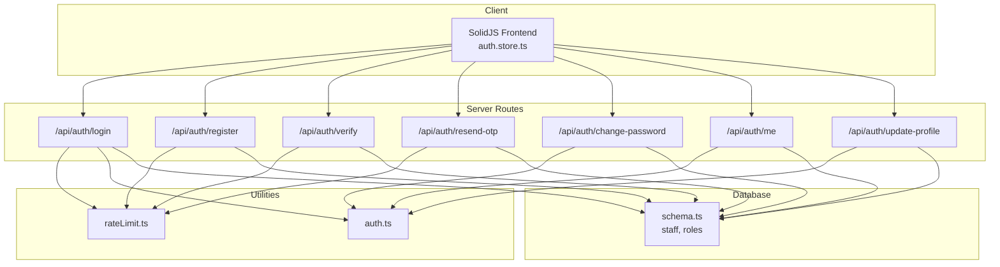
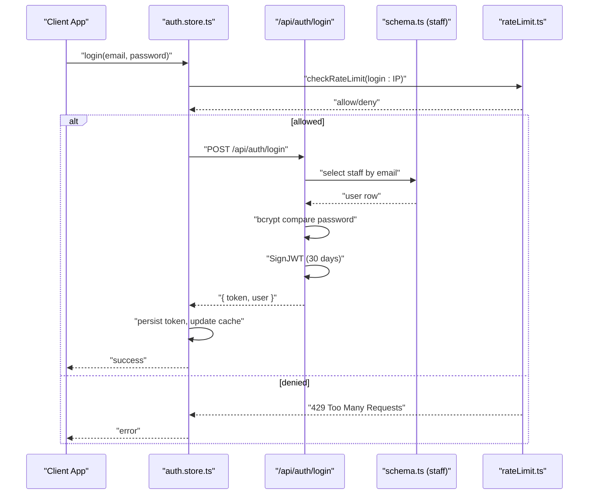
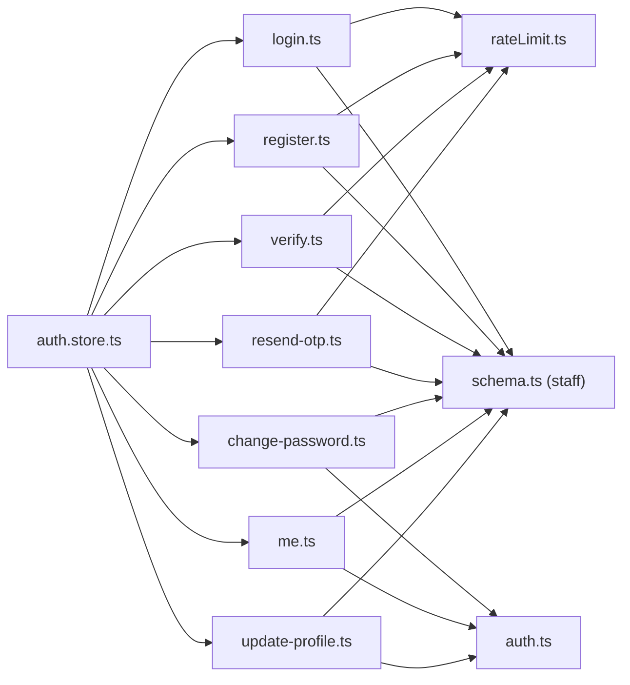

# Authentication API

<cite>
**Referenced Files in This Document**
- [login.ts](file://src/routes/api/auth/login.ts)
- [register.ts](file://src/routes/api/auth/register.ts)
- [verify.ts](file://src/routes/api/auth/verify.ts)
- [resend-otp.ts](file://src/routes/api/auth/resend-otp.ts)
- [change-password.ts](file://src/routes/api/auth/change-password.ts)
- [me.ts](file://src/routes/api/auth/me.ts)
- [update-profile.ts](file://src/routes/api/auth/update-profile.ts)
- [rateLimit.ts](file://src/server/utils/rateLimit.ts)
- [auth.ts](file://src/server/utils/auth.ts)
- [schema.ts](file://src/server/db/schema.ts)
- [auth.store.ts](file://src/stores/auth.ts)
</cite>

## Table of Contents
1. [Introduction](#introduction)
2. [Project Structure](#project-structure)
3. [Core Components](#core-components)
4. [Architecture Overview](#architecture-overview)
5. [Detailed Component Analysis](#detailed-component-analysis)
6. [Dependency Analysis](#dependency-analysis)
7. [Performance Considerations](#performance-considerations)
8. [Troubleshooting Guide](#troubleshooting-guide)
9. [Conclusion](#conclusion)

## Introduction
This document provides comprehensive API documentation for the NgePos authentication system. It covers HTTP endpoints for login, registration, email verification, OTP resending, password management, profile updates, and session retrieval. It also documents request/response schemas, authentication requirements, rate limiting, error handling, JWT token management, and client implementation guidelines.

## Project Structure
The authentication endpoints are implemented as server routes under the API namespace. Supporting utilities include rate limiting, JWT verification helpers, and database schema definitions. The frontend SolidJS store manages client-side authentication state and integrates with the backend APIs.

**Diagram sources**
- [auth.store.ts:1-206](file://src/stores/auth.ts#L1-L205)
- [login.ts:1-58](file://src/routes/api/auth/login.ts#L1-L58)
- [register.ts:1-66](file://src/routes/api/auth/register.ts#L1-L66)
- [verify.ts:1-63](file://src/routes/api/auth/verify.ts#L1-L63)
- [resend-otp.ts:1-66](file://src/routes/api/auth/resend-otp.ts#L1-L66)
- [change-password.ts:1-72](file://src/routes/api/auth/change-password.ts#L1-L72)
- [me.ts:1-60](file://src/routes/api/auth/me.ts#L1-L60)
- [update-profile.ts:1-58](file://src/routes/api/auth/update-profile.ts#L1-L58)
- [rateLimit.ts:1-52](file://src/server/utils/rateLimit.ts#L1-L52)
- [auth.ts:1-52](file://src/server/utils/auth.ts#L1-L52)
- [schema.ts:1-142](file://src/server/db/schema.ts#L1-L142)

**Section sources**
- [auth.store.ts:1-206](file://src/stores/auth.ts#L1-L205)
- [login.ts:1-58](file://src/routes/api/auth/login.ts#L1-L58)
- [register.ts:1-66](file://src/routes/api/auth/register.ts#L1-L66)
- [verify.ts:1-63](file://src/routes/api/auth/verify.ts#L1-L63)
- [resend-otp.ts:1-66](file://src/routes/api/auth/resend-otp.ts#L1-L66)
- [change-password.ts:1-72](file://src/routes/api/auth/change-password.ts#L1-L72)
- [me.ts:1-60](file://src/routes/api/auth/me.ts#L1-L60)
- [update-profile.ts:1-58](file://src/routes/api/auth/update-profile.ts#L1-L58)
- [rateLimit.ts:1-52](file://src/server/utils/rateLimit.ts#L1-L52)
- [auth.ts:1-52](file://src/server/utils/auth.ts#L1-L52)
- [schema.ts:1-142](file://src/server/db/schema.ts#L1-L142)

## Core Components
- Login: Validates credentials, checks account status and email verification, and issues a JWT.
- Registration: Creates a pending user with hashed password and OTP, sends verification email.
- Email Verification: Validates OTP and marks the user’s email as verified.
- OTP Resend: Generates and emails a new OTP for unverified accounts.
- Change Password: Requires a valid JWT and enforces old password verification and new password constraints.
- Get My Profile: Returns the authenticated user’s data and role.
- Update Profile: Updates name, email, and optional phone; enforces uniqueness of email.

**Section sources**
- [login.ts:1-58](file://src/routes/api/auth/login.ts#L1-L58)
- [register.ts:1-66](file://src/routes/api/auth/register.ts#L1-L66)
- [verify.ts:1-63](file://src/routes/api/auth/verify.ts#L1-L63)
- [resend-otp.ts:1-66](file://src/routes/api/auth/resend-otp.ts#L1-L66)
- [change-password.ts:1-72](file://src/routes/api/auth/change-password.ts#L1-L72)
- [me.ts:1-60](file://src/routes/api/auth/me.ts#L1-L60)
- [update-profile.ts:1-58](file://src/routes/api/auth/update-profile.ts#L1-L58)

## Architecture Overview
The authentication flow relies on bearer tokens issued by the server. Rate limiting is enforced per endpoint/IP. Database operations use Drizzle ORM with a PostgreSQL schema. The frontend store persists tokens and caches user data, invoking server endpoints for all authenticated actions.

**Diagram sources**
- [auth.store.ts:58-79](file://src/stores/auth.ts#L58-L79)
- [login.ts:9-57](file://src/routes/api/auth/login.ts#L9-L57)
- [rateLimit.ts:22-34](file://src/server/utils/rateLimit.ts#L22-L34)
- [schema.ts:11-25](file://src/server/db/schema.ts#L11-L25)

## Detailed Component Analysis

### Login
- Method: POST
- URL: /api/auth/login
- Authentication: None
- Rate Limit: 5 attempts per minute per IP
- Request body:
  - email: string (required)
  - password: string (required)
- Validation:
  - Rejects empty fields.
  - Requires active and email-verified account.
  - Compares password using bcrypt.
- Response:
  - 200 OK: { token, user: { id, name, email, role } }
  - 400 Bad Request: Missing fields or invalid password length.
  - 401 Unauthorized: Account not found or wrong password.
  - 403 Forbidden: Inactive account or unverified email (with requireVerification flag).
  - 500 Internal Server Error: Unexpected error.
- Security:
  - JWT expires in 30 days.
  - Password comparison via bcrypt.
  - Rate limiting prevents brute force.

**Section sources**
- [login.ts:9-57](file://src/routes/api/auth/login.ts#L9-L57)
- [rateLimit.ts:22-34](file://src/server/utils/rateLimit.ts#L22-L34)

### Register
- Method: POST
- URL: /api/auth/register
- Authentication: None
- Rate Limit: 3 attempts per 15 minutes per IP
- Request body:
  - name: string (required)
  - email: string (required)
  - password: string (required, minimum 6 characters)
- Validation:
  - Rejects missing fields or short passwords.
  - Checks for existing email.
  - Seeds roles before insert.
- Response:
  - 201 Created or 200 OK: { success, message, requireVerification, email }
  - 400 Bad Request: Duplicate email or invalid input.
  - 500 Internal Server Error: Unexpected error.
- Security:
  - Hashes password and OTP using bcrypt.
  - OTP expires in 15 minutes.
  - Sends verification email; proceeds even if email fails.

**Section sources**
- [register.ts:9-65](file://src/routes/api/auth/register.ts#L9-L65)
- [rateLimit.ts:22-34](file://src/server/utils/rateLimit.ts#L22-L34)

### Verify Email (OTP)
- Method: POST
- URL: /api/auth/verify
- Authentication: None
- Rate Limit: 5 attempts per minute per IP
- Request body:
  - email: string (required)
  - otpCode: string (required)
- Validation:
  - Rejects missing fields.
  - Ensures user exists and is not already verified.
  - Compares OTP using bcrypt.
  - Checks OTP expiration.
- Response:
  - 200 OK: { success, message }
  - 400 Bad Request: Invalid OTP or expired OTP.
  - 404 Not Found: User not found.
  - 500 Internal Server Error: Unexpected error.
- Security:
  - OTP is hashed and stored; expiration enforced.

**Section sources**
- [verify.ts:7-62](file://src/routes/api/auth/verify.ts#L7-L62)
- [rateLimit.ts:22-34](file://src/server/utils/rateLimit.ts#L22-L34)

### Resend OTP
- Method: POST
- URL: /api/auth/resend-otp
- Authentication: None
- Rate Limit: 3 attempts per 15 minutes per IP
- Request body:
  - email: string (required)
- Validation:
  - Rejects missing email.
  - Ensures user exists and is not verified.
  - Regenerates OTP and sets expiration.
- Response:
  - 200 OK: { success, message }
  - 400 Bad Request: Already verified or invalid OTP resend conditions.
  - 404 Not Found: User not found.
  - 500 Internal Server Error: Unexpected error.
- Security:
  - OTP regenerated and re-hashed; email sent securely.

**Section sources**
- [resend-otp.ts:8-65](file://src/routes/api/auth/resend-otp.ts#L8-L65)
- [rateLimit.ts:22-34](file://src/server/utils/rateLimit.ts#L22-L34)

### Change Password
- Method: POST
- URL: /api/auth/change-password
- Authentication: Bearer JWT required
- Request body:
  - oldPassword: string (required)
  - newPassword: string (required, minimum 6 characters)
- Validation:
  - Verifies JWT and extracts user ID.
  - Ensures old password matches stored hash.
  - Enforces new password length.
  - Updates password hash and updatedAt.
- Response:
  - 200 OK: { success, message }
  - 400 Bad Request: Missing fields, invalid old password, or short new password.
  - 401 Unauthorized: Invalid or missing Bearer token.
  - 404 Not Found: User not found.
  - 500 Internal Server Error: Unexpected error.
- Security:
  - JWT verification via jose.
  - New password hashed with bcrypt.

**Section sources**
- [change-password.ts:11-71](file://src/routes/api/auth/change-password.ts#L11-L71)
- [auth.ts:20-29](file://src/server/utils/auth.ts#L20-L29)

### Get My Profile (Session)
- Method: GET
- URL: /api/auth/me
- Authentication: Bearer JWT required
- Response:
  - 200 OK: { user: { id, name, email, phone, createdAt, roleId, role } }
  - 401 Unauthorized: Invalid or expired token.
  - 404 Not Found: User not found.
  - 500 Internal Server Error: Unexpected error.
- Security:
  - JWT verification via jose.
  - Role fetched if present.

**Section sources**
- [me.ts:10-59](file://src/routes/api/auth/me.ts#L10-L59)
- [auth.ts:20-29](file://src/server/utils/auth.ts#L20-L29)

### Update Profile
- Method: POST
- URL: /api/auth/update-profile
- Authentication: Bearer JWT required
- Request body:
  - name: string (required)
  - email: string (required)
  - phone: string (optional)
- Validation:
  - Verifies JWT and extracts user ID.
  - Ensures email is unique among other users.
  - Updates name, email, phone, and updatedAt.
- Response:
  - 200 OK: { success, message }
  - 400 Bad Request: Missing required fields or duplicate email.
  - 401 Unauthorized: Invalid or missing Bearer token.
  - 404 Not Found: User not found.
  - 500 Internal Server Error: Unexpected error.
- Security:
  - JWT verification via jose.
  - Email uniqueness enforced at DB level.

**Section sources**
- [update-profile.ts:10-57](file://src/routes/api/auth/update-profile.ts#L10-L57)
- [auth.ts:20-29](file://src/server/utils/auth.ts#L20-L29)

## Dependency Analysis
- Endpoint-to-utility dependencies:
  - login/register/verify/resend-otp use rateLimit.ts.
  - change-password/me/update-profile use auth.ts for JWT verification.
- Endpoint-to-database dependencies:
  - All endpoints read/write staff table; verify/me also read roles.
- Frontend-to-backend dependencies:
  - auth.store.ts invokes all endpoints and manages token persistence.

**Diagram sources**
- [login.ts:1-58](file://src/routes/api/auth/login.ts#L1-L58)
- [register.ts:1-66](file://src/routes/api/auth/register.ts#L1-L66)
- [verify.ts:1-63](file://src/routes/api/auth/verify.ts#L1-L63)
- [resend-otp.ts:1-66](file://src/routes/api/auth/resend-otp.ts#L1-L66)
- [change-password.ts:1-72](file://src/routes/api/auth/change-password.ts#L1-L72)
- [me.ts:1-60](file://src/routes/api/auth/me.ts#L1-L60)
- [update-profile.ts:1-58](file://src/routes/api/auth/update-profile.ts#L1-L58)
- [rateLimit.ts:1-52](file://src/server/utils/rateLimit.ts#L1-L52)
- [auth.ts:1-52](file://src/server/utils/auth.ts#L1-L52)
- [schema.ts:1-142](file://src/server/db/schema.ts#L1-L142)
- [auth.store.ts:1-206](file://src/stores/auth.ts#L1-L205)

**Section sources**
- [login.ts:1-58](file://src/routes/api/auth/login.ts#L1-L58)
- [register.ts:1-66](file://src/routes/api/auth/register.ts#L1-L66)
- [verify.ts:1-63](file://src/routes/api/auth/verify.ts#L1-L63)
- [resend-otp.ts:1-66](file://src/routes/api/auth/resend-otp.ts#L1-L66)
- [change-password.ts:1-72](file://src/routes/api/auth/change-password.ts#L1-L72)
- [me.ts:1-60](file://src/routes/api/auth/me.ts#L1-L60)
- [update-profile.ts:1-58](file://src/routes/api/auth/update-profile.ts#L1-L58)
- [rateLimit.ts:1-52](file://src/server/utils/rateLimit.ts#L1-L52)
- [auth.ts:1-52](file://src/server/utils/auth.ts#L1-L52)
- [schema.ts:1-142](file://src/server/db/schema.ts#L1-L142)
- [auth.store.ts:1-206](file://src/stores/auth.ts#L1-L205)

## Performance Considerations
- Rate limiting is enforced per endpoint and per IP using an in-memory store with periodic cleanup. This reduces server load and mitigates brute-force attacks.
- JWT signing and verification are lightweight; keep the JWT_SECRET secure and avoid excessive token refreshes.
- Database queries are simple and indexed; ensure the database connection pool and network latency are optimized for production.

[No sources needed since this section provides general guidance]

## Troubleshooting Guide
- 429 Too Many Requests: Indicates rate limit exceeded. Wait for the reset window or reduce request frequency.
- 401 Unauthorized: Missing or invalid Bearer token. Ensure the token is attached to Authorization header and has not expired.
- 403 Forbidden: Account inactive or email not verified during login. Prompt user to verify email or contact support.
- 400 Bad Request: Incorrect input (missing fields, invalid OTP, duplicate email, short password). Validate client-side before sending requests.
- 404 Not Found: User not found during verification/profile update/change password. Confirm email correctness and user existence.
- 500 Internal Server Error: Unexpected server errors. Retry after a delay and monitor logs.

**Section sources**
- [rateLimit.ts:46-51](file://src/server/utils/rateLimit.ts#L46-L51)
- [login.ts:18-35](file://src/routes/api/auth/login.ts#L18-L35)
- [verify.ts:16-42](file://src/routes/api/auth/verify.ts#L16-L42)
- [resend-otp.ts:17-32](file://src/routes/api/auth/resend-otp.ts#L17-L32)
- [change-password.ts:24-49](file://src/routes/api/auth/change-password.ts#L24-L49)
- [update-profile.ts:23-36](file://src/routes/api/auth/update-profile.ts#L23-L36)
- [me.ts:36-38](file://src/routes/api/auth/me.ts#L36-L38)

## Conclusion
NgePos authentication provides a robust, rate-limited, and secure set of endpoints for login, registration, email verification, OTP resending, password management, and profile updates. JWT-based session management ensures stateless authentication, while bcrypt secures sensitive data. The frontend store integrates seamlessly with these endpoints, persisting tokens and caching user data for a responsive user experience.