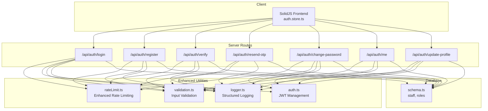
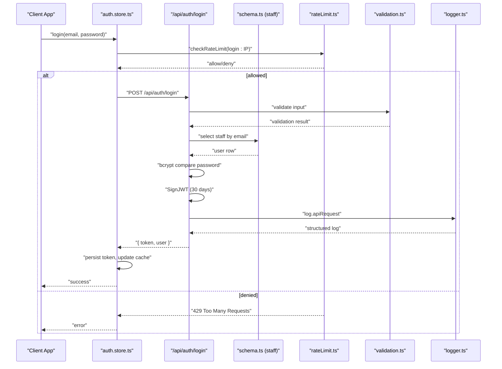
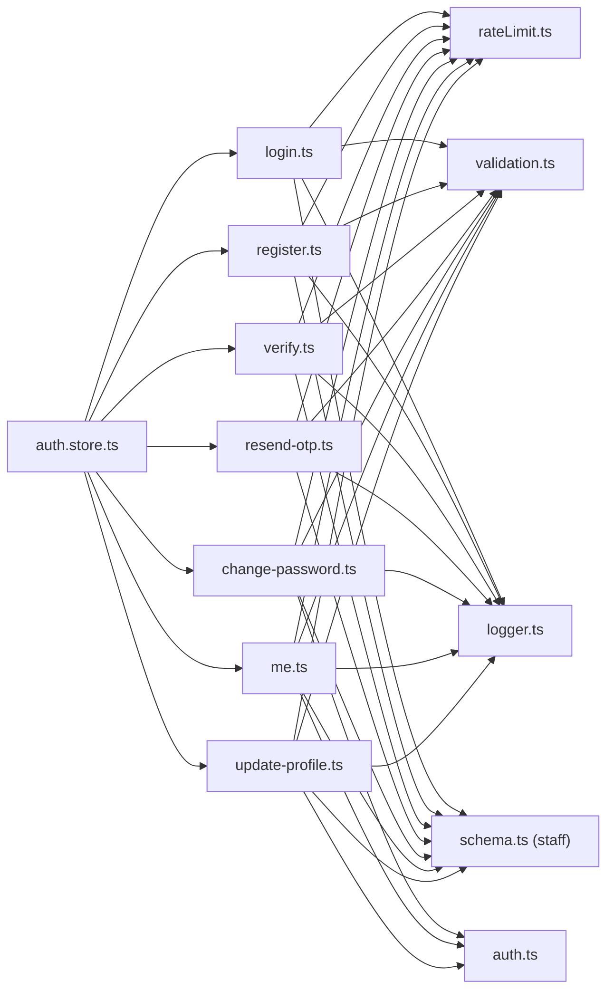

# Authentication API

<cite>
**Referenced Files in This Document**
- [login.ts](file://src/routes/api/auth/login.ts)
- [register.ts](file://src/routes/api/auth/register.ts)
- [verify.ts](file://src/routes/api/auth/verify.ts)
- [resend-otp.ts](file://src/routes/api/auth/resend-otp.ts)
- [change-password.ts](file://src/routes/api/auth/change-password.ts)
- [me.ts](file://src/routes/api/auth/me.ts)
- [update-profile.ts](file://src/routes/api/auth/update-profile.ts)
- [rateLimit.ts](file://src/server/utils/rateLimit.ts)
- [auth.ts](file://src/server/utils/auth.ts)
- [validation.ts](file://src/server/utils/validation.ts)
- [logger.ts](file://src/server/utils/logger.ts)
- [schema.ts](file://src/server/db/schema.ts)
- [auth.store.ts](file://src/stores/auth.ts)
</cite>

## Update Summary
**Changes Made**
- Enhanced authentication endpoints with comprehensive input validation utilities
- Implemented structured logging across all API endpoints for better observability
- Improved rate limiting with configurable limits per endpoint and better error handling
- Added comprehensive error handling with localized Indonesian error messages
- Enhanced JWT token management with improved security and error responses
- Updated validation rules for stronger input sanitization and security

## Table of Contents
1. [Introduction](#introduction)
2. [Project Structure](#project-structure)
3. [Core Components](#core-components)
4. [Architecture Overview](#architecture-overview)
5. [Detailed Component Analysis](#detailed-component-analysis)
6. [Dependency Analysis](#dependency-analysis)
7. [Performance Considerations](#performance-considerations)
8. [Troubleshooting Guide](#troubleshooting-guide)
9. [Conclusion](#conclusion)

## Introduction
This document provides comprehensive API documentation for the NgePos authentication system. It covers HTTP endpoints for login, registration, email verification, OTP resending, password management, profile updates, and session retrieval. The system now features enhanced input validation, structured logging, improved error handling, and comprehensive rate limiting for better security and observability.

## Project Structure
The authentication endpoints are implemented as server routes under the API namespace with enhanced validation and logging utilities. Supporting utilities include rate limiting, JWT verification helpers, structured logging, comprehensive validation, and database schema definitions. The frontend SolidJS store manages client-side authentication state and integrates with the backend APIs.

**Diagram sources**
- [auth.store.ts:1-206](file://src/stores/auth.ts#L1-L206)
- [login.ts:1-80](file://src/routes/api/auth/login.ts#L1-L80)
- [register.ts:1-77](file://src/routes/api/auth/register.ts#L1-L77)
- [verify.ts:1-63](file://src/routes/api/auth/verify.ts#L1-L63)
- [resend-otp.ts:1-66](file://src/routes/api/auth/resend-otp.ts#L1-L66)
- [change-password.ts:1-71](file://src/routes/api/auth/change-password.ts#L1-L71)
- [me.ts:1-52](file://src/routes/api/auth/me.ts#L1-L52)
- [update-profile.ts:1-57](file://src/routes/api/auth/update-profile.ts#L1-L57)
- [rateLimit.ts:1-52](file://src/server/utils/rateLimit.ts#L1-L52)
- [auth.ts:1-52](file://src/server/utils/auth.ts#L1-L52)
- [validation.ts:1-89](file://src/server/utils/validation.ts#L1-L89)
- [logger.ts:1-69](file://src/server/utils/logger.ts#L1-L69)
- [schema.ts:1-144](file://src/server/db/schema.ts#L1-L144)

**Section sources**
- [auth.store.ts:1-206](file://src/stores/auth.ts#L1-L206)
- [login.ts:1-80](file://src/routes/api/auth/login.ts#L1-L80)
- [register.ts:1-77](file://src/routes/api/auth/register.ts#L1-L77)
- [verify.ts:1-63](file://src/routes/api/auth/verify.ts#L1-L63)
- [resend-otp.ts:1-66](file://src/routes/api/auth/resend-otp.ts#L1-L66)
- [change-password.ts:1-71](file://src/routes/api/auth/change-password.ts#L1-L71)
- [me.ts:1-52](file://src/routes/api/auth/me.ts#L1-L52)
- [update-profile.ts:1-57](file://src/routes/api/auth/update-profile.ts#L1-L57)
- [rateLimit.ts:1-52](file://src/server/utils/rateLimit.ts#L1-L52)
- [auth.ts:1-52](file://src/server/utils/auth.ts#L1-L52)
- [validation.ts:1-89](file://src/server/utils/validation.ts#L1-L89)
- [logger.ts:1-69](file://src/server/utils/logger.ts#L1-L69)
- [schema.ts:1-144](file://src/server/db/schema.ts#L1-L144)

## Core Components
- **Login**: Validates credentials with comprehensive input validation, checks account status and email verification, and issues a JWT with structured logging.
- **Registration**: Creates a pending user with hashed password and OTP, sends verification email, and implements enhanced validation.
- **Email Verification**: Validates OTP with comprehensive validation and marks the user's email as verified.
- **OTP Resend**: Generates and emails a new OTP for unverified accounts with improved error handling.
- **Change Password**: Requires a valid JWT and enforces old password verification and new password constraints with enhanced security.
- **Get My Profile**: Returns the authenticated user's data and role with improved error handling.
- **Update Profile**: Updates name, email, and optional phone with enhanced validation and uniqueness enforcement.

**Updated** Enhanced with comprehensive input validation, structured logging, and improved error handling across all endpoints.

**Section sources**
- [login.ts:1-80](file://src/routes/api/auth/login.ts#L1-L80)
- [register.ts:1-77](file://src/routes/api/auth/register.ts#L1-L77)
- [verify.ts:1-63](file://src/routes/api/auth/verify.ts#L1-L63)
- [resend-otp.ts:1-66](file://src/routes/api/auth/resend-otp.ts#L1-L66)
- [change-password.ts:1-71](file://src/routes/api/auth/change-password.ts#L1-L71)
- [me.ts:1-52](file://src/routes/api/auth/me.ts#L1-L52)
- [update-profile.ts:1-57](file://src/routes/api/auth/update-profile.ts#L1-L57)

## Architecture Overview
The authentication flow relies on bearer tokens issued by the server with enhanced security measures. Rate limiting is enforced per endpoint/IP with configurable limits. Database operations use Drizzle ORM with a PostgreSQL schema. The frontend store persists tokens and caches user data, invoking server endpoints for all authenticated actions. All endpoints now feature structured logging for better observability and debugging.

**Diagram sources**
- [auth.store.ts:58-79](file://src/stores/auth.ts#L58-L79)
- [login.ts:13-79](file://src/routes/api/auth/login.ts#L13-L79)
- [rateLimit.ts:22-34](file://src/server/utils/rateLimit.ts#L22-L34)
- [validation.ts:37-49](file://src/server/utils/validation.ts#L37-L49)
- [logger.ts:49-66](file://src/server/utils/logger.ts#L49-L66)
- [schema.ts:11-25](file://src/server/db/schema.ts#L11-L25)

## Detailed Component Analysis

### Login
- **Method**: POST
- **URL**: /api/auth/login
- **Authentication**: None
- **Rate Limit**: 5 attempts per minute per IP
- **Request body**:
  - email: string (required, validated via regex)
  - password: string (required)
- **Enhanced Validation**:
  - Comprehensive input validation using validation.ts utilities
  - Email format validation with regex pattern
  - Structured logging for all operations and errors
  - Localized Indonesian error messages
- **Response**:
  - 200 OK: { token, user: { id, name, email, role } }
  - 400 Bad Request: Missing fields, invalid email format, or invalid password length
  - 401 Unauthorized: Account not found or wrong password
  - 403 Forbidden: Inactive account or unverified email (with requireVerification flag)
  - 500 Internal Server Error: Unexpected error with structured logging
- **Security**:
  - JWT expires in 30 days
  - Password comparison via bcrypt
  - Rate limiting prevents brute force
  - Structured logging for security monitoring

**Updated** Enhanced with comprehensive input validation, structured logging, and improved error handling.

**Section sources**
- [login.ts:13-79](file://src/routes/api/auth/login.ts#L13-L79)
- [rateLimit.ts:22-34](file://src/server/utils/rateLimit.ts#L22-L34)
- [validation.ts:6-9](file://src/server/utils/validation.ts#L6-L9)
- [logger.ts:49-66](file://src/server/utils/logger.ts#L49-L66)

### Register
- **Method**: POST
- **URL**: /api/auth/register
- **Authentication**: None
- **Rate Limit**: 3 attempts per 15 minutes per IP
- **Request body**:
  - name: string (required, 2-100 characters)
  - email: string (required, validated via regex)
  - password: string (required, minimum 6 characters, maximum 128)
- **Enhanced Validation**:
  - String length validation for name (2-100 characters)
  - Email format validation with regex pattern
  - Password strength validation with min/max length constraints
  - JSON parsing with error handling via safeParseJson
  - Structured logging for all operations
- **Response**:
  - 201 Created or 200 OK: { success, message, requireVerification, email }
  - 400 Bad Request: Duplicate email, invalid input, or password validation failure
  - 500 Internal Server Error: Unexpected error with structured logging
- **Security**:
  - Hashes password and OTP using bcrypt
  - OTP expires in 15 minutes
  - Sends verification email; proceeds even if email fails
  - Structured logging for security monitoring

**Updated** Enhanced with comprehensive input validation, structured logging, and improved error handling.

**Section sources**
- [register.ts:10-76](file://src/routes/api/auth/register.ts#L10-L76)
- [rateLimit.ts:22-34](file://src/server/utils/rateLimit.ts#L22-L34)
- [validation.ts:11-14](file://src/server/utils/validation.ts#L11-L14)
- [validation.ts:26-35](file://src/server/utils/validation.ts#L26-L35)
- [validation.ts:37-49](file://src/server/utils/validation.ts#L37-L49)

### Verify Email (OTP)
- **Method**: POST
- **URL**: /api/auth/verify
- **Authentication**: None
- **Rate Limit**: 5 attempts per minute per IP
- **Request body**:
  - email: string (required)
  - otpCode: string (required)
- **Enhanced Validation**:
  - Basic field validation for email and OTP
  - Structured logging for all operations and security events
  - Localized Indonesian error messages
- **Response**:
  - 200 OK: { success, message }
  - 400 Bad Request: Invalid OTP, expired OTP, or validation failure
  - 404 Not Found: User not found
  - 500 Internal Server Error: Unexpected error with structured logging
- **Security**:
  - OTP is hashed and stored
  - Expiration enforcement with bcrypt comparison
  - Structured logging for security monitoring

**Updated** Enhanced with structured logging, improved error handling, and better validation.

**Section sources**
- [verify.ts:7-62](file://src/routes/api/auth/verify.ts#L7-L62)
- [rateLimit.ts:22-34](file://src/server/utils/rateLimit.ts#L22-L34)
- [logger.ts:49-66](file://src/server/utils/logger.ts#L49-L66)

### Resend OTP
- **Method**: POST
- **URL**: /api/auth/resend-otp
- **Authentication**: None
- **Rate Limit**: 3 attempts per 15 minutes per IP
- **Request body**:
  - email: string (required)
- **Enhanced Validation**:
  - Basic email validation
  - Structured logging for all operations
  - Localized Indonesian error messages
- **Response**:
  - 200 OK: { success, message }
  - 400 Bad Request: Already verified or invalid OTP resend conditions
  - 404 Not Found: User not found
  - 500 Internal Server Error: Unexpected error with structured logging
- **Security**:
  - OTP regenerated and re-hashed
  - Email sent securely
  - Structured logging for security monitoring

**Updated** Enhanced with structured logging, improved error handling, and better validation.

**Section sources**
- [resend-otp.ts:8-65](file://src/routes/api/auth/resend-otp.ts#L8-L65)
- [rateLimit.ts:22-34](file://src/server/utils/rateLimit.ts#L22-L34)
- [logger.ts:49-66](file://src/server/utils/logger.ts#L49-L66)

### Change Password
- **Method**: POST
- **URL**: /api/auth/change-password
- **Authentication**: Bearer JWT required
- **Rate Limit**: 5 attempts per 15 minutes per IP
- **Request body**:
  - oldPassword: string (required)
  - newPassword: string (required, minimum 6 characters)
- **Enhanced Validation**:
  - JWT verification with enhanced error handling
  - Extracts user ID from JWT payload
  - Ensures old password matches stored hash
  - Enforces new password length with validation
  - Updates password hash and updatedAt
  - Structured logging for all operations
- **Response**:
  - 200 OK: { success, message }
  - 400 Bad Request: Missing fields, invalid old password, or short new password
  - 401 Unauthorized: Invalid or missing Bearer token
  - 404 Not Found: User not found
  - 500 Internal Server Error: Unexpected error with structured logging
- **Security**:
  - JWT verification via jose with enhanced error handling
  - New password hashed with bcrypt
  - Structured logging for security monitoring

**Updated** Enhanced with structured logging, improved error handling, and better validation.

**Section sources**
- [change-password.ts:8-70](file://src/routes/api/auth/change-password.ts#L8-L70)
- [auth.ts:20-29](file://src/server/utils/auth.ts#L20-L29)
- [rateLimit.ts:22-34](file://src/server/utils/rateLimit.ts#L22-L34)
- [logger.ts:49-66](file://src/server/utils/logger.ts#L49-L66)

### Get My Profile (Session)
- **Method**: GET
- **URL**: /api/auth/me
- **Authentication**: Bearer JWT required
- **Enhanced Validation**:
  - JWT verification with enhanced error handling
  - Role fetching with proper error handling
  - Structured logging for all operations
- **Response**:
  - 200 OK: { user: { id, name, email, phone, createdAt, roleId, role } }
  - 401 Unauthorized: Invalid or expired token
  - 404 Not Found: User not found
  - 500 Internal Server Error: Unexpected error with structured logging
- **Security**:
  - JWT verification via jose with enhanced error handling
  - Role fetched if present
  - Structured logging for security monitoring

**Updated** Enhanced with structured logging, improved error handling, and better validation.

**Section sources**
- [me.ts:6-51](file://src/routes/api/auth/me.ts#L6-L51)
- [auth.ts:20-29](file://src/server/utils/auth.ts#L20-L29)
- [logger.ts:49-66](file://src/server/utils/logger.ts#L49-L66)

### Update Profile
- **Method**: POST
- **URL**: /api/auth/update-profile
- **Authentication**: Bearer JWT required
- **Rate Limit**: 10 attempts per minute per IP
- **Request body**:
  - name: string (required, 2-100 characters)
  - email: string (required, validated via regex)
  - phone: string (optional)
- **Enhanced Validation**:
  - JWT verification with enhanced error handling
  - Extracts user ID from JWT payload
  - Ensures email is unique among other users
  - String length validation for name (2-100 characters)
  - Email format validation with regex pattern
  - Updates name, email, phone, and updatedAt
  - Structured logging for all operations
- **Response**:
  - 200 OK: { success, message }
  - 400 Bad Request: Missing required fields, duplicate email, or validation failure
  - 401 Unauthorized: Invalid or missing Bearer token
  - 404 Not Found: User not found
  - 500 Internal Server Error: Unexpected error with structured logging
- **Security**:
  - JWT verification via jose with enhanced error handling
  - Email uniqueness enforced at DB level
  - Structured logging for security monitoring

**Updated** Enhanced with structured logging, improved error handling, and better validation.

**Section sources**
- [update-profile.ts:7-56](file://src/routes/api/auth/update-profile.ts#L7-L56)
- [auth.ts:20-29](file://src/server/utils/auth.ts#L20-L29)
- [rateLimit.ts:22-34](file://src/server/utils/rateLimit.ts#L22-L34)
- [validation.ts:11-14](file://src/server/utils/validation.ts#L11-L14)
- [validation.ts:6-9](file://src/server/utils/validation.ts#L6-L9)
- [logger.ts:49-66](file://src/server/utils/logger.ts#L49-L66)

## Dependency Analysis
- **Endpoint-to-utility dependencies**:
  - All endpoints use enhanced rateLimit.ts with configurable limits
  - All endpoints use validation.ts for comprehensive input validation
  - All endpoints use logger.ts for structured logging
  - change-password/me/update-profile use auth.ts for JWT verification
- **Endpoint-to-database dependencies**:
  - All endpoints read/write staff table; verify/me also read roles
- **Frontend-to-backend dependencies**:
  - auth.store.ts invokes all endpoints and manages token persistence

**Updated** Enhanced with comprehensive validation utilities, structured logging, and improved error handling across all dependencies.

**Diagram sources**
- [login.ts:1-80](file://src/routes/api/auth/login.ts#L1-L80)
- [register.ts:1-77](file://src/routes/api/auth/register.ts#L1-L77)
- [verify.ts:1-63](file://src/routes/api/auth/verify.ts#L1-L63)
- [resend-otp.ts:1-66](file://src/routes/api/auth/resend-otp.ts#L1-L66)
- [change-password.ts:1-71](file://src/routes/api/auth/change-password.ts#L1-L71)
- [me.ts:1-52](file://src/routes/api/auth/me.ts#L1-L52)
- [update-profile.ts:1-57](file://src/routes/api/auth/update-profile.ts#L1-L57)
- [rateLimit.ts:1-52](file://src/server/utils/rateLimit.ts#L1-L52)
- [auth.ts:1-52](file://src/server/utils/auth.ts#L1-L52)
- [validation.ts:1-89](file://src/server/utils/validation.ts#L1-L89)
- [logger.ts:1-69](file://src/server/utils/logger.ts#L1-L69)
- [schema.ts:1-144](file://src/server/db/schema.ts#L1-L144)
- [auth.store.ts:1-206](file://src/stores/auth.ts#L1-L206)

**Section sources**
- [login.ts:1-80](file://src/routes/api/auth/login.ts#L1-L80)
- [register.ts:1-77](file://src/routes/api/auth/register.ts#L1-L77)
- [verify.ts:1-63](file://src/routes/api/auth/verify.ts#L1-L63)
- [resend-otp.ts:1-66](file://src/routes/api/auth/resend-otp.ts#L1-L66)
- [change-password.ts:1-71](file://src/routes/api/auth/change-password.ts#L1-L71)
- [me.ts:1-52](file://src/routes/api/auth/me.ts#L1-L52)
- [update-profile.ts:1-57](file://src/routes/api/auth/update-profile.ts#L1-L57)
- [rateLimit.ts:1-52](file://src/server/utils/rateLimit.ts#L1-L52)
- [auth.ts:1-52](file://src/server/utils/auth.ts#L1-L52)
- [validation.ts:1-89](file://src/server/utils/validation.ts#L1-L89)
- [logger.ts:1-69](file://src/server/utils/logger.ts#L1-L69)
- [schema.ts:1-144](file://src/server/db/schema.ts#L1-L144)
- [auth.store.ts:1-206](file://src/stores/auth.ts#L1-L206)

## Performance Considerations
- **Enhanced Rate limiting**: Enforced per endpoint and per IP using an in-memory store with periodic cleanup. Configurable limits per endpoint for optimal performance.
- **Structured Logging**: All endpoints use consistent logging format with context, levels, and timestamps for better observability and debugging.
- **Comprehensive Validation**: Input validation utilities centralize common validation patterns for consistency and performance.
- **JWT signing and verification**: Lightweight operations with enhanced error handling; keep the JWT_SECRET secure and avoid excessive token refreshes.
- **Database queries**: Optimized with simple and indexed queries; ensure the database connection pool and network latency are optimized for production.

**Updated** Enhanced with structured logging, comprehensive validation, and improved rate limiting for better performance and observability.

## Troubleshooting Guide
- **429 Too Many Requests**: Indicates rate limit exceeded. Wait for the reset window or reduce request frequency. Different endpoints have different rate limits (5/min for login/verify, 3/15min for register/resend-otp, 10/min for update-profile).
- **401 Unauthorized**: Missing or invalid Bearer token. Ensure the token is attached to Authorization header and has not expired.
- **403 Forbidden**: Account inactive or email not verified during login. Prompt user to verify email or contact support.
- **400 Bad Request**: Incorrect input validation failures (missing fields, invalid OTP, duplicate email, short password, invalid email format). Validate client-side before sending requests.
- **404 Not Found**: User not found during verification/profile update/change password. Confirm email correctness and user existence.
- **500 Internal Server Error**: Unexpected server errors with structured logging. Check server logs for detailed error information.
- **Localized Error Messages**: All endpoints now return Indonesian error messages for better user experience.

**Updated** Enhanced with structured logging, improved error handling, and better error messages.

**Section sources**
- [rateLimit.ts:45-51](file://src/server/utils/rateLimit.ts#L45-L51)
- [login.ts:27-29](file://src/routes/api/auth/login.ts#L27-L29)
- [login.ts:31-33](file://src/routes/api/auth/login.ts#L31-L33)
- [verify.ts:16-18](file://src/routes/api/auth/verify.ts#L16-L18)
- [resend-otp.ts:17-19](file://src/routes/api/auth/resend-otp.ts#L17-L19)
- [change-password.ts:20-26](file://src/routes/api/auth/change-password.ts#L20-L26)
- [update-profile.ts:19-21](file://src/routes/api/auth/update-profile.ts#L19-L21)
- [me.ts:25-27](file://src/routes/api/auth/me.ts#L25-L27)

## Conclusion
NgePos authentication provides a robust, rate-limited, and secure set of endpoints for login, registration, email verification, OTP resending, password management, and profile updates. The enhanced system features comprehensive input validation, structured logging, improved error handling, and configurable rate limiting for better security and observability. JWT-based session management ensures stateless authentication, while bcrypt secures sensitive data. The frontend store integrates seamlessly with these endpoints, persisting tokens and caching user data for a responsive user experience. All endpoints now feature consistent logging for better monitoring and debugging capabilities.