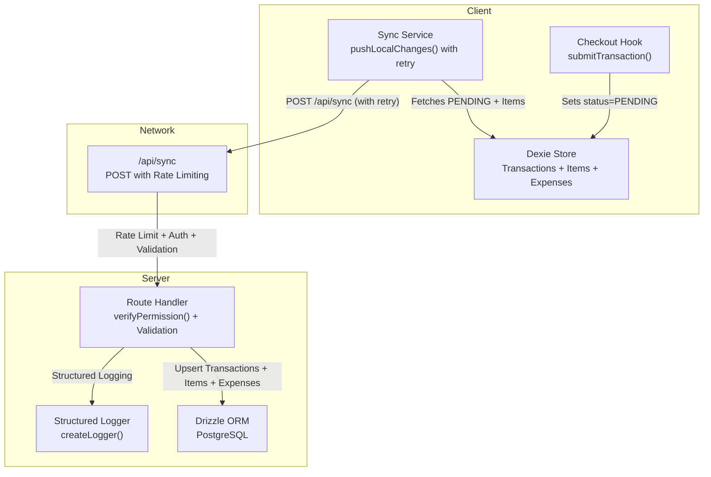
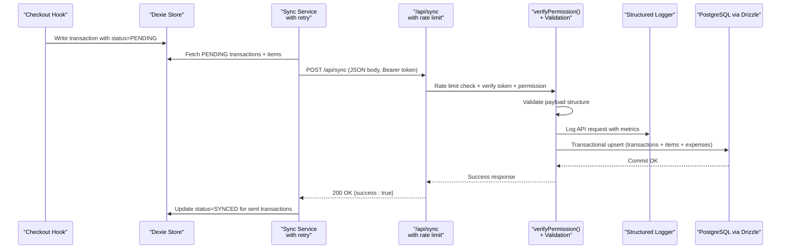
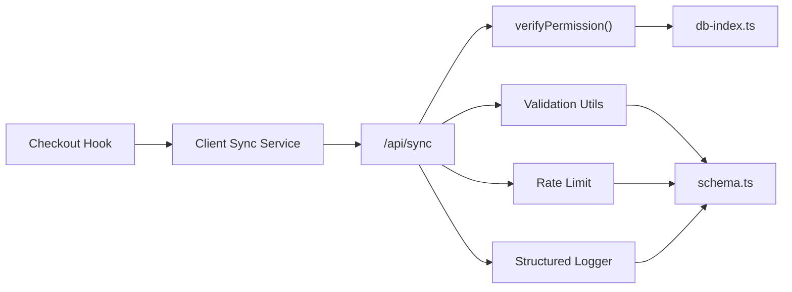

# Synchronization API

<cite>
**Referenced Files in This Document**
- [index.ts](file://src/routes/api/sync/index.ts)
- [syncService.ts](file://src/lib/syncService.ts)
- [useCheckout.ts](file://src/hooks/useCheckout.ts)
- [db.ts](file://src/db/db.ts)
- [schema.ts](file://src/server/db/schema.ts)
- [auth.ts](file://src/server/utils/auth.ts)
- [validation.ts](file://src/server/utils/validation.ts)
- [logger.ts](file://src/server/utils/logger.ts)
- [rateLimit.ts](file://src/server/utils/rateLimit.ts)
</cite>

## Update Summary
**Changes Made**
- Completely rewritten sync API endpoint with new authentication and validation utilities
- Added structured logging with detailed API request tracking
- Enhanced error reporting with improved error messages and status codes
- Implemented rate limiting for sync requests
- Added comprehensive payload validation with detailed error reporting
- Enhanced permission checking with admin bypass functionality
- Improved retry mechanisms with exponential backoff and maximum attempts

## Table of Contents
1. [Introduction](#introduction)
2. [Project Structure](#project-structure)
3. [Core Components](#core-components)
4. [Architecture Overview](#architecture-overview)
5. [Detailed Component Analysis](#detailed-component-analysis)
6. [Dependency Analysis](#dependency-analysis)
7. [Performance Considerations](#performance-considerations)
8. [Troubleshooting Guide](#troubleshooting-guide)
9. [Conclusion](#conclusion)

## Introduction
This document describes the NgePos synchronization API designed for an offline-first architecture. The API has been completely rewritten with enhanced security, validation, logging, and error handling capabilities. It covers the HTTP endpoint, request/response schemas, synchronization protocol for batch data processing, offline data management, conflict resolution strategy, and operational guidance for performance and debugging.

NgePos uses:
- Client-side IndexedDB via Dexie for offline storage of transactions, items, and expenses.
- A background sync service that pushes locally "PENDING" transactions to the server with retry mechanisms.
- A server endpoint that accepts batches of transactions and expenses, upserting them into PostgreSQL via Drizzle ORM with comprehensive validation and logging.

## Project Structure
The synchronization pipeline spans client and server with enhanced security and monitoring:
- Client: Dexie-backed offline store and a sync service with retry logic and exponential backoff.
- Server: A route handler with comprehensive validation, rate limiting, structured logging, and enhanced error reporting.

**Diagram sources**
- [index.ts:10-155](file://src/routes/api/sync/index.ts#L10-L155)
- [syncService.ts:8-111](file://src/lib/syncService.ts#L8-L111)
- [useCheckout.ts:55-235](file://src/hooks/useCheckout.ts#L55-L235)
- [db.ts:270-495](file://src/db/db.ts#L270-L495)
- [schema.ts:35-80](file://src/server/db/schema.ts#L35-L80)
- [auth.ts:32-51](file://src/server/utils/auth.ts#L32-L51)
- [logger.ts:29-68](file://src/server/utils/logger.ts#L29-L68)

**Section sources**
- [index.ts:10-155](file://src/routes/api/sync/index.ts#L10-L155)
- [syncService.ts:8-111](file://src/lib/syncService.ts#L8-L111)
- [useCheckout.ts:55-235](file://src/hooks/useCheckout.ts#L55-L235)
- [db.ts:270-495](file://src/db/db.ts#L270-L495)
- [schema.ts:35-80](file://src/server/db/schema.ts#L35-L80)
- [auth.ts:32-51](file://src/server/utils/auth.ts#L32-L51)
- [logger.ts:29-68](file://src/server/utils/logger.ts#L29-L68)

## Core Components
- **Enhanced Synchronization Endpoint**: POST /api/sync with comprehensive validation and rate limiting
- **Client Sync Service**: fetches PENDING transactions and items, sends to server with retry logic, marks synced on success
- **Server Route Handler**: verifies permissions, parses and validates payload, performs transactional upserts with structured logging
- **Offline Store**: Dexie tables for transactions, transaction items, and expenses
- **Conflict Resolution**: upsert semantics on primary keys with explicit field updates
- **Structured Logging**: detailed API request tracking with performance metrics
- **Rate Limiting**: 20 syncs per minute per IP address
- **Enhanced Validation**: comprehensive payload validation with detailed error reporting

Key responsibilities:
- Client: enqueue work locally, debounce requests, mark successful uploads, implement retry with exponential backoff
- Server: validate identity and permissions, validate payload structure, persist data atomically, log API requests with performance metrics

**Section sources**
- [index.ts:10-155](file://src/routes/api/sync/index.ts#L10-L155)
- [syncService.ts:8-111](file://src/lib/syncService.ts#L8-L111)
- [db.ts:270-495](file://src/db/db.ts#L270-L495)
- [schema.ts:35-80](file://src/server/db/schema.ts#L35-L80)
- [auth.ts:32-51](file://src/server/utils/auth.ts#L32-L51)
- [logger.ts:29-68](file://src/server/utils/logger.ts#L29-L68)
- [rateLimit.ts:22-34](file://src/server/utils/rateLimit.ts#L22-L34)

## Architecture Overview
High-level flow with enhanced security and monitoring:
1. Client creates transactions with status PENDING.
2. Sync service periodically collects PENDING transactions and associated items.
3. Sync service posts a batch to /api/sync with Authorization header and retry logic.
4. Server applies rate limiting, verifies token and permission, validates payload structure.
5. Server performs transactional upserts with structured logging.
6. On success, client marks transactions as SYNCED.

**Diagram sources**
- [useCheckout.ts:55-235](file://src/hooks/useCheckout.ts#L55-L235)
- [syncService.ts:8-111](file://src/lib/syncService.ts#L8-L111)
- [index.ts:10-155](file://src/routes/api/sync/index.ts#L10-L155)
- [auth.ts:32-51](file://src/server/utils/auth.ts#L32-L51)
- [schema.ts:35-80](file://src/server/db/schema.ts#L35-L80)
- [logger.ts:49-66](file://src/server/utils/logger.ts#L49-L66)

## Detailed Component Analysis

### Enhanced Endpoint Definition
- **Method**: POST
- **URL**: /api/sync
- **Authentication**: Bearer token required
- **Permissions**: VIEW_TRANSACTIONS (admin role bypass)
- **Rate Limiting**: 20 syncs per minute per IP
- **Content-Type**: application/json

**Updated** Enhanced with rate limiting, structured logging, and comprehensive validation

Request body (JSON):
- **transactions**: array of transaction objects (see Transaction Payload below)
- **expenses**: array of expense objects (see Expense Payload below)

Response:
- **On success**: 200 OK with { success: true }
- **On authentication error**: 401 Unauthorized
- **On insufficient permissions**: 403 Forbidden
- **On rate limit exceeded**: 429 Too Many Requests
- **On validation errors**: 400 Bad Request with specific error message
- **On server errors**: 500 Internal Server Error with { error, detail }

Notes:
- The server enforces a transactional block to ensure consistency across inserts/upserts.
- Upserts are performed on primary keys to handle offline duplicates.
- Comprehensive payload validation ensures data integrity.
- Structured logging tracks all API requests with performance metrics.

**Section sources**
- [index.ts:10-155](file://src/routes/api/sync/index.ts#L10-L155)
- [auth.ts:32-51](file://src/server/utils/auth.ts#L32-L51)
- [rateLimit.ts:22-51](file://src/server/utils/rateLimit.ts#L22-L51)
- [logger.ts:49-66](file://src/server/utils/logger.ts#L49-L66)

### Enhanced Transaction Payload Schema
Fields included in each transaction object:
- **id**: string (client-generated UUID)
- **receiptNumber**: string
- **totalAmount**: number (sent as string to preserve precision)
- **originalAmount**: number (sent as string to preserve precision)
- **cogsTotal**: number (sent as string to preserve precision)
- **paymentMethod**: string
- **timestamp**: number (Unix milliseconds)
- **status**: string literal "SYNCED"
- **isBackdated**: boolean
- **backdatedNote**: string (optional)
- **discountTotal**: number (optional, sent as string)
- **customerId**: string (optional)
- **cashierName**: string (optional)
- **isAdjustment**: boolean (optional)

**Updated** Added cashierName and isAdjustment fields

Constraints:
- All monetary fields are converted to strings before insertion to maintain precision.
- Timestamps are stored as Postgres timestamps.
- Status is always set to "SYNCED" during upsert.

**Section sources**
- [index.ts:76-91](file://src/routes/api/sync/index.ts#L76-L91)
- [schema.ts:35-55](file://src/server/db/schema.ts#L35-L55)

### Enhanced Transaction Item Payload Schema
Fields included in each transaction item object:
- **id**: string (client-generated UUID)
- **transactionId**: string (links to parent transaction)
- **productId**: string
- **productName**: string
- **quantity**: number
- **priceAtTime**: number (sent as string)
- **cogsAtTime**: number (sent as string)
- **selectedVariants**: array of variant selections (optional)

**Updated** Enhanced validation with comprehensive field checks

Constraints:
- All monetary fields are converted to strings before insertion.
- selectedVariants are stored as JSONB on the server.
- Quantity must be greater than 0.

**Section sources**
- [index.ts:99-109](file://src/routes/api/sync/index.ts#L99-L109)
- [schema.ts:58-69](file://src/server/db/schema.ts#L58-L69)
- [validation.ts:52-62](file://src/server/utils/validation.ts#L52-L62)

### Enhanced Expense Payload Schema
Fields included in each expense object:
- **id**: string (client-generated UUID)
- **amount**: number (sent as string)
- **category**: string (enum-like string)
- **description**: string
- **timestamp**: number (Unix milliseconds)
- **isBackdated**: boolean

**Updated** Enhanced validation with comprehensive field checks

Constraints:
- Amounts are converted to strings before insertion.
- Expenses are upserted by id.
- Amount must be non-negative.

**Section sources**
- [index.ts:122-129](file://src/routes/api/sync/index.ts#L122-L129)
- [schema.ts:72-82](file://src/server/db/schema.ts#L72-L82)
- [validation.ts:79-88](file://src/server/utils/validation.ts#L79-L88)

### Enhanced Client-Side Sync Flow
Responsibilities:
- Detect PENDING transactions and collect associated items
- Build batch payload with transactions and expenses
- Send to /api/sync with Authorization header
- On success, mark transactions as SYNCED
- Implement retry logic with exponential backoff

**Updated** Enhanced with retry mechanisms and exponential backoff

Debouncing:
- A 3-second debounce prevents rapid-fire requests.

Retry Logic:
- **Max Attempts**: 5 retries
- **Base Delay**: 1 second (1000ms)
- **Exponential Backoff**: BASE_DELAY * 2^(retryCount-1) + random jitter
- **Auth Errors**: No retry (logout)
- **Server Errors**: Automatic retry with exponential backoff

Triggering:
- Checkout sets transaction status to PENDING and triggers sync.

**Section sources**
- [syncService.ts:8-111](file://src/lib/syncService.ts#L8-L111)
- [useCheckout.ts:55-235](file://src/hooks/useCheckout.ts#L55-L235)

### Enhanced Server-Side Processing Logic
**Updated** Completely rewritten with comprehensive validation, rate limiting, and structured logging

- **Rate Limiting**: 20 syncs per minute per IP address
- **Authentication and permission verification**: with admin role bypass
- **Payload validation**: comprehensive structure and field validation
- **Transactional block**: for all writes with detailed error handling
- **Upsert logic**:
  - Transactions: upsert by id with enhanced field mapping
  - Transaction items: upsert by id with validation
  - Expenses: upsert by id with validation
- **Structured logging**: detailed API request tracking with performance metrics
- **Error handling**:
  - Auth errors mapped to 401/403
  - Validation errors mapped to 400 with specific messages
  - Rate limit errors mapped to 429
  - Other errors mapped to 500 with sanitized message

**Section sources**
- [index.ts:10-155](file://src/routes/api/sync/index.ts#L10-L155)
- [auth.ts:32-51](file://src/server/utils/auth.ts#L32-L51)
- [validation.ts:38-88](file://src/server/utils/validation.ts#L38-L88)
- [logger.ts:49-66](file://src/server/utils/logger.ts#L49-L66)
- [rateLimit.ts:22-51](file://src/server/utils/rateLimit.ts#L22-L51)

### Enhanced Conflict Resolution Strategy
**Updated** Enhanced with comprehensive validation and error reporting

- Upsert semantics on primary keys ensure idempotent writes.
- Explicit field updates overwrite conflicting rows.
- No last-write-wins timestamp is enforced; upsert replaces with latest client-provided values.
- Comprehensive validation ensures data integrity before upsert.
- Detailed error messages help identify invalid data structures.
- Recommendation: if strict ordering is required, add a server-side timestamp and compare logic in future iterations.

**Section sources**
- [index.ts:93-96](file://src/routes/api/sync/index.ts#L93-L96)
- [index.ts:110-113](file://src/routes/api/sync/index.ts#L110-L113)
- [index.ts:130-133](file://src/routes/api/sync/index.ts#L130-L133)
- [validation.ts:65-76](file://src/server/utils/validation.ts#L65-L76)

### Enhanced Data Transformation Rules
**Updated** Enhanced with comprehensive validation and error handling

- Monetary values are converted to strings before insertion to preserve precision.
- Timestamps are converted to Date objects on the server.
- Selected variants are stored as JSONB.
- All fields undergo comprehensive validation before processing.
- Invalid fields trigger specific error responses with detailed messages.

**Section sources**
- [index.ts:79, 80, 81, 87:79-87](file://src/routes/api/sync/index.ts#L79-L87)
- [index.ts:106, 107:106-107](file://src/routes/api/sync/index.ts#L106-L107)
- [index.ts:124](file://src/routes/api/sync/index.ts#L124)
- [validation.ts:38-88](file://src/server/utils/validation.ts#L38-L88)

### Enhanced Error Handling and Retry Mechanisms
**Updated** Enhanced with comprehensive error handling and retry logic

- **Client**:
  - **Retry Logic**: Exponential backoff with maximum 5 attempts
  - **Auth Errors**: No retry, logout immediately
  - **Server Errors**: Automatic retry with exponential backoff
  - **Jitter**: Random 500ms jitter added to prevent thundering herd
  - **Toast Notifications**: User-friendly error messages
  - **Debounce**: Prevents rapid-fire requests
- **Server**:
  - **Rate Limiting**: Prevents abuse with 429 responses
  - **Authentication Errors**: 401 Unauthorized
  - **Permission Errors**: 403 Forbidden
  - **Validation Errors**: 400 Bad Request with specific messages
  - **General Failures**: 500 Internal Server Error with sanitized message
  - **Structured Logging**: Detailed error tracking with timestamps and metrics

**Section sources**
- [syncService.ts:81-100](file://src/lib/syncService.ts#L81-L100)
- [syncService.ts:69-75](file://src/lib/syncService.ts#L69-L75)
- [index.ts:142-153](file://src/routes/api/sync/index.ts#L142-L153)
- [rateLimit.ts:46-51](file://src/server/utils/rateLimit.ts#L46-L51)
- [logger.ts:49-66](file://src/server/utils/logger.ts#L49-L66)

### Enhanced Practical Examples

**Updated** Enhanced with new validation and error handling scenarios

- **Example**: Submitting a transaction batch
  - Client collects PENDING transactions and their items, builds a JSON payload, and posts to /api/sync with Authorization: Bearer <token>.
  - Server applies rate limiting, validates payload structure, and responds 200 with success; client updates statuses to SYNCED.

- **Example**: Handling expenses
  - Client sends expenses array; server validates each expense structure and upserts by id.

- **Example**: Offline-first checkout
  - Checkout writes a transaction with status PENDING and triggers sync; later network connectivity uploads the batch with retry logic.

- **Example**: Rate Limiting
  - Server rejects sync requests exceeding 20 per minute per IP with 429 status and detailed error message.

- **Example**: Validation Errors
  - Server returns 400 with specific error messages when transaction items are missing required fields.

**Section sources**
- [syncService.ts:12-75](file://src/lib/syncService.ts#L12-L75)
- [useCheckout.ts:55-235](file://src/hooks/useCheckout.ts#L55-L235)
- [index.ts:10-155](file://src/routes/api/sync/index.ts#L10-L155)
- [rateLimit.ts:22-51](file://src/server/utils/rateLimit.ts#L22-L51)
- [validation.ts:42-48](file://src/server/utils/validation.ts#L42-L48)

## Dependency Analysis
**Updated** Enhanced with new dependencies for validation, logging, and rate limiting

- **Client depends on**:
  - Dexie for local storage
  - Local storage for auth token
  - Sync service for network operations with retry logic
- **Server depends on**:
  - Drizzle ORM for PostgreSQL
  - JWT verification for authentication
  - Permission lookup via staff and roles tables
  - **New**: Validation utilities for comprehensive payload validation
  - **New**: Structured logging for API request tracking
  - **New**: Rate limiting for request control

**Diagram sources**
- [syncService.ts:8-111](file://src/lib/syncService.ts#L8-L111)
- [useCheckout.ts:228-233](file://src/hooks/useCheckout.ts#L228-L233)
- [index.ts:10-155](file://src/routes/api/sync/index.ts#L10-L155)
- [auth.ts:32-51](file://src/server/utils/auth.ts#L32-L51)
- [validation.ts:38-88](file://src/server/utils/validation.ts#L38-L88)
- [rateLimit.ts:22-51](file://src/server/utils/rateLimit.ts#L22-L51)
- [logger.ts:29-68](file://src/server/utils/logger.ts#L29-L68)

**Section sources**
- [syncService.ts:8-111](file://src/lib/syncService.ts#L8-L111)
- [useCheckout.ts:228-233](file://src/hooks/useCheckout.ts#L228-L233)
- [index.ts:10-155](file://src/routes/api/sync/index.ts#L10-L155)
- [auth.ts:32-51](file://src/server/utils/auth.ts#L32-L51)
- [validation.ts:38-88](file://src/server/utils/validation.ts#L38-L88)
- [rateLimit.ts:22-51](file://src/server/utils/rateLimit.ts#L22-L51)
- [logger.ts:29-68](file://src/server/utils/logger.ts#L29-L68)

## Performance Considerations
**Updated** Enhanced with rate limiting and structured logging considerations

- **Debounce**: The client uses a 3-second debounce to batch frequent changes.
- **Rate Limiting**: Server enforces 20 syncs per minute per IP to prevent abuse.
- **Transactional writes**: Server performs all inserts/upserts in a single transaction to reduce overhead and ensure consistency.
- **Precision**: Monetary values are sent as strings to avoid floating-point rounding issues.
- **Indexing**: Server schema includes indexes on frequently queried columns (e.g., timestamp, customer_id).
- **Structured Logging**: Performance metrics are tracked for each API request.
- **Memory Management**: Rate limiter includes periodic cleanup to prevent memory leaks.

Recommendations:
- Add pagination or chunking for very large batches.
- Consider idempotency keys on the client to avoid duplicate uploads.
- Monitor server latency and adjust debounce timing accordingly.
- Configure LOG_LEVEL environment variable for production logging.

**Section sources**
- [syncService.ts:102-109](file://src/lib/syncService.ts#L102-L109)
- [index.ts:13-18](file://src/routes/api/sync/index.ts#L13-L18)
- [index.ts:72-136](file://src/routes/api/sync/index.ts#L72-L136)
- [schema.ts:49, 78-80](file://src/server/db/schema.ts#L49, L78-L80)
- [logger.ts:49-66](file://src/server/utils/logger.ts#L49-L66)
- [rateLimit.ts:8-13](file://src/server/utils/rateLimit.ts#L8-L13)

## Troubleshooting Guide
**Updated** Enhanced with new error scenarios and solutions

**Common Issues and Resolutions**:
- **Authentication failures**:
  - Ensure Authorization header is present and valid.
  - Verify JWT_SECRET is configured on the server.
  - Check that user has VIEW_TRANSACTIONS permission (admin bypass available).
- **Permission denied**:
  - Confirm the user has VIEW_TRANSACTIONS permission.
  - Verify role permissions in database.
- **Rate limit exceeded**:
  - Wait for the 1-minute window to reset.
  - Reduce sync frequency or implement custom rate limiting.
- **Payload validation errors**:
  - Check that transactions array is present and valid.
  - Verify all required fields are present in transaction items.
  - Ensure amounts are non-negative and timestamps are valid.
- **Network errors**:
  - Inspect client logs for fetch errors.
  - Retry after network recovery; exponential backoff is automatic.
  - Check server logs for detailed error information.
- **Data inconsistencies**:
  - Verify that monetary fields are sent as strings.
  - Confirm that timestamps are valid Unix milliseconds.
  - Check that arrays are properly formatted.

**Debugging Steps**:
- Enable server logs for /api/sync requests with LOG_LEVEL environment variable.
- Check Dexie transaction statuses (PENDING vs SYNCED).
- Validate server database schema and indexes.
- Monitor rate limit counters and reset times.
- Review structured logs for API request performance metrics.

**Section sources**
- [auth.ts:6-9](file://src/server/utils/auth.ts#L6-L9)
- [auth.ts:32-51](file://src/server/utils/auth.ts#L32-L51)
- [rateLimit.ts:22-51](file://src/server/utils/rateLimit.ts#L22-L51)
- [validation.ts:38-88](file://src/server/utils/validation.ts#L38-L88)
- [index.ts:142-153](file://src/routes/api/sync/index.ts#L142-L153)
- [logger.ts:49-66](file://src/server/utils/logger.ts#L49-L66)

## Conclusion
**Updated** Enhanced conclusion reflecting the completely rewritten sync API

The NgePos synchronization API provides a robust, secure, and monitored offline-first mechanism:
- **Clients** write locally with PENDING status and upload in batches with intelligent retry logic.
- **The server** validates credentials, enforces rate limits, performs comprehensive payload validation, persists data atomically, and logs API requests with performance metrics.
- **Conflict resolution** is handled via upserts with enhanced validation and detailed error reporting.
- **Security** is strengthened through JWT authentication, permission checks, and rate limiting.
- **Monitoring** is improved through structured logging and detailed error tracking.
- **Reliability** is enhanced through comprehensive validation, retry mechanisms, and graceful error handling.
- The design balances simplicity, performance, security, and data integrity while providing extensive observability and maintainability.

The completely rewritten sync API endpoint introduces significant improvements in security, validation, monitoring, and reliability, making it suitable for production environments with high traffic and complex data validation requirements.