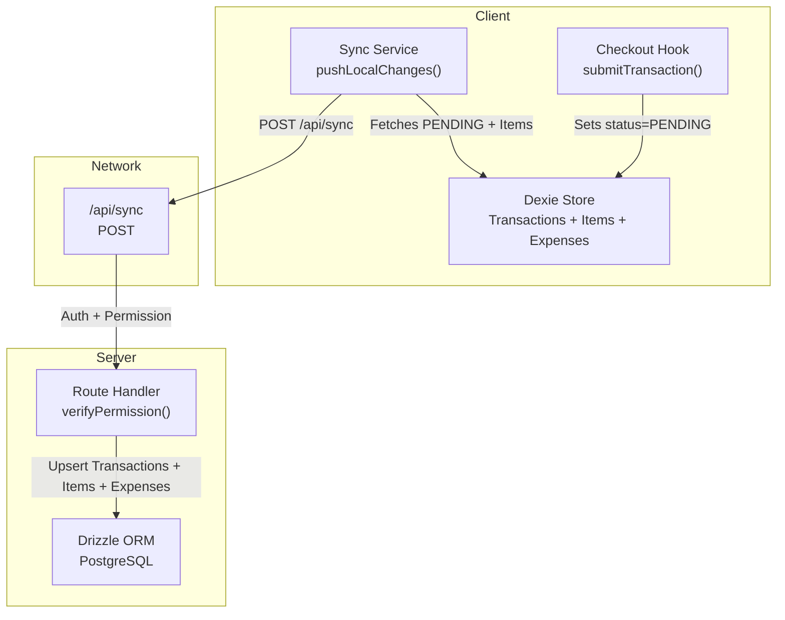
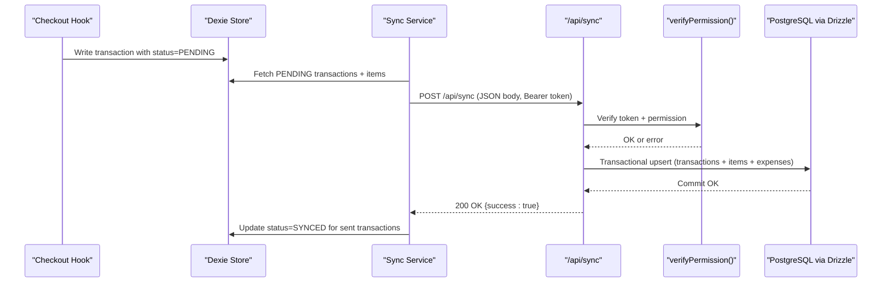

# Synchronization API

<cite>
**Referenced Files in This Document**
- [index.ts](file://src/routes/api/sync/index.ts)
- [syncService.ts](file://src/lib/syncService.ts)
- [useCheckout.ts](file://src/hooks/useCheckout.ts)
- [db.ts](file://src/db/db.ts)
- [schema.ts](file://src/server/db/schema.ts)
- [auth.ts](file://src/server/utils/auth.ts)
- [db-index.ts](file://src/server/db/index.ts)
</cite>

## Table of Contents
1. [Introduction](#introduction)
2. [Project Structure](#project-structure)
3. [Core Components](#core-components)
4. [Architecture Overview](#architecture-overview)
5. [Detailed Component Analysis](#detailed-component-analysis)
6. [Dependency Analysis](#dependency-analysis)
7. [Performance Considerations](#performance-considerations)
8. [Troubleshooting Guide](#troubleshooting-guide)
9. [Conclusion](#conclusion)

## Introduction
This document describes the NgePos synchronization API designed for an offline-first architecture. It covers the HTTP endpoint, request/response schemas, synchronization protocol for batch data processing, offline data management, conflict resolution strategy, and operational guidance for performance and debugging.

NgePos uses:
- Client-side IndexedDB via Dexie for offline storage of transactions, items, and expenses.
- A background sync service that pushes locally “PENDING” transactions to the server.
- A server endpoint that accepts batches of transactions and expenses, upserting them into PostgreSQL via Drizzle ORM.

## Project Structure
The synchronization pipeline spans client and server:
- Client: Dexie-backed offline store and a sync service that debounces and sends batches to the server.
- Server: A route handler that validates permissions, parses the payload, and performs atomic upserts into PostgreSQL.

**Diagram sources**
- [index.ts:6-95](file://src/routes/api/sync/index.ts#L6-L95)
- [syncService.ts:5-57](file://src/lib/syncService.ts#L5-L57)
- [useCheckout.ts:151-172](file://src/hooks/useCheckout.ts#L151-L172)
- [db.ts:270-495](file://src/db/db.ts#L270-L495)
- [schema.ts:35-80](file://src/server/db/schema.ts#L35-L80)
- [auth.ts:32-51](file://src/server/utils/auth.ts#L32-L51)

**Section sources**
- [index.ts:6-95](file://src/routes/api/sync/index.ts#L6-L95)
- [syncService.ts:5-57](file://src/lib/syncService.ts#L5-L57)
- [useCheckout.ts:151-172](file://src/hooks/useCheckout.ts#L151-L172)
- [db.ts:270-495](file://src/db/db.ts#L270-L495)
- [schema.ts:35-80](file://src/server/db/schema.ts#L35-L80)
- [auth.ts:32-51](file://src/server/utils/auth.ts#L32-L51)

## Core Components
- Synchronization Endpoint: POST /api/sync
- Client Sync Service: fetches PENDING transactions and items, sends to server, marks synced on success
- Server Route Handler: verifies permissions, parses payload, performs transactional upserts
- Offline Store: Dexie tables for transactions, transaction items, and expenses
- Conflict Resolution: upsert semantics on primary keys with explicit field updates

Key responsibilities:
- Client: enqueue work locally, debounce requests, mark successful uploads
- Server: validate identity and permissions, persist data atomically

**Section sources**
- [index.ts:6-95](file://src/routes/api/sync/index.ts#L6-L95)
- [syncService.ts:5-57](file://src/lib/syncService.ts#L5-L57)
- [db.ts:270-495](file://src/db/db.ts#L270-L495)
- [schema.ts:35-80](file://src/server/db/schema.ts#L35-L80)
- [auth.ts:32-51](file://src/server/utils/auth.ts#L32-L51)

## Architecture Overview
High-level flow:
1. Client creates transactions with status PENDING.
2. Sync service periodically collects PENDING transactions and associated items.
3. Sync service posts a batch to /api/sync with Authorization header.
4. Server verifies token and permission, then upserts transactions and items.
5. On success, client marks transactions as SYNCED.

**Diagram sources**
- [useCheckout.ts:151-172](file://src/hooks/useCheckout.ts#L151-L172)
- [syncService.ts:5-57](file://src/lib/syncService.ts#L5-L57)
- [index.ts:6-95](file://src/routes/api/sync/index.ts#L6-L95)
- [auth.ts:32-51](file://src/server/utils/auth.ts#L32-L51)
- [schema.ts:35-80](file://src/server/db/schema.ts#L35-L80)

## Detailed Component Analysis

### Endpoint Definition
- Method: POST
- URL: /api/sync
- Authentication: Bearer token required
- Permissions: VIEW_TRANSACTIONS
- Content-Type: application/json

Request body (JSON):
- transactions: array of transaction objects (see Transaction Payload below)
- expenses: array of expense objects (see Expense Payload below)

Response:
- On success: 200 OK with { success: true }
- On authentication error: 401 Unauthorized
- On insufficient permissions: 403 Forbidden
- On server errors: 500 Internal Server Error with { error, detail }

Notes:
- The server enforces a transactional block to ensure consistency across inserts/upserts.
- Upserts are performed on primary keys to handle offline duplicates.

**Section sources**
- [index.ts:6-95](file://src/routes/api/sync/index.ts#L6-L95)
- [auth.ts:32-51](file://src/server/utils/auth.ts#L32-L51)

### Transaction Payload Schema
Fields included in each transaction object:
- id: string (client-generated UUID)
- receiptNumber: string
- totalAmount: number (sent as string to preserve precision)
- originalAmount: number (sent as string to preserve precision)
- cogsTotal: number (sent as string to preserve precision)
- paymentMethod: string
- timestamp: number (Unix milliseconds)
- status: string literal "SYNCED"
- isBackdated: boolean
- backdatedNote: string (optional)
- discountTotal: number (optional, sent as string)
- customerId: string (optional)
- items: array of transaction items (see Item Payload)

Constraints:
- All monetary fields are converted to strings before insertion to maintain precision.
- Timestamps are stored as Postgres timestamps.

**Section sources**
- [index.ts:18-33](file://src/routes/api/sync/index.ts#L18-L33)
- [schema.ts:35-53](file://src/server/db/schema.ts#L35-L53)

### Transaction Item Payload Schema
Fields included in each transaction item object:
- id: string (client-generated UUID)
- transactionId: string (links to parent transaction)
- productId: string
- productName: string
- quantity: number
- priceAtTime: number (sent as string)
- cogsAtTime: number (sent as string)
- selectedVariants: array of variant selections (optional)

Constraints:
- All monetary fields are converted to strings before insertion.
- selectedVariants are stored as JSONB on the server.

**Section sources**
- [index.ts:44-54](file://src/routes/api/sync/index.ts#L44-L54)
- [schema.ts:56-67](file://src/server/db/schema.ts#L56-L67)

### Expense Payload Schema
Fields included in each expense object:
- id: string (client-generated UUID)
- amount: number (sent as string)
- category: string (enum-like string)
- description: string
- timestamp: number (Unix milliseconds)
- isBackdated: boolean

Constraints:
- Amounts are converted to strings before insertion.
- Expenses are upserted by id.

**Section sources**
- [index.ts:67-74](file://src/routes/api/sync/index.ts#L67-L74)
- [schema.ts:70-80](file://src/server/db/schema.ts#L70-L80)

### Client-Side Sync Flow
Responsibilities:
- Detect PENDING transactions and collect associated items
- Build batch payload with transactions and expenses
- Send to /api/sync with Authorization header
- On success, mark transactions as SYNCED

Debouncing:
- A 3-second debounce prevents rapid-fire requests.

Triggering:
- Checkout sets transaction status to PENDING and triggers sync.

**Section sources**
- [syncService.ts:5-57](file://src/lib/syncService.ts#L5-L57)
- [useCheckout.ts:151-172](file://src/hooks/useCheckout.ts#L151-L172)

### Server-Side Processing Logic
- Authentication and permission verification
- Transactional block for all writes
- Upsert logic:
  - Transactions: upsert by id
  - Transaction items: upsert by id
  - Expenses: upsert by id
- Error handling:
  - Auth errors mapped to 401/403
  - Other errors mapped to 500 with sanitized message

**Section sources**
- [index.ts:6-95](file://src/routes/api/sync/index.ts#L6-L95)
- [auth.ts:32-51](file://src/server/utils/auth.ts#L32-L51)

### Conflict Resolution Strategy
- Upsert semantics on primary keys ensure idempotent writes.
- Explicit field updates overwrite conflicting rows.
- No last-write-wins timestamp is enforced; upsert replaces with latest client-provided values.
- Recommendation: if strict ordering is required, add a server-side timestamp and compare logic in future iterations.

**Section sources**
- [index.ts:36-39](file://src/routes/api/sync/index.ts#L36-L39)
- [index.ts:55-58](file://src/routes/api/sync/index.ts#L55-L58)
- [index.ts:75-78](file://src/routes/api/sync/index.ts#L75-L78)

### Data Transformation Rules
- Monetary values are converted to strings before insertion to preserve precision.
- Timestamps are converted to Date objects on the server.
- Selected variants are stored as JSONB.

**Section sources**
- [index.ts:20-33](file://src/routes/api/sync/index.ts#L20-L33)
- [index.ts:45-54](file://src/routes/api/sync/index.ts#L45-L54)
- [index.ts:67-74](file://src/routes/api/sync/index.ts#L67-L74)
- [schema.ts:64](file://src/server/db/schema.ts#L64)

### Error Handling and Retry Mechanisms
- Client:
  - Errors are logged; no automatic retry is implemented in the provided code.
  - Debounce avoids flooding the server but does not replace retry logic.
- Server:
  - Authentication and permission errors return appropriate HTTP codes.
  - General failures return 500 with a generic message and detail.

Recommendations:
- Implement exponential backoff on the client for transient failures.
- Consider idempotency keys to prevent duplicate processing on the server.

**Section sources**
- [syncService.ts:44-46](file://src/lib/syncService.ts#L44-L46)
- [index.ts:84-94](file://src/routes/api/sync/index.ts#L84-L94)

### Practical Examples

- Example: Submitting a transaction batch
  - Client collects PENDING transactions and their items, builds a JSON payload, and posts to /api/sync with Authorization: Bearer <token>.
  - Server responds 200 with success; client updates statuses to SYNCED.

- Example: Handling expenses
  - Client sends expenses array; server upserts each expense by id.

- Example: Offline-first checkout
  - Checkout writes a transaction with status PENDING and triggers sync; later network connectivity uploads the batch.

**Section sources**
- [syncService.ts:27-43](file://src/lib/syncService.ts#L27-L43)
- [useCheckout.ts:151-172](file://src/hooks/useCheckout.ts#L151-L172)
- [index.ts:6-95](file://src/routes/api/sync/index.ts#L6-L95)

## Dependency Analysis
- Client depends on:
  - Dexie for local storage
  - Local storage for auth token
  - Sync service for network operations
- Server depends on:
  - Drizzle ORM for PostgreSQL
  - JWT verification for authentication
  - Permission lookup via staff and roles tables

**Diagram sources**
- [syncService.ts:5-57](file://src/lib/syncService.ts#L5-L57)
- [useCheckout.ts:202-203](file://src/hooks/useCheckout.ts#L202-L203)
- [index.ts:6-95](file://src/routes/api/sync/index.ts#L6-L95)
- [auth.ts:32-51](file://src/server/utils/auth.ts#L32-L51)
- [db-index.ts:1-27](file://src/server/db/index.ts#L1-L27)
- [schema.ts:35-80](file://src/server/db/schema.ts#L35-L80)

**Section sources**
- [syncService.ts:5-57](file://src/lib/syncService.ts#L5-L57)
- [useCheckout.ts:202-203](file://src/hooks/useCheckout.ts#L202-L203)
- [index.ts:6-95](file://src/routes/api/sync/index.ts#L6-L95)
- [auth.ts:32-51](file://src/server/utils/auth.ts#L32-L51)
- [db-index.ts:1-27](file://src/server/db/index.ts#L1-L27)
- [schema.ts:35-80](file://src/server/db/schema.ts#L35-L80)

## Performance Considerations
- Debounce: The client uses a 3-second debounce to batch frequent changes.
- Transactional writes: Server performs all inserts/upserts in a single transaction to reduce overhead and ensure consistency.
- Precision: Monetary values are sent as strings to avoid floating-point rounding issues.
- Indexing: Server schema includes indexes on frequently queried columns (e.g., timestamp, customer_id).

Recommendations:
- Add pagination or chunking for very large batches.
- Consider idempotency keys on the client to avoid duplicate uploads.
- Monitor server latency and adjust debounce timing accordingly.

**Section sources**
- [syncService.ts:51-56](file://src/lib/syncService.ts#L51-L56)
- [index.ts:15-81](file://src/routes/api/sync/index.ts#L15-L81)
- [schema.ts:49-53](file://src/server/db/schema.ts#L49-L53)
- [schema.ts:78-80](file://src/server/db/schema.ts#L78-L80)

## Troubleshooting Guide
Common issues and resolutions:
- Authentication failures:
  - Ensure Authorization header is present and valid.
  - Verify JWT_SECRET is configured on the server.
- Permission denied:
  - Confirm the user has VIEW_TRANSACTIONS permission.
- Network errors:
  - Inspect client logs for fetch errors.
  - Retry after network recovery; implement exponential backoff.
- Data inconsistencies:
  - Verify that monetary fields are sent as strings.
  - Confirm that timestamps are valid Unix milliseconds.

Debugging steps:
- Enable server logs for /api/sync requests.
- Check Dexie transaction statuses (PENDING vs SYNCED).
- Validate server database schema and indexes.

**Section sources**
- [auth.ts:6-9](file://src/server/utils/auth.ts#L6-L9)
- [auth.ts:21-29](file://src/server/utils/auth.ts#L21-L29)
- [auth.ts:32-51](file://src/server/utils/auth.ts#L32-L51)
- [index.ts:84-94](file://src/routes/api/sync/index.ts#L84-L94)
- [syncService.ts:44-46](file://src/lib/syncService.ts#L44-L46)

## Conclusion
The NgePos synchronization API provides a robust offline-first mechanism:
- Clients write locally with PENDING status and upload in batches.
- The server validates credentials, persists data atomically, and resolves conflicts via upserts.
- The design balances simplicity, performance, and data integrity while leaving room for enhancements like idempotency and advanced conflict resolution.