# Architecture Overview

<cite>
**Referenced Files in This Document**
- [README.md](file://README.md)
- [package.json](file://package.json)
- [src/app.tsx](file://src/app.tsx)
- [src/stores/auth.ts](file://src/stores/auth.ts)
- [src/stores/cart.ts](file://src/stores/cart.ts)
- [src/stores/loyalty.ts](file://src/stores/loyalty.ts)
- [src/db/db.ts](file://src/db/db.ts)
- [src/db/outletDb.ts](file://src/db/outletDb.ts)
- [src/lib/syncService.ts](file://src/lib/syncService.ts)
- [src/lib/auditLog.ts](file://src/lib/auditLog.ts)
- [src/hooks/useCheckout.ts](file://src/hooks/useCheckout.ts)
- [src/routes/api/sync/index.ts](file://src/routes/api/sync/index.ts)
- [src/routes/api/auth/login.ts](file://src/routes/api/auth/login.ts)
- [src/routes/api/auth/me.ts](file://src/routes/api/auth/me.ts)
- [src/server/db/index.ts](file://src/server/db/index.ts)
- [src/server/db/schema.ts](file://src/server/db/schema.ts)
- [src/server/db/schema-outlet.ts](file://src/server/db/schema-outlet.ts)
- [src/server/db/schema-audit.ts](file://src/server/db/schema-audit.ts)
- [src/server/utils/auditService.ts](file://src/server/utils/auditService.ts)
- [src/routes/app/index.tsx](file://src/routes/app/index.tsx)
- [src/components/ui/product-selector.tsx](file://src/components/ui/product-selector.tsx)
- [src/components/OutletSwitcher.tsx](file://src/components/OutletSwitcher.tsx)
- [public/sw.js](file://public/sw.js)
- [public/manifest.json](file://public/manifest.json)
</cite>

## Update Summary
**Changes Made**
- Added comprehensive multi-outlet database architecture with dedicated outlet-specific IndexedDB and PostgreSQL schemas
- Enhanced synchronization service with outlet-aware queue management and improved retry mechanisms
- Integrated comprehensive audit logging system with both local and server-side audit trails
- Implemented Progressive Web App (PWA) support with service worker, manifest, and offline capabilities
- Added distributed POS operations support with outlet switching and cross-outlet data isolation

## Table of Contents
1. [Introduction](#introduction)
2. [Project Structure](#project-structure)
3. [Core Components](#core-components)
4. [Architecture Overview](#architecture-overview)
5. [Multi-Outlets Architecture](#multi-outlets-architecture)
6. [Enhanced Synchronization Service](#enhanced-synchronization-service)
7. [Audit Logging System](#audit-logging-system)
8. [Progressive Web App Support](#progressive-web-app-support)
9. [Detailed Component Analysis](#detailed-component-analysis)
10. [Dependency Analysis](#dependency-analysis)
11. [Performance Considerations](#performance-considerations)
12. [Troubleshooting Guide](#troubleshooting-guide)
13. [Conclusion](#conclusion)

## Introduction
This document describes the NgePos Point-of-Sale (POS) system architecture with major architectural enhancements including multi-outlet database architecture, enhanced synchronization service, audit logging integration, and PWA support. The system now supports distributed POS operations across multiple physical locations while maintaining offline-first design principles with robust data consistency and comprehensive operational visibility.

## Project Structure
The project now features a comprehensive multi-outlet architecture with enhanced data persistence and synchronization capabilities:
- Frontend SPA entry and routing under src/routes and src/app.tsx
- Local state stores for authentication, cart, and loyalty under src/stores
- Dual offline-first data layer: main application database (Dexie) and outlet-specific database (Dexie)
- Enhanced backend API routes under src/routes/api
- Multi-outlet server-side database schemas under src/server/db
- Comprehensive audit logging infrastructure
- Progressive Web App support with service worker and manifest

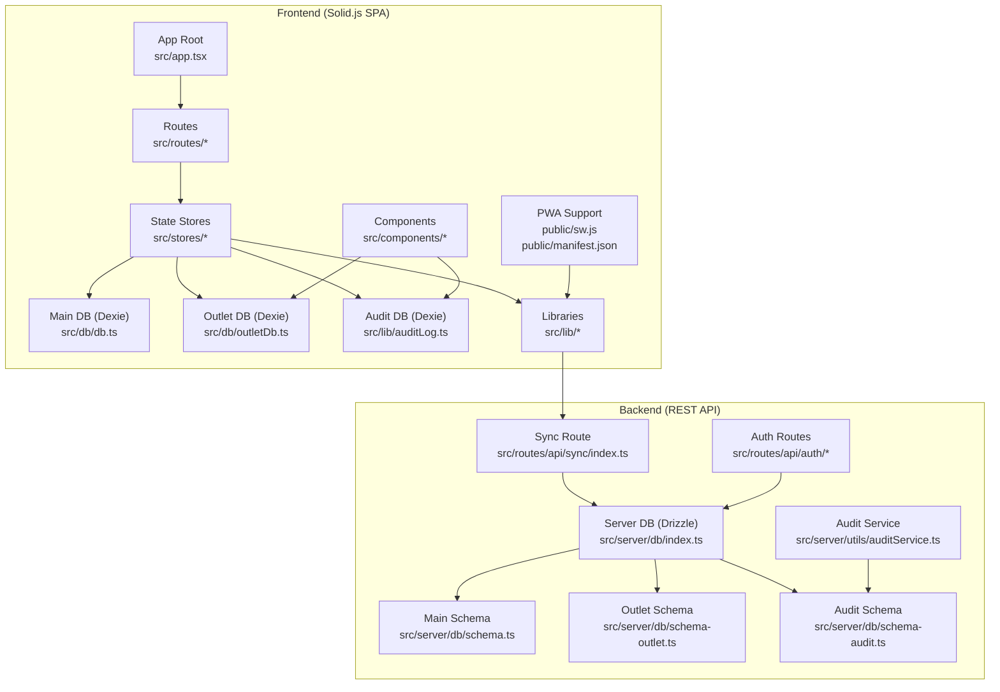

**Diagram sources**
- [src/app.tsx:1-42](file://src/app.tsx#L1-L42)
- [src/stores/auth.ts:1-206](file://src/stores/auth.ts#L1-L206)
- [src/stores/cart.ts:1-257](file://src/stores/cart.ts#L1-L257)
- [src/stores/loyalty.ts:1-174](file://src/stores/loyalty.ts#L1-L174)
- [src/db/db.ts:1-570](file://src/db/db.ts#L1-L570)
- [src/db/outletDb.ts:1-169](file://src/db/outletDb.ts#L1-L169)
- [src/lib/auditLog.ts:1-111](file://src/lib/auditLog.ts#L1-L111)
- [src/lib/syncService.ts:1-111](file://src/lib/syncService.ts#L1-L111)
- [src/routes/api/sync/index.ts:1-98](file://src/routes/api/sync/index.ts#L1-L98)
- [src/routes/api/auth/login.ts:1-55](file://src/routes/api/auth/login.ts#L1-L55)
- [src/routes/api/auth/me.ts:1-60](file://src/routes/api/auth/me.ts#L1-L60)
- [src/server/db/index.ts:1-27](file://src/server/db/index.ts#L1-L27)
- [src/server/db/schema.ts:1-134](file://src/server/db/schema.ts#L1-L134)
- [src/server/db/schema-outlet.ts:1-56](file://src/server/db/schema-outlet.ts#L1-L56)
- [src/server/db/schema-audit.ts:1-84](file://src/server/db/schema-audit.ts#L1-L84)
- [src/server/utils/auditService.ts:1-298](file://src/server/utils/auditService.ts#L1-L298)
- [public/sw.js:1-107](file://public/sw.js#L1-L107)
- [public/manifest.json:1-28](file://public/manifest.json#L1-L28)

**Section sources**
- [README.md:1-33](file://README.md#L1-L33)
- [package.json:1-56](file://package.json#L1-L56)
- [src/app.tsx:1-42](file://src/app.tsx#L1-L42)

## Core Components
- **Solid.js SPA and Routing**: Initializes the app, mounts routes, and renders UI with suspense and toasts, now supporting multi-outlet navigation.
- **Authentication Store**: Handles login, session verification, profile updates, and permission checks with optimistic UI and token-based authorization.
- **Cart Store**: Reactive shopping cart with variant-aware item IDs, quantity updates, campaign-based discount computation, and totals calculation.
- **Loyalty Store**: Manages customer stamps, eligibility checks, reward creation, and claiming with Dexie-backed persistence.
- **Main Database (Dexie)**: Primary application data storage for products, categories, transactions, expenses, campaigns, memberships, and inventory logs.
- **Outlet Database (Dexie)**: Dedicated multi-outlet data storage for outlet configurations, user-outlet associations, and outlet-specific synchronization queues.
- **Audit Database (Dexie)**: Local audit trail storage for tracking all system activities before synchronization.
- **Enhanced Sync Service**: Advanced synchronization with retry mechanisms, exponential backoff, and outlet-aware queue management.
- **Audit Service**: Comprehensive server-side audit logging with entity tracking, user activity monitoring, and compliance reporting.
- **Outlet Switcher Component**: UI component enabling seamless switching between different POS outlets with real-time data isolation.
- **PWA Infrastructure**: Service worker for offline caching, background sync, push notifications, and progressive web app capabilities.

**Section sources**
- [src/stores/auth.ts:1-206](file://src/stores/auth.ts#L1-L206)
- [src/stores/cart.ts:1-257](file://src/stores/cart.ts#L1-L257)
- [src/stores/loyalty.ts:1-174](file://src/stores/loyalty.ts#L1-L174)
- [src/db/db.ts:1-570](file://src/db/db.ts#L1-L570)
- [src/db/outletDb.ts:1-169](file://src/db/outletDb.ts#L1-L169)
- [src/lib/auditLog.ts:1-111](file://src/lib/auditLog.ts#L1-L111)
- [src/lib/syncService.ts:1-111](file://src/lib/syncService.ts#L1-L111)
- [src/server/utils/auditService.ts:1-298](file://src/server/utils/auditService.ts#L1-L298)
- [src/components/OutletSwitcher.tsx:1-203](file://src/components/OutletSwitcher.tsx#L1-L203)
- [public/sw.js:1-107](file://public/sw.js#L1-L107)

## Architecture Overview
The system now implements a sophisticated multi-outlet architecture with enhanced offline-first capabilities:
- UI components and stores drive user interactions with outlet awareness.
- Dual IndexedDB layers: main application data and outlet-specific data isolation.
- Advanced synchronization service with retry mechanisms and exponential backoff.
- Comprehensive audit logging with both local and server-side tracking.
- Progressive Web App support for offline operation and native app-like experience.

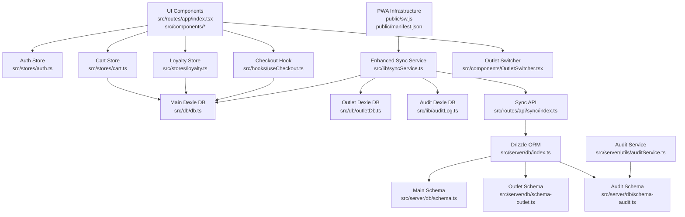

**Diagram sources**
- [src/routes/app/index.tsx:1-282](file://src/routes/app/index.tsx#L1-L282)
- [src/stores/auth.ts:1-206](file://src/stores/auth.ts#L1-L206)
- [src/stores/cart.ts:1-257](file://src/stores/cart.ts#L1-L257)
- [src/stores/loyalty.ts:1-174](file://src/stores/loyalty.ts#L1-L174)
- [src/lib/syncService.ts:1-111](file://src/lib/syncService.ts#L1-L111)
- [src/hooks/useCheckout.ts:1-217](file://src/hooks/useCheckout.ts#L1-L217)
- [src/db/db.ts:1-570](file://src/db/db.ts#L1-L570)
- [src/db/outletDb.ts:1-169](file://src/db/outletDb.ts#L1-L169)
- [src/lib/auditLog.ts:1-111](file://src/lib/auditLog.ts#L1-L111)
- [src/routes/api/sync/index.ts:1-98](file://src/routes/api/sync/index.ts#L1-L98)
- [src/server/db/index.ts:1-27](file://src/server/db/index.ts#L1-L27)
- [src/server/db/schema.ts:1-134](file://src/server/db/schema.ts#L1-L134)
- [src/server/db/schema-outlet.ts:1-56](file://src/server/db/schema-outlet.ts#L1-L56)
- [src/server/db/schema-audit.ts:1-84](file://src/server/db/schema-audit.ts#L1-L84)
- [src/server/utils/auditService.ts:1-298](file://src/server/utils/auditService.ts#L1-L298)
- [src/components/OutletSwitcher.tsx:1-203](file://src/components/OutletSwitcher.tsx#L1-L203)
- [public/sw.js:1-107](file://public/sw.js#L1-L107)

## Multi-Outlets Architecture
The system now supports distributed POS operations across multiple physical locations through a comprehensive multi-outlet architecture:

### Outlet Database Design
- **Outlet Management**: Separate database for outlet configurations, user-outlet associations, and outlet-specific settings
- **Data Isolation**: Each outlet maintains its own transaction history, inventory, and configuration
- **Role-Based Access**: Users can be associated with multiple outlets with different roles (OWNER, MANAGER, CASHIER)
- **Outlet Switching**: Seamless switching between outlets with automatic data reload and context preservation

### Outlet Schema Implementation
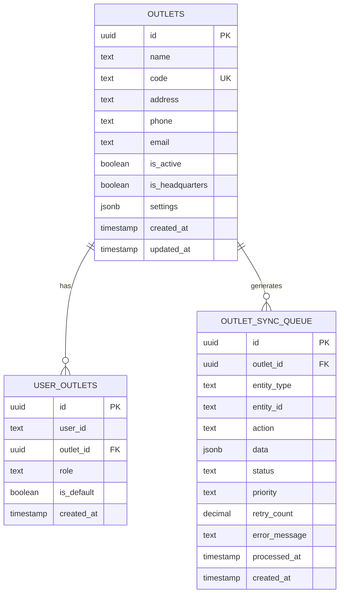

**Diagram sources**
- [src/server/db/schema-outlet.ts:3-56](file://src/server/db/schema-outlet.ts#L3-L56)

### Outlet Operations Flow
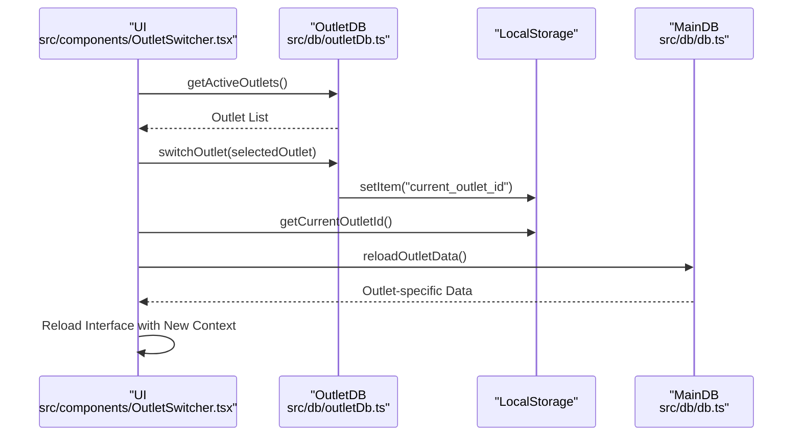

**Diagram sources**
- [src/components/OutletSwitcher.tsx:48-65](file://src/components/OutletSwitcher.tsx#L48-L65)
- [src/db/outletDb.ts:85-91](file://src/db/outletDb.ts#L85-L91)
- [src/db/db.ts:1-570](file://src/db/db.ts#L1-L570)

**Section sources**
- [src/db/outletDb.ts:1-169](file://src/db/outletDb.ts#L1-L169)
- [src/server/db/schema-outlet.ts:1-56](file://src/server/db/schema-outlet.ts#L1-L56)
- [src/components/OutletSwitcher.tsx:1-203](file://src/components/OutletSwitcher.tsx#L1-L203)

## Enhanced Synchronization Service
The synchronization service has been significantly enhanced with advanced retry mechanisms, exponential backoff, and outlet-aware queue management:

### Advanced Retry Mechanism
- **Exponential Backoff**: Base delay of 1 second with exponential increase per retry attempt
- **Maximum Retries**: Cap of 5 retry attempts with automatic failure detection
- **Smart Error Handling**: Different handling for authentication errors vs. server errors
- **Debounced Operations**: Prevents overwhelming the server with rapid successive sync attempts

### Outlet-Aware Queue Management
- **Priority Queuing**: Critical, High, Normal, and Low priority levels for different operations
- **Status Tracking**: PENDING, PROCESSING, COMPLETED, and FAILED status management
- **Automatic Cleanup**: Regular cleanup of completed and failed sync items
- **Error Recovery**: Intelligent retry logic with error message preservation

### Enhanced Sync Flow
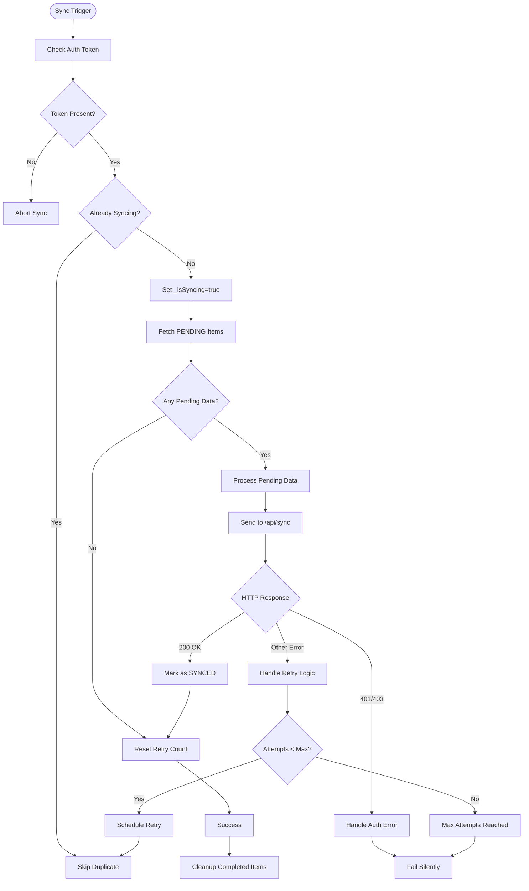

**Diagram sources**
- [src/lib/syncService.ts:12-111](file://src/lib/syncService.ts#L12-L111)

**Section sources**
- [src/lib/syncService.ts:1-111](file://src/lib/syncService.ts#L1-L111)

## Audit Logging System
The system now includes a comprehensive audit logging infrastructure that tracks all operations for compliance, troubleshooting, and business intelligence:

### Local Audit Trail
- **Dexie-Based Storage**: Local audit logs stored in IndexedDB for immediate access
- **Comprehensive Tracking**: All CREATE, UPDATE, DELETE, LOGIN, LOGOUT, SYNC, EXPORT, BACKUP, and RESTORE operations
- **Change Detection**: Automatic detection and logging of field-level changes
- **Synchronization Status**: Tracks which audit logs have been synchronized to the server

### Server-Side Audit Service
- **Centralized Storage**: PostgreSQL-based audit logs for long-term retention and analysis
- **Advanced Querying**: Support for filtering by entity type, user, date range, and action type
- **Activity Analytics**: Heatmaps, statistics, and trend analysis capabilities
- **Compliance Ready**: Full audit trail with timestamps, IP addresses, and user agents

### Audit Log Schema
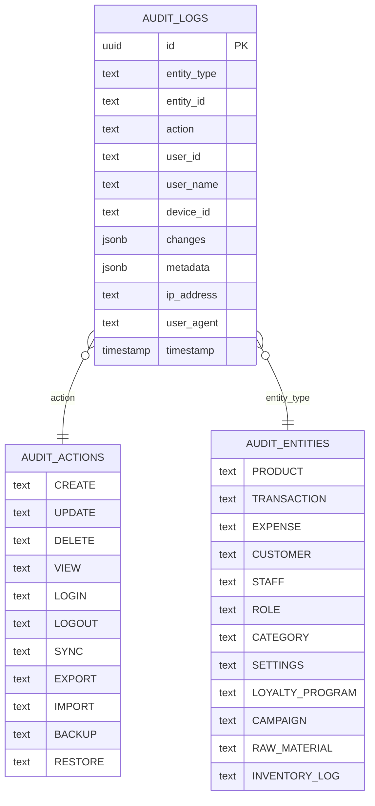

**Diagram sources**
- [src/server/db/schema-audit.ts:36-84](file://src/server/db/schema-audit.ts#L36-L84)

### Audit Operations Flow
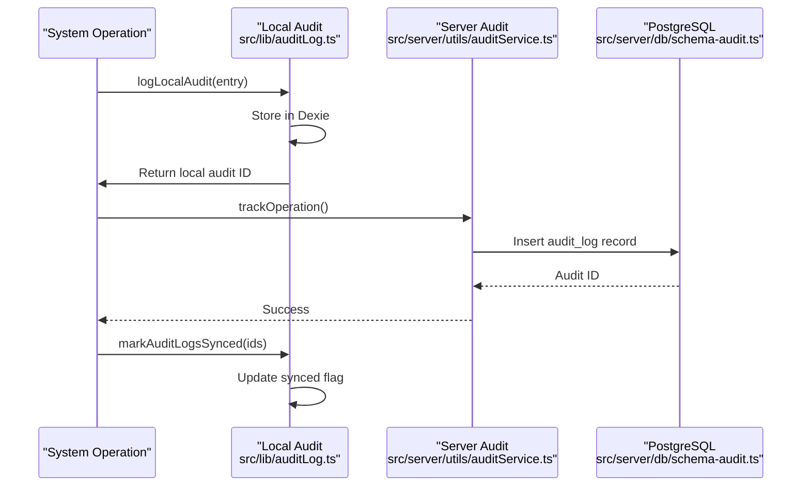

**Diagram sources**
- [src/lib/auditLog.ts:27-53](file://src/lib/auditLog.ts#L27-L53)
- [src/server/utils/auditService.ts:30-53](file://src/server/utils/auditService.ts#L30-L53)
- [src/server/db/schema-audit.ts:36-84](file://src/server/db/schema-audit.ts#L36-L84)

**Section sources**
- [src/lib/auditLog.ts:1-111](file://src/lib/auditLog.ts#L1-L111)
- [src/server/utils/auditService.ts:1-298](file://src/server/utils/auditService.ts#L1-L298)
- [src/server/db/schema-audit.ts:1-84](file://src/server/db/schema-audit.ts#L1-L84)

## Progressive Web App Support
The system now includes comprehensive PWA support for offline operation and native app-like experiences:

### Service Worker Implementation
- **Offline Caching**: Static assets cached for offline access
- **Network Fallback**: Intelligent caching strategy with network fallback
- **Background Sync**: Background synchronization when connectivity is restored
- **Push Notifications**: Support for system notifications and alerts

### PWA Manifest Configuration
- **App Identity**: Complete app metadata including icons and display properties
- **Installation Support**: Standalone installation for desktop and mobile devices
- **Theme Integration**: Consistent theming with the main application
- **Orientation Control**: Portrait orientation optimized for POS operations

### Offline Capabilities
- **Full Offline Mode**: Core POS functionality available offline
- **Data Persistence**: All operations saved locally and synchronized later
- **Error Handling**: Graceful degradation with clear user feedback
- **Connection Awareness**: Real-time connection status indicators

**Section sources**
- [public/sw.js:1-107](file://public/sw.js#L1-L107)
- [public/manifest.json:1-28](file://public/manifest.json#L1-L28)

## Detailed Component Analysis

### Authentication and Authorization
- **Optimistic Rendering**: On app mount, the auth store reads cached user from local storage and verifies token in background
- **Token-Based Authorization**: All protected endpoints expect Bearer token; backend validates JWT and enriches response with role and permissions
- **Permission Model**: Roles carry arrays of permission identifiers; store exposes helper to check permissions with super admin bypass

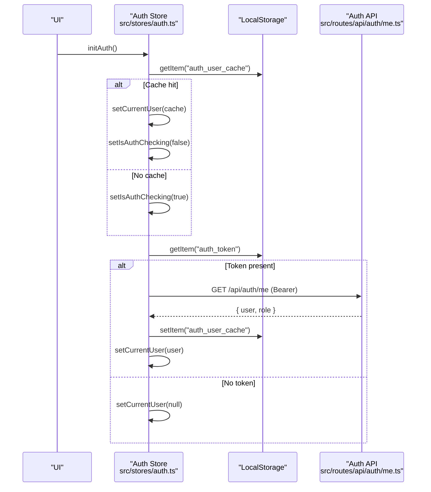

**Diagram sources**
- [src/stores/auth.ts:11-56](file://src/stores/auth.ts#L11-L56)
- [src/routes/api/auth/me.ts:10-59](file://src/routes/api/auth/me.ts#L10-L59)

**Section sources**
- [src/stores/auth.ts:1-206](file://src/stores/auth.ts#L1-L206)
- [src/routes/api/auth/login.ts:1-55](file://src/routes/api/auth/login.ts#L1-L55)
- [src/routes/api/auth/me.ts:1-60](file://src/routes/api/auth/me.ts#L1-L60)
- [src/data/permissions.ts:1-45](file://src/data/permissions.ts#L1-L45)

### Cart and Pricing Engine
- **Reactive Cart**: Uses Solid store to manage items, quantities, and variant combinations
- **Variant-Aware Item IDs**: Generated from product ID plus normalized hash of selected options to separate variant sets
- **Campaign-Based Discounts**: Loads active campaigns from Dexie, computes applicable discounts respecting priority and bundle constraints, avoiding double-dipping by tracking consumed quantities

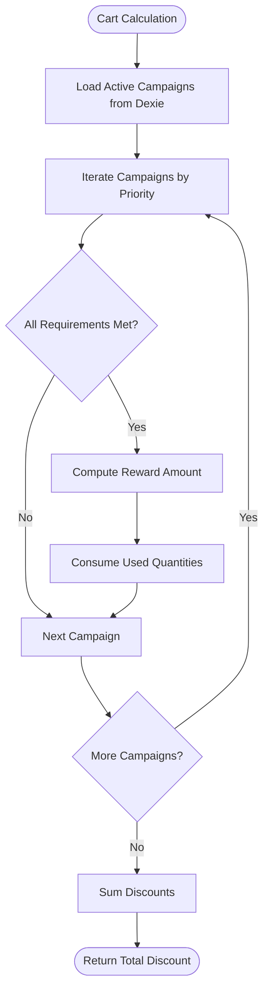

**Diagram sources**
- [src/stores/cart.ts:115-236](file://src/stores/cart.ts#L115-L236)

**Section sources**
- [src/stores/cart.ts:1-257](file://src/stores/cart.ts#L1-L257)
- [src/db/db.ts:189-217](file://src/db/db.ts#L189-L217)

### Enhanced Checkout and Inventory Flow
- **Transaction Creation**: Wraps product updates, inventory logging, and transaction insertion in single IndexedDB transaction for consistency
- **COGS Computation**: Recipes from raw materials and variant modifiers contribute to unit cost; stock decremented and inventory logs recorded
- **Dual Sync Strategy**: Transactions marked as PENDING locally and synchronized via enhanced sync service with retry mechanisms
- **Outlet Isolation**: Each outlet maintains separate transaction history and inventory data
- **Audit Integration**: All operations logged to both local and server audit trails

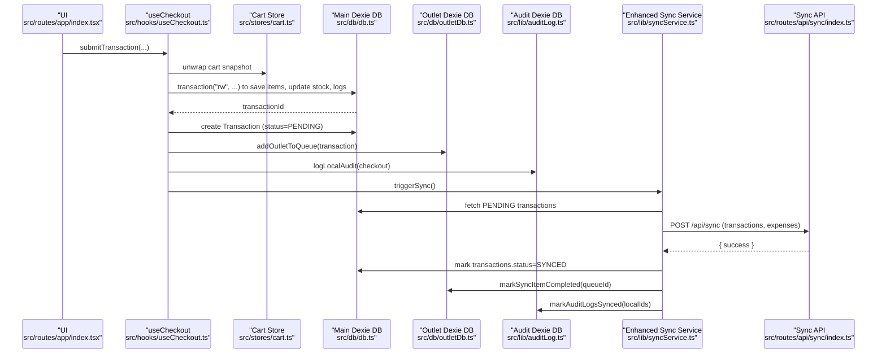

**Diagram sources**
- [src/hooks/useCheckout.ts:30-217](file://src/hooks/useCheckout.ts#L30-L217)
- [src/stores/cart.ts:1-257](file://src/stores/cart.ts#L1-L257)
- [src/lib/syncService.ts:4-111](file://src/lib/syncService.ts#L4-L111)
- [src/routes/api/sync/index.ts:10-98](file://src/routes/api/sync/index.ts#L10-L98)
- [src/db/outletDb.ts:93-107](file://src/db/outletDb.ts#L93-L107)
- [src/lib/auditLog.ts:27-53](file://src/lib/auditLog.ts#L27-L53)

**Section sources**
- [src/hooks/useCheckout.ts:1-217](file://src/hooks/useCheckout.ts#L1-L217)
- [src/lib/syncService.ts:1-111](file://src/lib/syncService.ts#L1-L111)
- [src/routes/api/sync/index.ts:1-98](file://src/routes/api/sync/index.ts#L1-L98)
- [src/db/outletDb.ts:1-169](file://src/db/outletDb.ts#L1-L169)
- [src/lib/auditLog.ts:1-111](file://src/lib/auditLog.ts#L1-L111)

### Product Selector Component
- **Feature-Rich Selector**: With search, multi-select, and variant-aware selection
- **Integration with Cart Store**: Adds items with selected variants seamlessly

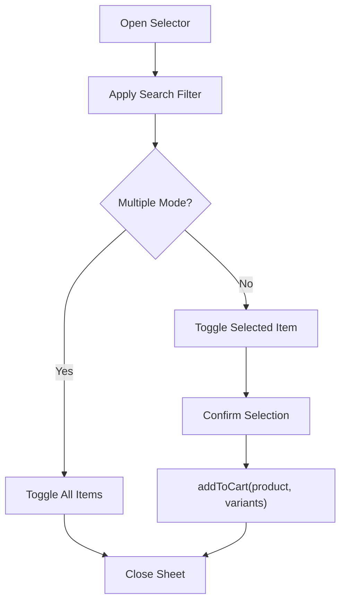

**Diagram sources**
- [src/components/ui/product-selector.tsx:14-236](file://src/components/ui/product-selector.tsx#L14-L236)
- [src/stores/cart.ts:16-48](file://src/stores/cart.ts#L16-L48)

**Section sources**
- [src/components/ui/product-selector.tsx:1-236](file://src/components/ui/product-selector.tsx#L1-L236)
- [src/stores/cart.ts:1-257](file://src/stores/cart.ts#L1-L257)

### Backend Data Persistence and Schema
- **Server DB Initialization**: Loads environment variables and connects to PostgreSQL using Drizzle ORM
- **Multi-Outlet Schema**: Separate schemas for main application data and outlet-specific data
- **Audit Schema**: Comprehensive audit logging with entity tracking and user activity monitoring
- **Index Optimization**: Strategic indexing for performance across all major query patterns

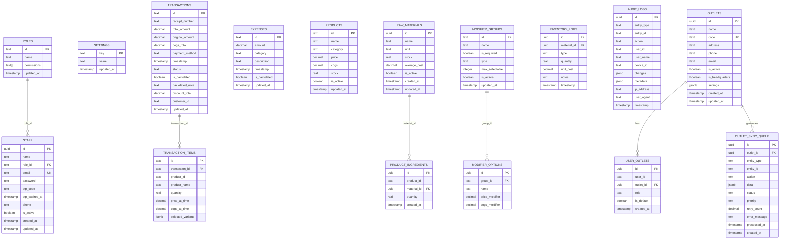

**Diagram sources**
- [src/server/db/schema.ts:1-134](file://src/server/db/schema.ts#L1-L134)
- [src/server/db/schema-outlet.ts:3-56](file://src/server/db/schema-outlet.ts#L3-L56)
- [src/server/db/schema-audit.ts:36-84](file://src/server/db/schema-audit.ts#L36-L84)

**Section sources**
- [src/server/db/index.ts:1-27](file://src/server/db/index.ts#L1-L27)
- [src/server/db/schema.ts:1-134](file://src/server/db/schema.ts#L1-L134)
- [src/server/db/schema-outlet.ts:1-56](file://src/server/db/schema-outlet.ts#L1-L56)
- [src/server/db/schema-audit.ts:1-84](file://src/server/db/schema-audit.ts#L1-L84)

## Dependency Analysis
- **Frontend Dependencies**: Solid.js, @solidjs/router, @solidjs/start, dexie, drizzle-orm, postgres, lucide-solid, service-worker, and others
- **Backend Dependencies**: Drizzle ORM with PostgreSQL via postgres-js, JWT verification via jose, bcrypt for password hashing, and comprehensive audit logging
- **PWA Dependencies**: Service worker registration, manifest integration, and offline-first caching strategies
- **Multi-Outlets Dependencies**: Dedicated outlet database schemas, user-outlet relationship management, and outlet-specific synchronization queues

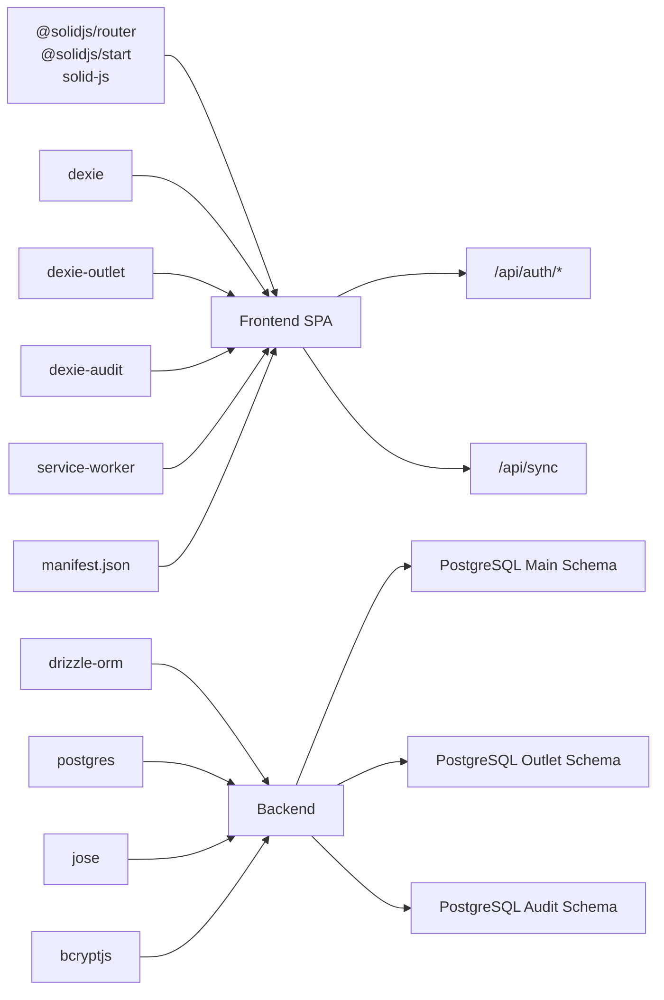

**Diagram sources**
- [package.json:11-40](file://package.json#L11-L40)
- [src/server/db/index.ts:1-27](file://src/server/db/index.ts#L1-L27)
- [src/server/db/schema.ts:1-134](file://src/server/db/schema.ts#L1-L134)
- [src/server/db/schema-outlet.ts:1-56](file://src/server/db/schema-outlet.ts#L1-L56)
- [src/server/db/schema-audit.ts:1-84](file://src/server/db/schema-audit.ts#L1-L84)
- [public/sw.js:1-107](file://public/sw.js#L1-L107)
- [public/manifest.json:1-28](file://public/manifest.json#L1-L28)

**Section sources**
- [package.json:1-56](file://package.json#L1-L56)
- [src/server/db/index.ts:1-27](file://src/server/db/index.ts#L1-L27)

## Performance Considerations
- **Multi-Outlets Performance**: Optimized IndexedDB schemas with strategic indexing for outlet queries and user-outlet relationships
- **Enhanced Synchronization**: Improved retry mechanisms with exponential backoff reduce server load during peak sync periods
- **Audit Logging Efficiency**: Local audit storage minimizes server load while providing comprehensive tracking capabilities
- **PWA Benefits**: Service worker caching reduces bandwidth usage and improves response times in offline scenarios
- **Memory Management**: Proper cleanup of audit logs and sync queue items prevents memory bloat over extended usage
- **Database Optimization**: Separate databases for different data types improve query performance and reduce contention

## Troubleshooting Guide
- **Multi-Outlets Issues**: Verify outlet switching logic, check outlet database integrity, ensure proper user-outlet associations
- **Enhanced Sync Problems**: Monitor retry counts, check exponential backoff behavior, verify authentication token validity
- **Audit Logging Failures**: Inspect local audit database for stuck entries, verify server audit service connectivity
- **PWA Issues**: Clear service worker cache, verify manifest file integrity, check offline capability testing
- **Authentication Failures**: Verify JWT secret, token presence, and server connectivity; check that frontend stores and removes tokens appropriately on invalidation
- **Sync Errors**: Inspect enhanced sync service debounce and confirm that PENDING transactions exist and are properly formatted
- **Checkout Failures**: Review transaction item generation, stock updates, and inventory log entries across both main and outlet databases
- **Database Seeding**: Confirm that outlet and audit schemas are properly seeded with initial data

**Section sources**
- [src/stores/auth.ts:58-195](file://src/stores/auth.ts#L58-L195)
- [src/lib/syncService.ts:4-111](file://src/lib/syncService.ts#L4-L111)
- [src/hooks/useCheckout.ts:57-213](file://src/hooks/useCheckout.ts#L57-L213)
- [src/db/db.ts:513-570](file://src/db/db.ts#L513-L570)
- [src/db/outletDb.ts:1-169](file://src/db/outletDb.ts#L1-L169)
- [src/lib/auditLog.ts:1-111](file://src/lib/auditLog.ts#L1-L111)

## Conclusion
NgePos now represents a comprehensive, enterprise-grade POS solution with major architectural enhancements. The multi-outlet database architecture enables distributed operations across multiple physical locations while maintaining data isolation and operational efficiency. The enhanced synchronization service with advanced retry mechanisms ensures reliable data consistency even in challenging network conditions. The comprehensive audit logging system provides full compliance tracking and operational visibility. The Progressive Web App support delivers native app-like experiences with robust offline capabilities. Together, these enhancements transform NgePos from a simple POS system into a complete business management ecosystem capable of supporting complex, multi-location retail operations.