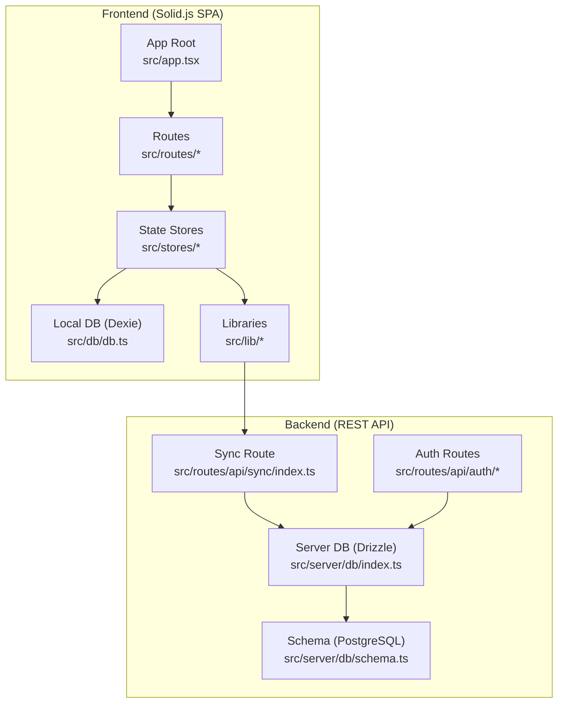
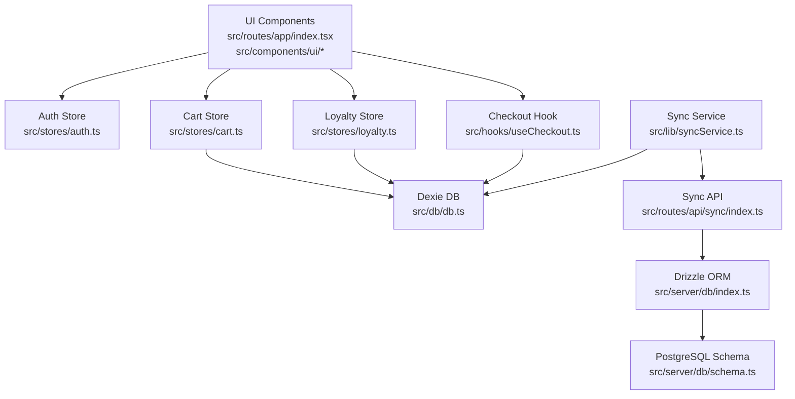
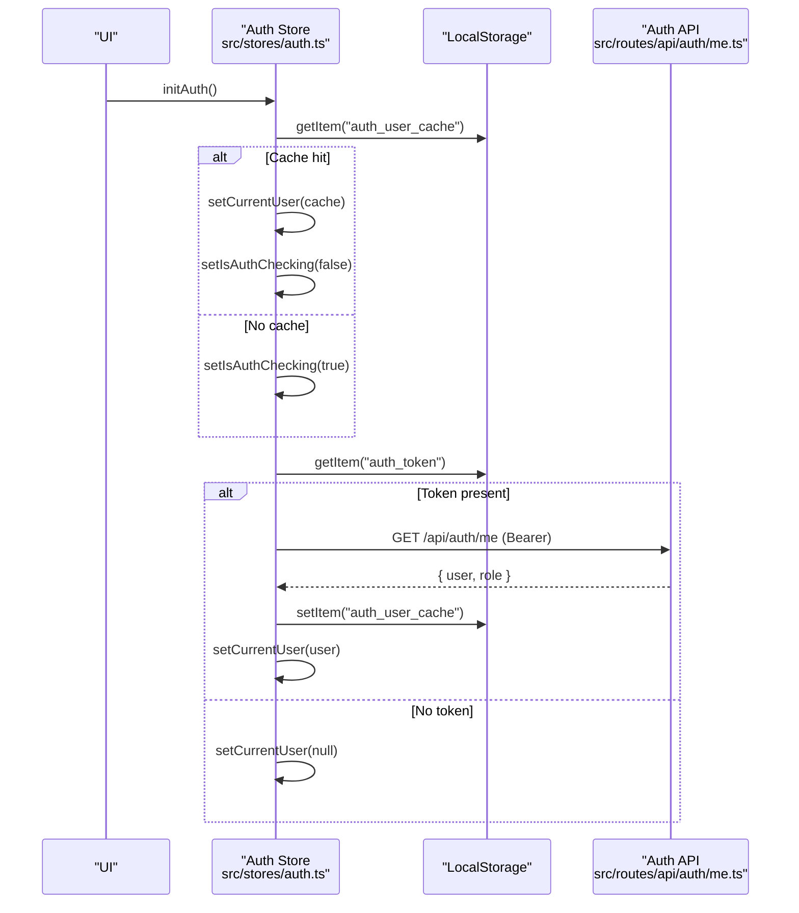
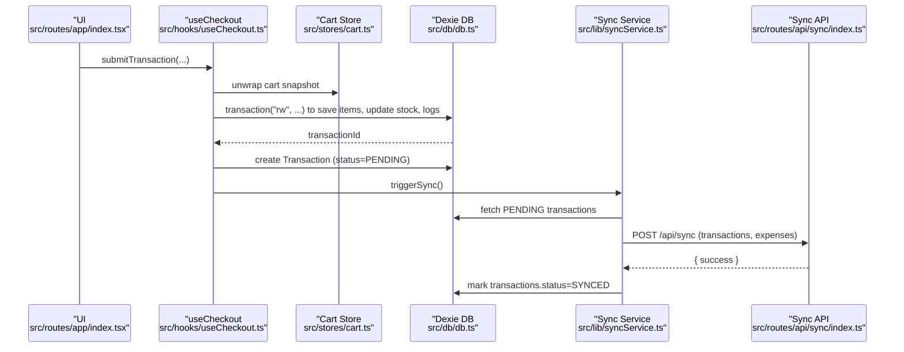
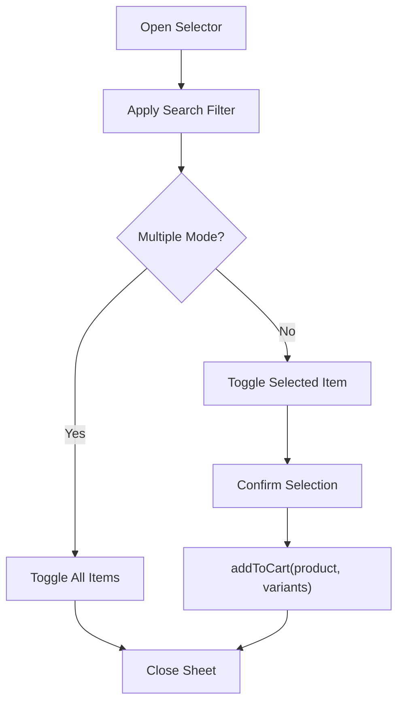
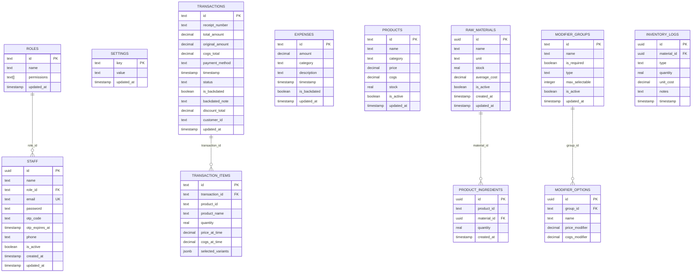
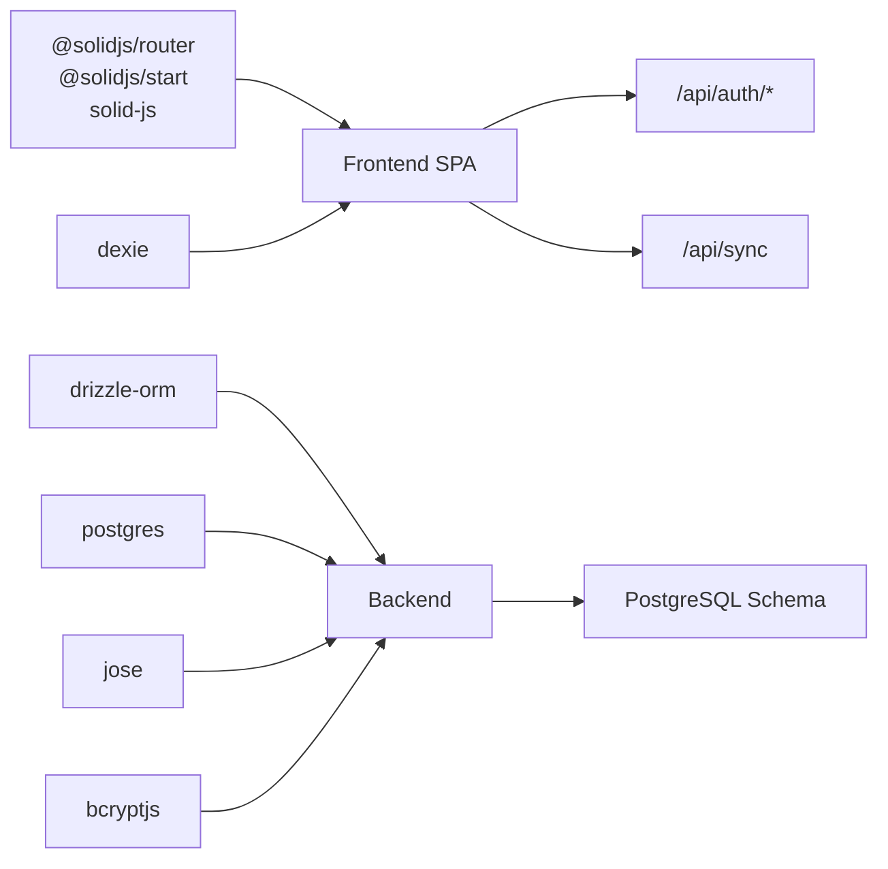

# Architecture Overview

<cite>
**Referenced Files in This Document**
- [README.md](file://README.md)
- [package.json](file://package.json)
- [src/app.tsx](file://src/app.tsx)
- [src/stores/auth.ts](file://src/stores/auth.ts)
- [src/stores/cart.ts](file://src/stores/cart.ts)
- [src/stores/loyalty.ts](file://src/stores/loyalty.ts)
- [src/db/db.ts](file://src/db/db.ts)
- [src/lib/syncService.ts](file://src/lib/syncService.ts)
- [src/hooks/useCheckout.ts](file://src/hooks/useCheckout.ts)
- [src/routes/api/sync/index.ts](file://src/routes/api/sync/index.ts)
- [src/routes/api/auth/login.ts](file://src/routes/api/auth/login.ts)
- [src/routes/api/auth/me.ts](file://src/routes/api/auth/me.ts)
- [src/server/db/index.ts](file://src/server/db/index.ts)
- [src/server/db/schema.ts](file://src/server/db/schema.ts)
- [src/routes/app/index.tsx](file://src/routes/app/index.tsx)
- [src/components/ui/product-selector.tsx](file://src/components/ui/product-selector.tsx)
</cite>

## Table of Contents
1. [Introduction](#introduction)
2. [Project Structure](#project-structure)
3. [Core Components](#core-components)
4. [Architecture Overview](#architecture-overview)
5. [Detailed Component Analysis](#detailed-component-analysis)
6. [Dependency Analysis](#dependency-analysis)
7. [Performance Considerations](#performance-considerations)
8. [Troubleshooting Guide](#troubleshooting-guide)
9. [Conclusion](#conclusion)

## Introduction
This document describes the NgePos Point-of-Sale (POS) system architecture. It combines a Solid.js Single Page Application (SPA) frontend with an offline-first design using IndexedDB via Dexie.js, a PostgreSQL backend powered by Drizzle ORM, and a RESTful API surface. The system emphasizes resilient client-side state management, reactive UI updates, and eventual consistency through a robust synchronization mechanism between local IndexedDB and the remote PostgreSQL database.

## Project Structure
The project follows a feature-based frontend layout with a clear separation of concerns:
- Frontend SPA entry and routing under src/routes and src/app.tsx
- Local state stores for authentication, cart, and loyalty under src/stores
- Offline-first data layer abstraction via Dexie under src/db/db.ts
- Backend API routes under src/routes/api
- Server-side database initialization and schema under src/server/db

**Diagram sources**
- [src/app.tsx:1-42](file://src/app.tsx#L1-L42)
- [src/stores/auth.ts:1-205](file://src/stores/auth.ts#L1-L205)
- [src/stores/cart.ts:1-256](file://src/stores/cart.ts#L1-L256)
- [src/stores/loyalty.ts:1-173](file://src/stores/loyalty.ts#L1-L173)
- [src/db/db.ts:1-569](file://src/db/db.ts#L1-L569)
- [src/lib/syncService.ts:1-110](file://src/lib/syncService.ts#L1-L110)
- [src/routes/api/sync/index.ts:1-97](file://src/routes/api/sync/index.ts#L1-L97)
- [src/routes/api/auth/login.ts:1-55](file://src/routes/api/auth/login.ts#L1-L55)
- [src/routes/api/auth/me.ts:1-60](file://src/routes/api/auth/me.ts#L1-L60)
- [src/server/db/index.ts:1-27](file://src/server/db/index.ts#L1-L27)
- [src/server/db/schema.ts:1-143](file://src/server/db/schema.ts#L1-L143)

**Section sources**
- [README.md:1-33](file://README.md#L1-L33)
- [package.json:1-56](file://package.json#L1-L56)
- [src/app.tsx:1-42](file://src/app.tsx#L1-L42)

## Core Components
- Solid.js SPA and Routing: Initializes the app, mounts routes, and renders UI with suspense and toasts.
- Authentication Store: Handles login, session verification, profile updates, and permission checks with optimistic UI and token-based authorization.
- Cart Store: Reactive shopping cart with variant-aware item IDs, quantity updates, campaign-based discount computation, and totals calculation.
- Loyalty Store: Manages customer stamps, eligibility checks, reward creation, and claiming with Dexie-backed persistence.
- Local Database (Dexie): Typed IndexedDB schema covering products, categories, transactions, expenses, campaigns, memberships, and inventory logs.
- Sync Service: Pushes pending local changes to the backend and marks them synced upon successful confirmation.
- Checkout Hook: Orchestrates transaction creation, inventory consumption, COGS calculations, optional reward inclusion, and triggers background synchronization.
- Backend API: Auth endpoints (login, profile, verification) and a sync endpoint that upserts transactions and items into PostgreSQL via Drizzle ORM.

**Section sources**
- [src/stores/auth.ts:1-205](file://src/stores/auth.ts#L1-L205)
- [src/stores/cart.ts:1-256](file://src/stores/cart.ts#L1-L256)
- [src/stores/loyalty.ts:1-173](file://src/stores/loyalty.ts#L1-L173)
- [src/db/db.ts:1-569](file://src/db/db.ts#L1-L569)
- [src/lib/syncService.ts:1-110](file://src/lib/syncService.ts#L1-L110)
- [src/hooks/useCheckout.ts:1-234](file://src/hooks/useCheckout.ts#L1-L234)
- [src/routes/api/sync/index.ts:1-97](file://src/routes/api/sync/index.ts#L1-L97)
- [src/routes/api/auth/login.ts:1-55](file://src/routes/api/auth/login.ts#L1-L55)
- [src/routes/api/auth/me.ts:1-60](file://src/routes/api/auth/me.ts#L1-L60)

## Architecture Overview
The system employs an offline-first pattern:
- UI components and stores drive user interactions.
- Local IndexedDB (Dexie) persists state and pending operations.
- A debounced sync service pushes pending data to the backend.
- The backend uses Drizzle ORM to upsert records into PostgreSQL, ensuring idempotent reconciliation.

**Diagram sources**
- [src/routes/app/index.tsx:1-282](file://src/routes/app/index.tsx#L1-L282)
- [src/stores/auth.ts:1-205](file://src/stores/auth.ts#L1-L205)
- [src/stores/cart.ts:1-256](file://src/stores/cart.ts#L1-L256)
- [src/stores/loyalty.ts:1-173](file://src/stores/loyalty.ts#L1-L173)
- [src/lib/syncService.ts:1-110](file://src/lib/syncService.ts#L1-L110)
- [src/hooks/useCheckout.ts:1-234](file://src/hooks/useCheckout.ts#L1-L234)
- [src/db/db.ts:1-569](file://src/db/db.ts#L1-L569)
- [src/routes/api/sync/index.ts:1-97](file://src/routes/api/sync/index.ts#L1-L97)
- [src/server/db/index.ts:1-27](file://src/server/db/index.ts#L1-L27)
- [src/server/db/schema.ts:1-143](file://src/server/db/schema.ts#L1-L143)

## Detailed Component Analysis

### Authentication and Authorization
- Optimistic rendering: On app mount, the auth store reads a cached user from local storage and verifies the token in the background.
- Token-based authorization: All protected endpoints expect a Bearer token; the backend validates JWT and enriches the response with role and permissions.
- Permission model: Roles carry arrays of permission identifiers; the store exposes a helper to check permissions, with a super admin bypass.

**Diagram sources**
- [src/stores/auth.ts:11-56](file://src/stores/auth.ts#L11-L56)
- [src/routes/api/auth/me.ts:10-59](file://src/routes/api/auth/me.ts#L10-L59)

**Section sources**
- [src/stores/auth.ts:1-205](file://src/stores/auth.ts#L1-L205)
- [src/routes/api/auth/login.ts:1-55](file://src/routes/api/auth/login.ts#L1-L55)
- [src/routes/api/auth/me.ts:1-60](file://src/routes/api/auth/me.ts#L1-L60)
- [src/data/permissions.ts:1-45](file://src/data/permissions.ts#L1-L45)

### Cart and Pricing Engine
- Reactive cart: Uses a Solid store to manage items, quantities, and variant combinations.
- Variant-aware item IDs: Generated from product ID plus a normalized hash of selected options to separate variant sets.
- Campaign-based discounts: Loads active campaigns from Dexie, computes applicable discounts respecting priority and bundle constraints, and avoids double-dipping by tracking consumed quantities.

**Diagram sources**
- [src/stores/cart.ts:115-236](file://src/stores/cart.ts#L115-L236)

**Section sources**
- [src/stores/cart.ts:1-256](file://src/stores/cart.ts#L1-L256)
- [src/db/db.ts:189-217](file://src/db/db.ts#L189-L217)

### Checkout and Inventory Flow
- Transaction creation: Wraps product updates, inventory logging, and transaction insertion in a single IndexedDB transaction to maintain consistency.
- COGS computation: Recipes from raw materials and variant modifiers contribute to unit cost; stock is decremented and inventory logs are recorded.
- Pending state: Transactions are marked as PENDING locally; a background sync pushes them to the server and marks them SYNCED upon success.
- Loyalty integration: After successful checkout, stamps are added, rewards may be created, and claimed rewards are updated.

**Diagram sources**
- [src/hooks/useCheckout.ts:30-217](file://src/hooks/useCheckout.ts#L30-L217)
- [src/stores/cart.ts:1-256](file://src/stores/cart.ts#L1-L256)
- [src/lib/syncService.ts:4-59](file://src/lib/syncService.ts#L4-L59)
- [src/routes/api/sync/index.ts:10-98](file://src/routes/api/sync/index.ts#L10-L98)

**Section sources**
- [src/hooks/useCheckout.ts:1-234](file://src/hooks/useCheckout.ts#L1-L234)
- [src/lib/syncService.ts:1-110](file://src/lib/syncService.ts#L1-L110)
- [src/routes/api/sync/index.ts:1-97](file://src/routes/api/sync/index.ts#L1-L97)

### Product Selector Component
- Feature-rich selector with search, multi-select, and variant-aware selection.
- Integrates with the cart store to add items with selected variants.

**Diagram sources**
- [src/components/ui/product-selector.tsx:14-236](file://src/components/ui/product-selector.tsx#L14-L236)
- [src/stores/cart.ts:16-48](file://src/stores/cart.ts#L16-L48)

**Section sources**
- [src/components/ui/product-selector.tsx:1-236](file://src/components/ui/product-selector.tsx#L1-L236)
- [src/stores/cart.ts:1-256](file://src/stores/cart.ts#L1-L256)

### Backend Data Persistence and Schema
- Server DB initialization loads environment variables and connects to PostgreSQL using Drizzle ORM.
- Schema defines core entities including roles, staff, settings, transactions, transaction items, expenses, products, raw materials, modifier groups/options, product ingredients, and inventory logs.

**Diagram sources**
- [src/server/db/schema.ts:1-143](file://src/server/db/schema.ts#L1-L143)

**Section sources**
- [src/server/db/index.ts:1-27](file://src/server/db/index.ts#L1-L27)
- [src/server/db/schema.ts:1-143](file://src/server/db/schema.ts#L1-L143)

## Dependency Analysis
- Frontend dependencies include Solid.js, @solidjs/router, @solidjs/start, dexie, drizzle-orm, postgres, lucide-solid, and others.
- Backend uses Drizzle ORM with PostgreSQL via postgres-js, JWT verification via jose, and bcrypt for password hashing.
- The frontend depends on the backend for authentication and synchronization; the backend depends on the schema for data modeling.

**Diagram sources**
- [package.json:11-40](file://package.json#L11-L40)
- [src/server/db/index.ts:1-27](file://src/server/db/index.ts#L1-L27)
- [src/server/db/schema.ts:1-143](file://src/server/db/schema.ts#L1-L143)

**Section sources**
- [package.json:1-56](file://package.json#L1-L56)
- [src/server/db/index.ts:1-27](file://src/server/db/index.ts#L1-L27)

## Performance Considerations
- Offline-first reduces latency and improves resilience; Dexie provides efficient IndexedDB access with typed tables.
- Debounced synchronization prevents excessive network calls; adjust timing based on workload.
- Campaign discount computation preloads related entities to minimize repeated queries.
- COGS calculations and inventory logs are performed within a single transaction to avoid partial writes.

## Troubleshooting Guide
- Authentication failures: Verify JWT secret, token presence, and server connectivity. Check that the frontend stores and removes tokens appropriately on invalidation.
- Sync errors: Inspect the sync service debounce and confirm that PENDING transactions exist and are properly formatted. Ensure the backend upsert logic handles conflicts.
- Checkout failures: Review transaction item generation, stock updates, and inventory log entries. Confirm that raw material recipes and variant modifiers are correctly applied.
- Database seeding: Confirm that the seed script runs on first load and roles are initialized with correct permissions.

**Section sources**
- [src/stores/auth.ts:58-195](file://src/stores/auth.ts#L58-L195)
- [src/lib/syncService.ts:4-59](file://src/lib/syncService.ts#L4-L59)
- [src/hooks/useCheckout.ts:57-213](file://src/hooks/useCheckout.ts#L57-L213)
- [src/db/db.ts:513-570](file://src/db/db.ts#L513-L570)

## Conclusion
NgePos integrates a modern Solid.js SPA with an offline-first IndexedDB layer and a robust PostgreSQL backend via Drizzle ORM. The system’s reactive stores, typed local schema, and debounced synchronization provide a responsive, resilient POS experience. Strong separation of concerns across authentication, cart, loyalty, and checkout ensures maintainability and scalability.