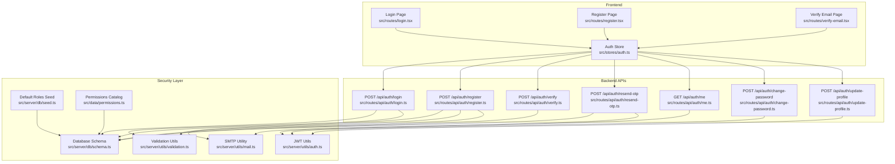
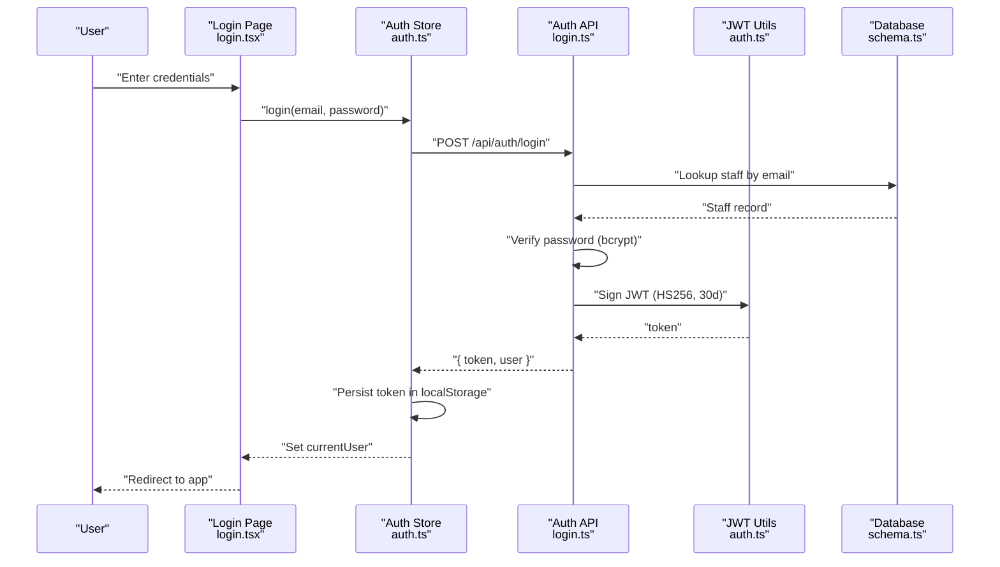
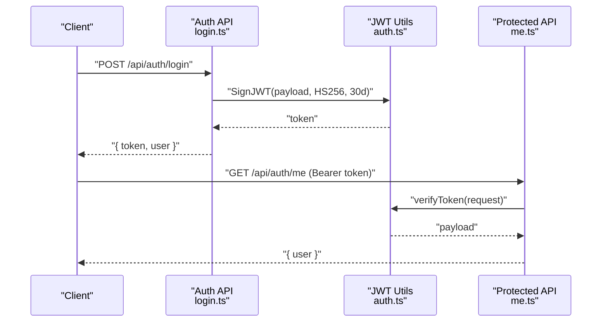
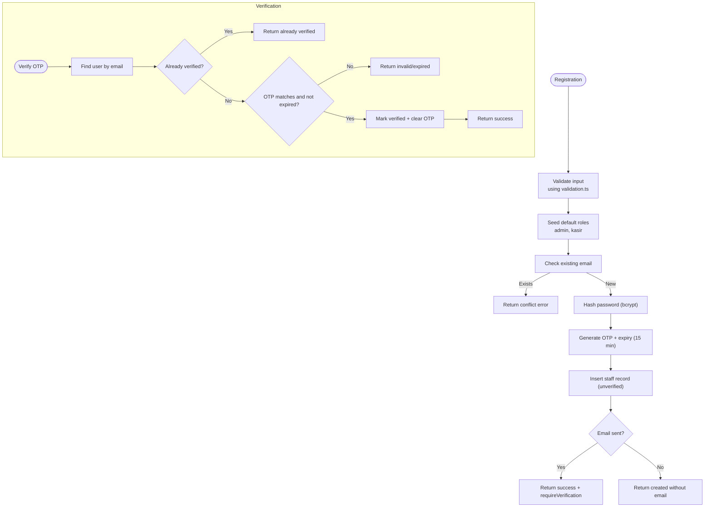
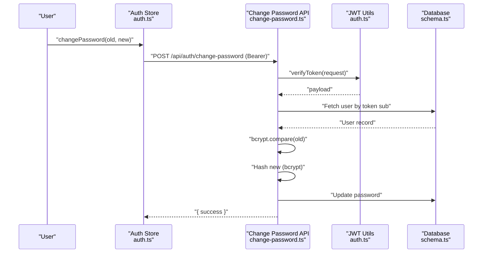
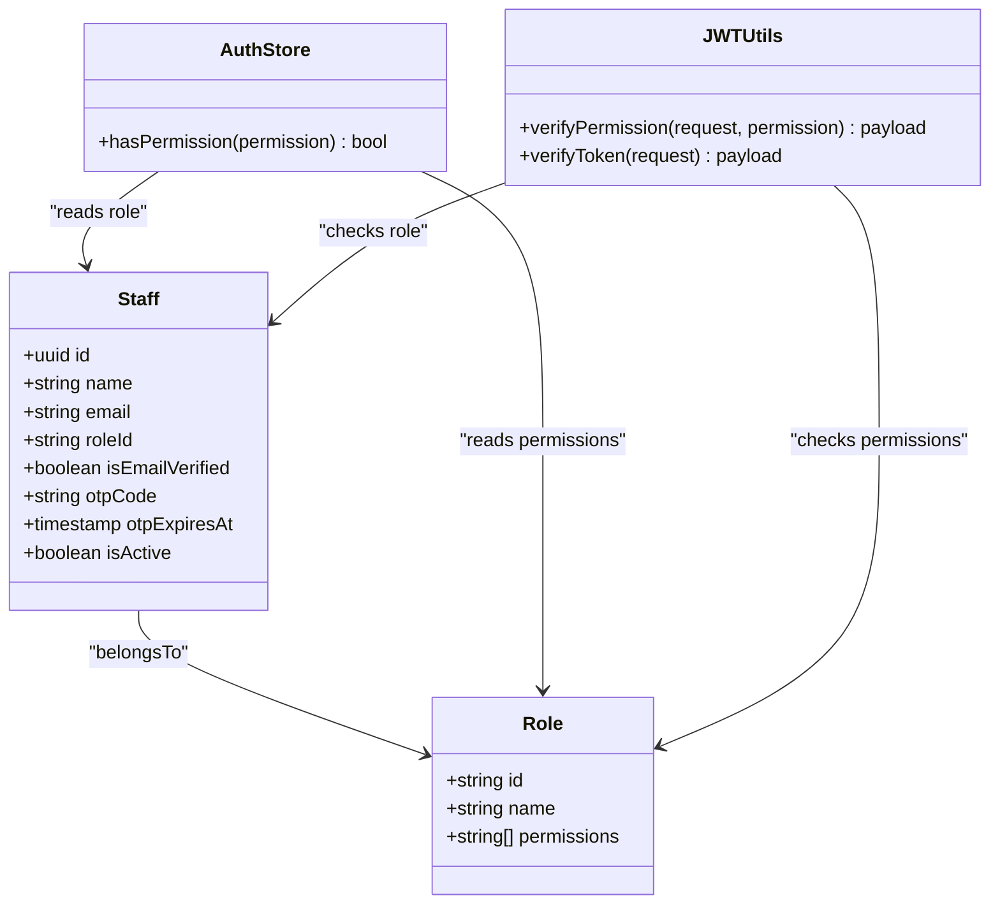
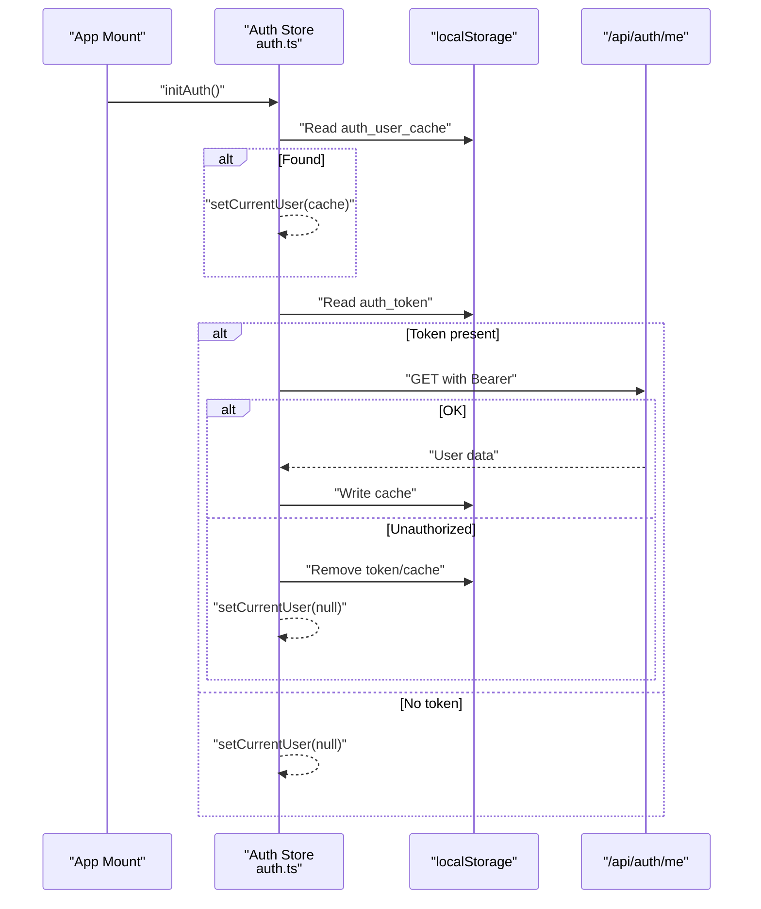
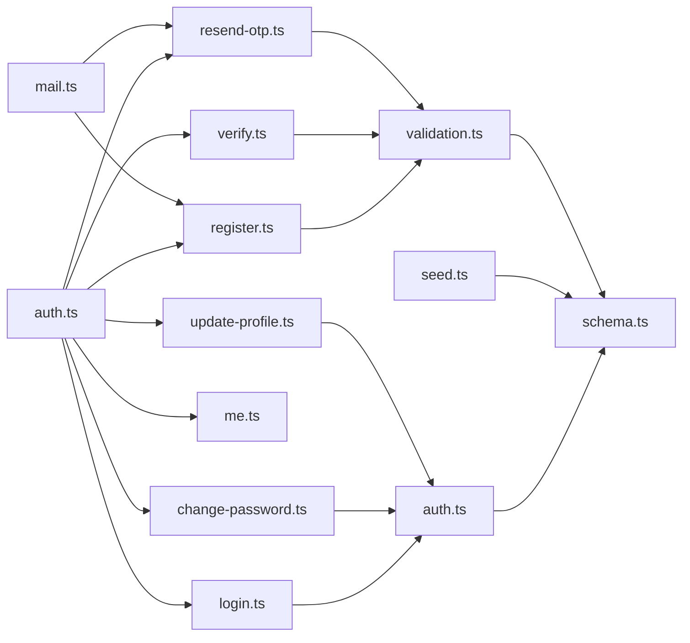

# Authentication & Authorization

<cite>
**Referenced Files in This Document**
- [src/stores/auth.ts](file://src/stores/auth.ts)
- [src/server/utils/auth.ts](file://src/server/utils/auth.ts)
- [src/routes/api/auth/login.ts](file://src/routes/api/auth/login.ts)
- [src/routes/api/auth/me.ts](file://src/routes/api/auth/me.ts)
- [src/routes/api/auth/register.ts](file://src/routes/api/auth/register.ts)
- [src/routes/api/auth/verify.ts](file://src/routes/api/auth/verify.ts)
- [src/routes/api/auth/resend-otp.ts](file://src/routes/api/auth/resend-otp.ts)
- [src/routes/api/auth/change-password.ts](file://src/routes/api/auth/change-password.ts)
- [src/routes/api/auth/update-profile.ts](file://src/routes/api/auth/update-profile.ts)
- [src/server/db/schema.ts](file://src/server/db/schema.ts)
- [src/server/db/seed.ts](file://src/server/db/seed.ts)
- [src/data/permissions.ts](file://src/data/permissions.ts)
- [src/server/utils/mail.ts](file://src/server/utils/mail.ts)
- [src/server/utils/validation.ts](file://src/server/utils/validation.ts)
- [src/routes/login.tsx](file://src/routes/login.tsx)
- [src/routes/register.tsx](file://src/routes/register.tsx)
- [src/routes/verify-email.tsx](file://src/routes/verify-email.tsx)
</cite>

## Update Summary
**Changes Made**
- Added comprehensive JWT-based authentication system documentation
- Documented token verification and permission checking mechanisms
- Enhanced custom error handling with AuthError class
- Updated authentication flow diagrams to reflect JWT implementation
- Added permission checking and RBAC documentation
- Updated troubleshooting guide with JWT-specific issues

## Table of Contents
1. [Introduction](#introduction)
2. [Project Structure](#project-structure)
3. [Core Components](#core-components)
4. [Architecture Overview](#architecture-overview)
5. [Detailed Component Analysis](#detailed-component-analysis)
6. [Dependency Analysis](#dependency-analysis)
7. [Performance Considerations](#performance-considerations)
8. [Troubleshooting Guide](#troubleshooting-guide)
9. [Conclusion](#conclusion)

## Introduction
This document explains the authentication and authorization system of the NgePos POS application. It covers JWT-based authentication, user registration and login, password management, email verification with OTP, and role-based access control (RBAC). The system implements comprehensive token verification, permission checking, and custom error handling mechanisms. It also provides practical guidance on authentication state management, permission checking, secure API communication, token storage strategies, and troubleshooting.

## Project Structure
Authentication and authorization spans both the frontend store and backend API routes, backed by a database schema and seeded roles. The frontend pages coordinate user actions, while the backend enforces security policies and manages tokens with comprehensive error handling.

**Diagram sources**
- [src/routes/login.tsx](file://src/routes/login.tsx)
- [src/routes/register.tsx](file://src/routes/register.tsx)
- [src/routes/verify-email.tsx](file://src/routes/verify-email.tsx)
- [src/stores/auth.ts](file://src/stores/auth.ts)
- [src/routes/api/auth/register.ts](file://src/routes/api/auth/register.ts)
- [src/routes/api/auth/login.ts](file://src/routes/api/auth/login.ts)
- [src/routes/api/auth/me.ts](file://src/routes/api/auth/me.ts)
- [src/routes/api/auth/verify.ts](file://src/routes/api/auth/verify.ts)
- [src/routes/api/auth/resend-otp.ts](file://src/routes/api/auth/resend-otp.ts)
- [src/routes/api/auth/change-password.ts](file://src/routes/api/auth/change-password.ts)
- [src/routes/api/auth/update-profile.ts](file://src/routes/api/auth/update-profile.ts)
- [src/server/utils/auth.ts](file://src/server/utils/auth.ts)
- [src/server/db/schema.ts](file://src/server/db/schema.ts)
- [src/server/db/seed.ts](file://src/server/db/seed.ts)
- [src/data/permissions.ts](file://src/data/permissions.ts)
- [src/server/utils/mail.ts](file://src/server/utils/mail.ts)
- [src/server/utils/validation.ts](file://src/server/utils/validation.ts)

**Section sources**
- [src/stores/auth.ts](file://src/stores/auth.ts)
- [src/server/utils/auth.ts](file://src/server/utils/auth.ts)
- [src/routes/api/auth/register.ts](file://src/routes/api/auth/register.ts)
- [src/routes/api/auth/login.ts](file://src/routes/api/auth/login.ts)
- [src/routes/api/auth/me.ts](file://src/routes/api/auth/me.ts)
- [src/routes/api/auth/verify.ts](file://src/routes/api/auth/verify.ts)
- [src/routes/api/auth/resend-otp.ts](file://src/routes/api/auth/resend-otp.ts)
- [src/routes/api/auth/change-password.ts](file://src/routes/api/auth/change-password.ts)
- [src/routes/api/auth/update-profile.ts](file://src/routes/api/auth/update-profile.ts)
- [src/server/db/schema.ts](file://src/server/db/schema.ts)
- [src/server/db/seed.ts](file://src/server/db/seed.ts)
- [src/data/permissions.ts](file://src/data/permissions.ts)
- [src/server/utils/mail.ts](file://src/server/utils/mail.ts)
- [src/server/utils/validation.ts](file://src/server/utils/validation.ts)
- [src/routes/login.tsx](file://src/routes/login.tsx)
- [src/routes/register.tsx](file://src/routes/register.tsx)
- [src/routes/verify-email.tsx](file://src/routes/verify-email.tsx)

## Core Components
- Frontend authentication store: Manages login state, token lifecycle, profile updates, password changes, and permission checks with comprehensive error handling.
- Backend JWT utilities: Provides token verification, permission checking, and custom AuthError class for standardized error responses.
- Backend authentication routes: Implement registration, login, profile verification, OTP resend, profile update, password change, and protected profile retrieval with JWT-based authorization.
- Database schema: Defines staff, roles, and permissions arrays; includes OTP fields and email verification flags.
- Default roles and permissions catalog: Seeds roles and enumerates available permissions.
- Email utility: Sends verification emails with OTP codes.
- Validation utilities: Provides shared validation functions for input sanitization and format checking.

Key responsibilities:
- JWT generation and verification for session persistence with HS256 algorithm.
- Password hashing using bcryptjs for universal runtime compatibility.
- OTP-based email verification with expiration and rate limiting.
- RBAC using role IDs and permission arrays with admin bypass.
- Custom error handling with standardized HTTP status codes.

**Section sources**
- [src/stores/auth.ts](file://src/stores/auth.ts)
- [src/server/utils/auth.ts](file://src/server/utils/auth.ts)
- [src/routes/api/auth/register.ts](file://src/routes/api/auth/register.ts)
- [src/routes/api/auth/login.ts](file://src/routes/api/auth/login.ts)
- [src/routes/api/auth/me.ts](file://src/routes/api/auth/me.ts)
- [src/routes/api/auth/verify.ts](file://src/routes/api/auth/verify.ts)
- [src/routes/api/auth/resend-otp.ts](file://src/routes/api/auth/resend-otp.ts)
- [src/routes/api/auth/change-password.ts](file://src/routes/api/auth/change-password.ts)
- [src/routes/api/auth/update-profile.ts](file://src/routes/api/auth/update-profile.ts)
- [src/server/db/schema.ts](file://src/server/db/schema.ts)
- [src/server/db/seed.ts](file://src/server/db/seed.ts)
- [src/data/permissions.ts](file://src/data/permissions.ts)
- [src/server/utils/mail.ts](file://src/server/utils/mail.ts)
- [src/server/utils/validation.ts](file://src/server/utils/validation.ts)

## Architecture Overview
The system uses a layered architecture with comprehensive JWT-based security:
- Presentation layer: SolidJS pages for login, registration, and verification.
- State management: Centralized auth store with signals and local caching.
- Security layer: JWT utilities with token verification and permission checking.
- API layer: Route handlers implementing authentication and authorization logic with custom error handling.
- Persistence layer: PostgreSQL schema with Drizzle ORM.
- Security utilities: JWT signing/verification, bcrypt password hashing, and SMTP-based OTP delivery.

**Diagram sources**
- [src/routes/login.tsx](file://src/routes/login.tsx)
- [src/stores/auth.ts](file://src/stores/auth.ts)
- [src/routes/api/auth/login.ts](file://src/routes/api/auth/login.ts)
- [src/server/utils/auth.ts](file://src/server/utils/auth.ts)
- [src/server/db/schema.ts](file://src/server/db/schema.ts)

## Detailed Component Analysis

### JWT-Based Authentication Flow
The system implements a comprehensive JWT-based authentication mechanism with robust token verification and permission checking:

- **Token Generation**: On successful login, the backend signs a JWT containing user identifier, name, and role payload with HS256 algorithm and 30-day expiration.
- **Token Validation**: Protected endpoints use `verifyToken()` function to validate JWT signatures and extract subject (user ID) for user data loading.
- **Permission Checking**: The `verifyPermission()` function validates tokens and checks user permissions, with admin role bypass for all permissions.
- **Custom Error Handling**: The `AuthError` class provides standardized error responses with appropriate HTTP status codes.

**Diagram sources**
- [src/routes/api/auth/login.ts](file://src/routes/api/auth/login.ts)
- [src/routes/api/auth/me.ts](file://src/routes/api/auth/me.ts)
- [src/server/utils/auth.ts](file://src/server/utils/auth.ts)

**Section sources**
- [src/server/utils/auth.ts](file://src/server/utils/auth.ts)
- [src/routes/api/auth/login.ts](file://src/routes/api/auth/login.ts)
- [src/routes/api/auth/me.ts](file://src/routes/api/auth/me.ts)

### User Registration and Email Verification
The registration and verification system implements comprehensive security measures:

- **Registration Process**:
  - Input validation using shared validation utilities.
  - Password hashing with bcryptjs for universal runtime compatibility.
  - OTP generation with 6-digit random code and 15-minute expiry.
  - Role seeding with default admin and kasir roles.
  - Database insertion with unverified status and OTP fields.
  - SMTP email sending with fallback for delivery failures.

- **Verification Workflow**:
  - OTP validation using bcrypt comparison for security.
  - Expiration checking with proper error handling.
  - User activation and OTP cleanup upon successful verification.
  - Rate limiting for verification attempts.

- **OTP Resend Mechanism**:
  - New OTP generation with updated expiry timestamps.
  - Database updates with hashed OTP storage.
  - SMTP transport with timeout prevention.
  - Rate limiting enforcement for resend operations.

**Diagram sources**
- [src/routes/api/auth/register.ts](file://src/routes/api/auth/register.ts)
- [src/routes/api/auth/verify.ts](file://src/routes/api/auth/verify.ts)
- [src/routes/api/auth/resend-otp.ts](file://src/routes/api/auth/resend-otp.ts)
- [src/server/db/seed.ts](file://src/server/db/seed.ts)
- [src/server/utils/mail.ts](file://src/server/utils/mail.ts)
- [src/server/utils/validation.ts](file://src/server/utils/validation.ts)

**Section sources**
- [src/routes/api/auth/register.ts](file://src/routes/api/auth/register.ts)
- [src/routes/api/auth/verify.ts](file://src/routes/api/auth/verify.ts)
- [src/routes/api/auth/resend-otp.ts](file://src/routes/api/auth/resend-otp.ts)
- [src/server/db/seed.ts](file://src/server/db/seed.ts)
- [src/server/utils/mail.ts](file://src/server/utils/mail.ts)
- [src/server/utils/validation.ts](file://src/server/utils/validation.ts)

### Password Management
The password management system implements secure operations with comprehensive validation:

- **Change Password Process**:
  - Token verification using `verifyToken()` function.
  - Old password validation using bcrypt comparison.
  - New password strength validation (minimum 6 characters).
  - Secure password hashing with bcryptjs.
  - Database updates with timestamp tracking.

- **Update Profile Operations**:
  - Token-based authentication for all profile updates.
  - Duplicate email validation preventing conflicts.
  - Field-specific updates for name, email, and phone.
  - Database consistency with updatedAt timestamps.

**Diagram sources**
- [src/stores/auth.ts](file://src/stores/auth.ts)
- [src/routes/api/auth/change-password.ts](file://src/routes/api/auth/change-password.ts)
- [src/server/utils/auth.ts](file://src/server/utils/auth.ts)
- [src/server/db/schema.ts](file://src/server/db/schema.ts)

**Section sources**
- [src/routes/api/auth/change-password.ts](file://src/routes/api/auth/change-password.ts)
- [src/routes/api/auth/update-profile.ts](file://src/routes/api/auth/update-profile.ts)
- [src/stores/auth.ts](file://src/stores/auth.ts)
- [src/server/utils/auth.ts](file://src/server/utils/auth.ts)

### Role-Based Access Control (RBAC)
The RBAC system provides comprehensive permission management:

- **Role Structure**:
  - Roles table with UUID primary keys and permission arrays.
  - Default roles include admin (all permissions) and kasir (limited permissions).
  - Permission categories for organized access control.

- **Permission Checking**:
  - `hasPermission()` function in auth store for frontend checks.
  - `verifyPermission()` function for backend authorization.
  - Admin role bypass for all permissions.
  - Dynamic permission array checking for role-based access.

- **Permission Catalog**:
  - Comprehensive permission list covering all system functionalities.
  - Category-based organization for intuitive management.
  - Permission IDs aligned with system features.

**Diagram sources**
- [src/server/db/schema.ts](file://src/server/db/schema.ts)
- [src/stores/auth.ts](file://src/stores/auth.ts)
- [src/server/db/seed.ts](file://src/server/db/seed.ts)
- [src/data/permissions.ts](file://src/data/permissions.ts)
- [src/server/utils/auth.ts](file://src/server/utils/auth.ts)

**Section sources**
- [src/server/db/schema.ts](file://src/server/db/schema.ts)
- [src/server/db/seed.ts](file://src/server/db/seed.ts)
- [src/data/permissions.ts](file://src/data/permissions.ts)
- [src/stores/auth.ts](file://src/stores/auth.ts)
- [src/server/utils/auth.ts](file://src/server/utils/auth.ts)

### Authentication State Management and UI Integration
The authentication state management implements resilient frontend integration:

- **Initialization Process**:
  - Optimistic UI rendering using localStorage cache for instant user experience.
  - Background token verification with automatic cleanup on failure.
  - Proper error handling and state restoration on authentication errors.

- **Login Flow**:
  - Form validation and submission handling.
  - Token storage and user state management.
  - Conditional navigation based on verification requirements.

- **Verification Flow**:
  - OTP input validation and submission.
  - Rate limiting enforcement at UI level.
  - Success/error state management with user feedback.

- **Protected Operations**:
  - Automatic token inclusion in all authenticated requests.
  - Error handling for unauthorized access attempts.
  - Seamless user experience during authentication transitions.

**Diagram sources**
- [src/stores/auth.ts](file://src/stores/auth.ts)
- [src/routes/api/auth/me.ts](file://src/routes/api/auth/me.ts)

**Section sources**
- [src/stores/auth.ts](file://src/stores/auth.ts)
- [src/routes/login.tsx](file://src/routes/login.tsx)
- [src/routes/register.tsx](file://src/routes/register.tsx)
- [src/routes/verify-email.tsx](file://src/routes/verify-email.tsx)

## Dependency Analysis
The authentication system has well-defined dependencies ensuring modularity and maintainability:

- **Frontend Dependencies**:
  - Auth store depends on all authentication routes for API operations.
  - Pages depend on auth store for user state and authentication flows.
  - No circular dependencies between frontend components.

- **Backend Dependencies**:
  - Authentication routes depend on JWT utilities for token operations.
  - All protected routes depend on JWT utilities for authorization.
  - Database operations use Drizzle ORM with proper schema definitions.
  - Validation utilities provide shared input validation across endpoints.

- **Security Dependencies**:
  - JWT utilities depend on jose library for cryptographic operations.
  - bcryptjs for password hashing and comparison.
  - Environment variables for JWT secret and SMTP configuration.
  - Custom AuthError class for standardized error responses.

**Diagram sources**
- [src/stores/auth.ts](file://src/stores/auth.ts)
- [src/routes/api/auth/register.ts](file://src/routes/api/auth/register.ts)
- [src/routes/api/auth/login.ts](file://src/routes/api/auth/login.ts)
- [src/routes/api/auth/me.ts](file://src/routes/api/auth/me.ts)
- [src/routes/api/auth/verify.ts](file://src/routes/api/auth/verify.ts)
- [src/routes/api/auth/resend-otp.ts](file://src/routes/api/auth/resend-otp.ts)
- [src/routes/api/auth/change-password.ts](file://src/routes/api/auth/change-password.ts)
- [src/routes/api/auth/update-profile.ts](file://src/routes/api/auth/update-profile.ts)
- [src/server/utils/auth.ts](file://src/server/utils/auth.ts)
- [src/server/utils/validation.ts](file://src/server/utils/validation.ts)
- [src/server/db/schema.ts](file://src/server/db/schema.ts)
- [src/server/db/seed.ts](file://src/server/db/seed.ts)
- [src/server/utils/mail.ts](file://src/server/utils/mail.ts)

**Section sources**
- [src/stores/auth.ts](file://src/stores/auth.ts)
- [src/server/utils/auth.ts](file://src/server/utils/auth.ts)
- [src/routes/api/auth/register.ts](file://src/routes/api/auth/register.ts)
- [src/routes/api/auth/login.ts](file://src/routes/api/auth/login.ts)
- [src/routes/api/auth/me.ts](file://src/routes/api/auth/me.ts)
- [src/routes/api/auth/verify.ts](file://src/routes/api/auth/verify.ts)
- [src/routes/api/auth/resend-otp.ts](file://src/routes/api/auth/resend-otp.ts)
- [src/routes/api/auth/change-password.ts](file://src/routes/api/auth/change-password.ts)
- [src/routes/api/auth/update-profile.ts](file://src/routes/api/auth/update-profile.ts)
- [src/server/db/schema.ts](file://src/server/db/schema.ts)
- [src/server/db/seed.ts](file://src/server/db/seed.ts)
- [src/server/utils/mail.ts](file://src/server/utils/mail.ts)
- [src/server/utils/validation.ts](file://src/server/utils/validation.ts)

## Performance Considerations
The authentication system implements several performance optimizations:

- **Token Validity**: 30-day expiration provides balance between user convenience and security, with automatic refresh through background verification.
- **OTP Expiry**: 15-minute validity reduces replay attack surface while maintaining usability.
- **Network Optimization**: SMTP transport timeouts prevent hanging operations with 5-second connection limits.
- **Local Caching**: Optimistic UI rendering with localStorage cache improves perceived performance with background verification for data freshness.
- **Database Efficiency**: Targeted queries with proper indexing and role permission arrays kept concise.
- **Rate Limiting**: Configurable rate limits prevent abuse while maintaining system responsiveness.
- **Error Handling**: Efficient error propagation prevents cascading failures and maintains system stability.

## Troubleshooting Guide
Comprehensive troubleshooting for JWT-based authentication system:

### JWT and Token Issues
- **Invalid or Expired Token**:
  - Symptom: 401 Unauthorized on protected endpoints.
  - Resolution: Clear localStorage auth_token and auth_user_cache, re-authenticate with valid credentials.
  - Check: JWT_SECRET environment variable configuration and token expiration settings.

- **Token Verification Failures**:
  - Symptom: "Token tidak valid atau kedaluwarsa" error messages.
  - Resolution: Verify HS256 algorithm compatibility and secret key consistency across deployments.
  - Debug: Check server logs for jose library errors and token format validation.

### Authentication Flow Problems
- **Account Inactive or Unverified**:
  - Symptom: Login returns inactive status or requires verification.
  - Resolution: Complete email verification process or contact administrator for account activation.
  - Prevention: Implement proper email delivery and verification workflow monitoring.

- **Password Change Failures**:
  - Symptom: "Password lama tidak sesuai" or new password validation errors.
  - Resolution: Ensure correct old password and meet minimum 6-character requirement for new passwords.
  - Security: Verify bcryptjs compatibility and proper password hashing implementation.

### Permission and Access Issues
- **Permission Denied Errors**:
  - Symptom: "Forbidden: insufficient permissions" (403 status).
  - Resolution: Verify user role assignments and permission arrays in database.
  - Admin Access: Confirm admin role bypass functionality for super-user access.

### System Configuration Issues
- **Environment Variable Problems**:
  - Symptom: "JWT_SECRET environment variable is not set" fatal error.
  - Resolution: Configure JWT_SECRET and SMTP environment variables in .env file.
  - Security: Use strong, randomly generated secrets and secure credential storage.

- **Database Connection Issues**:
  - Symptom: Authentication endpoints fail with database errors.
  - Resolution: Verify database connectivity and schema migration status.
  - Monitoring: Check role seeding completion and permission table integrity.

### Operational Diagnostics
- **Frontend State Issues**:
  - Check localStorage for auth_token and auth_user_cache entries.
  - Monitor browser developer tools for authentication API responses.
  - Verify proper error handling and state restoration on authentication failures.

- **Backend Logging**:
  - Review authentication logs for rate limiting events and validation failures.
  - Monitor JWT verification errors and permission checking outcomes.
  - Track SMTP delivery failures and OTP verification attempts.

**Section sources**
- [src/stores/auth.ts](file://src/stores/auth.ts)
- [src/server/utils/auth.ts](file://src/server/utils/auth.ts)
- [src/routes/api/auth/login.ts](file://src/routes/api/auth/login.ts)
- [src/routes/api/auth/me.ts](file://src/routes/api/auth/me.ts)
- [src/routes/api/auth/change-password.ts](file://src/routes/api/auth/change-password.ts)
- [src/routes/api/auth/update-profile.ts](file://src/routes/api/auth/update-profile.ts)
- [src/server/utils/mail.ts](file://src/server/utils/mail.ts)

## Conclusion
NgePos implements a robust, comprehensive authentication and authorization system centered on JWT-based security with advanced token verification, permission checking, and custom error handling. The system provides layered security through JWT utilities, bcrypt-based password hashing, OTP-driven email verification, and sophisticated RBAC with admin bypass capabilities. The frontend store offers resilient state management with optimistic rendering and background verification, while the backend enforces strict validation and authorization policies. The custom AuthError class ensures standardized error responses with appropriate HTTP status codes, and comprehensive rate limiting protects against abuse. By following the recommended token storage strategies, environment variable configuration, and troubleshooting procedures, teams can maintain secure and reliable access control across the POS platform while ensuring optimal user experience and system performance.