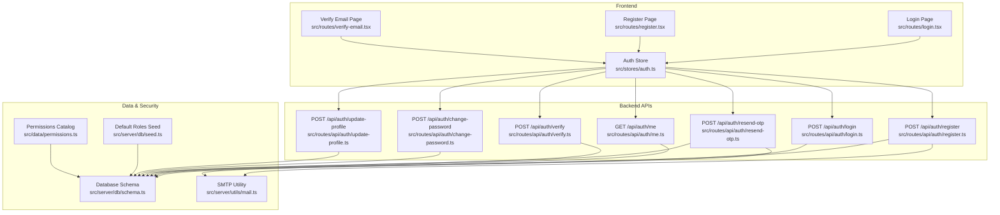
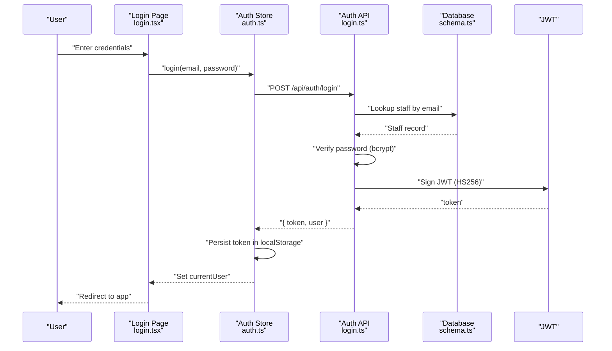
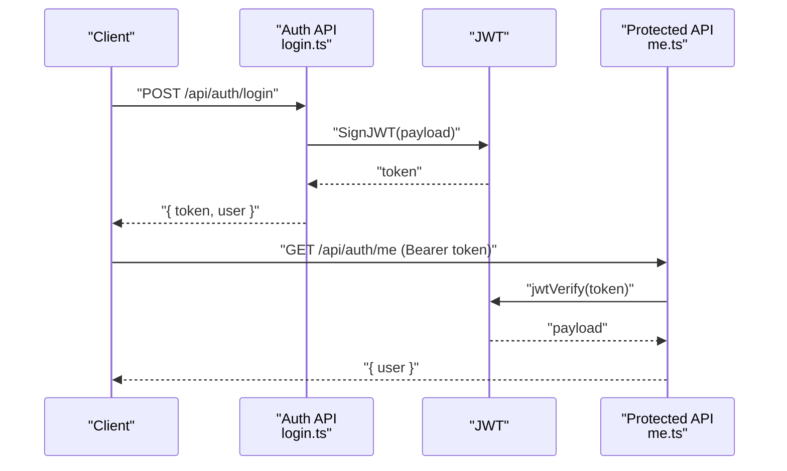
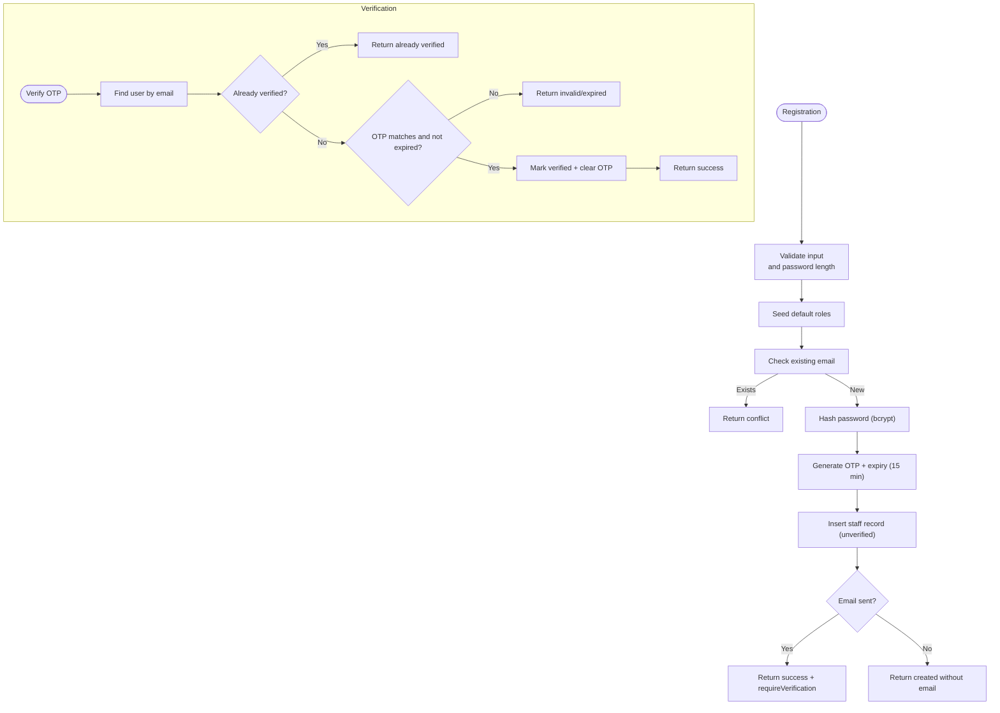
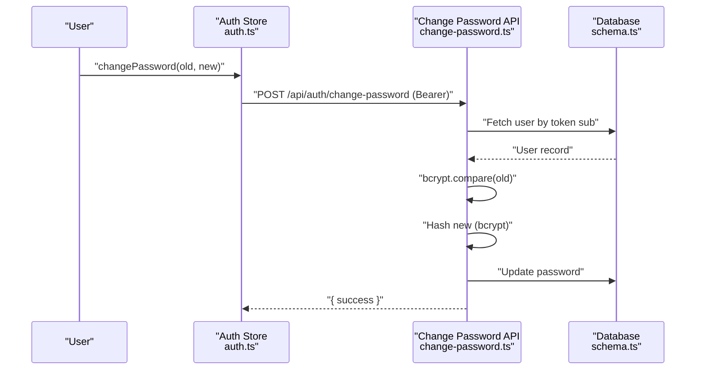
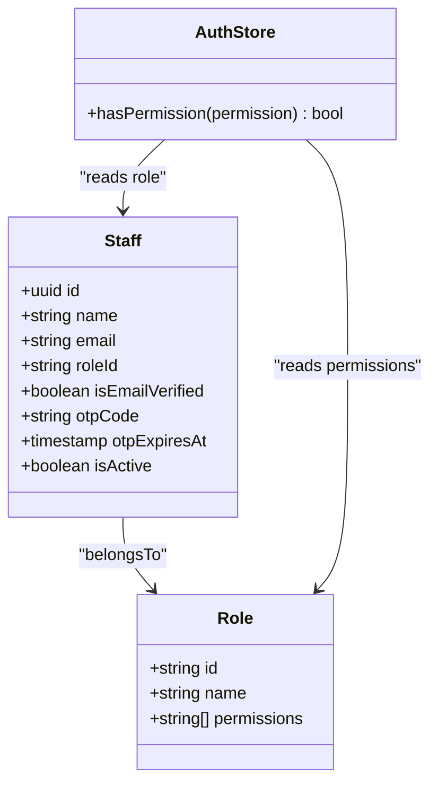
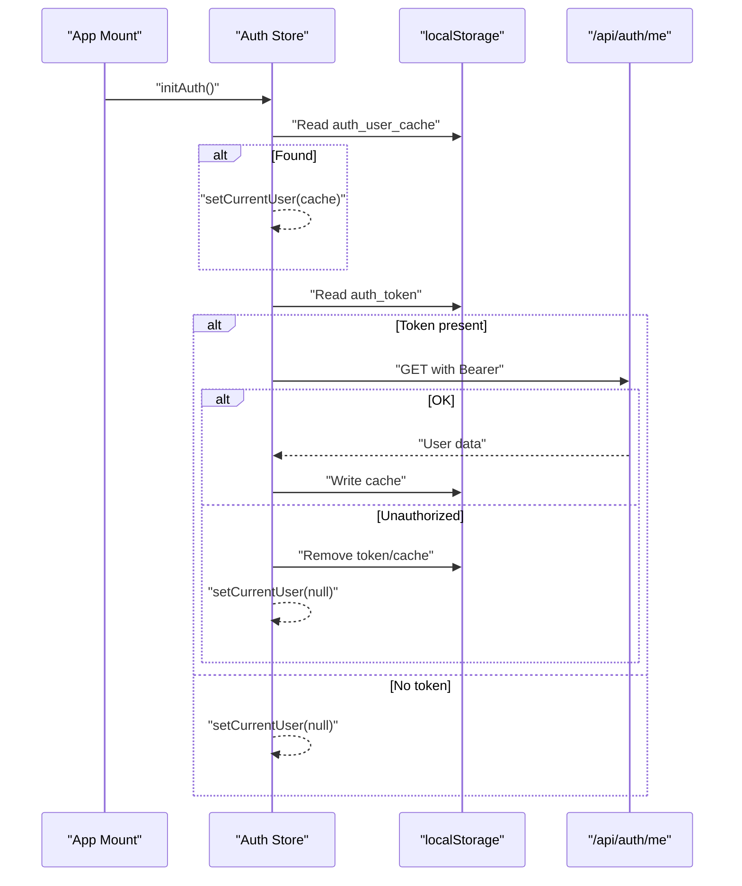
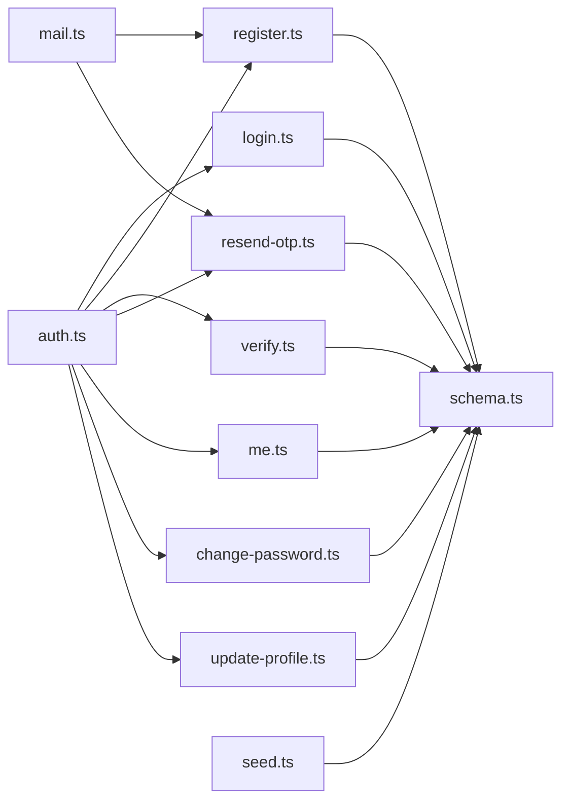

# Authentication & Authorization

<cite>
**Referenced Files in This Document**
- [src/routes/api/auth/register.ts](file://src/routes/api/auth/register.ts)
- [src/routes/api/auth/login.ts](file://src/routes/api/auth/login.ts)
- [src/routes/api/auth/me.ts](file://src/routes/api/auth/me.ts)
- [src/routes/api/auth/verify.ts](file://src/routes/api/auth/verify.ts)
- [src/routes/api/auth/resend-otp.ts](file://src/routes/api/auth/resend-otp.ts)
- [src/routes/api/auth/change-password.ts](file://src/routes/api/auth/change-password.ts)
- [src/routes/api/auth/update-profile.ts](file://src/routes/api/auth/update-profile.ts)
- [src/stores/auth.ts](file://src/stores/auth.ts)
- [src/server/db/schema.ts](file://src/server/db/schema.ts)
- [src/server/db/seed.ts](file://src/server/db/seed.ts)
- [src/data/permissions.ts](file://src/data/permissions.ts)
- [src/server/utils/mail.ts](file://src/server/utils/mail.ts)
- [src/routes/login.tsx](file://src/routes/login.tsx)
- [src/routes/register.tsx](file://src/routes/register.tsx)
- [src/routes/verify-email.tsx](file://src/routes/verify-email.tsx)
</cite>

## Table of Contents
1. [Introduction](#introduction)
2. [Project Structure](#project-structure)
3. [Core Components](#core-components)
4. [Architecture Overview](#architecture-overview)
5. [Detailed Component Analysis](#detailed-component-analysis)
6. [Dependency Analysis](#dependency-analysis)
7. [Performance Considerations](#performance-considerations)
8. [Troubleshooting Guide](#troubleshooting-guide)
9. [Conclusion](#conclusion)

## Introduction
This document explains the authentication and authorization system of the NgePos POS application. It covers JWT-based authentication, user registration and login, password management, email verification with OTP, and role-based access control (RBAC). It also provides practical guidance on authentication state management, permission checking, secure API communication, token storage strategies, and troubleshooting.

## Project Structure
Authentication and authorization spans both the frontend store and backend API routes, backed by a database schema and seeded roles. The frontend pages coordinate user actions, while the backend enforces security policies and manages tokens.

**Diagram sources**
- [src/routes/login.tsx](file://src/routes/login.tsx)
- [src/routes/register.tsx](file://src/routes/register.tsx)
- [src/routes/verify-email.tsx](file://src/routes/verify-email.tsx)
- [src/stores/auth.ts](file://src/stores/auth.ts)
- [src/routes/api/auth/register.ts](file://src/routes/api/auth/register.ts)
- [src/routes/api/auth/login.ts](file://src/routes/api/auth/login.ts)
- [src/routes/api/auth/me.ts](file://src/routes/api/auth/me.ts)
- [src/routes/api/auth/verify.ts](file://src/routes/api/auth/verify.ts)
- [src/routes/api/auth/resend-otp.ts](file://src/routes/api/auth/resend-otp.ts)
- [src/routes/api/auth/change-password.ts](file://src/routes/api/auth/change-password.ts)
- [src/routes/api/auth/update-profile.ts](file://src/routes/api/auth/update-profile.ts)
- [src/server/db/schema.ts](file://src/server/db/schema.ts)
- [src/server/db/seed.ts](file://src/server/db/seed.ts)
- [src/data/permissions.ts](file://src/data/permissions.ts)
- [src/server/utils/mail.ts](file://src/server/utils/mail.ts)

**Section sources**
- [src/stores/auth.ts](file://src/stores/auth.ts)
- [src/routes/api/auth/register.ts](file://src/routes/api/auth/register.ts)
- [src/routes/api/auth/login.ts](file://src/routes/api/auth/login.ts)
- [src/routes/api/auth/me.ts](file://src/routes/api/auth/me.ts)
- [src/routes/api/auth/verify.ts](file://src/routes/api/auth/verify.ts)
- [src/routes/api/auth/resend-otp.ts](file://src/routes/api/auth/resend-otp.ts)
- [src/routes/api/auth/change-password.ts](file://src/routes/api/auth/change-password.ts)
- [src/routes/api/auth/update-profile.ts](file://src/routes/api/auth/update-profile.ts)
- [src/server/db/schema.ts](file://src/server/db/schema.ts)
- [src/server/db/seed.ts](file://src/server/db/seed.ts)
- [src/data/permissions.ts](file://src/data/permissions.ts)
- [src/server/utils/mail.ts](file://src/server/utils/mail.ts)
- [src/routes/login.tsx](file://src/routes/login.tsx)
- [src/routes/register.tsx](file://src/routes/register.tsx)
- [src/routes/verify-email.tsx](file://src/routes/verify-email.tsx)

## Core Components
- Frontend authentication store: Manages login state, token lifecycle, profile updates, password changes, and permission checks.
- Backend authentication routes: Implement registration, login, profile verification, OTP resend, profile update, password change, and protected profile retrieval.
- Database schema: Defines staff, roles, and permissions arrays; includes OTP fields and email verification flags.
- Default roles and permissions catalog: Seeds roles and enumerates available permissions.
- Email utility: Sends verification emails with OTP codes.

Key responsibilities:
- JWT generation and verification for session persistence.
- Password hashing using bcryptjs for universal runtime compatibility.
- OTP-based email verification with expiration.
- RBAC using role IDs and permission arrays.

**Section sources**
- [src/stores/auth.ts](file://src/stores/auth.ts)
- [src/routes/api/auth/register.ts](file://src/routes/api/auth/register.ts)
- [src/routes/api/auth/login.ts](file://src/routes/api/auth/login.ts)
- [src/routes/api/auth/me.ts](file://src/routes/api/auth/me.ts)
- [src/routes/api/auth/verify.ts](file://src/routes/api/auth/verify.ts)
- [src/routes/api/auth/resend-otp.ts](file://src/routes/api/auth/resend-otp.ts)
- [src/routes/api/auth/change-password.ts](file://src/routes/api/auth/change-password.ts)
- [src/routes/api/auth/update-profile.ts](file://src/routes/api/auth/update-profile.ts)
- [src/server/db/schema.ts](file://src/server/db/schema.ts)
- [src/server/db/seed.ts](file://src/server/db/seed.ts)
- [src/data/permissions.ts](file://src/data/permissions.ts)
- [src/server/utils/mail.ts](file://src/server/utils/mail.ts)

## Architecture Overview
The system uses a layered architecture:
- Presentation layer: SolidJS pages for login, registration, and verification.
- State management: Centralized auth store with signals and local caching.
- API layer: Route handlers implementing authentication and authorization logic.
- Persistence layer: PostgreSQL schema with Drizzle ORM.
- Security utilities: JWT signing/verification and SMTP-based OTP delivery.

**Diagram sources**
- [src/routes/login.tsx](file://src/routes/login.tsx)
- [src/stores/auth.ts](file://src/stores/auth.ts)
- [src/routes/api/auth/login.ts](file://src/routes/api/auth/login.ts)
- [src/server/db/schema.ts](file://src/server/db/schema.ts)

## Detailed Component Analysis

### JWT-Based Authentication Flow
- Token generation: On successful login, the backend signs a JWT containing the user identifier, name, and role payload.
- Token validation: Protected endpoints verify the JWT signature and extract the subject (user ID) to load current user data.
- Expiration: Tokens are issued with a 30-day expiration.

**Diagram sources**
- [src/routes/api/auth/login.ts](file://src/routes/api/auth/login.ts)
- [src/routes/api/auth/me.ts](file://src/routes/api/auth/me.ts)

**Section sources**
- [src/routes/api/auth/login.ts](file://src/routes/api/auth/login.ts)
- [src/routes/api/auth/me.ts](file://src/routes/api/auth/me.ts)

### User Registration and Email Verification
- Registration:
  - Validates input and ensures password length.
  - Seeds default roles if missing.
  - Hashes password with bcryptjs.
  - Generates a 6-digit OTP with a 15-minute expiry.
  - Inserts a new staff record with unverified status and OTP fields.
  - Attempts to send a verification email; response indicates whether email was sent.
- Verification:
  - Accepts email and OTP, validates existence, unverified status, OTP equality, and expiry.
  - Marks the user as verified and clears OTP fields.
- OTP Resend:
  - Regenerates OTP and expiry.
  - Updates the database and attempts to re-send the email.
  - Enforces a 60-second cooldown at the UI level.

**Diagram sources**
- [src/routes/api/auth/register.ts](file://src/routes/api/auth/register.ts)
- [src/routes/api/auth/verify.ts](file://src/routes/api/auth/verify.ts)
- [src/routes/api/auth/resend-otp.ts](file://src/routes/api/auth/resend-otp.ts)
- [src/server/db/seed.ts](file://src/server/db/seed.ts)
- [src/server/utils/mail.ts](file://src/server/utils/mail.ts)

**Section sources**
- [src/routes/api/auth/register.ts](file://src/routes/api/auth/register.ts)
- [src/routes/api/auth/verify.ts](file://src/routes/api/auth/verify.ts)
- [src/routes/api/auth/resend-otp.ts](file://src/routes/api/auth/resend-otp.ts)
- [src/server/db/seed.ts](file://src/server/db/seed.ts)
- [src/server/utils/mail.ts](file://src/server/utils/mail.ts)

### Password Management
- Change password:
  - Requires a valid Bearer token.
  - Verifies the old password using bcrypt comparison.
  - Enforces minimum length for the new password.
  - Hashes the new password and updates the database.
- Update profile:
  - Requires a valid Bearer token.
  - Prevents duplicate email usage across users.
  - Updates name, email, and phone.

**Diagram sources**
- [src/stores/auth.ts](file://src/stores/auth.ts)
- [src/routes/api/auth/change-password.ts](file://src/routes/api/auth/change-password.ts)
- [src/server/db/schema.ts](file://src/server/db/schema.ts)

**Section sources**
- [src/routes/api/auth/change-password.ts](file://src/routes/api/auth/change-password.ts)
- [src/routes/api/auth/update-profile.ts](file://src/routes/api/auth/update-profile.ts)
- [src/stores/auth.ts](file://src/stores/auth.ts)

### Role-Based Access Control (RBAC)
- Roles and permissions:
  - Roles table stores role IDs, names, and an array of permission identifiers.
  - Default roles include admin and kasir, with differing permission sets.
- Permission checking:
  - The auth store exposes a permission checker that grants super-admin bypass for admin role and otherwise checks the user’s role permissions array.
- Permission catalog:
  - A centralized list defines categories and permission IDs used across the system.

**Diagram sources**
- [src/server/db/schema.ts](file://src/server/db/schema.ts)
- [src/stores/auth.ts](file://src/stores/auth.ts)
- [src/server/db/seed.ts](file://src/server/db/seed.ts)
- [src/data/permissions.ts](file://src/data/permissions.ts)

**Section sources**
- [src/server/db/schema.ts](file://src/server/db/schema.ts)
- [src/server/db/seed.ts](file://src/server/db/seed.ts)
- [src/data/permissions.ts](file://src/data/permissions.ts)
- [src/stores/auth.ts](file://src/stores/auth.ts)

### Authentication State Management and UI Integration
- Initialization:
  - On app mount, the store attempts to restore a cached user from localStorage for instant UI rendering.
  - Background verification calls /api/auth/me with the stored Bearer token.
  - On failure, tokens and caches are cleared, and the user is logged out.
- Login flow:
  - The login page triggers the store’s login method, navigates on success, and redirects to verification if required.
- Verification flow:
  - The verification page collects a 6-digit OTP, enforces length, and calls the verify endpoint.
  - Resend OTP is throttled at the UI level (60-second cooldown) and re-sends a new OTP via the backend.
- Profile and password updates:
  - Protected endpoints are called with Authorization headers carrying the Bearer token.

**Diagram sources**
- [src/stores/auth.ts](file://src/stores/auth.ts)
- [src/routes/api/auth/me.ts](file://src/routes/api/auth/me.ts)

**Section sources**
- [src/stores/auth.ts](file://src/stores/auth.ts)
- [src/routes/login.tsx](file://src/routes/login.tsx)
- [src/routes/register.tsx](file://src/routes/register.tsx)
- [src/routes/verify-email.tsx](file://src/routes/verify-email.tsx)

## Dependency Analysis
- Frontend depends on:
  - Auth store for state and API calls.
  - Pages for user input and navigation.
- Backend depends on:
  - Database schema for staff and roles.
  - Drizzle ORM for queries.
  - jose for JWT operations.
  - bcryptjs for password hashing.
  - nodemailer for SMTP-based OTP emails.
- RBAC depends on:
  - Seeded roles and permission catalogs.

**Diagram sources**
- [src/stores/auth.ts](file://src/stores/auth.ts)
- [src/routes/api/auth/register.ts](file://src/routes/api/auth/register.ts)
- [src/routes/api/auth/login.ts](file://src/routes/api/auth/login.ts)
- [src/routes/api/auth/me.ts](file://src/routes/api/auth/me.ts)
- [src/routes/api/auth/verify.ts](file://src/routes/api/auth/verify.ts)
- [src/routes/api/auth/resend-otp.ts](file://src/routes/api/auth/resend-otp.ts)
- [src/routes/api/auth/change-password.ts](file://src/routes/api/auth/change-password.ts)
- [src/routes/api/auth/update-profile.ts](file://src/routes/api/auth/update-profile.ts)
- [src/server/db/schema.ts](file://src/server/db/schema.ts)
- [src/server/db/seed.ts](file://src/server/db/seed.ts)
- [src/server/utils/mail.ts](file://src/server/utils/mail.ts)

**Section sources**
- [src/stores/auth.ts](file://src/stores/auth.ts)
- [src/routes/api/auth/register.ts](file://src/routes/api/auth/register.ts)
- [src/routes/api/auth/login.ts](file://src/routes/api/auth/login.ts)
- [src/routes/api/auth/me.ts](file://src/routes/api/auth/me.ts)
- [src/routes/api/auth/verify.ts](file://src/routes/api/auth/verify.ts)
- [src/routes/api/auth/resend-otp.ts](file://src/routes/api/auth/resend-otp.ts)
- [src/routes/api/auth/change-password.ts](file://src/routes/api/auth/change-password.ts)
- [src/routes/api/auth/update-profile.ts](file://src/routes/api/auth/update-profile.ts)
- [src/server/db/schema.ts](file://src/server/db/schema.ts)
- [src/server/db/seed.ts](file://src/server/db/seed.ts)
- [src/server/utils/mail.ts](file://src/server/utils/mail.ts)

## Performance Considerations
- Token validity: 30-day expiration balances convenience and risk; consider shorter expirations with automatic refresh for high-security scenarios.
- OTP expiry: 15-minute validity reduces replay risk; ensure clients enforce immediate feedback on expiry.
- Network retries: SMTP transport timeouts prevent hanging; consider exponential backoff for resend operations.
- Local caching: Optimistic UI rendering with localStorage cache improves perceived performance; background verification keeps data fresh.
- Database queries: Use targeted selects and avoid unnecessary joins; keep role permissions arrays concise.

## Troubleshooting Guide
Common issues and resolutions:
- Invalid or expired token:
  - Symptom: Unauthorized on protected endpoints.
  - Resolution: Clear localStorage token and cache; re-authenticate.
- Account inactive or unverified:
  - Symptom: Login returns inactive or requires verification.
  - Resolution: Activate account or complete email verification; resend OTP if needed.
- Password change failures:
  - Symptom: Old password mismatch or new password too short.
  - Resolution: Ensure correct old password and meet minimum length; retry after hashing completes.
- Duplicate email during profile update:
  - Symptom: Validation error indicating email already used.
  - Resolution: Use a unique email address.
- Email delivery failures:
  - Symptom: Registration or resend returns email failure.
  - Resolution: Check SMTP configuration and network connectivity; retry after fixing credentials.

Operational tips:
- Inspect browser localStorage for auth_token and auth_user_cache.
- Monitor backend logs for JWT verification errors and OTP validation failures.
- Verify SMTP environment variables and test transport connectivity.

**Section sources**
- [src/stores/auth.ts](file://src/stores/auth.ts)
- [src/routes/api/auth/login.ts](file://src/routes/api/auth/login.ts)
- [src/routes/api/auth/me.ts](file://src/routes/api/auth/me.ts)
- [src/routes/api/auth/change-password.ts](file://src/routes/api/auth/change-password.ts)
- [src/routes/api/auth/update-profile.ts](file://src/routes/api/auth/update-profile.ts)
- [src/server/utils/mail.ts](file://src/server/utils/mail.ts)

## Conclusion
NgePos implements a robust, layered authentication and authorization system centered on JWT, bcrypt-based password hashing, and OTP-driven email verification. The frontend store provides resilient state management with optimistic rendering and background verification, while the backend enforces strict validation and RBAC via seeded roles and permission arrays. By following the recommended token storage strategies and troubleshooting steps, teams can maintain secure and reliable access control across the POS platform.