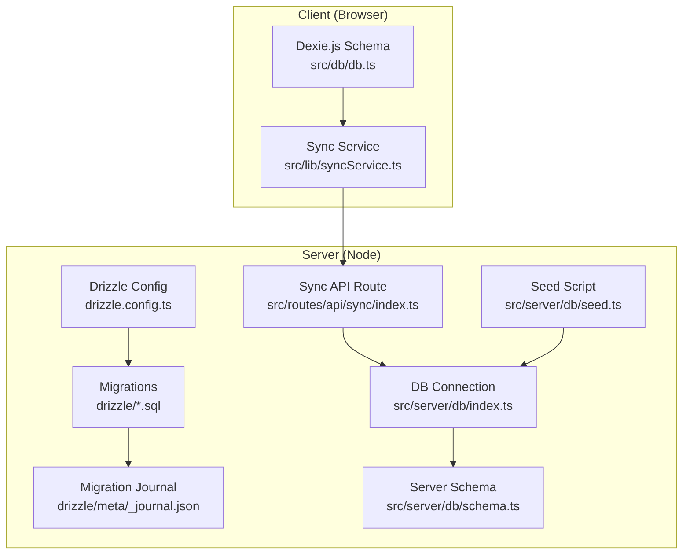
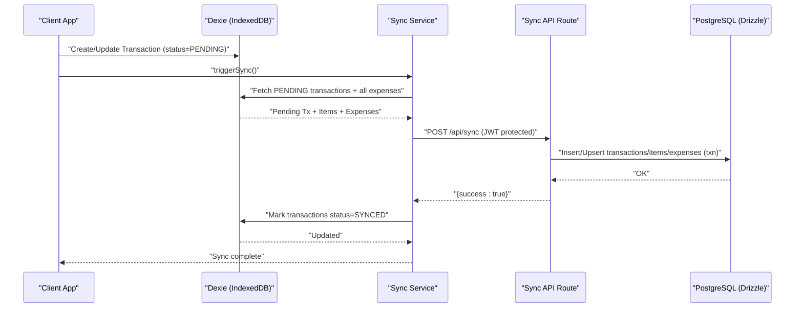
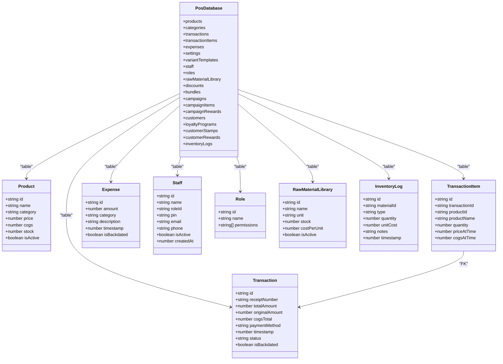
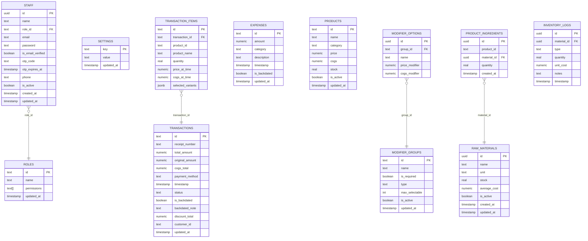
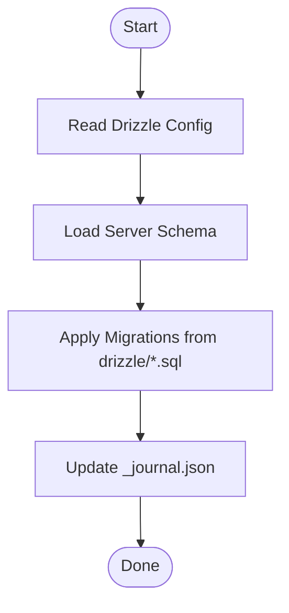
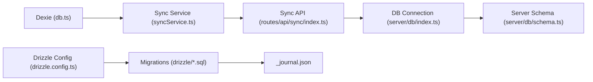

# Database Design

<cite>
**Referenced Files in This Document**
- [drizzle.config.ts](file://drizzle.config.ts)
- [0000_stiff_cassandra_nova.sql](file://drizzle/0000_stiff_cassandra_nova.sql)
- [schema.ts](file://src/server/db/schema.ts)
- [seed.ts](file://src/server/db/seed.ts)
- [db.ts](file://src/db/db.ts)
- [syncService.ts](file://src/lib/syncService.ts)
- [sync/index.ts](file://src/routes/api/sync/index.ts)
- [index.ts](file://src/server/db/index.ts)
- [mockProducts.ts](file://src/data/mockProducts.ts)
- [_journal.json](file://drizzle/meta/_journal.json)
</cite>

## Table of Contents
1. [Introduction](#introduction)
2. [Project Structure](#project-structure)
3. [Core Components](#core-components)
4. [Architecture Overview](#architecture-overview)
5. [Detailed Component Analysis](#detailed-component-analysis)
6. [Dependency Analysis](#dependency-analysis)
7. [Performance Considerations](#performance-considerations)
8. [Troubleshooting Guide](#troubleshooting-guide)
9. [Conclusion](#conclusion)

## Introduction
This document describes the dual database architecture of the NgePos POS system:
- Local client database: IndexedDB-backed with Dexie.js for offline-first operation and fast local queries.
- Server-side database: PostgreSQL managed with Drizzle ORM for reliable persistence, reporting, and centralized data.

It documents the IndexedDB schema design (tables, relationships, and version migrations), the PostgreSQL schema design (entities, constraints, and indexes), the data models for products, transactions, staff, inventory, and financial records, and the synchronization strategy between local and server databases. It also covers migration management, seed data, integrity considerations, backup strategies, and performance optimization techniques.

## Project Structure
The database-related parts of the project are organized as follows:
- Drizzle configuration and migrations under drizzle/.
- Server-side schema and seed logic under src/server/db/.
- Client-side IndexedDB schema and seed logic under src/db/db.ts.
- Sync service and API route under src/lib/syncService.ts and src/routes/api/sync/index.ts respectively.
- Mock data for seeding under src/data/.



**Diagram sources**
- [db.ts:270-496](file://src/db/db.ts#L270-L496)
- [syncService.ts:1-110](file://src/lib/syncService.ts#L1-L110)
- [drizzle.config.ts:1-11](file://drizzle.config.ts#L1-L11)
- [0000_stiff_cassandra_nova.sql:1-64](file://drizzle/0000_stiff_cassandra_nova.sql#L1-L64)
- [_journal.json:1-13](file://drizzle/meta/_journal.json#L1-L13)
- [schema.ts:1-143](file://src/server/db/schema.ts#L1-L143)
- [seed.ts:1-41](file://src/server/db/seed.ts#L1-L41)
- [sync/index.ts:1-97](file://src/routes/api/sync/index.ts#L1-L97)
- [index.ts:1-27](file://src/server/db/index.ts#L1-L27)

**Section sources**
- [drizzle.config.ts:1-11](file://drizzle.config.ts#L1-L11)
- [0000_stiff_cassandra_nova.sql:1-64](file://drizzle/0000_stiff_cassandra_nova.sql#L1-L64)
- [_journal.json:1-13](file://drizzle/meta/_journal.json#L1-L13)
- [schema.ts:1-143](file://src/server/db/schema.ts#L1-L143)
- [seed.ts:1-41](file://src/server/db/seed.ts#L1-L41)
- [db.ts:270-496](file://src/db/db.ts#L270-L496)
- [syncService.ts:1-110](file://src/lib/syncService.ts#L1-L110)
- [sync/index.ts:1-97](file://src/routes/api/sync/index.ts#L1-L97)
- [index.ts:1-27](file://src/server/db/index.ts#L1-L27)

## Core Components
- IndexedDB (Dexie.js) schema: Defines local tables, indexes, and versioned migrations for offline-first operation. Includes entities for products, categories, transactions, transaction items, expenses, settings, variants, staff, roles, raw materials, discounts, bundles, campaigns, customers, loyalty programs, stamps, rewards, and inventory logs.
- PostgreSQL (Drizzle ORM) schema: Defines server-side entities and relationships, including primary keys, foreign keys, enums, arrays, numeric precision, timestamps, and constraints. Includes roles, staff, settings, transactions, transaction items, expenses, products, raw materials, modifier groups/options, product ingredients, and inventory logs.
- Sync service: Collects local PENDING transactions and all expenses, attaches transaction items, posts to the server, and marks synced locally.
- Sync API route: Validates JWT, inserts/upserts transactions and items, and upserts expenses in a single transaction.
- Migration management: Drizzle manages migrations and a journal; the initial migration creates core tables and adds foreign keys.
- Seed data: Seeds default roles and populates mock products and categories locally; seeds default roles on the server.

**Section sources**
- [db.ts:270-496](file://src/db/db.ts#L270-L496)
- [schema.ts:1-143](file://src/server/db/schema.ts#L1-L143)
- [syncService.ts:1-110](file://src/lib/syncService.ts#L1-L110)
- [sync/index.ts:1-97](file://src/routes/api/sync/index.ts#L1-L97)
- [0000_stiff_cassandra_nova.sql:1-64](file://drizzle/0000_stiff_cassandra_nova.sql#L1-L64)
- [_journal.json:1-13](file://drizzle/meta/_journal.json#L1-L13)
- [seed.ts:1-41](file://src/server/db/seed.ts#L1-L41)
- [mockProducts.ts:1-85](file://src/data/mockProducts.ts#L1-L85)

## Architecture Overview
The system uses a hybrid architecture:
- Client writes to IndexedDB via Dexie.js and marks transactions as PENDING.
- The sync service periodically pushes PENDING transactions and expenses to the server.
- The server validates JWT, persists data atomically, and returns success.
- The client updates local statuses to SYNCED upon successful server response.



**Diagram sources**
- [syncService.ts:1-110](file://src/lib/syncService.ts#L1-L110)
- [sync/index.ts:1-97](file://src/routes/api/sync/index.ts#L1-L97)
- [db.ts:270-496](file://src/db/db.ts#L270-L496)

## Detailed Component Analysis

### IndexedDB Schema (Dexie.js)
The client-side schema defines tables and indexes for fast local reads and offline operation. It includes:
- Products, Categories, Transactions, Transaction Items, Expenses, Settings, Variant Templates, Staff, Roles, Raw Material Library, Discounts, Bundles, Campaigns, Campaign Items, Campaign Rewards, Customers, Loyalty Programs, Customer Stamps, Customer Rewards, and Inventory Logs.

Key characteristics:
- Composite and single-field indexes are declared per table for efficient querying.
- Versioned migrations add new tables and backfill default values for existing rows.
- Timestamps are stored as epoch milliseconds for simplicity and portability.
- Numeric values are stored as numbers; decimals are handled by converting to strings on the server side.



**Diagram sources**
- [db.ts:270-496](file://src/db/db.ts#L270-L496)
- [db.ts:62-137](file://src/db/db.ts#L62-L137)
- [db.ts:145-154](file://src/db/db.ts#L145-L154)
- [db.ts:26-34](file://src/db/db.ts#L26-L34)

**Section sources**
- [db.ts:270-496](file://src/db/db.ts#L270-L496)
- [db.ts:62-137](file://src/db/db.ts#L62-L137)
- [db.ts:145-154](file://src/db/db.ts#L145-L154)
- [db.ts:26-34](file://src/db/db.ts#L26-L34)

### PostgreSQL Schema (Drizzle ORM)
The server-side schema defines entities and relationships:
- Roles, Staff, Settings, Transactions, Transaction Items, Expenses, Products, Raw Materials, Modifier Groups, Modifier Options, Product Ingredients, and Inventory Logs.

Constraints and types:
- Primary keys, foreign keys, enums, arrays, numeric precision (20,2), timestamps, and booleans.
- Foreign keys enforce referential integrity (e.g., transaction items to transactions).
- Upserts are performed on the server to handle deduplication and idempotency.



**Diagram sources**
- [schema.ts:1-143](file://src/server/db/schema.ts#L1-L143)
- [0000_stiff_cassandra_nova.sql:1-64](file://drizzle/0000_stiff_cassandra_nova.sql#L1-L64)

**Section sources**
- [schema.ts:1-143](file://src/server/db/schema.ts#L1-L143)
- [0000_stiff_cassandra_nova.sql:1-64](file://drizzle/0000_stiff_cassandra_nova.sql#L1-L64)

### Data Models Overview
- Products: Local product catalog with variants and stock; server-side mirrors product metadata for reporting and inventory.
- Transactions and Transaction Items: Local PENDING status; server stores normalized transaction data with numeric precision and timestamps.
- Staff and Roles: Server-side authentication and permission model; client-side staff records mirror roles for UI.
- Expenses: Local and server both track amounts, categories, descriptions, timestamps, and backdated flags.
- Inventory: Raw materials and product ingredients define consumption; inventory logs track movements.
- Campaigns, Bundles, Discounts: Local promotional constructs; server does not persist these directly but can be extended.

**Section sources**
- [db.ts:62-137](file://src/db/db.ts#L62-L137)
- [db.ts:145-154](file://src/db/db.ts#L145-L154)
- [schema.ts:74-134](file://src/server/db/schema.ts#L74-L134)
- [mockProducts.ts:1-85](file://src/data/mockProducts.ts#L1-L85)

### Migration Management
- Drizzle configuration points to the schema file and PostgreSQL credentials.
- Initial migration script creates core tables and adds foreign keys.
- Migration journal tracks applied migrations to prevent re-running.



**Diagram sources**
- [drizzle.config.ts:1-11](file://drizzle.config.ts#L1-L11)
- [0000_stiff_cassandra_nova.sql:1-64](file://drizzle/0000_stiff_cassandra_nova.sql#L1-L64)
- [_journal.json:1-13](file://drizzle/meta/_journal.json#L1-L13)

**Section sources**
- [drizzle.config.ts:1-11](file://drizzle.config.ts#L1-L11)
- [0000_stiff_cassandra_nova.sql:1-64](file://drizzle/0000_stiff_cassandra_nova.sql#L1-L64)
- [_journal.json:1-13](file://drizzle/meta/_journal.json#L1-L13)

### Seed Data Implementation
- Client seed: Inserts mock categories and products, clears and bulk-adds, and ensures default roles exist with appropriate permissions.
- Server seed: Ensures default roles exist with idempotent upserts.

**Section sources**
- [db.ts:513-569](file://src/db/db.ts#L513-L569)
- [seed.ts:1-41](file://src/server/db/seed.ts#L1-L41)
- [mockProducts.ts:1-85](file://src/data/mockProducts.ts#L1-L85)

### Data Synchronization Strategy
- Local writes: Transactions are marked PENDING; expenses are sent as-is.
- Sync batching: Debounced push to avoid server overload.
- Server atomicity: Single transaction for inserts/upserts.
- Idempotency: Upserts on conflict prevent duplicates.

```mermaid
sequenceDiagram
participant Dexie as "Dexie"
participant SyncSvc as "Sync Service"
participant API as "Sync API"
participant DB as "PostgreSQL"
Dexie->>Dexie : "status=PENDING"
SyncSvc->>Dexie : "fetch PENDING + expenses"
Dexie-->>SyncSvc : "payload"
SyncSvc->>API : "POST payload"
API->>DB : "BEGIN; insert/upsert tx + items + expenses; COMMIT"
DB-->>API : "OK"
API-->>SyncSvc : "{success : true}"
SyncSvc->>Dexie : "status=SYNCED"
```

**Diagram sources**
- [syncService.ts:1-110](file://src/lib/syncService.ts#L1-L110)
- [sync/index.ts:1-97](file://src/routes/api/sync/index.ts#L1-L97)

**Section sources**
- [syncService.ts:1-110](file://src/lib/syncService.ts#L1-L110)
- [sync/index.ts:1-97](file://src/routes/api/sync/index.ts#L1-L97)

## Dependency Analysis
- Client depends on Dexie for local storage and on the sync service for server communication.
- Server depends on Drizzle ORM and PostgreSQL for persistence.
- The sync API depends on JWT verification and the server schema.



**Diagram sources**
- [db.ts:270-496](file://src/db/db.ts#L270-L496)
- [syncService.ts:1-110](file://src/lib/syncService.ts#L1-L110)
- [sync/index.ts:1-97](file://src/routes/api/sync/index.ts#L1-L97)
- [index.ts:1-27](file://src/server/db/index.ts#L1-L27)
- [schema.ts:1-143](file://src/server/db/schema.ts#L1-L143)
- [drizzle.config.ts:1-11](file://drizzle.config.ts#L1-L11)
- [0000_stiff_cassandra_nova.sql:1-64](file://drizzle/0000_stiff_cassandra_nova.sql#L1-L64)
- [_journal.json:1-13](file://drizzle/meta/_journal.json#L1-L13)

**Section sources**
- [db.ts:270-496](file://src/db/db.ts#L270-L496)
- [syncService.ts:1-110](file://src/lib/syncService.ts#L1-L110)
- [sync/index.ts:1-97](file://src/routes/api/sync/index.ts#L1-L97)
- [index.ts:1-27](file://src/server/db/index.ts#L1-L27)
- [schema.ts:1-143](file://src/server/db/schema.ts#L1-L143)
- [drizzle.config.ts:1-11](file://drizzle.config.ts#L1-L11)
- [0000_stiff_cassandra_nova.sql:1-64](file://drizzle/0000_stiff_cassandra_nova.sql#L1-L64)
- [_journal.json:1-13](file://drizzle/meta/_journal.json#L1-L13)

## Performance Considerations
- IndexedDB:
  - Use targeted indexes on frequently queried fields (e.g., transactions by status, timestamp).
  - Batch writes for large datasets (bulkAdd/bulkPut) to reduce transaction overhead.
  - Debounce sync to avoid frequent network calls.
- PostgreSQL:
  - Keep numeric values precise with decimal types and consistent precision/scale.
  - Add indexes on foreign keys and frequently filtered columns (e.g., transactions by timestamp, items by transactionId).
  - Use upserts to avoid duplicate inserts and maintain idempotency.
- Network:
  - Compress payloads and limit included fields to essential ones.
  - Implement exponential backoff on retry failures.

[No sources needed since this section provides general guidance]

## Troubleshooting Guide
- Sync fails with unauthorized:
  - Verify Authorization header and JWT secret configuration.
- Sync succeeds but local status not updated:
  - Ensure the client marks transactions as SYNCED after a successful response.
- Conflicts or duplicates:
  - Confirm upsert logic on the server and unique constraints.
- Missing migrations:
  - Check migration journal and re-run migrations if needed.
- Seed issues:
  - Verify seed scripts run in the correct order and environment.

**Section sources**
- [sync/index.ts:10-18](file://src/routes/api/sync/index.ts#L10-L18)
- [syncService.ts:39-44](file://src/lib/syncService.ts#L39-L44)
- [_journal.json:1-13](file://drizzle/meta/_journal.json#L1-L13)
- [seed.ts:1-41](file://src/server/db/seed.ts#L1-L41)

## Conclusion
NgePos employs a robust dual-database architecture:
- IndexedDB with Dexie.js enables offline-first, responsive local operations with versioned migrations and targeted indexing.
- PostgreSQL with Drizzle ORM provides reliable server-side persistence, enforced constraints, and scalable reporting.
- The sync service and API route implement a safe, idempotent, and debounced synchronization strategy.
- Seed scripts and migration management ensure consistent initialization and evolution of both local and server schemas.