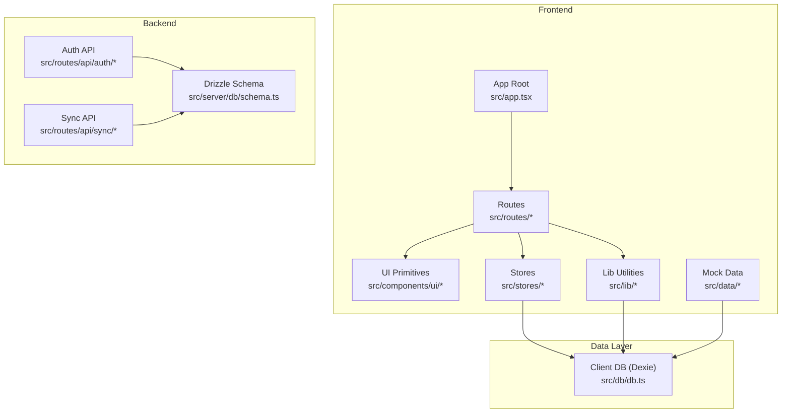
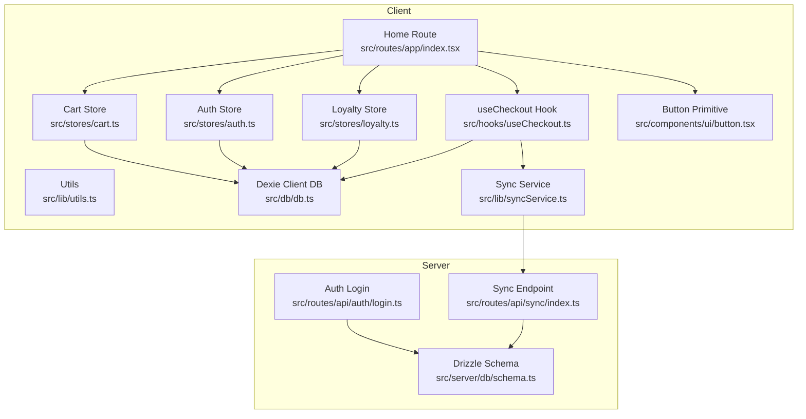
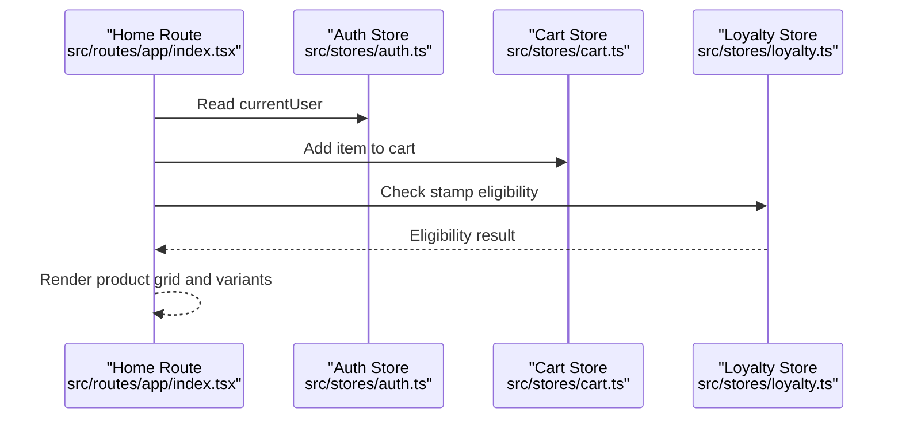
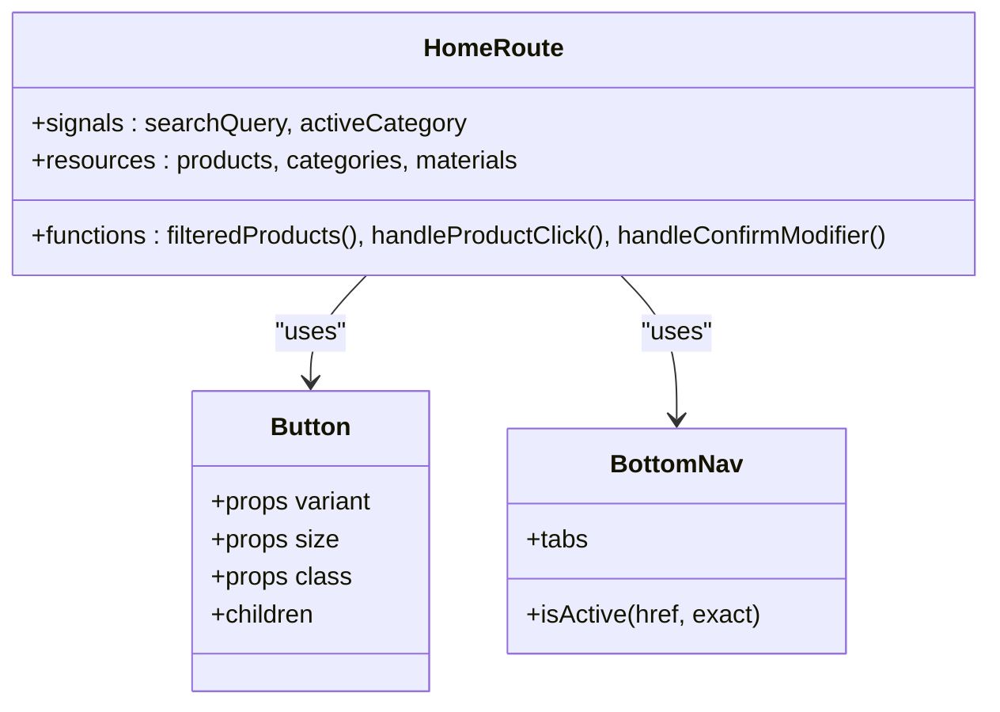
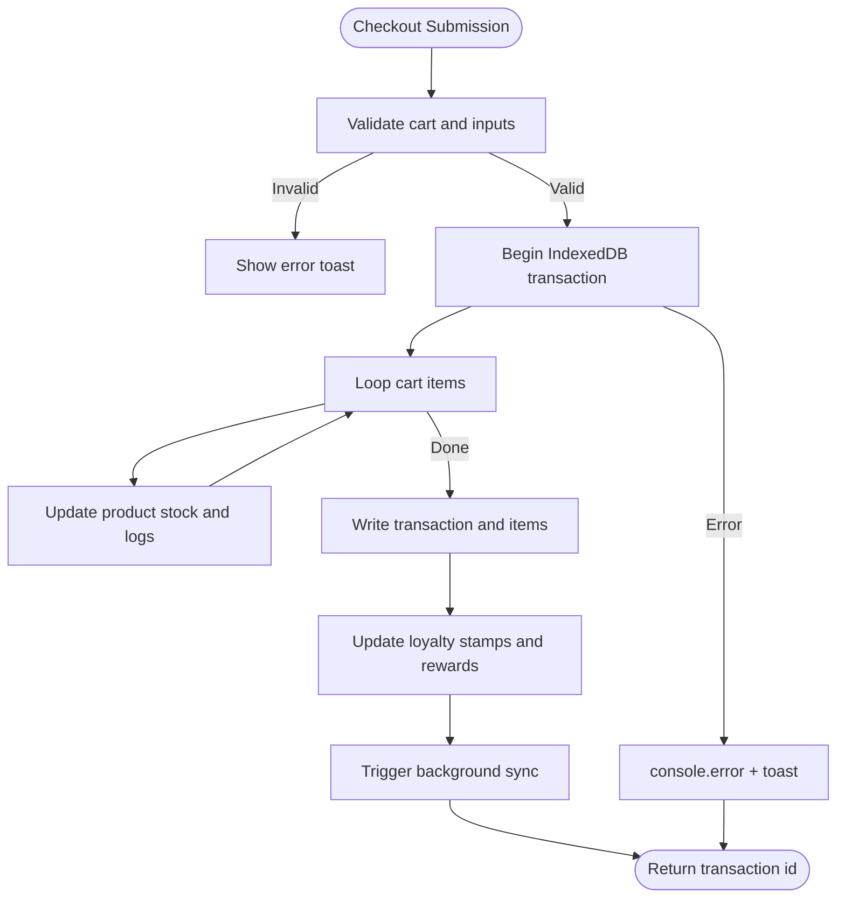
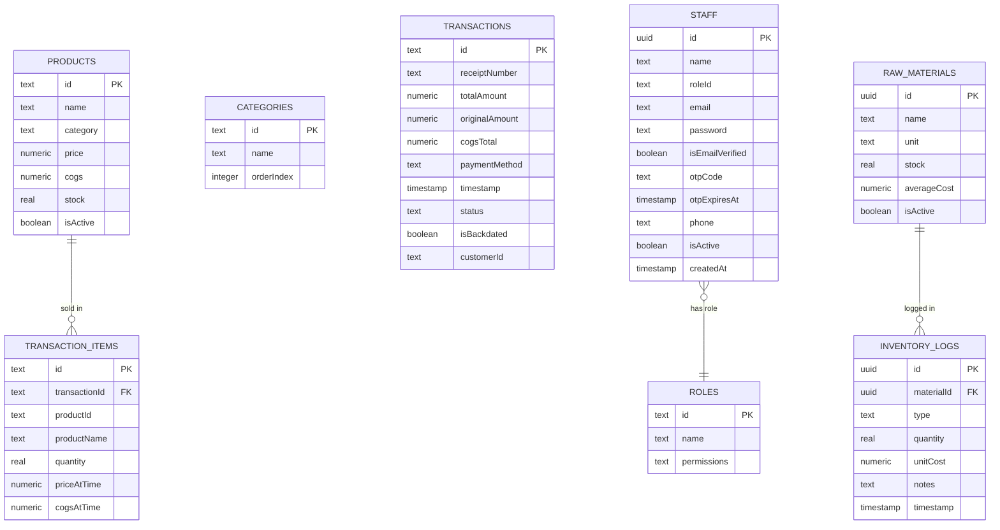
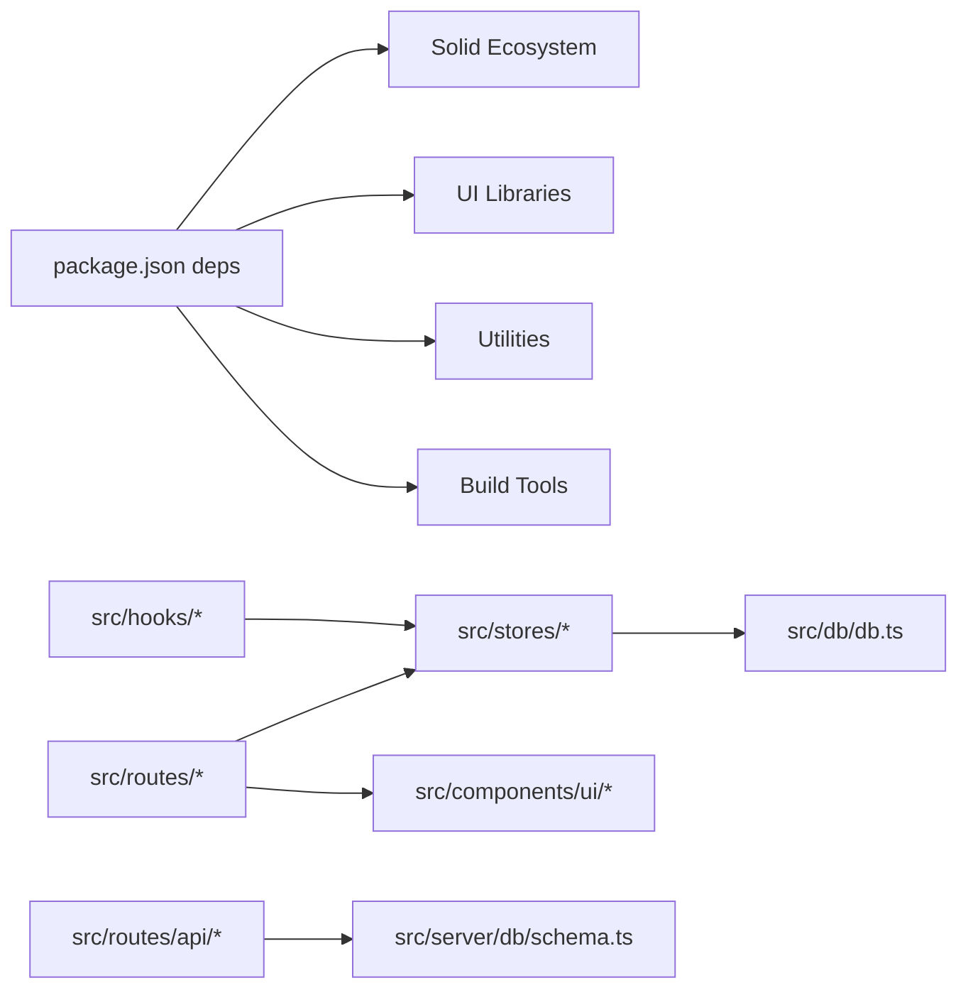

# Code Organization

<cite>
**Referenced Files in This Document**
- [README.md](file://README.md)
- [package.json](file://package.json)
- [src/app.tsx](file://src/app.tsx)
- [src/stores/auth.ts](file://src/stores/auth.ts)
- [src/stores/cart.ts](file://src/stores/cart.ts)
- [src/stores/loyalty.ts](file://src/stores/loyalty.ts)
- [src/routes/app/index.tsx](file://src/routes/app/index.tsx)
- [src/components/ui/button.tsx](file://src/components/ui/button.tsx)
- [src/components/BottomNav.tsx](file://src/components/BottomNav.tsx)
- [src/hooks/useCheckout.ts](file://src/hooks/useCheckout.ts)
- [src/lib/utils.ts](file://src/lib/utils.ts)
- [src/lib/syncService.ts](file://src/lib/syncService.ts)
- [src/lib/availability.ts](file://src/lib/availability.ts)
- [src/db/db.ts](file://src/db/db.ts)
- [src/server/db/schema.ts](file://src/server/db/schema.ts)
- [src/routes/api/auth/login.ts](file://src/routes/api/auth/login.ts)
- [src/routes/api/sync/index.ts](file://src/routes/api/sync/index.ts)
- [src/data/mockProducts.ts](file://src/data/mockProducts.ts)
</cite>

## Table of Contents
1. [Introduction](#introduction)
2. [Project Structure](#project-structure)
3. [Core Components](#core-components)
4. [Architecture Overview](#architecture-overview)
5. [Detailed Component Analysis](#detailed-component-analysis)
6. [Dependency Analysis](#dependency-analysis)
7. [Performance Considerations](#performance-considerations)
8. [Troubleshooting Guide](#troubleshooting-guide)
9. [Conclusion](#conclusion)
10. [Appendices](#appendices)

## Introduction
This document explains the code organization of the NgePos POS system. It covers file naming conventions, component structure patterns, modular architecture, state management with Solid.js stores and signals, reactive state handling, component communication strategies, error handling and logging, debugging techniques, and guidelines for maintaining consistency across frontend and backend. Practical examples are provided via file references and diagrams mapped to actual source files.

## Project Structure
The project follows a feature-based and layer-based organization:
- Frontend framework: SolidStart with Solid Router and Vite
- Routing: File-based routing under src/routes
- UI primitives: src/components/ui/*
- Business logic: src/stores/* for state, src/hooks/* for reusable logic, src/lib/* for utilities
- Data layer: src/db/db.ts (client-side Dexie), src/server/db/schema.ts (backend Drizzle ORM)
- APIs: src/routes/api/* for server endpoints
- Assets and configuration: public assets, Tailwind, PostCSS, Vite config, Drizzle config

**Diagram sources**
- [src/app.tsx:1-42](file://src/app.tsx#L1-L42)
- [src/routes/app/index.tsx:1-282](file://src/routes/app/index.tsx#L1-L282)
- [src/stores/cart.ts:1-257](file://src/stores/cart.ts#L1-L257)
- [src/stores/auth.ts:1-206](file://src/stores/auth.ts#L1-L206)
- [src/stores/loyalty.ts:1-174](file://src/stores/loyalty.ts#L1-L174)
- [src/lib/syncService.ts:1-58](file://src/lib/syncService.ts#L1-L58)
- [src/db/db.ts:1-570](file://src/db/db.ts#L1-L570)
- [src/server/db/schema.ts:1-142](file://src/server/db/schema.ts#L1-L142)
- [src/routes/api/auth/login.ts:1-58](file://src/routes/api/auth/login.ts#L1-L58)
- [src/routes/api/sync/index.ts:1-96](file://src/routes/api/sync/index.ts#L1-L96)
- [src/data/mockProducts.ts:1-85](file://src/data/mockProducts.ts#L1-L85)

**Section sources**
- [README.md:1-33](file://README.md#L1-L33)
- [package.json:1-56](file://package.json#L1-L56)
- [src/app.tsx:1-42](file://src/app.tsx#L1-L42)

## Core Components
- App bootstrap and router: initializes suspense loading, global toaster, and seeds the database on mount.
- Stores:
  - Authentication store manages user session, permissions, and token lifecycle.
  - Cart store manages cart items, variants, quantities, campaign discounts, and totals.
  - Loyalty store handles customer ID generation, QR parsing/formatting, active program retrieval, stamp eligibility, progress calculation, stamp recording, reward creation, claiming, and resetting stamps.
- Hooks:
  - Checkout hook orchestrates transaction persistence, inventory updates, COGS calculations, discount application, loyalty stamping and reward creation, and triggers background sync.
- Libraries:
  - Utility functions for class merging.
  - Sync service for background synchronization of transactions and expenses.
  - Availability checker for product availability based on product toggles and raw material stock.
- Routes:
  - Home route demonstrates resource loading, filtering, variant selection, and cart integration.
- UI:
  - Reusable Button primitive with variant and size variants.

Key patterns:
- File naming conventions:
  - Feature folders: src/stores/, src/hooks/, src/lib/, src/components/ui/, src/routes/api/, src/server/db/
  - Route files: src/routes/<area>/<...slug>.tsx or index.tsx for nested routes
  - UI components: PascalCase filenames like src/components/ui/button.tsx
  - Utilities: lowercase underscore or kebab-case like src/lib/utils.ts, src/lib/syncService.ts
- Modular architecture:
  - Clear separation of concerns: routing, state, UI, data, server schema, and APIs
  - Stores encapsulate state and business logic; routes orchestrate rendering and interactions
  - Utilities provide shared helpers; data seeding initializes client DB

**Section sources**
- [src/app.tsx:1-42](file://src/app.tsx#L1-L42)
- [src/stores/auth.ts:1-206](file://src/stores/auth.ts#L1-L206)
- [src/stores/cart.ts:1-257](file://src/stores/cart.ts#L1-L257)
- [src/stores/loyalty.ts:1-174](file://src/stores/loyalty.ts#L1-L174)
- [src/hooks/useCheckout.ts:1-217](file://src/hooks/useCheckout.ts#L1-L217)
- [src/lib/utils.ts:1-7](file://src/lib/utils.ts#L1-L7)
- [src/lib/syncService.ts:1-58](file://src/lib/syncService.ts#L1-L58)
- [src/lib/availability.ts:1-40](file://src/lib/availability.ts#L1-L40)
- [src/routes/app/index.tsx:1-282](file://src/routes/app/index.tsx#L1-L282)
- [src/components/ui/button.tsx:1-54](file://src/components/ui/button.tsx#L1-L54)

## Architecture Overview
The system uses a hybrid architecture:
- Frontend: SolidStart SPA with file-based routing, Solid signals and resources for reactivity, and local IndexedDB via Dexie for offline-first data.
- Backend: PostgreSQL via Drizzle ORM with REST-like endpoints for authentication and synchronization.
- Data flow:
  - Client reads/writes via Dexie; server persists via Drizzle.
  - Sync service batches local changes and pushes to the server endpoint.
  - Authentication tokens are stored locally and attached to protected requests.

**Diagram sources**
- [src/routes/app/index.tsx:1-282](file://src/routes/app/index.tsx#L1-L282)
- [src/components/ui/button.tsx:1-54](file://src/components/ui/button.tsx#L1-L54)
- [src/stores/auth.ts:1-206](file://src/stores/auth.ts#L1-L206)
- [src/stores/cart.ts:1-257](file://src/stores/cart.ts#L1-L257)
- [src/stores/loyalty.ts:1-174](file://src/stores/loyalty.ts#L1-L174)
- [src/hooks/useCheckout.ts:1-217](file://src/hooks/useCheckout.ts#L1-L217)
- [src/lib/utils.ts:1-7](file://src/lib/utils.ts#L1-L7)
- [src/lib/syncService.ts:1-58](file://src/lib/syncService.ts#L1-L58)
- [src/db/db.ts:1-570](file://src/db/db.ts#L1-L570)
- [src/routes/api/auth/login.ts:1-58](file://src/routes/api/auth/login.ts#L1-L58)
- [src/routes/api/sync/index.ts:1-96](file://src/routes/api/sync/index.ts#L1-L96)
- [src/server/db/schema.ts:1-142](file://src/server/db/schema.ts#L1-L142)

## Detailed Component Analysis

### State Management Patterns
- Solid.js Signals and Stores:
  - Authentication store uses signals for current user and auth checking flag, plus async initialization with optimistic UI and background verification.
  - Cart store uses a store for cart items and signals for linked customer, applied reward, and campaign resources for active campaigns.
  - Loyalty store exposes pure functions for ID generation, QR parsing/formatting, eligibility checks, progress computation, stamping, reward creation, and claiming.
- Reactive state handling:
  - Resources fetch data asynchronously and expose derived values for UI rendering.
  - Signals update immediately for UI responsiveness; stores enable granular updates for complex collections.
- Component communication:
  - Routes depend on stores for data and actions; UI components receive props and callbacks.
  - Navigation tabs filter by permission using the auth store’s permission checker.

**Diagram sources**
- [src/routes/app/index.tsx:1-282](file://src/routes/app/index.tsx#L1-L282)
- [src/stores/auth.ts:1-206](file://src/stores/auth.ts#L1-L206)
- [src/stores/cart.ts:1-257](file://src/stores/cart.ts#L1-L257)
- [src/stores/loyalty.ts:1-174](file://src/stores/loyalty.ts#L1-L174)

**Section sources**
- [src/stores/auth.ts:1-206](file://src/stores/auth.ts#L1-L206)
- [src/stores/cart.ts:1-257](file://src/stores/cart.ts#L1-L257)
- [src/stores/loyalty.ts:1-174](file://src/stores/loyalty.ts#L1-L174)
- [src/routes/app/index.tsx:1-282](file://src/routes/app/index.tsx#L1-L282)

### Component Organization and Folder Conventions
- UI primitives:
  - Button component demonstrates polymorphic props, variant sizing, and className composition using a utility function.
- Feature components:
  - Bottom navigation filters tabs by permission and highlights active routes.
- Route pages:
  - Home page composes signals, resources, and UI components; integrates variant selection and cart actions.

**Diagram sources**
- [src/components/ui/button.tsx:1-54](file://src/components/ui/button.tsx#L1-L54)
- [src/components/BottomNav.tsx:1-65](file://src/components/BottomNav.tsx#L1-L65)
- [src/routes/app/index.tsx:1-282](file://src/routes/app/index.tsx#L1-L282)

**Section sources**
- [src/components/ui/button.tsx:1-54](file://src/components/ui/button.tsx#L1-L54)
- [src/components/BottomNav.tsx:1-65](file://src/components/BottomNav.tsx#L1-L65)
- [src/routes/app/index.tsx:1-282](file://src/routes/app/index.tsx#L1-L282)

### Import/Export Patterns and Reusability
- Internal module resolution:
  - Uses tilde prefix for root-relative imports (e.g., ~/db/db, ~/stores/cart).
- Pure functions vs. stores:
  - Utility functions (e.g., cn, availability checks) are reusable across components.
  - Stores encapsulate stateful logic and are imported where needed.
- Hook composition:
  - useCheckout orchestrates multiple stores and utilities, promoting reusability and testability.

**Section sources**
- [src/lib/utils.ts:1-7](file://src/lib/utils.ts#L1-L7)
- [src/lib/availability.ts:1-40](file://src/lib/availability.ts#L1-L40)
- [src/hooks/useCheckout.ts:1-217](file://src/hooks/useCheckout.ts#L1-L217)

### Error Handling, Logging, and Debugging
- Frontend:
  - Centralized error logging via console.error in stores and hooks.
  - Toast notifications for user feedback on errors and success events.
  - Debounced sync service to avoid server overload and improve resilience.
- Backend:
  - Protected endpoints with JWT verification and rate limiting.
  - Upsert semantics on conflict to handle idempotent sync.
- Debugging techniques:
  - Local storage keys for auth caching and user cache.
  - Seed database function logs during initialization.
  - Resource loading fallbacks (Suspense) for smoother UX.

**Diagram sources**
- [src/hooks/useCheckout.ts:1-217](file://src/hooks/useCheckout.ts#L1-L217)
- [src/lib/syncService.ts:1-58](file://src/lib/syncService.ts#L1-L58)

**Section sources**
- [src/hooks/useCheckout.ts:1-217](file://src/hooks/useCheckout.ts#L1-L217)
- [src/lib/syncService.ts:1-58](file://src/lib/syncService.ts#L1-L58)
- [src/stores/auth.ts:1-206](file://src/stores/auth.ts#L1-L206)

### Data Model and Synchronization
- Client-side schema (Dexie):
  - Defines tables for products, categories, transactions, transaction items, expenses, settings, staff, roles, raw materials, discounts, bundles, campaigns, customers, loyalty programs, stamps, rewards, and inventory logs.
  - Seeding function initializes categories and products, and ensures admin role permissions.
- Server-side schema (Drizzle):
  - Mirrors core entities with appropriate types and indexes for performance.
- Sync pipeline:
  - Client collects pending transactions and expenses, attaches items, and posts to the sync endpoint.
  - Server upserts transactions and items, and writes expenses.

**Diagram sources**
- [src/db/db.ts:1-570](file://src/db/db.ts#L1-L570)
- [src/server/db/schema.ts:1-142](file://src/server/db/schema.ts#L1-L142)

**Section sources**
- [src/db/db.ts:1-570](file://src/db/db.ts#L1-L570)
- [src/server/db/schema.ts:1-142](file://src/server/db/schema.ts#L1-L142)
- [src/routes/api/sync/index.ts:1-96](file://src/routes/api/sync/index.ts#L1-L96)

## Dependency Analysis
- Frontend dependencies:
  - Solid ecosystem (@solidjs/router, @solidjs/start), UI (@kobalte/core), charts (chart.js), QR (qrcode, html5-qrcode), PDF (jspdf), Tailwind utilities (clsx, tailwind-merge), and Vite.
- Backend dependencies:
  - Drizzle ORM, PostgreSQL driver, jose for JWT, bcryptjs for password hashing, nodemailer for emails, and rate limiting utilities.
- Internal dependencies:
  - Stores depend on Dexie client DB; hooks depend on stores and utilities; routes depend on stores and UI components.
  - API routes depend on Drizzle schema and JWT utilities.

**Diagram sources**
- [package.json:1-56](file://package.json#L1-L56)
- [src/stores/cart.ts:1-257](file://src/stores/cart.ts#L1-L257)
- [src/stores/auth.ts:1-206](file://src/stores/auth.ts#L1-L206)
- [src/stores/loyalty.ts:1-174](file://src/stores/loyalty.ts#L1-L174)
- [src/hooks/useCheckout.ts:1-217](file://src/hooks/useCheckout.ts#L1-L217)
- [src/routes/app/index.tsx:1-282](file://src/routes/app/index.tsx#L1-L282)
- [src/server/db/schema.ts:1-142](file://src/server/db/schema.ts#L1-L142)

**Section sources**
- [package.json:1-56](file://package.json#L1-L56)

## Performance Considerations
- Reactive data fetching:
  - Use createResource for asynchronous lists (products, categories, materials) to avoid blocking renders.
- Optimistic UI:
  - Auth store caches user and proceeds with background verification to reduce perceived latency.
- Debounced sync:
  - Sync service debounces network calls to minimize server load and consolidate changes.
- Efficient cart updates:
  - Store updates use immutable-style setters to minimize re-renders.
- Indexing and queries:
  - Server schema defines indexes on frequently queried columns to optimize read performance.

[No sources needed since this section provides general guidance]

## Troubleshooting Guide
Common areas to inspect:
- Authentication:
  - Verify token presence and validity; check local storage keys and server response codes.
- Cart and checkout:
  - Ensure cart snapshot is captured before transaction; confirm discount calculation and variant pricing.
- Sync:
  - Confirm token presence; check pending transactions and expenses; review server upsert behavior.
- Availability:
  - Validate product isActive and raw material stock/isActive flags.

Actions:
- Inspect console logs for “Auth Init Error”, “Login Error”, “Register Error”, “Verify Error”, “Sync Service Error”, and “CRITICAL CHECKOUT ERROR”.
- Use toast messages to surface actionable feedback to users.
- Review seedDatabase logs for initial setup issues.

**Section sources**
- [src/stores/auth.ts:1-206](file://src/stores/auth.ts#L1-L206)
- [src/lib/syncService.ts:1-58](file://src/lib/syncService.ts#L1-L58)
- [src/hooks/useCheckout.ts:1-217](file://src/hooks/useCheckout.ts#L1-L217)
- [src/db/db.ts:513-570](file://src/db/db.ts#L513-L570)

## Conclusion
NgePos organizes its frontend around Solid.js primitives and file-based routing, with clear separation between UI, state, business logic, and utilities. The backend leverages Drizzle ORM for robust schema modeling and REST endpoints for authentication and synchronization. State management favors signals and stores for reactivity, while error handling and logging are centralized to maintain consistency. Following the established conventions and patterns ensures maintainability and scalability across the system.

[No sources needed since this section summarizes without analyzing specific files]

## Appendices

### Guidelines for Maintaining Code Consistency
- Naming:
  - Use PascalCase for components, kebab-case for utilities, and feature folders for cohesive modules.
- Imports:
  - Prefer root-relative imports with the tilde prefix for readability and portability.
- Stores:
  - Encapsulate stateful logic; keep pure functions in lib for reusability.
- Routes:
  - Compose resources and signals; delegate actions to stores and hooks.
- Backend:
  - Keep schema definitions close to API handlers; use upserts for idempotency.

[No sources needed since this section provides general guidance]