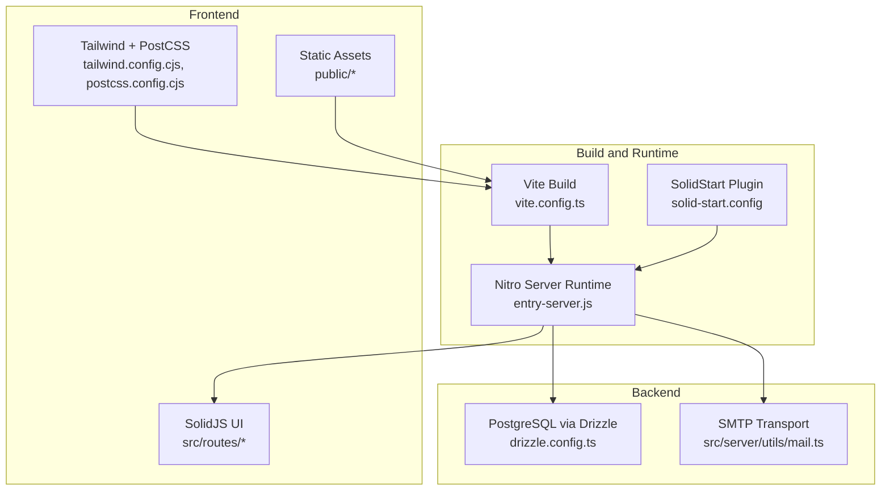
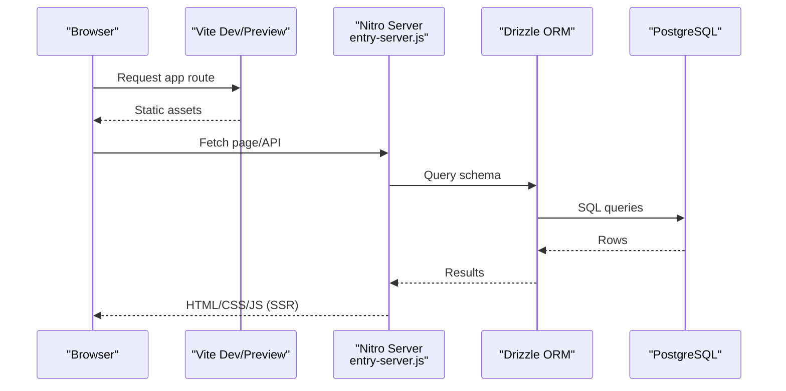
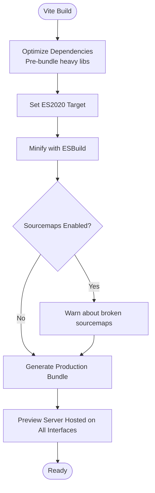
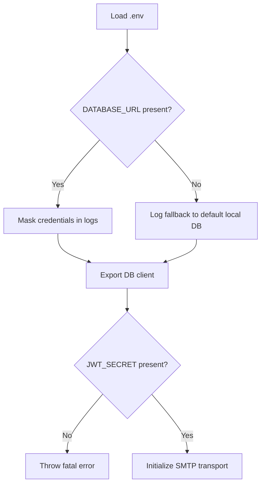
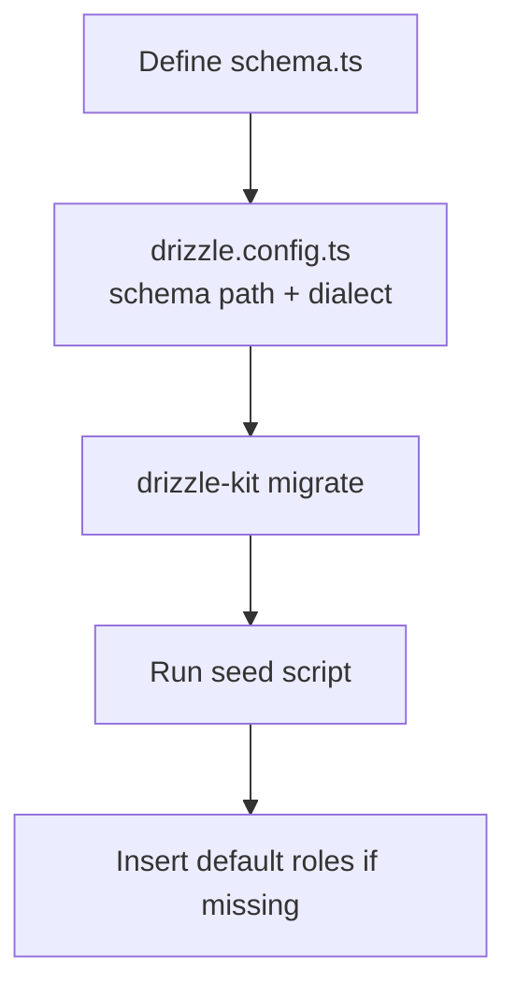
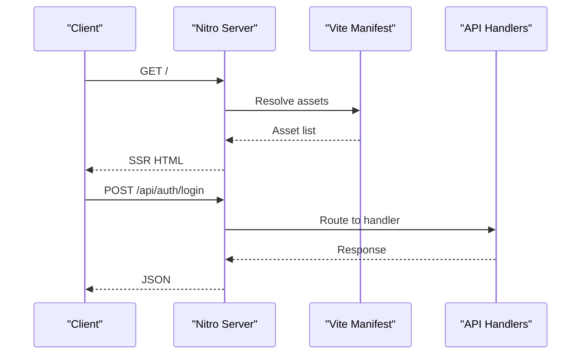
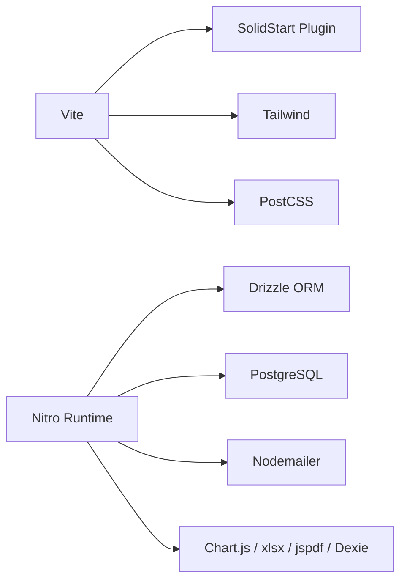

# Deployment Configuration

<cite>
**Referenced Files in This Document**
- [vite.config.ts](file://vite.config.ts)
- [package.json](file://package.json)
- [drizzle.config.ts](file://drizzle.config.ts)
- [tailwind.config.cjs](file://tailwind.config.cjs)
- [postcss.config.cjs](file://postcss.config.cjs)
- [src/server/db/schema.ts](file://src/server/db/schema.ts)
- [src/server/db/index.ts](file://src/server/db/index.ts)
- [src/server/db/seed.ts](file://src/server/db/seed.ts)
- [src/server/utils/mail.ts](file://src/server/utils/mail.ts)
- [dist/server/entry-server.js](file://dist/server/entry-server.js)
</cite>

## Table of Contents
1. [Introduction](#introduction)
2. [Project Structure](#project-structure)
3. [Core Components](#core-components)
4. [Architecture Overview](#architecture-overview)
5. [Detailed Component Analysis](#detailed-component-analysis)
6. [Dependency Analysis](#dependency-analysis)
7. [Performance Considerations](#performance-considerations)
8. [Troubleshooting Guide](#troubleshooting-guide)
9. [Conclusion](#conclusion)
10. [Appendices](#appendices)

## Introduction
This document provides comprehensive deployment configuration guidance for the NgePos POS system. It covers build optimization with Vite, asset bundling, production optimizations, environment variable management, database migration and seeding, production deployment procedures (server, SSL, reverse proxy), CI/CD pipeline setup, automated testing integration, release management, security considerations, backup strategies, monitoring setup, and step-by-step deployment guides for various hosting environments and cloud platforms.

## Project Structure
NgePos is a SolidStart-based Single Page Application with a server runtime built on Nitro. The frontend is bundled by Vite and rendered server-side via a Nitro-powered entry. Database access uses Drizzle ORM with PostgreSQL, and local offline-first storage uses Dexie. Tailwind CSS and PostCSS handle styling.

**Diagram sources**
- [vite.config.ts:1-46](file://vite.config.ts#L1-L46)
- [dist/server/entry-server.js:1-200](file://dist/server/entry-server.js#L1-L200)
- [drizzle.config.ts:1-11](file://drizzle.config.ts#L1-L11)
- [tailwind.config.cjs:1-88](file://tailwind.config.cjs#L1-L88)
- [postcss.config.cjs:1-7](file://postcss.config.cjs#L1-L7)
- [src/server/utils/mail.ts:1-70](file://src/server/utils/mail.ts#L1-L70)

**Section sources**
- [vite.config.ts:1-46](file://vite.config.ts#L1-L46)
- [package.json:1-56](file://package.json#L1-L56)
- [tailwind.config.cjs:1-88](file://tailwind.config.cjs#L1-L88)
- [postcss.config.cjs:1-7](file://postcss.config.cjs#L1-L7)

## Core Components
- Build and bundling: Vite with optimized dependencies and modern target for smaller bundles and faster cold starts.
- Server runtime: Nitro-based entry renders SolidJS pages and serves API routes.
- Database: PostgreSQL with Drizzle ORM; schema defined in TypeScript and migrated via Drizzle Kit.
- Local storage: Dexie for offline-first client-side data.
- Styling: Tailwind CSS with PostCSS autoprefixing.
- Email: SMTP transport configured via environment variables.

**Section sources**
- [vite.config.ts:1-46](file://vite.config.ts#L1-L46)
- [package.json:1-56](file://package.json#L1-L56)
- [drizzle.config.ts:1-11](file://drizzle.config.ts#L1-L11)
- [src/server/db/schema.ts:1-142](file://src/server/db/schema.ts#L1-L142)
- [src/server/db/index.ts:1-27](file://src/server/db/index.ts#L1-L27)
- [src/server/db/seed.ts:1-41](file://src/server/db/seed.ts#L1-L41)
- [src/server/utils/mail.ts:1-70](file://src/server/utils/mail.ts#L1-L70)

## Architecture Overview
The application runs as a server-rendered SPA. Vite builds assets and the Nitro entry handles SSR and API routing. Drizzle connects to PostgreSQL for persistent data, while Dexie manages offline client data. Tailwind and PostCSS produce optimized styles.

**Diagram sources**
- [dist/server/entry-server.js:1-200](file://dist/server/entry-server.js#L1-L200)
- [src/server/db/schema.ts:1-142](file://src/server/db/schema.ts#L1-L142)
- [src/server/db/index.ts:1-27](file://src/server/db/index.ts#L1-L27)

## Detailed Component Analysis

### Build Optimization and Asset Bundling (Vite)
- Pre-bundled dependencies: Libraries like Dexie, Chart.js, xlsx, jspdf are pre-bundled to reduce cold start overhead and navigation reloads in development.
- Modern target: ES2020 target reduces bundle size and improves compatibility.
- Aggressive minification: ESBuild minifier reduces JS size.
- Sourcemaps disabled: Removes broken sourcemap warnings for specific libraries.
- Dev server: Host set to listen on all interfaces for reverse proxy compatibility; port configurable.

**Diagram sources**
- [vite.config.ts:12-33](file://vite.config.ts#L12-L33)
- [vite.config.ts:34-44](file://vite.config.ts#L34-L44)

**Section sources**
- [vite.config.ts:1-46](file://vite.config.ts#L1-L46)

### Environment Variable Management
- Database connection: DATABASE_URL is required; fallback to localhost connection is logged for development.
- JWT secret: Required for auth; missing causes fatal error at runtime.
- SMTP: SMTP_HOST, SMTP_PORT, SMTP_USER, SMTP_PASS, SMTP_FROM are used for OTP emails.

**Diagram sources**
- [src/server/db/index.ts:6-26](file://src/server/db/index.ts#L6-L26)
- [src/server/utils/mail.ts:3-22](file://src/server/utils/mail.ts#L3-L22)

**Section sources**
- [src/server/db/index.ts:1-27](file://src/server/db/index.ts#L1-L27)
- [src/server/utils/mail.ts:1-70](file://src/server/utils/mail.ts#L1-L70)

### Database Migration and Seeding
- Schema definition: Typed tables with indexes and enums.
- Drizzle configuration: Points to schema path and PostgreSQL URL.
- Migration: Use Drizzle Kit CLI to generate and apply migrations.
- Seeding: Role seeding script checks existence and inserts defaults.

**Diagram sources**
- [src/server/db/schema.ts:1-142](file://src/server/db/schema.ts#L1-L142)
- [drizzle.config.ts:1-11](file://drizzle.config.ts#L1-L11)
- [src/server/db/seed.ts:1-41](file://src/server/db/seed.ts#L1-L41)

**Section sources**
- [drizzle.config.ts:1-11](file://drizzle.config.ts#L1-L11)
- [src/server/db/schema.ts:1-142](file://src/server/db/schema.ts#L1-L142)
- [src/server/db/seed.ts:1-41](file://src/server/db/seed.ts#L1-L41)

### Server Runtime and API Routing
- Nitro entry: Handles SSR, static assets, and API routes (/api/*).
- Routes: API handlers under src/routes/api/ are mounted automatically.
- Asset manifest: Vite manifest is used to inject assets and preload dependencies.

**Diagram sources**
- [dist/server/entry-server.js:1-200](file://dist/server/entry-server.js#L1-L200)

**Section sources**
- [dist/server/entry-server.js:1-200](file://dist/server/entry-server.js#L1-L200)

### Styling Pipeline (Tailwind + PostCSS)
- Tailwind scans components for class usage and supports dark mode.
- PostCSS autoprefixes and integrates Tailwind.

**Section sources**
- [tailwind.config.cjs:1-88](file://tailwind.config.cjs#L1-L88)
- [postcss.config.cjs:1-7](file://postcss.config.cjs#L1-L7)

## Dependency Analysis
- Build-time: Vite, SolidStart plugin, Nitro plugin, Tailwind, PostCSS.
- Runtime: Drizzle ORM, postgres driver, nodemailer, chart.js, xlsx, jspdf, dexie.
- Scripts: dev, build, start, preview.

**Diagram sources**
- [package.json:11-54](file://package.json#L11-L54)
- [vite.config.ts:1-11](file://vite.config.ts#L1-L11)

**Section sources**
- [package.json:1-56](file://package.json#L1-L56)
- [vite.config.ts:1-46](file://vite.config.ts#L1-L46)

## Performance Considerations
- Keep pre-bundled dependencies minimal to avoid bloating the initial bundle.
- Prefer ES2020 target for modern browsers to reduce polyfills.
- Disable sourcemaps in production to avoid overhead.
- Use CDN-hosted fonts and defer non-critical resources.
- Enable gzip/br compression at the reverse proxy level.
- Cache static assets aggressively with long-lived cache headers.

## Troubleshooting Guide
- Database URL missing: The server logs a warning and falls back to a default local connection. Ensure DATABASE_URL is set in production.
- JWT_SECRET missing: Fatal error prevents startup; set JWT_SECRET.
- SMTP failures: Check SMTP_HOST, SMTP_PORT, credentials, and timeouts; verify network connectivity.
- Reverse proxy issues: Ensure host binding listens on all interfaces and ports are open.

**Section sources**
- [src/server/db/index.ts:12-19](file://src/server/db/index.ts#L12-L19)
- [src/server/utils/mail.ts:3-22](file://src/server/utils/mail.ts#L3-L22)
- [vite.config.ts:34-36](file://vite.config.ts#L34-L36)

## Conclusion
NgePos is structured for efficient production deployments with optimized builds, robust server rendering, and clear separation of concerns for database, styling, and email services. Following the deployment and operational guidance herein will ensure reliable, secure, and scalable production operation.

## Appendices

### A. Environment Variables Reference
- DATABASE_URL: PostgreSQL connection string.
- JWT_SECRET: Secret key for JWT verification.
- SMTP_HOST: SMTP server hostname.
- SMTP_PORT: SMTP server port (e.g., 465 for SSL).
- SMTP_USER: SMTP username.
- SMTP_PASS: SMTP password.
- SMTP_FROM: Sender address header.

**Section sources**
- [src/server/db/index.ts:9-26](file://src/server/db/index.ts#L9-L26)
- [src/server/utils/mail.ts:3-8](file://src/server/utils/mail.ts#L3-L8)

### B. Database Migration and Seeding Procedures
- Generate migrations: Use Drizzle Kit CLI with drizzle.config.ts.
- Apply migrations: Run migration command against the target environment.
- Seed roles: Execute seed script to insert default roles if missing.

**Section sources**
- [drizzle.config.ts:1-11](file://drizzle.config.ts#L1-L11)
- [src/server/db/seed.ts:5-35](file://src/server/db/seed.ts#L5-L35)

### C. Production Deployment Procedures
- Build artifacts: Run build script to generate server and client bundles.
- Start server: Use start script to launch the Nitro server.
- Reverse proxy: Configure Nginx/Apache to forward requests to the server port and serve static assets.
- SSL/TLS: Terminate TLS at the reverse proxy; configure certificates and redirect HTTP to HTTPS.
- Health checks: Expose a simple endpoint for health checks.

**Section sources**
- [package.json:5-9](file://package.json#L5-L9)
- [vite.config.ts:34-44](file://vite.config.ts#L34-L44)

### D. CI/CD Pipeline Setup
- Build stage: Install dependencies, run Vite build, and package server output.
- Test stage: Run unit/integration tests using Bun.
- Release stage: Tag releases, push Docker image/container, and deploy to target environment.
- Secrets: Store DATABASE_URL, JWT_SECRET, SMTP_* in CI/CD secrets.

**Section sources**
- [package.json:5-9](file://package.json#L5-L9)

### E. Security Considerations
- Secrets management: Never commit secrets; use environment variables/secrets managers.
- Transport security: Enforce HTTPS at the reverse proxy; HSTS recommended.
- Input validation: Validate and sanitize all API inputs.
- CORS: Configure appropriate CORS headers at the reverse proxy.
- Rate limiting: Apply rate limits for authentication endpoints.

### F. Backup Strategies
- Database: Schedule regular logical backups of PostgreSQL; retain rotation policy.
- Application state: Back up server directory containing generated assets and logs.
- Secrets: Maintain encrypted backup of secrets and rotation procedures.

### G. Monitoring Setup
- Metrics: Expose metrics endpoint and scrape via Prometheus.
- Logs: Centralize application logs and database logs; set retention policies.
- Alerts: Alert on high error rates, slow response times, and failed backups.

### H. Step-by-Step Deployment Guides

#### Self-Hosted (Ubuntu)
- Install Node.js (>= 22) and PostgreSQL.
- Clone repository and install dependencies.
- Set environment variables.
- Build application and start server.
- Configure Nginx to proxy to the server port and serve static assets.
- Obtain SSL certificate via Certbot and enable HTTPS redirection.

#### Render
- Connect Git repository.
- Set build command to run Vite build and start server.
- Add environment variables in dashboard.
- Configure custom domain and SSL.

#### Railway
- Link repository and set build command.
- Add environment variables in project settings.
- Provision PostgreSQL and connect via DATABASE_URL.
- Deploy and expose public URL.

#### Fly.io
- Configure fly.toml with Node and PostgreSQL.
- Set secrets for DATABASE_URL and JWT_SECRET.
- Deploy and attach volumes for persistence if needed.

#### Docker (Compose)
- Build image with multi-stage build.
- Define services for app and PostgreSQL.
- Mount volumes for logs and persistent data.
- Expose port and configure reverse proxy externally.