# Development Guidelines

<cite>
**Referenced Files in This Document**
- [README.md](file://README.md)
- [package.json](file://package.json)
- [vite.config.ts](file://vite.config.ts)
- [drizzle.config.ts](file://drizzle.config.ts)
- [eslint.config.js](file://eslint.config.js)
- [.github/workflows/ci.yml](file://.github/workflows/ci.yml)
- [vitest.config.ts](file://vitest.config.ts)
- [tsconfig.json](file://tsconfig.json)
- [src/app.tsx](file://src/app.tsx)
- [src/stores/auth.ts](file://src/stores/auth.ts)
- [src/stores/cart.ts](file://src/stores/cart.ts)
- [src/stores/loyalty.ts](file://src/stores/loyalty.ts)
- [src/server/db/schema.ts](file://src/server/db/schema.ts)
- [src/lib/utils.ts](file://src/lib/utils.ts)
- [src/components/ui/button.tsx](file://src/components/ui/button.tsx)
- [src/routes/app.tsx](file://src/routes/app.tsx)
- [src/hooks/useCheckout.ts](file://src/hooks/useCheckout.ts)
- [src/data/mockProducts.ts](file://src/data/mockProducts.ts)
- [src/data/permissions.ts](file://src/data/permissions.ts)
- [src/lib/syncService.ts](file://src/lib/syncService.ts)
- [src/server/db/index.ts](file://src/server/db/index.ts)
- [src/server/utils/auth.ts](file://src/server/utils/auth.ts)
- [src/server/utils/logger.ts](file://src/server/utils/logger.ts)
- [src/server/utils/mail.ts](file://src/server/utils/mail.ts)
- [src/server/utils/validation.ts](file://src/server/utils/validation.ts)
- [plans/development-roadmap.md](file://plans/development-roadmap.md)
- [ROADMAP.md](file://ROADMAP.md)
- [plans/implementation-plan.md](file://plans/implementation-plan.md)
- [plans/technical-documentation.md](file://plans/technical-documentation.md)
- [plans/project-summary.md](file://plans/project-summary.md)
- [plans/task-breakdown.md](file://plans/task-breakdown.md)
- [bun.lock](file://bun.lock)
</cite>

## Update Summary
**Changes Made**
- Updated deployment configuration section to reflect Node.js server approach using .output/server/index.mjs
- Enhanced environment variable management documentation with comprehensive server-side configuration
- Added Nitro plugin configuration details for different deployment targets
- Updated production deployment procedures to use Node.js runtime instead of Vite preview

## Table of Contents
1. [Introduction](#introduction)
2. [Project Structure](#project-structure)
3. [Core Components](#core-components)
4. [Architecture Overview](#architecture-overview)
5. [Detailed Component Analysis](#detailed-component-analysis)
6. [Dependency Analysis](#dependency-analysis)
7. [Performance Considerations](#performance-considerations)
8. [Testing Strategy](#testing-strategy)
9. [Deployment Configuration](#deployment-configuration)
10. [Development Workflow and Contribution Guidelines](#development-workflow-and-contribution-guidelines)
11. [Quality Infrastructure](#quality-infrastructure)
12. [Security Best Practices](#security-best-practices)
13. [Code Quality Standards](#code-quality-standards)
14. [Maintenance Procedures](#maintenance-procedures)
15. [Troubleshooting Guide](#troubleshooting-guide)
16. [Development Roadmap](#development-roadmap)
17. [Conclusion](#conclusion)

## Introduction
This document provides comprehensive development guidelines for the NgePos POS system. It covers code organization principles, component structure, state management patterns, error handling strategies, testing approaches, deployment configuration, development workflow, quality infrastructure, security practices, code quality standards, and maintenance procedures. The goal is to enable contributors to develop efficiently and consistently while maintaining high reliability and performance.

**Updated** Added comprehensive CI/CD pipeline configuration, ESLint configuration for TypeScript v9 support, and comprehensive project planning documentation with implementation plans and technical specifications.

## Project Structure
NgePos is a SolidStart application using Vite and Nitro for SSR/SSG-like behavior. The project follows a feature-based structure with clear separation of concerns:
- src/components: Reusable UI primitives and page-specific components
- src/stores: Local state management with Solid signals and stores
- src/routes: Route handlers and layouts
- src/lib: Shared utilities and services
- src/hooks: Custom hooks encapsulating business logic
- src/server/db: Drizzle ORM schema and database utilities
- src/server/utils: Server-side utilities for authentication, logging, mail, validation
- src/data: Static data and permission definitions
- drizzle: Migration artifacts and schema definition
- public: Static assets
- plans: Development roadmap and planning documents
- .github/workflows: CI/CD pipeline configuration
- tests: Unit test files

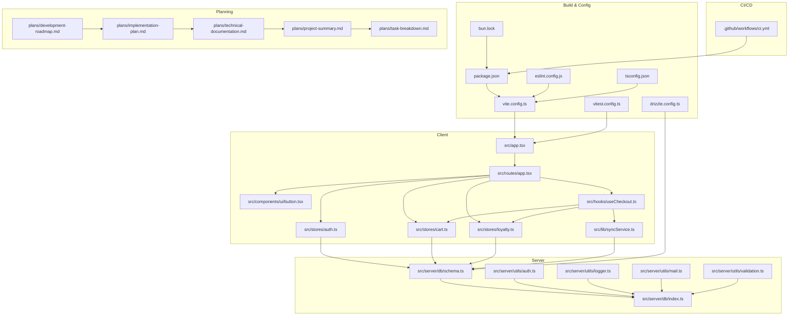

**Diagram sources**
- [src/app.tsx:1-42](file://src/app.tsx#L1-L42)
- [src/routes/app.tsx:1-51](file://src/routes/app.tsx#L1-L51)
- [src/components/ui/button.tsx:1-54](file://src/components/ui/button.tsx#L1-L54)
- [src/stores/auth.ts:1-206](file://src/stores/auth.ts#L1-L206)
- [src/stores/cart.ts:1-257](file://src/stores/cart.ts#L1-L257)
- [src/stores/loyalty.ts:1-174](file://src/stores/loyalty.ts#L1-L174)
- [src/hooks/useCheckout.ts:1-267](file://src/hooks/useCheckout.ts#L1-L267)
- [src/lib/syncService.ts:1-111](file://src/lib/syncService.ts#L1-L111)
- [src/server/db/schema.ts:1-157](file://src/server/db/schema.ts#L1-L157)
- [src/server/db/index.ts:1-26](file://src/server/db/index.ts#L1-L26)
- [src/server/utils/auth.ts:1-52](file://src/server/utils/auth.ts#L1-L52)
- [src/server/utils/logger.ts:1-69](file://src/server/utils/logger.ts#L1-L69)
- [src/server/utils/mail.ts:1-147](file://src/server/utils/mail.ts#L1-L147)
- [src/server/utils/validation.ts:1-89](file://src/server/utils/validation.ts#L1-L89)
- [vite.config.ts:1-29](file://vite.config.ts#L1-L29)
- [drizzle.config.ts:1-11](file://drizzle.config.ts#L1-L11)
- [package.json:1-83](file://package.json#L1-L83)
- [bun.lock:1-800](file://bun.lock#L1-L800)
- [eslint.config.js:1-82](file://eslint.config.js#L1-L82)
- [vitest.config.ts:1-48](file://vitest.config.ts#L1-L48)
- [tsconfig.json:1-20](file://tsconfig.json#L1-L20)
- [.github/workflows/ci.yml:1-114](file://.github/workflows/ci.yml#L1-L114)
- [plans/development-roadmap.md:1-129](file://plans/development-roadmap.md#L1-L129)
- [plans/implementation-plan.md:1-474](file://plans/implementation-plan.md#L1-L474)
- [plans/technical-documentation.md:1-784](file://plans/technical-documentation.md#L1-L784)
- [plans/project-summary.md:1-448](file://plans/project-summary.md#L1-L448)
- [plans/task-breakdown.md:1-699](file://plans/task-breakdown.md#L1-L699)

**Section sources**
- [README.md:1-33](file://README.md#L1-L33)
- [package.json:1-83](file://package.json#L1-L83)
- [vite.config.ts:1-29](file://vite.config.ts#L1-L29)
- [drizzle.config.ts:1-11](file://drizzle.config.ts#L1-L11)
- [src/app.tsx:1-42](file://src/app.tsx#L1-L42)
- [src/routes/app.tsx:1-51](file://src/routes/app.tsx#L1-L51)

## Core Components
This section outlines the foundational building blocks of the system and their responsibilities.

- Authentication Store (useAuth)
  - Handles initialization, login, registration, verification, profile updates, password changes, logout, and permission checks.
  - Implements optimistic UI with local caching and background token verification.
  - Provides a centralized hook for auth state and actions.

- Cart Store (cart)
  - manages cart items, variants, quantities, and campaign discounts.
  - Uses Dexie-backed resources for campaign data and Solid stores for cart state.
  - Calculates totals, applies discounts, and merges variants intelligently.

- Loyalty Store (loyalty)
  - Generates customer IDs, parses QR codes, and manages stamps and rewards.
  - Computes eligibility, progress, and reward creation based on active program rules.
  - Supports stamp resets after reward claims.

- Utilities (lib/utils)
  - Tailwind CSS class merging utility for consistent styling composition.

- UI Primitive (components/ui/button)
  - Reusable button component with variant and size support using class variance authority and Kobalte.

- Checkout Hook (hooks/useCheckout)
  - Orchestrates transaction submission, inventory adjustments, COGS calculations, and loyalty updates.
  - Performs IndexedDB transaction to ensure atomicity and triggers background sync.
  - Enhanced with comprehensive error handling and user feedback.

- Sync Service (lib/syncService)
  - Implements retry logic with exponential backoff for failed synchronization attempts.
  - Debounces sync requests to avoid server overload.
  - Handles authentication errors and provides user notifications.

- Database Schema (server/db/schema)
  - Defines PostgreSQL tables for roles, staff, settings, transactions, inventory, and related entities.
  - Updated with cashierName and isAdjustment columns for enhanced transaction tracking.

- Database Connection (server/db/index)
  - Implements dotenv configuration loading and multiple DATABASE_URL sources.
  - Provides structured logging for database connection status.

- Authentication Utilities (server/utils/auth)
  - Implements JWT secret validation and error handling.
  - Provides token verification and permission checking utilities.

- Logging Utilities (server/utils/logger)
  - Structured logging with configurable log levels and API request tracking.
  - Supports debug, info, warn, and error levels with timestamp formatting.

- Mail Utilities (server/utils/mail)
  - SMTP transport configuration with timeout settings and TLS configuration.
  - Email template generation for verification and password reset workflows.

- Validation Utilities (server/utils/validation)
  - Shared validation functions for API endpoints including email, string, and number validation.
  - JSON parsing with error handling and transaction structure validation.

**Section sources**
- [src/stores/auth.ts:1-206](file://src/stores/auth.ts#L1-L206)
- [src/stores/cart.ts:1-257](file://src/stores/cart.ts#L1-L257)
- [src/stores/loyalty.ts:1-174](file://src/stores/loyalty.ts#L1-L174)
- [src/lib/utils.ts:1-7](file://src/lib/utils.ts#L1-L7)
- [src/components/ui/button.tsx:1-54](file://src/components/ui/button.tsx#L1-L54)
- [src/hooks/useCheckout.ts:1-267](file://src/hooks/useCheckout.ts#L1-L267)
- [src/lib/syncService.ts:1-111](file://src/lib/syncService.ts#L1-L111)
- [src/server/db/schema.ts:1-157](file://src/server/db/schema.ts#L1-L157)
- [src/server/db/index.ts:1-26](file://src/server/db/index.ts#L1-L26)
- [src/server/utils/auth.ts:1-52](file://src/server/utils/auth.ts#L1-L52)
- [src/server/utils/logger.ts:1-69](file://src/server/utils/logger.ts#L1-L69)
- [src/server/utils/mail.ts:1-147](file://src/server/utils/mail.ts#L1-L147)
- [src/server/utils/validation.ts:1-89](file://src/server/utils/validation.ts#L1-L89)

## Architecture Overview
The system follows a layered architecture:
- Presentation Layer: Solid components and routes
- Domain Layer: Stores and hooks encapsulate business logic
- Persistence Layer: Drizzle ORM with PostgreSQL for server-side data and Dexie for client-side caching
- Infrastructure Layer: Vite/Nitro build pipeline and Drizzle migrations
- Synchronization Layer: Background sync service with retry logic and exponential backoff
- Quality Infrastructure: ESLint, Prettier, Vitest, and GitHub Actions CI/CD pipeline
- Server Utilities: Authentication, logging, mail, and validation services

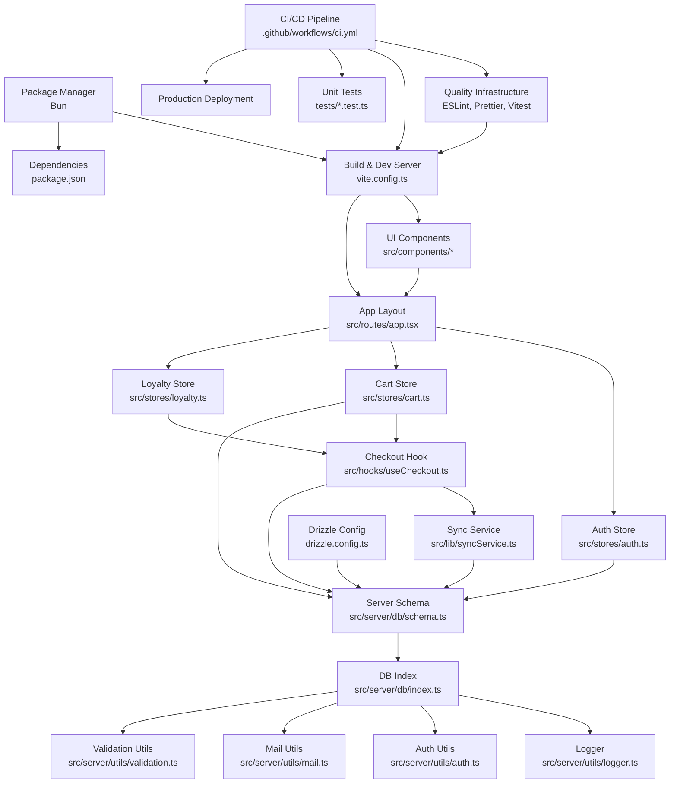

**Diagram sources**
- [src/routes/app.tsx:1-51](file://src/routes/app.tsx#L1-L51)
- [src/stores/auth.ts:1-206](file://src/stores/auth.ts#L1-L206)
- [src/stores/cart.ts:1-257](file://src/stores/cart.ts#L1-L257)
- [src/stores/loyalty.ts:1-174](file://src/stores/loyalty.ts#L1-L174)
- [src/hooks/useCheckout.ts:1-267](file://src/hooks/useCheckout.ts#L1-L267)
- [src/lib/syncService.ts:1-111](file://src/lib/syncService.ts#L1-L111)
- [src/server/db/schema.ts:1-157](file://src/server/db/schema.ts#L1-L157)
- [src/server/db/index.ts:1-26](file://src/server/db/index.ts#L1-L26)
- [src/server/utils/auth.ts:1-52](file://src/server/utils/auth.ts#L1-L52)
- [src/server/utils/logger.ts:1-69](file://src/server/utils/logger.ts#L1-L69)
- [src/server/utils/mail.ts:1-147](file://src/server/utils/mail.ts#L1-L147)
- [src/server/utils/validation.ts:1-89](file://src/server/utils/validation.ts#L1-L89)
- [vite.config.ts:1-29](file://vite.config.ts#L1-L29)
- [drizzle.config.ts:1-11](file://drizzle.config.ts#L1-L11)
- [package.json:1-83](file://package.json#L1-L83)
- [bun.lock:1-800](file://bun.lock#L1-L800)
- [.github/workflows/ci.yml:1-114](file://.github/workflows/ci.yml#L1-L114)
- [eslint.config.js:1-82](file://eslint.config.js#L1-L82)
- [vitest.config.ts:1-48](file://vitest.config.ts#L1-L48)

## Detailed Component Analysis

### Authentication Store (useAuth)
The authentication store implements:
- Optimistic rendering with local storage cache
- Background token verification against server endpoint
- Centralized login, registration, verification, profile update, password change, and logout
- Permission checking based on role permissions

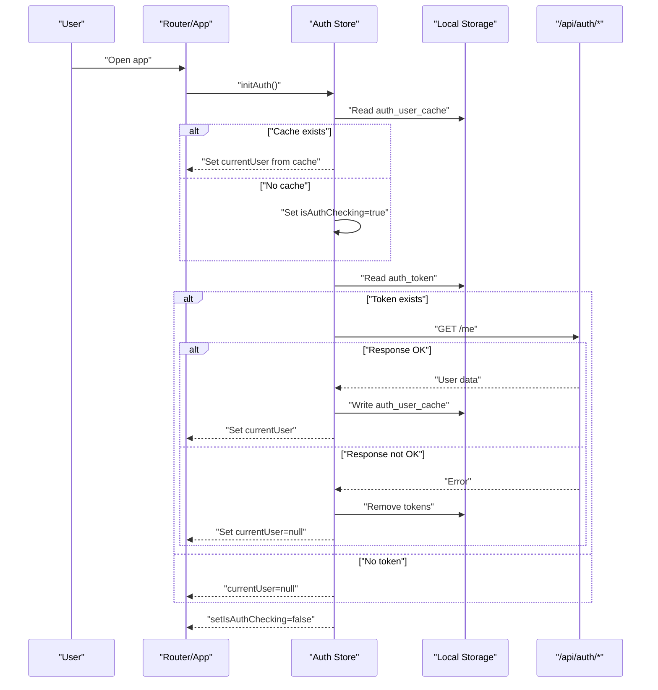

**Diagram sources**
- [src/stores/auth.ts:11-56](file://src/stores/auth.ts#L11-L56)
- [src/routes/app.tsx:12-21](file://src/routes/app.tsx#L12-L21)

**Section sources**
- [src/stores/auth.ts:1-206](file://src/stores/auth.ts#L1-L206)
- [src/routes/app.tsx:1-51](file://src/routes/app.tsx#L1-L51)

### Cart Store and Discount Engine
The cart store manages:
- Item addition with variant hashing to differentiate variant sets
- Variant updates and merging when variant sets collide
- Quantity adjustments and cart clearing
- Campaign-based discount calculation with priority sorting and non-cumulative usage tracking

**Diagram sources**
- [src/stores/cart.ts:16-48](file://src/stores/cart.ts#L16-L48)
- [src/stores/cart.ts:132-236](file://src/stores/cart.ts#L132-L236)

**Section sources**
- [src/stores/cart.ts:1-257](file://src/stores/cart.ts#L1-L257)

### Loyalty Management
Loyalty store handles:
- Customer ID generation and QR code formatting/parsing
- Active program retrieval and eligibility checks
- Stamp recording, progress computation, and reward creation
- Reward claiming and optional stamp reset policies

**Diagram sources**
- [src/stores/loyalty.ts:36-53](file://src/stores/loyalty.ts#L36-L53)
- [src/stores/loyalty.ts:66-95](file://src/stores/loyalty.ts#L66-L95)
- [src/stores/loyalty.ts:143-160](file://src/stores/loyalty.ts#L143-L160)

**Section sources**
- [src/stores/loyalty.ts:1-174](file://src/stores/loyalty.ts#L1-L174)

### Checkout Flow
The checkout hook coordinates transaction creation, inventory updates, COGS calculations, and loyalty side-effects within a single IndexedDB transaction.

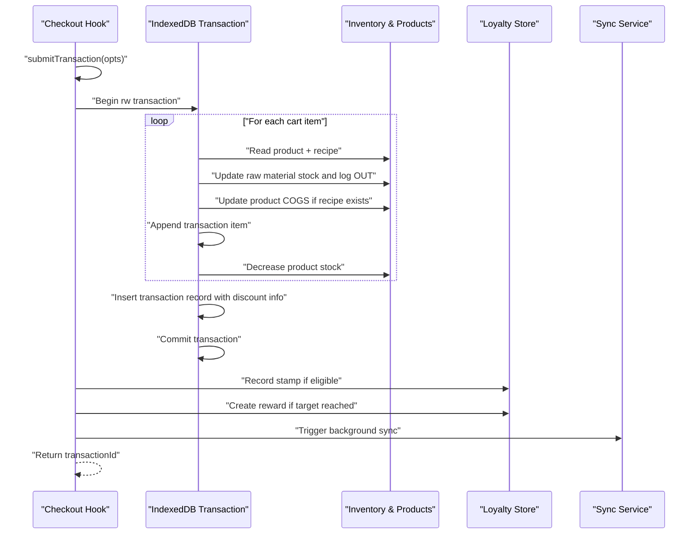

**Diagram sources**
- [src/hooks/useCheckout.ts:38-213](file://src/hooks/useCheckout.ts#L38-L213)

**Section sources**
- [src/hooks/useCheckout.ts:1-267](file://src/hooks/useCheckout.ts#L1-L267)

### Sync Service with Retry Logic
The sync service implements robust retry mechanisms with exponential backoff and debouncing.

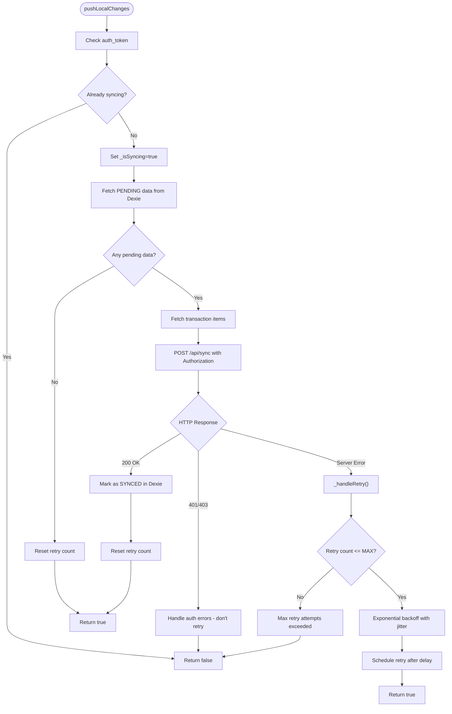

**Diagram sources**
- [src/lib/syncService.ts:12-111](file://src/lib/syncService.ts#L12-L111)

**Section sources**
- [src/lib/syncService.ts:1-111](file://src/lib/syncService.ts#L1-L111)

### Database Connection and Environment Management
The database connection layer implements comprehensive environment variable management and structured logging.

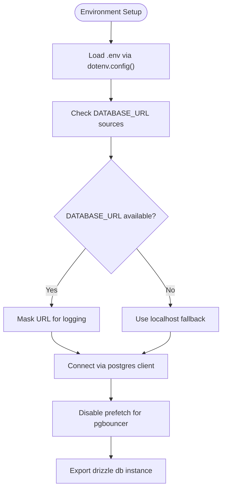

**Diagram sources**
- [src/server/db/index.ts:6-26](file://src/server/db/index.ts#L6-L26)

**Section sources**
- [src/server/db/index.ts:1-26](file://src/server/db/index.ts#L1-L26)

### Authentication Utilities and JWT Management
Authentication utilities implement secure JWT secret validation and comprehensive error handling.

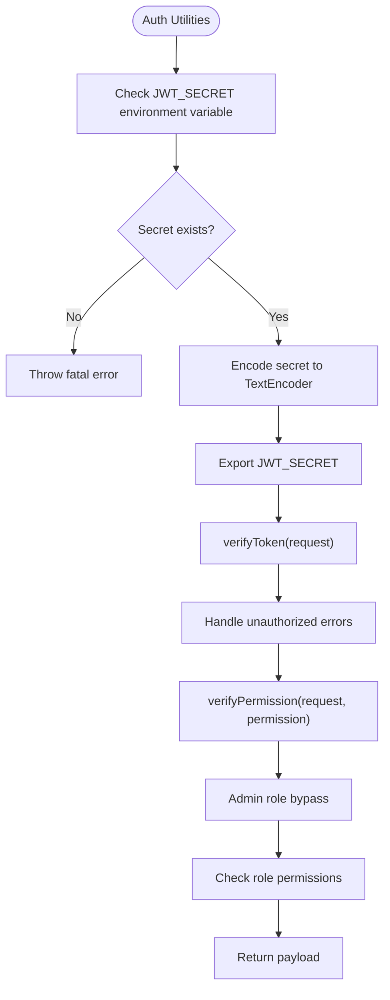

**Diagram sources**
- [src/server/utils/auth.ts:6-51](file://src/server/utils/auth.ts#L6-L51)

**Section sources**
- [src/server/utils/auth.ts:1-52](file://src/server/utils/auth.ts#L1-L52)

### UI Primitive: Button
The Button component demonstrates consistent styling composition using class variance authority and Tailwind merging utility.

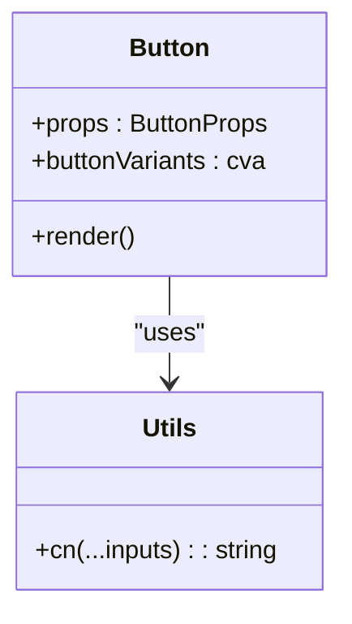

**Diagram sources**
- [src/components/ui/button.tsx:1-54](file://src/components/ui/button.tsx#L1-L54)
- [src/lib/utils.ts:1-7](file://src/lib/utils.ts#L1-L7)

**Section sources**
- [src/components/ui/button.tsx:1-54](file://src/components/ui/button.tsx#L1-L54)
- [src/lib/utils.ts:1-7](file://src/lib/utils.ts#L1-L7)

## Dependency Analysis
Key dependencies and their roles:
- Solid ecosystem: @solidjs/router, @solidjs/start, solid-js
- UI: @kobalte/core, lucide-solid, tailwind-merge, class-variance-authority
- State: solid-js/store, solid-js signals
- Data persistence: drizzle-orm, postgres, dexie
- Build: vite, @solidjs/vite-plugin-nitro-2
- Utilities: jspdf, xlsx, qrcode, html5-qrcode, nodemailer, bcryptjs
- Package manager: bun (modern package manager with fast installation)
- Quality tools: eslint (v9), prettier, vitest, playwright
- CI/CD: github actions

**Updated** Added Bun as the package manager for faster dependency installation and management, along with comprehensive quality infrastructure tools.

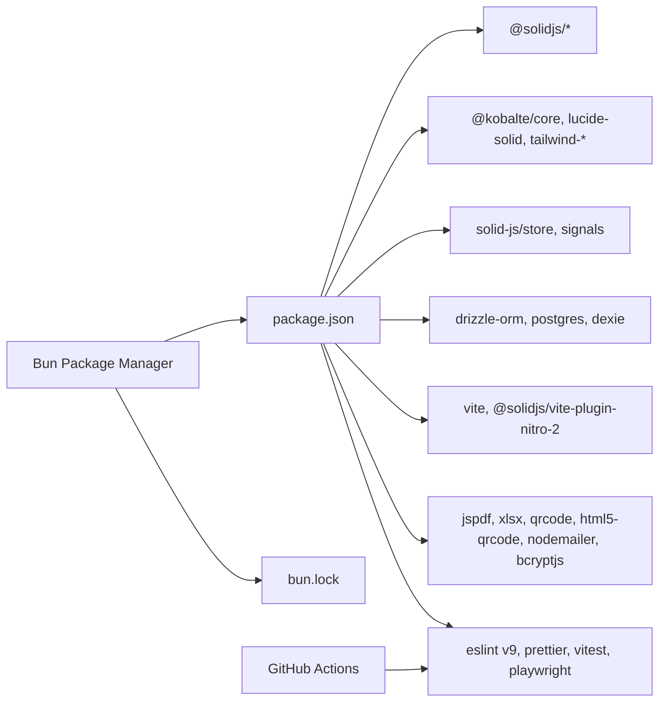

**Diagram sources**
- [package.json:1-83](file://package.json#L1-L83)
- [bun.lock:1-800](file://bun.lock#L1-L800)
- [.github/workflows/ci.yml:1-114](file://.github/workflows/ci.yml#L1-L114)

**Section sources**
- [package.json:1-83](file://package.json#L1-L83)
- [bun.lock:1-800](file://bun.lock#L1-L800)

## Performance Considerations
- Build optimization
  - Modern target and esbuild minification reduce bundle size.
  - Pre-bundling heavy dependencies avoids cold start overhead.
  - Sourcemaps disabled to eliminate warnings from third-party libraries.

- Runtime performance
  - Optimistic auth rendering improves perceived responsiveness.
  - Dexie-backed campaign data reduces network requests.
  - Efficient variant hashing prevents redundant cart entries.
  - IndexedDB transaction ensures atomicity and avoids partial writes.
  - Sync service debouncing prevents server overload.
  - Exponential backoff reduces retry pressure on failing servers.

- Package manager performance
  - Bun provides significantly faster dependency installation compared to npm/yarn.
  - Lock file ensures consistent dependency versions across environments.

**Updated** Added performance considerations for the new sync service retry logic and Bun package manager usage.

- Recommendations
  - Lazy-load heavy components and charts.
  - Debounce frequent UI updates (e.g., cart recalculations).
  - Use virtualized lists for large datasets.
  - Monitor long tasks and offload work to Web Workers when appropriate.
  - Leverage Bun's faster installation for CI/CD pipelines.

**Section sources**
- [vite.config.ts:12-33](file://vite.config.ts#L12-L33)
- [src/stores/auth.ts:15-27](file://src/stores/auth.ts#L15-L27)
- [src/stores/cart.ts:16-48](file://src/stores/cart.ts#L16-L48)
- [src/hooks/useCheckout.ts:57-172](file://src/hooks/useCheckout.ts#L57-L172)
- [src/lib/syncService.ts:4-111](file://src/lib/syncService.ts#L4-L111)

## Testing Strategy
- Unit testing
  - Test individual store functions (authentication, cart, loyalty) in isolation.
  - Mock external dependencies (localStorage, fetch, IndexedDB) to validate logic deterministically.
  - Verify discount calculation edge cases (zero quantities, overlapping requirements, priority ordering).
  - Test sync service retry logic and exponential backoff behavior.

- Component testing
  - Render UI components with Solid testing utilities and simulate user interactions.
  - Test variant selection, quantity changes, and discount previews.
  - Validate error handling and user feedback for various failure scenarios.

- Integration testing
  - Validate checkout flow end-to-end with mocked backend responses.
  - Ensure IndexedDB transaction commits and rollback scenarios are handled.
  - Test loyalty stamp progression and reward creation.
  - Verify sync service retry logic and error recovery mechanisms.

- Performance testing
  - Measure checkout latency under varying cart sizes and campaign complexity.
  - Benchmark discount engine performance with large campaign sets.
  - Profile memory usage during extended sessions.
  - Test sync service under various network conditions and retry scenarios.

**Updated** Enhanced testing strategy to include sync service testing and expanded integration testing coverage.

[No sources needed since this section provides general guidance]

## Deployment Configuration
- Build and start scripts
  - Development: bun run dev (using Bun package manager)
  - Preview: bun run preview
  - Production build: bun run build
  - Start server: node .output/server/index.mjs

- Environment variables
  - DATABASE_URL: PostgreSQL connection string for Drizzle migrations and ORM
  - JWT_SECRET: Secret key for JWT token signing and verification
  - LOG_LEVEL: Logging level for server-side logging (debug, info, warn, error)
  - SMTP_HOST, SMTP_PORT, SMTP_USER, SMTP_PASS, SMTP_FROM: Email configuration for password reset functionality
  - SITE_URL: Base URL for generating password reset links
  - ENCRYPTION_KEY: Encryption key for sensitive data processing

- Nitro plugin configuration
  - Automatic detection of deployment targets: Vercel, Cloudflare Pages, or Node.js server
  - Environment-specific presets for optimal performance
  - Server configuration with host binding and port settings

- Database migration process
  - Configure drizzle config pointing to schema and output directory
  - Run migrations using drizzle-kit commands to synchronize schema with database

- Build optimization
  - es2020 target and esbuild minify reduce bundle size
  - Disable sourcemaps in production to avoid warnings and reduce artifact size

**Updated** Updated deployment configuration to reflect Node.js server approach using .output/server/index.mjs instead of Vite preview, and enhanced environment variable management practices.

**Section sources**
- [package.json:5-21](file://package.json#L5-L21)
- [drizzle.config.ts:1-11](file://drizzle.config.ts#L1-L11)
- [vite.config.ts:20-29](file://vite.config.ts#L20-L29)
- [src/server/db/index.ts:6-26](file://src/server/db/index.ts#L6-L26)
- [src/server/utils/auth.ts:6-10](file://src/server/utils/auth.ts#L6-L10)
- [src/server/utils/logger.ts:32-34](file://src/server/utils/logger.ts#L32-L34)
- [src/server/utils/mail.ts:5-10](file://src/server/utils/mail.ts#L5-L10)

## Development Workflow and Contribution Guidelines
- Branching model
  - Feature branches per task; rebase before merge to keep history linear.

- Commit hygiene
  - Clear, imperative commit messages; reference issues.
  - Keep commits focused and atomic.

- Code review process
  - Request reviews for significant changes.
  - Ensure tests pass and performance remains acceptable.

- Contribution guidelines
  - Follow established naming conventions and component structure.
  - Add or update tests alongside new features.
  - Document breaking changes and migration steps.

- Package management
  - Use Bun for dependency installation and management.
  - Update bun.lock when changing dependencies.
  - Leverage Bun's faster installation in development and CI/CD.

**Updated** Added guidelines for Bun package manager usage and lock file management.

[No sources needed since this section provides general guidance]

## Quality Infrastructure
The NgePos project implements comprehensive quality infrastructure to ensure code quality, consistency, and reliability.

### ESLint Configuration (TypeScript v9)
The project uses a modern ESLint configuration with TypeScript v9 support:

- **Configuration Format**: Flat config (eslint.config.js) replacing legacy .eslintrc.cjs
- **Parser**: @typescript-eslint/parser with TypeScript project references
- **Plugins**: @typescript-eslint/eslint-plugin, eslint-plugin-prettier, eslint-plugin-solid
- **Browser Files**: Separate configuration for client-side TypeScript files
- **Server Files**: Separate configuration for server-side Node.js files
- **Rules**: 15 active rules including no-unused-vars, no-explicit-any, no-floating-promises
- **Globals**: Browser and Node.js globals properly configured

### Prettier Configuration
- **Formatting Options**: Semi-colons, single quotes, 2-space tabs, trailing commas
- **Print Width**: 100 characters
- **Arrow Parens**: Always
- **End of Line**: LF

### Vitest Testing Framework
- **Environment**: jsdom for DOM simulation
- **Coverage**: v8 provider with multiple reporters (text, json, html, lcov)
- **Thresholds**: 10% lines, 20% functions, 10% branches, 10% statements
- **Setup Files**: tests/setup.ts for mocking and cleanup
- **Aliases**: "~" resolves to src/ directory

### GitHub Actions CI/CD Pipeline
The CI/CD pipeline automates quality checks and deployment:

- **Triggers**: Push to main/develop branches, Pull Requests
- **Environment**: Ubuntu latest with Node.js 22 and Bun 1.0
- **Jobs**:
  1. **Lint & Type Check**: ESLint, Prettier, TypeScript validation
  2. **Unit Tests**: Vitest with coverage reporting
  3. **Build**: Production build verification
  4. **Deploy**: Production deployment (master branch only)

**Updated** Added comprehensive quality infrastructure documentation including ESLint v9 configuration, Prettier setup, Vitest framework, and GitHub Actions CI/CD pipeline.

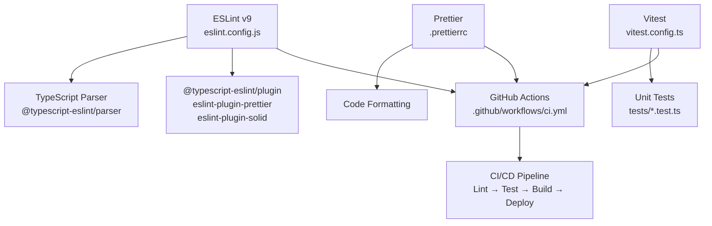

**Diagram sources**
- [eslint.config.js:1-82](file://eslint.config.js#L1-L82)
- [vitest.config.ts:1-48](file://vitest.config.ts#L1-L48)
- [.github/workflows/ci.yml:1-114](file://.github/workflows/ci.yml#L1-L114)

**Section sources**
- [eslint.config.js:1-82](file://eslint.config.js#L1-L82)
- [vitest.config.ts:1-48](file://vitest.config.ts#L1-L48)
- [.github/workflows/ci.yml:1-114](file://.github/workflows/ci.yml#L1-L114)

## Security Best Practices
- Authentication
  - Enforce HTTPS in production.
  - Store tokens securely; avoid exposing sensitive headers.
  - Implement rate limiting for auth endpoints.

- Data protection
  - Sanitize user inputs and escape HTML where applicable.
  - Use prepared statements and ORM queries to prevent injection.

- Secrets management
  - Never commit secrets; use environment variables.
  - Rotate credentials periodically.
  - Implement proper JWT secret validation and error handling.

- Permissions
  - Enforce role-based access controls server-side.
  - Validate permissions before executing privileged actions.

- Sync security
  - Implement proper authorization headers for sync requests.
  - Handle authentication errors gracefully without exposing sensitive information.
  - Validate data integrity during sync operations.

- Database security
  - Use dotenv for environment variable loading.
  - Implement structured logging for database connection status.
  - Validate DATABASE_URL sources and provide fallback mechanisms.

**Updated** Added security considerations for the sync service, enhanced authentication handling, and comprehensive environment variable management.

[No sources needed since this section provides general guidance]

## Code Quality Standards
- Naming conventions
  - Use camelCase for variables and functions.
  - Use PascalCase for components and stores.
  - Keep file names concise and descriptive.

- Component structure
  - Single responsibility per component.
  - Extract reusable logic into hooks or stores.

- State management
  - Prefer signals for simple state; use stores for complex nested state.
  - Avoid unnecessary re-renders by isolating state.

- Error handling
  - Centralize error reporting and user feedback.
  - Provide graceful degradation for offline scenarios.
  - Implement comprehensive error categorization in checkout flow.

- Sync service design
  - Implement retry logic with exponential backoff.
  - Use debouncing to prevent server overload.
  - Handle different error types appropriately.

- Environment variable management
  - Implement dotenv configuration loading.
  - Validate required environment variables at startup.
  - Provide structured logging for configuration status.

**Updated** Enhanced error handling standards, sync service design guidelines, and environment variable management practices.

[No sources needed since this section provides general guidance]

## Maintenance Procedures
- Database maintenance
  - Regularly backup PostgreSQL database.
  - Review and prune unused data (logs, temporary records).

- Application maintenance
  - Keep dependencies updated; test thoroughly after upgrades.
  - Monitor logs and alert on critical errors.
  - Update Bun dependencies regularly.

- Operational checks
  - Validate checkout transactions and reconcile discrepancies.
  - Audit permissions and roles periodically.
  - Monitor sync service health and retry counts.

- Package management
  - Regularly update Bun dependencies.
  - Monitor lock file for dependency conflicts.
  - Optimize dependency tree for faster installation.

- Environment variable management
  - Regularly review and update environment configurations.
  - Monitor JWT secret rotation and validation.
  - Validate SMTP configuration for email functionality.

**Updated** Added maintenance procedures for Bun package manager, sync service monitoring, and comprehensive environment variable management.

[No sources needed since this section provides general guidance]

## Troubleshooting Guide
- Authentication issues
  - Clear local storage tokens and retry login.
  - Verify server endpoints and network connectivity.
  - Check JWT_SECRET environment variable configuration.

- Cart anomalies
  - Check variant hashing collisions and quantity adjustments.
  - Inspect campaign data loading and sorting logic.

- Checkout failures
  - Review IndexedDB transaction logs and error messages.
  - Validate product stock and recipe availability.
  - Check sync service retry logs for failed synchronization attempts.

- Sync service issues
  - Monitor retry count and exponential backoff behavior.
  - Verify authentication headers and token validity.
  - Check network connectivity and server availability.

- Build and preview problems
  - Ensure Node.js version meets engine requirements.
  - Reinstall dependencies using Bun and rebuild.
  - Clear Bun cache if experiencing installation issues.

- Environment variable issues
  - Verify .env file loading via dotenv.
  - Check DATABASE_URL configuration and connectivity.
  - Validate JWT_SECRET and other critical environment variables.

**Updated** Added troubleshooting guidance for sync service, Bun package manager, and environment variable management issues.

**Section sources**
- [src/stores/auth.ts:51-56](file://src/stores/auth.ts#L51-L56)
- [src/stores/cart.ts:132-236](file://src/stores/cart.ts#L132-L236)
- [src/hooks/useCheckout.ts:206-267](file://src/hooks/useCheckout.ts#L206-L267)
- [src/lib/syncService.ts:81-111](file://src/lib/syncService.ts#L81-L111)
- [package.json:52-55](file://package.json#L52-L55)
- [src/server/db/index.ts:12-19](file://src/server/db/index.ts#L12-L19)
- [src/server/utils/auth.ts:7-9](file://src/server/utils/auth.ts#L7-L9)

## Development Roadmap
The NgePos development roadmap encompasses both immediate improvements and long-term strategic goals, organized into priority tiers and implementation phases.

### Priority Levels
- **High Priority (Immediate)**: Critical bug fixes, data consistency, and core feature improvements
- **Medium Priority (Next)**: Supporting features, optimizations, and documentation
- **Low Priority (Optional)**: Additional features, UI polish, and enhancements

### Current Implementation Status
- **Phase 1 Complete**: Basic package renaming, database schema updates, and documentation fixes
- **Phase 2 In Progress**: Stability improvements, enhanced security, and comprehensive testing
- **Phase 3 Planned**: Documentation completion, unit testing, and performance optimization
- **Phase 4 Future**: Advanced features, PWA support, and automated backup systems

### Key Implementation Features
- **Database Enhancements**: Added cashierName and isAdjustment columns for better transaction tracking
- **Sync Service Improvements**: Implemented retry logic with exponential backoff and debouncing
- **Error Handling**: Comprehensive error categorization and user feedback mechanisms
- **Security Measures**: Input validation, rate limiting, and structured logging
- **Performance Optimization**: Bundle splitting, PWA support planning, and cache invalidation
- **Environment Management**: Enhanced dotenv configuration and structured logging

### Strategic Roadmap Elements
- **Quick Wins**: Document export (Excel/PDF), financial charts, and basic security
- **Operational Strength**: Smart inventory automation, barcode scanning, split payments, and audit trails
- **Future Goals**: Multi-outlet support, advanced analytics, and enhanced reporting capabilities

**Updated** Added comprehensive development roadmap documentation covering both Indonesian and English versions, detailing implementation phases and strategic goals.

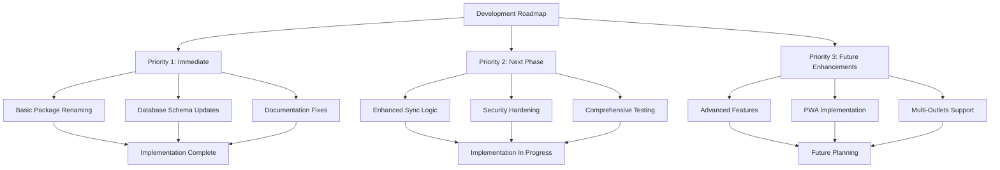

**Diagram sources**
- [plans/development-roadmap.md:65-94](file://plans/development-roadmap.md#L65-L94)
- [ROADMAP.md:8-71](file://ROADMAP.md#L8-L71)

**Section sources**
- [plans/development-roadmap.md:1-129](file://plans/development-roadmap.md#L1-L129)
- [ROADMAP.md:1-77](file://ROADMAP.md#L1-L77)

## Conclusion
These guidelines establish a consistent foundation for developing and maintaining the NgePos POS system. By adhering to the outlined conventions, leveraging the provided patterns, and following the recommended practices, contributors can deliver reliable, performant, and secure features while ensuring smooth operations across development, testing, and production environments.

**Updated** The guidelines now include comprehensive development roadmap documentation and updated workflow procedures reflecting Bun package manager usage, enhanced sync service capabilities, expanded testing strategies, and comprehensive environment variable management practices.

The addition of the development roadmap ensures long-term strategic direction, while the Bun package manager integration provides improved development experience and faster dependency management. The enhanced sync service and comprehensive error handling mechanisms demonstrate the system's commitment to reliability and user experience.

The comprehensive quality infrastructure including ESLint v9 configuration, Prettier setup, Vitest testing framework, and GitHub Actions CI/CD pipeline establishes industry-standard development practices that ensure code quality, consistency, and automated validation throughout the development lifecycle.

The updated deployment configuration with Node.js server approach using .output/server/index.mjs provides a production-ready solution with improved performance and reliability, while the enhanced environment variable management ensures secure and flexible configuration across different deployment targets.