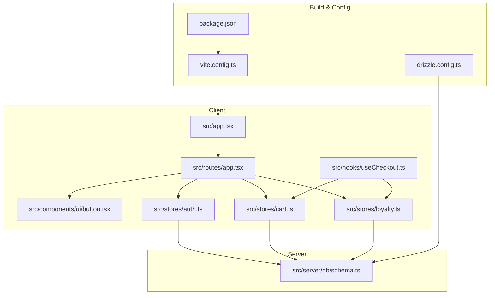
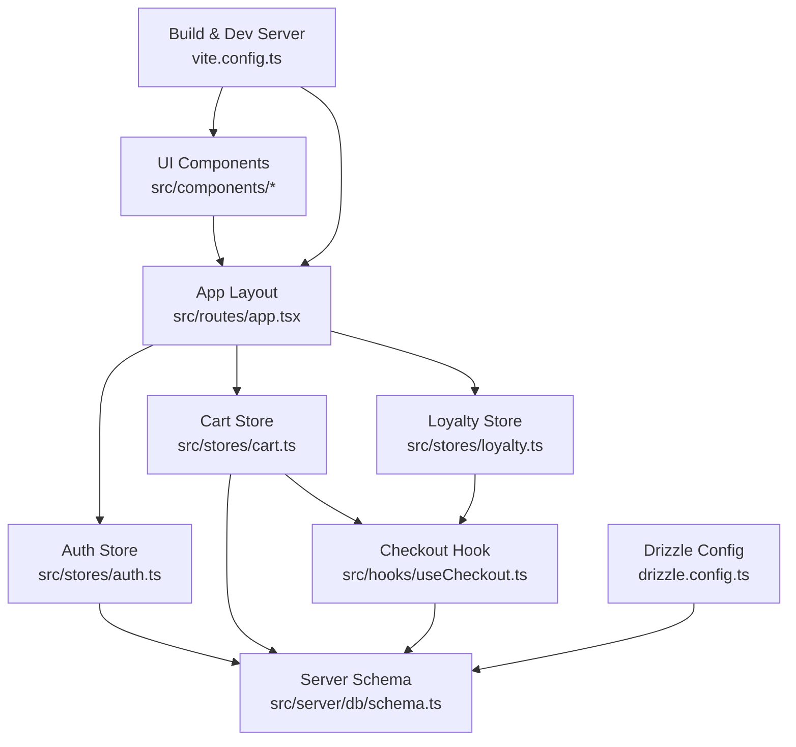
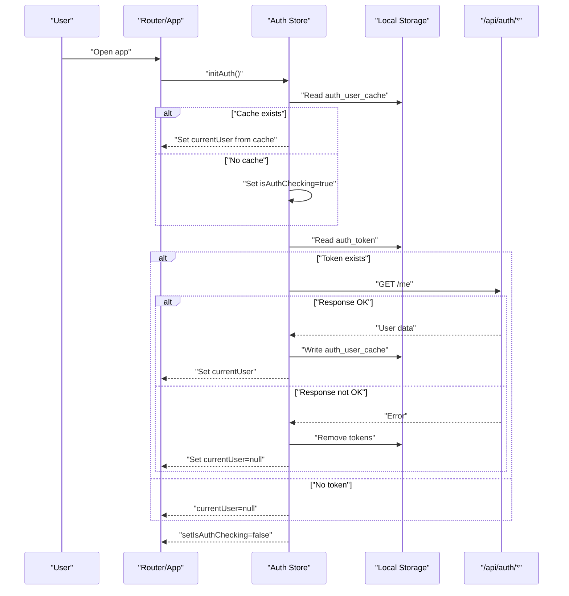
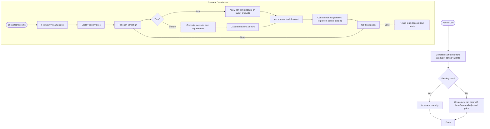
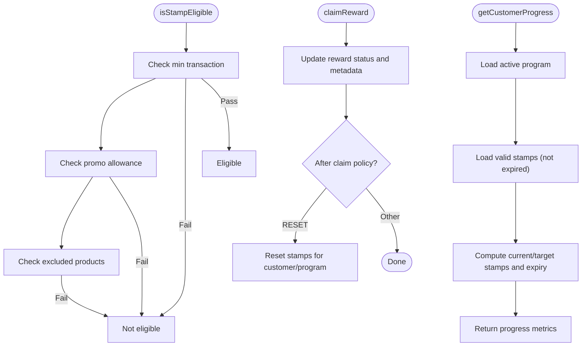
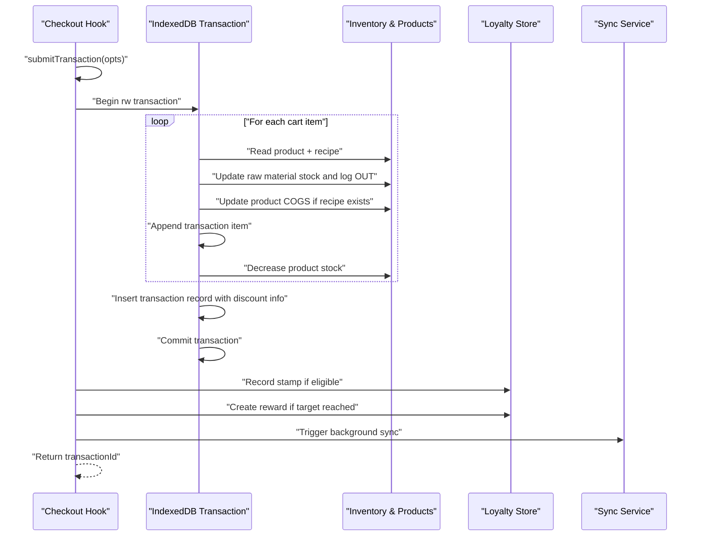
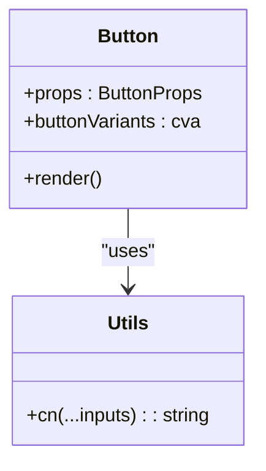
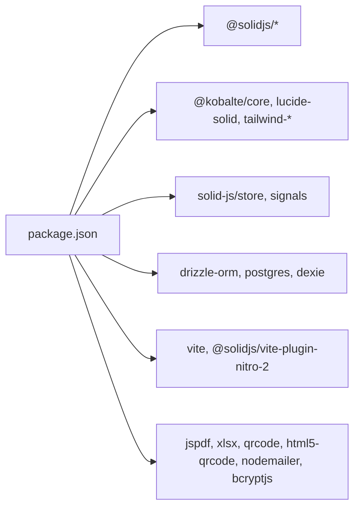

# Development Guidelines

<cite>
**Referenced Files in This Document**
- [README.md](file://README.md)
- [package.json](file://package.json)
- [vite.config.ts](file://vite.config.ts)
- [drizzle.config.ts](file://drizzle.config.ts)
- [src/app.tsx](file://src/app.tsx)
- [src/stores/auth.ts](file://src/stores/auth.ts)
- [src/stores/cart.ts](file://src/stores/cart.ts)
- [src/stores/loyalty.ts](file://src/stores/loyalty.ts)
- [src/server/db/schema.ts](file://src/server/db/schema.ts)
- [src/lib/utils.ts](file://src/lib/utils.ts)
- [src/components/ui/button.tsx](file://src/components/ui/button.tsx)
- [src/routes/app.tsx](file://src/routes/app.tsx)
- [src/hooks/useCheckout.ts](file://src/hooks/useCheckout.ts)
- [src/data/mockProducts.ts](file://src/data/mockProducts.ts)
- [src/data/permissions.ts](file://src/data/permissions.ts)
</cite>

## Table of Contents
1. [Introduction](#introduction)
2. [Project Structure](#project-structure)
3. [Core Components](#core-components)
4. [Architecture Overview](#architecture-overview)
5. [Detailed Component Analysis](#detailed-component-analysis)
6. [Dependency Analysis](#dependency-analysis)
7. [Performance Considerations](#performance-considerations)
8. [Testing Strategy](#testing-strategy)
9. [Deployment Configuration](#deployment-configuration)
10. [Development Workflow and Contribution Guidelines](#development-workflow-and-contribution-guidelines)
11. [Security Best Practices](#security-best-practices)
12. [Code Quality Standards](#code-quality-standards)
13. [Maintenance Procedures](#maintenance-procedures)
14. [Troubleshooting Guide](#troubleshooting-guide)
15. [Conclusion](#conclusion)

## Introduction
This document provides comprehensive development guidelines for the NgePos POS system. It covers code organization principles, component structure, state management patterns, error handling strategies, testing approaches, deployment configuration, development workflow, security practices, code quality standards, and maintenance procedures. The goal is to enable contributors to develop efficiently and consistently while maintaining high reliability and performance.

## Project Structure
NgePos is a SolidStart application using Vite and Nitro for SSR/SSG-like behavior. The project follows a feature-based structure with clear separation of concerns:
- src/components: Reusable UI primitives and page-specific components
- src/stores: Local state management with Solid signals and stores
- src/routes: Route handlers and layouts
- src/lib: Shared utilities and services
- src/hooks: Custom hooks encapsulating business logic
- src/server/db: Drizzle ORM schema and database utilities
- src/data: Static data and permission definitions
- drizzle: Migration artifacts and schema definition
- public: Static assets

**Diagram sources**
- [src/app.tsx:1-42](file://src/app.tsx#L1-L42)
- [src/routes/app.tsx:1-51](file://src/routes/app.tsx#L1-L51)
- [src/components/ui/button.tsx:1-54](file://src/components/ui/button.tsx#L1-L54)
- [src/stores/auth.ts:1-205](file://src/stores/auth.ts#L1-L205)
- [src/stores/cart.ts:1-256](file://src/stores/cart.ts#L1-L256)
- [src/stores/loyalty.ts:1-173](file://src/stores/loyalty.ts#L1-L173)
- [src/hooks/useCheckout.ts:1-234](file://src/hooks/useCheckout.ts#L1-L234)
- [src/server/db/schema.ts:1-143](file://src/server/db/schema.ts#L1-L143)
- [vite.config.ts:1-46](file://vite.config.ts#L1-L46)
- [drizzle.config.ts:1-11](file://drizzle.config.ts#L1-L11)
- [package.json:1-56](file://package.json#L1-L56)

**Section sources**
- [README.md:1-33](file://README.md#L1-L33)
- [package.json:1-56](file://package.json#L1-L56)
- [vite.config.ts:1-46](file://vite.config.ts#L1-L46)
- [drizzle.config.ts:1-11](file://drizzle.config.ts#L1-L11)
- [src/app.tsx:1-42](file://src/app.tsx#L1-L42)
- [src/routes/app.tsx:1-51](file://src/routes/app.tsx#L1-L51)

## Core Components
This section outlines the foundational building blocks of the system and their responsibilities.

- Authentication Store (useAuth)
  - Handles initialization, login, registration, verification, profile updates, password changes, logout, and permission checks.
  - Implements optimistic UI with local caching and background token verification.
  - Provides a centralized hook for auth state and actions.

- Cart Store (cart)
  - Manages cart items, variants, quantities, and campaign discounts.
  - Uses Dexie-backed resources for campaign data and Solid stores for cart state.
  - Calculates totals, applies discounts, and merges variants intelligently.

- Loyalty Store (loyalty)
  - Generates customer IDs, parses QR codes, and manages stamps and rewards.
  - Computes eligibility, progress, and reward creation based on active program rules.
  - Supports stamp resets after reward claims.

- Utilities (lib/utils)
  - Tailwind CSS class merging utility for consistent styling composition.

- UI Primitive (components/ui/button)
  - Reusable button component with variant and size support using class variance authority and Kobalte.

- Checkout Hook (hooks/useCheckout)
  - Orchestrates transaction submission, inventory adjustments, COGS calculations, and loyalty updates.
  - Performs IndexedDB transaction to ensure atomicity and triggers background sync.

- Schema (server/db/schema)
  - Defines PostgreSQL tables for roles, staff, settings, transactions, inventory, and related entities.

**Section sources**
- [src/stores/auth.ts:1-205](file://src/stores/auth.ts#L1-L205)
- [src/stores/cart.ts:1-256](file://src/stores/cart.ts#L1-L256)
- [src/stores/loyalty.ts:1-173](file://src/stores/loyalty.ts#L1-L173)
- [src/lib/utils.ts:1-7](file://src/lib/utils.ts#L1-L7)
- [src/components/ui/button.tsx:1-54](file://src/components/ui/button.tsx#L1-L54)
- [src/hooks/useCheckout.ts:1-234](file://src/hooks/useCheckout.ts#L1-L234)
- [src/server/db/schema.ts:1-143](file://src/server/db/schema.ts#L1-L143)

## Architecture Overview
The system follows a layered architecture:
- Presentation Layer: Solid components and routes
- Domain Layer: Stores and hooks encapsulate business logic
- Persistence Layer: Drizzle ORM with PostgreSQL for server-side data and Dexie for client-side caching
- Infrastructure Layer: Vite/Nitro build pipeline and Drizzle migrations

**Diagram sources**
- [src/routes/app.tsx:1-51](file://src/routes/app.tsx#L1-L51)
- [src/stores/auth.ts:1-205](file://src/stores/auth.ts#L1-L205)
- [src/stores/cart.ts:1-256](file://src/stores/cart.ts#L1-L256)
- [src/stores/loyalty.ts:1-173](file://src/stores/loyalty.ts#L1-L173)
- [src/hooks/useCheckout.ts:1-234](file://src/hooks/useCheckout.ts#L1-L234)
- [src/server/db/schema.ts:1-143](file://src/server/db/schema.ts#L1-L143)
- [vite.config.ts:1-46](file://vite.config.ts#L1-L46)
- [drizzle.config.ts:1-11](file://drizzle.config.ts#L1-L11)

## Detailed Component Analysis

### Authentication Store (useAuth)
The authentication store implements:
- Optimistic rendering with local storage cache
- Background token verification against server endpoint
- Centralized login, registration, verification, profile update, password change, and logout
- Permission checking based on role permissions

**Diagram sources**
- [src/stores/auth.ts:11-56](file://src/stores/auth.ts#L11-L56)
- [src/routes/app.tsx:12-21](file://src/routes/app.tsx#L12-L21)

**Section sources**
- [src/stores/auth.ts:1-205](file://src/stores/auth.ts#L1-L205)
- [src/routes/app.tsx:1-51](file://src/routes/app.tsx#L1-L51)

### Cart Store and Discount Engine
The cart store manages:
- Item addition with variant hashing to differentiate variant sets
- Variant updates and merging when variant sets collide
- Quantity adjustments and cart clearing
- Campaign-based discount calculation with priority sorting and non-cumulative usage tracking

**Diagram sources**
- [src/stores/cart.ts:16-48](file://src/stores/cart.ts#L16-L48)
- [src/stores/cart.ts:132-236](file://src/stores/cart.ts#L132-L236)

**Section sources**
- [src/stores/cart.ts:1-256](file://src/stores/cart.ts#L1-L256)

### Loyalty Management
Loyalty store handles:
- Customer ID generation and QR code formatting/parsing
- Active program retrieval and eligibility checks
- Stamp recording, progress computation, and reward creation
- Reward claiming and optional stamp reset policies

**Diagram sources**
- [src/stores/loyalty.ts:36-53](file://src/stores/loyalty.ts#L36-L53)
- [src/stores/loyalty.ts:66-95](file://src/stores/loyalty.ts#L66-L95)
- [src/stores/loyalty.ts:143-160](file://src/stores/loyalty.ts#L143-L160)

**Section sources**
- [src/stores/loyalty.ts:1-173](file://src/stores/loyalty.ts#L1-L173)

### Checkout Flow
The checkout hook coordinates transaction creation, inventory updates, COGS calculations, and loyalty side-effects within a single IndexedDB transaction.

**Diagram sources**
- [src/hooks/useCheckout.ts:38-213](file://src/hooks/useCheckout.ts#L38-L213)

**Section sources**
- [src/hooks/useCheckout.ts:1-234](file://src/hooks/useCheckout.ts#L1-L234)

### UI Primitive: Button
The Button component demonstrates consistent styling composition using class variance authority and Tailwind merging utility.

**Diagram sources**
- [src/components/ui/button.tsx:1-54](file://src/components/ui/button.tsx#L1-L54)
- [src/lib/utils.ts:1-7](file://src/lib/utils.ts#L1-L7)

**Section sources**
- [src/components/ui/button.tsx:1-54](file://src/components/ui/button.tsx#L1-L54)
- [src/lib/utils.ts:1-7](file://src/lib/utils.ts#L1-L7)

## Dependency Analysis
Key dependencies and their roles:
- Solid ecosystem: @solidjs/router, @solidjs/start, solid-js
- UI: @kobalte/core, lucide-solid, tailwind-merge, class-variance-authority
- State: solid-js/store, solid-js signals
- Data persistence: drizzle-orm, postgres, dexie
- Build: vite, @solidjs/vite-plugin-nitro-2
- Utilities: jspdf, xlsx, qrcode, html5-qrcode, nodemailer, bcryptjs

**Diagram sources**
- [package.json:1-56](file://package.json#L1-L56)

**Section sources**
- [package.json:1-56](file://package.json#L1-L56)

## Performance Considerations
- Build optimization
  - Modern target and esbuild minification reduce bundle size.
  - Pre-bundling heavy dependencies avoids cold start overhead.
  - Sourcemaps disabled to eliminate warnings from third-party libraries.

- Runtime performance
  - Optimistic auth rendering improves perceived responsiveness.
  - Dexie-backed campaign data reduces network requests.
  - Efficient variant hashing prevents redundant cart entries.
  - IndexedDB transaction ensures atomicity and avoids partial writes.

- Recommendations
  - Lazy-load heavy components and charts.
  - Debounce frequent UI updates (e.g., cart recalculations).
  - Use virtualized lists for large datasets.
  - Monitor long tasks and offload work to Web Workers when appropriate.

**Section sources**
- [vite.config.ts:12-33](file://vite.config.ts#L12-L33)
- [src/stores/auth.ts:15-27](file://src/stores/auth.ts#L15-L27)
- [src/stores/cart.ts:16-48](file://src/stores/cart.ts#L16-L48)
- [src/hooks/useCheckout.ts:57-172](file://src/hooks/useCheckout.ts#L57-L172)

## Testing Strategy
- Unit testing
  - Test individual store functions (authentication, cart, loyalty) in isolation.
  - Mock external dependencies (localStorage, fetch, IndexedDB) to validate logic deterministically.
  - Verify discount calculation edge cases (zero quantities, overlapping requirements, priority ordering).

- Component testing
  - Render UI components with Solid testing utilities and simulate user interactions.
  - Test variant selection, quantity changes, and discount previews.

- Integration testing
  - Validate checkout flow end-to-end with mocked backend responses.
  - Ensure IndexedDB transaction commits and rollback scenarios are handled.
  - Test loyalty stamp progression and reward creation.

- Performance testing
  - Measure checkout latency under varying cart sizes and campaign complexity.
  - Benchmark discount engine performance with large campaign sets.
  - Profile memory usage during extended sessions.

[No sources needed since this section provides general guidance]

## Deployment Configuration
- Build and start scripts
  - Development: vite dev
  - Preview: vite preview
  - Production build: vite build
  - Start server: node .output/server/index.mjs

- Environment variables
  - DATABASE_URL: PostgreSQL connection string for Drizzle migrations and ORM.
  - Ensure NODE_ENV is set appropriately for production builds.

- Database migration process
  - Configure drizzle config pointing to schema and output directory.
  - Run migrations using drizzle-kit commands to synchronize schema with database.

- Build optimization
  - es2020 target and esbuild minify reduce bundle size.
  - Disable sourcemaps in production to avoid warnings and reduce artifact size.

**Section sources**
- [package.json:5-9](file://package.json#L5-L9)
- [drizzle.config.ts:1-11](file://drizzle.config.ts#L1-L11)
- [vite.config.ts:26-33](file://vite.config.ts#L26-L33)

## Development Workflow and Contribution Guidelines
- Branching model
  - Feature branches per task; rebase before merge to keep history linear.

- Commit hygiene
  - Clear, imperative commit messages; reference issues.
  - Keep commits focused and atomic.

- Code review process
  - Request reviews for significant changes.
  - Ensure tests pass and performance remains acceptable.

- Contribution guidelines
  - Follow established naming conventions and component structure.
  - Add or update tests alongside new features.
  - Document breaking changes and migration steps.

[No sources needed since this section provides general guidance]

## Security Best Practices
- Authentication
  - Enforce HTTPS in production.
  - Store tokens securely; avoid exposing sensitive headers.
  - Implement rate limiting for auth endpoints.

- Data protection
  - Sanitize user inputs and escape HTML where applicable.
  - Use prepared statements and ORM queries to prevent injection.

- Secrets management
  - Never commit secrets; use environment variables.
  - Rotate credentials periodically.

- Permissions
  - Enforce role-based access controls server-side.
  - Validate permissions before executing privileged actions.

[No sources needed since this section provides general guidance]

## Code Quality Standards
- Naming conventions
  - Use camelCase for variables and functions.
  - Use PascalCase for components and stores.
  - Keep file names concise and descriptive.

- Component structure
  - Single responsibility per component.
  - Extract reusable logic into hooks or stores.

- State management
  - Prefer signals for simple state; use stores for complex nested state.
  - Avoid unnecessary re-renders by isolating state.

- Error handling
  - Centralize error reporting and user feedback.
  - Provide graceful degradation for offline scenarios.

[No sources needed since this section provides general guidance]

## Maintenance Procedures
- Database maintenance
  - Regularly backup PostgreSQL database.
  - Review and prune unused data (logs, temporary records).

- Application maintenance
  - Keep dependencies updated; test thoroughly after upgrades.
  - Monitor logs and alert on critical errors.

- Operational checks
  - Validate checkout transactions and reconcile discrepancies.
  - Audit permissions and roles periodically.

[No sources needed since this section provides general guidance]

## Troubleshooting Guide
- Authentication issues
  - Clear local storage tokens and retry login.
  - Verify server endpoints and network connectivity.

- Cart anomalies
  - Check variant hashing collisions and quantity adjustments.
  - Inspect campaign data loading and sorting logic.

- Checkout failures
  - Review IndexedDB transaction logs and error messages.
  - Validate product stock and recipe availability.

- Build and preview problems
  - Ensure Node.js version meets engine requirements.
  - Reinstall dependencies and rebuild.

**Section sources**
- [src/stores/auth.ts:51-56](file://src/stores/auth.ts#L51-L56)
- [src/stores/cart.ts:132-236](file://src/stores/cart.ts#L132-L236)
- [src/hooks/useCheckout.ts:206-213](file://src/hooks/useCheckout.ts#L206-L213)
- [package.json:41-43](file://package.json#L41-L43)

## Conclusion
These guidelines establish a consistent foundation for developing and maintaining the NgePos POS system. By adhering to the outlined conventions, leveraging the provided patterns, and following the recommended practices, contributors can deliver reliable, performant, and secure features while ensuring smooth operations across development, testing, and production environments.