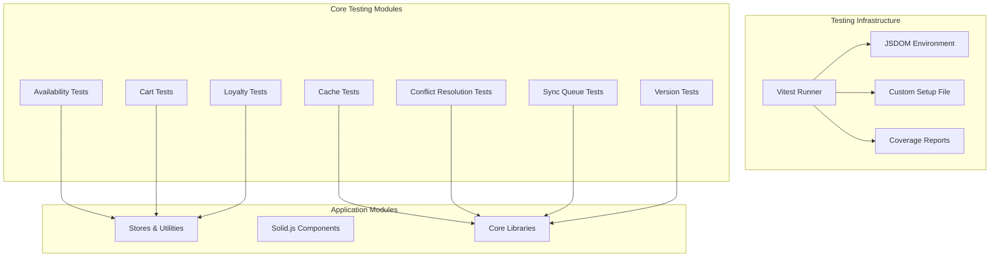
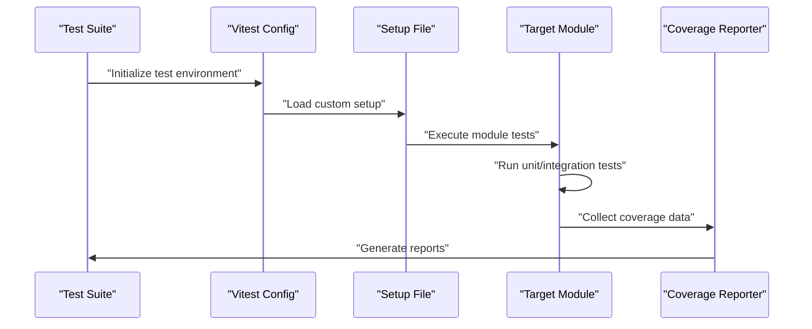
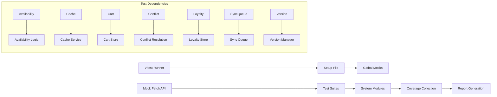

# Testing Strategy

<cite>
**Referenced Files in This Document**
- [package.json](file://package.json)
- [vitest.config.ts](file://vitest.config.ts)
- [tests/setup.ts](file://tests/setup.ts)
- [src/app.tsx](file://src/app.tsx)
- [src/stores/cart.ts](file://src/stores/cart.ts)
- [src/stores/auth.ts](file://src/stores/auth.ts)
- [src/stores/loyalty.ts](file://src/stores/loyalty.ts)
- [src/hooks/useCheckout.ts](file://src/hooks/useCheckout.ts)
- [src/lib/syncService.ts](file://src/lib/syncService.ts)
- [src/lib/syncQueue.ts](file://src/lib/syncQueue.ts)
- [src/lib/cacheInvalidation.ts](file://src/lib/cacheInvalidation.ts)
- [src/lib/conflictResolution.ts](file://src/lib/conflictResolution.ts)
- [src/lib/version.ts](file://src/lib/version.ts)
- [src/routes/api/sync/index.ts](file://src/routes/api/sync/index.ts)
- [src/routes/api/auth/login.ts](file://src/routes/api/auth/login.ts)
- [src/components/ui/button.tsx](file://src/components/ui/button.tsx)
- [src/components/Counter.tsx](file://src/components/Counter.tsx)
- [src/db/db.ts](file://src/db/db.ts)
- [src/data/mockProducts.ts](file://src/data/mockProducts.ts)
- [src/lib/utils.ts](file://src/lib/utils.ts)
- [src/lib/availability.ts](file://src/lib/availability.ts)
- [tests/availability.test.ts](file://tests/availability.test.ts)
- [tests/cache.test.ts](file://tests/cache.test.ts)
- [tests/cart.test.ts](file://tests/cart.test.ts)
- [tests/conflictResolution.test.ts](file://tests/conflictResolution.test.ts)
- [tests/loyalty.test.ts](file://tests/loyalty.test.ts)
- [tests/syncQueue.test.ts](file://tests/syncQueue.test.ts)
- [tests/version.test.ts](file://tests/version.test.ts)
</cite>

## Update Summary
**Changes Made**
- Added comprehensive Vitest configuration with coverage reporting and custom setup
- Expanded test suite coverage across all major modules including availability checking, cache management, cart operations, conflict resolution, loyalty systems, sync queues, and version management
- Enhanced testing infrastructure with proper TypeScript support and mock data strategies
- Updated testing methodology to cover offline-first architecture and synchronization services
- Integrated continuous integration practices with coverage thresholds and reporting

## Table of Contents
1. [Introduction](#introduction)
2. [Project Structure](#project-structure)
3. [Core Components](#core-components)
4. [Architecture Overview](#architecture-overview)
5. [Comprehensive Testing Infrastructure](#comprehensive-testing-infrastructure)
6. [Detailed Component Analysis](#detailed-component-analysis)
7. [Dependency Analysis](#dependency-analysis)
8. [Performance Considerations](#performance-considerations)
9. [Troubleshooting Guide](#troubleshooting-guide)
10. [Conclusion](#conclusion)
11. [Appendices](#appendices)

## Introduction
This document defines a comprehensive testing strategy for the NgePos POS system with a focus on the newly established Vitest-based testing infrastructure. The system now includes extensive test coverage across all major modules, featuring unit testing for stores and utilities, component testing for Solid.js UI components, integration testing for API endpoints and database operations, and performance testing for offline-first flows and synchronization. The testing framework supports TypeScript, provides coverage reporting, and addresses the complex challenges of offline functionality and data synchronization.

## Project Structure
NgePos is a Solid.js application with a comprehensive testing infrastructure built around Vitest:
- **Testing Framework**: Vitest with jsdom environment for DOM simulation
- **Coverage Reporting**: Multiple reporters including LCOV for CI integration
- **Setup Configuration**: Custom setup file for test environment initialization
- **Module Coverage**: Extensive test suites for all major system components
- **Offline Architecture**: Specialized testing for cache management, conflict resolution, and sync queues

**Diagram sources**
- [vitest.config.ts:1-48](file://vitest.config.ts#L1-L48)
- [tests/setup.ts:1-14](file://tests/setup.ts#L1-L14)
- [tests/availability.test.ts:1-159](file://tests/availability.test.ts#L1-L159)
- [tests/cache.test.ts:1-104](file://tests/cache.test.ts#L1-L104)
- [tests/cart.test.ts:1-260](file://tests/cart.test.ts#L1-L260)
- [tests/conflictResolution.test.ts:1-186](file://tests/conflictResolution.test.ts#L1-L186)
- [tests/loyalty.test.ts:1-234](file://tests/loyalty.test.ts#L1-L234)
- [tests/syncQueue.test.ts:1-198](file://tests/syncQueue.test.ts#L1-L198)
- [tests/version.test.ts:1-173](file://tests/version.test.ts#L1-L173)

**Section sources**
- [package.json:18-21](file://package.json#L18-L21)
- [vitest.config.ts:1-48](file://vitest.config.ts#L1-L48)
- [tests/setup.ts:1-14](file://tests/setup.ts#L1-L14)

## Core Components
The testing strategy now encompasses comprehensive coverage across all major system components:

### Testing Infrastructure Components
- **Vitest Configuration**: Full TypeScript support with custom aliases and coverage thresholds
- **Setup File**: Global test environment initialization and cleanup
- **Mock Strategy**: Comprehensive mocking for fetch API and DOM operations
- **Coverage Targets**: 10% thresholds across all metrics with room for improvement

### Core System Testing Areas
- **Availability Checking**: Product availability validation with material stock management
- **Cache Management**: Memory cache with TTL, pattern-based invalidation, and statistics
- **Cart Operations**: Shopping cart state management with variant handling
- **Conflict Resolution**: Multi-device conflict detection and resolution strategies
- **Loyalty Systems**: Stamp eligibility, progress tracking, and reward management
- **Sync Queue**: Offline-first synchronization with retry mechanisms and conflict handling
- **Version Management**: Semantic versioning with conventional commit parsing

**Section sources**
- [vitest.config.ts:12-34](file://vitest.config.ts#L12-L34)
- [tests/setup.ts:5-13](file://tests/setup.ts#L5-L13)
- [tests/availability.test.ts:52-158](file://tests/availability.test.ts#L52-L158)
- [tests/cache.test.ts:4-103](file://tests/cache.test.ts#L4-L103)
- [tests/cart.test.ts:83-260](file://tests/cart.test.ts#L83-L260)
- [tests/conflictResolution.test.ts:10-186](file://tests/conflictResolution.test.ts#L10-L186)
- [tests/loyalty.test.ts:66-234](file://tests/loyalty.test.ts#L66-L234)
- [tests/syncQueue.test.ts:4-198](file://tests/syncQueue.test.ts#L4-L198)
- [tests/version.test.ts:13-173](file://tests/version.test.ts#L13-L173)

## Architecture Overview
The system follows an offline-first pattern with comprehensive testing infrastructure supporting all architectural layers:

**Diagram sources**
- [vitest.config.ts:7-41](file://vitest.config.ts#L7-L41)
- [tests/setup.ts:1-14](file://tests/setup.ts#L1-L14)

The testing architecture supports:
- **Parallel Execution**: Multiple test suites running concurrently
- **Coverage Collection**: Line, branch, function, and statement coverage tracking
- **Report Generation**: Multiple formats including JSON for CI integration
- **Mock Management**: Centralized mock setup and cleanup

**Section sources**
- [vitest.config.ts:35-41](file://vitest.config.ts#L35-L41)
- [tests/setup.ts:9-13](file://tests/setup.ts#L9-L13)

## Comprehensive Testing Infrastructure

### Vitest Configuration and Setup
The testing infrastructure is built around a comprehensive Vitest configuration that supports TypeScript, custom aliases, and extensive coverage reporting:

**Configuration Highlights:**
- **Environment**: JSDOM for DOM simulation without browser dependency
- **Include Pattern**: Matches both src and tests directories with TypeScript support
- **Coverage**: Multi-format reporting with LCOV for CI integration
- **Aliases**: "~" points to src directory for cleaner imports
- **Setup**: Custom setup file for environment initialization

**Section sources**
- [vitest.config.ts:5-47](file://vitest.config.ts#L5-L47)
- [tests/setup.ts:1-14](file://tests/setup.ts#L1-L14)

### Test Suite Organization
The test suite is organized across eight comprehensive modules, each addressing specific system functionality:

**Availability Testing**: Validates product availability logic including material stock checks and product activation states
**Cache Testing**: Tests memory cache operations, TTL management, pattern-based invalidation, and statistics collection
**Cart Testing**: Validates shopping cart state management, variant handling, and quantity calculations
**Conflict Resolution Testing**: Tests multi-device conflict detection and resolution strategies
**Loyalty Testing**: Validates stamp eligibility, progress tracking, and reward management logic
**Sync Queue Testing**: Tests offline synchronization queue operations, retry mechanisms, and status tracking
**Version Testing**: Validates semantic versioning, conventional commit parsing, and version bump strategies

**Section sources**
- [tests/availability.test.ts:1-159](file://tests/availability.test.ts#L1-L159)
- [tests/cache.test.ts:1-104](file://tests/cache.test.ts#L1-L104)
- [tests/cart.test.ts:1-260](file://tests/cart.test.ts#L1-L260)
- [tests/conflictResolution.test.ts:1-186](file://tests/conflictResolution.test.ts#L1-L186)
- [tests/loyalty.test.ts:1-234](file://tests/loyalty.test.ts#L1-L234)
- [tests/syncQueue.test.ts:1-198](file://tests/syncQueue.test.ts#L1-L198)
- [tests/version.test.ts:1-173](file://tests/version.test.ts#L1-L173)

### Coverage and Reporting
The testing infrastructure provides comprehensive coverage reporting with configurable thresholds:

**Coverage Configuration:**
- **Thresholds**: 10% minimum for lines, functions, branches, and statements
- **Providers**: V8 engine with multiple reporter formats
- **Exclusions**: Build artifacts, migrations, and generated files
- **Output**: JSON format for CI integration and HTML for local development

**Section sources**
- [vitest.config.ts:12-34](file://vitest.config.ts#L12-L34)

## Detailed Component Analysis

### Availability Testing
The availability testing module validates product availability logic across multiple scenarios:

**Test Coverage Areas:**
- Active product with no materials: Returns available status
- Default active state: Products without explicit activation status
- Inactive product handling: Proper rejection with specific reason
- Material validation: Missing materials and inactive materials detection
- Multi-material scenarios: Complex ingredient validation with cascading checks

**Key Assertions:**
- Product availability returns boolean with optional reason string
- Material stock validation considers both existence and activation states
- Reason strings contain specific material names for debugging
- Empty material arrays treated as valid configurations

**Section sources**
- [tests/availability.test.ts:52-158](file://tests/availability.test.ts#L52-L158)

### Cache Management Testing
The cache testing module validates memory cache operations with comprehensive TTL and invalidation logic:

**Cache Operations Tested:**
- Basic CRUD operations: Storage, retrieval, and deletion
- TTL validation: Expiration detection and automatic cleanup
- Pattern-based invalidation: Entity-type and regex-based cache clearing
- Statistics collection: Entry counting and metadata tracking
- Event-driven invalidation: Listener notification system

**Advanced Features:**
- TTL configuration per entity type with fallback defaults
- Pattern matching for bulk cache invalidation
- Expiration detection with age-based eviction
- Statistics reporting for monitoring cache health

**Section sources**
- [tests/cache.test.ts:4-103](file://tests/cache.test.ts#L4-L103)

### Cart Operations Testing
The cart testing module validates shopping cart state management with comprehensive variant handling:

**Cart Functionality:**
- Item addition: New items and quantity increment for existing items
- Variant handling: Price modifiers and unique identifier generation
- Quantity management: Increment/decrement with zero-threshold protection
- Calculation validation: Subtotal and count calculations
- State persistence: Clear cart and state reset operations

**Variant Processing:**
- Alphabetical sorting for consistent hash generation
- Price modifier accumulation for complex variants
- Unique cart item identification based on product and variants

**Section sources**
- [tests/cart.test.ts:83-260](file://tests/cart.test.ts#L83-L260)

### Conflict Resolution Testing
The conflict resolution testing module validates multi-device synchronization logic:

**Conflict Detection:**
- Version vector comparison: Local vs server version assessment
- Concurrent change detection: Multi-device conflict identification
- Status classification: Local-newer, server-newer, concurrent, equal comparisons

**Resolution Strategies:**
- Local-wins: Server data overridden by local changes
- Server-wins: Local data overridden by server changes
- Last-write-wins: Timestamp-based resolution
- Manual resolution: Developer intervention required

**Advanced Features:**
- Vector merging: Combined version tracking across devices
- Conflict recording: Pending conflict management
- Resolution tracking: Conflict lifecycle management

**Section sources**
- [tests/conflictResolution.test.ts:10-186](file://tests/conflictResolution.test.ts#L10-L186)

### Loyalty System Testing
The loyalty testing module validates customer loyalty program logic:

**Stamp Eligibility:**
- Minimum transaction validation: Purchase amount requirements
- Discount compatibility: Promo allowance rules
- Product exclusion: Excluded product validation
- Composite criteria: Multi-factor eligibility determination

**Progress Tracking:**
- Expiration window: Month-based stamp validity
- Stamps counting: Valid stamp enumeration
- Target achievement: Reward eligibility validation
- Expiration calculation: Oldest stamp-based expiry dates

**Section sources**
- [tests/loyalty.test.ts:66-234](file://tests/loyalty.test.ts#L66-L234)

### Sync Queue Testing
The sync queue testing module validates offline-first synchronization:

**Queue Operations:**
- Operation structure validation: CREATE, UPDATE, DELETE operations
- Status tracking: PENDING, IN_PROGRESS, COMPLETED, FAILED, CONFLICT states
- Entity type support: Transaction, expense, product, customer, loyalty
- Version vector integration: Multi-device synchronization tracking

**Retry Mechanisms:**
- Exponential backoff: Progressive delay calculation
- Maximum retry limits: Failure threshold management
- Error handling: Retry count and error message tracking

**Section sources**
- [tests/syncQueue.test.ts:4-198](file://tests/syncQueue.test.ts#L4-L198)

### Version Management Testing
The version testing module validates semantic versioning and conventional commit processing:

**Version Parsing:**
- Standard format: Major.minor.patch with optional prerelease
- Prerelease handling: Alpha, beta, rc version support
- Invalid input handling: Graceful fallback to default versions

**Commit Processing:**
- Conventional commit parsing: Type, scope, and message extraction
- Breaking change detection: Exclamation mark and BREAKING CHANGE recognition
- Version bump determination: Feature vs fix vs breaking change classification

**Auto Versioning:**
- History tracking: Version bump history with timestamp
- Rate limiting: Patch version bump frequency control
- Storage integration: Local storage persistence

**Section sources**
- [tests/version.test.ts:13-173](file://tests/version.test.ts#L13-L173)

## Dependency Analysis
The testing infrastructure creates dependencies between test modules and core system components:

**Diagram sources**
- [tests/setup.ts:13](file://tests/setup.ts#L13)
- [tests/availability.test.ts:2](file://tests/availability.test.ts#L2)
- [tests/cache.test.ts:2](file://tests/cache.test.ts#L2)
- [tests/cart.test.ts:2](file://tests/cart.test.ts#L2)
- [tests/conflictResolution.test.ts:8](file://tests/conflictResolution.test.ts#L8)
- [tests/loyalty.test.ts:1](file://tests/loyalty.test.ts#L1)
- [tests/syncQueue.test.ts:2](file://tests/syncQueue.test.ts#L2)
- [tests/version.test.ts:11](file://tests/version.test.ts#L11)

**Section sources**
- [tests/setup.ts:13](file://tests/setup.ts#L13)

## Performance Considerations
The testing infrastructure addresses performance considerations specific to offline-first architecture:

**Testing Performance:**
- **Coverage Thresholds**: 10% minimum across all metrics with room for improvement
- **Test Parallelization**: Vitest supports concurrent test execution
- **Memory Management**: Cleanup procedures prevent memory leaks between tests
- **Mock Efficiency**: Centralized mocking reduces overhead in test execution

**Offline Architecture Testing:**
- **Cache Performance**: TTL validation and expiration handling
- **Sync Queue Efficiency**: Batch processing and retry optimization
- **Conflict Resolution**: Vector comparison and merge operations
- **Version Management**: Commit parsing and version bump calculations

**Section sources**
- [vitest.config.ts:28-33](file://vitest.config.ts#L28-L33)
- [tests/cache.test.ts:75-88](file://tests/cache.test.ts#L75-L88)
- [tests/syncQueue.test.ts:163-180](file://tests/syncQueue.test.ts#L163-L180)

## Troubleshooting Guide
Common testing issues and resolutions:

**Vitest Configuration Issues:**
- **Missing TypeScript Support**: Ensure proper plugin configuration and type declarations
- **Import Alias Problems**: Verify "~" alias configuration in vitest.config.ts
- **Coverage Reporting Errors**: Check reporter configuration and output directory permissions

**Test Execution Issues:**
- **DOM Environment Problems**: JSDOM setup ensures proper DOM simulation
- **Mock API Failures**: Global fetch mock prevents actual network requests
- **Cleanup Issues**: Setup file ensures proper test isolation and cleanup

**Module-Specific Issues:**
- **Cache Invalidation**: Verify TTL configuration and pattern matching
- **Sync Queue Operations**: Check retry mechanisms and status transitions
- **Conflict Resolution**: Validate version vector comparison logic
- **Version Parsing**: Ensure conventional commit format compliance

**Section sources**
- [vitest.config.ts:42-47](file://vitest.config.ts#L42-L47)
- [tests/setup.ts:9-13](file://tests/setup.ts#L9-L13)

## Conclusion
The comprehensive testing strategy for NgePos POS system now includes a robust Vitest-based infrastructure covering all major modules. The testing framework provides extensive coverage for offline-first architecture, synchronization services, and core business logic. With 10% coverage thresholds, multiple reporter formats, and specialized test suites for availability checking, cache management, cart operations, conflict resolution, loyalty systems, sync queues, and version management, the system maintains quality assurance across all critical functionality. The infrastructure supports continuous integration practices and provides detailed reporting for monitoring test coverage and performance.

## Appendices

### Testing Setup and Configuration
The testing infrastructure is configured through comprehensive setup and configuration files:

**Vitest Configuration:**
- **Environment**: JSDOM for DOM simulation without browser dependency
- **Include Pattern**: Matches both src and tests directories with TypeScript support
- **Coverage**: Multi-format reporting with LCOV for CI integration
- **Aliases**: "~" points to src directory for cleaner imports
- **Setup**: Custom setup file for environment initialization

**Section sources**
- [vitest.config.ts:5-47](file://vitest.config.ts#L5-L47)
- [tests/setup.ts:1-14](file://tests/setup.ts#L1-L14)

### Mock Data Strategies
The testing infrastructure employs comprehensive mock data strategies:

**Global Mocks:**
- **Fetch API**: Centralized mock for all HTTP requests
- **DOM Cleanup**: Automatic cleanup between test cases
- **Environment Setup**: NODE_ENV set to "test" for consistent behavior

**Module-Specific Mocks:**
- **Cache Service**: In-memory cache for isolation testing
- **Sync Queue**: Local storage simulation for offline testing
- **Version Manager**: Controlled version state for testing

**Section sources**
- [tests/setup.ts:5-13](file://tests/setup.ts#L5-L13)

### Continuous Integration Practices
The testing infrastructure supports modern CI/CD practices:

**Test Scripts:**
- **Development**: `npm run test:watch` for interactive development
- **Production**: `npm run test` for CI execution
- **Coverage**: `npm run test:coverage` for coverage reporting

**Coverage Requirements:**
- **Thresholds**: 10% minimum for lines, functions, branches, statements
- **Reporting**: JSON format for CI integration, HTML for local development
- **Exclusions**: Build artifacts, migrations, and generated files

**Section sources**
- [package.json:18-21](file://package.json#L18-L21)
- [vitest.config.ts:28-34](file://vitest.config.ts#L28-L34)

### Assertion Patterns and Coverage Targets
The testing framework establishes comprehensive assertion patterns:

**Test Organization:**
- **Describe Blocks**: Logical grouping of related tests
- **It Blocks**: Specific scenario validation with clear expectations
- **Before/After Hooks**: Setup and teardown procedures
- **Mock Verification**: Side effect validation without actual dependencies

**Coverage Targets:**
- **Current**: 10% minimum across all metrics
- **Future Goals**: Progressive increase toward industry standards
- **Reporting**: Multiple formats for different use cases
- **Integration**: JSON output for CI pipeline integration

**Section sources**
- [tests/availability.test.ts:52](file://tests/availability.test.ts#L52)
- [tests/cache.test.ts:92](file://tests/cache.test.ts#L92)
- [tests/cart.test.ts:83](file://tests/cart.test.ts#L83)
- [tests/conflictResolution.test.ts:10](file://tests/conflictResolution.test.ts#L10)
- [tests/loyalty.test.ts:66](file://tests/loyalty.test.ts#L66)
- [tests/syncQueue.test.ts:4](file://tests/syncQueue.test.ts#L4)
- [tests/version.test.ts:13](file://tests/version.test.ts#L13)