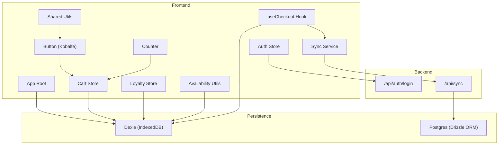
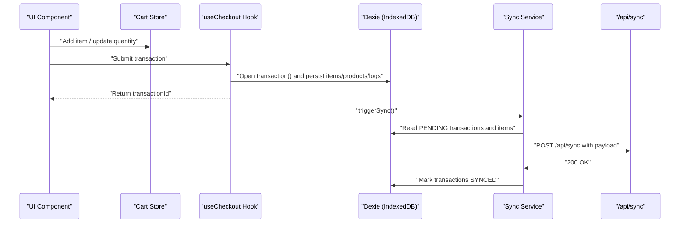
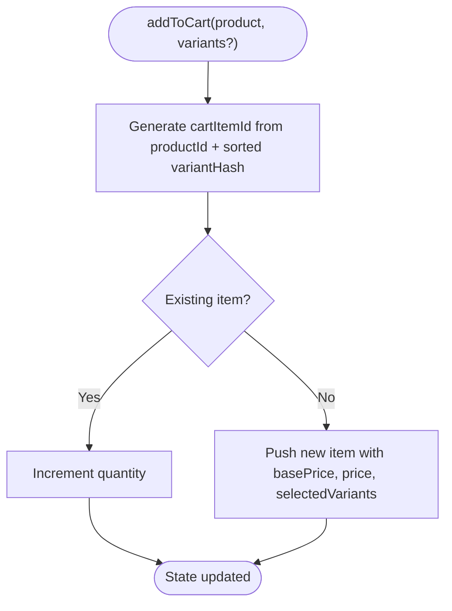
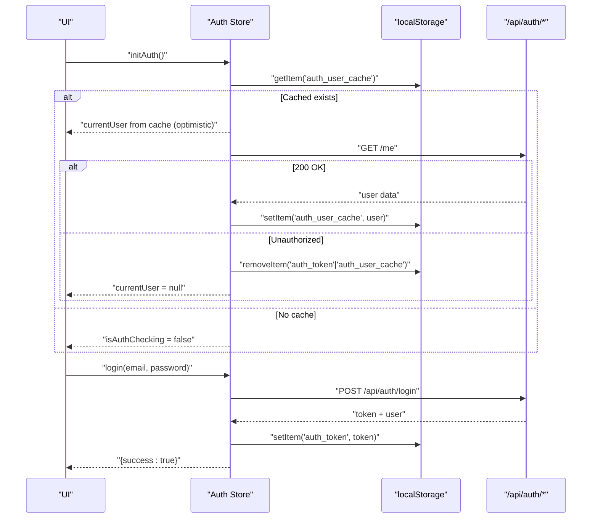
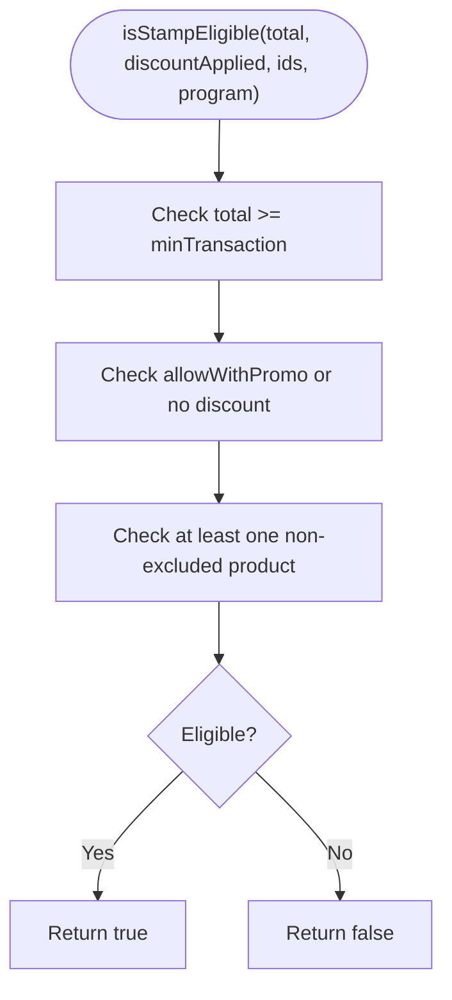
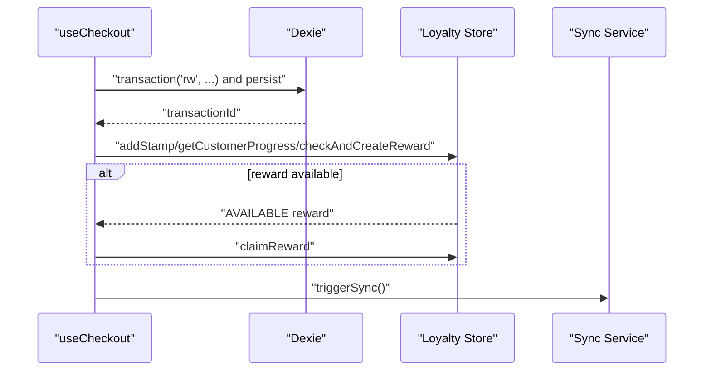
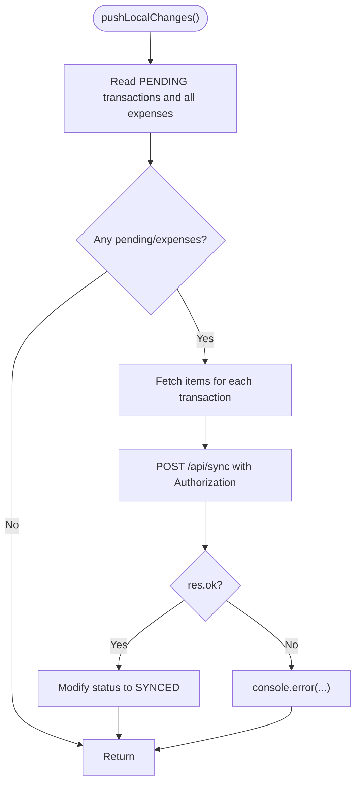
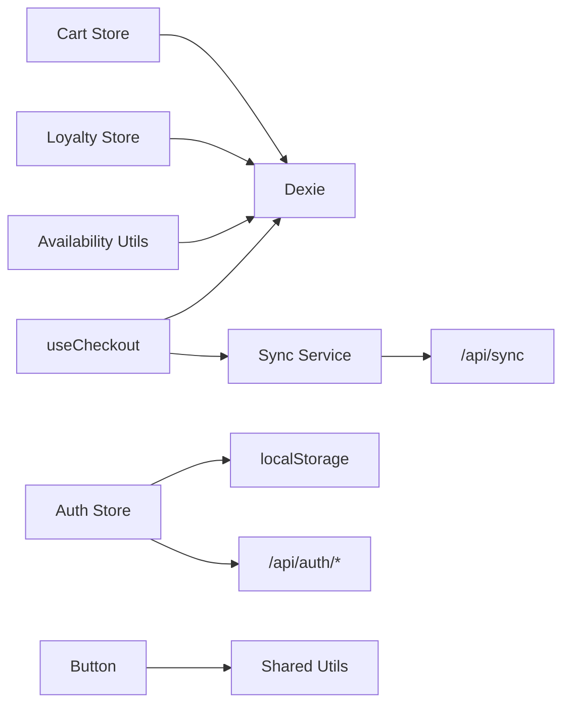

# Testing Strategy

<cite>
**Referenced Files in This Document**
- [package.json](file://package.json)
- [vite.config.ts](file://vite.config.ts)
- [src/app.tsx](file://src/app.tsx)
- [src/stores/cart.ts](file://src/stores/cart.ts)
- [src/stores/auth.ts](file://src/stores/auth.ts)
- [src/stores/loyalty.ts](file://src/stores/loyalty.ts)
- [src/hooks/useCheckout.ts](file://src/hooks/useCheckout.ts)
- [src/lib/syncService.ts](file://src/lib/syncService.ts)
- [src/routes/api/sync/index.ts](file://src/routes/api/sync/index.ts)
- [src/routes/api/auth/login.ts](file://src/routes/api/auth/login.ts)
- [src/components/ui/button.tsx](file://src/components/ui/button.tsx)
- [src/components/Counter.tsx](file://src/components/Counter.tsx)
- [src/db/db.ts](file://src/db/db.ts)
- [src/data/mockProducts.ts](file://src/data/mockProducts.ts)
- [src/lib/utils.ts](file://src/lib/utils.ts)
- [src/lib/availability.ts](file://src/lib/availability.ts)
</cite>

## Table of Contents
1. [Introduction](#introduction)
2. [Project Structure](#project-structure)
3. [Core Components](#core-components)
4. [Architecture Overview](#architecture-overview)
5. [Detailed Component Analysis](#detailed-component-analysis)
6. [Dependency Analysis](#dependency-analysis)
7. [Performance Considerations](#performance-considerations)
8. [Troubleshooting Guide](#troubleshooting-guide)
9. [Conclusion](#conclusion)
10. [Appendices](#appendices)

## Introduction
This document defines a comprehensive testing strategy for the NgePos POS system. It covers unit testing for stores and utilities, component testing for Solid.js UI components, integration testing for API endpoints and database operations, and performance testing for offline-first flows and synchronization. It also outlines setup configuration, mock data strategies, CI practices, assertion patterns, and coverage targets, with special attention to offline and synchronization challenges.

## Project Structure
NgePos is a Solid.js application with a clear separation of concerns:
- Stores encapsulate reactive state for cart, authentication, and loyalty.
- Utilities provide pure functions for availability checks and shared helpers.
- Hooks orchestrate checkout logic and coordinate with stores and IndexedDB/Dexie.
- Routes expose server endpoints for authentication and synchronization.
- UI components are built with Kobalte primitives and Tailwind utilities.
- Offline-first architecture relies on Dexie for IndexedDB and a sync service to Postgres via a dedicated endpoint.

**Diagram sources**
- [src/app.tsx:1-42](file://src/app.tsx#L1-L42)
- [src/stores/cart.ts:1-256](file://src/stores/cart.ts#L1-L256)
- [src/stores/auth.ts:1-205](file://src/stores/auth.ts#L1-L205)
- [src/stores/loyalty.ts:1-173](file://src/stores/loyalty.ts#L1-L173)
- [src/hooks/useCheckout.ts:1-234](file://src/hooks/useCheckout.ts#L1-L234)
- [src/lib/syncService.ts:1-110](file://src/lib/syncService.ts#L1-L110)
- [src/routes/api/sync/index.ts:1-96](file://src/routes/api/sync/index.ts#L1-L96)
- [src/routes/api/auth/login.ts:1-58](file://src/routes/api/auth/login.ts#L1-L58)
- [src/components/ui/button.tsx:1-54](file://src/components/ui/button.tsx#L1-L54)
- [src/components/Counter.tsx:1-14](file://src/components/Counter.tsx#L1-L14)
- [src/db/db.ts:1-569](file://src/db/db.ts#L1-L569)
- [src/lib/utils.ts:1-7](file://src/lib/utils.ts#L1-L7)
- [src/lib/availability.ts:1-40](file://src/lib/availability.ts#L1-L40)

**Section sources**
- [package.json:1-56](file://package.json#L1-L56)
- [vite.config.ts:1-46](file://vite.config.ts#L1-L46)
- [src/app.tsx:1-42](file://src/app.tsx#L1-L42)

## Core Components
This section identifies the primary units to test and their responsibilities:
- Cart store: manages cart items, variants, quantities, totals, discounts, and campaign logic.
- Auth store: handles optimistic caching, token verification, login/register flows, and permissions.
- Loyalty store: calculates stamp eligibility, progress, reward creation, and claiming.
- useCheckout hook: orchestrates transaction persistence, inventory updates, Cogs computation, and post-checkout side effects.
- Sync service: pushes local PENDING transactions/expenses to backend and marks synced.
- Availability utilities: compute product availability based on product toggles and raw material stock.
- UI components: Button and Counter demonstrate Solid primitives and event handling.

Key testing targets:
- Unit tests for stores and utilities (pure functions and state transitions).
- Component tests for Solid.js UI with reactive state and user interactions.
- Integration tests for API endpoints and database operations.
- Performance tests for offline-first flows and sync throttling.

**Section sources**
- [src/stores/cart.ts:1-256](file://src/stores/cart.ts#L1-L256)
- [src/stores/auth.ts:1-205](file://src/stores/auth.ts#L1-L205)
- [src/stores/loyalty.ts:1-173](file://src/stores/loyalty.ts#L1-L173)
- [src/hooks/useCheckout.ts:1-234](file://src/hooks/useCheckout.ts#L1-L234)
- [src/lib/syncService.ts:1-110](file://src/lib/syncService.ts#L1-L110)
- [src/lib/availability.ts:1-40](file://src/lib/availability.ts#L1-L40)
- [src/components/ui/button.tsx:1-54](file://src/components/ui/button.tsx#L1-L54)
- [src/components/Counter.tsx:1-14](file://src/components/Counter.tsx#L1-L14)

## Architecture Overview
The system follows an offline-first pattern:
- Frontend writes to IndexedDB via Dexie for transactions, items, expenses, and related entities.
- Sync service periodically pushes PENDING records to the backend and marks them SYNCED upon success.
- Authentication uses bearer tokens stored in localStorage; the auth store optimistically renders cached user while verifying against the backend.

**Diagram sources**
- [src/stores/cart.ts:1-256](file://src/stores/cart.ts#L1-L256)
- [src/hooks/useCheckout.ts:1-234](file://src/hooks/useCheckout.ts#L1-L234)
- [src/lib/syncService.ts:1-110](file://src/lib/syncService.ts#L1-L110)
- [src/routes/api/sync/index.ts:1-96](file://src/routes/api/sync/index.ts#L1-L96)
- [src/db/db.ts:1-569](file://src/db/db.ts#L1-L569)

## Detailed Component Analysis

### Cart Store Testing
Approach:
- Test state mutations: add to cart, update variants, update quantities, clear cart.
- Verify derived computations: subtotal, discount calculation, total, counts.
- Validate campaign logic correctness and quantity consumption across items.

Recommended assertions:
- After add: cart length increases, variant hash forms unique identifiers, price modifiers applied.
- After update quantity: quantities updated and filtered to zero removed.
- After discount calculation: totals reflect campaign rules and priority ordering.

Mocking strategy:
- Replace Dexie calls with in-memory arrays or a lightweight mock to isolate logic.
- Provide deterministic campaign data via controlled inputs.

**Diagram sources**
- [src/stores/cart.ts:16-48](file://src/stores/cart.ts#L16-L48)

**Section sources**
- [src/stores/cart.ts:1-256](file://src/stores/cart.ts#L1-L256)

### Auth Store Testing
Approach:
- Test optimistic rendering with cached user and background refresh.
- Validate login/register flows, OTP verification, profile update, password change, logout.
- Simulate network failures and token expiration scenarios.

Recommended assertions:
- On init: cached user rendered immediately; background verification updates state.
- On login: token stored, user set, cache refreshed.
- On invalid token: cleanup of tokens and cache, user cleared.

**Diagram sources**
- [src/stores/auth.ts:11-56](file://src/stores/auth.ts#L11-L56)
- [src/stores/auth.ts:58-79](file://src/stores/auth.ts#L58-L79)
- [src/routes/api/auth/login.ts:1-58](file://src/routes/api/auth/login.ts#L1-L58)

**Section sources**
- [src/stores/auth.ts:1-205](file://src/stores/auth.ts#L1-L205)
- [src/routes/api/auth/login.ts:1-58](file://src/routes/api/auth/login.ts#L1-L58)

### Loyalty Store Testing
Approach:
- Test stamp eligibility rules: minimum transaction, promo allowance, excluded products.
- Validate progress computation: current stamps, target, expiry window.
- Verify reward creation and claiming, including reset behavior.

Recommended assertions:
- Eligibility: returns false when below min transaction or when promo disallows and discount applied.
- Progress: stamps counted within expiry threshold, oldest stamp date computed.
- Rewards: AVAILABLE created when target reached, CLAIMED when claimed, optional reset.

**Diagram sources**
- [src/stores/loyalty.ts:36-53](file://src/stores/loyalty.ts#L36-L53)

**Section sources**
- [src/stores/loyalty.ts:1-173](file://src/stores/loyalty.ts#L1-L173)

### useCheckout Hook Testing
Approach:
- Test transaction persistence inside Dexie transaction boundaries.
- Validate inventory reduction, Cogs computation, and recipe-based cost updates.
- Verify post-checkout side effects: stamp accumulation, reward creation, reward claiming.
- Ensure sync trigger occurs after successful checkout.

Recommended assertions:
- Transaction created with correct fields, items persisted, logs recorded.
- Product stock decremented, raw material library updated, inventory logs added.
- Discounts and loyalty reward amounts reflected in totals and notes.
- Side effects executed: stamps, rewards, and sync triggered.

**Diagram sources**
- [src/hooks/useCheckout.ts:38-213](file://src/hooks/useCheckout.ts#L38-L213)
- [src/stores/loyalty.ts:97-174](file://src/stores/loyalty.ts#L97-L174)
- [src/lib/syncService.ts:49-57](file://src/lib/syncService.ts#L49-L57)

**Section sources**
- [src/hooks/useCheckout.ts:1-234](file://src/hooks/useCheckout.ts#L1-L234)

### Sync Service Testing
Approach:
- Validate fetching PENDING transactions and all expenses, enriching with items.
- Ensure debounced triggering avoids server overload.
- Assert successful marking of synced records and error handling.

Recommended assertions:
- If no PENDING/EXPENSES: return early.
- Payload includes transactions with items and all expenses.
- On success: transactions marked SYNCED; on failure: logged error.

**Diagram sources**
- [src/lib/syncService.ts:4-47](file://src/lib/syncService.ts#L4-L47)
- [src/routes/api/sync/index.ts:6-95](file://src/routes/api/sync/index.ts#L6-L95)

**Section sources**
- [src/lib/syncService.ts:1-110](file://src/lib/syncService.ts#L1-L110)
- [src/routes/api/sync/index.ts:1-96](file://src/routes/api/sync/index.ts#L1-L96)

### Availability Utilities Testing
Approach:
- Validate product availability considering product isActive flag and ingredient stock/status.
- Ensure reasons are surfaced for non-available items.

Recommended assertions:
- Product inactive: not available with reason.
- Missing ingredient: not available with reason.
- Inactive ingredient: not available with reason.
- All checks pass: available.

**Section sources**
- [src/lib/availability.ts:1-40](file://src/lib/availability.ts#L1-L40)

### UI Component Testing (Solid.js)
Approach:
- Test reactive state updates (e.g., Counter increments).
- Test component composition and variant sizing/class names (Button).
- Validate click handlers and accessibility attributes.

Recommended assertions:
- Counter: click handler increments signal; DOM reflects updated value.
- Button: variant/size props map to expected classes; children rendered.

**Section sources**
- [src/components/Counter.tsx:1-14](file://src/components/Counter.tsx#L1-L14)
- [src/components/ui/button.tsx:1-54](file://src/components/ui/button.tsx#L1-L54)

## Dependency Analysis
Testing dependencies and coupling:
- Stores depend on Dexie for persistence; isolate with mocks for unit tests.
- Hooks depend on stores and Dexie; test orchestrations with deterministic snapshots.
- Sync service depends on localStorage and API; stub fetch and Dexie reads/writes.
- UI components depend on shared utilities; test class composition and variants.

**Diagram sources**
- [src/stores/cart.ts:1-256](file://src/stores/cart.ts#L1-L256)
- [src/stores/auth.ts:1-205](file://src/stores/auth.ts#L1-L205)
- [src/stores/loyalty.ts:1-173](file://src/stores/loyalty.ts#L1-L173)
- [src/hooks/useCheckout.ts:1-234](file://src/hooks/useCheckout.ts#L1-L234)
- [src/lib/syncService.ts:1-110](file://src/lib/syncService.ts#L1-L110)
- [src/lib/utils.ts:1-7](file://src/lib/utils.ts#L1-L7)
- [src/lib/availability.ts:1-40](file://src/lib/availability.ts#L1-L40)

**Section sources**
- [src/db/db.ts:1-569](file://src/db/db.ts#L1-L569)

## Performance Considerations
Offline-first and synchronization performance:
- Debounce sync triggers to avoid flooding the server; validate timeout behavior.
- Batch IndexedDB writes and reads; minimize transaction scope.
- Throttle UI updates during bulk operations (e.g., adding many items).
- Measure sync latency and retry/backoff strategies.

Recommended metrics:
- Sync debounce interval effectiveness.
- Transaction commit duration under load.
- Offline queue growth and drain time.

[No sources needed since this section provides general guidance]

## Troubleshooting Guide
Common issues and resolutions:
- Auth initialization errors: ensure localStorage cleanup on token invalidation; verify background fetch behavior.
- Sync failures: inspect error logging and confirm token presence; validate payload shape.
- Checkout failures: verify Dexie transaction boundaries and error propagation; confirm inventory updates.
- Availability checks: ensure raw material references exist and are active.

**Section sources**
- [src/stores/auth.ts:51-56](file://src/stores/auth.ts#L51-L56)
- [src/lib/syncService.ts:44-47](file://src/lib/syncService.ts#L44-L47)
- [src/hooks/useCheckout.ts:206-213](file://src/hooks/useCheckout.ts#L206-L213)
- [src/lib/availability.ts:23-36](file://src/lib/availability.ts#L23-L36)

## Conclusion
A robust testing strategy for NgePos combines unit tests for stores/utilities, component tests for Solid.js UI, integration tests for APIs and databases, and performance tests for offline flows. Prioritize deterministic mocking of IndexedDB and network calls, enforce coverage thresholds, and address offline-specific challenges like optimistic UI, sync debouncing, and transaction rollbacks.

[No sources needed since this section summarizes without analyzing specific files]

## Appendices

### Testing Setup and Configuration
- Build and dev server configuration supports SSR offloading and pre-bundling; configure test runner to align with Vite/Solid ecosystem.
- Use localStorage mocks for auth flows; Dexie in-memory or stubbed for stores and hooks.
- Mock external libraries (e.g., toast) to assert side effects without side-effects.

**Section sources**
- [vite.config.ts:1-46](file://vite.config.ts#L1-L46)
- [src/app.tsx:24-41](file://src/app.tsx#L24-L41)

### Mock Data Strategies
- Use mock products and categories for UI and cart tests.
- Provide deterministic campaign and reward fixtures for discount calculations.
- Seed minimal data for availability checks and inventory logs.

**Section sources**
- [src/data/mockProducts.ts:1-85](file://src/data/mockProducts.ts#L1-L85)
- [src/db/db.ts:513-570](file://src/db/db.ts#L513-L570)

### Continuous Integration Practices
- Run unit and component tests on every push; enforce coverage thresholds.
- Integrate API and database tests in CI with ephemeral Postgres and IndexedDB polyfills.
- Schedule periodic performance tests to monitor sync latency and offline queue behavior.

[No sources needed since this section provides general guidance]

### Assertion Patterns and Coverage Targets
- Unit tests: 80%+ line and branch coverage for stores and utilities.
- Component tests: verify state transitions and DOM attributes.
- Integration tests: 100% success paths and error branches for auth and sync.
- Coverage targets: maintain baseline thresholds with progressive increases.

[No sources needed since this section provides general guidance]