# Expense Tracking

<cite>
**Referenced Files in This Document**
- [expenses.tsx](file://src/routes/app/reports/expenses.tsx)
- [DateFilter.tsx](file://src/components/DateFilter.tsx)
- [calendar.tsx](file://src/components/ui/calendar.tsx)
- [ConfirmDialog.tsx](file://src/components/ConfirmDialog.tsx)
- [db.ts](file://src/db/db.ts)
- [syncService.ts](file://src/lib/syncService.ts)
- [index.ts](file://src/routes/api/sync/index.ts)
- [schema.ts](file://src/server/db/schema.ts)
- [0000_snapshot.json](file://drizzle/meta/0000_snapshot.json)
</cite>

## Table of Contents
1. [Introduction](#introduction)
2. [Project Structure](#project-structure)
3. [Core Components](#core-components)
4. [Architecture Overview](#architecture-overview)
5. [Detailed Component Analysis](#detailed-component-analysis)
6. [Expense Recording Workflow](#expense-recording-workflow)
7. [Expense Listing Interface](#expense-listing-interface)
8. [Add/Edit Expense Form](#addedit-expense-form)
9. [Expense Categorization System](#expense-categorization-system)
10. [Offline-First Database Architecture](#offline-first-database-architecture)
11. [Practical Scenarios](#practical-scenarios)
12. [Performance Considerations](#performance-considerations)
13. [Troubleshooting Guide](#troubleshooting-guide)
14. [Conclusion](#conclusion)

## Introduction

NgePos is a modern Point of Sale (POS) system built with SolidJS and TypeScript that provides comprehensive expense tracking capabilities for small to medium businesses. The expense tracking module enables users to record operational expenses, categorize them appropriately, filter by date ranges, and manage expenses with full offline support.

The system implements a robust offline-first architecture using IndexedDB (via Dexie.js) for local storage, with seamless synchronization to a PostgreSQL backend. Users can track various expense categories including raw materials, operational costs, rent, employee salaries, utilities, marketing, and miscellaneous expenses.

## Project Structure

The expense tracking functionality is organized across several key components:

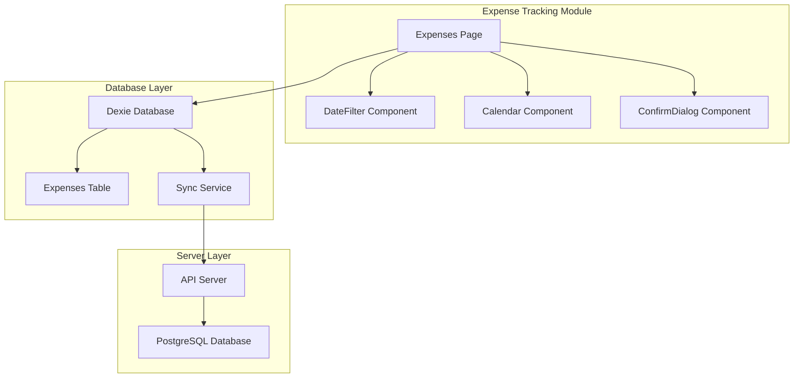

**Diagram sources**
- [expenses.tsx:1-478](file://src/routes/app/reports/expenses.tsx#L1-L478)
- [db.ts:270-498](file://src/db/db.ts#L270-L498)

**Section sources**
- [expenses.tsx:1-478](file://src/routes/app/reports/expenses.tsx#L1-L478)
- [db.ts:270-498](file://src/db/db.ts#L270-L498)

## Core Components

The expense tracking system consists of several interconnected components that work together to provide a seamless user experience:

### Expense Data Model
The system defines a comprehensive expense data model with strict typing and validation:

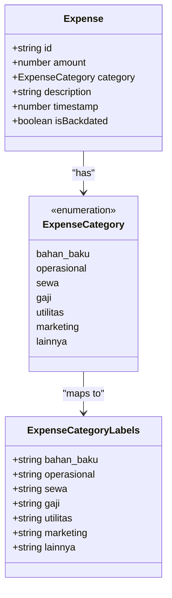

**Diagram sources**
- [db.ts:111-137](file://src/db/db.ts#L111-L137)

### Color-Coded Category Display
Each expense category is associated with a specific color scheme for visual identification:

| Category | Background Color | Text Color | Label |
|----------|------------------|------------|-------|
| bahan_baku | bg-orange-100 | text-orange-700 | Bahan Baku / Restok |
| operasional | bg-blue-100 | text-blue-700 | Operasional |
| sewa | bg-violet-100 | text-violet-700 | Sewa Tempat |
| gaji | bg-emerald-100 | text-emerald-700 | Gaji Karyawan |
| utilitas | bg-amber-100 | text-amber-700 | Listrik & Air |
| marketing | bg-pink-100 | text-pink-700 | Promosi & Marketing |
| lainnya | bg-gray-100 | text-gray-700 | Lain-lain |

**Section sources**
- [expenses.tsx:23-31](file://src/routes/app/reports/expenses.tsx#L23-L31)
- [db.ts:120-128](file://src/db/db.ts#L120-L128)

## Architecture Overview

The expense tracking system follows a modern offline-first architecture pattern:

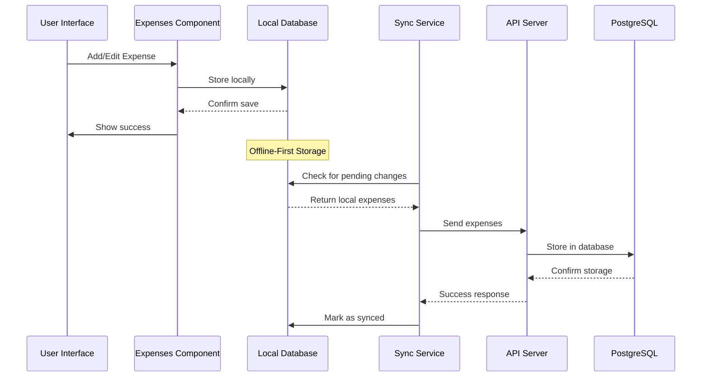

**Diagram sources**
- [expenses.tsx:108-142](file://src/routes/app/reports/expenses.tsx#L108-L142)
- [syncService.ts:4-57](file://src/lib/syncService.ts#L4-L57)

The architecture ensures that all operations work seamlessly both online and offline, with automatic synchronization when connectivity is restored.

**Section sources**
- [syncService.ts:4-57](file://src/lib/syncService.ts#L4-L57)
- [expenses.tsx:108-142](file://src/routes/app/reports/expenses.tsx#L108-L142)

## Detailed Component Analysis

### Expense Management Component

The main expense management component handles the complete lifecycle of expense records:

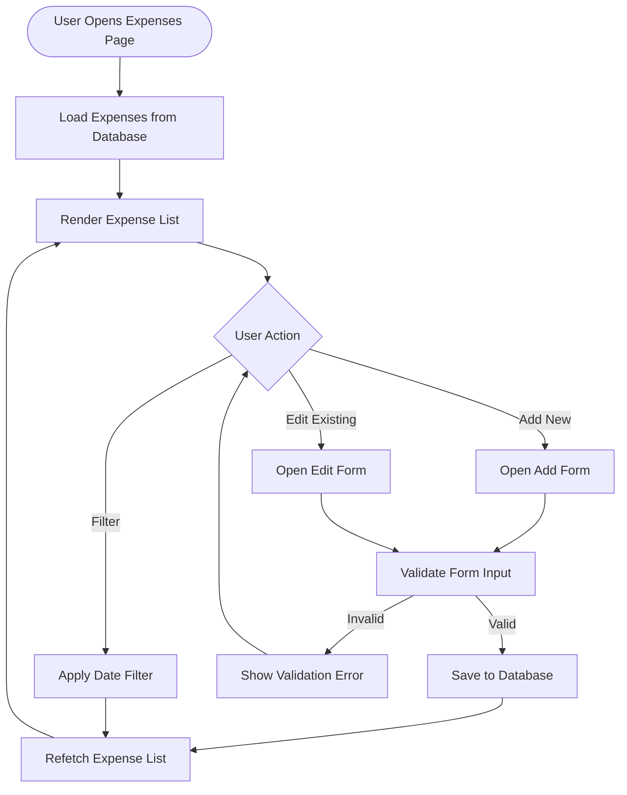

**Diagram sources**
- [expenses.tsx:33-170](file://src/routes/app/reports/expenses.tsx#L33-L170)

### Date Filtering System

The date filtering component provides flexible date range selection with intelligent defaults:

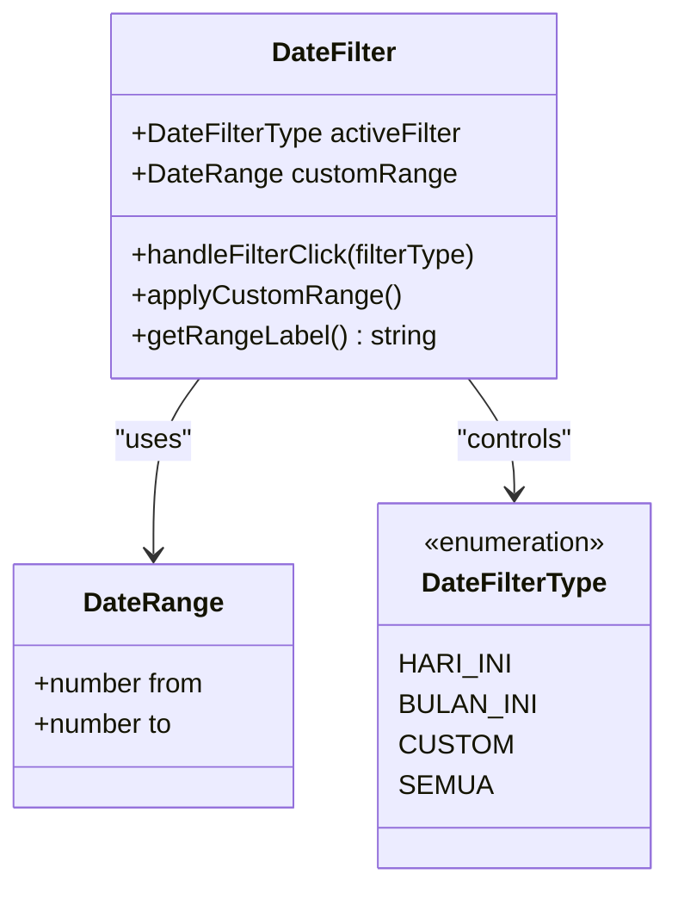

**Diagram sources**
- [DateFilter.tsx:8-19](file://src/components/DateFilter.tsx#L8-L19)

**Section sources**
- [DateFilter.tsx:21-237](file://src/components/DateFilter.tsx#L21-L237)

### Calendar Integration

The calendar component provides intuitive date selection with range highlighting:

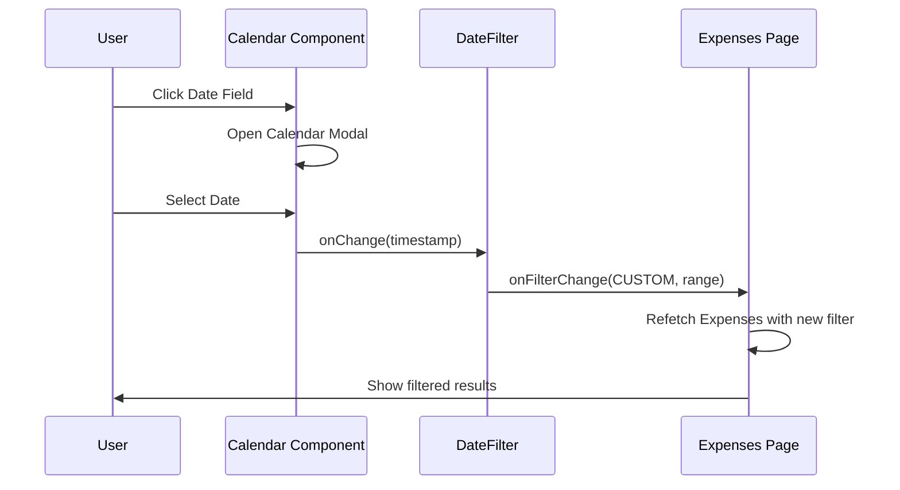

**Diagram sources**
- [calendar.tsx:46-50](file://src/components/ui/calendar.tsx#L46-L50)
- [DateFilter.tsx:203-231](file://src/components/DateFilter.tsx#L203-L231)

**Section sources**
- [calendar.tsx:13-183](file://src/components/ui/calendar.tsx#L13-L183)

## Expense Recording Workflow

The expense recording process follows a structured workflow with comprehensive validation:

### Amount Input Validation

The system implements robust validation for expense amounts:

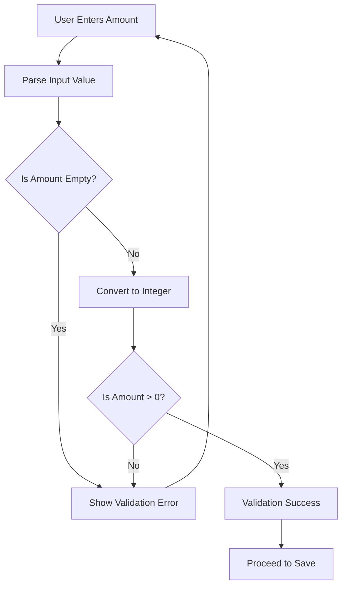

**Diagram sources**
- [expenses.tsx:113-117](file://src/routes/app/reports/expenses.tsx#L113-L117)

### Timestamp Management

The system automatically manages timestamps with backdated detection:

| Scenario | Timestamp Type | Detection Logic |
|----------|----------------|-----------------|
| Current Day | Real-time | `date.getTime() >= today 00:00:00` |
| Past Dates | Backdated | `date.getTime() < today 00:00:00` |
| Future Dates | Normal | `date.getTime() > today 23:59:59` |

**Section sources**
- [expenses.tsx:118-132](file://src/routes/app/reports/expenses.tsx#L118-L132)

## Expense Listing Interface

The expense listing interface provides comprehensive expense management capabilities:

### List Display Features

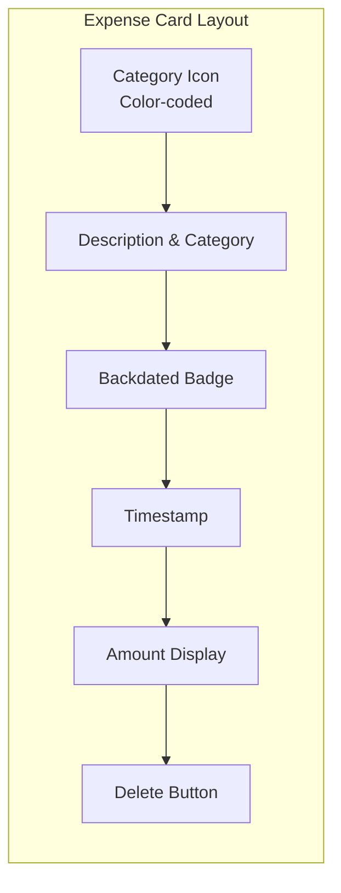

**Diagram sources**
- [expenses.tsx:264-331](file://src/routes/app/reports/expenses.tsx#L264-L331)

### Filtering Capabilities

The interface supports multiple filtering modes:

| Filter Type | Description | Use Case |
|-------------|-------------|----------|
| HARI_INI | Today's expenses only | Daily monitoring |
| BULAN_INI | Current month's expenses | Monthly reporting |
| CUSTOM | User-defined date range | Specific period analysis |
| SEMUA | All expenses | Complete history review |

**Section sources**
- [expenses.tsx:40-64](file://src/routes/app/reports/expenses.tsx#L40-L64)
- [DateFilter.tsx:33-38](file://src/components/DateFilter.tsx#L33-L38)

## Add/Edit Expense Form

The add/edit form provides comprehensive expense creation and modification capabilities:

### Form Fields and Validation

| Field | Type | Validation | Purpose |
|-------|------|------------|---------|
| Amount | Number | Required > 0 | Expense value |
| Category | Dropdown | Required | Expense classification |
| Description | Text | Optional | Additional details |
| Date | Calendar | Required | Expense occurrence date |

### Real-Time Validation Features

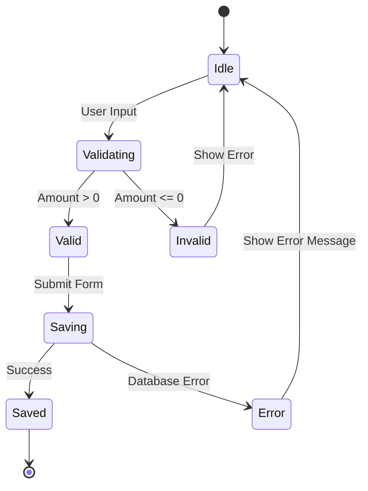

**Diagram sources**
- [expenses.tsx:108-142](file://src/routes/app/reports/expenses.tsx#L108-L142)

**Section sources**
- [expenses.tsx:345-474](file://src/routes/app/reports/expenses.tsx#L345-L474)

## Expense Categorization System

The expense categorization system provides comprehensive classification with visual indicators:

### Category Definitions

| Category Code | Display Name | Color Scheme | Typical Expenses |
|---------------|--------------|--------------|------------------|
| bahan_baku | Bahan Baku / Restok | Orange | Raw materials, supplies |
| operasional | Operasional | Blue | Daily business costs |
| sewa | Sewa Tempat | Violet | Rent, lease payments |
| gaji | Gaji Karyawan | Emerald | Employee salaries |
| utilitas | Listrik & Air | Amber | Utilities, services |
| marketing | Promosi & Marketing | Pink | Advertising, promotions |
| lainnya | Lain-lain | Gray | Miscellaneous expenses |

### Color-Coded Display System

Each category is represented with a consistent color scheme across the interface:

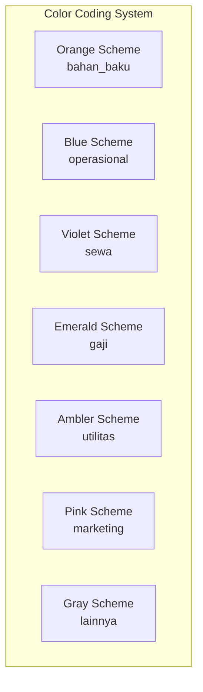

**Diagram sources**
- [expenses.tsx:23-31](file://src/routes/app/reports/expenses.tsx#L23-L31)

**Section sources**
- [db.ts:120-128](file://src/db/db.ts#L120-L128)

## Offline-First Database Architecture

The system implements a sophisticated offline-first architecture using IndexedDB:

### Local Database Schema

```mermaid
erDiagram
EXPENSES {
text id PK
numeric amount
text category
text description
timestamp timestamp
boolean is_backdated
timestamp updated_at
}
INDEXES {
idx_expenses_timestamp
}
EXPENSES ||--|| INDEXES : "indexed by"
```

**Diagram sources**
- [schema.ts:69-80](file://src/server/db/schema.ts#L69-L80)
- [0000_snapshot.json:7-56](file://drizzle/meta/0000_snapshot.json#L7-L56)

### Synchronization Process

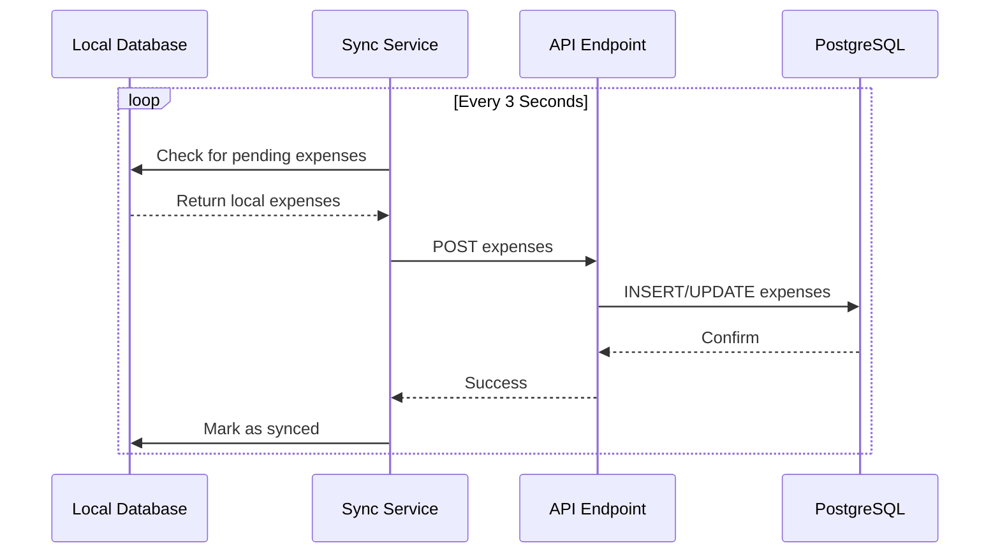

**Diagram sources**
- [syncService.ts:5-47](file://src/lib/syncService.ts#L5-L47)
- [index.ts:73-89](file://src/routes/api/sync/index.ts#L73-L89)

**Section sources**
- [db.ts:270-498](file://src/db/db.ts#L270-L498)
- [syncService.ts:4-57](file://src/lib/syncService.ts#L4-L57)

## Practical Scenarios

### Scenario 1: Daily Expense Recording

**Context**: A coffee shop owner wants to record daily expenses for ingredients and supplies.

**Steps**:
1. Navigate to Expenses page
2. Click "Catat" (Record) button
3. Enter amount (e.g., Rp 150,000)
4. Select category "Bahan Baku / Restok"
5. Add description "Bahan bakar kopi dan susu"
6. Verify date is today
7. Click "Simpan Pengeluaran"

### Scenario 2: Monthly Expense Analysis

**Context**: Manager needs to analyze monthly operational costs.

**Steps**:
1. Open Expenses page
2. Select "Bulan Ini" filter
3. Review total expenses for current month
4. Click individual entries for details
5. Export data for financial reporting

### Scenario 3: Backdated Expense Entry

**Context**: Owner realizes a past expense was missed.

**Steps**:
1. Navigate to Expenses page
2. Click "Catat" button
3. Select appropriate date from calendar
4. Enter expense details
5. System automatically marks as "Lampau" (Backdated)

### Scenario 4: Bulk Operations

**Context**: Multiple expenses need to be recorded quickly.

**Process**:
1. Use "Catat" button repeatedly for each expense
2. Leverage category dropdown for quick selection
3. Use "Hari Ini" filter to review all daily entries
4. Delete incorrect entries using trash icon

## Performance Considerations

### Database Optimization

The system implements several performance optimizations:

- **Indexed Queries**: Expenses are indexed by timestamp for fast filtering
- **Batch Operations**: Multiple expenses can be processed efficiently
- **Memory Management**: Large datasets are handled through pagination
- **Offline Caching**: Local storage reduces server load

### User Experience Optimizations

- **Debounced Sync**: Automatic synchronization occurs every 3 seconds
- **Real-time Updates**: UI updates immediately after successful saves
- **Loading States**: Clear feedback during long-running operations
- **Error Handling**: Graceful degradation when offline

## Troubleshooting Guide

### Common Issues and Solutions

| Issue | Symptoms | Solution |
|-------|----------|----------|
| Expenses not syncing | Changes appear locally but not on server | Check internet connection, wait for sync |
| Validation errors | "Jumlah pengeluaran harus diisi dengan benar" | Ensure amount > 0, remove non-numeric characters |
| Backdated detection | Expenses marked as "Lampau" unexpectedly | Verify selected date is not in future |
| Filter not working | Date filters don't apply | Refresh page, check browser compatibility |

### Debug Information

**Section sources**
- [expenses.tsx:137-141](file://src/routes/app/reports/expenses.tsx#L137-L141)
- [ConfirmDialog.tsx:31-113](file://src/components/ConfirmDialog.tsx#L31-L113)

## Conclusion

The NgePos expense tracking system provides a comprehensive solution for small to medium businesses seeking efficient expense management. The system's offline-first architecture ensures reliability in various network conditions, while the intuitive interface makes expense recording straightforward.

Key strengths include:
- **Robust Categorization**: Seven distinct expense categories with visual indicators
- **Flexible Filtering**: Multiple date range options for comprehensive analysis
- **Offline Support**: Seamless operation without internet connectivity
- **Real-time Validation**: Immediate feedback for data entry errors
- **Automatic Backdated Detection**: Intelligent timestamp management

The system successfully balances functionality with simplicity, making it accessible to users of varying technical expertise while providing the depth needed for comprehensive financial management.