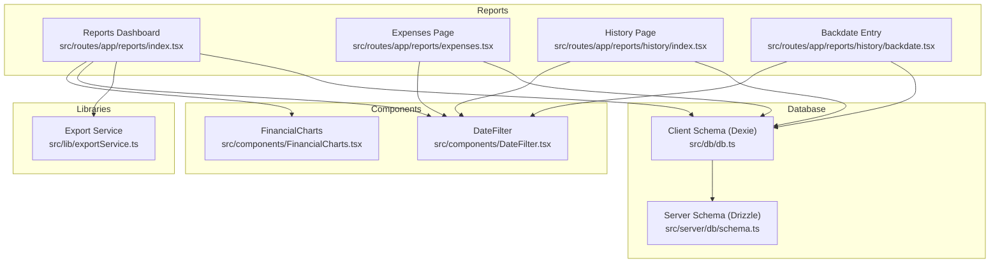
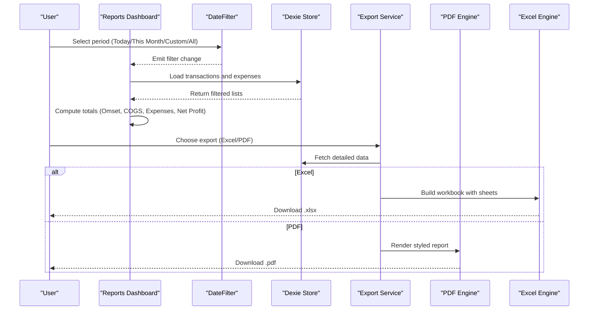
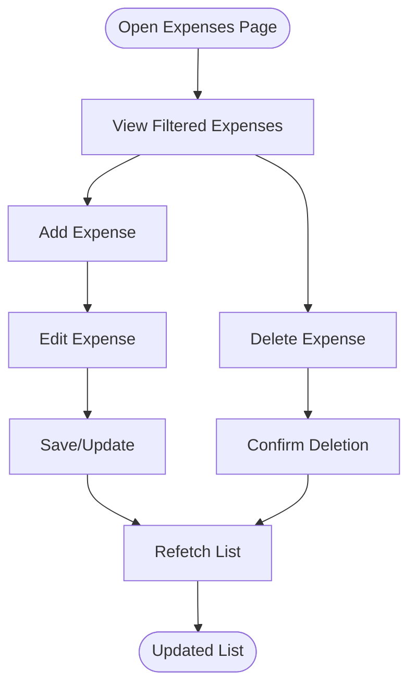
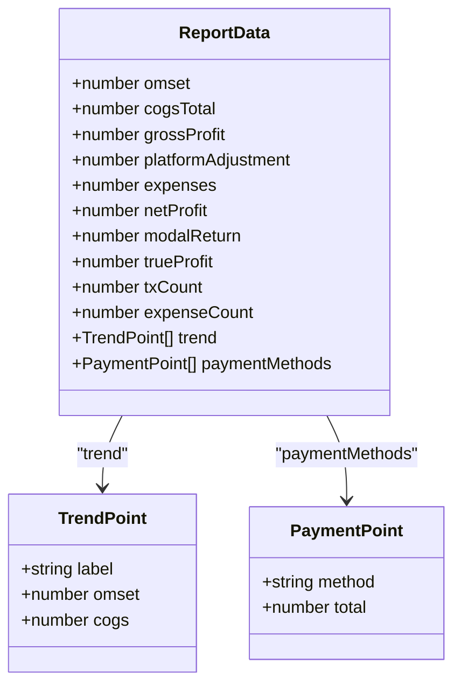
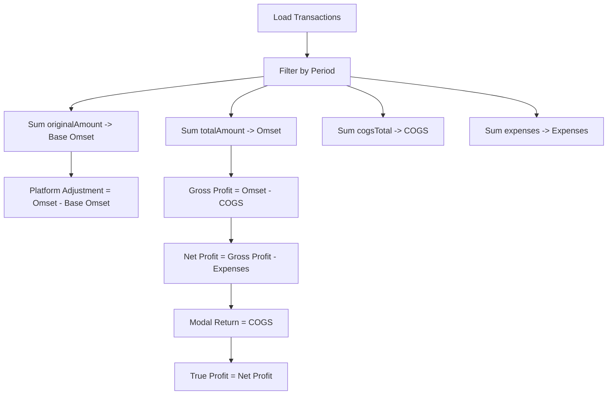
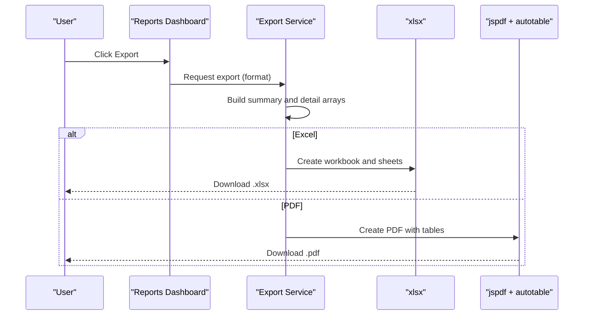
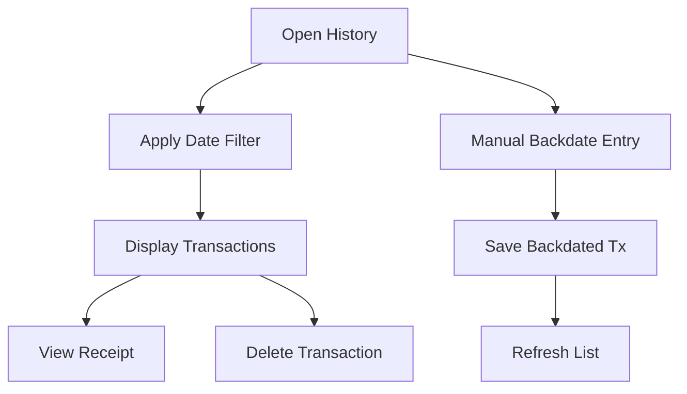
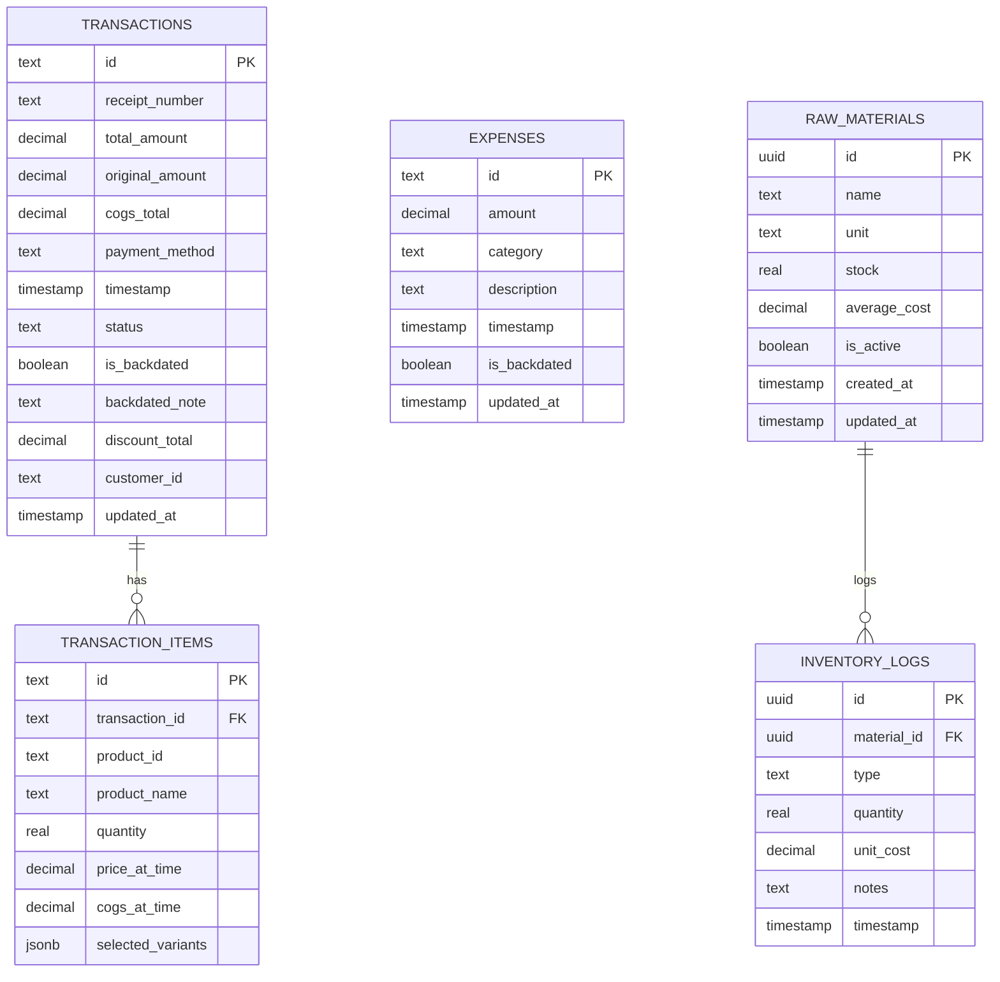
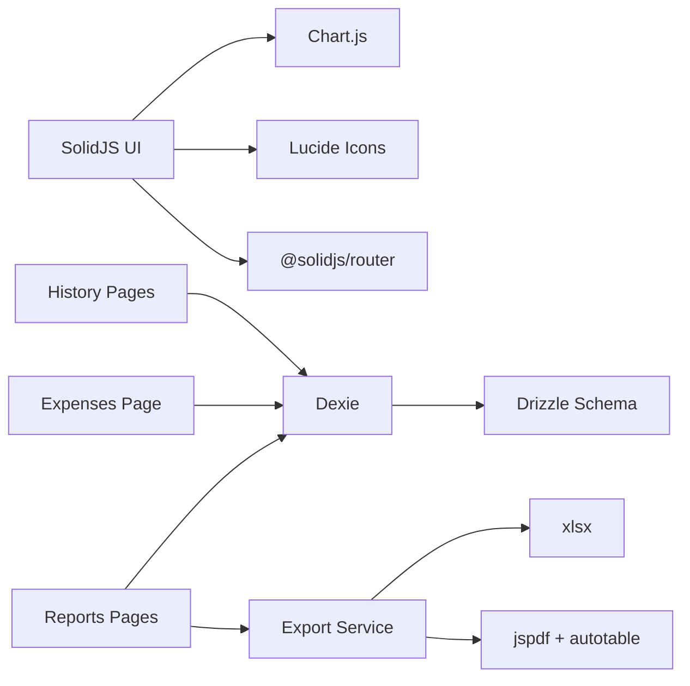

# Financial Management

<cite>
**Referenced Files in This Document**
- [expenses.tsx](file://src/routes/app/reports/expenses.tsx)
- [reports/index.tsx](file://src/routes/app/reports/index.tsx)
- [exportService.ts](file://src/lib/exportService.ts)
- [FinancialCharts.tsx](file://src/components/FinancialCharts.tsx)
- [schema.ts](file://src/server/db/schema.ts)
- [db.ts](file://src/db/db.ts)
- [history/index.tsx](file://src/routes/app/reports/history/index.tsx)
- [history/backdate.tsx](file://src/routes/app/reports/history/backdate.tsx)
- [DateFilter.tsx](file://src/components/DateFilter.tsx)
- [package.json](file://package.json)
- [PRD.txt](file://PRD.txt)
</cite>

## Table of Contents
1. [Introduction](#introduction)
2. [Project Structure](#project-structure)
3. [Core Components](#core-components)
4. [Architecture Overview](#architecture-overview)
5. [Detailed Component Analysis](#detailed-component-analysis)
6. [Dependency Analysis](#dependency-analysis)
7. [Performance Considerations](#performance-considerations)
8. [Troubleshooting Guide](#troubleshooting-guide)
9. [Conclusion](#conclusion)
10. [Appendices](#appendices)

## Introduction
This document explains the financial management capabilities of the NgePos POS system, focusing on expense tracking, revenue and profit analytics, reporting, export functionality, and operational insights. It covers how transactions, expenses, and inventory are modeled, how financial summaries are computed, and how reports can be exported to Excel and PDF. Practical examples illustrate daily operations, while guidance is provided for budget tracking, compliance, and future integrations.

## Project Structure
NgePos organizes financial features under the “Reports” app route, with dedicated pages for:
- Expense tracking and categorization
- Financial summary dashboard with charts
- Transaction history and backdated entries
- Export to Excel and PDF

**Diagram sources**
- [reports/index.tsx:1-715](file://src/routes/app/reports/index.tsx#L1-L715)
- [expenses.tsx:1-478](file://src/routes/app/reports/expenses.tsx#L1-L478)
- [history/index.tsx:1-244](file://src/routes/app/reports/history/index.tsx#L1-L244)
- [history/backdate.tsx:1-218](file://src/routes/app/reports/history/backdate.tsx#L1-L218)
- [FinancialCharts.tsx:1-333](file://src/components/FinancialCharts.tsx#L1-L333)
- [DateFilter.tsx:1-237](file://src/components/DateFilter.tsx#L1-L237)
- [exportService.ts:1-293](file://src/lib/exportService.ts#L1-L293)
- [db.ts:1-569](file://src/db/db.ts#L1-L569)
- [schema.ts:1-143](file://src/server/db/schema.ts#L1-L143)

**Section sources**
- [reports/index.tsx:1-715](file://src/routes/app/reports/index.tsx#L1-L715)
- [expenses.tsx:1-478](file://src/routes/app/reports/expenses.tsx#L1-L478)
- [history/index.tsx:1-244](file://src/routes/app/reports/history/index.tsx#L1-L244)
- [history/backdate.tsx:1-218](file://src/routes/app/reports/history/backdate.tsx#L1-L218)
- [FinancialCharts.tsx:1-333](file://src/components/FinancialCharts.tsx#L1-L333)
- [DateFilter.tsx:1-237](file://src/components/DateFilter.tsx#L1-L237)
- [exportService.ts:1-293](file://src/lib/exportService.ts#L1-L293)
- [db.ts:1-569](file://src/db/db.ts#L1-L569)
- [schema.ts:1-143](file://src/server/db/schema.ts#L1-L143)

## Core Components
- Expense tracking module: record, categorize, and manage operational expenses with backdated detection.
- Financial reporting dashboard: compute revenue, cost of goods sold (COGS), gross profit, operating expenses, net profit, and modal return; visualize trends and payment distribution.
- Export service: produce Excel (.xlsx) and PDF reports with multiple sheets and premium styling.
- Transaction history: view, filter, and delete transactions; support for manual backdated entries.
- Date filtering: flexible period selection (today, this month, custom range, all time).

**Section sources**
- [expenses.tsx:1-478](file://src/routes/app/reports/expenses.tsx#L1-L478)
- [reports/index.tsx:34-715](file://src/routes/app/reports/index.tsx#L34-L715)
- [exportService.ts:45-293](file://src/lib/exportService.ts#L45-L293)
- [history/index.tsx:1-244](file://src/routes/app/reports/history/index.tsx#L1-L244)
- [history/backdate.tsx:1-218](file://src/routes/app/reports/history/backdate.tsx#L1-L218)
- [DateFilter.tsx:1-237](file://src/components/DateFilter.tsx#L1-L237)

## Architecture Overview
The financial system is composed of:
- Client-side data store (Dexie) for offline-first operations on transactions, expenses, and settings.
- Server-side schema (Drizzle) for persistent storage and potential future backend synchronization.
- UI components for filtering, visualization, and exporting.
- Computation pipeline that aggregates data by selected periods and generates financial summaries.

**Diagram sources**
- [reports/index.tsx:56-209](file://src/routes/app/reports/index.tsx#L56-L209)
- [exportService.ts:49-132](file://src/lib/exportService.ts#L49-L132)
- [exportService.ts:137-291](file://src/lib/exportService.ts#L137-L291)
- [DateFilter.tsx:21-86](file://src/components/DateFilter.tsx#L21-L86)
- [db.ts:270-495](file://src/db/db.ts#L270-L495)

## Detailed Component Analysis

### Expense Tracking System
- Categories: raw materials/restocking, operational, rent, payroll, utilities, marketing, miscellaneous.
- Recording process: add/edit sheet with amount, category, description, and date; backdated detection marks entries prior to today’s start-of-day.
- Filtering and display: list view with category badges, backdated indicators, and total computation.
- Deletion: confirmation dialog prevents accidental removal.

**Diagram sources**
- [expenses.tsx:33-170](file://src/routes/app/reports/expenses.tsx#L33-L170)
- [expenses.tsx:144-160](file://src/routes/app/reports/expenses.tsx#L144-L160)

**Section sources**
- [expenses.tsx:1-478](file://src/routes/app/reports/expenses.tsx#L1-L478)
- [db.ts:111-137](file://src/db/db.ts#L111-L137)

### Financial Reporting and Analytics
- Metrics computed:
  - Omset (net sales), platform adjustment (difference between net and original amounts), COGS, gross profit, operating expenses, net profit, modal return (COGS), true profit (net profit).
- Trend analysis: hourly for today, daily otherwise; payment method distribution.
- Visualization: line chart for revenue vs COGS trend; doughnut chart for payment method distribution.
- Export: Excel with summary, transactions, detail products, and expenses; PDF with styled sections and tables.

**Diagram sources**
- [reports/index.tsx:34-47](file://src/routes/app/reports/index.tsx#L34-L47)
- [reports/index.tsx:301-366](file://src/routes/app/reports/index.tsx#L301-L366)

**Section sources**
- [reports/index.tsx:211-370](file://src/routes/app/reports/index.tsx#L211-L370)
- [FinancialCharts.tsx:19-33](file://src/components/FinancialCharts.tsx#L19-L33)

### Revenue Tracking and COGS Calculation
- Revenue tracking: totalAmount reflects cash received; originalAmount captures subtotal before adjustments; platformAdjustment accounts for platform markup/fees.
- COGS calculation: sum of cogsTotal across transactions; computed at checkout and stored per transaction.
- Payment method distribution: aggregated totals per method for distribution analysis.

**Diagram sources**
- [reports/index.tsx:285-297](file://src/routes/app/reports/index.tsx#L285-L297)

**Section sources**
- [reports/index.tsx:285-366](file://src/routes/app/reports/index.tsx#L285-L366)
- [db.ts:82-98](file://src/db/db.ts#L82-L98)

### Profitability Analysis and Budget Tracking
- Profitability: gross profit, net profit, modal return, and true profit provide insight into operational efficiency and cash availability after reinvestment.
- Budget tracking: use operating expense categories to compare against historical averages; monitor trends via the dashboard charts.
- Practical example: if true profit is negative, review operating expenses and COGS; adjust pricing or reduce unnecessary categories.

**Section sources**
- [reports/index.tsx:567-604](file://src/routes/app/reports/index.tsx#L567-L604)
- [expenses.tsx:23-31](file://src/routes/app/reports/expenses.tsx#L23-L31)

### Export Functionality (PDF/Excel)
- Excel export: multi-sheet workbook with summary, transactions, detail products, and expenses.
- PDF export: styled report with header, metrics grid, recent transactions, product detail, and expenses; includes footer pagination.
- Data formatting: localized Indonesian currency and date formatting; robust numeric parsing for exports.

**Diagram sources**
- [reports/index.tsx:56-209](file://src/routes/app/reports/index.tsx#L56-L209)
- [exportService.ts:49-132](file://src/lib/exportService.ts#L49-L132)
- [exportService.ts:137-291](file://src/lib/exportService.ts#L137-L291)

**Section sources**
- [exportService.ts:45-293](file://src/lib/exportService.ts#L45-L293)
- [reports/index.tsx:56-209](file://src/routes/app/reports/index.tsx#L56-L209)

### Transaction History and Backdated Entries
- History page: filter by period, view totals, swipe-to-delete transactions, and navigate to receipts.
- Backdated entry: create manual transactions for past dates with receipt number, payment method, and timestamp.
- Audit trail: timestamps, backdated flags, and status indicators help track changes.

**Diagram sources**
- [history/index.tsx:10-100](file://src/routes/app/reports/history/index.tsx#L10-L100)
- [history/backdate.tsx:20-68](file://src/routes/app/reports/history/backdate.tsx#L20-L68)

**Section sources**
- [history/index.tsx:1-244](file://src/routes/app/reports/history/index.tsx#L1-L244)
- [history/backdate.tsx:1-218](file://src/routes/app/reports/history/backdate.tsx#L1-L218)

### Data Models and Storage
- Client schema (Dexie): transactions, transaction items, expenses, settings, staff, roles, raw materials, inventory logs, discounts, bundles, campaigns, customers, loyalty programs.
- Server schema (Drizzle): normalized tables for roles, staff, settings, transactions, transaction items, expenses, products, raw materials, modifier groups/options, product ingredients, and inventory logs.

**Diagram sources**
- [schema.ts:34-133](file://src/server/db/schema.ts#L34-L133)
- [db.ts:82-110](file://src/db/db.ts#L82-L110)
- [db.ts:130-137](file://src/db/db.ts#L130-L137)

**Section sources**
- [schema.ts:1-143](file://src/server/db/schema.ts#L1-L143)
- [db.ts:270-495](file://src/db/db.ts#L270-L495)

## Dependency Analysis
- UI libraries: SolidJS, Lucide icons, Chart.js for visualization, Tailwind CSS for styling.
- Export libraries: xlsx for Excel, jspdf plus jspdf-autotable for PDF.
- Data persistence: Dexie for client-side, Drizzle ORM for server schema.
- Authentication and routing: @solidjs/router, @solidjs/start.

**Diagram sources**
- [package.json:11-39](file://package.json#L11-L39)
- [reports/index.tsx:18-22](file://src/routes/app/reports/index.tsx#L18-L22)
- [exportService.ts:1-8](file://src/lib/exportService.ts#L1-L8)

**Section sources**
- [package.json:1-56](file://package.json#L1-L56)

## Performance Considerations
- Efficient filtering: client-side filtering by timestamp range minimizes server load; consider virtualized lists for large datasets.
- Lazy loading: Chart.js and export libraries are dynamically imported to keep initial bundle small.
- Aggregation: precompute metrics per period to avoid repeated heavy computations; cache results until filters change.
- Export optimization: limit PDF rows to recent entries; batch Excel writes to reduce memory pressure.

## Troubleshooting Guide
- Export failures: verify numeric inputs and timestamps; ensure date range validity; check toast notifications for errors.
- Missing data: confirm Dexie version migrations have run; verify settings keys for outlet info.
- Chart rendering: ensure expanded state is toggled before rendering; destroy charts on unmount to prevent leaks.
- Backdated entries: validate date/time selection; confirm manual entries are flagged appropriately.

**Section sources**
- [reports/index.tsx:203-208](file://src/routes/app/reports/index.tsx#L203-L208)
- [exportService.ts:144-149](file://src/lib/exportService.ts#L144-L149)
- [FinancialCharts.tsx:89-122](file://src/components/FinancialCharts.tsx#L89-L122)
- [history/backdate.tsx:20-68](file://src/routes/app/reports/history/backdate.tsx#L20-L68)

## Conclusion
NgePos provides a comprehensive financial management toolkit: categorized expense tracking, robust revenue and profit analytics, interactive visualizations, and reliable export capabilities. The modular architecture supports future enhancements such as automated scheduling, compliance features, and third-party accounting integrations.

## Appendices

### Practical Examples
- Recording an expense: Open Expenses, click “Catat”, select category (e.g., utilities), enter amount, pick date, save. Review total and backdated entries.
- Generating a monthly report: On Reports, select “Bulan Ini”, review metrics, and export to Excel or PDF.
- Budget tracking: Compare operating expenses across categories; use trend charts to spot anomalies.

### Compliance and Audit Trails
- Timestamps and backdated flags: maintain audit trail for all transactions and expenses.
- Receipt numbers and statuses: enable reconciliation and dispute resolution.
- Exported reports: include metadata and footers for external auditing.

### Tax Reporting Notes
- Current implementation computes net sales, COGS, and expenses; platform adjustments are included for revenue recognition.
- Future enhancements (per PRD) include tax reporting and comparative analytics; integrate with accounting software as outlined below.

### Integration with Accounting Software
- Exported Excel/PDF reports can be imported into systems like Jurnal or Accurate for bookkeeping.
- Recommended steps: map categories to chart of accounts, reconcile bank statements, and automate recurring reconciliations.

**Section sources**
- [PRD.txt:165-190](file://PRD.txt#L165-L190)
- [exportService.ts:49-132](file://src/lib/exportService.ts#L49-L132)
- [exportService.ts:137-291](file://src/lib/exportService.ts#L137-L291)