# Financial Reporting

<cite>
**Referenced Files in This Document**
- [src/routes/app/reports/index.tsx](file://src/routes/app/reports/index.tsx)
- [src/routes/app/reports/history/index.tsx](file://src/routes/app/reports/history/index.tsx)
- [src/routes/app/reports/history/backdate.tsx](file://src/routes/app/reports/history/backdate.tsx)
- [src/routes/app/reports/expenses.tsx](file://src/routes/app/reports/expenses.tsx)
- [src/components/FinancialCharts.tsx](file://src/components/FinancialCharts.tsx)
- [src/components/DateFilter.tsx](file://src/components/DateFilter.tsx)
- [src/lib/exportService.ts](file://src/lib/exportService.ts)
- [src/db/db.ts](file://src/db/db.ts)
- [package.json](file://package.json)
- [PRD.txt](file://PRD.txt)
</cite>

## Table of Contents
1. [Introduction](#introduction)
2. [Project Structure](#project-structure)
3. [Core Components](#core-components)
4. [Architecture Overview](#architecture-overview)
5. [Detailed Component Analysis](#detailed-component-analysis)
6. [Dependency Analysis](#dependency-analysis)
7. [Performance Considerations](#performance-considerations)
8. [Troubleshooting Guide](#troubleshooting-guide)
9. [Conclusion](#conclusion)
10. [Appendices](#appendices)

## Introduction
This document explains the financial reporting capabilities of the NgePos POS system. It covers sales analytics, revenue tracking, transaction history, profit margin and cost of goods sold (COGS) analysis, the reporting dashboard with interactive charts and date-range filtering, export functionality to Excel and PDF, historical data management including backdated transactions, and operational reconciliation. It also outlines profit and loss calculations, expense-to-revenue ratios, comparative analysis across periods, and practical examples of report generation and insights extraction. Compliance and tax-reporting considerations are addressed alongside customization and visualization features.

## Project Structure
The financial reporting module is organized around four primary pages and supporting components:
- Dashboard and analytics: [Reports](file://src/routes/app/reports/index.tsx)
- Transaction history: [History](file://src/routes/app/reports/history/index.tsx)
- Backdated transactions: [Backdate](file://src/routes/app/reports/history/backdate.tsx)
- Operational expenses: [Expenses](file://src/routes/app/reports/expenses.tsx)
- Interactive charts: [FinancialCharts](file://src/components/FinancialCharts.tsx)
- Date range filtering: [DateFilter](file://src/components/DateFilter.tsx)
- Export engine: [exportService](file://src/lib/exportService.ts)
- Data model and storage: [db](file://src/db/db.ts)

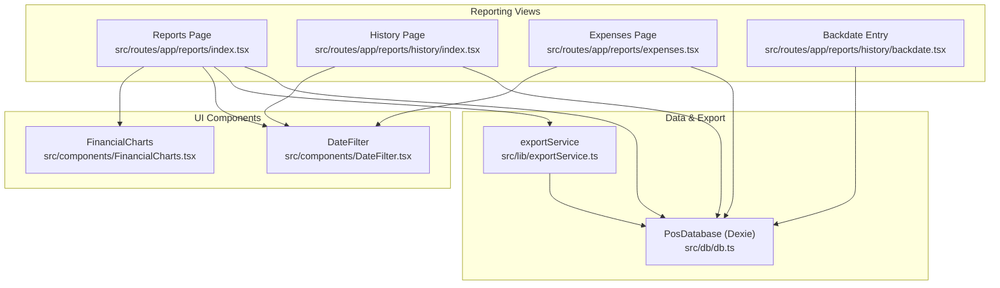

**Diagram sources**
- [src/routes/app/reports/index.tsx:1-715](file://src/routes/app/reports/index.tsx#L1-L715)
- [src/routes/app/reports/history/index.tsx:1-244](file://src/routes/app/reports/history/index.tsx#L1-L244)
- [src/routes/app/reports/history/backdate.tsx:1-218](file://src/routes/app/reports/history/backdate.tsx#L1-L218)
- [src/routes/app/reports/expenses.tsx:1-478](file://src/routes/app/reports/expenses.tsx#L1-L478)
- [src/components/FinancialCharts.tsx:1-333](file://src/components/FinancialCharts.tsx#L1-L333)
- [src/components/DateFilter.tsx:1-237](file://src/components/DateFilter.tsx#L1-L237)
- [src/lib/exportService.ts:1-293](file://src/lib/exportService.ts#L1-L293)
- [src/db/db.ts:1-570](file://src/db/db.ts#L1-L570)

**Section sources**
- [src/routes/app/reports/index.tsx:1-715](file://src/routes/app/reports/index.tsx#L1-L715)
- [src/routes/app/reports/history/index.tsx:1-244](file://src/routes/app/reports/history/index.tsx#L1-L244)
- [src/routes/app/reports/history/backdate.tsx:1-218](file://src/routes/app/reports/history/backdate.tsx#L1-L218)
- [src/routes/app/reports/expenses.tsx:1-478](file://src/routes/app/reports/expenses.tsx#L1-L478)
- [src/components/FinancialCharts.tsx:1-333](file://src/components/FinancialCharts.tsx#L1-L333)
- [src/components/DateFilter.tsx:1-237](file://src/components/DateFilter.tsx#L1-L237)
- [src/lib/exportService.ts:1-293](file://src/lib/exportService.ts#L1-L293)
- [src/db/db.ts:1-570](file://src/db/db.ts#L1-L570)

## Core Components
- Reports dashboard: Computes revenue, platform adjustment, COGS, gross profit, operating expenses, net profit, modal return, and “true profit.” Aggregates hourly/daily trends and payment distribution. Provides export to Excel and PDF.
- Transaction history: Lists transactions with backdated indicators, supports filtering by date range, and allows deletion with confirmation.
- Expenses: Records and categorizes operational expenses, auto-detects backdated entries, and supports editing/deleting.
- Backdate entry: Enables manual creation of past transactions with timestamp, amount, and payment method.
- FinancialCharts: Renders interactive line and doughnut charts for financial trends and payment methods.
- DateFilter: Provides quick filters (today, this month, custom, all) and a calendar-based custom range selector.
- ExportService: Generates Excel (.xlsx) with summary, transactions, detail products, and expenses sheets; generates PDF with styled summary, recent transactions, product detail, and expenses.
- PosDatabase: Dexie-based schema for transactions, transaction items, expenses, settings, and related entities.

**Section sources**
- [src/routes/app/reports/index.tsx:34-47](file://src/routes/app/reports/index.tsx#L34-L47)
- [src/routes/app/reports/history/index.tsx:1-244](file://src/routes/app/reports/history/index.tsx#L1-L244)
- [src/routes/app/reports/expenses.tsx:1-478](file://src/routes/app/reports/expenses.tsx#L1-L478)
- [src/routes/app/reports/history/backdate.tsx:1-218](file://src/routes/app/reports/history/backdate.tsx#L1-L218)
- [src/components/FinancialCharts.tsx:1-333](file://src/components/FinancialCharts.tsx#L1-L333)
- [src/components/DateFilter.tsx:1-237](file://src/components/DateFilter.tsx#L1-L237)
- [src/lib/exportService.ts:1-293](file://src/lib/exportService.ts#L1-L293)
- [src/db/db.ts:82-137](file://src/db/db.ts#L82-L137)

## Architecture Overview
The reporting pipeline integrates UI components, data aggregation, and export services:
- UI signals and resources compute report metrics and drive chart rendering.
- DateFilter controls the active period and custom range.
- ExportService orchestrates data retrieval and formatting for Excel/PDF.
- Dexie-backed PosDatabase persists transactions, items, and expenses.

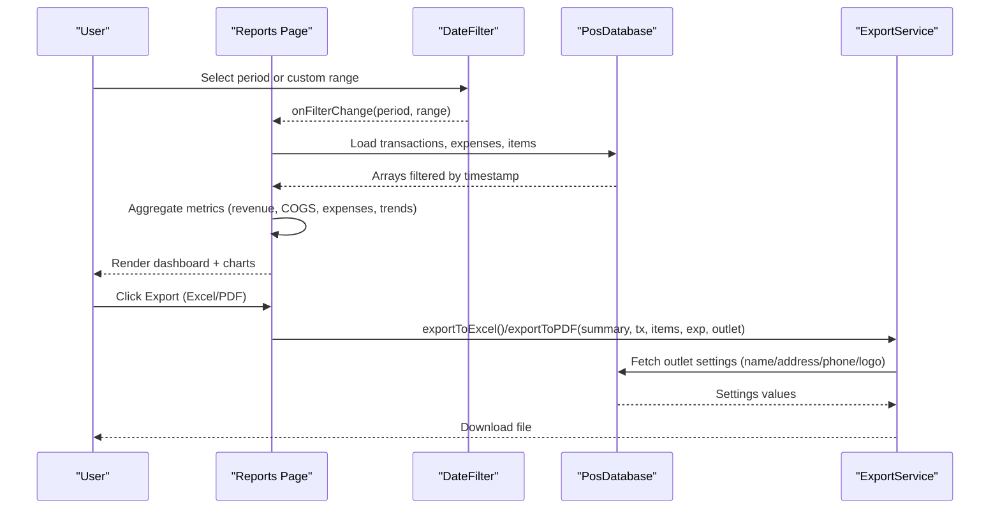

**Diagram sources**
- [src/routes/app/reports/index.tsx:56-209](file://src/routes/app/reports/index.tsx#L56-L209)
- [src/components/DateFilter.tsx:40-81](file://src/components/DateFilter.tsx#L40-L81)
- [src/lib/exportService.ts:49-132](file://src/lib/exportService.ts#L49-L132)
- [src/db/db.ts:502-509](file://src/db/db.ts#L502-L509)

## Detailed Component Analysis

### Reports Dashboard
- Metrics computed:
  - Revenue (net received)
  - Platform adjustment (difference between net and pre-adjustment totals)
  - COGS (sum of transaction-level COGS)
  - Gross profit (revenue − COGS)
  - Operating expenses (sum of expenses)
  - Net profit (gross profit − expenses)
  - Modal return (COGS)
  - True profit (net profit; excludes double deduction)
  - Counts: transaction count, expense count
- Aggregations:
  - Trend data: hourly for today, daily otherwise
  - Payment method distribution
- Rendering:
  - Hero card for net profit with color-coded positivity
  - Sectioned metrics cards for sales, expenses, and capital allocation
  - Quick navigation to history and expenses

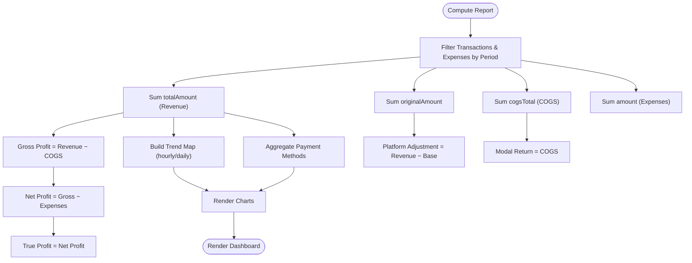

**Diagram sources**
- [src/routes/app/reports/index.tsx:211-370](file://src/routes/app/reports/index.tsx#L211-L370)
- [src/components/FinancialCharts.tsx:124-232](file://src/components/FinancialCharts.tsx#L124-L232)

**Section sources**
- [src/routes/app/reports/index.tsx:34-47](file://src/routes/app/reports/index.tsx#L34-L47)
- [src/routes/app/reports/index.tsx:211-370](file://src/routes/app/reports/index.tsx#L211-L370)
- [src/components/FinancialCharts.tsx:1-333](file://src/components/FinancialCharts.tsx#L1-L333)

### Transaction History
- Displays all transactions ordered by timestamp descending.
- Supports filtering by today, this month, custom range, or all.
- Shows total sales and counts.
- Allows deletion of transactions with confirmation.
- Highlights backdated transactions.

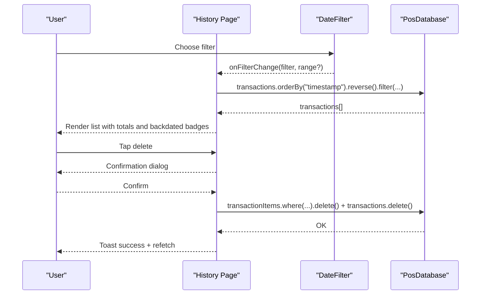

**Diagram sources**
- [src/routes/app/reports/history/index.tsx:25-100](file://src/routes/app/reports/history/index.tsx#L25-L100)
- [src/components/DateFilter.tsx:40-81](file://src/components/DateFilter.tsx#L40-L81)

**Section sources**
- [src/routes/app/reports/history/index.tsx:1-244](file://src/routes/app/reports/history/index.tsx#L1-L244)
- [src/components/DateFilter.tsx:1-237](file://src/components/DateFilter.tsx#L1-L237)

### Backdated Transactions
- Adds manual transactions in the past with:
  - Unique receipt number
  - Timestamp set to chosen date/time
  - Payment method selection
  - Status marked pending
  - Backdated flag enabled
- Integrates with transaction items for product detail.

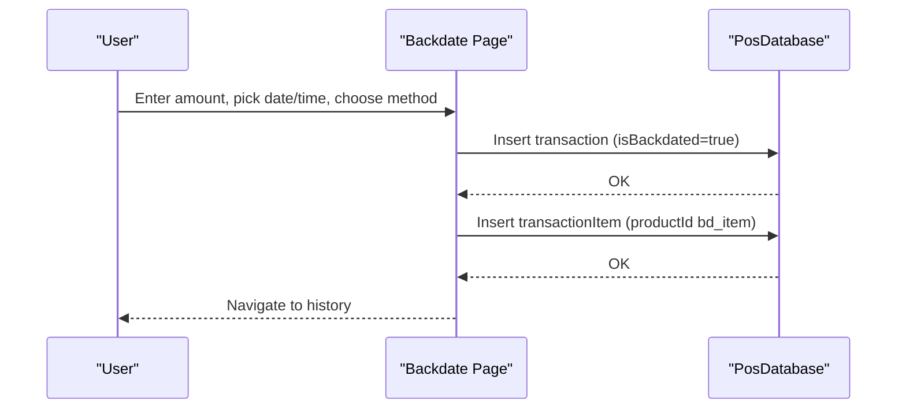

**Diagram sources**
- [src/routes/app/reports/history/backdate.tsx:20-68](file://src/routes/app/reports/history/backdate.tsx#L20-L68)
- [src/db/db.ts:82-98](file://src/db/db.ts#L82-L98)

**Section sources**
- [src/routes/app/reports/history/backdate.tsx:1-218](file://src/routes/app/reports/history/backdate.tsx#L1-L218)
- [src/db/db.ts:82-109](file://src/db/db.ts#L82-L109)

### Expenses Management
- Lists expenses with category, amount, date, and backdated indicator.
- Supports adding/editing expenses with category labels and auto-detection of backdated entries.
- Provides total expense computation and per-entry actions (edit/delete).

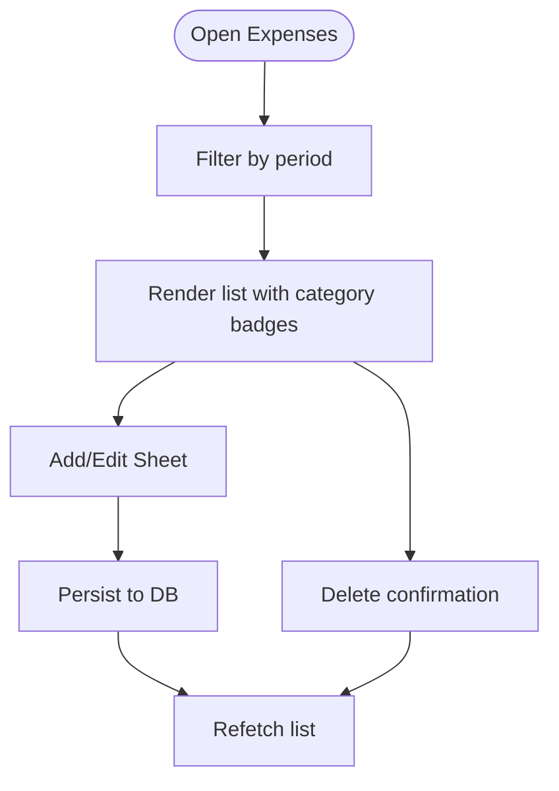

**Diagram sources**
- [src/routes/app/reports/expenses.tsx:40-160](file://src/routes/app/reports/expenses.tsx#L40-L160)
- [src/db/db.ts:130-137](file://src/db/db.ts#L130-L137)

**Section sources**
- [src/routes/app/reports/expenses.tsx:1-478](file://src/routes/app/reports/expenses.tsx#L1-L478)
- [src/db/db.ts:111-137](file://src/db/db.ts#L111-L137)

### Financial Charts
- Renders:
  - Trend line chart (Omset vs HPP)
  - Payment method doughnut chart
- Dynamically loads Chart.js and updates datasets when expanded.

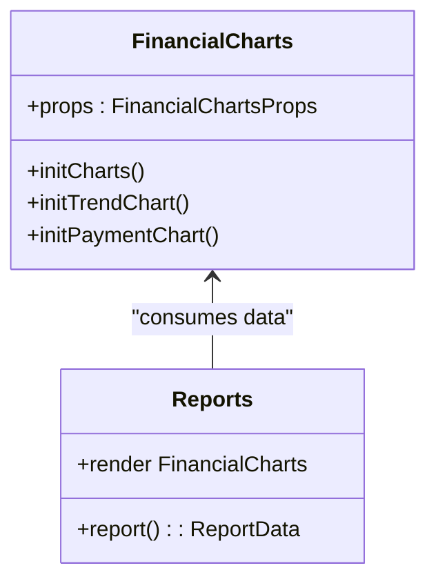

**Diagram sources**
- [src/components/FinancialCharts.tsx:30-33](file://src/components/FinancialCharts.tsx#L30-L33)
- [src/routes/app/reports/index.tsx:465-468](file://src/routes/app/reports/index.tsx#L465-L468)

**Section sources**
- [src/components/FinancialCharts.tsx:1-333](file://src/components/FinancialCharts.tsx#L1-L333)
- [src/routes/app/reports/index.tsx:465-468](file://src/routes/app/reports/index.tsx#L465-L468)

### Date Range Filtering
- Provides quick filters and a bottom sheet with calendar-driven custom range selection.
- Emits events to update active period and range across reporting views.

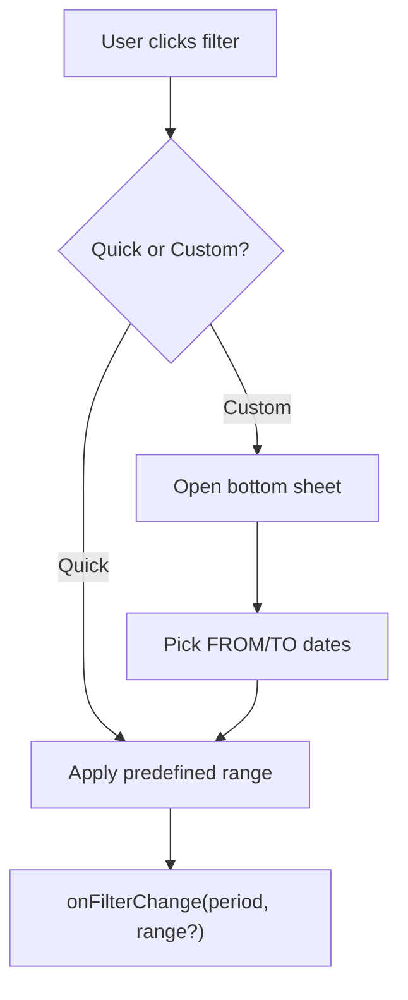

**Diagram sources**
- [src/components/DateFilter.tsx:40-81](file://src/components/DateFilter.tsx#L40-L81)
- [src/components/DateFilter.tsx:125-192](file://src/components/DateFilter.tsx#L125-L192)

**Section sources**
- [src/components/DateFilter.tsx:1-237](file://src/components/DateFilter.tsx#L1-L237)

### Export Functionality
- Excel export:
  - Summary sheet with financial metrics and counts
  - Transactions sheet with receipt number, timestamps, amounts, and backdated flags
  - Detail Products sheet linking items to receipts and variants
  - Expenses sheet with categorized entries
- PDF export:
  - Styled header with outlet branding
  - Summary table of financial metrics
  - Recent transactions table (top 100)
  - Product detail table
  - Expenses table (if present)
  - Automatic footer with print timestamp and page count

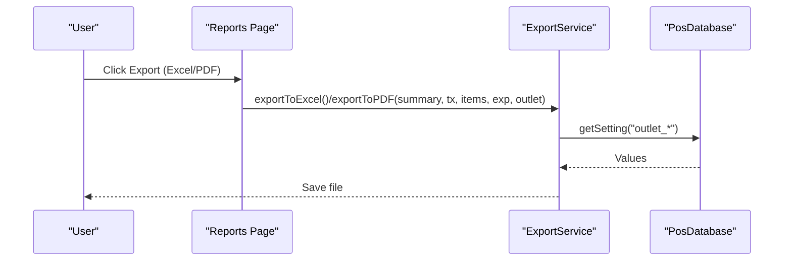

**Diagram sources**
- [src/routes/app/reports/index.tsx:56-209](file://src/routes/app/reports/index.tsx#L56-L209)
- [src/lib/exportService.ts:49-132](file://src/lib/exportService.ts#L49-L132)
- [src/lib/exportService.ts:137-291](file://src/lib/exportService.ts#L137-L291)
- [src/db/db.ts:502-509](file://src/db/db.ts#L502-L509)

**Section sources**
- [src/lib/exportService.ts:1-293](file://src/lib/exportService.ts#L1-L293)
- [src/routes/app/reports/index.tsx:56-209](file://src/routes/app/reports/index.tsx#L56-L209)

### Historical Data Management
- Backdated transactions:
  - Manual entry via backdate form with date/time picker and method selection
  - Stored with isBackdated flag and associated transaction item
- Audit and reconciliation:
  - Transaction history lists all entries with backdated badges
  - Expenses list includes backdated indicator
  - Export includes backdated flags for traceability

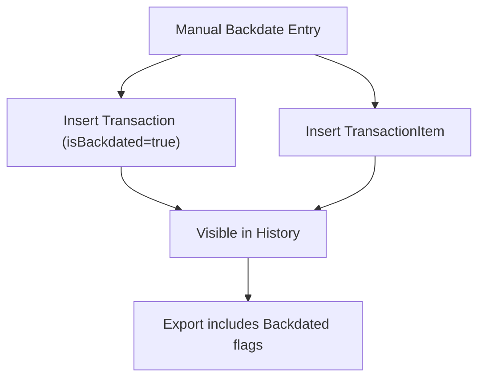

**Diagram sources**
- [src/routes/app/reports/history/backdate.tsx:20-68](file://src/routes/app/reports/history/backdate.tsx#L20-L68)
- [src/routes/app/reports/history/index.tsx:192-196](file://src/routes/app/reports/history/index.tsx#L192-L196)
- [src/routes/app/reports/expenses.tsx:120-132](file://src/routes/app/reports/expenses.tsx#L120-L132)
- [src/lib/exportService.ts:89-92](file://src/lib/exportService.ts#L89-L92)
- [src/lib/exportService.ts:124-125](file://src/lib/exportService.ts#L124-L125)

**Section sources**
- [src/routes/app/reports/history/backdate.tsx:1-218](file://src/routes/app/reports/history/backdate.tsx#L1-L218)
- [src/routes/app/reports/history/index.tsx:1-244](file://src/routes/app/reports/history/index.tsx#L1-L244)
- [src/routes/app/reports/expenses.tsx:1-478](file://src/routes/app/reports/expenses.tsx#L1-L478)
- [src/lib/exportService.ts:1-293](file://src/lib/exportService.ts#L1-L293)

### Profit and Loss Calculations
- Revenue tracking:
  - Net revenue from transactions’ totalAmount
  - Platform adjustment from difference between totalAmount and originalAmount
- Cost of goods sold:
  - COGS computed as sum of cogsTotal per transaction
- Profit metrics:
  - Gross profit = revenue − COGS
  - Net profit = gross profit − operating expenses
  - True profit = net profit (no double COGS deduction)
- Expense-to-revenue ratio:
  - Computed as total expenses / revenue (useful for comparative analysis)

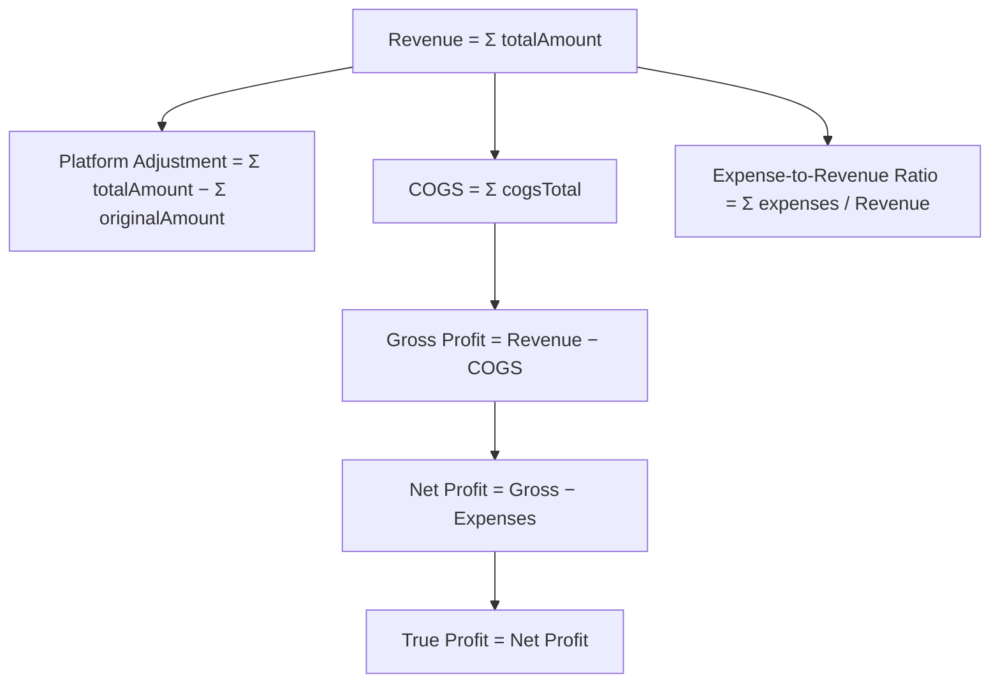

**Diagram sources**
- [src/routes/app/reports/index.tsx:285-297](file://src/routes/app/reports/index.tsx#L285-L297)
- [src/routes/app/reports/index.tsx:353-366](file://src/routes/app/reports/index.tsx#L353-L366)

**Section sources**
- [src/routes/app/reports/index.tsx:285-297](file://src/routes/app/reports/index.tsx#L285-L297)
- [src/routes/app/reports/index.tsx:353-366](file://src/routes/app/reports/index.tsx#L353-L366)

### Comparative Analysis and Trending
- Trend visualization:
  - Hourly bins for today, daily bins otherwise
  - Dual-series line chart for revenue and COGS
- Payment distribution:
  - Doughnut chart of payment methods
- Date range filters enable day-over-day and month-over-month comparisons.

**Section sources**
- [src/routes/app/reports/index.tsx:301-335](file://src/routes/app/reports/index.tsx#L301-L335)
- [src/components/FinancialCharts.tsx:124-232](file://src/components/FinancialCharts.tsx#L124-L232)
- [src/components/DateFilter.tsx:73-81](file://src/components/DateFilter.tsx#L73-L81)

### Practical Examples
- Generate a monthly PDF:
  - Select “This Month” filter → click “Export” → choose “PDF”
  - Review outlet branding, summary metrics, recent transactions, product detail, and expenses
- Compare two weeks:
  - Use “Custom” range to select a 7-day window, then compare trend lines and payment distributions
- Reconcile backdated entries:
  - Use “Input Past” to record a missed sale → verify in history and export with backdated flags

**Section sources**
- [src/routes/app/reports/index.tsx:56-209](file://src/routes/app/reports/index.tsx#L56-L209)
- [src/components/DateFilter.tsx:125-192](file://src/components/DateFilter.tsx#L125-L192)
- [src/routes/app/reports/history/backdate.tsx:20-68](file://src/routes/app/reports/history/backdate.tsx#L20-L68)

### Compliance and Tax Reporting
- Export includes:
  - Backdated flags for transactions and expenses
  - Full transaction metadata (timestamps, receipt numbers, amounts)
  - Categorized expenses with labels
- PDF footer records print timestamp and page count for audit trail.

**Section sources**
- [src/lib/exportService.ts:89-92](file://src/lib/exportService.ts#L89-L92)
- [src/lib/exportService.ts:124-125](file://src/lib/exportService.ts#L124-L125)
- [src/lib/exportService.ts:281-291](file://src/lib/exportService.ts#L281-L291)

## Dependency Analysis
- External libraries:
  - Chart.js for interactive charts
  - xlsx for Excel exports
  - jspdf + jspdf-autotable for PDF exports
  - dexie for client-side database
- Internal dependencies:
  - Reports depends on DateFilter, FinancialCharts, exportService, and db
  - History and Expenses depend on DateFilter and db
  - Backdate writes to db

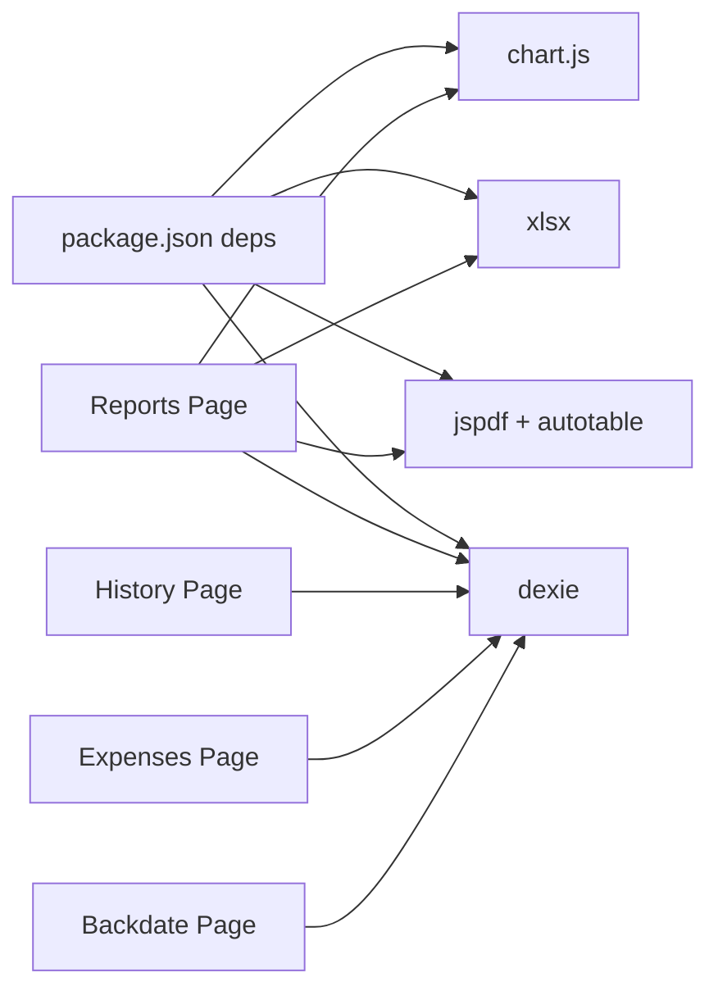

**Diagram sources**
- [package.json:11-39](file://package.json#L11-L39)
- [src/routes/app/reports/index.tsx:1-31](file://src/routes/app/reports/index.tsx#L1-L31)
- [src/lib/exportService.ts:1-11](file://src/lib/exportService.ts#L1-L11)
- [src/db/db.ts:1-4](file://src/db/db.ts#L1-L4)

**Section sources**
- [package.json:11-39](file://package.json#L11-L39)
- [src/routes/app/reports/index.tsx:1-31](file://src/routes/app/reports/index.tsx#L1-L31)
- [src/lib/exportService.ts:1-11](file://src/lib/exportService.ts#L1-L11)
- [src/db/db.ts:1-4](file://src/db/db.ts#L1-L4)

## Performance Considerations
- Data retrieval:
  - Reports fetch all transactions and expenses then filter by timestamp; consider pagination or indexed queries for very large datasets.
- Chart rendering:
  - Charts initialize lazily when expanded; defer heavy computations until needed.
- Export:
  - Excel export builds multiple sheets; large datasets may increase memory usage. Consider chunking or server-side export for massive volumes.

[No sources needed since this section provides general guidance]

## Troubleshooting Guide
- Export fails:
  - Verify network connectivity and that export dependencies are loaded.
  - Check toast notifications for error messages.
- Missing outlet branding in PDF:
  - Ensure outlet settings are configured; exportService falls back gracefully if values are missing.
- Deleting a transaction:
  - Confirm deletion; both transaction and items are removed; verify history refreshes.

**Section sources**
- [src/routes/app/reports/index.tsx:203-208](file://src/routes/app/reports/index.tsx#L203-L208)
- [src/routes/app/reports/history/index.tsx:83-100](file://src/routes/app/reports/history/index.tsx#L83-L100)
- [src/lib/exportService.ts:155-161](file://src/lib/exportService.ts#L155-L161)

## Conclusion
NgePos provides a comprehensive financial reporting suite with real-time analytics, interactive visualizations, robust export capabilities, and strong historical data handling. The modular design enables flexible date-range analysis, backdated entries, and compliance-ready exports suitable for internal review and basic tax reporting workflows.

[No sources needed since this section summarizes without analyzing specific files]

## Appendices

### Data Model Overview
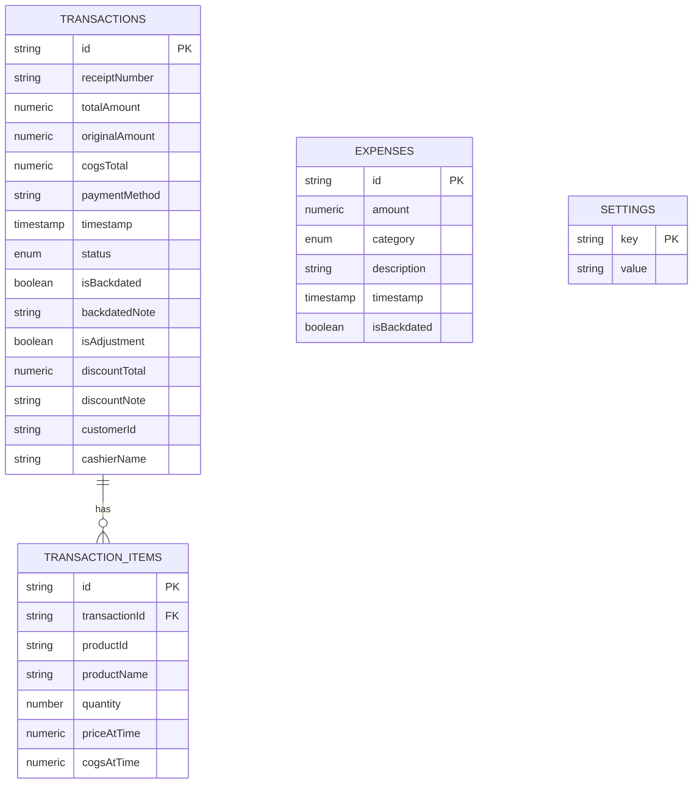

**Diagram sources**
- [src/db/db.ts:82-137](file://src/db/db.ts#L82-L137)

### Planned Enhancements (from PRD)
- Tax reporting and calculation
- Comparative reports (day-over-day, month-over-month)
- Automated report scheduling
- Accounting software integration

**Section sources**
- [PRD.txt:165-190](file://PRD.txt#L165-L190)