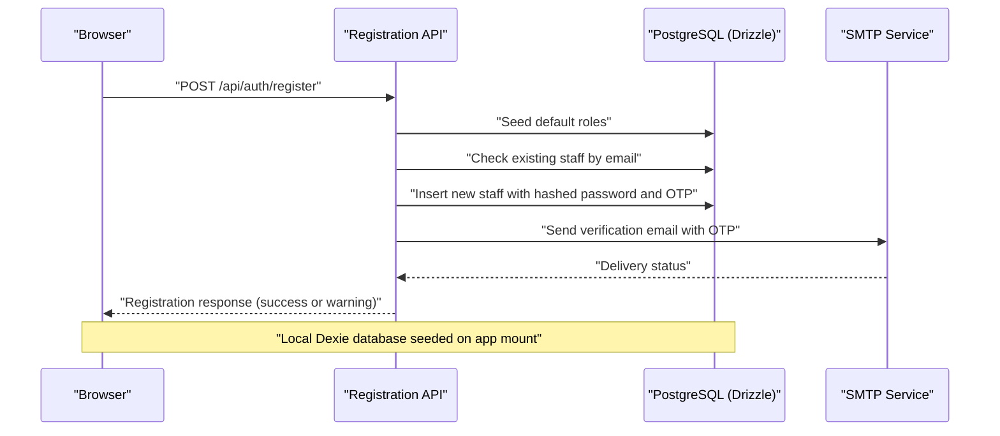

# Getting Started

<cite>
**Referenced Files in This Document**
- [package.json](file://package.json)
- [README.md](file://README.md)
- [vite.config.ts](file://vite.config.ts)
- [tsconfig.json](file://tsconfig.json)
- [drizzle.config.ts](file://drizzle.config.ts)
- [tailwind.config.cjs](file://tailwind.config.cjs)
- [postcss.config.cjs](file://postcss.config.cjs)
- [ui.config.json](file://ui.config.json)
- [src/server/db/index.ts](file://src/server/db/index.ts)
- [src/server/db/schema.ts](file://src/server/db/schema.ts)
- [src/server/db/seed.ts](file://src/server/db/seed.ts)
- [src/db/db.ts](file://src/db/db.ts)
- [src/app.tsx](file://src/app.tsx)
- [src/routes/api/auth/register.ts](file://src/routes/api/auth/register.ts)
- [src/entry-server.tsx](file://src/entry-server.tsx)
</cite>

## Update Summary
**Changes Made**
- Updated Vite configuration to use enhanced environment variable handling with loadEnv() function
- Modified start script to use Node.js server entry point (.output/server/index.mjs)
- Enhanced security practices with masked database connection logging and improved environment variable loading
- Updated server-side environment configuration with dotenv integration

## Table of Contents
1. [Introduction](#introduction)
2. [Prerequisites and System Requirements](#prerequisites-and-system-requirements)
3. [Installation and Setup](#installation-and-setup)
4. [Environment Configuration](#environment-configuration)
5. [First Run and Initial Setup](#first-run-and-initial-setup)
6. [Basic Usage Examples](#basic-usage-examples)
7. [Verification Steps](#verification-steps)
8. [Troubleshooting Guide](#troubleshooting-guide)
9. [Conclusion](#conclusion)

## Introduction
NgePos is a Point of Sale (POS) system built with modern web technologies. It combines a SolidJS frontend with a Node.js backend, PostgreSQL for persistent data, and Drizzle ORM for database operations. The system supports offline-first capabilities using IndexedDB via Dexie, while synchronizing with the central PostgreSQL database for reporting and administration.

**Updated** The project now uses Bun as the primary package manager, offering faster installation and development workflows compared to traditional npm. The Vite configuration has been enhanced with improved environment variable handling using loadEnv() function, and the server entry point has been updated to use Node.js server entry point for production deployment.

## Prerequisites and System Requirements
- Operating System: macOS, Linux, or Windows
- Node.js: Version 22 or higher (enforced by engines)
- Package Manager: Bun (primary), npm, pnpm, or yarn (any of these is supported)
- Database: PostgreSQL 12 or later
- Optional: A working email service for OTP verification during registration

Key indicators from the repository:
- Node.js engine requirement is set to version 22 or higher.
- The project uses SolidJS with Vite for development and building.
- PostgreSQL is configured as the primary database with Drizzle ORM.
- TypeScript is enabled with strict compiler options.
- Tailwind CSS is configured for styling.
- Bun is declared as the primary package manager in package.json.

**Section sources**
- [package.json:52-54](file://package.json#L52-L54)
- [README.md:15-24](file://README.md#L15-L24)
- [tsconfig.json:2-18](file://tsconfig.json#L2-L18)

## Installation and Setup
Follow these steps to install and set up the NgePos system locally:

1. **Clone the repository**
   - Clone the project to your local machine and navigate into the project directory.

2. **Install dependencies**
   - Use Bun as the primary package manager to install dependencies:
     - Bun: `bun install`
   - Alternative package managers are also supported:
     - npm: `npm install`
     - pnpm: `pnpm install`
     - yarn: `yarn install`

3. **Set up the database**
   - Ensure PostgreSQL is installed and running.
   - Create a database named `ngepos` (or configure a different name via environment variables).
   - Configure the connection string in `.env` using the `DATABASE_URL` variable. The default fallback is a local connection string.

4. **Run database migrations**
   - Apply schema changes using Drizzle Kit:
     - `bunx drizzle-kit push`
   - Alternatively, generate and run SQL migration files:
     - `bunx drizzle-kit generate`
     - Review and apply generated SQL scripts to your database.

5. **Build the frontend**
   - Build the SolidJS application for production:
     - `bun run build`

6. **Start the development server**
   - Launch the development server:
     - `bun run dev`

Notes:
- The project supports multiple package managers interchangeably, with Bun as the primary recommendation.
- The build process targets modern browsers and disables sourcemaps for certain dependencies to avoid warnings.
- Bun provides faster installation and development cycles compared to traditional npm.
- Vite configuration now includes enhanced environment variable handling for better security and development experience.
- **Updated** The start script now uses Node.js server entry point (.output/server/index.mjs) for production deployment.

**Section sources**
- [README.md:15-33](file://README.md#L15-L33)
- [package.json:5-10](file://package.json#L5-L10)
- [drizzle.config.ts:1-11](file://drizzle.config.ts#L1-L11)
- [vite.config.ts:1-29](file://vite.config.ts#L1-L29)

## Environment Configuration
Configure your development environment using the following files and settings:

- **Node.js and Package Manager**
  - Use Node.js 22+ and choose Bun as the primary package manager, with npm, pnpm, or yarn as alternatives.
  - Scripts for development, building, and previewing are defined in the package manifest.
  - **Updated** Start script now uses Node.js server entry point: `node .output/server/index.mjs`

- **TypeScript Configuration**
  - Compiler options enforce strictness and ESNext module resolution.
  - JSX is preserved for SolidJS with the appropriate import source.

- **Vite Configuration**
  - **Updated** Vite now uses enhanced environment variable handling with loadEnv() function:
    - `loadEnv(mode, process.cwd(), "")` for accessing environment variables
    - Improved SSR configuration with `ssr: false` for development
    - Nitro plugin preset detection with automatic platform detection
  - Server listens on all interfaces and exposes port 5173 by default.
  - Optimized dependencies are pre-bundled to improve cold start performance.
  - Build target is set to ES2020 with esbuild minification.

- **Server Entry Point**
  - **Updated** Server entry point uses Node.js server entry point: `.output/server/index.mjs`
  - Entry server configuration handles HTML rendering and asset management.

- **Database Connection**
  - **Updated** Enhanced environment variable loading with dotenv integration:
    - Immediate dotenv.config() call in database initialization
    - Multiple fallback sources for DATABASE_URL
    - Masked logging for security: `://****:****@` replacement
  - The backend connects to PostgreSQL using Drizzle ORM.
  - Connection string can be provided via environment variables or defaults to a local connection.

- **Security Enhancements**
  - **Updated** Environment variable loading improvements:
    - loadEnv() function for consistent environment access
    - Masked database connection strings in logs
    - Improved error handling for missing environment variables
  - JWT secret validation with explicit error messages
  - Encryption key handling with fallback mechanisms

- **Email Verification (Optional)**
  - Registration flow sends OTP emails; configure your SMTP settings accordingly.

**Section sources**
- [package.json:5-10](file://package.json#L5-L10)
- [tsconfig.json:2-18](file://tsconfig.json#L2-L18)
- [vite.config.ts:1-29](file://vite.config.ts#L1-L29)
- [src/entry-server.tsx:1-36](file://src/entry-server.tsx#L1-L36)
- [src/server/db/index.ts:1-27](file://src/server/db/index.ts#L1-L27)

## First Run and Initial Setup
Complete the initial setup to launch the application and seed essential data:

1. **Seed default roles**
   - Roles are seeded automatically during registration or can be seeded manually:
     - `bunx drizzle-kit seed`

2. **Start the development server**
   - Run the development server:
     - `bun run dev`
   - Open the application in your browser at the configured port.

3. **Register the first administrator**
   - Use the registration endpoint to create the initial admin account.
   - An OTP will be sent to the provided email address for verification.

4. **Verify and log in**
   - Complete email verification using the OTP.
   - Log in to the application with the registered credentials.

5. **Initial data seeding**
   - On first load, the frontend seeds local IndexedDB with categories and products.
   - Roles and permissions are synchronized with the backend.

**Diagram sources**
- [src/routes/api/auth/register.ts:1-59](file://src/routes/api/auth/register.ts#L1-L59)
- [src/server/db/seed.ts:1-41](file://src/server/db/seed.ts#L1-L41)
- [src/app.tsx:24-42](file://src/app.tsx#L24-L42)

**Section sources**
- [src/server/db/seed.ts:5-35](file://src/server/db/seed.ts#L5-L35)
- [src/routes/api/auth/register.ts:8-58](file://src/routes/api/auth/register.ts#L8-L58)
- [src/app.tsx:24-42](file://src/app.tsx#L24-L42)

## Basic Usage Examples
- **Development Workflow**
  - Start the development server with hot reloading:
    - `bun run dev`
  - Preview the production build:
    - `bun run preview`

- **Building for Production**
  - Generate optimized assets:
    - `bun run build`
  - Serve the built application:
    - `bun start` (uses Node.js server entry point)

- **Database Operations**
  - Push schema changes:
    - `bunx drizzle-kit push`
  - Generate migration files:
    - `bunx drizzle-kit generate`

- **Frontend Interactions**
  - The application initializes local IndexedDB on mount and seeds categories and products.
  - Authentication endpoints handle registration, login, and profile updates.

**Section sources**
- [README.md:15-33](file://README.md#L15-L33)
- [package.json:5-10](file://package.json#L5-L10)
- [drizzle.config.ts:1-11](file://drizzle.config.ts#L1-L11)
- [src/app.tsx:24-42](file://src/app.tsx#L24-L42)

## Verification Steps
Ensure the installation and configuration are correct:

- **Node.js Version**
  - Verify Node.js version meets the required minimum:
    - `node --version`

- **Dependencies Installation**
  - Confirm dependencies are installed without errors:
    - `bun install` (or equivalent)

- **Database Connectivity**
  - Test the database connection:
    - Ensure `DATABASE_URL` is set in `.env` or defaults are acceptable.
    - Run a simple query against the `roles` table to confirm connectivity.
    - **Updated** Check for masked database connection logs in console output.

- **Schema Synchronization**
  - Apply schema changes:
    - `bunx drizzle-kit push`
  - Verify tables exist in the database:
    - Check for tables defined in the schema file.

- **Frontend Build**
  - Build the application:
    - `bun run build`
  - Confirm build artifacts are generated.

- **Application Startup**
  - Start the development server:
    - `bun run dev`
  - Access the application in the browser and verify:
    - Local database seeding occurs on first load.
    - Registration and login flows work as expected.
  - **Updated** Verify environment variable loading:
    - Check that loadEnv() function properly loads environment variables.
    - Confirm JWT_SECRET validation during startup.

**Section sources**
- [package.json:52-54](file://package.json#L52-L54)
- [src/server/db/index.ts:1-27](file://src/server/db/index.ts#L1-L27)
- [src/server/db/schema.ts:1-157](file://src/server/db/schema.ts#L1-L157)
- [drizzle.config.ts:1-11](file://drizzle.config.ts#L1-L11)
- [vite.config.ts:1-29](file://vite.config.ts#L1-L29)

## Troubleshooting Guide
Common issues and resolutions:

- **Node.js Version Mismatch**
  - Symptom: Installation or build fails due to engine requirements.
  - Resolution: Upgrade to Node.js 22 or later.

- **Missing DATABASE_URL**
  - Symptom: Database connection errors during startup.
  - Resolution: Set `DATABASE_URL` in `.env` or rely on the default local fallback.
  - **Updated** Check for masked connection string logs indicating successful loading.

- **PostgreSQL Not Running**
  - Symptom: Cannot connect to the database.
  - Resolution: Start PostgreSQL and ensure the database exists.

- **Build Warnings with Sourcemaps**
  - Symptom: Warnings related to sourcemaps for specific libraries.
  - Resolution: The build configuration disables sourcemaps to avoid warnings.

- **Registration Email Issues**
  - Symptom: Registration completes but email delivery fails.
  - Resolution: Configure SMTP settings for the mail utility used by the application.

- **Vite Port Conflicts**
  - Symptom: Development server fails to start due to port binding.
  - Resolution: Change the Vite server port in the configuration if needed.

- **TypeScript Strict Mode Errors**
  - Symptom: Compilation errors due to strict compiler options.
  - Resolution: Adjust code to meet strict type checking requirements.

- **Bun Installation Issues**
  - Symptom: Bun package manager not found or failing to execute commands.
  - Resolution: Install Bun globally using the official installer, then retry commands.

- **Environment Variable Loading Issues**
  - Symptom: Application cannot access environment variables at runtime.
  - Resolution: **Updated** Check that loadEnv() function is properly called in Vite config and dotenv.config() is executed in server database initialization.

- **Database Connection Masking**
  - Symptom: Database logs show unmasked connection strings.
  - Resolution: **Updated** The database connection logs automatically mask sensitive information using `://****:****@` replacement pattern.

- **JWT Secret Validation Errors**
  - Symptom: Application fails to start with JWT_SECRET error.
  - Resolution: **Updated** Ensure JWT_SECRET environment variable is set in `.env` file with sufficient length.

- **Server Entry Point Issues**
  - Symptom: Production build fails to start with server entry point error.
  - Resolution: **Updated** Verify that `.output/server/index.mjs` exists after build completion.

**Section sources**
- [package.json:52-54](file://package.json#L52-L54)
- [src/server/db/index.ts:12-19](file://src/server/db/index.ts#L12-L19)
- [vite.config.ts:15-24](file://vite.config.ts#L15-L24)
- [tsconfig.json:12-14](file://tsconfig.json#L12-L14)

## Conclusion
You have successfully installed and configured the NgePos POS system using Bun as the primary package manager. The enhanced Vite configuration provides improved environment variable handling with loadEnv() function and better development experience. The updated server entry point uses Node.js server entry point for production deployment, and enhanced security practices include masked database connection logging and improved environment variable loading.

You can now develop, build, and run the application locally, manage the database with Drizzle ORM, and use the frontend with SolidJS and Vite. The migration to Bun, enhanced configuration with loadEnv() function, and improved security practices provide improved performance and developer experience. For further customization, explore the schema definitions, UI components, and routing structure.