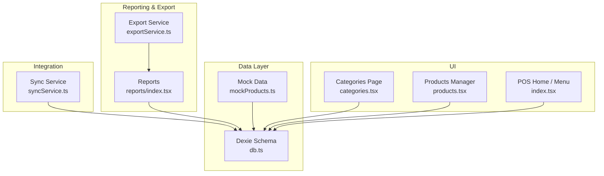
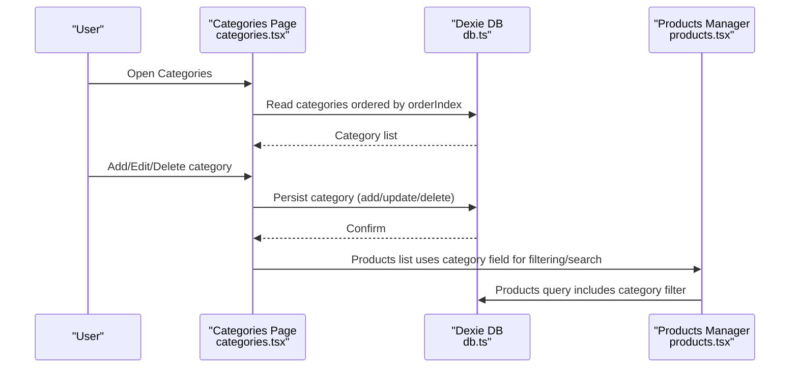
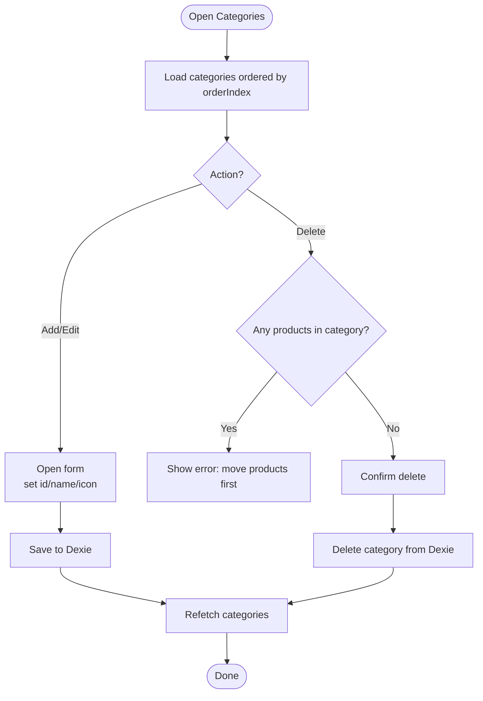
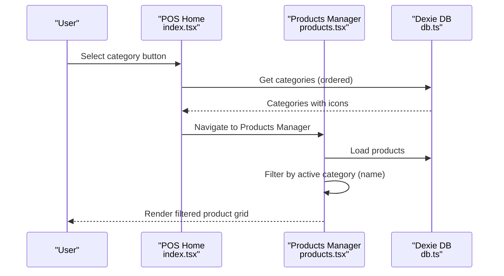
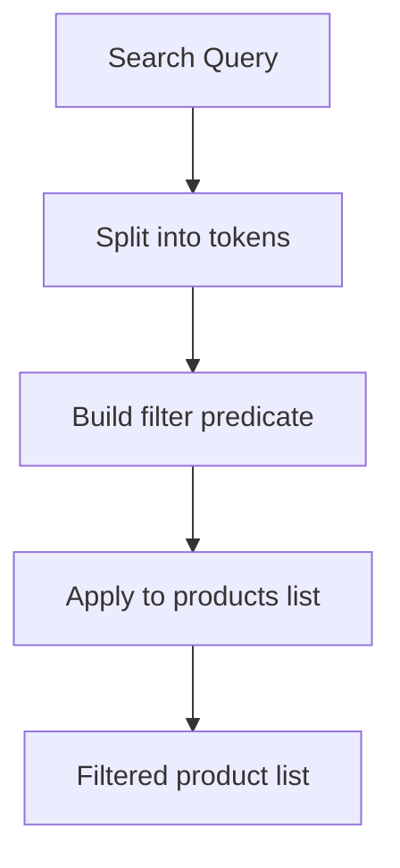
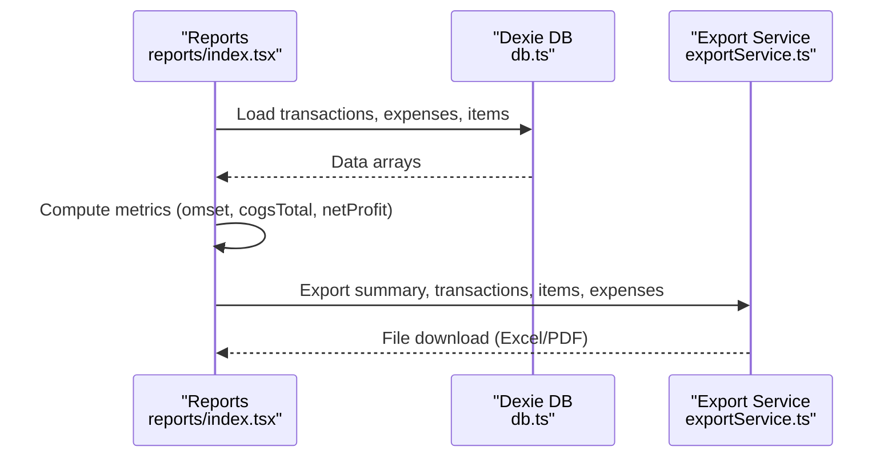
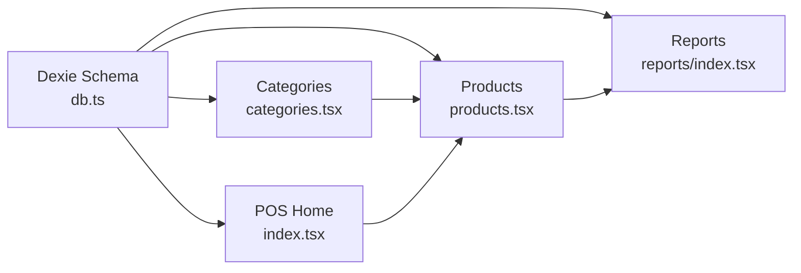

# Categories & Organization

<cite>
**Referenced Files in This Document**
- [categories.tsx](file://src/routes/app/inventory/categories.tsx)
- [products.tsx](file://src/routes/app/inventory/products.tsx)
- [index.tsx](file://src/routes/app/index.tsx)
- [db.ts](file://src/db/db.ts)
- [mockProducts.ts](file://src/data/mockProducts.ts)
- [reports/index.tsx](file://src/routes/app/reports/index.tsx)
- [exportService.ts](file://src/lib/exportService.ts)
- [syncService.ts](file://src/lib/syncService.ts)
</cite>

## Table of Contents
1. [Introduction](#introduction)
2. [Project Structure](#project-structure)
3. [Core Components](#core-components)
4. [Architecture Overview](#architecture-overview)
5. [Detailed Component Analysis](#detailed-component-analysis)
6. [Dependency Analysis](#dependency-analysis)
7. [Performance Considerations](#performance-considerations)
8. [Troubleshooting Guide](#troubleshooting-guide)
9. [Conclusion](#conclusion)
10. [Appendices](#appendices)

## Introduction
This document explains the categories and organization system in NgePos POS. It covers how categories are created, modified, and deleted; how category hierarchy and parent-child relationships are modeled; how categories are assigned to products; how category-based filtering and search work; and how categories integrate with reporting and promotions. It also documents visibility controls, sorting preferences, display customization, and practical examples for different business models.

## Project Structure
The categories and organization system spans UI components, database schema, and reporting logic:
- Category management UI: src/routes/app/inventory/categories.tsx
- Product catalog UI and category assignment: src/routes/app/inventory/products.tsx
- Category navigation and filtering in the main POS screen: src/routes/app/index.tsx
- Database schema and typed models: src/db/db.ts
- Sample categories and products: src/data/mockProducts.ts
- Reporting and export: src/routes/app/reports/index.tsx and src/lib/exportService.ts
- Local sync service for transactions and expenses: src/lib/syncService.ts

**Diagram sources**
- [categories.tsx:16-260](file://src/routes/app/inventory/categories.tsx#L16-L260)
- [products.tsx:92-800](file://src/routes/app/inventory/products.tsx#L92-L800)
- [index.tsx:143-176](file://src/routes/app/index.tsx#L143-L176)
- [db.ts:270-498](file://src/db/db.ts#L270-L498)
- [mockProducts.ts:1-85](file://src/data/mockProducts.ts#L1-L85)
- [reports/index.tsx:49-370](file://src/routes/app/reports/index.tsx#L49-L370)
- [exportService.ts:45-293](file://src/lib/exportService.ts#L45-L293)
- [syncService.ts:4-57](file://src/lib/syncService.ts#L4-L57)

**Section sources**
- [categories.tsx:16-260](file://src/routes/app/inventory/categories.tsx#L16-L260)
- [products.tsx:92-800](file://src/routes/app/inventory/products.tsx#L92-L800)
- [index.tsx:143-176](file://src/routes/app/index.tsx#L143-L176)
- [db.ts:270-498](file://src/db/db.ts#L270-L498)
- [mockProducts.ts:1-85](file://src/data/mockProducts.ts#L1-L85)
- [reports/index.tsx:49-370](file://src/routes/app/reports/index.tsx#L49-L370)
- [exportService.ts:45-293](file://src/lib/exportService.ts#L45-L293)
- [syncService.ts:4-57](file://src/lib/syncService.ts#L4-L57)

## Core Components
- Category entity and ordering: Categories are stored with id, name, orderIndex, and optional icon. They are retrieved sorted by orderIndex.
- Product-category relationship: Products include a category field (string) that links to a category name. Filtering/searching includes category matching.
- Category management UI: Provides add/edit forms, icon selection, and deletion with safety checks.
- POS home navigation: Horizontal category bar enables quick switching between categories and “All”.
- Reporting and export: Reports aggregate financial metrics; export supports Excel and PDF formats.

**Section sources**
- [db.ts:75-80](file://src/db/db.ts#L75-L80)
- [db.ts:62-73](file://src/db/db.ts#L62-L73)
- [categories.tsx:18-20](file://src/routes/app/inventory/categories.tsx#L18-L20)
- [products.tsx:156-166](file://src/routes/app/inventory/products.tsx#L156-L166)
- [index.tsx:143-176](file://src/routes/app/index.tsx#L143-L176)
- [reports/index.tsx:211-370](file://src/routes/app/reports/index.tsx#L211-L370)
- [exportService.ts:49-132](file://src/lib/exportService.ts#L49-L132)

## Architecture Overview
The category system integrates UI, local storage via Dexie, and reporting. Categories drive menu layout and filtering, while product-category assignments enable targeted promotions and reporting.

**Diagram sources**
- [categories.tsx:18-89](file://src/routes/app/inventory/categories.tsx#L18-L89)
- [db.ts:270-498](file://src/db/db.ts#L270-L498)
- [products.tsx:94-111](file://src/routes/app/inventory/products.tsx#L94-L111)
- [products.tsx:156-166](file://src/routes/app/inventory/products.tsx#L156-L166)

## Detailed Component Analysis

### Category Management UI
- Sorting and ordering: Categories are fetched sorted by orderIndex and displayed accordingly.
- Add/Edit form: Supports setting id, name, and icon; saving persists to Dexie.
- Deletion safety: Prevents deleting categories that still have products assigned; prompts user to move products first.
- UI pattern: Matches product list layout for consistency.

**Diagram sources**
- [categories.tsx:18-89](file://src/routes/app/inventory/categories.tsx#L18-L89)
- [db.ts:270-498](file://src/db/db.ts#L270-L498)

**Section sources**
- [categories.tsx:16-260](file://src/routes/app/inventory/categories.tsx#L16-L260)
- [db.ts:75-80](file://src/db/db.ts#L75-L80)

### Product-Categories Integration
- Category assignment: Products include a category field (string) used for filtering and display.
- Filtering and search: Products list filters by product name and category name.
- POS menu: Category buttons in the main screen allow quick switching to a category view.

**Diagram sources**
- [index.tsx:143-176](file://src/routes/app/index.tsx#L143-L176)
- [products.tsx:94-111](file://src/routes/app/inventory/products.tsx#L94-L111)
- [products.tsx:156-166](file://src/routes/app/inventory/products.tsx#L156-L166)
- [db.ts:270-498](file://src/db/db.ts#L270-L498)

**Section sources**
- [products.tsx:125-128](file://src/routes/app/inventory/products.tsx#L125-L128)
- [products.tsx:156-166](file://src/routes/app/inventory/products.tsx#L156-L166)
- [index.tsx:143-176](file://src/routes/app/index.tsx#L143-L176)

### Category Hierarchy and Parent-Child Relationships
- Current model: Categories are flat with orderIndex and optional icon. There is no explicit parent categoryId field.
- Implication: No built-in hierarchical navigation or tree view. Category ordering is linear and managed via orderIndex.

**Section sources**
- [db.ts:75-80](file://src/db/db.ts#L75-L80)
- [categories.tsx:55-60](file://src/routes/app/inventory/categories.tsx#L55-L60)

### Category-Based Filtering, Search, and Display
- Filtering: Products are filtered by searchQuery against name and category fields.
- Display: Category bar in POS home shows all categories with icons; selecting a category filters the product grid.
- Visibility: Products include an isActive flag; inactive products are hidden from POS screens.

**Diagram sources**
- [products.tsx:156-166](file://src/routes/app/inventory/products.tsx#L156-L166)
- [index.tsx:143-176](file://src/routes/app/index.tsx#L143-L176)

**Section sources**
- [products.tsx:156-166](file://src/routes/app/inventory/products.tsx#L156-L166)
- [index.tsx:143-176](file://src/routes/app/index.tsx#L143-L176)
- [db.ts:62-73](file://src/db/db.ts#L62-L73)

### Reporting and Category Analytics
- Reporting aggregates financial metrics from transactions and expenses.
- Category analytics are not computed automatically; however, category names appear in product records and transaction items, enabling downstream analysis and export.
- Export supports Excel and PDF with transaction and item details suitable for category-level analysis.

**Diagram sources**
- [reports/index.tsx:211-370](file://src/routes/app/reports/index.tsx#L211-L370)
- [exportService.ts:49-132](file://src/lib/exportService.ts#L49-L132)
- [exportService.ts:137-291](file://src/lib/exportService.ts#L137-L291)

**Section sources**
- [reports/index.tsx:211-370](file://src/routes/app/reports/index.tsx#L211-L370)
- [exportService.ts:49-132](file://src/lib/exportService.ts#L49-L132)
- [exportService.ts:137-291](file://src/lib/exportService.ts#L137-L291)

### Promotions and Category-Specific Campaigns
- Campaigns support category targeting via product selection and requirement/target configurations.
- Profitability analysis considers revenue, COGS, and discount impact for chosen products.

**Section sources**
- [products.tsx:108-158](file://src/routes/app/inventory/products.tsx#L108-L158)

### Import/Export and External Integrations
- Local sync: Transactions and expenses can be synced to an external API endpoint with a debounced trigger.
- Reporting export: Excel and PDF exports include transaction and item details for category-level analysis.

**Section sources**
- [syncService.ts:4-57](file://src/lib/syncService.ts#L4-L57)
- [exportService.ts:49-132](file://src/lib/exportService.ts#L49-L132)
- [exportService.ts:137-291](file://src/lib/exportService.ts#L137-L291)

## Dependency Analysis
- Category entity depends on Dexie schema; retrieval uses orderBy("orderIndex").
- Product entity depends on category name for filtering and display.
- POS home depends on categories for rendering the horizontal category bar.
- Reports depend on transactions and items; category names propagate through product records.

**Diagram sources**
- [db.ts:270-498](file://src/db/db.ts#L270-L498)
- [categories.tsx:18-20](file://src/routes/app/inventory/categories.tsx#L18-L20)
- [products.tsx:94-111](file://src/routes/app/inventory/products.tsx#L94-L111)
- [index.tsx:143-176](file://src/routes/app/index.tsx#L143-L176)
- [reports/index.tsx:211-370](file://src/routes/app/reports/index.tsx#L211-L370)

**Section sources**
- [db.ts:270-498](file://src/db/db.ts#L270-L498)
- [categories.tsx:18-20](file://src/routes/app/inventory/categories.tsx#L18-L20)
- [products.tsx:94-111](file://src/routes/app/inventory/products.tsx#L94-L111)
- [index.tsx:143-176](file://src/routes/app/index.tsx#L143-L176)
- [reports/index.tsx:211-370](file://src/routes/app/reports/index.tsx#L211-L370)

## Performance Considerations
- Category retrieval: Sorting by orderIndex is efficient for small to medium lists; consider indexing improvements if category counts grow significantly.
- Product filtering: Filtering by name and category is O(n); ensure reasonable product counts or add indexed fields if needed.
- Reporting: Aggregations iterate over transactions and items; cache results or paginate for large datasets.

## Troubleshooting Guide
- Cannot delete category: If a category still has products assigned, the system prevents deletion and instructs moving products first.
- Category order not updating: Ensure orderIndex is correctly maintained when adding or reordering categories.
- Category not visible in POS: Verify product isActive flag and that category name matches the product’s category field.

**Section sources**
- [categories.tsx:68-76](file://src/routes/app/inventory/categories.tsx#L68-L76)
- [products.tsx:125-128](file://src/routes/app/inventory/products.tsx#L125-L128)
- [db.ts:62-73](file://src/db/db.ts#L62-L73)

## Conclusion
NgePos POS implements a straightforward, flat category system centered on orderIndex and category name. Categories drive menu layouts, filtering, and reporting. While hierarchical relationships are not currently supported, the system provides robust category management, visibility controls, and export capabilities suitable for most food/beverage business models.

## Appendices

### Practical Examples and Best Practices
- Coffee shop: Use categories like “Coffee”, “Non-Coffee”, “Food”, “Pastries”. Assign products accordingly; promote “Coffee” items during morning rush.
- Fast casual: Use “Burgers”, “Sides”, “Drinks”, “Desserts”; apply combo campaigns to cross-sell sides with burgers.
- Naming conventions:
  - Keep names short and consistent (e.g., “Cold Brew”, “Croissant”).
  - Avoid special characters; stick to ASCII letters and spaces.
  - Use pluralization consistently (“Foods” vs. “Food”) to prevent mismatches.
- Best practices:
  - Maintain a clean category list; remove unused categories.
  - Use icons to visually distinguish categories in POS.
  - Keep orderIndex aligned with customer journey (e.g., “Drinks” before “Food”).
  - Regularly review product isActive flags to keep POS accurate.

### Category Setup Patterns
- Minimal setup: Start with broad categories (e.g., “Hot Drinks”, “Cold Drinks”, “Food”), then refine as catalog grows.
- Seasonal categories: Create temporary categories for seasonal items and archive them afterward.
- Cross-category promotions: Use campaign targeting to combine items across categories (e.g., “Buy Coffee, Get Pastry Free”).