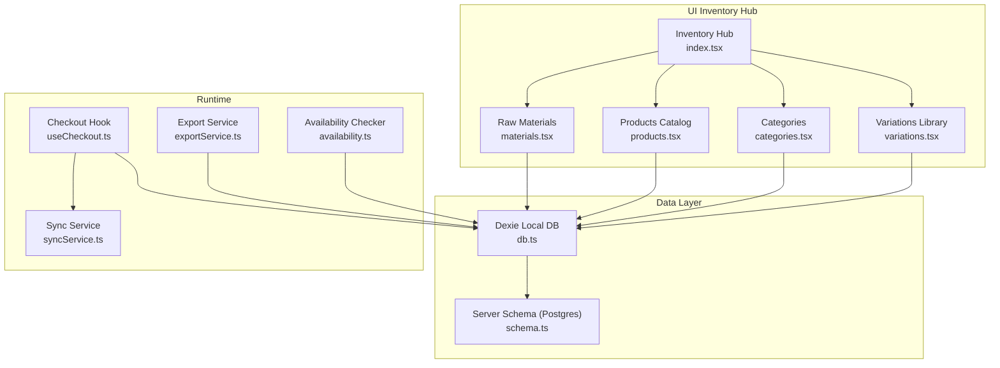
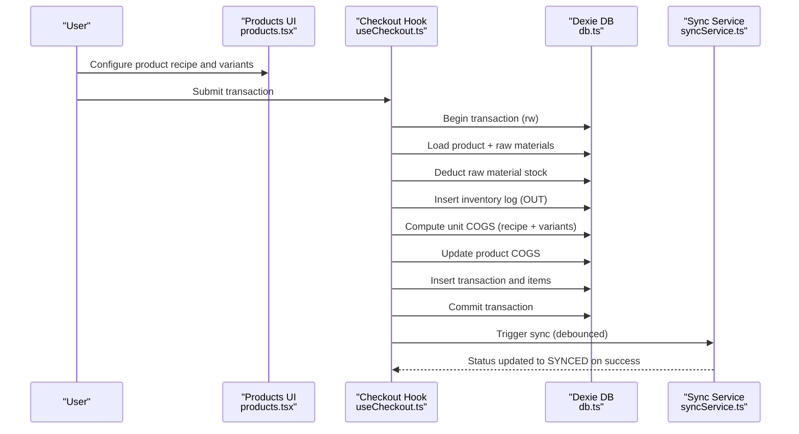
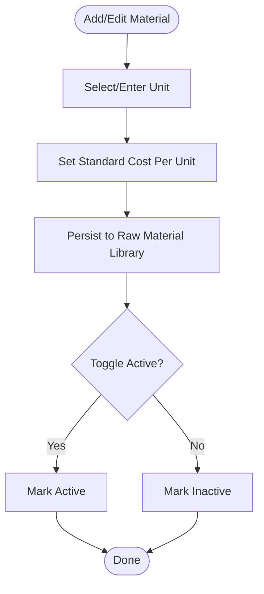
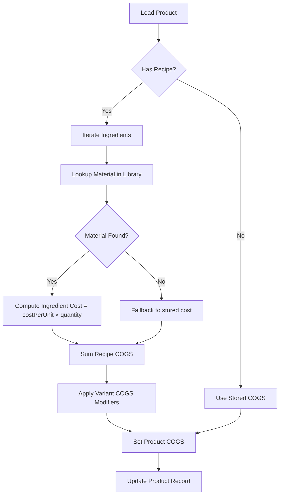
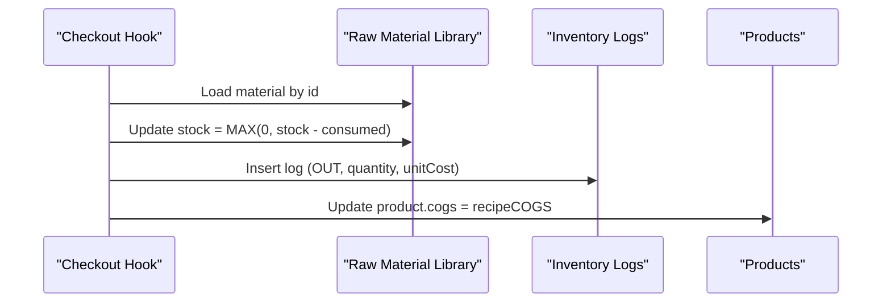
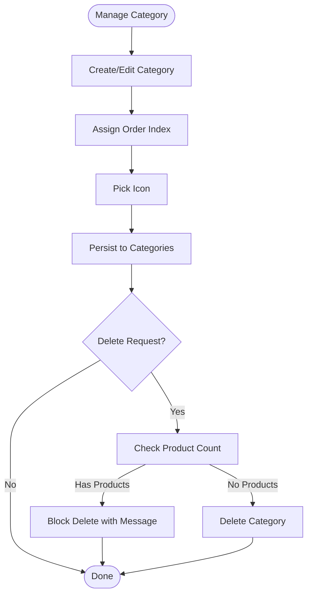
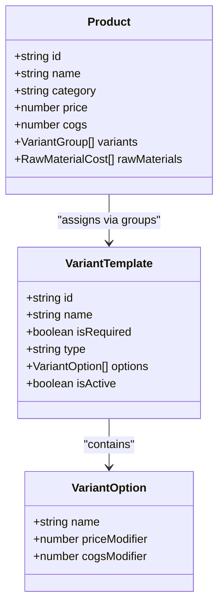
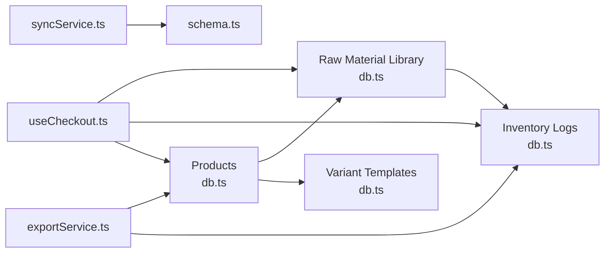

# Inventory Management

<cite>
**Referenced Files in This Document**
- [index.tsx](file://src/routes/app/inventory/index.tsx)
- [materials.tsx](file://src/routes/app/inventory/materials.tsx)
- [products.tsx](file://src/routes/app/inventory/products.tsx)
- [categories.tsx](file://src/routes/app/inventory/categories.tsx)
- [variations.tsx](file://src/routes/app/inventory/variations.tsx)
- [db.ts](file://src/db/db.ts)
- [schema.ts](file://src/server/db/schema.ts)
- [useCheckout.ts](file://src/hooks/useCheckout.ts)
- [availability.ts](file://src/lib/availability.ts)
- [syncService.ts](file://src/lib/syncService.ts)
- [exportService.ts](file://src/lib/exportService.ts)
- [index.tsx](file://src/routes/app/reports/index.tsx)
- [PRD.txt](file://PRD.txt)
- [ROADMAP.md](file://ROADMAP.md)
</cite>

## Table of Contents
1. [Introduction](#introduction)
2. [Project Structure](#project-structure)
3. [Core Components](#core-components)
4. [Architecture Overview](#architecture-overview)
5. [Detailed Component Analysis](#detailed-component-analysis)
6. [Dependency Analysis](#dependency-analysis)
7. [Performance Considerations](#performance-considerations)
8. [Troubleshooting Guide](#troubleshooting-guide)
9. [Conclusion](#conclusion)
10. [Appendices](#appendices)

## Introduction
This document describes the inventory management capabilities implemented in the NgePos POS system. It covers the raw materials system (material library, stock level tracking, cost calculation, and inventory logs), recipe management for product configuration, COGS calculation, margin analytics, and automated stock deduction at checkout. It also documents category management, product variations, and supplier integration plans, along with inventory alerts, reorder point management, and stock valuation methods. Practical examples of inventory operations, batch processing, and integration with accounting systems are included, alongside strategies for inventory accuracy, cycle counting, and loss prevention.

## Project Structure
NgePos organizes inventory under a dedicated hub with four primary screens:
- Raw materials library
- Product catalog with recipes and variants
- Category management
- Variations library

These screens integrate with local IndexedDB (via Dexie) for offline-first operations and synchronize with a backend (PostgreSQL via Drizzle ORM) when connectivity is available.

**Diagram sources**
- [index.tsx:13-46](file://src/routes/app/inventory/index.tsx#L13-L46)
- [materials.tsx:1-337](file://src/routes/app/inventory/materials.tsx#L1-L337)
- [products.tsx:92-800](file://src/routes/app/inventory/products.tsx#L92-L800)
- [categories.tsx:16-261](file://src/routes/app/inventory/categories.tsx#L16-L261)
- [variations.tsx:9-307](file://src/routes/app/inventory/variations.tsx#L9-L307)
- [db.ts:270-496](file://src/db/db.ts#L270-L496)
- [schema.ts:74-133](file://src/server/db/schema.ts#L74-L133)
- [useCheckout.ts:38-217](file://src/hooks/useCheckout.ts#L38-L217)
- [availability.ts:12-39](file://src/lib/availability.ts#L12-L39)
- [syncService.ts:4-58](file://src/lib/syncService.ts#L4-L58)
- [exportService.ts:45-292](file://src/lib/exportService.ts#L45-L292)

**Section sources**
- [index.tsx:13-46](file://src/routes/app/inventory/index.tsx#L13-L46)
- [db.ts:270-496](file://src/db/db.ts#L270-L496)

## Core Components
- Raw Material Library: Stores material metadata, unit, stock, and cost per unit. Supports activation toggles and basic CRUD operations.
- Product Catalog: Defines products with price, category, optional stock, and recipe composition. Recipes link to raw materials with quantities and computed costs.
- Categories: Organizes products with ordering and icons.
- Variations: Global templates for product variants (single or multiple selection, required or optional) with price and COGS modifiers.
- Inventory Logs: Tracks stock movements (IN, OUT, ADJUSTMENT) with timestamps and unit costs.
- Checkout Engine: Deducts stock automatically at transaction time, updates product COGS, and logs inventory events.
- Availability Checker: Validates whether a product can be sold based on product and ingredient availability.
- Sync Service: Pushes pending transactions and expenses to the backend and marks them synced.
- Export Service: Generates financial reports including HPP and COGS metrics suitable for accounting reconciliation.

**Section sources**
- [materials.tsx:14-337](file://src/routes/app/inventory/materials.tsx#L14-L337)
- [products.tsx:92-800](file://src/routes/app/inventory/products.tsx#L92-L800)
- [categories.tsx:16-261](file://src/routes/app/inventory/categories.tsx#L16-L261)
- [variations.tsx:9-307](file://src/routes/app/inventory/variations.tsx#L9-L307)
- [db.ts:16-34](file://src/db/db.ts#L16-L34)
- [useCheckout.ts:56-128](file://src/hooks/useCheckout.ts#L56-L128)
- [availability.ts:12-39](file://src/lib/availability.ts#L12-L39)
- [syncService.ts:4-58](file://src/lib/syncService.ts#L4-L58)
- [exportService.ts:45-292](file://src/lib/exportService.ts#L45-L292)

## Architecture Overview
The inventory architecture combines a local IndexedDB layer for offline operations and a server-side PostgreSQL schema for synchronization and reporting. The checkout process performs atomic updates to products, raw materials, and inventory logs, ensuring COGS accuracy and stock integrity.

**Diagram sources**
- [useCheckout.ts:56-172](file://src/hooks/useCheckout.ts#L56-L172)
- [db.ts:270-496](file://src/db/db.ts#L270-L496)
- [syncService.ts:50-58](file://src/lib/syncService.ts#L50-L58)

**Section sources**
- [useCheckout.ts:56-172](file://src/hooks/useCheckout.ts#L56-L172)
- [db.ts:270-496](file://src/db/db.ts#L270-L496)
- [schema.ts:74-133](file://src/server/db/schema.ts#L74-L133)

## Detailed Component Analysis

### Raw Materials System
- Material Library Management
  - Create, edit, activate/deactivate materials.
  - Define unit of measure and standard cost per unit.
  - Supports common units and custom units.
- Stock Level Tracking
  - Each material maintains a current stock value.
  - Stock is reduced during checkout based on recipe quantities.
- Cost Calculation
  - Cost per unit is used to compute recipe-based COGS.
  - Fallback cost is used if a material is missing during checkout.
- Inventory Logs
  - Every outbound movement creates an inventory log entry with type OUT, quantity, and unit cost.

**Diagram sources**
- [materials.tsx:14-337](file://src/routes/app/inventory/materials.tsx#L14-L337)
- [db.ts:16-24](file://src/db/db.ts#L16-L24)

**Section sources**
- [materials.tsx:14-337](file://src/routes/app/inventory/materials.tsx#L14-L337)
- [db.ts:16-24](file://src/db/db.ts#L16-L24)

### Recipe Management and COGS
- Product Recipe Composition
  - Products reference raw materials with required quantities.
  - Materials can be synced from the library; missing materials are auto-registered.
- Dynamic COGS Calculation
  - At checkout, recipe COGS is computed from material cost per unit × quantity.
  - Variants can contribute additional COGS modifiers.
  - Product COGS is updated to reflect the latest calculation.
- Margin Analytics
  - Margin percentage is calculated from price and COGS.
  - Margin status labels indicate critical, thin, healthy, or optimal margins.

**Diagram sources**
- [products.tsx:452-531](file://src/routes/app/inventory/products.tsx#L452-L531)
- [useCheckout.ts:69-99](file://src/hooks/useCheckout.ts#L69-L99)

**Section sources**
- [products.tsx:55-89](file://src/routes/app/inventory/products.tsx#L55-L89)
- [products.tsx:305-409](file://src/routes/app/inventory/products.tsx#L305-L409)
- [products.tsx:452-531](file://src/routes/app/inventory/products.tsx#L452-L531)
- [useCheckout.ts:69-99](file://src/hooks/useCheckout.ts#L69-L99)

### Automated Stock Deduction at Checkout
- During checkout, the system:
  - Reduces raw material stock by consumed quantity (recipe quantity × sold quantity).
  - Inserts an inventory log entry with type OUT, quantity, and unit cost.
  - Updates product COGS to the computed recipe COGS.
  - Optionally updates product stock (per roadmap, product-level stock is currently zeroed out in favor of material-level tracking).

**Diagram sources**
- [useCheckout.ts:73-99](file://src/hooks/useCheckout.ts#L73-L99)
- [db.ts:26-34](file://src/db/db.ts#L26-L34)

**Section sources**
- [useCheckout.ts:56-128](file://src/hooks/useCheckout.ts#L56-L128)

### Category Management
- Categories define product grouping with ordering and emoji icons.
- Deletion is prevented if any product belongs to the category.

**Diagram sources**
- [categories.tsx:16-261](file://src/routes/app/inventory/categories.tsx#L16-L261)

**Section sources**
- [categories.tsx:16-261](file://src/routes/app/inventory/categories.tsx#L16-L261)

### Product Variations and Modifier Groups
- Variations are defined globally as templates with:
  - Group name and selection rules (single or multiple).
  - Required flag.
  - Options with price and COGS modifiers.
- Products can reuse templates and override modifiers per option.
- Ingredient adjustments per variant option enable granular COGS control.

**Diagram sources**
- [db.ts:52-60](file://src/db/db.ts#L52-L60)
- [db.ts:36-49](file://src/db/db.ts#L36-L49)
- [db.ts:62-73](file://src/db/db.ts#L62-L73)
- [variations.tsx:9-307](file://src/routes/app/inventory/variations.tsx#L9-L307)
- [products.tsx:475-531](file://src/routes/app/inventory/products.tsx#L475-L531)

**Section sources**
- [variations.tsx:9-307](file://src/routes/app/inventory/variations.tsx#L9-L307)
- [products.tsx:475-531](file://src/routes/app/inventory/products.tsx#L475-L531)

### Supplier Integration and Replenishment
- Current state: Supplier master and purchase orders are planned for future phases.
- Recommended approach:
  - Introduce a supplier entity and purchase order workflow.
  - On purchase order receive, increase raw material stock and record inventory log type IN with unit cost.
  - Maintain moving average cost per material for COGS calculations.

[No sources needed since this section provides general guidance]

### Inventory Alerts and Reorder Point Management
- Current state: No built-in alerts or reorder point logic.
- Recommended implementation:
  - Store reorder point and safety stock per material.
  - Compute stock position and trigger alerts when stock falls below reorder point.
  - Integrate with purchase order workflow to suggest reorder quantities.

[No sources needed since this section provides general guidance]

### Stock Valuation Methods
- Current state: Uses cost per unit from the material library for COGS computation.
- Recommended enhancements:
  - FIFO/LIFO tracking for inventory valuation.
  - Average cost updates on purchase receipts.
  - Periodic inventory valuation reports.

[No sources needed since this section provides general guidance]

### Practical Examples of Inventory Operations
- Adding a new raw material:
  - Open material sheet, select unit, enter standard cost, save.
- Creating a product recipe:
  - Open product editor, go to recipe tab, add ingredients from library, set quantities, sync prices.
- Configuring product variations:
  - Open product editor, go to variants tab, add groups/options, set modifiers, save.
- Performing a sale:
  - Add items to cart, apply variants, pay; stock is deducted and inventory logs are created.
- Exporting financial reports:
  - Use reports module to export Excel/PDF including HPP and COGS metrics.

**Section sources**
- [materials.tsx:14-337](file://src/routes/app/inventory/materials.tsx#L14-L337)
- [products.tsx:92-800](file://src/routes/app/inventory/products.tsx#L92-L800)
- [useCheckout.ts:38-217](file://src/hooks/useCheckout.ts#L38-L217)
- [exportService.ts:45-292](file://src/lib/exportService.ts#L45-L292)

### Batch Processing and Accounting Integration
- Batch processing:
  - Use export service to generate consolidated reports for reconciliation.
- Accounting integration:
  - Sync pending transactions and expenses to backend.
  - Export financial summaries suitable for accounting systems.

**Section sources**
- [syncService.ts:4-58](file://src/lib/syncService.ts#L4-L58)
- [exportService.ts:45-292](file://src/lib/exportService.ts#L45-L292)

### Inventory Accuracy, Cycle Counting, and Loss Prevention
- Inventory accuracy:
  - Regular cycle counts against inventory logs.
  - Investigate discrepancies by reviewing inventory log entries and transaction items.
- Loss prevention:
  - Monitor OUT logs for unusual consumption.
  - Use ingredient adjustments per variant to minimize waste.
  - Implement reorder points and safety stock to reduce stockouts and shrinkage.

**Section sources**
- [useCheckout.ts:80-89](file://src/hooks/useCheckout.ts#L80-L89)
- [db.ts:26-34](file://src/db/db.ts#L26-L34)

## Dependency Analysis
The inventory subsystem depends on:
- Local Dexie tables for products, raw materials, inventory logs, and variants.
- Server schema for synchronization targets (transactions, transaction items, raw materials, inventory logs).
- Checkout hook for runtime stock updates and logging.
- Sync service for cloud synchronization.
- Export service for financial reporting.

**Diagram sources**
- [db.ts:270-496](file://src/db/db.ts#L270-L496)
- [schema.ts:74-133](file://src/server/db/schema.ts#L74-L133)
- [useCheckout.ts:56-172](file://src/hooks/useCheckout.ts#L56-L172)
- [syncService.ts:4-58](file://src/lib/syncService.ts#L4-L58)
- [exportService.ts:45-292](file://src/lib/exportService.ts#L45-L292)

**Section sources**
- [db.ts:270-496](file://src/db/db.ts#L270-L496)
- [schema.ts:74-133](file://src/server/db/schema.ts#L74-L133)

## Performance Considerations
- Use indexed queries for product and material lookups during checkout.
- Debounce sync triggers to avoid frequent network calls.
- Batch exports for large datasets to reduce memory pressure.
- Keep variant templates concise to minimize rendering overhead.

[No sources needed since this section provides general guidance]

## Troubleshooting Guide
- Product appears unavailable:
  - Check product isActive flag and ingredient availability.
  - Verify materials are active and have sufficient stock.
- Missing material during checkout:
  - The system falls back to stored cost; investigate missing materials and sync library.
- Sync failures:
  - Ensure auth token exists and network connectivity is available.
  - Review sync service logs for errors.
- Discrepancies in COGS:
  - Compare inventory logs with transaction items to identify mismatches.

**Section sources**
- [availability.ts:12-39](file://src/lib/availability.ts#L12-L39)
- [useCheckout.ts:92-94](file://src/hooks/useCheckout.ts#L92-L94)
- [syncService.ts:4-58](file://src/lib/syncService.ts#L4-L58)

## Conclusion
NgePos provides a robust foundation for inventory management with recipe-driven COGS, automated stock deduction, and comprehensive inventory logging. The system’s offline-first design, combined with backend synchronization and export capabilities, supports accurate financial reporting and accounting integration. Future enhancements—such as supplier integration, reorder point management, and advanced valuation methods—will further strengthen operational control and accuracy.

## Appendices

### Roadmap and Feature Alignment
- Enhanced inventory features are outlined in the project roadmap and PRD, including smart inventory automation, purchase order tracking, and supplier integration.

**Section sources**
- [ROADMAP.md:27-57](file://ROADMAP.md#L27-L57)
- [PRD.txt:142-190](file://PRD.txt#L142-L190)