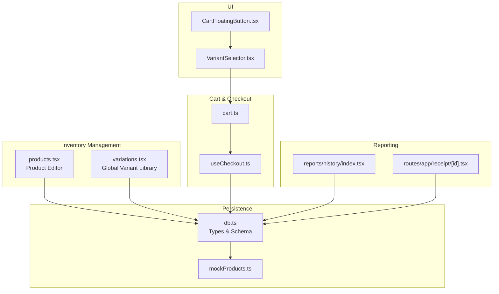
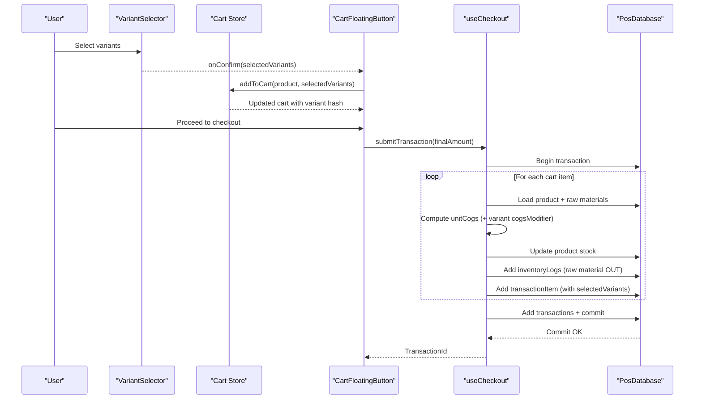
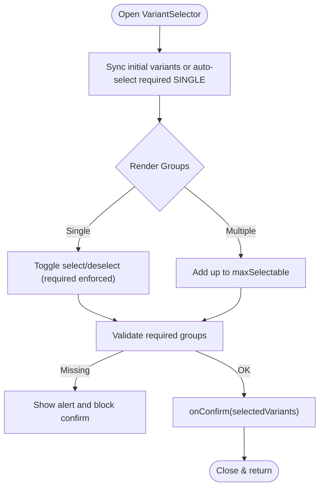
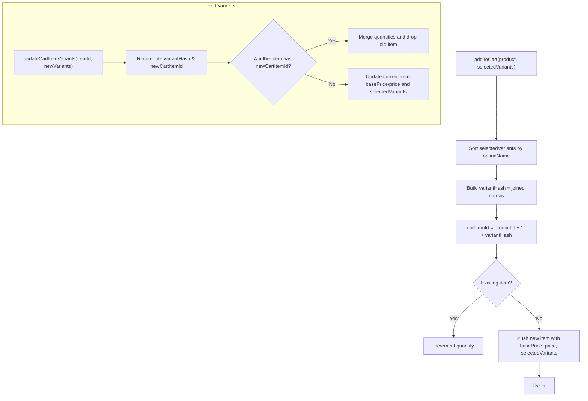
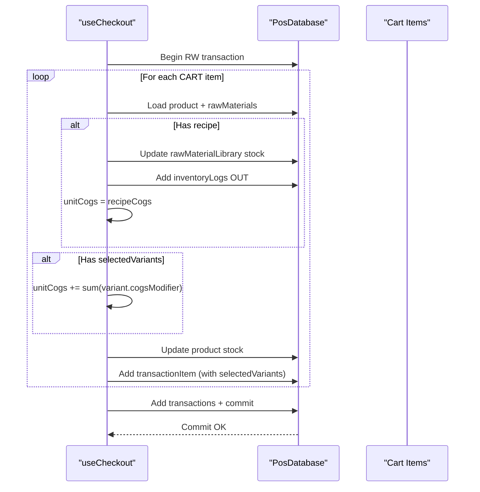
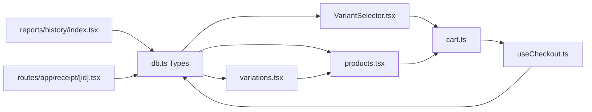

# Product Variations

<cite>
**Referenced Files in This Document**
- [VariantSelector.tsx](file://src/components/VariantSelector.tsx)
- [variations.tsx](file://src/routes/app/inventory/variations.tsx)
- [products.tsx](file://src/routes/app/inventory/products.tsx)
- [cart.ts](file://src/stores/cart.ts)
- [db.ts](file://src/db/db.ts)
- [CartFloatingButton.tsx](file://src/components/CartFloatingButton.tsx)
- [useCheckout.ts](file://src/hooks/useCheckout.ts)
- [mockProducts.ts](file://src/data/mockProducts.ts)
- [index.tsx](file://src/routes/app/reports/history/index.tsx)
- [receipt/[id].tsx](file://src/routes/app/receipt/[id].tsx)
</cite>

## Table of Contents
1. [Introduction](#introduction)
2. [Project Structure](#project-structure)
3. [Core Components](#core-components)
4. [Architecture Overview](#architecture-overview)
5. [Detailed Component Analysis](#detailed-component-analysis)
6. [Dependency Analysis](#dependency-analysis)
7. [Performance Considerations](#performance-considerations)
8. [Troubleshooting Guide](#troubleshooting-guide)
9. [Conclusion](#conclusion)
10. [Appendices](#appendices)

## Introduction
This document explains the product variations system in NgePos POS. It covers how variants are created and managed, how variant selection affects pricing and inventory, and how variants integrate with the cart and checkout pipeline. It also documents visibility controls, ordering preferences, reporting and sales tracking by variant, and practical examples for menu items, seasonal options, and promotional bundles.

## Project Structure
The variations system spans UI components, inventory management, cart logic, checkout, and persistence via a local database schema.

**Diagram sources**
- [VariantSelector.tsx:1-205](file://src/components/VariantSelector.tsx#L1-L205)
- [CartFloatingButton.tsx:1-200](file://src/components/CartFloatingButton.tsx#L1-L200)
- [variations.tsx:1-307](file://src/routes/app/inventory/variations.tsx#L1-L307)
- [products.tsx:1-200](file://src/routes/app/inventory/products.tsx#L1-L200)
- [cart.ts:1-256](file://src/stores/cart.ts#L1-L256)
- [useCheckout.ts:1-234](file://src/hooks/useCheckout.ts#L1-L234)
- [db.ts:1-569](file://src/db/db.ts#L1-L569)
- [mockProducts.ts:1-85](file://src/data/mockProducts.ts#L1-L85)
- [index.tsx:1-200](file://src/routes/app/reports/history/index.tsx#L1-L200)
- [receipt/[id].tsx](file://src/routes/app/receipt/[id].tsx#L85-L112)

**Section sources**
- [VariantSelector.tsx:1-205](file://src/components/VariantSelector.tsx#L1-L205)
- [variations.tsx:1-307](file://src/routes/app/inventory/variations.tsx#L1-L307)
- [products.tsx:1-200](file://src/routes/app/inventory/products.tsx#L1-L200)
- [cart.ts:1-256](file://src/stores/cart.ts#L1-L256)
- [db.ts:1-569](file://src/db/db.ts#L1-L569)

## Core Components
- VariantSelector: Interactive variant picker that validates required groups, computes price modifiers, and emits selections to the cart.
- Global Variant Library: Manages reusable variant templates with rules (single/multiple choice, required, max selectable).
- Product Editor: Allows attaching product-specific variant groups to items.
- Cart Store: Computes per-item price with variant modifiers, merges items by variant hash, and supports updating variants mid-cart.
- Checkout Hook: Deducts inventory, logs raw material usage, aggregates cost of goods, and persists transaction items with variant metadata.
- Reporting: Displays transaction items with variant details and supports filtering and exporting.

**Section sources**
- [VariantSelector.tsx:1-205](file://src/components/VariantSelector.tsx#L1-L205)
- [variations.tsx:1-307](file://src/routes/app/inventory/variations.tsx#L1-L307)
- [products.tsx:533-571](file://src/routes/app/inventory/products.tsx#L533-L571)
- [cart.ts:1-256](file://src/stores/cart.ts#L1-L256)
- [useCheckout.ts:1-234](file://src/hooks/useCheckout.ts#L1-L234)
- [db.ts:36-73](file://src/db/db.ts#L36-L73)

## Architecture Overview
The variant system integrates UI selection, cart pricing, and checkout inventory deduction. Variants are persisted either globally (templates) or per product. During checkout, variant modifiers contribute to cost of goods and are recorded with each transaction item.

**Diagram sources**
- [VariantSelector.tsx:99-118](file://src/components/VariantSelector.tsx#L99-L118)
- [CartFloatingButton.tsx:265-275](file://src/components/CartFloatingButton.tsx#L265-L275)
- [cart.ts:16-48](file://src/stores/cart.ts#L16-L48)
- [useCheckout.ts:38-172](file://src/hooks/useCheckout.ts#L38-L172)
- [db.ts:62-109](file://src/db/db.ts#L62-L109)

## Detailed Component Analysis

### VariantSelector Component
Responsibilities:
- Render variant groups (required/single/multiple) with options.
- Toggle selection for SINGLE vs MULTIPLE groups, enforce max selectable.
- Validate required groups before confirming.
- Compute effective base price and total price with modifiers.
- Emit selected variants to parent for cart updates.

Key behaviors:
- Required SINGLE groups auto-select first option if none chosen initially.
- Price modifiers are summed to show adjusted total.
- Base price derivation supports legacy sessions by subtracting initial modifiers.

**Diagram sources**
- [VariantSelector.tsx:16-118](file://src/components/VariantSelector.tsx#L16-L118)

**Section sources**
- [VariantSelector.tsx:1-205](file://src/components/VariantSelector.tsx#L1-L205)

### Global Variant Library (Templates)
Responsibilities:
- Define reusable variant templates with name, type (SINGLE/MULTIPLE), requirement flag, optional max selectable, and options with price and COGS modifiers.
- Toggle activation to control visibility.
- Manage option lists (add/update/remove).

Integration:
- Products can reference these templates to standardize variant groups across items.

**Section sources**
- [variations.tsx:1-307](file://src/routes/app/inventory/variations.tsx#L1-L307)
- [db.ts:51-60](file://src/db/db.ts#L51-L60)

### Product Editor (Variant Groups)
Responsibilities:
- Add/remove variant groups to a product.
- Configure group name, type, requirement, and options.
- Attach product-specific variants independent of templates.

**Section sources**
- [products.tsx:533-571](file://src/routes/app/inventory/products.tsx#L533-L571)
- [db.ts:42-49](file://src/db/db.ts#L42-L49)

### Cart Store (Pricing, Merging, Editing)
Responsibilities:
- Compute per-item price by combining base price and variant modifiers.
- Merge items with identical variants using a stable variant hash.
- Update item variants and recalculate price and cartItemId.
- Expose totals and discount calculation.

Important logic:
- Variant hash is derived from sorted option names to ensure consistent merging.
- Base price fallback uses current price minus existing variant modifiers if needed.

**Diagram sources**
- [cart.ts:16-94](file://src/stores/cart.ts#L16-L94)

**Section sources**
- [cart.ts:1-256](file://src/stores/cart.ts#L1-L256)

### Checkout Pipeline (Inventory & COGS)
Responsibilities:
- Deduct product stock and raw material quantities.
- Compute unit cost of goods including recipe costs and variant modifiers.
- Persist transaction items with variant metadata and total COGS.
- Support backdated timestamps and loyalty reward inclusion.

**Diagram sources**
- [useCheckout.ts:38-172](file://src/hooks/useCheckout.ts#L38-L172)
- [cart.ts:16-48](file://src/stores/cart.ts#L16-L48)
- [db.ts:62-109](file://src/db/db.ts#L62-L109)

**Section sources**
- [useCheckout.ts:1-234](file://src/hooks/useCheckout.ts#L1-L234)
- [cart.ts:1-256](file://src/stores/cart.ts#L1-L256)
- [db.ts:62-109](file://src/db/db.ts#L62-L109)

### Variant Integration in Receipts and Reports
- Receipts display product name, quantity, unit price, and selected variants.
- Reports/history lists transactions and can be filtered; variant details are preserved in transaction items.

**Section sources**
- [receipt/[id].tsx](file://src/routes/app/receipt/[id].tsx#L85-L112)
- [index.tsx:1-200](file://src/routes/app/reports/history/index.tsx#L1-L200)

## Dependency Analysis
- VariantSelector depends on Product types and emits variant selections to the cart.
- Cart store depends on product base price and variant modifiers to compute totals.
- Checkout depends on product variants to adjust COGS and persists variant metadata with each item.
- Global templates and product-specific variants coexist; templates enable reuse while products can override or extend.

**Diagram sources**
- [db.ts:36-73](file://src/db/db.ts#L36-L73)
- [VariantSelector.tsx:1-205](file://src/components/VariantSelector.tsx#L1-L205)
- [products.tsx:1-200](file://src/routes/app/inventory/products.tsx#L1-L200)
- [variations.tsx:1-307](file://src/routes/app/inventory/variations.tsx#L1-L307)
- [cart.ts:1-256](file://src/stores/cart.ts#L1-L256)
- [useCheckout.ts:1-234](file://src/hooks/useCheckout.ts#L1-L234)
- [index.tsx:1-200](file://src/routes/app/reports/history/index.tsx#L1-L200)
- [receipt/[id].tsx](file://src/routes/app/receipt/[id].tsx#L85-L112)

**Section sources**
- [db.ts:1-569](file://src/db/db.ts#L1-L569)
- [VariantSelector.tsx:1-205](file://src/components/VariantSelector.tsx#L1-L205)
- [cart.ts:1-256](file://src/stores/cart.ts#L1-L256)
- [useCheckout.ts:1-234](file://src/hooks/useCheckout.ts#L1-L234)

## Performance Considerations
- Variant hashing: Sorting option names before joining ensures deterministic merging and avoids duplicate items.
- COGS computation: Variant modifiers are added after recipe-based COGS; keep modifier lists concise to minimize loops.
- Rendering: Memoization in selectors reduces re-renders; avoid unnecessary deep comparisons in variant arrays.
- Database: Use indexes on frequently queried fields (e.g., product id, category) to speed up product queries.

## Troubleshooting Guide
Common issues and resolutions:
- Missing required variants: The selector prevents confirmation until required groups are filled; ensure templates or product groups are configured correctly.
- Incorrect base price fallback: If basePrice is missing, the selector recalculates it by subtracting initial modifiers; verify initial variants align with product price.
- Cart item duplication: Ensure variant hash is built from sorted option names; mismatches cause separate cart entries.
- Inventory mismatch: Verify raw material recipes and stock updates occur before committing; check logs for OUT entries.
- Reporting discrepancies: Confirm selectedVariants are saved with transaction items; receipts and reports rely on this metadata.

**Section sources**
- [VariantSelector.tsx:103-118](file://src/components/VariantSelector.tsx#L103-L118)
- [cart.ts:50-94](file://src/stores/cart.ts#L50-L94)
- [useCheckout.ts:65-128](file://src/hooks/useCheckout.ts#L65-L128)

## Conclusion
NgePos POS provides a flexible, extensible variant system that supports global templates and product-specific groups. It integrates variant selection into cart pricing, enforces required selections, and accurately tracks inventory and COGS during checkout. Reporting preserves variant metadata for transparency and analytics.

## Appendices

### Practical Examples

- Menu items with multiple options
  - Example: Americano with sugar level (required SINGLE) and extra shot (optional SINGLE).
  - Setup: Define a global “Level Gula” template and attach an “Ekstra Shot” group to the product; configure price modifiers for extra shots.

- Seasonal variations
  - Example: Special “Pumpkin Spice” topping group with limited availability.
  - Setup: Create a seasonal template and toggle isActive to control visibility; optionally restrict max selectable to one.

- Promotional bundles
  - Example: Buy 2 Coffees, get 1 free pastry (via campaign logic).
  - Setup: Use campaign requirements and rewards; variant groups remain unchanged but bundle composition is tracked via campaign items.

**Section sources**
- [mockProducts.ts:7-84](file://src/data/mockProducts.ts#L7-L84)
- [variations.tsx:1-307](file://src/routes/app/inventory/variations.tsx#L1-L307)
- [products.tsx:533-571](file://src/routes/app/inventory/products.tsx#L533-L571)

### Visibility Controls, Ordering Preferences, and Display Customization
- Global templates support isActive toggles to enable/disable groups across products.
- Product editors can override template options per item.
- VariantSelector displays required indicators and enforces selection rules at runtime.

**Section sources**
- [variations.tsx:81-89](file://src/routes/app/inventory/variations.tsx#L81-L89)
- [VariantSelector.tsx:132-154](file://src/components/VariantSelector.tsx#L132-L154)

### Variant Reporting and Sales Tracking
- Transaction items store selectedVariants alongside product metadata.
- Reports/history pages list transactions; receipts display variant details per item.

**Section sources**
- [db.ts:100-109](file://src/db/db.ts#L100-L109)
- [index.tsx:1-200](file://src/routes/app/reports/history/index.tsx#L1-L200)
- [receipt/[id].tsx](file://src/routes/app/receipt/[id].tsx#L85-L112)

### Variant-Based Inventory Management Strategies
- Recipe-based COGS plus variant modifiers inform accurate cost tracking.
- Deduct raw materials per item quantity and record inventory logs for auditability.
- Monitor variant popularity indirectly via transaction item counts and variant hashes.

**Section sources**
- [useCheckout.ts:65-128](file://src/hooks/useCheckout.ts#L65-L128)
- [cart.ts:16-48](file://src/stores/cart.ts#L16-L48)