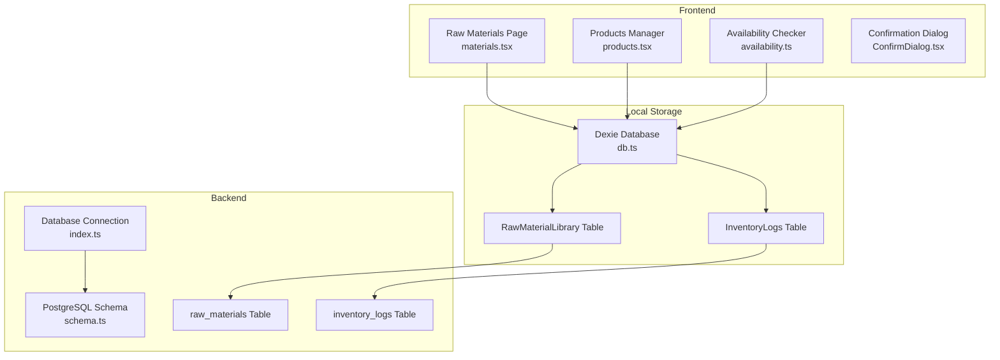
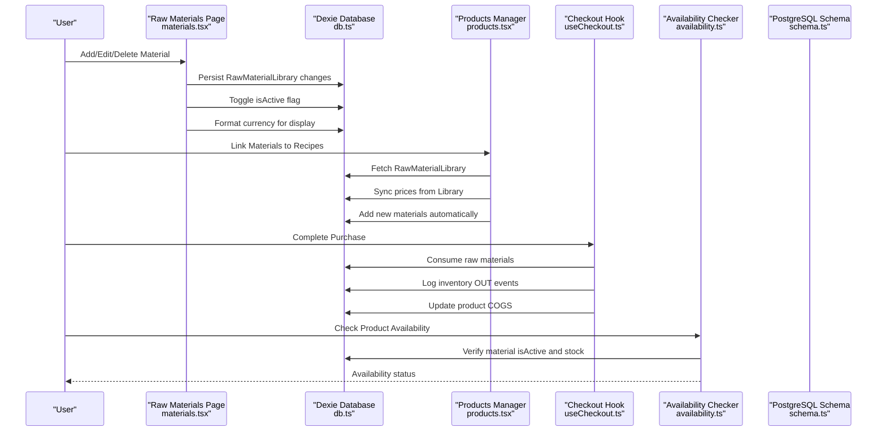
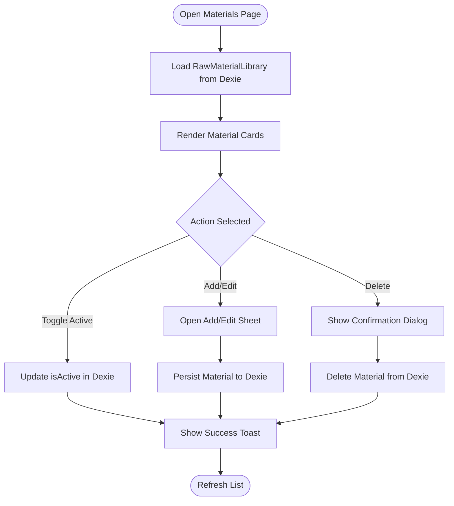
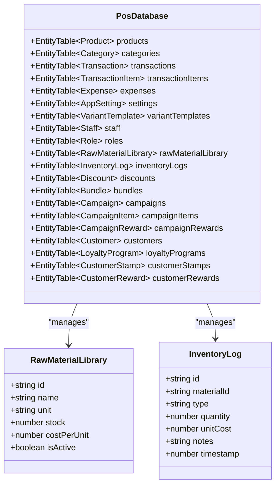
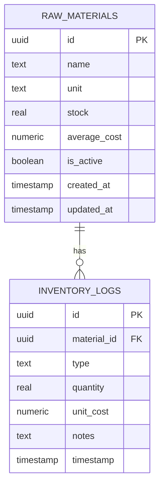
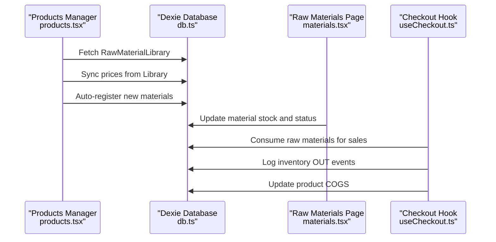
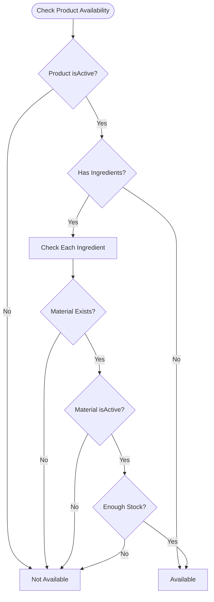
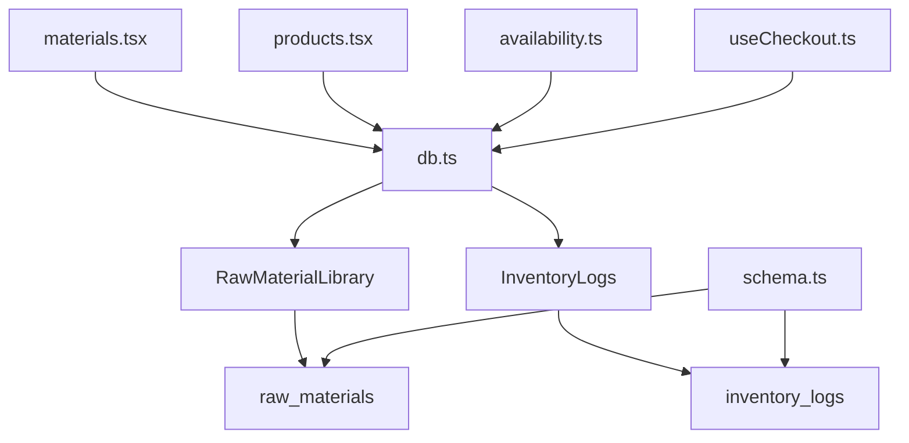

# Raw Materials System

<cite>
**Referenced Files in This Document**
- [materials.tsx](file://src/routes/app/inventory/materials.tsx)
- [db.ts](file://src/db/db.ts)
- [schema.ts](file://src/server/db/schema.ts)
- [useCheckout.ts](file://src/hooks/useCheckout.ts)
- [products.tsx](file://src/routes/app/inventory/products.tsx)
- [availability.ts](file://src/lib/availability.ts)
- [ConfirmDialog.tsx](file://src/components/ConfirmDialog.tsx)
- [index.ts](file://src/server/db/index.ts)
</cite>

## Table of Contents
1. [Introduction](#introduction)
2. [Project Structure](#project-structure)
3. [Core Components](#core-components)
4. [Architecture Overview](#architecture-overview)
5. [Detailed Component Analysis](#detailed-component-analysis)
6. [Dependency Analysis](#dependency-analysis)
7. [Performance Considerations](#performance-considerations)
8. [Troubleshooting Guide](#troubleshooting-guide)
9. [Conclusion](#conclusion)

## Introduction
This document provides comprehensive documentation for the raw materials system in NgePos POS. It covers the raw material library management, including material catalog creation, unit of measurement handling, cost per unit tracking, and material activation/deactivation. It documents the material entry form with predefined units (gram, ml, pcs, kg, liter, box) and custom unit support, cost calculation methodology, Indonesian Rupiah currency formatting, and material status management. The document also covers CRUD operations for raw materials, including add, edit, delete functionality with confirmation dialogs, and the material listing interface with search capabilities, status indicators, and batch operations. Practical examples demonstrate material setup for different business types, unit conversion strategies, and integration with product recipes. Finally, it addresses material tracking best practices, inventory accuracy, and cost optimization techniques.

## Project Structure
The raw materials system spans several key areas:
- Frontend inventory management page for raw materials
- Local IndexedDB-backed data model for raw materials
- Backend PostgreSQL schema for raw materials and inventory logs
- Integration with product recipes and checkout flow
- Utility functions for availability checking and confirmation dialogs

**Diagram sources**
- [materials.tsx:1-337](file://src/routes/app/inventory/materials.tsx#L1-L337)
- [db.ts:1-569](file://src/db/db.ts#L1-L569)
- [schema.ts:94-141](file://src/server/db/schema.ts#L94-L141)
- [index.ts:1-27](file://src/server/db/index.ts#L1-L27)

**Section sources**
- [materials.tsx:1-337](file://src/routes/app/inventory/materials.tsx#L1-L337)
- [db.ts:1-569](file://src/db/db.ts#L1-L569)
- [schema.ts:1-142](file://src/server/db/schema.ts#L1-L142)
- [index.ts:1-27](file://src/server/db/index.ts#L1-L27)

## Core Components
The raw materials system consists of the following core components:

- Raw Materials Listing and Management Page: Provides CRUD operations, status toggling, and currency formatting for cost per unit.
- Local Database Model: Defines the RawMaterialLibrary entity, InventoryLog entity, and database schema with IndexedDB-backed storage.
- Backend PostgreSQL Schema: Defines the raw_materials and inventory_logs tables for persistent storage and reporting.
- Product Integration: Links raw materials to product recipes and calculates cost of goods sold (COGS) during checkout.
- Availability Checking: Validates product availability based on material status and stock levels.
- Confirmation Dialog: Provides standardized confirmation dialogs for destructive actions.

Key responsibilities:
- Material Catalog Creation: Add/edit raw materials with name, unit, and cost per unit.
- Unit of Measurement Handling: Predefined units plus custom unit support.
- Cost Tracking: Moving average cost per unit stored in the library.
- Status Management: Activate/deactivate materials globally.
- Integration: Seamless linking to product recipes and checkout flow.

**Section sources**
- [materials.tsx:14-98](file://src/routes/app/inventory/materials.tsx#L14-L98)
- [db.ts:16-34](file://src/db/db.ts#L16-L34)
- [schema.ts:94-141](file://src/server/db/schema.ts#L94-L141)
- [useCheckout.ts:56-99](file://src/hooks/useCheckout.ts#L56-L99)
- [availability.ts:1-39](file://src/lib/availability.ts#L1-L39)
- [ConfirmDialog.tsx:1-155](file://src/components/ConfirmDialog.tsx#L1-L155)

## Architecture Overview
The raw materials system integrates frontend and backend components to manage material libraries, track inventory, and compute costs for products.

**Diagram sources**
- [materials.tsx:38-98](file://src/routes/app/inventory/materials.tsx#L38-L98)
- [db.ts:280-290](file://src/db/db.ts#L280-L290)
- [products.tsx:103-105](file://src/routes/app/inventory/products.tsx#L103-L105)
- [useCheckout.ts:56-99](file://src/hooks/useCheckout.ts#L56-L99)
- [availability.ts:12-39](file://src/lib/availability.ts#L12-L39)
- [schema.ts:94-141](file://src/server/db/schema.ts#L94-L141)

## Detailed Component Analysis

### Raw Materials Listing and Management Page
The materials page provides a comprehensive interface for managing raw materials:
- Material List: Displays materials with status indicators, unit, and formatted cost per unit.
- Add/Edit Sheet: Allows creation and modification of materials with predefined and custom units.
- Status Toggle: Activates or deactivates materials globally.
- Currency Formatting: Uses Indonesian Rupiah formatting for cost display.
- Confirmation Dialog: Standardized confirmation for deletion actions.

**Diagram sources**
- [materials.tsx:14-98](file://src/routes/app/inventory/materials.tsx#L14-L98)

**Section sources**
- [materials.tsx:14-337](file://src/routes/app/inventory/materials.tsx#L14-L337)

### Local Database Model and Entities
The local database model defines the structure for raw materials and inventory logs:
- RawMaterialLibrary: Stores material metadata including id, name, unit, stock, costPerUnit, and isActive.
- InventoryLog: Tracks inventory movements with type (IN/OUT/ADJUSTMENT), quantity, unitCost, and notes.
- Database Schema: IndexedDB-backed tables with versioned migrations for backward compatibility.

**Diagram sources**
- [db.ts:16-34](file://src/db/db.ts#L16-L34)
- [db.ts:270-496](file://src/db/db.ts#L270-L496)

**Section sources**
- [db.ts:16-34](file://src/db/db.ts#L16-L34)
- [db.ts:270-496](file://src/db/db.ts#L270-L496)

### Backend PostgreSQL Schema
The backend schema defines persistent storage for raw materials and inventory logs:
- raw_materials: Stores material metadata with UUID primary keys, average cost tracking, and activity status.
- inventory_logs: Records inventory movements with foreign key relationships to raw materials.
- Database Connection: Drizzle ORM integration with PostgreSQL for server-side operations.

**Diagram sources**
- [schema.ts:94-141](file://src/server/db/schema.ts#L94-L141)
- [index.ts:1-27](file://src/server/db/index.ts#L1-L27)

**Section sources**
- [schema.ts:94-141](file://src/server/db/schema.ts#L94-L141)
- [index.ts:1-27](file://src/server/db/index.ts#L1-L27)

### Product Integration and Recipe Consumption
Raw materials integrate with product recipes and checkout:
- Recipe Linking: Products reference raw materials with quantities and units.
- Price Synchronization: Products can sync prices from the raw material library.
- Checkout Consumption: During checkout, raw materials are consumed and inventory logs are recorded.
- COGS Calculation: Product cost of goods sold is computed from raw material costs.

**Diagram sources**
- [products.tsx:103-105](file://src/routes/app/inventory/products.tsx#L103-L105)
- [products.tsx:347-398](file://src/routes/app/inventory/products.tsx#L347-L398)
- [useCheckout.ts:56-99](file://src/hooks/useCheckout.ts#L56-L99)

**Section sources**
- [products.tsx:103-105](file://src/routes/app/inventory/products.tsx#L103-L105)
- [products.tsx:347-398](file://src/routes/app/inventory/products.tsx#L347-L398)
- [useCheckout.ts:56-99](file://src/hooks/useCheckout.ts#L56-L99)

### Availability Checking
The availability checker validates product availability based on material status and stock:
- Product Toggle: Checks if the product itself is active.
- Ingredient Validation: Ensures all linked materials are active and have sufficient stock.
- Cascade Effect: Deactivating a material affects product availability.

**Diagram sources**
- [availability.ts:12-39](file://src/lib/availability.ts#L12-L39)

**Section sources**
- [availability.ts:1-39](file://src/lib/availability.ts#L1-L39)

### Confirmation Dialog Component
The confirmation dialog provides standardized confirmation for destructive actions:
- Variants: Danger, warning, and info variants with appropriate styling.
- Loading States: Supports asynchronous confirmation with loading indicators.
- Imperative API: Exposes a simple imperative confirm function.

**Section sources**
- [ConfirmDialog.tsx:1-155](file://src/components/ConfirmDialog.tsx#L1-L155)

## Dependency Analysis
The raw materials system exhibits the following dependencies:
- Frontend-to-Backend: Local Dexie database persists to IndexedDB; backend schema defines PostgreSQL tables for persistence and reporting.
- Product-to-Material: Products depend on raw materials for recipe composition and COGS calculation.
- Checkout-to-Inventory: Checkout consumes materials and updates inventory logs.
- Availability-to-Material: Availability checks depend on material status and stock.

**Diagram sources**
- [materials.tsx:1-337](file://src/routes/app/inventory/materials.tsx#L1-L337)
- [db.ts:1-569](file://src/db/db.ts#L1-L569)
- [schema.ts:94-141](file://src/server/db/schema.ts#L94-L141)

**Section sources**
- [materials.tsx:1-337](file://src/routes/app/inventory/materials.tsx#L1-L337)
- [db.ts:1-569](file://src/db/db.ts#L1-L569)
- [schema.ts:94-141](file://src/server/db/schema.ts#L94-L141)

## Performance Considerations
- IndexedDB Efficiency: Use Dexie's efficient indexing and bulk operations for large datasets.
- Currency Formatting: Format currency only when rendering to minimize computation overhead.
- Debounced Operations: Avoid excessive refetches by batching updates and using SolidJS signals effectively.
- Inventory Logging: Keep inventory logs minimal and indexed by timestamp for fast queries.
- Product Recipe Sync: Batch sync operations to reduce database writes during price synchronization.

## Troubleshooting Guide
Common issues and resolutions:
- Material Not Found in Recipes: Use the smart sync feature to repair missing links by name or auto-register new materials.
- Stock Depletion: Monitor inventory logs to identify consumption patterns and adjust ordering.
- Price Discrepancies: Use the sync library feature to align product prices with the latest material costs.
- Availability Errors: Verify material status and stock levels; inactive materials prevent product availability.
- Confirmation Dialog Issues: Ensure the confirm dialog is properly imported and configured for destructive actions.

**Section sources**
- [products.tsx:347-398](file://src/routes/app/inventory/products.tsx#L347-L398)
- [useCheckout.ts:56-99](file://src/hooks/useCheckout.ts#L56-L99)
- [availability.ts:12-39](file://src/lib/availability.ts#L12-L39)
- [ConfirmDialog.tsx:1-155](file://src/components/ConfirmDialog.tsx#L1-L155)

## Conclusion
The raw materials system in NgePos POS provides a robust foundation for managing material catalogs, tracking inventory, and calculating product costs. By leveraging IndexedDB for local storage and PostgreSQL for persistent records, the system ensures reliable performance and scalability. The integration with product recipes and checkout enables accurate cost of goods sold calculations and inventory consumption tracking. With standardized confirmation dialogs and availability checking, the system supports safe and efficient operations across diverse business types.