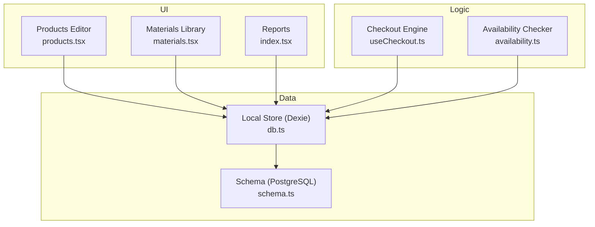
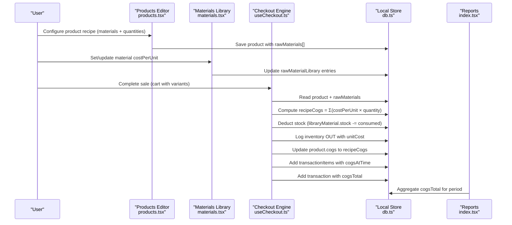
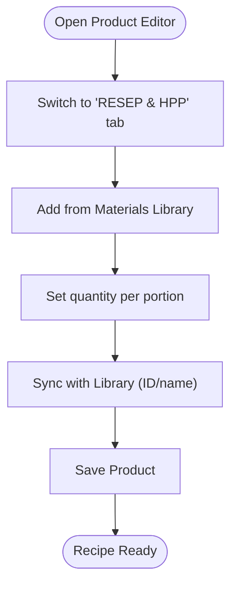
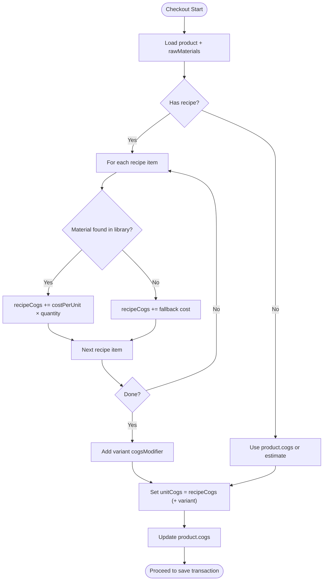
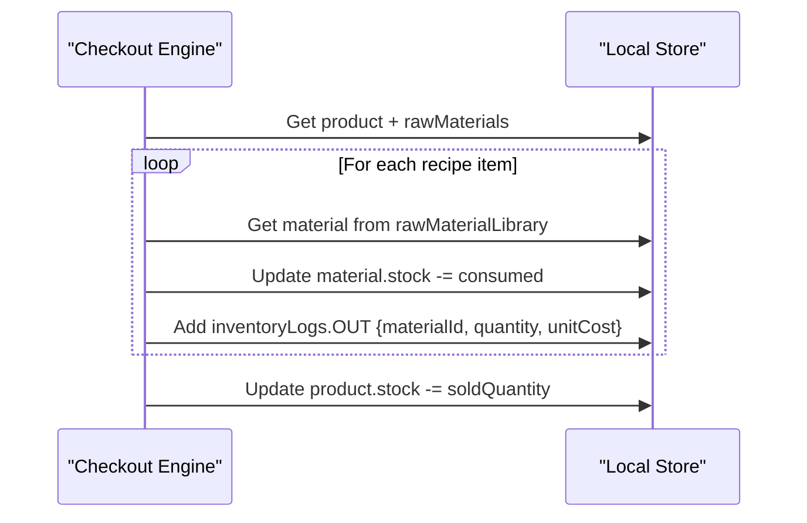
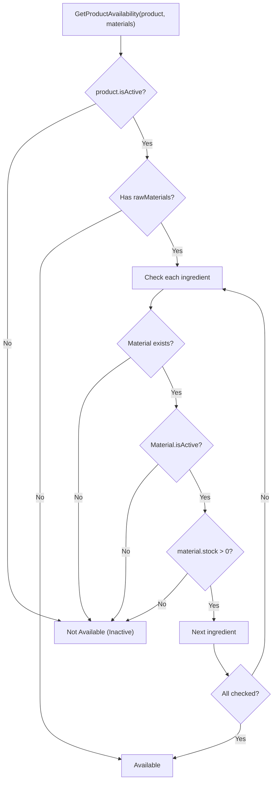
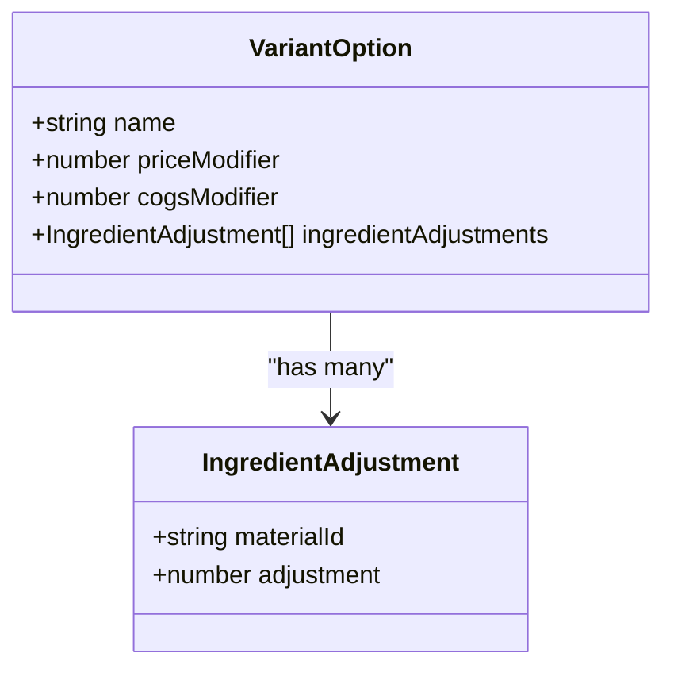
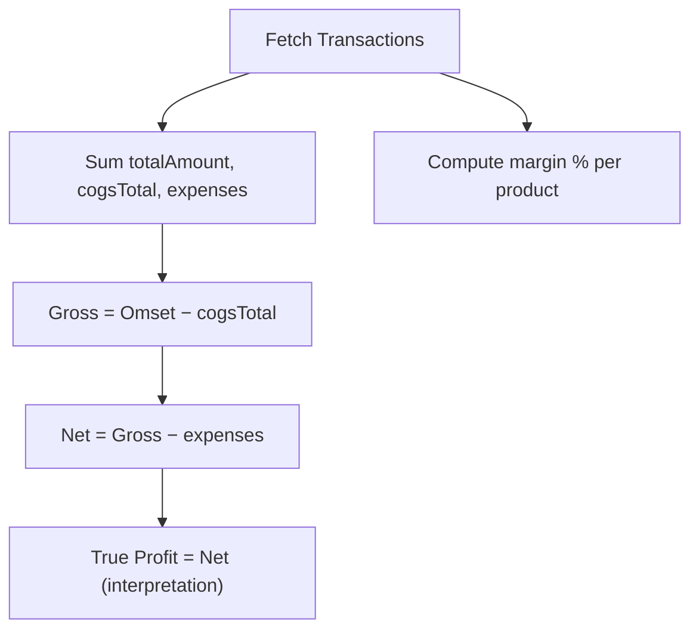
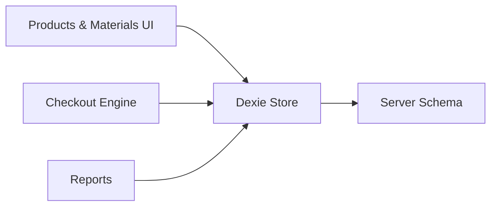
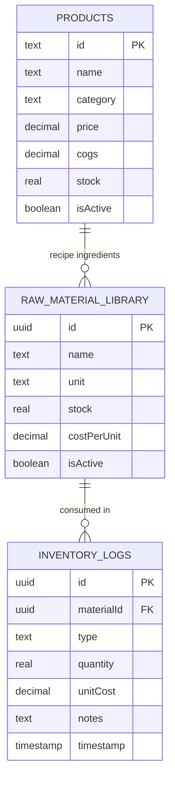

# Recipe Management

<cite>
**Referenced Files in This Document**
- [useCheckout.ts](file://src/hooks/useCheckout.ts)
- [products.tsx](file://src/routes/app/inventory/products.tsx)
- [materials.tsx](file://src/routes/app/inventory/materials.tsx)
- [availability.ts](file://src/lib/availability.ts)
- [schema.ts](file://src/server/db/schema.ts)
- [db.ts](file://src/db/db.ts)
- [index.tsx](file://src/routes/app/reports/index.tsx)
- [mockProducts.ts](file://src/data/mockProducts.ts)
- [PRD.txt](file://PRD.txt)
</cite>

## Table of Contents
1. [Introduction](#introduction)
2. [Project Structure](#project-structure)
3. [Core Components](#core-components)
4. [Architecture Overview](#architecture-overview)
5. [Detailed Component Analysis](#detailed-component-analysis)
6. [Dependency Analysis](#dependency-analysis)
7. [Performance Considerations](#performance-considerations)
8. [Troubleshooting Guide](#troubleshooting-guide)
9. [Conclusion](#conclusion)
10. [Appendices](#appendices)

## Introduction
This document explains the recipe management system in NgePos POS. It covers how products are configured with recipes (raw materials), how costs of goods sold (COGS) are calculated at runtime, how margins are computed and visualized, and how inventory is automatically deducted during checkout. It also documents ingredient substitution via variant “ingredient adjustments,” recipe scaling through quantities, availability checks, and integration with product variations. Practical examples and reporting aspects are included to help operators configure menus, adjust for supplier cost fluctuations, and track consumption.

## Project Structure
Recipe management spans several UI pages and shared libraries:
- Product editor and variant configuration live under inventory management.
- Raw materials are managed in a dedicated materials page backed by a local library.
- Checkout logic performs recipe-based COGS computation and stock deduction.
- Availability checks prevent sales when ingredients are missing or inactive.
- Reports aggregate financial metrics including COGS totals.

**Diagram sources**
- [products.tsx](file://src/routes/app/inventory/products.tsx)
- [materials.tsx](file://src/routes/app/inventory/materials.tsx)
- [useCheckout.ts](file://src/hooks/useCheckout.ts)
- [availability.ts](file://src/lib/availability.ts)
- [db.ts](file://src/db/db.ts)
- [schema.ts](file://src/server/db/schema.ts)

**Section sources**
- [products.tsx](file://src/routes/app/inventory/products.tsx)
- [materials.tsx](file://src/routes/app/inventory/materials.tsx)
- [useCheckout.ts](file://src/hooks/useCheckout.ts)
- [availability.ts](file://src/lib/availability.ts)
- [db.ts](file://src/db/db.ts)
- [schema.ts](file://src/server/db/schema.ts)

## Core Components
- Product editor with tabs for basic info, recipe/HPP, and variants.
- Raw material library with unit and cost-per-unit entries.
- Checkout engine that computes dynamic COGS from recipes and variants, deducts inventory, logs movements, and updates product COGS.
- Availability checker that validates product and ingredient readiness.
- Reports that compute gross profit, net profit, and true profit using transaction-level COGS totals.

Key capabilities:
- Recipe configuration: attach materials with quantities and units.
- Dynamic COGS: computed per sale from recipe and variant modifiers.
- Automatic stock deduction and inventory logging.
- Variant-based ingredient substitutions via “ingredient adjustments.”

**Section sources**
- [products.tsx](file://src/routes/app/inventory/products.tsx)
- [materials.tsx](file://src/routes/app/inventory/materials.tsx)
- [useCheckout.ts](file://src/hooks/useCheckout.ts)
- [availability.ts](file://src/lib/availability.ts)
- [index.tsx](file://src/routes/app/reports/index.tsx)

## Architecture Overview
The recipe management pipeline integrates UI configuration, local storage, and checkout-time computation.

**Diagram sources**
- [products.tsx](file://src/routes/app/inventory/products.tsx)
- [materials.tsx](file://src/routes/app/inventory/materials.tsx)
- [useCheckout.ts](file://src/hooks/useCheckout.ts)
- [db.ts](file://src/db/db.ts)
- [index.tsx](file://src/routes/app/reports/index.tsx)

## Detailed Component Analysis

### Product Recipe Configuration
- Recipes are attached to products as a list of raw materials with quantity and unit.
- The product editor supports:
  - Adding/removing recipe ingredients.
  - Synchronizing recipe ingredients with the materials library (smart sync by ID or name).
  - Auto-calculating line costs from quantity and costPerUnit.
- Variants can include “ingredient adjustments” to substitute or add extra ingredients, with automatic COGS derivation from material costs.

**Diagram sources**
- [products.tsx](file://src/routes/app/inventory/products.tsx)

**Section sources**
- [products.tsx](file://src/routes/app/inventory/products.tsx)

### COGS Calculation Methodology
- Base COGS per product can be pre-set; at checkout, dynamic COGS is computed from the recipe:
  - For each recipe ingredient: costPerUnit from the materials library × recipe quantity.
  - Sum gives recipeCogs; if any ingredient is missing, fallback cost is used.
- Variant modifiers can adjust COGS further:
  - If a variant defines cogsModifier, it is added to unit COGS.
  - Alternatively, ingredient adjustments can auto-compute cogs from selected materials and their costPerUnit.
- Product COGS is updated to the newly computed recipeCogs for future reference.

**Diagram sources**
- [useCheckout.ts](file://src/hooks/useCheckout.ts)

**Section sources**
- [useCheckout.ts](file://src/hooks/useCheckout.ts)

### Automated Stock Deduction and Inventory Logging
- During checkout, for each recipe ingredient:
  - Consumed quantity = recipe quantity × sold quantity.
  - Stock is reduced in the materials library.
  - An inventory log entry is created with type OUT, quantity, and unitCost.
- Product stock is also reduced.

**Diagram sources**
- [useCheckout.ts](file://src/hooks/useCheckout.ts)

**Section sources**
- [useCheckout.ts](file://src/hooks/useCheckout.ts)

### Availability Checking
- A product is available if:
  - The product itself is active.
  - If it has recipe ingredients, all referenced materials must exist, be active, and have stock > 0.
- This prevents sales when ingredients are missing or off.

**Diagram sources**
- [availability.ts](file://src/lib/availability.ts)

**Section sources**
- [availability.ts](file://src/lib/availability.ts)

### Variants, Ingredient Substitutions, and Scaling
- Variants define groups with options that can:
  - Carry a price modifier and a cogs modifier.
  - Include ingredient adjustments: select materials and specify adjustments to compute COGS dynamically.
- Recipe scaling:
  - Recipe quantities define the amount per single portion.
  - Sold quantity multiplies the recipe consumption accordingly.
- Variant-based substitutions:
  - Ingredient adjustments allow swapping or adding ingredients per option, with automatic COGS recomputation.

**Diagram sources**
- [products.tsx](file://src/routes/app/inventory/products.tsx)

**Section sources**
- [products.tsx](file://src/routes/app/inventory/products.tsx)

### Reporting and Margin Analytics
- Reports compute:
  - Gross profit = Omset − cogsTotal.
  - Net profit = Gross profit − expenses.
  - True profit = Net profit (with corrected modal return interpretation).
- Margin analytics:
  - Per-product margin percentage is computed and categorized into statuses (Critical, Thin, Healthy, Optimal).
- Transaction-level cogsAtTime and cogsTotal are recorded for accurate aggregation.

**Diagram sources**
- [index.tsx](file://src/routes/app/reports/index.tsx)

**Section sources**
- [index.tsx](file://src/routes/app/reports/index.tsx)

### Practical Examples
- Menu item setup:
  - Configure a product with a recipe (e.g., coffee base, milk, syrup) and set quantities per portion.
  - Save; the product’s COGS is derived from material costPerUnit × quantity.
- Seasonal adjustments:
  - Update material costPerUnit in the materials library; the next sale recalculates COGS using the latest costPerUnit.
- Supplier cost fluctuations:
  - After updating costs, the dynamic COGS ensures accurate margin tracking without manual COGS recalculation.
- Ingredient substitution:
  - Define variant options with ingredient adjustments to swap syrups or add extras; COGS adjusts automatically.

**Section sources**
- [materials.tsx](file://src/routes/app/inventory/materials.tsx)
- [products.tsx](file://src/routes/app/inventory/products.tsx)
- [useCheckout.ts](file://src/hooks/useCheckout.ts)

## Dependency Analysis
- UI depends on local store for product and material data.
- Checkout engine coordinates reads/writes across products, raw material library, and inventory logs.
- Reports depend on transaction-level cogsTotal for financial summaries.
- Schema defines backend tables; frontend uses local Dexie store with server-side schema for synchronization.

**Diagram sources**
- [db.ts](file://src/db/db.ts)
- [schema.ts](file://src/server/db/schema.ts)

**Section sources**
- [db.ts](file://src/db/db.ts)
- [schema.ts](file://src/server/db/schema.ts)

## Performance Considerations
- Recipe loops are linear in the number of ingredients; keep recipes concise for fast checkout.
- Variant ingredient adjustments trigger recomputation; avoid excessive adjustments per option.
- Smart sync in the product editor minimizes mismatches and reduces fallback cost computations.
- Inventory logging is performed per consumed ingredient; batching writes is handled by the transaction wrapper.

## Troubleshooting Guide
- Recipe shows incorrect COGS:
  - Verify material costPerUnit is up-to-date in the materials library.
  - Ensure recipe quantities are correct and materials exist in the library.
- Stock not reducing:
  - Confirm checkout succeeded and no errors were thrown.
  - Check inventory logs for OUT entries.
- Product appears unavailable:
  - Check product isActive flag.
  - Verify all recipe materials exist, are active, and have stock > 0.

**Section sources**
- [useCheckout.ts](file://src/hooks/useCheckout.ts)
- [availability.ts](file://src/lib/availability.ts)

## Conclusion
NgePos POS provides a robust recipe management system that links product recipes to a reusable materials library, computes dynamic COGS at checkout, and enforces availability checks. Variants enable flexible ingredient substitutions and pricing, while inventory is automatically deducted and logged. Reporting aggregates transaction-level COGS for accurate financial insights. Operators can confidently manage recipes, adapt to supplier cost changes, and maintain healthy margins.

## Appendices

### Data Model Overview

**Diagram sources**
- [schema.ts](file://src/server/db/schema.ts)
- [db.ts](file://src/db/db.ts)

### Example References
- Mock product variants demonstrate variant groups and options.
- PRD outlines planned enhancements like automatic stock deduction and waste tracking.

**Section sources**
- [mockProducts.ts](file://src/data/mockProducts.ts)
- [PRD.txt](file://PRD.txt)