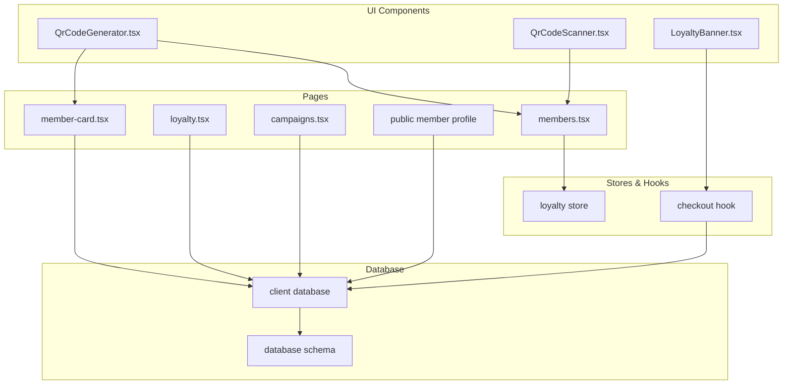
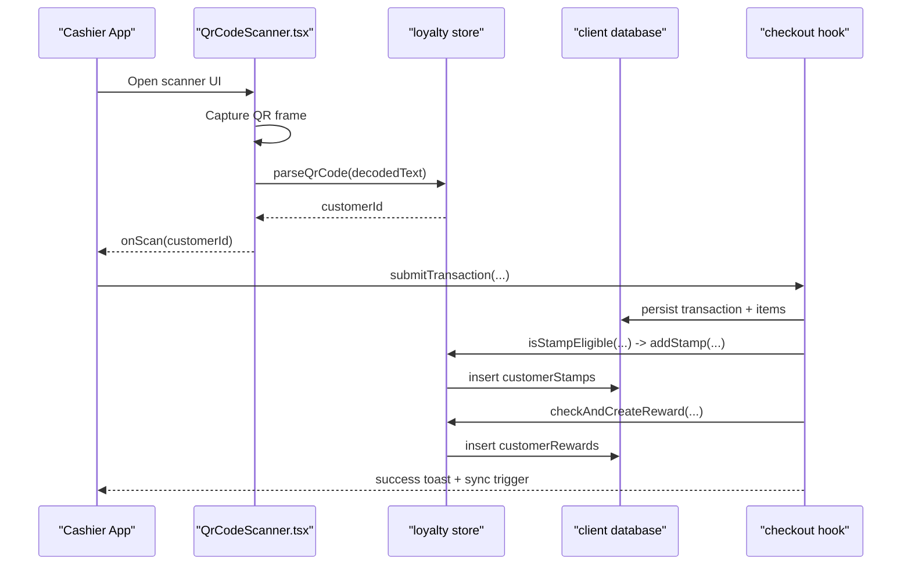
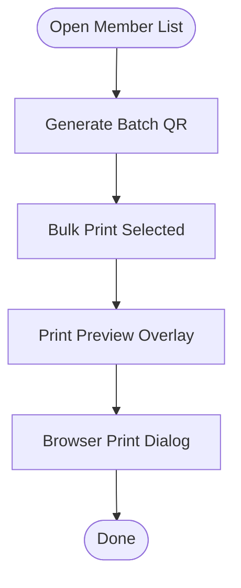
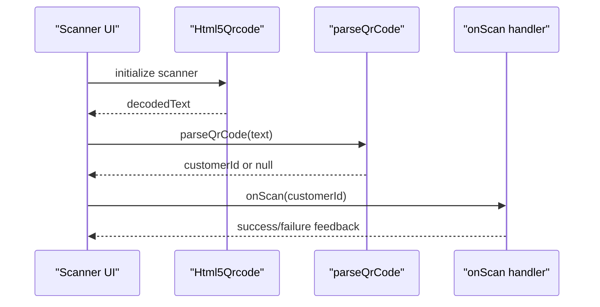
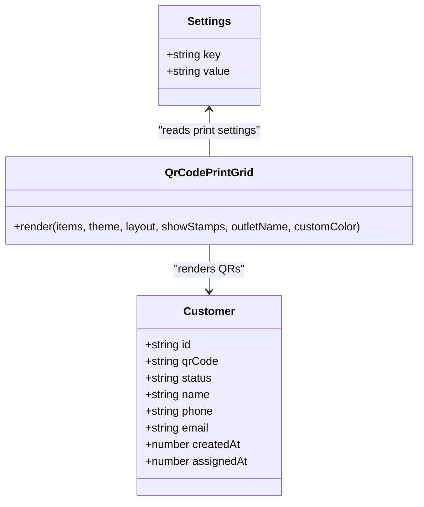
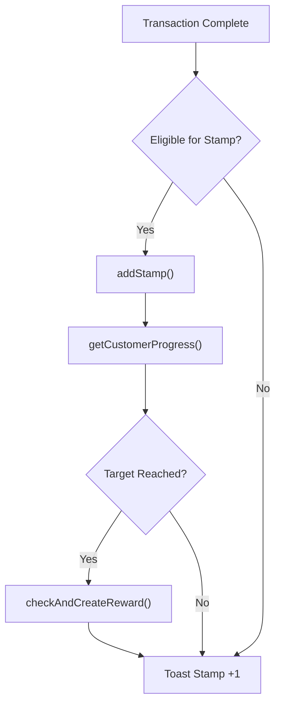
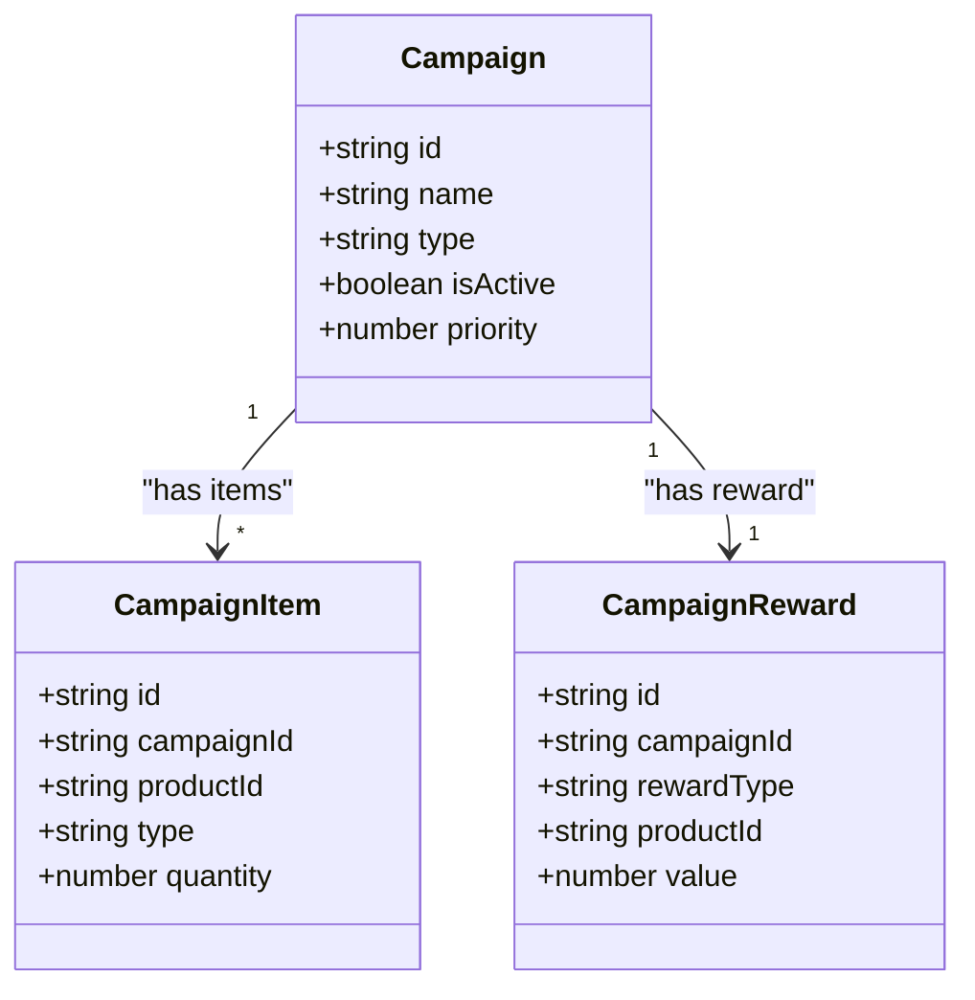
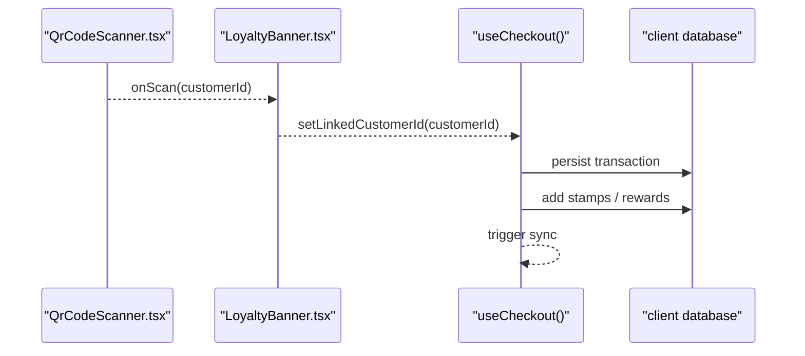
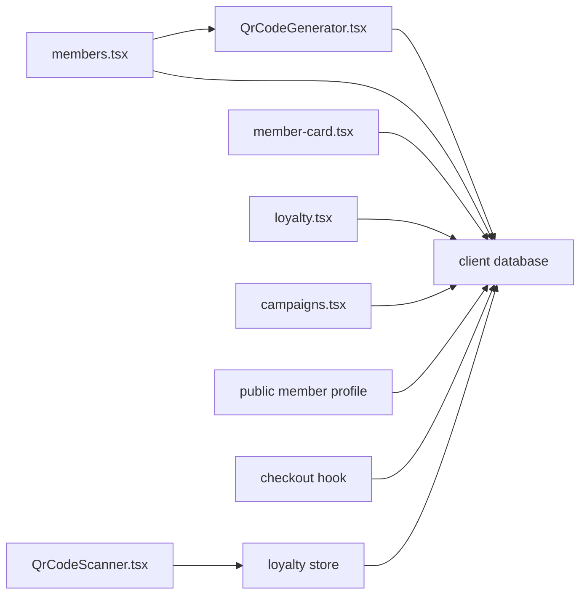

# Customer Engagement

<cite>
**Referenced Files in This Document**
- [QrCodeGenerator.tsx](file://src/components/QrCodeGenerator.tsx)
- [QrCodeScanner.tsx](file://src/components/QrCodeScanner.tsx)
- [LoyaltyBanner.tsx](file://src/components/LoyaltyBanner.tsx)
- [member-card.tsx](file://src/routes/app/marketing/member-card.tsx)
- [members.tsx](file://src/routes/app/marketing/members.tsx)
- [loyalty.tsx](file://src/routes/app/marketing/loyalty.tsx)
- [campaigns.tsx](file://src/routes/app/marketing/campaigns.tsx)
- [public member profile](file://src/routes/m/[id].tsx)
- [loyalty store](file://src/stores/loyalty.ts)
- [checkout hook](file://src/hooks/useCheckout.ts)
- [POS home](file://src/routes/app/index.tsx)
- [database schema](file://src/server/db/schema.ts)
- [client database](file://src/db/db.ts)
</cite>

## Table of Contents
1. [Introduction](#introduction)
2. [Project Structure](#project-structure)
3. [Core Components](#core-components)
4. [Architecture Overview](#architecture-overview)
5. [Detailed Component Analysis](#detailed-component-analysis)
6. [Dependency Analysis](#dependency-analysis)
7. [Performance Considerations](#performance-considerations)
8. [Troubleshooting Guide](#troubleshooting-guide)
9. [Conclusion](#conclusion)
10. [Appendices](#appendices)

## Introduction
This document explains the customer engagement features in the NgePos marketing system. It covers QR code generation and scanning for in-store verification and member registration, the digital membership card system, promotional campaigns, and POS-integrated loyalty rewards. It also outlines customer segmentation strategies, personalized offer delivery, engagement analytics, and privacy considerations.

## Project Structure
The customer engagement features span UI components, routing pages, client-side storage, and backend schema definitions:
- QR generation and printing for member cards
- QR scanning for in-store verification
- Member database and printing customization
- Loyalty program configuration and progress tracking
- Promotional campaigns and reward management
- POS checkout integration for stamp accrual and reward claiming
- Public-facing member profile and campaign banners

**Diagram sources**
- [QrCodeGenerator.tsx:1-222](file://src/components/QrCodeGenerator.tsx#L1-L222)
- [QrCodeScanner.tsx:1-157](file://src/components/QrCodeScanner.tsx#L1-L157)
- [LoyaltyBanner.tsx:1-167](file://src/components/LoyaltyBanner.tsx#L1-L167)
- [member-card.tsx:1-283](file://src/routes/app/marketing/member-card.tsx#L1-L283)
- [members.tsx:1-791](file://src/routes/app/marketing/members.tsx#L1-L791)
- [loyalty.tsx:1-464](file://src/routes/app/marketing/loyalty.tsx#L1-L464)
- [campaigns.tsx:1-800](file://src/routes/app/marketing/campaigns.tsx#L1-L800)
- [public member profile:1-175](file://src/routes/m/[id].tsx#L1-L175)
- [loyalty store:1-174](file://src/stores/loyalty.ts#L1-L173)
- [checkout hook:1-217](file://src/hooks/useCheckout.ts#L1-L234)
- [client database:270-498](file://src/db/db.ts#L270-L498)
- [database schema:1-142](file://src/server/db/schema.ts#L1-L142)

**Section sources**
- [QrCodeGenerator.tsx:1-222](file://src/components/QrCodeGenerator.tsx#L1-L222)
- [QrCodeScanner.tsx:1-157](file://src/components/QrCodeScanner.tsx#L1-L157)
- [member-card.tsx:1-283](file://src/routes/app/marketing/member-card.tsx#L1-L283)
- [members.tsx:1-791](file://src/routes/app/marketing/members.tsx#L1-L791)
- [loyalty.tsx:1-464](file://src/routes/app/marketing/loyalty.tsx#L1-L464)
- [campaigns.tsx:1-800](file://src/routes/app/marketing/campaigns.tsx#L1-L800)
- [public member profile:1-175](file://src/routes/m/[id].tsx#L1-L175)
- [loyalty store:1-174](file://src/stores/loyalty.ts#L1-L173)
- [checkout hook:1-217](file://src/hooks/useCheckout.ts#L1-L234)
- [client database:270-498](file://src/db/db.ts#L270-L498)
- [database schema:1-142](file://src/server/db/schema.ts#L1-L142)

## Core Components
- QR Code Generator: Renders QR codes for member IDs and prints printable grids with customizable themes and layouts.
- QR Scanner: Captures QR codes via device camera, parses member IDs, and triggers POS actions.
- Member Management: Lists members, supports bulk QR generation/printing, and edits profiles.
- Loyalty System: Configures stamp-based programs, tracks progress, awards and claims rewards.
- Campaigns: Defines promotional offers and computes profitability.
- POS Integration: Adds stamps on qualifying transactions and claims rewards during checkout.
- Public Member Profile: Displays member progress and active campaigns.

**Section sources**
- [QrCodeGenerator.tsx:1-222](file://src/components/QrCodeGenerator.tsx#L1-L222)
- [QrCodeScanner.tsx:1-157](file://src/components/QrCodeScanner.tsx#L1-L157)
- [members.tsx:1-791](file://src/routes/app/marketing/members.tsx#L1-L791)
- [loyalty.tsx:1-464](file://src/routes/app/marketing/loyalty.tsx#L1-L464)
- [campaigns.tsx:1-800](file://src/routes/app/marketing/campaigns.tsx#L1-L800)
- [checkout hook:1-217](file://src/hooks/useCheckout.ts#L1-L234)
- [public member profile:1-175](file://src/routes/m/[id].tsx#L1-L175)

## Architecture Overview
The system integrates front-end UI with client-side IndexedDB/Dexie for offline-first data and SolidStart routing for navigation. QR workflows connect in-store scanning to POS checkout logic, while loyalty and campaigns drive engagement and retention.

**Diagram sources**
- [QrCodeScanner.tsx:1-157](file://src/components/QrCodeScanner.tsx#L1-L157)
- [loyalty store:1-174](file://src/stores/loyalty.ts#L1-L173)
- [checkout hook:1-217](file://src/hooks/useCheckout.ts#L1-L234)
- [client database:270-498](file://src/db/db.ts#L270-L498)

## Detailed Component Analysis

### QR Code Generation and Printing
- Generates QR codes for member IDs and renders printable grids with themes (light/dark/gradient/lines/custom).
- Supports horizontal and portrait layouts and optional stamp grids.
- Integrates with member management for bulk QR generation and print overlays.

**Diagram sources**
- [members.tsx:151-178](file://src/routes/app/marketing/members.tsx#L151-L178)
- [members.tsx:644-787](file://src/routes/app/marketing/members.tsx#L644-L787)
- [QrCodeGenerator.tsx:76-222](file://src/components/QrCodeGenerator.tsx#L76-L222)

**Section sources**
- [QrCodeGenerator.tsx:1-222](file://src/components/QrCodeGenerator.tsx#L1-L222)
- [members.tsx:151-178](file://src/routes/app/marketing/members.tsx#L151-L178)
- [members.tsx:644-787](file://src/routes/app/marketing/members.tsx#L644-L787)
- [member-card.tsx:1-283](file://src/routes/app/marketing/member-card.tsx#L1-L283)

### QR Scanner Implementation
- Initializes camera-based QR scanning with a viewfinder overlay.
- Parses QR strings into customer IDs and validates format.
- Triggers POS actions upon successful scans.

**Diagram sources**
- [QrCodeScanner.tsx:1-157](file://src/components/QrCodeScanner.tsx#L1-L157)
- [loyalty store:17-23](file://src/stores/loyalty.ts#L17-L23)

**Section sources**
- [QrCodeScanner.tsx:1-157](file://src/components/QrCodeScanner.tsx#L1-L157)
- [loyalty store:17-23](file://src/stores/loyalty.ts#L17-L23)

### Member Card System
- Stores customer records with QR codes, statuses, and timestamps.
- Provides print customization via settings and live previews.
- Supports bulk QR generation and printing.

**Diagram sources**
- [client database:220-230](file://src/db/db.ts#L220-L230)
- [client database:156-160](file://src/db/db.ts#L156-L160)
- [QrCodeGenerator.tsx:67-74](file://src/components/QrCodeGenerator.tsx#L67-L74)
- [member-card.tsx:1-283](file://src/routes/app/marketing/member-card.tsx#L1-L283)

**Section sources**
- [client database:220-230](file://src/db/db.ts#L220-L230)
- [client database:156-160](file://src/db/db.ts#L156-L160)
- [members.tsx:1-791](file://src/routes/app/marketing/members.tsx#L1-L791)
- [member-card.tsx:1-283](file://src/routes/app/marketing/member-card.tsx#L1-L283)

### Loyalty Program and Rewards
- Configurable stamp programs with eligibility rules (min spend, promo allowance, excluded products).
- Tracks progress, expiry, and reward availability.
- Claims rewards and resets stamps when configured.

**Diagram sources**
- [checkout hook:174-199](file://src/hooks/useCheckout.ts#L174-L199)
- [loyalty store:36-53](file://src/stores/loyalty.ts#L36-L53)
- [loyalty store:66-95](file://src/stores/loyalty.ts#L66-L95)
- [loyalty store:117-138](file://src/stores/loyalty.ts#L117-L138)

**Section sources**
- [loyalty.tsx:1-464](file://src/routes/app/marketing/loyalty.tsx#L1-L464)
- [loyalty store:1-174](file://src/stores/loyalty.ts#L1-L173)
- [checkout hook:1-217](file://src/hooks/useCheckout.ts#L1-L234)

### Promotions and Campaigns
- Supports bulk discount, bundle, and buy-X-get-Y campaigns.
- Computes profitability and reward impact.
- Public profile displays active campaigns to members.

**Diagram sources**
- [client database:191-216](file://src/db/db.ts#L191-L216)
- [campaigns.tsx:1-800](file://src/routes/app/marketing/campaigns.tsx#L1-L800)
- [public member profile:1-175](file://src/routes/m/[id].tsx#L1-L175)

**Section sources**
- [client database:191-216](file://src/db/db.ts#L191-L216)
- [campaigns.tsx:1-800](file://src/routes/app/marketing/campaigns.tsx#L1-L800)
- [public member profile:1-175](file://src/routes/m/[id].tsx#L1-L175)

### POS Integration and Member Registration
- Links scanned member ID to cart, enabling reward application.
- On checkout, evaluates stamp eligibility, adds stamps, and creates rewards.
- Triggers background sync after successful transaction.

**Diagram sources**
- [QrCodeScanner.tsx:1-157](file://src/components/QrCodeScanner.tsx#L1-L157)
- [LoyaltyBanner.tsx:1-167](file://src/components/LoyaltyBanner.tsx#L1-L167)
- [checkout hook:1-217](file://src/hooks/useCheckout.ts#L1-L234)
- [client database:270-498](file://src/db/db.ts#L270-L498)

**Section sources**
- [LoyaltyBanner.tsx:1-167](file://src/components/LoyaltyBanner.tsx#L1-L167)
- [checkout hook:1-217](file://src/hooks/useCheckout.ts#L1-L234)
- [POS home:1-282](file://src/routes/app/index.tsx#L1-L282)

## Dependency Analysis
- UI components depend on SolidJS signals and routing for state and navigation.
- Member and campaign data are stored locally via Dexie; settings are key-value pairs.
- Loyalty logic depends on active program configuration and customer stamps/rewards.
- POS checkout orchestrates inventory updates, stamp accrual, and reward claiming.

**Diagram sources**
- [QrCodeGenerator.tsx:1-222](file://src/components/QrCodeGenerator.tsx#L1-L222)
- [QrCodeScanner.tsx:1-157](file://src/components/QrCodeScanner.tsx#L1-L157)
- [members.tsx:1-791](file://src/routes/app/marketing/members.tsx#L1-L791)
- [member-card.tsx:1-283](file://src/routes/app/marketing/member-card.tsx#L1-L283)
- [loyalty.tsx:1-464](file://src/routes/app/marketing/loyalty.tsx#L1-L464)
- [campaigns.tsx:1-800](file://src/routes/app/marketing/campaigns.tsx#L1-L800)
- [public member profile:1-175](file://src/routes/m/[id].tsx#L1-L175)
- [checkout hook:1-217](file://src/hooks/useCheckout.ts#L1-L234)
- [client database:270-498](file://src/db/db.ts#L270-L498)

**Section sources**
- [client database:270-498](file://src/db/db.ts#L270-L498)
- [database schema:1-142](file://src/server/db/schema.ts#L1-L142)

## Performance Considerations
- QR rendering uses client-side canvas; ensure efficient layout rendering and minimal reflows.
- Printing grids leverage CSS print styles; test print quality and margins across devices.
- Loyalty computations filter stamps by expiry thresholds; keep program configurations concise.
- POS checkout runs within a transaction to maintain data consistency; avoid long-running operations in UI threads.

## Troubleshooting Guide
- QR Scanner fails to initialize:
  - Camera permission denied or device lacks camera support.
  - Verify initialization error handling and user feedback.
- QR parsing errors:
  - Non-conforming QR strings cause parsing failures; validate QR format and content.
- Stamps not recorded:
  - Eligibility checks require minimum spend, allowed promo usage, and non-excluded products.
  - Confirm active loyalty program and product selections.
- Rewards not appearing:
  - Ensure target stamp threshold is met and rewards are created and unexpired.
- Print issues:
  - Adjust print settings and theme; verify printer margins and paper size.

**Section sources**
- [QrCodeScanner.tsx:53-58](file://src/components/QrCodeScanner.tsx#L53-L58)
- [loyalty store:36-53](file://src/stores/loyalty.ts#L36-L53)
- [checkout hook:174-199](file://src/hooks/useCheckout.ts#L174-L199)
- [QrCodeGenerator.tsx:94-120](file://src/components/QrCodeGenerator.tsx#L94-L120)

## Conclusion
NgePos delivers a cohesive customer engagement suite centered on QR-based member identification, flexible loyalty programs, and integrated promotions. The system’s modular components enable in-store verification, seamless POS stamping, and public-facing engagement through member profiles and campaigns.

## Appendices

### Practical Workflows
- Member Registration at POS:
  - Scan customer QR → Link member to cart → Proceed with checkout → Stamps and rewards updated automatically.
- Bulk Member Card Printing:
  - Generate QR batch → Select members → Print preview → Print to PDF or physical printer.
- Promotional Campaign Launch:
  - Configure campaign rules → Publish active campaigns → Display on public member profile.

### Privacy and Consent
- Customer data is stored locally; ensure compliance with applicable data protection regulations.
- Obtain explicit consent for data collection and processing.
- Provide opt-out mechanisms and data deletion upon request.

### Mobile Optimization
- Scanner UI adapts to portrait/landscape and includes camera permission prompts.
- Print overlays are responsive and optimized for mobile printing workflows.