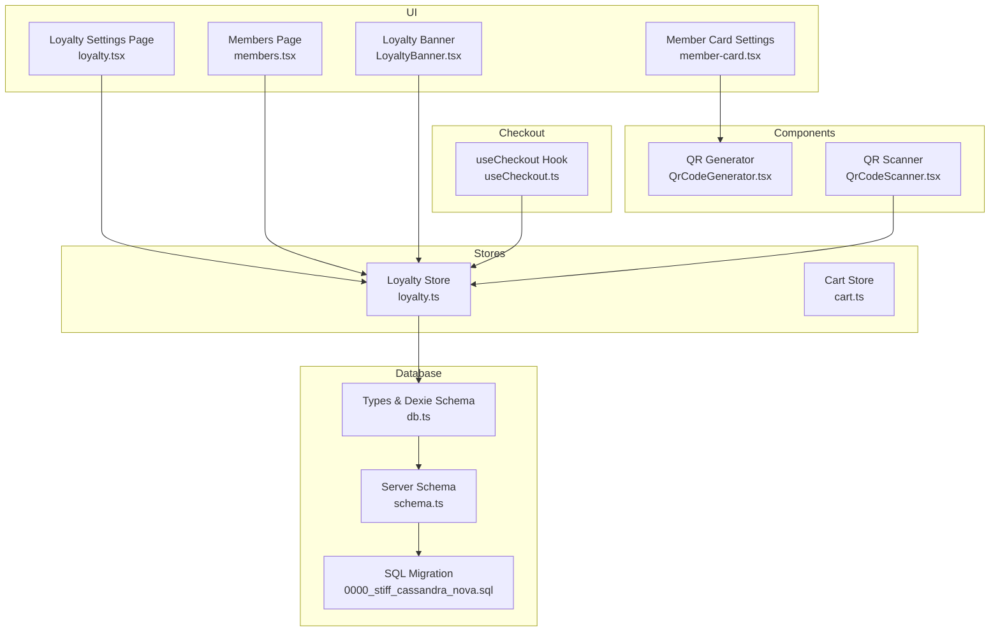
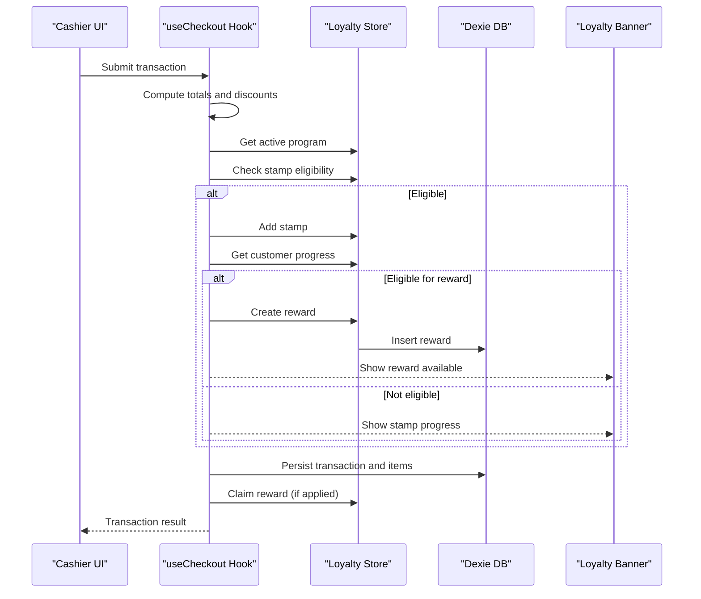
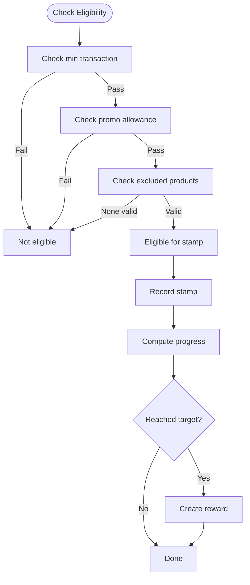
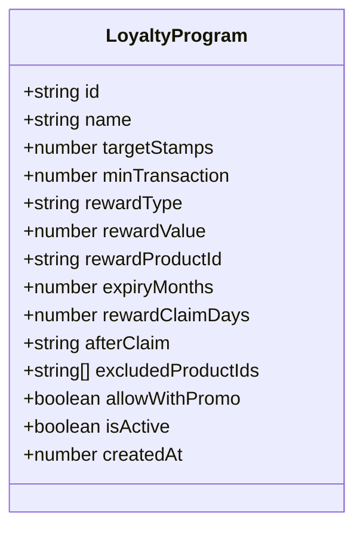
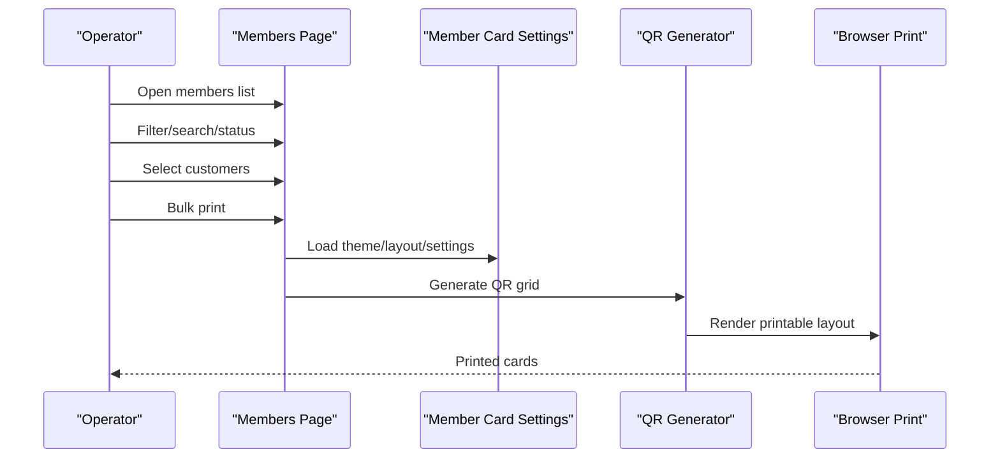
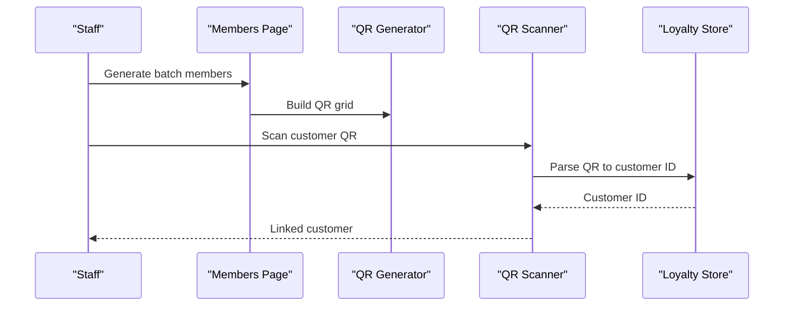
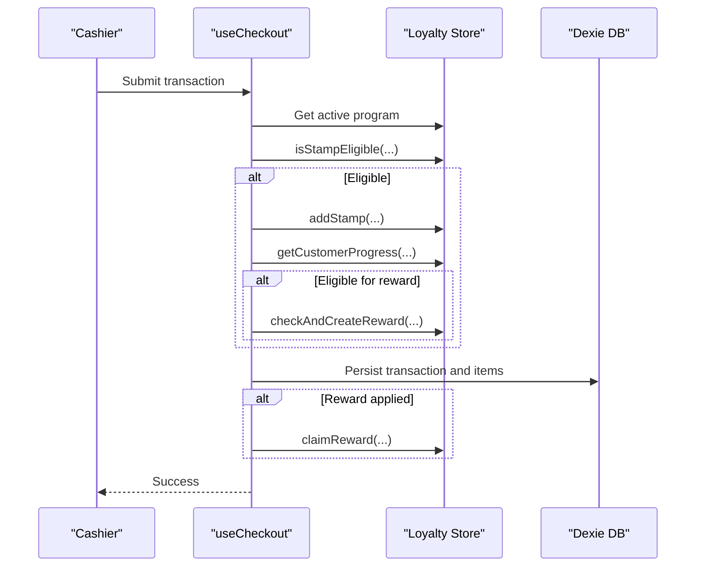
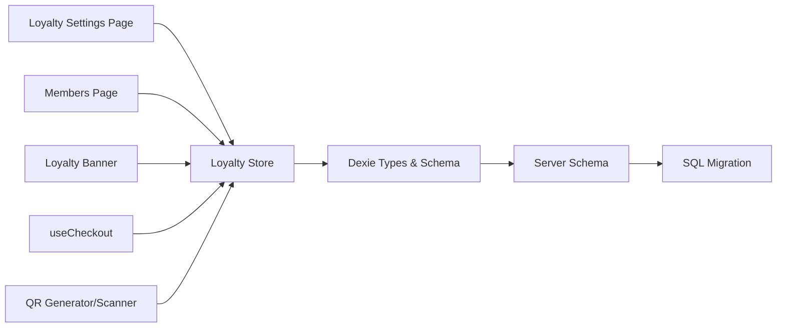
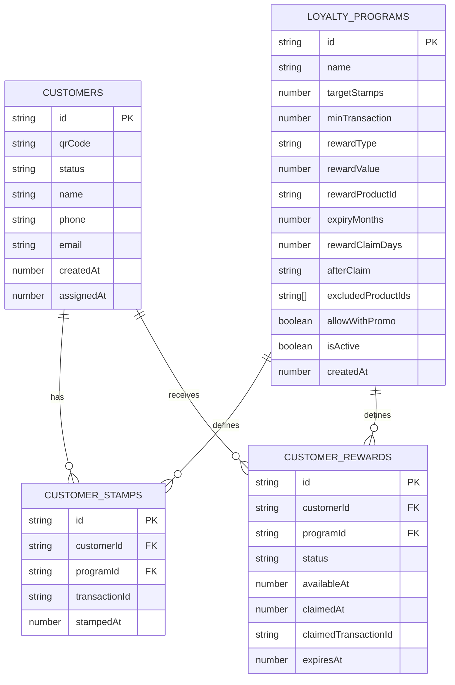

# Loyalty Program

<cite>
**Referenced Files in This Document**
- [loyalty.ts](file://src/stores/loyalty.ts)
- [loyalty.tsx](file://src/routes/app/marketing/loyalty.tsx)
- [members.tsx](file://src/routes/app/marketing/members.tsx)
- [member-card.tsx](file://src/routes/app/marketing/member-card.tsx)
- [LoyaltyBanner.tsx](file://src/components/LoyaltyBanner.tsx)
- [QrCodeGenerator.tsx](file://src/components/QrCodeGenerator.tsx)
- [QrCodeScanner.tsx](file://src/components/QrCodeScanner.tsx)
- [useCheckout.ts](file://src/hooks/useCheckout.ts)
- [cart.ts](file://src/stores/cart.ts)
- [db.ts](file://src/db/db.ts)
- [schema.ts](file://src/server/db/schema.ts)
- [0000_stiff_cassandra_nova.sql](file://drizzle/0000_stiff_cassandra_nova.sql)
</cite>

## Table of Contents
1. [Introduction](#introduction)
2. [Project Structure](#project-structure)
3. [Core Components](#core-components)
4. [Architecture Overview](#architecture-overview)
5. [Detailed Component Analysis](#detailed-component-analysis)
6. [Dependency Analysis](#dependency-analysis)
7. [Performance Considerations](#performance-considerations)
8. [Troubleshooting Guide](#troubleshooting-guide)
9. [Conclusion](#conclusion)
10. [Appendices](#appendices)

## Introduction
This document describes the stamp-based loyalty program system in NgePos. It covers how customer stamps are tracked, how rewards accumulate and are redeemed, and how the system integrates with the POS checkout. It also documents configuration options for loyalty programs, the member card generation and QR code workflow, and the underlying database schema. Practical examples and troubleshooting guidance are included to help operators configure and maintain effective loyalty campaigns.

## Project Structure
The loyalty system spans several layers:
- UI pages for managing loyalty programs, members, and member cards
- Store modules for business logic (eligibility checks, stamp progression, reward lifecycle)
- Components for QR generation, scanning, and the loyalty banner
- Checkout integration to record stamps and apply rewards
- Database schema for local storage and server-side persistence

**Diagram sources**
- [loyalty.tsx:24-464](file://src/routes/app/marketing/loyalty.tsx#L24-L464)
- [members.tsx:34-791](file://src/routes/app/marketing/members.tsx#L34-L791)
- [member-card.tsx:8-283](file://src/routes/app/marketing/member-card.tsx#L8-L283)
- [LoyaltyBanner.tsx:24-167](file://src/components/LoyaltyBanner.tsx#L24-L167)
- [QrCodeGenerator.tsx:12-222](file://src/components/QrCodeGenerator.tsx#L12-L222)
- [QrCodeScanner.tsx:17-157](file://src/components/QrCodeScanner.tsx#L17-L157)
- [useCheckout.ts:30-217](file://src/hooks/useCheckout.ts#L30-L217)
- [cart.ts:1-257](file://src/stores/cart.ts#L1-L257)
- [db.ts:218-498](file://src/db/db.ts#L218-L498)
- [schema.ts:1-142](file://src/server/db/schema.ts#L1-L142)
- [0000_stiff_cassandra_nova.sql:1-64](file://drizzle/0000_stiff_cassandra_nova.sql#L1-L64)

**Section sources**
- [loyalty.tsx:24-464](file://src/routes/app/marketing/loyalty.tsx#L24-L464)
- [members.tsx:34-791](file://src/routes/app/marketing/members.tsx#L34-L791)
- [member-card.tsx:8-283](file://src/routes/app/marketing/member-card.tsx#L8-L283)
- [LoyaltyBanner.tsx:24-167](file://src/components/LoyaltyBanner.tsx#L24-L167)
- [QrCodeGenerator.tsx:12-222](file://src/components/QrCodeGenerator.tsx#L12-L222)
- [QrCodeScanner.tsx:17-157](file://src/components/QrCodeScanner.tsx#L17-L157)
- [useCheckout.ts:30-217](file://src/hooks/useCheckout.ts#L30-L217)
- [cart.ts:1-257](file://src/stores/cart.ts#L1-L257)
- [db.ts:218-498](file://src/db/db.ts#L218-L498)
- [schema.ts:1-142](file://src/server/db/schema.ts#L1-L142)
- [0000_stiff_cassandra_nova.sql:1-64](file://drizzle/0000_stiff_cassandra_nova.sql#L1-L64)

## Core Components
- Loyalty Store: Handles active program retrieval, stamp eligibility, progress calculation, stamp recording, reward creation, reward claiming, and stamp reset logic.
- Loyalty Settings Page: Allows creating, editing, activating/deactivating, and deleting loyalty programs with configurable parameters.
- Members Page: Manages customer records, assigns/unassigns members, prints member cards, and displays stamp progress.
- Member Card Settings: Configures print layout, theme, and stamp visualization for member cards.
- Loyalty Banner: Displays customer progress, available rewards, and expiry warnings in the POS UI.
- QR Components: Generate QR codes for member cards and scan QR codes to link customers to transactions.
- Checkout Integration: Records stamps, creates rewards, applies rewards to transactions, and resets stamps when configured.

Key configuration parameters:
- Target stamps: Number of stamps required to earn a reward.
- Minimum transaction: Threshold transaction amount to qualify for stamps.
- Reward type/value: FREE_PRODUCT, PERCENT_DISCOUNT, or FIXED_DISCOUNT with associated value.
- Expiry months: Months after stamp date when stamps expire.
- Reward claim days: Days a reward remains available after becoming eligible.
- After claim behavior: RESET or COMPLETE (resets stamps after claim).
- Allow with promo: Whether purchases with discounts still earn stamps.
- Excluded product IDs: Products that do not qualify for stamps.

**Section sources**
- [loyalty.ts:28-173](file://src/stores/loyalty.ts#L28-L173)
- [loyalty.tsx:44-95](file://src/routes/app/marketing/loyalty.tsx#L44-L95)
- [members.tsx:56-83](file://src/routes/app/marketing/members.tsx#L56-L83)
- [member-card.tsx:22-73](file://src/routes/app/marketing/member-card.tsx#L22-L73)
- [LoyaltyBanner.tsx:24-167](file://src/components/LoyaltyBanner.tsx#L24-L167)
- [QrCodeGenerator.tsx:12-222](file://src/components/QrCodeGenerator.tsx#L12-L222)
- [QrCodeScanner.tsx:17-157](file://src/components/QrCodeScanner.tsx#L17-L157)
- [useCheckout.ts:30-217](file://src/hooks/useCheckout.ts#L30-L217)

## Architecture Overview
The system follows a store-driven architecture with UI pages orchestrating user actions, stores encapsulating business logic, and components handling presentation and I/O. The checkout hook coordinates stamp eligibility, stamp recording, reward creation, and reward application.

**Diagram sources**
- [useCheckout.ts:38-205](file://src/hooks/useCheckout.ts#L38-L205)
- [loyalty.ts:28-173](file://src/stores/loyalty.ts#L28-L173)
- [LoyaltyBanner.tsx:24-167](file://src/components/LoyaltyBanner.tsx#L24-L167)

**Section sources**
- [useCheckout.ts:30-217](file://src/hooks/useCheckout.ts#L30-L217)
- [loyalty.ts:28-173](file://src/stores/loyalty.ts#L28-L173)
- [LoyaltyBanner.tsx:24-167](file://src/components/LoyaltyBanner.tsx#L24-L167)

## Detailed Component Analysis

### Loyalty Store: Eligibility, Progress, Rewards, and Resets
- Active program retrieval: Returns the single active program (only one active program allowed).
- Stamp eligibility: Enforces minimum transaction, promo allowance, and excluded products rules.
- Progress calculation: Computes current stamps, target, eligibility, oldest stamp date, and expiry timestamp.
- Stamp recording: Adds a new stamp tied to a transaction.
- Reward creation: Creates a reward when the customer reaches the target stamps.
- Reward claiming: Marks a reward as claimed and optionally resets stamps.
- Stamp reset: Removes all unexpired stamps for a customer-program pair.

**Diagram sources**
- [loyalty.ts:36-95](file://src/stores/loyalty.ts#L36-L95)

**Section sources**
- [loyalty.ts:28-173](file://src/stores/loyalty.ts#L28-L173)

### Loyalty Settings Page: Program Management
- Provides form to configure program name, target stamps, minimum transaction, reward type/value, expiry, claim days, after-claim behavior, excluded products, promo allowance, and activation.
- Enforces that only one program can be active at a time by deactivating others upon activation.
- Supports saving, deleting, and listing programs.

**Diagram sources**
- [db.ts:232-247](file://src/db/db.ts#L232-L247)
- [loyalty.tsx:44-95](file://src/routes/app/marketing/loyalty.tsx#L44-L95)

**Section sources**
- [loyalty.tsx:24-464](file://src/routes/app/marketing/loyalty.tsx#L24-L464)
- [db.ts:232-247](file://src/db/db.ts#L232-L247)

### Members Page: Customer Management and Member Cards
- Lists customers with filtering by status and search.
- Allows assigning/unassigning members, bulk printing member cards, and viewing stamp progress.
- Integrates with member card settings to print according to chosen theme/layout.

**Diagram sources**
- [members.tsx:56-83](file://src/routes/app/marketing/members.tsx#L56-L83)
- [member-card.tsx:22-73](file://src/routes/app/marketing/member-card.tsx#L22-L73)
- [QrCodeGenerator.tsx:76-222](file://src/components/QrCodeGenerator.tsx#L76-L222)

**Section sources**
- [members.tsx:34-791](file://src/routes/app/marketing/members.tsx#L34-L791)
- [member-card.tsx:8-283](file://src/routes/app/marketing/member-card.tsx#L8-L283)
- [QrCodeGenerator.tsx:12-222](file://src/components/QrCodeGenerator.tsx#L12-L222)

### Member Card Generation and QR Workflow
- QR generation: Creates QR codes for member IDs with standardized format and supports printing layouts.
- QR scanning: Parses scanned QR strings to extract customer IDs for linking transactions.
- Member card customization: Themes, layouts, and stamp visualization toggles.

**Diagram sources**
- [QrCodeGenerator.tsx:12-222](file://src/components/QrCodeGenerator.tsx#L12-L222)
- [QrCodeScanner.tsx:17-157](file://src/components/QrCodeScanner.tsx#L17-L157)
- [loyalty.ts:17-23](file://src/stores/loyalty.ts#L17-L23)

**Section sources**
- [QrCodeGenerator.tsx:12-222](file://src/components/QrCodeGenerator.tsx#L12-L222)
- [QrCodeScanner.tsx:17-157](file://src/components/QrCodeScanner.tsx#L17-L157)
- [loyalty.ts:6-23](file://src/stores/loyalty.ts#L6-L23)

### Checkout Integration: Stamp Recording, Reward Creation, and Redemption
- Computes cart totals and discounts.
- Checks stamp eligibility against the active program.
- Records stamps and updates progress; creates rewards when target is reached.
- Applies rewards to the transaction and claims them.
- Triggers background sync after successful checkout.

**Diagram sources**
- [useCheckout.ts:38-205](file://src/hooks/useCheckout.ts#L38-L205)
- [loyalty.ts:36-173](file://src/stores/loyalty.ts#L36-L173)

**Section sources**
- [useCheckout.ts:30-217](file://src/hooks/useCheckout.ts#L30-L217)
- [cart.ts:132-236](file://src/stores/cart.ts#L132-L236)
- [loyalty.ts:36-173](file://src/stores/loyalty.ts#L36-L173)

### Loyalty Banner: Real-time Progress and Rewards
- Displays customer name and ID, current stamps vs target, progress bar, available rewards, and expiry warning.
- Enables applying or removing a reward during checkout.

**Section sources**
- [LoyaltyBanner.tsx:24-167](file://src/components/LoyaltyBanner.tsx#L24-L167)
- [cart.ts:13-14](file://src/stores/cart.ts#L13-L14)

## Dependency Analysis
- UI pages depend on the Loyalty Store for program and progress data.
- The checkout hook depends on the Loyalty Store for eligibility checks, stamp recording, reward creation, and claiming.
- QR components depend on the Loyalty Store for parsing QR strings and on the Member Card Settings for print configuration.
- Database types and Dexie schema define the data model; server schema and migration files define server-side tables.

**Diagram sources**
- [loyalty.tsx:24-464](file://src/routes/app/marketing/loyalty.tsx#L24-L464)
- [members.tsx:34-791](file://src/routes/app/marketing/members.tsx#L34-L791)
- [LoyaltyBanner.tsx:24-167](file://src/components/LoyaltyBanner.tsx#L24-L167)
- [useCheckout.ts:30-217](file://src/hooks/useCheckout.ts#L30-L217)
- [QrCodeGenerator.tsx:12-222](file://src/components/QrCodeGenerator.tsx#L12-L222)
- [QrCodeScanner.tsx:17-157](file://src/components/QrCodeScanner.tsx#L17-L157)
- [db.ts:218-498](file://src/db/db.ts#L218-L498)
- [schema.ts:1-142](file://src/server/db/schema.ts#L1-L142)
- [0000_stiff_cassandra_nova.sql:1-64](file://drizzle/0000_stiff_cassandra_nova.sql#L1-L64)

**Section sources**
- [db.ts:218-498](file://src/db/db.ts#L218-L498)
- [schema.ts:1-142](file://src/server/db/schema.ts#L1-L142)
- [0000_stiff_cassandra_nova.sql:1-64](file://drizzle/0000_stiff_cassandra_nova.sql#L1-L64)

## Performance Considerations
- Stamp expiration: Expired stamps are filtered out by computing an expiry threshold based on months; ensure indexes on timestamps for efficient filtering.
- Reward lifecycle: Creating rewards is triggered after reaching the target; consider batching reward creation if many customers reach the target simultaneously.
- Printing: QR print grids support horizontal and vertical layouts; choose layout based on printer capabilities and paper size to reduce wasted space.
- UI responsiveness: Use resource loading states and lazy initialization for QR scanners to avoid blocking the UI.

## Troubleshooting Guide
Common issues and resolutions:
- Multiple active programs: Only one program can be active. Activating a new program automatically deactivates others.
- No stamps recorded: Verify minimum transaction threshold, promo allowance setting, and excluded products.
- Reward not created: Ensure the customer has reached the target stamps and that the program is active.
- Reward not applied: Confirm the reward is AVAILABLE and not expired; ensure the reward is applied in the cart before checkout.
- QR scanning fails: Ensure proper lighting and camera permissions; verify QR format matches the expected pattern.
- Printing issues: Adjust print settings and margins; use the preview panel to validate layout and theme.

**Section sources**
- [loyalty.tsx:73-78](file://src/routes/app/marketing/loyalty.tsx#L73-L78)
- [useCheckout.ts:174-205](file://src/hooks/useCheckout.ts#L174-L205)
- [QrCodeScanner.tsx:22-58](file://src/components/QrCodeScanner.tsx#L22-L58)
- [member-card.tsx:58-73](file://src/routes/app/marketing/member-card.tsx#L58-L73)

## Conclusion
NgePos provides a robust stamp-based loyalty system with clear configuration options, real-time progress tracking, and seamless checkout integration. Operators can easily set up different reward types, manage active programs, and engage customers through QR-enabled member cards. The system’s modular design ensures maintainability and scalability for future enhancements.

## Appendices

### Database Schema for Loyalty Entities
- Customers: Stores member profiles and QR codes.
- Loyalty Programs: Defines program rules and reward configuration.
- Customer Stamps: Tracks stamps per customer and program.
- Customer Rewards: Manages reward lifecycle and claims.

**Diagram sources**
- [db.ts:220-266](file://src/db/db.ts#L220-L266)

**Section sources**
- [db.ts:220-266](file://src/db/db.ts#L220-L266)

### Practical Examples

- Setting up a free product reward:
  - Configure reward type as FREE_PRODUCT and select a reward product.
  - Set target stamps to the desired threshold.
  - Activate the program; only one program can be active at a time.

- Setting up a percentage discount reward:
  - Choose PERCENT_DISCOUNT as reward type.
  - Enter the discount percentage value.
  - Set minimum transaction and target stamps appropriately.

- Managing active programs:
  - Deactivate old programs before activating new ones.
  - Use the program list to review statuses and update configurations.

- Customer stamp management:
  - Use the Members page to filter by status and view stamp progress.
  - Print member cards with QR codes for customer engagement.

- Integration with POS checkout:
  - Eligibility checks occur automatically during checkout.
  - Rewards can be applied and claimed during the same transaction.

**Section sources**
- [loyalty.tsx:44-95](file://src/routes/app/marketing/loyalty.tsx#L44-L95)
- [members.tsx:56-83](file://src/routes/app/marketing/members.tsx#L56-L83)
- [useCheckout.ts:174-205](file://src/hooks/useCheckout.ts#L174-L205)
- [LoyaltyBanner.tsx:44-52](file://src/components/LoyaltyBanner.tsx#L44-L52)