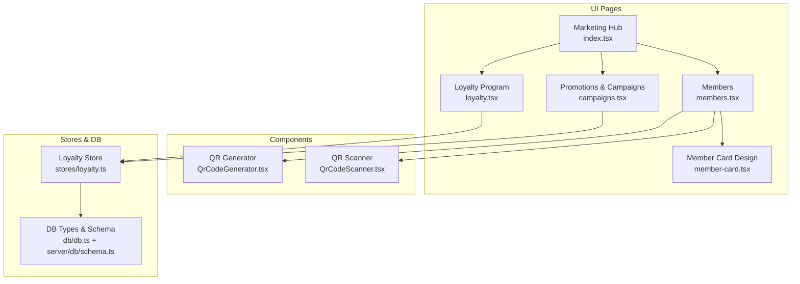
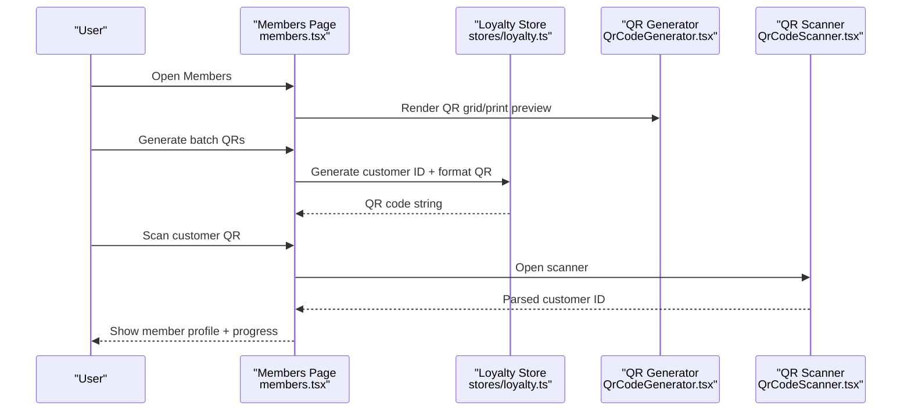
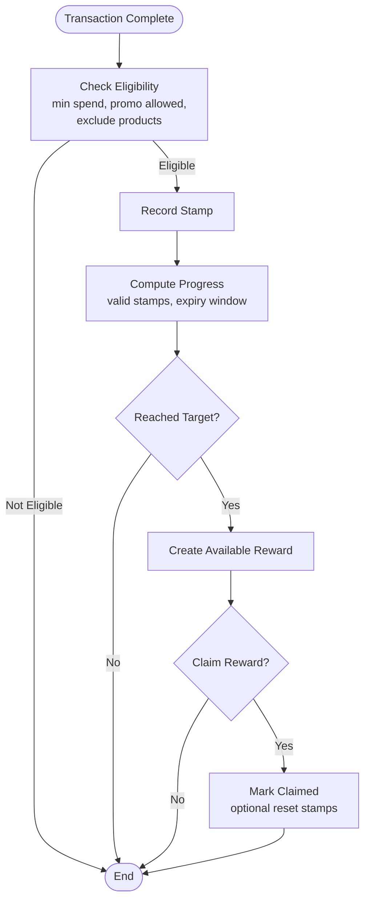
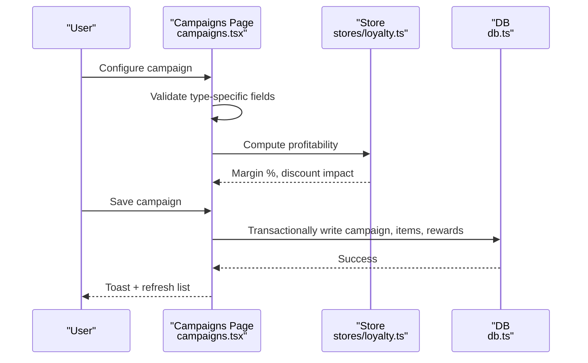
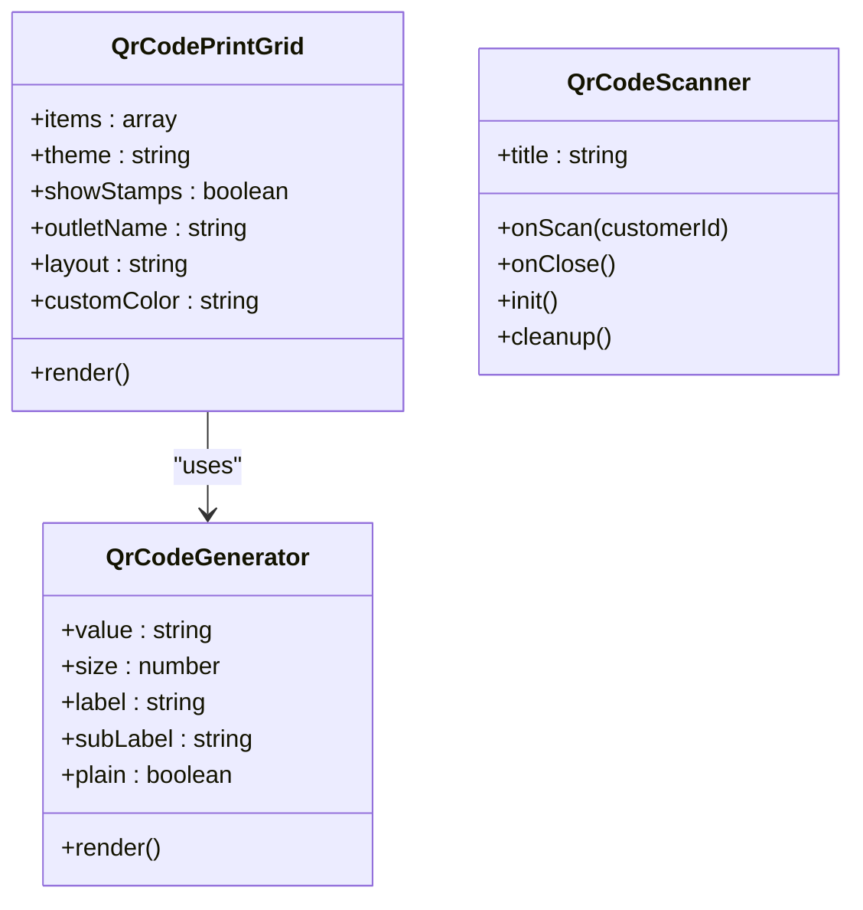
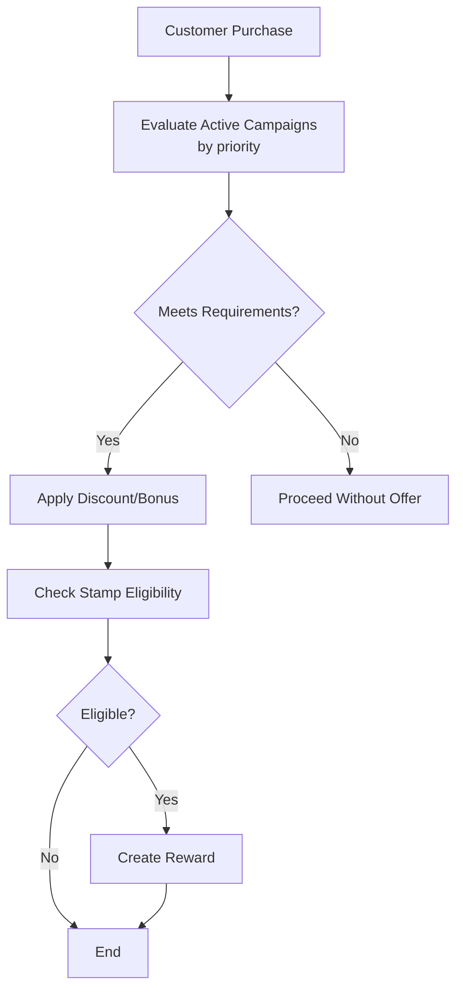
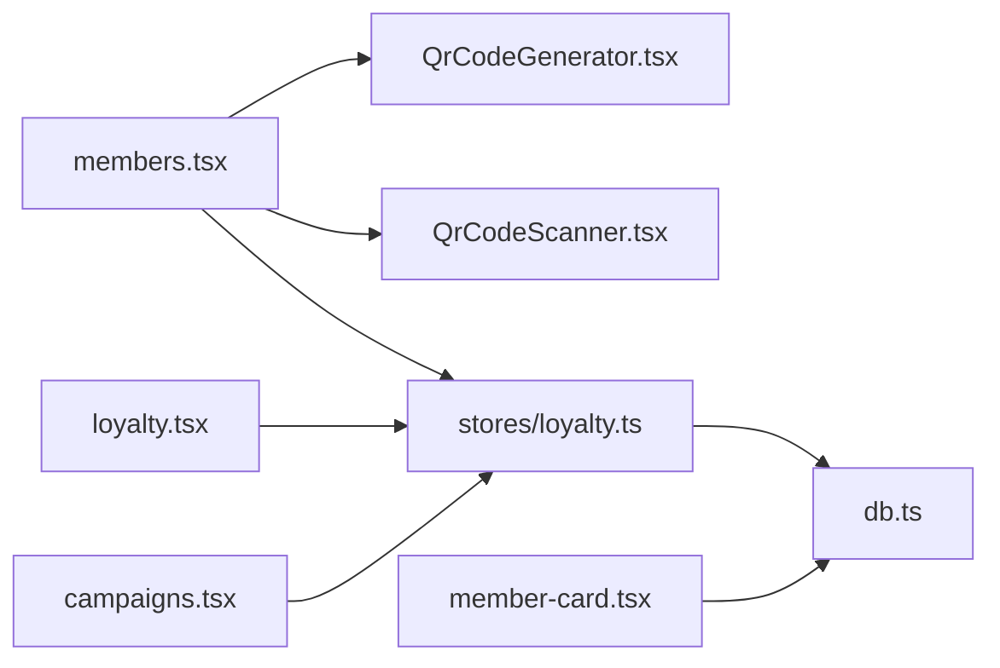

# Marketing & Loyalty

<cite>
**Referenced Files in This Document**
- [loyalty.tsx](file://src/routes/app/marketing/loyalty.tsx)
- [campaigns.tsx](file://src/routes/app/marketing/campaigns.tsx)
- [members.tsx](file://src/routes/app/marketing/members.tsx)
- [member-card.tsx](file://src/routes/app/marketing/member-card.tsx)
- [index.tsx](file://src/routes/app/marketing/index.tsx)
- [QrCodeGenerator.tsx](file://src/components/QrCodeGenerator.tsx)
- [QrCodeScanner.tsx](file://src/components/QrCodeScanner.tsx)
- [loyalty.ts](file://src/stores/loyalty.ts)
- [db.ts](file://src/db/db.ts)
- [schema.ts](file://src/server/db/schema.ts)
</cite>

## Table of Contents
1. [Introduction](#introduction)
2. [Project Structure](#project-structure)
3. [Core Components](#core-components)
4. [Architecture Overview](#architecture-overview)
5. [Detailed Component Analysis](#detailed-component-analysis)
6. [Dependency Analysis](#dependency-analysis)
7. [Performance Considerations](#performance-considerations)
8. [Troubleshooting Guide](#troubleshooting-guide)
9. [Conclusion](#conclusion)
10. [Appendices](#appendices)

## Introduction
This document explains the marketing and loyalty capabilities implemented in the NgePos POS system. It covers:
- Stamp-based loyalty program: customer progress tracking, reward management, and member card generation
- Promotional campaign management: discount systems, bundle configuration, and campaign rewards
- QR code generation and scanning for customer engagement, digital marketing integration, and social sharing
- Customer segmentation, personalized offers, and marketing automation
- Practical examples and workflows for setup and engagement
- Analytics, ROI tracking, and customer retention strategies

## Project Structure
The marketing and loyalty features are organized under the marketing hub with dedicated pages and shared components:
- Marketing Hub: navigation and quick access to members, loyalty, and campaigns
- Members: customer database, QR generation, printing, and progress tracking
- Loyalty: stamp-based program configuration and reward lifecycle
- Campaigns: promotional campaigns with profitability analysis
- QR Components: QR generator and scanner for engagement
- Stores and DB: centralized logic and schema for loyalty and campaigns

**Diagram sources**
- [index.tsx:20-45](file://src/routes/app/marketing/index.tsx#L20-L45)
- [members.tsx:1-791](file://src/routes/app/marketing/members.tsx#L1-L791)
- [loyalty.tsx:1-464](file://src/routes/app/marketing/loyalty.tsx#L1-L464)
- [campaigns.tsx:1-1126](file://src/routes/app/marketing/campaigns.tsx#L1-L1126)
- [member-card.tsx:1-283](file://src/routes/app/marketing/member-card.tsx#L1-L283)
- [QrCodeGenerator.tsx:1-222](file://src/components/QrCodeGenerator.tsx#L1-L222)
- [QrCodeScanner.tsx:1-157](file://src/components/QrCodeScanner.tsx#L1-L157)
- [loyalty.ts:1-174](file://src/stores/loyalty.ts#L1-L174)
- [db.ts:218-267](file://src/db/db.ts#L218-L267)
- [schema.ts:28-32](file://src/server/db/schema.ts#L28-L32)

**Section sources**
- [index.tsx:1-109](file://src/routes/app/marketing/index.tsx#L1-L109)
- [db.ts:268-496](file://src/db/db.ts#L268-L496)
- [schema.ts:28-32](file://src/server/db/schema.ts#L28-L32)

## Core Components
- Marketing Hub: central navigation to members, loyalty, and campaigns
- Members: manage customer profiles, QR generation/printing, and progress visualization
- Loyalty Program: configure stamp targets, minimum spend, reward types, and lifecycle
- Campaigns: define bulk discounts, bundles, and buy-x-get-y promotions with profitability analysis
- QR Generator/Scanner: generate printable QR cards and scan customer QRs for engagement
- Loyalty Store: eligibility checks, stamp recording, reward creation, and claim/reset logic
- Database Types: strongly typed models for campaigns, loyalty, and customers

**Section sources**
- [index.tsx:20-45](file://src/routes/app/marketing/index.tsx#L20-L45)
- [members.tsx:34-791](file://src/routes/app/marketing/members.tsx#L34-L791)
- [loyalty.tsx:24-464](file://src/routes/app/marketing/loyalty.tsx#L24-L464)
- [campaigns.tsx:43-1126](file://src/routes/app/marketing/campaigns.tsx#L43-L1126)
- [QrCodeGenerator.tsx:1-222](file://src/components/QrCodeGenerator.tsx#L1-L222)
- [QrCodeScanner.tsx:1-157](file://src/components/QrCodeScanner.tsx#L1-L157)
- [loyalty.ts:1-174](file://src/stores/loyalty.ts#L1-L174)
- [db.ts:218-267](file://src/db/db.ts#L218-L267)

## Architecture Overview
The system integrates UI pages with local storage (Dexie) and a small set of shared stores for business logic. QR generation and scanning are handled by dedicated components. Campaigns and loyalty leverage a transaction-aware store to compute profitability and eligibility.

**Diagram sources**
- [members.tsx:151-178](file://src/routes/app/marketing/members.tsx#L151-L178)
- [QrCodeGenerator.tsx:12-65](file://src/components/QrCodeGenerator.tsx#L12-L65)
- [QrCodeScanner.tsx:17-58](file://src/components/QrCodeScanner.tsx#L17-L58)
- [loyalty.ts:6-23](file://src/stores/loyalty.ts#L6-L23)

**Section sources**
- [members.tsx:151-178](file://src/routes/app/marketing/members.tsx#L151-L178)
- [QrCodeGenerator.tsx:12-65](file://src/components/QrCodeGenerator.tsx#L12-L65)
- [QrCodeScanner.tsx:17-58](file://src/components/QrCodeScanner.tsx#L17-L58)
- [loyalty.ts:6-23](file://src/stores/loyalty.ts#L6-L23)

## Detailed Component Analysis

### Stamp-Based Loyalty Program
- Configuration: name, target stamps, minimum spend, reward type/value, expiry, claim period, and reset behavior
- Eligibility: checks minimum spend, whether discount was applied, excluded products, and active program
- Progress: counts valid stamps within expiry window, oldest stamp date, and reward eligibility
- Rewards: auto-create reward when threshold met, mark as claimed, optional reset of stamps

**Diagram sources**
- [loyalty.ts:36-53](file://src/stores/loyalty.ts#L36-L53)
- [loyalty.ts:66-95](file://src/stores/loyalty.ts#L66-L95)
- [loyalty.ts:117-138](file://src/stores/loyalty.ts#L117-L138)
- [loyalty.ts:143-160](file://src/stores/loyalty.ts#L143-L160)

**Section sources**
- [loyalty.tsx:24-118](file://src/routes/app/marketing/loyalty.tsx#L24-L118)
- [loyalty.ts:36-174](file://src/stores/loyalty.ts#L36-L174)
- [db.ts:232-247](file://src/db/db.ts#L232-L247)

### Promotional Campaign Management
- Types: Bulk discount, bundle (fixed discount), buy-x-get-y (free product)
- Configuration: campaign header (name, status, priority), requirements/targets, reward type/value/product
- Profitability: revenue, COGS, discount, and margin percent computed before saving
- UI: form sheets, summary preview, and campaign list with status

**Diagram sources**
- [campaigns.tsx:107-158](file://src/routes/app/marketing/campaigns.tsx#L107-L158)
- [campaigns.tsx:214-304](file://src/routes/app/marketing/campaigns.tsx#L214-L304)
- [db.ts:191-216](file://src/db/db.ts#L191-L216)
- [loyalty.ts:1-174](file://src/stores/loyalty.ts#L1-L174)

**Section sources**
- [campaigns.tsx:43-320](file://src/routes/app/marketing/campaigns.tsx#L43-L320)
- [db.ts:191-216](file://src/db/db.ts#L191-L216)
- [loyalty.ts:1-174](file://src/stores/loyalty.ts#L1-L174)

### QR Code Generation and Scanning
- QR Generator: renders QR canvas with configurable size and labels; supports print grid layouts
- QR Scanner: camera-based scanner with overlay and parsing of customer IDs
- Member Card Settings: theme selection, layout orientation, and stamp column toggle for printed cards

**Diagram sources**
- [QrCodeGenerator.tsx:4-65](file://src/components/QrCodeGenerator.tsx#L4-L65)
- [QrCodeGenerator.tsx:67-222](file://src/components/QrCodeGenerator.tsx#L67-L222)
- [QrCodeScanner.tsx:7-15](file://src/components/QrCodeScanner.tsx#L7-L15)
- [member-card.tsx:8-73](file://src/routes/app/marketing/member-card.tsx#L8-L73)

**Section sources**
- [QrCodeGenerator.tsx:1-222](file://src/components/QrCodeGenerator.tsx#L1-L222)
- [QrCodeScanner.tsx:1-157](file://src/components/QrCodeScanner.tsx#L1-L157)
- [member-card.tsx:1-283](file://src/routes/app/marketing/member-card.tsx#L1-L283)

### Customer Segmentation, Personalized Offers, and Automation
- Segmentation: filter members by assignment status and search by name/phone/QR
- Personalized offers: campaigns apply automatically based on requirements and priority
- Automation: stamp eligibility and reward creation are automatic upon qualifying transactions

**Diagram sources**
- [campaigns.tsx:214-304](file://src/routes/app/marketing/campaigns.tsx#L214-L304)
- [loyalty.ts:36-53](file://src/stores/loyalty.ts#L36-L53)
- [loyalty.ts:117-138](file://src/stores/loyalty.ts#L117-L138)

**Section sources**
- [members.tsx:85-102](file://src/routes/app/marketing/members.tsx#L85-L102)
- [campaigns.tsx:214-304](file://src/routes/app/marketing/campaigns.tsx#L214-L304)
- [loyalty.ts:36-138](file://src/stores/loyalty.ts#L36-L138)

## Dependency Analysis
- UI pages depend on shared stores for business logic and on components for QR rendering/scanning
- Campaigns and loyalty rely on Dexie tables for persistence; campaigns use a transactional write pattern
- Member card settings persist design preferences to the settings table

**Diagram sources**
- [members.tsx:1-791](file://src/routes/app/marketing/members.tsx#L1-L791)
- [loyalty.tsx:1-464](file://src/routes/app/marketing/loyalty.tsx#L1-L464)
- [campaigns.tsx:1-1126](file://src/routes/app/marketing/campaigns.tsx#L1-L1126)
- [member-card.tsx:1-283](file://src/routes/app/marketing/member-card.tsx#L1-L283)
- [QrCodeGenerator.tsx:1-222](file://src/components/QrCodeGenerator.tsx#L1-L222)
- [QrCodeScanner.tsx:1-157](file://src/components/QrCodeScanner.tsx#L1-L157)
- [loyalty.ts:1-174](file://src/stores/loyalty.ts#L1-L174)
- [db.ts:268-496](file://src/db/db.ts#L268-L496)

**Section sources**
- [db.ts:268-496](file://src/db/db.ts#L268-L496)
- [schema.ts:28-32](file://src/server/db/schema.ts#L28-L32)

## Performance Considerations
- QR generation uses lazy import to reduce initial bundle size
- Campaign profitability computation runs client-side for immediate feedback; keep product lists manageable
- Stamp expiry filtering ensures only valid stamps are considered, preventing unbounded scans
- Batch operations: bulk add for QR generation and bulk delete for reward resets improve responsiveness

## Troubleshooting Guide
- QR Scanner fails to initialize: camera permission denied or unsupported device; ensure HTTPS and try another browser/device
- Scanned QR not recognized: verify QR quality, lighting, and that the scanned string matches expected format
- Campaign save errors: check required fields per type and ensure transactional writes succeed
- No stamps recorded: verify minimum spend, discount-applied setting, and excluded products
- Member progress shows zero: confirm active program and that stamps are within expiry window

**Section sources**
- [QrCodeScanner.tsx:22-65](file://src/components/QrCodeScanner.tsx#L22-L65)
- [campaigns.tsx:214-304](file://src/routes/app/marketing/campaigns.tsx#L214-L304)
- [loyalty.ts:36-53](file://src/stores/loyalty.ts#L36-L53)

## Conclusion
NgePos provides a practical, integrated toolkit for marketing and loyalty:
- Stamp-based loyalty with clear eligibility rules and automated reward lifecycle
- Flexible promotional campaigns with profitability insights
- QR-driven engagement for member onboarding and in-store interactions
- Strong foundations for segmentation, personalization, and retention

## Appendices

### Practical Examples

- Setup a stamp-based loyalty program
  - Navigate to the Loyalty Program page, configure target stamps, minimum spend, reward type/value, and activation status
  - Save; only one program can be active at a time
  - Example path: [loyalty.tsx:24-118](file://src/routes/app/marketing/loyalty.tsx#L24-L118)

- Configure a promotional campaign
  - Choose campaign type (bulk discount, bundle, buy-x-get-y)
  - Define requirements/targets and reward configuration
  - Review profitability analysis and save
  - Example path: [campaigns.tsx:43-320](file://src/routes/app/marketing/campaigns.tsx#L43-L320)

- Engage customers via QR
  - Generate QR batches from the Members page and print member cards
  - Use the QR scanner to quickly identify members and view progress
  - Example path: [members.tsx:151-178](file://src/routes/app/marketing/members.tsx#L151-L178), [QrCodeScanner.tsx:17-58](file://src/components/QrCodeScanner.tsx#L17-L58)

- Customize member card design
  - Adjust theme, layout, and stamp column visibility
  - Save settings to persist across sessions
  - Example path: [member-card.tsx:58-73](file://src/routes/app/marketing/member-card.tsx#L58-L73)

### Analytics, ROI Tracking, and Retention Strategies
- ROI tracking
  - Use the built-in profitability analysis to estimate margin and discount impact before launching campaigns
  - Monitor campaign effectiveness by reviewing active campaigns and their priority
  - Example path: [campaigns.tsx:107-158](file://src/routes/app/marketing/campaigns.tsx#L107-L158), [campaigns.tsx:921-994](file://src/routes/app/marketing/campaigns.tsx#L921-L994)

- Customer retention
  - Automate stamp accumulation and reward creation to encourage repeat visits
  - Segment members by assignment status and search to target inactive customers
  - Example path: [members.tsx:85-102](file://src/routes/app/marketing/members.tsx#L85-L102), [loyalty.ts:117-138](file://src/stores/loyalty.ts#L117-L138)