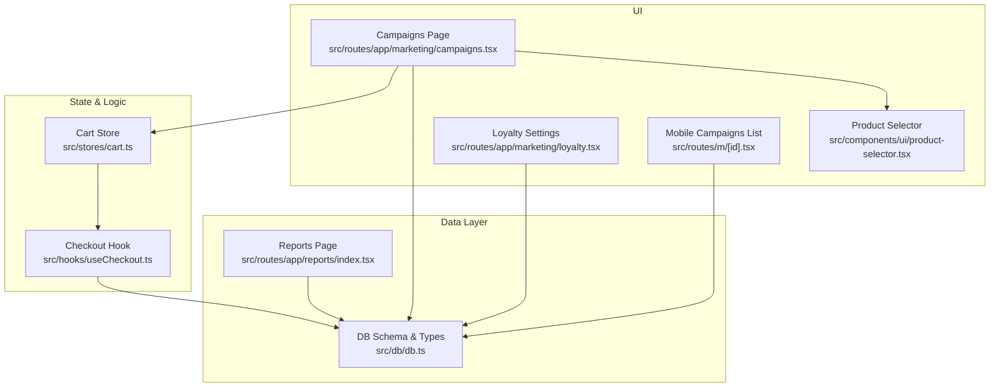
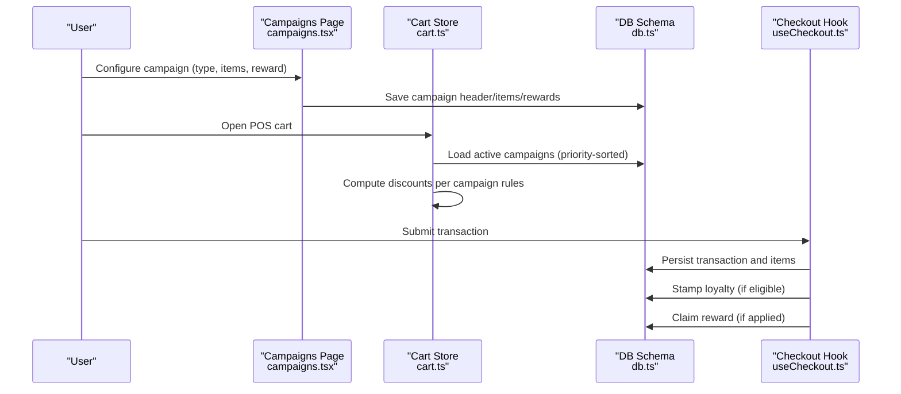
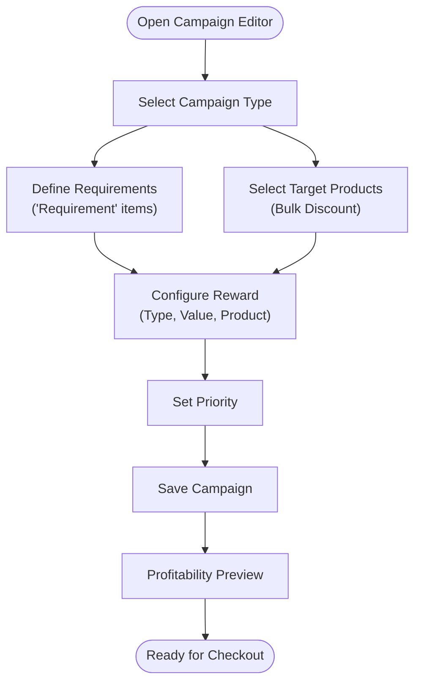
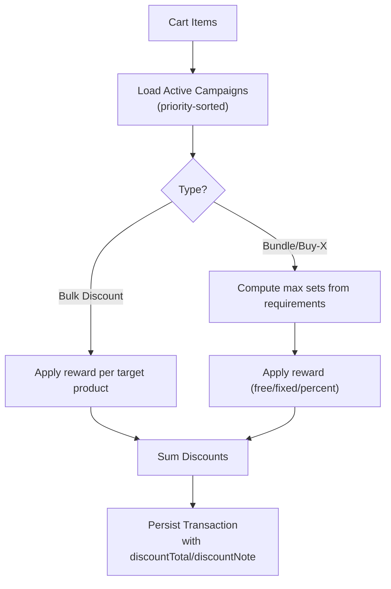
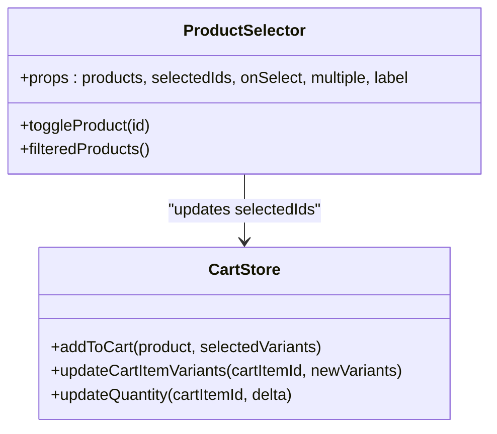
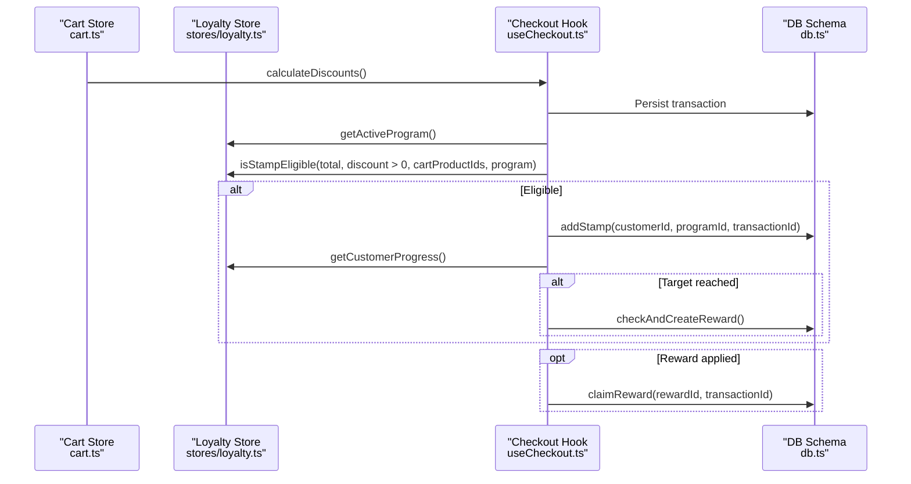
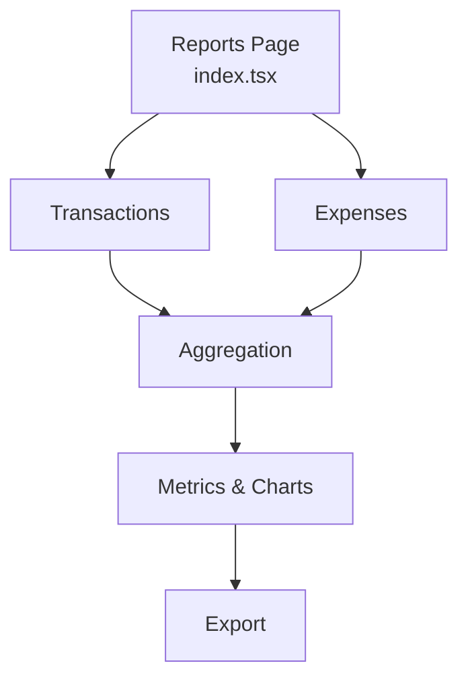
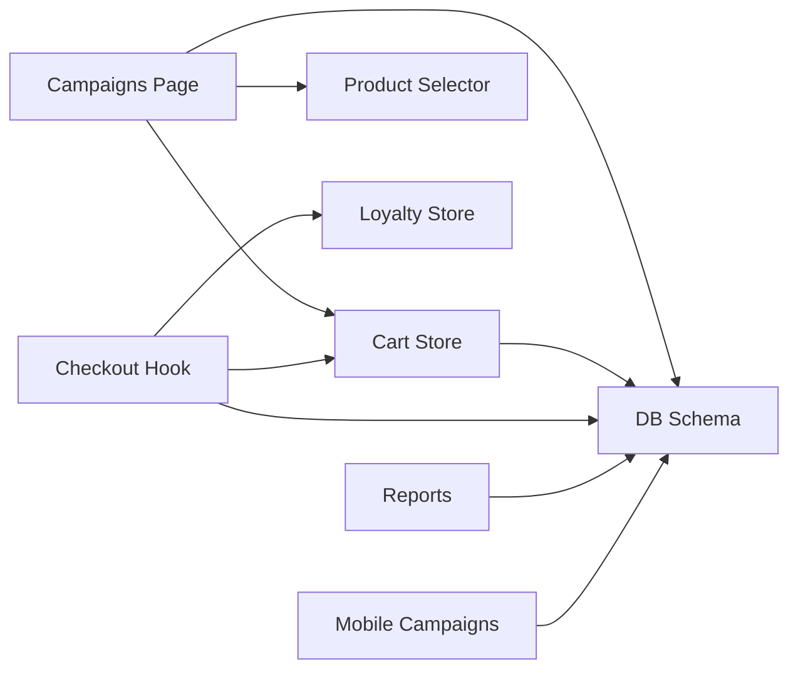

# Promotional Campaigns

<cite>
**Referenced Files in This Document**
- [campaigns.tsx](file://src/routes/app/marketing/campaigns.tsx)
- [cart.ts](file://src/stores/cart.ts)
- [db.ts](file://src/db/db.ts)
- [useCheckout.ts](file://src/hooks/useCheckout.ts)
- [index.tsx](file://src/routes/app/reports/index.tsx)
- [loyalty.tsx](file://src/routes/app/marketing/loyalty.tsx)
- [product-selector.tsx](file://src/components/ui/product-selector.tsx)
- [m_[id].tsx](file://src/routes/m/[id].tsx)
</cite>

## Table of Contents
1. [Introduction](#introduction)
2. [Project Structure](#project-structure)
3. [Core Components](#core-components)
4. [Architecture Overview](#architecture-overview)
5. [Detailed Component Analysis](#detailed-component-analysis)
6. [Dependency Analysis](#dependency-analysis)
7. [Performance Considerations](#performance-considerations)
8. [Troubleshooting Guide](#troubleshooting-guide)
9. [Conclusion](#conclusion)
10. [Appendices](#appendices)

## Introduction
This document explains the promotional campaign management system in NgePos, focusing on how campaigns are configured, validated, applied at checkout, and reported. It covers supported campaign types (bulk discount, bundle, buy-X-get-Y), reward mechanisms (percent discount, fixed discount, free product), and integration with the POS checkout pipeline. It also documents analytics capabilities, conflict handling with the loyalty program, and practical examples for seasonal promotions, product launches, and customer acquisition.

## Project Structure
The promotional campaign system spans UI pages, state stores, database schemas, and checkout logic:
- UI: Campaign creation/editing page and preview
- Store: Active campaign loading, discount calculation, and totals
- DB: Campaign metadata, items, rewards, and related types
- Checkout: Transaction persistence and post-checkout loyalty stamping
- Reports: Financial summaries and trend analysis
- Loyalty: Separate stamp-based rewards with explicit conflict rules

**Diagram sources**
- [campaigns.tsx:1-1125](file://src/routes/app/marketing/campaigns.tsx#L1-1125)
- [cart.ts:115-256](file://src/stores/cart.ts#L115-L256)
- [db.ts:191-216](file://src/db/db.ts#L191-L216)
- [useCheckout.ts:38-213](file://src/hooks/useCheckout.ts#L38-L213)
- [index.tsx:211-370](file://src/routes/app/reports/index.tsx#L211-L370)
- [loyalty.tsx:24-463](file://src/routes/app/marketing/loyalty.tsx#L24-L463)
- [product-selector.tsx:1-236](file://src/components/ui/product-selector.tsx#L1-L236)
- [m_[id].tsx](file://src/routes/m/[id].tsx#L136-L174)

**Section sources**
- [campaigns.tsx:1-1125](file://src/routes/app/marketing/campaigns.tsx#L1-1125)
- [cart.ts:115-256](file://src/stores/cart.ts#L115-L256)
- [db.ts:191-216](file://src/db/db.ts#L191-L216)
- [useCheckout.ts:38-213](file://src/hooks/useCheckout.ts#L38-L213)
- [index.tsx:211-370](file://src/routes/app/reports/index.tsx#L211-L370)
- [loyalty.tsx:24-463](file://src/routes/app/marketing/loyalty.tsx#L24-L463)
- [product-selector.tsx:1-236](file://src/components/ui/product-selector.tsx#L1-L236)
- [m_[id].tsx](file://src/routes/m/[id].tsx#L136-L174)

## Core Components
- Campaigns page: Create, edit, and preview campaigns; configure types, requirements, rewards, and priority; simulate profitability.
- Cart store: Loads active campaigns, computes applicable discounts, and tracks applied reward IDs.
- Checkout hook: Persists transactions, applies discounts, stamps loyalty, and claims rewards.
- DB schema: Defines campaign, campaign item, and campaign reward types.
- Reports: Aggregates financial metrics and trends.
- Loyalty program: Separate stamp-based rewards with explicit rules around promotion allowances.

Key responsibilities:
- Campaign definition and validation
- Real-time discount computation during checkout
- Transaction persistence and post-checkout loyalty updates
- Financial reporting and trend analysis
- Conflict resolution between campaigns and loyalty

**Section sources**
- [campaigns.tsx:132-304](file://src/routes/app/marketing/campaigns.tsx#L132-L304)
- [cart.ts:115-236](file://src/stores/cart.ts#L115-L236)
- [useCheckout.ts:38-213](file://src/hooks/useCheckout.ts#L38-L213)
- [db.ts:191-216](file://src/db/db.ts#L191-L216)
- [index.tsx:211-370](file://src/routes/app/reports/index.tsx#L211-L370)
- [loyalty.tsx:24-463](file://src/routes/app/marketing/loyalty.tsx#L24-L463)

## Architecture Overview
The system integrates UI-driven campaign setup with runtime discount computation and checkout persistence. Campaigns are persisted to IndexedDB via Dexie, loaded into memory for fast evaluation, and applied to the cart subtotal during checkout.

**Diagram sources**
- [campaigns.tsx:233-304](file://src/routes/app/marketing/campaigns.tsx#L233-L304)
- [cart.ts:115-236](file://src/stores/cart.ts#L115-L236)
- [db.ts:191-216](file://src/db/db.ts#L191-L216)
- [useCheckout.ts:38-213](file://src/hooks/useCheckout.ts#L38-L213)

## Detailed Component Analysis

### Campaign Definition and Setup
- Supported types:
  - Bulk discount: Applies to selected target products in the cart.
  - Bundle: Fixed-price combo; reward computed as percent or fixed discount on requirement total.
  - Buy-X-get-Y: Free product reward when requirements are met.
- Reward types:
  - Percent discount
  - Fixed discount
  - Free product (reward product and quantity)
- Priority controls precedence among active campaigns.
- Profitability simulation estimates revenue, cost of goods, discount impact, and margin.

**Diagram sources**
- [campaigns.tsx:468-501](file://src/routes/app/marketing/campaigns.tsx#L468-L501)
- [campaigns.tsx:504-779](file://src/routes/app/marketing/campaigns.tsx#L504-L779)
- [campaigns.tsx:781-800](file://src/routes/app/marketing/campaigns.tsx#L781-L800)
- [campaigns.tsx:921-954](file://src/routes/app/marketing/campaigns.tsx#L921-L954)

**Section sources**
- [campaigns.tsx:468-501](file://src/routes/app/marketing/campaigns.tsx#L468-L501)
- [campaigns.tsx:504-779](file://src/routes/app/marketing/campaigns.tsx#L504-L779)
- [campaigns.tsx:781-800](file://src/routes/app/marketing/campaigns.tsx#L781-L800)
- [campaigns.tsx:921-954](file://src/routes/app/marketing/campaigns.tsx#L921-L954)

### Discount Engine and Checkout Application
- Active campaigns are fetched and prioritized (higher number = higher priority).
- For bulk discount: apply reward to each target product in the cart.
- For bundle/buy-X-get-Y: compute maximum sets based on requirement quantities, then apply reward (free product value, percent discount on requirement total, or fixed discount per set).
- Prevent double-dipping by consuming quantities used by higher-priority campaigns.
- At checkout, discounts are summed and recorded in the transaction along with discount notes.

**Diagram sources**
- [cart.ts:115-130](file://src/stores/cart.ts#L115-L130)
- [cart.ts:132-236](file://src/stores/cart.ts#L132-L236)
- [useCheckout.ts:147-166](file://src/hooks/useCheckout.ts#L147-L166)

**Section sources**
- [cart.ts:115-130](file://src/stores/cart.ts#L115-L130)
- [cart.ts:132-236](file://src/stores/cart.ts#L132-L236)
- [useCheckout.ts:147-166](file://src/hooks/useCheckout.ts#L147-L166)

### Product Selection and Variants
- Product selector supports single or multiple selections, search, and “select all” for bulk selection.
- Variants are handled by generating unique cart item IDs per variant combination; variant modifiers contribute to price and COGS.

**Diagram sources**
- [product-selector.tsx:1-236](file://src/components/ui/product-selector.tsx#L1-L236)
- [cart.ts:16-94](file://src/stores/cart.ts#L16-L94)

**Section sources**
- [product-selector.tsx:1-236](file://src/components/ui/product-selector.tsx#L1-L236)
- [cart.ts:16-94](file://src/stores/cart.ts#L16-L94)

### Loyalty Program Integration and Conflict Resolution
- Loyalty eligibility checks include minimum transaction, allowance with promotions, and excluded products.
- Only one loyalty program can be active; enabling a new program deactivates the old one.
- After checkout, if eligible, stamps are added and rewards may be created; rewards are claimed and can reset stamps depending on program rules.

**Diagram sources**
- [cart.ts:132-236](file://src/stores/cart.ts#L132-L236)
- [useCheckout.ts:174-199](file://src/hooks/useCheckout.ts#L174-L199)
- [loyalty.tsx:24-463](file://src/routes/app/marketing/loyalty.tsx#L24-L463)
- [db.ts:232-266](file://src/db/db.ts#L232-L266)

**Section sources**
- [useCheckout.ts:174-199](file://src/hooks/useCheckout.ts#L174-L199)
- [loyalty.tsx:24-463](file://src/routes/app/marketing/loyalty.tsx#L24-L463)
- [db.ts:232-266](file://src/db/db.ts#L232-L266)

### Reporting and Analytics
- Reports page aggregates:
  - Revenue, cost of goods, gross profit, expenses, net profit, and true profit
  - Payment method distribution and trend charts
  - Export to Excel/PDF
- Campaigns and loyalty operate independently for reporting; financials reflect transaction-level totals and discount notes.

**Diagram sources**
- [index.tsx:211-370](file://src/routes/app/reports/index.tsx#L211-L370)

**Section sources**
- [index.tsx:211-370](file://src/routes/app/reports/index.tsx#L211-L370)

### Mobile Campaign Promotion Display
- Mobile route renders active campaigns with type badges and optional descriptions for in-store visibility.

**Section sources**
- [m_[id].tsx](file://src/routes/m/[id].tsx#L136-L174)

## Dependency Analysis
- Campaigns depend on:
  - DB for persistence of campaigns, items, and rewards
  - Cart store for runtime evaluation and discount computation
  - Product selector for UI-driven item configuration
- Checkout depends on:
  - Cart store for discount totals
  - DB for transaction persistence
  - Loyalty store for stamping and reward lifecycle

**Diagram sources**
- [campaigns.tsx:1-1125](file://src/routes/app/marketing/campaigns.tsx#L1-1125)
- [cart.ts:115-256](file://src/stores/cart.ts#L115-L256)
- [db.ts:191-216](file://src/db/db.ts#L191-L216)
- [useCheckout.ts:38-213](file://src/hooks/useCheckout.ts#L38-L213)
- [index.tsx:211-370](file://src/routes/app/reports/index.tsx#L211-L370)
- [loyalty.tsx:24-463](file://src/routes/app/marketing/loyalty.tsx#L24-L463)
- [product-selector.tsx:1-236](file://src/components/ui/product-selector.tsx#L1-L236)
- [m_[id].tsx](file://src/routes/m/[id].tsx#L136-L174)

**Section sources**
- [campaigns.tsx:1-1125](file://src/routes/app/marketing/campaigns.tsx#L1-1125)
- [cart.ts:115-256](file://src/stores/cart.ts#L115-L256)
- [db.ts:191-216](file://src/db/db.ts#L191-L216)
- [useCheckout.ts:38-213](file://src/hooks/useCheckout.ts#L38-L213)
- [index.tsx:211-370](file://src/routes/app/reports/index.tsx#L211-L370)
- [loyalty.tsx:24-463](file://src/routes/app/marketing/loyalty.tsx#L24-L463)
- [product-selector.tsx:1-236](file://src/components/ui/product-selector.tsx#L1-L236)
- [m_[id].tsx](file://src/routes/m/[id].tsx#L136-L174)

## Performance Considerations
- Campaign loading uses eager loading of items and rewards to minimize repeated queries.
- Discount computation sorts campaigns by priority once and iterates through cart items efficiently.
- Variant hashing ensures variant-specific cart items are tracked distinctly without duplication.
- Recommendation: Keep campaign lists concise; use priority judiciously to reduce evaluation overhead.

[No sources needed since this section provides general guidance]

## Troubleshooting Guide
Common issues and resolutions:
- Campaign not applying:
  - Verify campaign is active and has sufficient requirements met.
  - Check priority ordering; lower-priority campaigns may be overridden.
  - Ensure target products match exactly (including variants).
- Incorrect discount amount:
  - Review reward type and value; percent vs fixed discount yields different outcomes.
  - Confirm “used quantity” tracking prevents double-dipping in bundle scenarios.
- Profitability warning:
  - Negative margin indicates potential losses; adjust reward value or exclude high-COGS products.
- Loyalty stamp not added:
  - Confirm minimum transaction threshold and that the cart includes non-excluded products.
  - Check whether promotions are allowed with loyalty based on program settings.

**Section sources**
- [cart.ts:132-236](file://src/stores/cart.ts#L132-L236)
- [campaigns.tsx:982-992](file://src/routes/app/marketing/campaigns.tsx#L982-L992)
- [loyalty.tsx:24-463](file://src/routes/app/marketing/loyalty.tsx#L24-L463)

## Conclusion
NgePos provides a flexible, real-time promotional engine integrated into the POS checkout. Campaigns support multiple types and reward strategies, with robust discount computation and profitability previews. Financial reporting captures transaction-level outcomes, while the separate loyalty program enforces clear conflict rules. Together, these components enable effective promotional design, testing, and optimization aligned with operational and financial goals.

[No sources needed since this section summarizes without analyzing specific files]

## Appendices

### Practical Scenario Examples
- Seasonal discounts:
  - Create a bulk discount campaign targeting seasonal products with a percent reward; set moderate priority to avoid conflicts with other campaigns.
- Product launch:
  - Use a buy-X-get-Y campaign offering a free promotional item when purchasing the new product in specified quantities.
- Customer acquisition:
  - Combine a low minimum transaction threshold with a free product reward to encourage first-time purchases; pair with mobile campaign display for in-store awareness.

[No sources needed since this section provides general guidance]

### Best Practices and Optimization Tips
- Design:
  - Keep campaign descriptions clear; use profitability preview to validate assumptions.
  - Prefer fixed-discount rewards for predictable margins; reserve percent discounts for high-volume, low-margin items.
- Testing:
  - Start with low priority and test with small carts; verify discount notes and totals.
  - Validate variant combinations and ensure required quantities are achievable.
- Optimization:
  - Monitor net profit and true profit metrics from reports; adjust reward values or remove conflicting campaigns.
  - Align campaign timing with peak hours and exclude high-COGS products to preserve margins.

[No sources needed since this section provides general guidance]