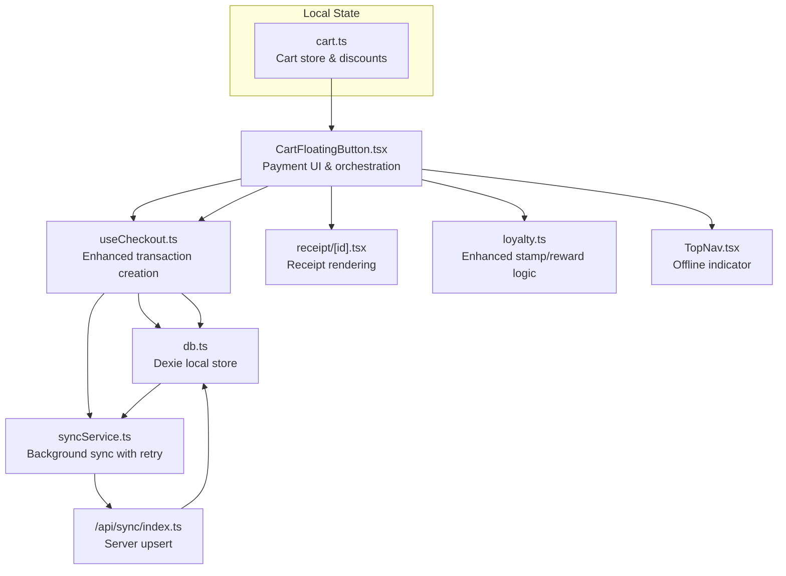
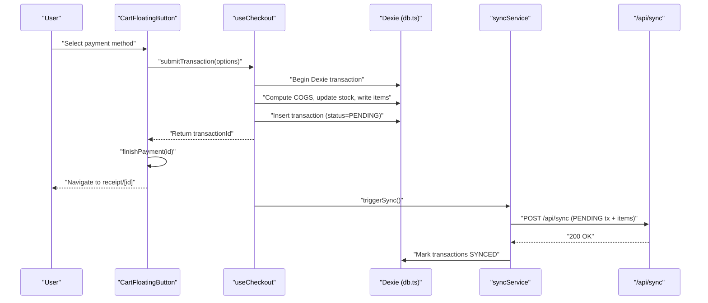
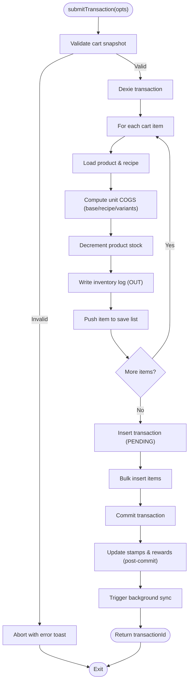
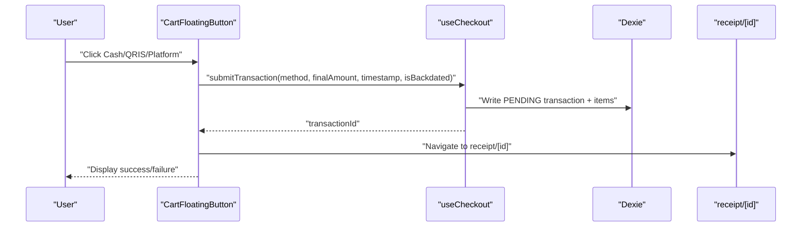
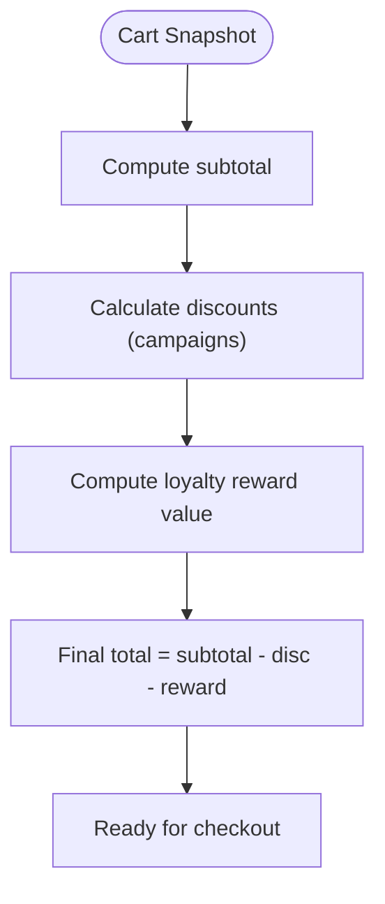
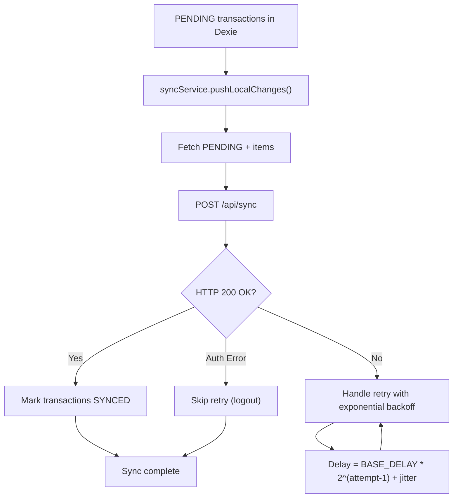
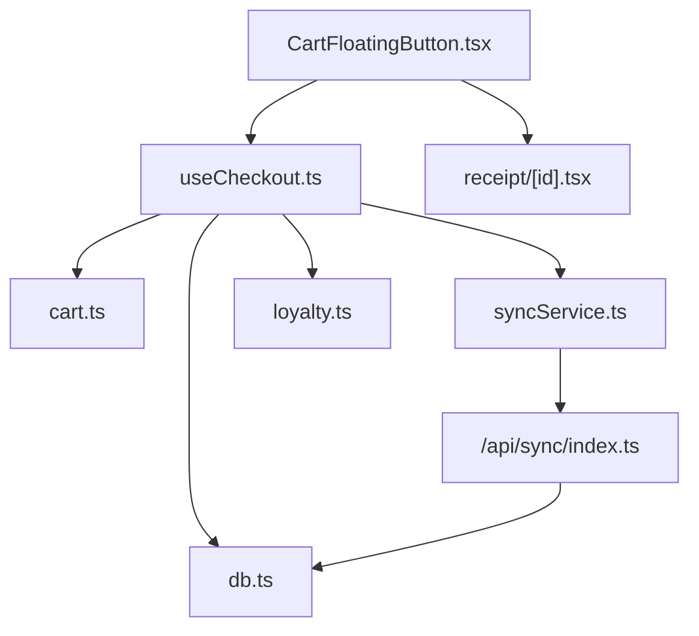

# Checkout Process

<cite>
**Referenced Files in This Document**
- [useCheckout.ts](file://src/hooks/useCheckout.ts)
- [CartFloatingButton.tsx](file://src/components/CartFloatingButton.tsx)
- [cart.ts](file://src/stores/cart.ts)
- [syncService.ts](file://src/lib/syncService.ts)
- [db.ts](file://src/db/db.ts)
- [index.ts](file://src/routes/api/sync/index.ts)
- [receipt/[id].tsx](file://src/routes/app/receipt/[id].tsx)
- [loyalty.ts](file://src/stores/loyalty.ts)
- [TopNav.tsx](file://src/components/TopNav.tsx)
</cite>

## Update Summary
**Changes Made**
- Enhanced error categorization system in checkout with specific handling for database constraints, storage quotas, and transaction errors
- Improved loyalty program integration with better reward calculation and stamp management
- Strengthened offline-first capabilities with robust retry mechanisms and exponential backoff
- Added comprehensive error handling for network failures and database conflicts

## Table of Contents
1. [Introduction](#introduction)
2. [Project Structure](#project-structure)
3. [Core Components](#core-components)
4. [Architecture Overview](#architecture-overview)
5. [Detailed Component Analysis](#detailed-component-analysis)
6. [Dependency Analysis](#dependency-analysis)
7. [Performance Considerations](#performance-considerations)
8. [Troubleshooting Guide](#troubleshooting-guide)
9. [Conclusion](#conclusion)

## Introduction
This document explains the complete checkout process workflow from cart finalization to transaction completion. It covers payment method integration (cash, QRIS, and delivery platform payments), the checkout hook implementation (transaction creation, payment processing, and order confirmation), offline-first capabilities, sync queue management, conflict resolution during network interruptions, practical checkout scenarios, error handling, receipt generation, transaction validation, inventory deduction, and real-time status updates.

**Updated** Enhanced with improved error categorization, better loyalty program integration, and more robust offline handling capabilities.

## Project Structure
The checkout system spans several layers:
- UI and payment orchestration: CartFloatingButton handles payment selection, adjustment, and transitions to receipt.
- Business logic: useCheckout encapsulates transaction creation, inventory deduction, and loyalty post-processing with enhanced error handling.
- Data access: Dexie-backed local database (db.ts) persists transactions and items; syncService coordinates background synchronization with retry mechanisms.
- Backend sync: API endpoint receives local PENDING transactions and upserts them into the central database.
- Receipt generation: Dynamic receipt page renders transaction details and prints thermal-style receipts.

**Diagram sources**
- [CartFloatingButton.tsx:110-236](file://src/components/CartFloatingButton.tsx#L110-L236)
- [useCheckout.ts:38-213](file://src/hooks/useCheckout.ts#L38-L213)
- [db.ts:270-498](file://src/db/db.ts#L270-L498)
- [syncService.ts:4-57](file://src/lib/syncService.ts#L4-L57)
- [index.ts:6-95](file://src/routes/api/sync/index.ts#L6-L95)
- [receipt/[id].tsx:8-189](file://src/routes/app/receipt/[id].tsx#L8-L189)
- [cart.ts:132-246](file://src/stores/cart.ts#L132-L246)
- [TopNav.tsx:1-42](file://src/components/TopNav.tsx#L1-L42)

**Section sources**
- [CartFloatingButton.tsx:110-236](file://src/components/CartFloatingButton.tsx#L110-L236)
- [useCheckout.ts:38-213](file://src/hooks/useCheckout.ts#L38-L213)
- [db.ts:270-498](file://src/db/db.ts#L270-L498)
- [syncService.ts:4-57](file://src/lib/syncService.ts#L4-L57)
- [index.ts:6-95](file://src/routes/api/sync/index.ts#L6-L95)
- [receipt/[id].tsx:8-189](file://src/routes/app/receipt/[id].tsx#L8-L189)
- [cart.ts:132-246](file://src/stores/cart.ts#L132-L246)
- [TopNav.tsx:1-42](file://src/components/TopNav.tsx#L1-L42)

## Core Components
- useCheckout: Centralized checkout logic that creates transactions, deducts inventory, computes costs, and triggers background sync with enhanced error categorization.
- CartFloatingButton: Orchestrates payment methods, collects final amounts, and navigates to receipt after successful checkout.
- cart store: Computes subtotal, applies campaign discounts, and exposes totals for checkout.
- syncService: Background sync of PENDING transactions to the backend API with exponential backoff retry mechanism.
- sync API: Upserts transactions and items into the central database.
- receipt route: Renders and prints receipts with transaction details.
- loyalty store: Handles stamp eligibility, progress, and reward claiming after checkout with improved integration.
- offline indicator: Shows when the app runs offline.

**Updated** Enhanced error handling and retry mechanisms for more robust offline-first operation.

**Section sources**
- [useCheckout.ts:30-216](file://src/hooks/useCheckout.ts#L30-L216)
- [CartFloatingButton.tsx:110-236](file://src/components/CartFloatingButton.tsx#L110-L236)
- [cart.ts:132-246](file://src/stores/cart.ts#L132-L246)
- [syncService.ts:4-57](file://src/lib/syncService.ts#L4-L57)
- [index.ts:6-95](file://src/routes/api/sync/index.ts#L6-L95)
- [receipt/[id].tsx:8-189](file://src/routes/app/receipt/[id].tsx#L8-L189)
- [loyalty.ts:36-174](file://src/stores/loyalty.ts#L36-L174)
- [TopNav.tsx:1-42](file://src/components/TopNav.tsx#L1-L42)

## Architecture Overview
The checkout pipeline is designed for offline-first operation with enhanced error handling:
- Local transaction creation: useCheckout writes to Dexie with PENDING status and comprehensive error categorization.
- Inventory and cost-of-goods updates: COGS computed per-item and per-recipe, stock decremented, inventory logs recorded.
- Loyalty post-processing: After commit, stamps and rewards are updated if eligible with improved integration.
- Background sync: syncService periodically sends PENDING transactions to the backend with exponential backoff retry; upon success, status is updated to SYNCED.
- Receipt generation: UI reads the transaction and items from Dexie to render/print receipts.

**Updated** Enhanced with comprehensive error categorization and improved retry mechanisms.

**Diagram sources**
- [CartFloatingButton.tsx:195-236](file://src/components/CartFloatingButton.tsx#L195-L236)
- [useCheckout.ts:38-213](file://src/hooks/useCheckout.ts#L38-L213)
- [db.ts:270-498](file://src/db/db.ts#L270-L498)
- [syncService.ts:49-57](file://src/lib/syncService.ts#L49-L57)
- [index.ts:6-95](file://src/routes/api/sync/index.ts#L6-L95)

## Detailed Component Analysis

### useCheckout Hook
Responsibilities:
- Validates cart state and snapshot with enhanced error handling.
- Computes discounts and loyalty reward contribution with improved calculation logic.
- Creates a transaction with a unique ID and PENDING status.
- Deducts inventory for products and recipes, logs inventory movements, and updates product COGS.
- Writes transaction items with price and COGS at time of sale.
- Triggers background sync after successful commit.
- Updates loyalty stamps and rewards after commit with better error isolation.

**Updated** Enhanced with comprehensive error categorization system covering database constraints, storage quotas, transaction failures, and offline scenarios.

Key behaviors:
- Uses Dexie transaction for atomicity across transactions, transactionItems, products, rawMaterialLibrary, and inventoryLogs.
- Calculates unit COGS from product base COGS, recipe ingredients, and variant modifiers.
- Adds a special item for free reward product when applicable.
- Sets isAdjustment flag based on final amount mismatch with computed total.
- On success, posts stamps and claims rewards if eligible; then triggers sync.
- Implements comprehensive error handling with specific categories for different failure modes.

**Diagram sources**
- [useCheckout.ts:38-213](file://src/hooks/useCheckout.ts#L38-L213)
- [db.ts:82-109](file://src/db/db.ts#L82-L109)

**Section sources**
- [useCheckout.ts:38-213](file://src/hooks/useCheckout.ts#L38-L213)
- [db.ts:82-109](file://src/db/db.ts#L82-L109)

### Enhanced Error Categorization System
The checkout system now includes comprehensive error categorization for better user experience and debugging:

**Database Constraint Errors**: Handles ConstraintError and constraint-related failures with appropriate user feedback.
**Storage Quota Errors**: Manages QuotaExceededError for storage limitations with recovery suggestions.
**Transaction Errors**: Catches TransactionInactiveError and transaction-related failures with retry guidance.
**Network Errors**: Detects offline scenarios and provides offline-first processing with local storage.
**Generic Errors**: Categorizes unexpected errors with fallback messaging while preserving transaction integrity.

**Section sources**
- [useCheckout.ts:236-262](file://src/hooks/useCheckout.ts#L236-L262)

### Payment Methods and UI Orchestration
Supported methods:
- Cash: Direct confirmation, final amount equals computed total.
- QRIS: Confirmation step; success continues to checkout; failure shows failure state.
- Delivery Platforms: Selection of enabled platform (GoFood, GrabFood, ShopeeFood), adjustment step to confirm final received amount, then checkout.

UI flow:
- Payment selection dialog aggregates totals and backdate flags.
- Adjustment step shows app bill vs. platform final amount for transparency.
- Success and failure steps guide user actions and navigation.

**Diagram sources**
- [CartFloatingButton.tsx:195-236](file://src/components/CartFloatingButton.tsx#L195-L236)
- [useCheckout.ts:38-213](file://src/hooks/useCheckout.ts#L38-L213)
- [receipt/[id].tsx:8-189](file://src/routes/app/receipt/[id].tsx#L8-L189)

**Section sources**
- [CartFloatingButton.tsx:195-236](file://src/components/CartFloatingButton.tsx#L195-L236)
- [CartFloatingButton.tsx:629-950](file://src/components/CartFloatingButton.tsx#L629-L950)

### Cart and Discount Calculation
- Cart store maintains items with variants and computes:
  - Subtotal: sum of (price × quantity).
  - Discounts: campaign-based bulk discounts, bundles, and buy-X-get-Y offers with careful quantity consumption to avoid double-dipping.
  - Final total: subtotal minus campaign discounts minus loyalty reward value.
- Variants contribute price and COGS modifiers.

**Diagram sources**
- [cart.ts:132-246](file://src/stores/cart.ts#L132-L246)

**Section sources**
- [cart.ts:132-246](file://src/stores/cart.ts#L132-L246)

### Inventory Deduction and COGS Computation
- For each product:
  - Base COGS used if not set; otherwise derived from recipe materials.
  - Recipe ingredients: stock decremented, inventory logs written (OUT), and cumulative recipe COGS computed.
  - Variant modifiers: add price and COGS adjustments.
- Product COGS updated to reflect newly computed recipe-based HPP.
- Transaction items capture cogsAtTime for auditability.

**Section sources**
- [useCheckout.ts:64-128](file://src/hooks/useCheckout.ts#L64-L128)
- [db.ts:62-109](file://src/db/db.ts#L62-L109)

### Enhanced Loyalty Integration Post-Checkout
- Eligibility checks: minimum transaction threshold, promo allowance, and excluded products with improved validation.
- Stamps: recorded per transaction if eligible; progress computed considering expiry windows with better accuracy.
- Rewards: if target reached, a reward is created; claiming updates reward status and optionally resets stamps depending on program rules.
- Error isolation: Loyalty processing errors don't fail the entire checkout process, ensuring transaction integrity.

**Updated** Improved integration with better error handling and more accurate stamp calculation.

**Section sources**
- [useCheckout.ts:174-199](file://src/hooks/useCheckout.ts#L174-L199)
- [loyalty.ts:36-174](file://src/stores/loyalty.ts#L36-L174)

### Receipt Generation
- Loads transaction and items from Dexie.
- Renders outlet branding, timestamps, cashier name, items with variants, discount breakdown, adjustment notes, and total paid.
- Provides print action and navigation back to the app.

**Section sources**
- [receipt/[id].tsx:8-189](file://src/routes/app/receipt/[id].tsx#L8-L189)

### Enhanced Offline-First and Sync Queue Management
- Local state: transactions created with PENDING status and comprehensive error handling.
- Background sync: debounced push of PENDING transactions and expenses to backend API with exponential backoff retry.
- Conflict resolution: backend upserts on conflict to deduplicate and reconcile.
- Status updates: after successful sync, local status updated to SYNCED.
- Retry mechanism: MAX_RETRY_ATTEMPTS with exponential backoff (BASE_DELAY_MS * 2^(retryCount-1)) plus jitter for optimal network recovery.

**Updated** Enhanced with exponential backoff retry mechanism and improved error handling for network failures.

**Diagram sources**
- [syncService.ts:4-57](file://src/lib/syncService.ts#L4-L57)
- [index.ts:6-95](file://src/routes/api/sync/index.ts#L6-L95)
- [db.ts:82-98](file://src/db/db.ts#L82-L98)

**Section sources**
- [syncService.ts:4-57](file://src/lib/syncService.ts#L4-L57)
- [index.ts:6-95](file://src/routes/api/sync/index.ts#L6-L95)
- [db.ts:82-98](file://src/db/db.ts#L82-L98)
- [TopNav.tsx:1-42](file://src/components/TopNav.tsx#L1-L42)

## Dependency Analysis
- useCheckout depends on:
  - cart store for totals and discounts.
  - db.ts for transaction and inventory persistence.
  - syncService for background synchronization with retry mechanisms.
  - loyalty store for post-checkout stamp/reward updates.
- CartFloatingButton depends on:
  - useCheckout for transaction submission.
  - cart store for totals and discounts.
  - db.ts for reward product lookup.
  - receipt route for navigation.

**Diagram sources**
- [CartFloatingButton.tsx:110-236](file://src/components/CartFloatingButton.tsx#L110-L236)
- [useCheckout.ts:30-216](file://src/hooks/useCheckout.ts#L30-L216)
- [cart.ts:132-246](file://src/stores/cart.ts#L132-L246)
- [syncService.ts:4-57](file://src/lib/syncService.ts#L4-L57)
- [index.ts:6-95](file://src/routes/api/sync/index.ts#L6-L95)
- [receipt/[id].tsx:8-189](file://src/routes/app/receipt/[id].tsx#L8-L189)
- [loyalty.ts:36-174](file://src/stores/loyalty.ts#L36-L174)

**Section sources**
- [CartFloatingButton.tsx:110-236](file://src/components/CartFloatingButton.tsx#L110-L236)
- [useCheckout.ts:30-216](file://src/hooks/useCheckout.ts#L30-L216)
- [cart.ts:132-246](file://src/stores/cart.ts#L132-L246)
- [syncService.ts:4-57](file://src/lib/syncService.ts#L4-L57)
- [index.ts:6-95](file://src/routes/api/sync/index.ts#L6-L95)
- [receipt/[id].tsx:8-189](file://src/routes/app/receipt/[id].tsx#L8-L189)
- [loyalty.ts:36-174](file://src/stores/loyalty.ts#L36-L174)

## Performance Considerations
- Batch operations: bulkAdd for transaction items reduces IO overhead.
- Debounced sync: 3-second delay prevents thrashing during rapid changes.
- Indexed fields: Dexie indices on transactions and items improve query performance.
- Variant hashing: cart item IDs incorporate variant hashes to avoid duplication and simplify merges.
- COGS computation: performed per item avoids repeated lookups and ensures accurate inventory valuation.
- **Updated** Enhanced retry mechanisms with exponential backoff reduce server load during network recovery.
- **Updated** Comprehensive error categorization improves user experience and reduces support requests.

## Troubleshooting Guide
Common issues and resolutions:
- Empty cart errors: Checkout aborts early with a toast; ensure cart has items before checkout.
- Network failures during sync: PENDING transactions persist locally with exponential backoff retry; verify auth token presence.
- Payment confirmation failures (QRIS): Failure step displays options to retry or cancel; transaction remains PENDING until synced.
- Inventory discrepancies: Verify raw material stock and recipe calculations; inventory logs record OUT entries for each consumed material.
- Receipt rendering: Ensure transaction and items exist in Dexie; refresh page if data is stale.
- **Updated** Database constraint errors: Automatic detection and user-friendly messaging for data conflicts.
- **Updated** Storage quota exceeded: Clear old data or contact administrator for resolution.
- **Updated** Offline scenarios: System gracefully handles offline mode with local transaction processing.

**Section sources**
- [useCheckout.ts:206-212](file://src/hooks/useCheckout.ts#L206-L212)
- [syncService.ts:44-46](file://src/lib/syncService.ts#L44-L46)
- [CartFloatingButton.tsx:916-949](file://src/components/CartFloatingButton.tsx#L916-L949)

## Conclusion
The checkout system integrates a robust offline-first model with immediate local transaction creation, precise inventory and COGS handling, flexible payment methods, and seamless background synchronization. The enhanced useCheckout hook centralizes validation, inventory deduction, and loyalty post-processing with comprehensive error categorization and improved reliability. UI components provide clear feedback and navigation, while the enhanced sync service and backend API ensure eventual consistency and conflict-free reconciliation. The system now offers better error handling, more accurate loyalty integration, and stronger offline capabilities for production environments.