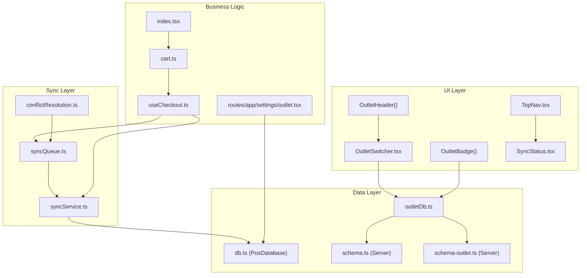
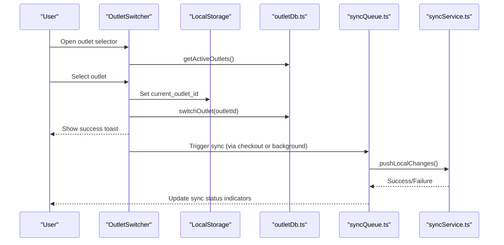
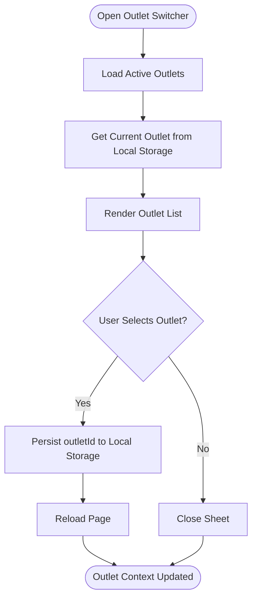
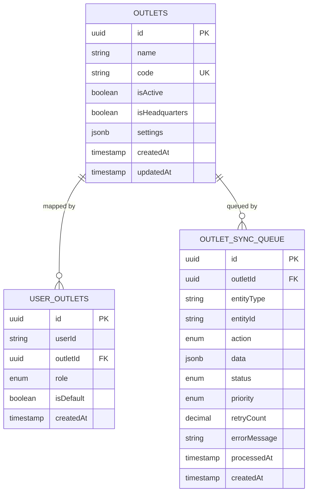
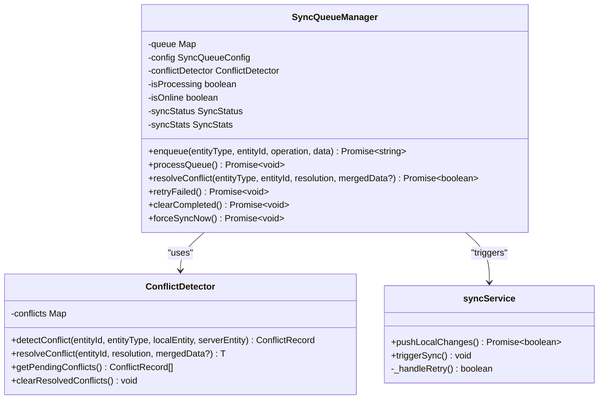
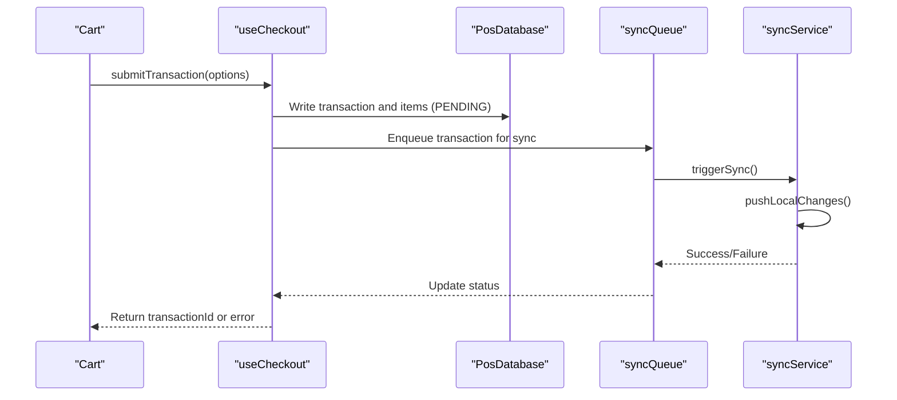
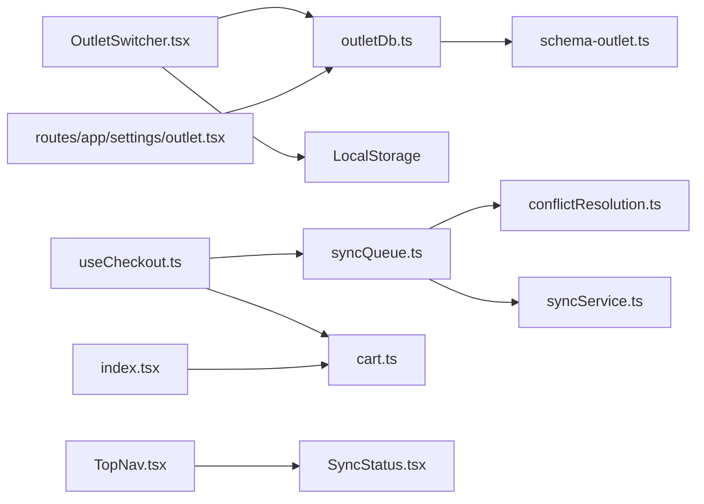

# Multi-Outlet Support

<cite>
**Referenced Files in This Document**
- [OutletSwitcher.tsx](file://src/components/OutletSwitcher.tsx)
- [outletDb.ts](file://src/db/outletDb.ts)
- [schema-outlet.ts](file://src/server/db/schema-outlet.ts)
- [outlet.tsx](file://src/routes/app/settings/outlet.tsx)
- [syncService.ts](file://src/lib/syncService.ts)
- [syncQueue.ts](file://src/lib/syncQueue.ts)
- [useCheckout.ts](file://src/hooks/useCheckout.ts)
- [cart.ts](file://src/stores/cart.ts)
- [index.tsx](file://src/routes/app/index.tsx)
- [conflictResolution.ts](file://src/lib/conflictResolution.ts)
- [TopNav.tsx](file://src/components/TopNav.tsx)
- [SyncStatus.tsx](file://src/components/SyncStatus.tsx)
- [db.ts](file://src/db/db.ts)
- [schema.ts](file://src/server/db/schema.ts)
</cite>

## Table of Contents
1. [Introduction](#introduction)
2. [Project Structure](#project-structure)
3. [Core Components](#core-components)
4. [Architecture Overview](#architecture-overview)
5. [Detailed Component Analysis](#detailed-component-analysis)
6. [Dependency Analysis](#dependency-analysis)
7. [Performance Considerations](#performance-considerations)
8. [Troubleshooting Guide](#troubleshooting-guide)
9. [Conclusion](#conclusion)

## Introduction
This document explains the multi-outlet support system implemented in the POS application. It covers how users can switch between different business locations (outlets), how data isolation and synchronization work across outlets, and how the system maintains consistency when staff move between locations. The solution leverages local storage for outlet selection, IndexedDB for local data persistence, and a robust conflict resolution mechanism for handling concurrent edits across devices and outlets.

## Project Structure
The multi-outlet feature spans several layers:
- UI components for outlet switching and display
- Local database (IndexedDB) for outlet metadata and sync queue
- Server-side schema for outlets and user-outlet mappings
- Sync service and queue for background synchronization
- Checkout flow integration with sync triggers

**Diagram sources**
- [OutletSwitcher.tsx:1-203](file://src/components/OutletSwitcher.tsx#L1-L203)
- [outletDb.ts:1-169](file://src/db/outletDb.ts#L1-L169)
- [schema-outlet.ts:1-56](file://src/server/db/schema-outlet.ts#L1-L56)
- [syncQueue.ts:1-597](file://src/lib/syncQueue.ts#L1-L597)
- [syncService.ts:1-111](file://src/lib/syncService.ts#L1-L111)
- [useCheckout.ts:1-267](file://src/hooks/useCheckout.ts#L1-L267)
- [cart.ts:1-257](file://src/stores/cart.ts#L1-L257)
- [index.tsx:1-281](file://src/routes/app/index.tsx#L1-L281)
- [TopNav.tsx:1-43](file://src/components/TopNav.tsx#L1-L43)
- [SyncStatus.tsx:1-202](file://src/components/SyncStatus.tsx#L1-L202)
- [db.ts:270-496](file://src/db/db.ts#L270-L496)
- [schema.ts:1-157](file://src/server/db/schema.ts#L1-L157)

**Section sources**
- [OutletSwitcher.tsx:1-203](file://src/components/OutletSwitcher.tsx#L1-L203)
- [outletDb.ts:1-169](file://src/db/outletDb.ts#L1-L169)
- [schema-outlet.ts:1-56](file://src/server/db/schema-outlet.ts#L1-L56)

## Core Components
- OutletSwitcher: Provides a bottom sheet UI to select the active outlet and persists the choice in local storage.
- Outlet database (outletDb.ts): Manages outlet metadata, user-outlet associations, and a sync queue for pending operations.
- Server schemas: Define outlet and user-outlet relationships and sync queue persistence on the backend.
- Sync service and queue: Handle background synchronization with retry/backoff, conflict detection, and resolution.
- Checkout integration: Triggers sync after successful transactions to propagate sales across outlets.

**Section sources**
- [OutletSwitcher.tsx:24-167](file://src/components/OutletSwitcher.tsx#L24-L167)
- [outletDb.ts:47-169](file://src/db/outletDb.ts#L47-L169)
- [schema-outlet.ts:3-56](file://src/server/db/schema-outlet.ts#L3-L56)
- [syncQueue.ts:69-571](file://src/lib/syncQueue.ts#L69-L571)
- [syncService.ts:8-111](file://src/lib/syncService.ts#L8-L111)
- [useCheckout.ts:55-235](file://src/hooks/useCheckout.ts#L55-L235)

## Architecture Overview
The multi-outlet architecture centers on:
- Outlet selection via UI and persisted in local storage
- Local IndexedDB for products, transactions, and sync queue
- Server-side outlet and user-outlet tables for access control and sync coordination
- Conflict-free replication with version vectors and conflict resolution strategies

**Diagram sources**
- [OutletSwitcher.tsx:29-65](file://src/components/OutletSwitcher.tsx#L29-L65)
- [outletDb.ts:85-91](file://src/db/outletDb.ts#L85-L91)
- [syncQueue.ts:270-338](file://src/lib/syncQueue.ts#L270-L338)
- [syncService.ts:12-75](file://src/lib/syncService.ts#L12-L75)

## Detailed Component Analysis

### OutletSwitcher Component
The OutletSwitcher provides:
- A bottom sheet with a list of active outlets
- Current outlet badge display
- Navigation header integration
- Toast notifications for success/error

Key behaviors:
- Loads active outlets and determines the current outlet from local storage
- On selection, updates local storage and refreshes the page to apply the new outlet context
- Displays HQ indicator for headquarters outlets

**Diagram sources**
- [OutletSwitcher.tsx:29-65](file://src/components/OutletSwitcher.tsx#L29-L65)

**Section sources**
- [OutletSwitcher.tsx:24-167](file://src/components/OutletSwitcher.tsx#L24-L167)

### Outlet Database Model and Sync Queue
The outlet database model defines:
- Outlet entity with settings, activity flag, and headquarter designation
- User-outlet mapping with roles and default outlet flags
- Sync queue entries with status, priority, and retry tracking

Operations include:
- Retrieving active outlets and user-specific outlets
- Getting/setting the current outlet ID
- Managing sync queue entries with lifecycle transitions (pending → processing → completed/failed)

**Diagram sources**
- [outletDb.ts:3-51](file://src/db/outletDb.ts#L3-L51)
- [schema-outlet.ts:3-56](file://src/server/db/schema-outlet.ts#L3-L56)

**Section sources**
- [outletDb.ts:47-169](file://src/db/outletDb.ts#L47-L169)
- [schema-outlet.ts:3-56](file://src/server/db/schema-outlet.ts#L3-L56)

### Sync Service and Queue
The sync system:
- Debounces frequent sync requests
- Pushes pending transactions and expenses to the server
- Handles authentication failures distinctly from transient errors
- Retries with exponential backoff and caps maximum attempts
- Maintains a persistent queue in IndexedDB for outlet-specific operations

Conflict resolution:
- Uses version vectors and timestamps to detect concurrent writes
- Supports strategies: last-write-wins, local-wins, server-wins, manual
- Merges conflicting fields and surfaces unresolved conflicts for manual resolution

**Diagram sources**
- [syncQueue.ts:69-571](file://src/lib/syncQueue.ts#L69-L571)
- [conflictResolution.ts:134-202](file://src/lib/conflictResolution.ts#L134-L202)
- [syncService.ts:8-111](file://src/lib/syncService.ts#L8-L111)

**Section sources**
- [syncQueue.ts:69-571](file://src/lib/syncQueue.ts#L69-L571)
- [conflictResolution.ts:1-258](file://src/lib/conflictResolution.ts#L1-L258)
- [syncService.ts:8-111](file://src/lib/syncService.ts#L8-L111)

### Checkout Integration and Data Flow
The checkout flow integrates with multi-outlet support by:
- Persisting transactions locally with a PENDING status
- Triggering background sync after successful checkout
- Updating loyalty stamps and rewards post-checkout
- Handling offline scenarios gracefully with local persistence

**Diagram sources**
- [useCheckout.ts:55-235](file://src/hooks/useCheckout.ts#L55-L235)
- [cart.ts:1-257](file://src/stores/cart.ts#L1-L257)
- [syncQueue.ts:270-338](file://src/lib/syncQueue.ts#L270-L338)
- [syncService.ts:12-75](file://src/lib/syncService.ts#L12-L75)

**Section sources**
- [useCheckout.ts:55-235](file://src/hooks/useCheckout.ts#L55-L235)
- [cart.ts:132-236](file://src/stores/cart.ts#L132-L236)

### Outlet Settings Page
The outlet settings page allows administrators to manage outlet branding and contact information, which can be used to differentiate each location visually and operationally.

**Section sources**
- [outlet.tsx:7-167](file://src/routes/app/settings/outlet.tsx#L7-L167)

## Dependency Analysis
The multi-outlet system exhibits clear separation of concerns:
- UI components depend on outletDb for outlet data and user-outlet mappings
- Sync queue depends on conflict resolution and version vectors
- Checkout depends on sync service and queue for background propagation
- Server schemas define outlet and user-outlet relationships and sync queue persistence

**Diagram sources**
- [OutletSwitcher.tsx:1-203](file://src/components/OutletSwitcher.tsx#L1-L203)
- [outletDb.ts:1-169](file://src/db/outletDb.ts#L1-L169)
- [schema-outlet.ts:1-56](file://src/server/db/schema-outlet.ts#L1-L56)
- [syncQueue.ts:1-597](file://src/lib/syncQueue.ts#L1-L597)
- [conflictResolution.ts:1-258](file://src/lib/conflictResolution.ts#L1-L258)
- [syncService.ts:1-111](file://src/lib/syncService.ts#L1-L111)
- [useCheckout.ts:1-267](file://src/hooks/useCheckout.ts#L1-L267)
- [cart.ts:1-257](file://src/stores/cart.ts#L1-L257)
- [index.tsx:1-281](file://src/routes/app/index.tsx#L1-L281)
- [outlet.tsx:1-167](file://src/routes/app/settings/outlet.tsx#L1-L167)
- [TopNav.tsx:1-43](file://src/components/TopNav.tsx#L1-L43)
- [SyncStatus.tsx:1-202](file://src/components/SyncStatus.tsx#L1-L202)

**Section sources**
- [OutletSwitcher.tsx:1-203](file://src/components/OutletSwitcher.tsx#L1-L203)
- [outletDb.ts:1-169](file://src/db/outletDb.ts#L1-L169)
- [syncQueue.ts:1-597](file://src/lib/syncQueue.ts#L1-L597)
- [useCheckout.ts:1-267](file://src/hooks/useCheckout.ts#L1-L267)

## Performance Considerations
- Debouncing: Sync requests are debounced to reduce server load and network usage.
- Batch processing: The sync queue processes operations in batches to improve throughput.
- Exponential backoff: Retry delays increase exponentially to avoid overwhelming the server.
- Local persistence: IndexedDB ensures fast reads/writes and offline capability.
- Conflict minimization: Last-write-wins and version vectors reduce the frequency of conflicts.

## Troubleshooting Guide
Common issues and resolutions:
- Outlet switching does not persist: Verify local storage key and ensure the switchOutlet function is called and the page reloads.
- Sync fails repeatedly: Check network connectivity, server availability, and review retry counts and error messages in the sync queue.
- Conflicts arise during sync: Review conflict resolution strategy and manually resolve conflicts if configured for manual mode.
- Offline mode: The system operates in offline mode when disconnected; transactions are saved locally and synced when connectivity resumes.

**Section sources**
- [OutletSwitcher.tsx:48-65](file://src/components/OutletSwitcher.tsx#L48-L65)
- [syncService.ts:81-100](file://src/lib/syncService.ts#L81-L100)
- [syncQueue.ts:471-490](file://src/lib/syncQueue.ts#L471-L490)
- [TopNav.tsx:7-19](file://src/components/TopNav.tsx#L7-L19)
- [SyncStatus.tsx:115-133](file://src/components/SyncStatus.tsx#L115-L133)

## Conclusion
The multi-outlet support system provides a robust foundation for managing multiple business locations within a single POS application. By combining local outlet selection, IndexedDB persistence, server-backed outlet/user mappings, and a resilient sync mechanism with conflict resolution, the system ensures data consistency and operational continuity across outlets. The modular design enables easy extension and maintenance while delivering a smooth user experience.