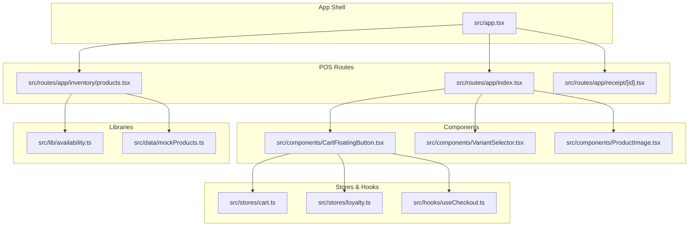
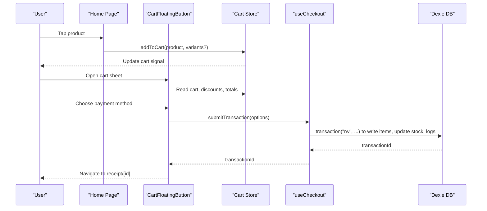
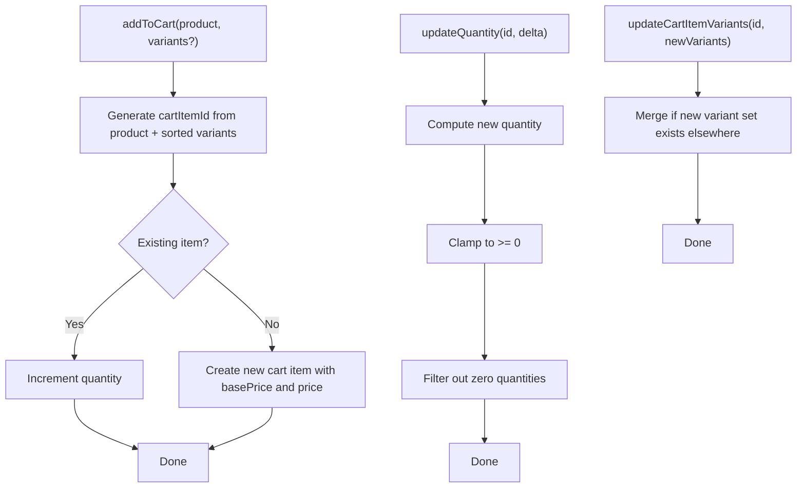
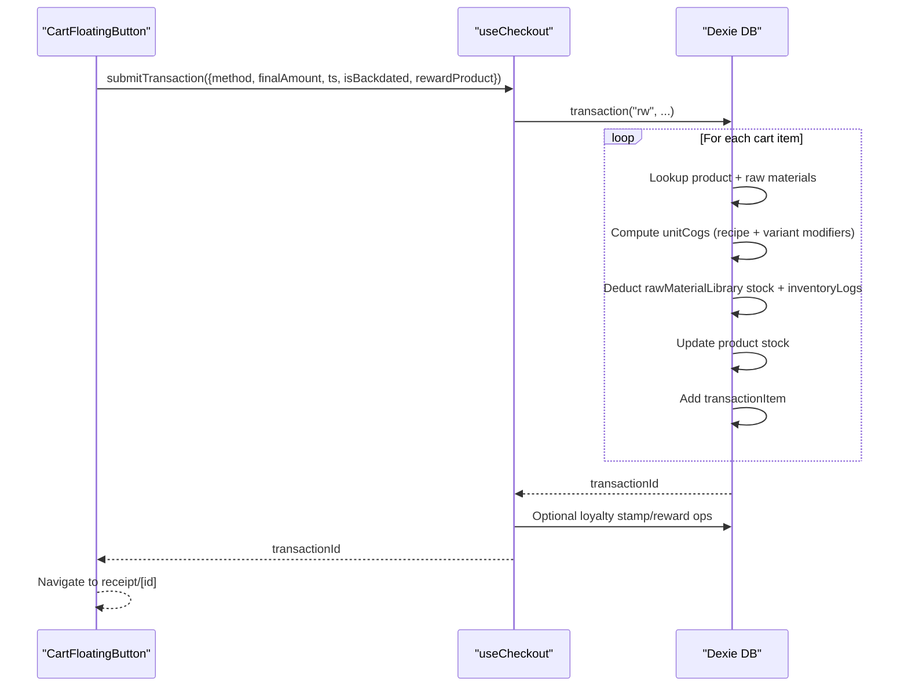
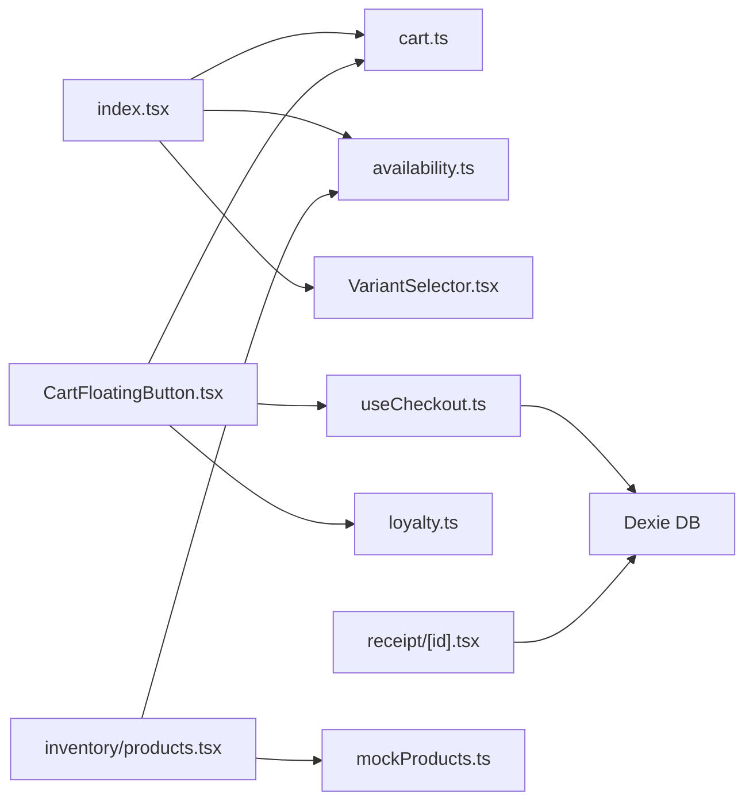

# POS System

<cite>
**Referenced Files in This Document**
- [README.md](file://README.md)
- [PRD.txt](file://PRD.txt)
- [src/app.tsx](file://src/app.tsx)
- [src/routes/app/index.tsx](file://src/routes/app/index.tsx)
- [src/routes/app/inventory/products.tsx](file://src/routes/app/inventory/products.tsx)
- [src/routes/app/receipt/[id].tsx](file://src/routes/app/receipt/[id].tsx)
- [src/components/ProductImage.tsx](file://src/components/ProductImage.tsx)
- [src/components/VariantSelector.tsx](file://src/components/VariantSelector.tsx)
- [src/components/CartFloatingButton.tsx](file://src/components/CartFloatingButton.tsx)
- [src/stores/cart.ts](file://src/stores/cart.ts)
- [src/hooks/useCheckout.ts](file://src/hooks/useCheckout.ts)
- [src/lib/availability.ts](file://src/lib/availability.ts)
- [src/data/mockProducts.ts](file://src/data/mockProducts.ts)
- [src/stores/loyalty.ts](file://src/stores/loyalty.ts)
</cite>

## Table of Contents
1. [Introduction](#introduction)
2. [Project Structure](#project-structure)
3. [Core Components](#core-components)
4. [Architecture Overview](#architecture-overview)
5. [Detailed Component Analysis](#detailed-component-analysis)
6. [Dependency Analysis](#dependency-analysis)
7. [Performance Considerations](#performance-considerations)
8. [Troubleshooting Guide](#troubleshooting-guide)
9. [Conclusion](#conclusion)
10. [Appendices](#appendices)

## Introduction
NgePos is a mobile-first Point of Sale (POS) system tailored for food and beverage (F&B) businesses in Indonesia. It emphasizes instant checkout, offline-first operation using IndexedDB via Dexie.js, and a streamlined POS interface optimized for quick transactions on mobile devices. The system supports product catalogs with search and category filtering, variant selection, shopping cart management with real-time totals, and checkout with multiple payment methods including cash, QRIS, and delivery platforms. It also includes receipt generation, backdated transaction recording, and basic financial reporting.

Key goals include achieving sub-30-second checkout time, supporting offline operation, and enabling multi-channel payment processing with platform-specific price adjustments.

**Section sources**
- [PRD.txt: 1-330:1-330](file://PRD.txt#L1-L330)
- [README.md: 1-33:1-33](file://README.md#L1-L33)

## Project Structure
The project is organized around a SPA built with SolidStart, using a custom component library, TailwindCSS for styling, and Dexie.js for local data persistence. The POS interface resides primarily under routes/app, with dedicated pages for the instant checkout grid, product catalog, receipts, and settings. Stores manage cart and loyalty state, while hooks encapsulate checkout logic.

**Diagram sources**
- [src/app.tsx: 1-42:1-42](file://src/app.tsx#L1-L42)
- [src/routes/app/index.tsx: 1-282:1-282](file://src/routes/app/index.tsx#L1-L282)
- [src/routes/app/inventory/products.tsx: 1-800:1-800](file://src/routes/app/inventory/products.tsx#L1-L800)
- [src/routes/app/receipt/[id].tsx: 1-190](file://src/routes/app/receipt/[id].tsx#L1-L190)
- [src/components/CartFloatingButton.tsx: 1-955:1-955](file://src/components/CartFloatingButton.tsx#L1-L955)
- [src/components/VariantSelector.tsx: 1-205:1-205](file://src/components/VariantSelector.tsx#L1-L205)
- [src/components/ProductImage.tsx: 1-60:1-60](file://src/components/ProductImage.tsx#L1-L60)
- [src/stores/cart.ts: 1-257:1-257](file://src/stores/cart.ts#L1-L256)
- [src/hooks/useCheckout.ts: 1-217:1-217](file://src/hooks/useCheckout.ts#L1-L234)
- [src/lib/availability.ts: 1-40:1-40](file://src/lib/availability.ts#L1-L40)
- [src/data/mockProducts.ts: 1-85:1-85](file://src/data/mockProducts.ts#L1-L85)
- [src/stores/loyalty.ts: 1-174:1-174](file://src/stores/loyalty.ts#L1-L173)

**Section sources**
- [src/app.tsx: 1-42:1-42](file://src/app.tsx#L1-L42)
- [src/routes/app/index.tsx: 1-282:1-282](file://src/routes/app/index.tsx#L1-L282)
- [src/routes/app/inventory/products.tsx: 1-800:1-800](file://src/routes/app/inventory/products.tsx#L1-L800)
- [src/routes/app/receipt/[id].tsx: 1-190](file://src/routes/app/receipt/[id].tsx#L1-L190)
- [src/components/CartFloatingButton.tsx: 1-955:1-955](file://src/components/CartFloatingButton.tsx#L1-L955)
- [src/components/VariantSelector.tsx: 1-205:1-205](file://src/components/VariantSelector.tsx#L1-L205)
- [src/components/ProductImage.tsx: 1-60:1-60](file://src/components/ProductImage.tsx#L1-L60)
- [src/stores/cart.ts: 1-257:1-257](file://src/stores/cart.ts#L1-L256)
- [src/hooks/useCheckout.ts: 1-217:1-217](file://src/hooks/useCheckout.ts#L1-L234)
- [src/lib/availability.ts: 1-40:1-40](file://src/lib/availability.ts#L1-L40)
- [src/data/mockProducts.ts: 1-85:1-85](file://src/data/mockProducts.ts#L1-L85)
- [src/stores/loyalty.ts: 1-174:1-174](file://src/stores/loyalty.ts#L1-L173)

## Core Components
- Instant Checkout Interface (Home Grid)
  - Mobile-optimized product grid with category tabs and search.
  - Variant selection via a bottom sheet for products with variants.
  - Real-time cart updates with floating cart button showing count and total.
  - Availability checks and low-stock indicators.

- Shopping Cart Management
  - Add/remove items, adjust quantities, and edit variants.
  - Real-time subtotal, discounts, and total computation.
  - Campaign-based discount logic with bulk and bundle rules.
  - Backdated transaction support with timestamp selection.

- Product Catalog
  - Search and filter by category.
  - Variant templates and material libraries for recipes.
  - Margin analytics with 4-tier status and educational guide.

- Checkout and Payments
  - Cash, QRIS, and delivery platform payment methods.
  - Platform price adjustment with markup/discount tracking.
  - Loyalty stamping and reward claiming integrated into checkout.
  - Receipt generation with variant details and discount notes.

- Receipt Generation
  - Digital receipt page with thermal-style layout and print support.
  - Includes outlet branding, cashier info, items, discounts, and payment method.

**Section sources**
- [src/routes/app/index.tsx: 1-282:1-282](file://src/routes/app/index.tsx#L1-L282)
- [src/stores/cart.ts: 1-257:1-257](file://src/stores/cart.ts#L1-L256)
- [src/components/CartFloatingButton.tsx: 1-955:1-955](file://src/components/CartFloatingButton.tsx#L1-L955)
- [src/routes/app/inventory/products.tsx: 1-800:1-800](file://src/routes/app/inventory/products.tsx#L1-L800)
- [src/hooks/useCheckout.ts: 1-217:1-217](file://src/hooks/useCheckout.ts#L1-L234)
- [src/routes/app/receipt/[id].tsx: 1-190](file://src/routes/app/receipt/[id].tsx#L1-L190)
- [src/stores/loyalty.ts: 1-174:1-174](file://src/stores/loyalty.ts#L1-L173)

## Architecture Overview
The POS system uses a reactive store-based architecture with fine-grained signals and resources for state and data fetching. The checkout flow is encapsulated in a hook that performs IndexedDB transactions to ensure atomicity of inventory, COGS, and transaction logs. Payment methods are integrated via UI handlers that delegate to the checkout hook, which writes transaction items and updates inventory logs.

**Diagram sources**
- [src/routes/app/index.tsx: 66-82:66-82](file://src/routes/app/index.tsx#L66-L82)
- [src/stores/cart.ts: 16-48:16-48](file://src/stores/cart.ts#L16-L48)
- [src/components/CartFloatingButton.tsx: 195-236:195-236](file://src/components/CartFloatingButton.tsx#L195-L236)
- [src/hooks/useCheckout.ts: 38-213:38-213](file://src/hooks/useCheckout.ts#L38-L213)

## Detailed Component Analysis

### Instant Checkout Interface (Home Grid)
- Features
  - Category navigation with horizontal scroll and active state.
  - Search input with live filtering.
  - Dense grid of products with availability badges and stock warnings.
  - Variant badge and add button for variant-enabled products.
  - Floating cart trigger with animated cart count and total.

- Data Flow
  - Reads products, categories, and materials via createResource.
  - Filters products by search and category.
  - Uses availability helper to disable unavailable items.
  - Adds items to cart or opens variant selector.

**Diagram sources**
- [src/routes/app/index.tsx: 27-282:27-282](file://src/routes/app/index.tsx#L27-L282)
- [src/components/VariantSelector.tsx: 99-118:99-118](file://src/components/VariantSelector.tsx#L99-L118)
- [src/stores/cart.ts: 16-48:16-48](file://src/stores/cart.ts#L16-L48)
- [src/lib/availability.ts: 12-39:12-39](file://src/lib/availability.ts#L12-L39)

**Section sources**
- [src/routes/app/index.tsx: 27-282:27-282](file://src/routes/app/index.tsx#L27-L282)
- [src/components/ProductImage.tsx: 10-60:10-60](file://src/components/ProductImage.tsx#L10-L60)
- [src/lib/availability.ts: 12-39:12-39](file://src/lib/availability.ts#L12-L39)

### Shopping Cart Management
- Features
  - Add items with optional variants; variant combinations generate unique cart item IDs.
  - Update quantities with min clamp to zero; remove when quantity reaches zero.
  - Edit variants per cart item; merges with existing items if variant combination matches.
  - Real-time discount calculation using active campaigns.
  - Clear cart and reset loyalty linkage.

- Pricing and Discounts
  - Base price plus cumulative variant modifiers.
  - Campaigns: bulk discounts per target product and bundle/combo rules with requirement fulfillment and reward application.
  - Total computed as subtotal minus campaign discounts minus loyalty reward value.

**Diagram sources**
- [src/stores/cart.ts: 16-106:16-106](file://src/stores/cart.ts#L16-L106)

**Section sources**
- [src/stores/cart.ts: 1-257:1-257](file://src/stores/cart.ts#L1-L256)

### Variant Selector
- Features
  - Single or multiple selection groups with required/optional rules.
  - Real-time price adjustment preview based on selected options.
  - Validation prevents proceeding without required selections.
  - Preserves initial variants when editing from cart.

- Behavior
  - Computes effective base price by subtracting initial variant modifiers if needed.
  - Confirms selection and returns normalized variant array to parent.

**Section sources**
- [src/components/VariantSelector.tsx: 1-205:1-205](file://src/components/VariantSelector.tsx#L1-L205)

### Checkout and Payment Integration
- Features
  - Cash: captures final amount equal to cart total.
  - QRIS: displays static QR image; success/failure confirmation triggers transaction.
  - Delivery Platforms: enables GoFood, GrabFood, ShopeeFood; requires setting toggles.
  - Platform Payments: prompts for actual received amount; computes difference/margin.
  - Backdate: allows selecting date/time for historical transactions.

- Processing
  - useCheckout performs a Dexie transaction to:
    - Compute COGS per item (recipe-based and variant modifiers).
    - Deduct raw material stock and log inventory movements.
    - Update product stock and persist transaction items.
    - Write transaction header with totals, discounts, payment method, timestamps, and flags.
  - After successful transaction, triggers background sync and navigates to receipt page.
  - Integrates with loyalty to add stamps and check/claim rewards.

**Diagram sources**
- [src/components/CartFloatingButton.tsx: 195-236:195-236](file://src/components/CartFloatingButton.tsx#L195-L236)
- [src/hooks/useCheckout.ts: 38-213:38-213](file://src/hooks/useCheckout.ts#L38-L213)

**Section sources**
- [src/components/CartFloatingButton.tsx: 1-955:1-955](file://src/components/CartFloatingButton.tsx#L1-L955)
- [src/hooks/useCheckout.ts: 1-217:1-217](file://src/hooks/useCheckout.ts#L1-L234)
- [src/stores/loyalty.ts: 1-174:1-174](file://src/stores/loyalty.ts#L1-L173)

### Receipt Generation
- Features
  - Loads transaction and items by ID.
  - Renders outlet branding, cashier name, timestamp, receipt number.
  - Lists items with quantities, unit prices, and variant details.
  - Shows subtotal, promo discount, and platform adjustment if applicable.
  - Provides print action and navigation back to POS.

**Section sources**
- [src/routes/app/receipt/[id].tsx: 1-190](file://src/routes/app/receipt/[id].tsx#L1-L190)

### Product Catalog and Inventory
- Features
  - Search by product or category name.
  - View modes: grid/list with toggle persisted in localStorage.
  - Add/edit products with variants, raw materials, and discount rules.
  - Variant templates and material library with smart sync and auto-registration.
  - Margin analytics with 4-tier status and educational guide.

**Section sources**
- [src/routes/app/inventory/products.tsx: 1-800:1-800](file://src/routes/app/inventory/products.tsx#L1-L800)
- [src/data/mockProducts.ts: 1-85:1-85](file://src/data/mockProducts.ts#L1-L85)

## Dependency Analysis
- Component Coupling
  - Home depends on cart store and availability helper.
  - CartFloatingButton orchestrates checkout and reads cart totals and discounts.
  - useCheckout encapsulates DB transaction logic and is decoupled from UI.
  - VariantSelector is reusable and communicates via callbacks.
  - Receipt page depends on DB for transaction retrieval and settings for branding.

- External Dependencies
  - Dexie.js for IndexedDB wrapper.
  - SolidJS signals/resources for state and data fetching.
  - Lucide icons and custom UI components.

**Diagram sources**
- [src/routes/app/index.tsx: 1-282:1-282](file://src/routes/app/index.tsx#L1-L282)
- [src/stores/cart.ts: 1-257:1-257](file://src/stores/cart.ts#L1-L256)
- [src/lib/availability.ts: 1-40:1-40](file://src/lib/availability.ts#L1-L40)
- [src/components/VariantSelector.tsx: 1-205:1-205](file://src/components/VariantSelector.tsx#L1-L205)
- [src/components/CartFloatingButton.tsx: 1-955:1-955](file://src/components/CartFloatingButton.tsx#L1-L955)
- [src/hooks/useCheckout.ts: 1-217:1-217](file://src/hooks/useCheckout.ts#L1-L234)
- [src/stores/loyalty.ts: 1-174:1-174](file://src/stores/loyalty.ts#L1-L173)
- [src/routes/app/receipt/[id].tsx: 1-190](file://src/routes/app/receipt/[id].tsx#L1-L190)
- [src/routes/app/inventory/products.tsx: 1-800:1-800](file://src/routes/app/inventory/products.tsx#L1-L800)
- [src/data/mockProducts.ts: 1-85:1-85](file://src/data/mockProducts.ts#L1-L85)

**Section sources**
- [src/routes/app/index.tsx: 1-282:1-282](file://src/routes/app/index.tsx#L1-L282)
- [src/stores/cart.ts: 1-257:1-257](file://src/stores/cart.ts#L1-L256)
- [src/components/CartFloatingButton.tsx: 1-955:1-955](file://src/components/CartFloatingButton.tsx#L1-L955)
- [src/hooks/useCheckout.ts: 1-217:1-217](file://src/hooks/useCheckout.ts#L1-L234)
- [src/routes/app/receipt/[id].tsx: 1-190](file://src/routes/app/receipt/[id].tsx#L1-L190)
- [src/routes/app/inventory/products.tsx: 1-800:1-800](file://src/routes/app/inventory/products.tsx#L1-L800)
- [src/lib/availability.ts: 1-40:1-40](file://src/lib/availability.ts#L1-L40)
- [src/data/mockProducts.ts: 1-85:1-85](file://src/data/mockProducts.ts#L1-L85)
- [src/stores/loyalty.ts: 1-174:1-174](file://src/stores/loyalty.ts#L1-L173)

## Performance Considerations
- Mobile-First UI
  - Large touch targets and simplified flows reduce tap distance and cognitive load.
  - Skeleton loaders for product grid improve perceived performance during initial load.

- Reactive Updates
  - Fine-grained signals minimize re-renders; cart totals and discounts computed on demand.
  - createResource prefetches categories, materials, and products to avoid blocking UI.

- IndexedDB Transactions
  - useCheckout wraps inventory updates and transaction writes in a single IndexedDB transaction to ensure consistency and reduce IO overhead.

- Lazy Loading
  - QR scanner is lazy-loaded to reduce initial bundle size.

- Recommendations
  - Debounce search input to limit frequent filtering.
  - Virtualize long lists if product catalogs grow large.
  - Persist view preferences and cart state to IndexedDB for continuity.

[No sources needed since this section provides general guidance]

## Troubleshooting Guide
- Empty Cart on Checkout
  - Symptom: Error toast indicates empty cart.
  - Cause: Cart snapshot is empty before checkout.
  - Resolution: Ensure addToCart is called before opening payment dialog.

- Variant Validation Failures
  - Symptom: Alert prompts to select required variants.
  - Cause: Missing selection in required groups.
  - Resolution: Ensure all required groups are selected before confirming.

- QRIS Payment Failure
  - Symptom: Payment marked failed; transaction not saved.
  - Cause: User confirmed failure or network error.
  - Resolution: Allow retry or switch to cash/platform method.

- Platform Adjustment Mismatch
  - Symptom: Discrepancy noted on receipt.
  - Cause: Difference between app total and actual received amount.
  - Resolution: Use adjustment step to set received amount and review margin.

- Database Errors During Checkout
  - Symptom: Critical checkout error toast.
  - Cause: Transaction failure (stock mismatch, invalid variants).
  - Resolution: Verify product availability, variant validity, and material stock.

**Section sources**
- [src/hooks/useCheckout.ts: 206-213:206-213](file://src/hooks/useCheckout.ts#L206-L213)
- [src/components/CartFloatingButton.tsx: 680-747:680-747](file://src/components/CartFloatingButton.tsx#L680-L747)
- [src/components/VariantSelector.tsx: 103-111:103-111](file://src/components/VariantSelector.tsx#L103-L111)

## Conclusion
NgePos delivers a fast, mobile-optimized POS experience with robust offline capabilities. The instant checkout interface, shopping cart with variant support, and campaign-based discount engine streamline daily operations. Payment integration spans cash, QRIS, and delivery platforms, while receipts and reporting provide transparency. The modular component architecture and IndexedDB-backed stores enable maintainability and scalability for F&B businesses.

[No sources needed since this section summarizes without analyzing specific files]

## Appendices

### Practical Examples of POS Operations
- Adding an item with variants
  - Tap product; if variants exist, VariantSelector appears; choose options; confirm; item added to cart with variant modifiers applied.
  - Reference: [src/routes/app/index.tsx: 66-82:66-82](file://src/routes/app/index.tsx#L66-L82), [src/components/VariantSelector.tsx: 99-118:99-118](file://src/components/VariantSelector.tsx#L99-L118), [src/stores/cart.ts: 16-48:16-48](file://src/stores/cart.ts#L16-L48)

- Editing item quantity and variants in cart
  - Open cart sheet; adjust quantity or edit variants; cart updates instantly with recalculated totals and discounts.
  - Reference: [src/components/CartFloatingButton.tsx: 498-526:498-526](file://src/components/CartFloatingButton.tsx#L498-L526), [src/stores/cart.ts: 96-106:96-106](file://src/stores/cart.ts#L96-L106), [src/stores/cart.ts: 50-94:50-94](file://src/stores/cart.ts#L50-L94)

- Completing a cash payment
  - Open payment dialog; select cash; confirm; transaction saved; navigate to receipt.
  - Reference: [src/components/CartFloatingButton.tsx: 195-206:195-206](file://src/components/CartFloatingButton.tsx#L195-L206), [src/hooks/useCheckout.ts: 38-172:38-172](file://src/hooks/useCheckout.ts#L38-L172)

- Completing a QRIS payment
  - Open payment dialog; select QRIS; scan and confirm success; transaction saved; navigate to receipt.
  - Reference: [src/components/CartFloatingButton.tsx: 208-223:208-223](file://src/components/CartFloatingButton.tsx#L208-L223), [src/components/CartFloatingButton.tsx: 832-897:832-897](file://src/components/CartFloatingButton.tsx#L832-L897)

- Recording a backdated transaction
  - Open cart sheet; toggle backdate; pick date/time; proceed with payment; receipt shows lampau badge.
  - Reference: [src/components/CartFloatingButton.tsx: 357-447:357-447](file://src/components/CartFloatingButton.tsx#L357-L447)

- Viewing a receipt
  - Navigate to receipt/[id]; receipt displays items, discounts, and payment method; print supported.
  - Reference: [src/routes/app/receipt/[id].tsx: 13-190](file://src/routes/app/receipt/[id].tsx#L13-L190)

### Error Handling During Checkout
- Empty cart
  - Toast error; ensure items are added before checkout.
  - Reference: [src/hooks/useCheckout.ts: 48-51:48-51](file://src/hooks/useCheckout.ts#L48-L51)

- Transaction failure
  - Toast critical error; inspect console; retry or switch payment method.
  - Reference: [src/hooks/useCheckout.ts: 206-213:206-213](file://src/hooks/useCheckout.ts#L206-L213)

- Variant validation
  - Alert prompts for required selections; ensure all mandatory groups are chosen.
  - Reference: [src/components/VariantSelector.tsx: 103-111:103-111](file://src/components/VariantSelector.tsx#L103-L111)

### Performance Optimization Tips
- Minimize re-renders by leveraging signals and memoized computations.
- Use createResource for preloading categories, materials, and products.
- Defer heavy UI like QR scanner until needed.
- Keep cart and product lists virtualized if scaling to thousands of items.

[No sources needed since this section provides general guidance]