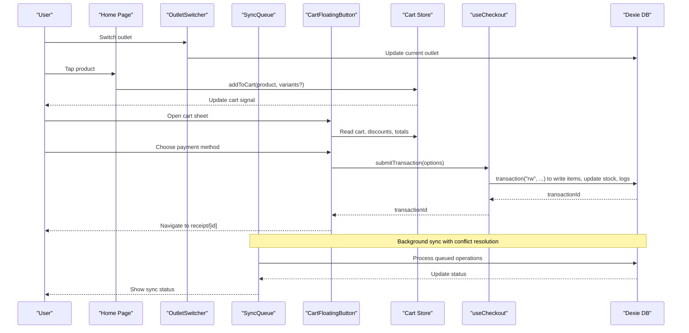
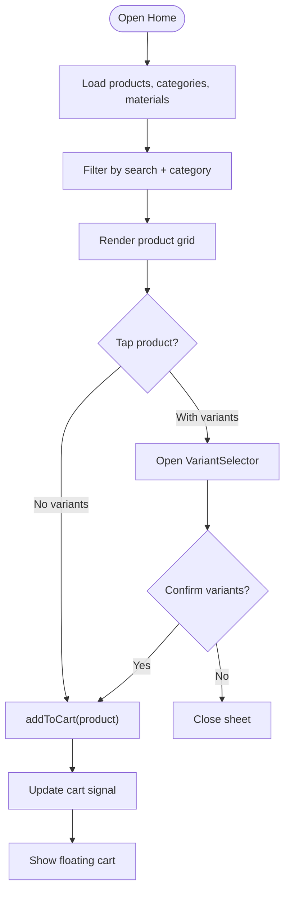
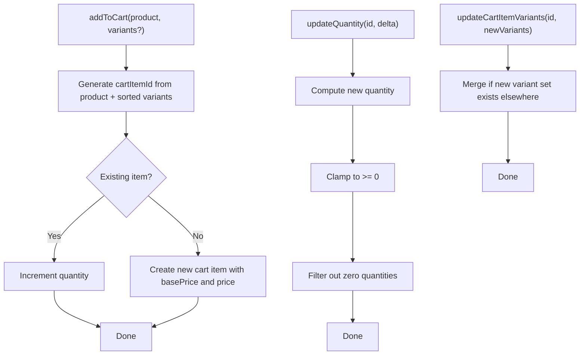
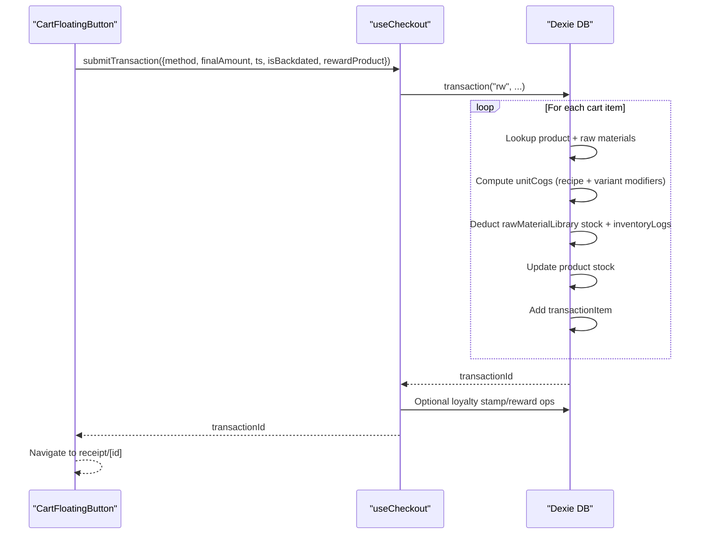
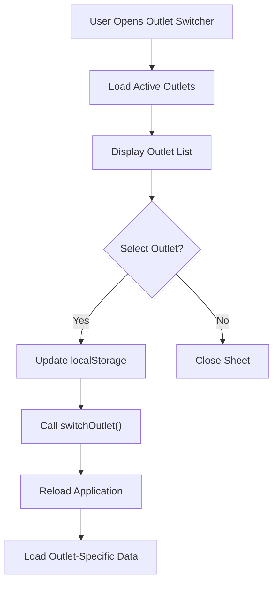
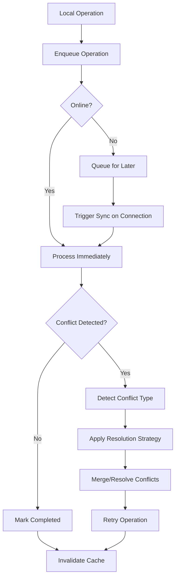
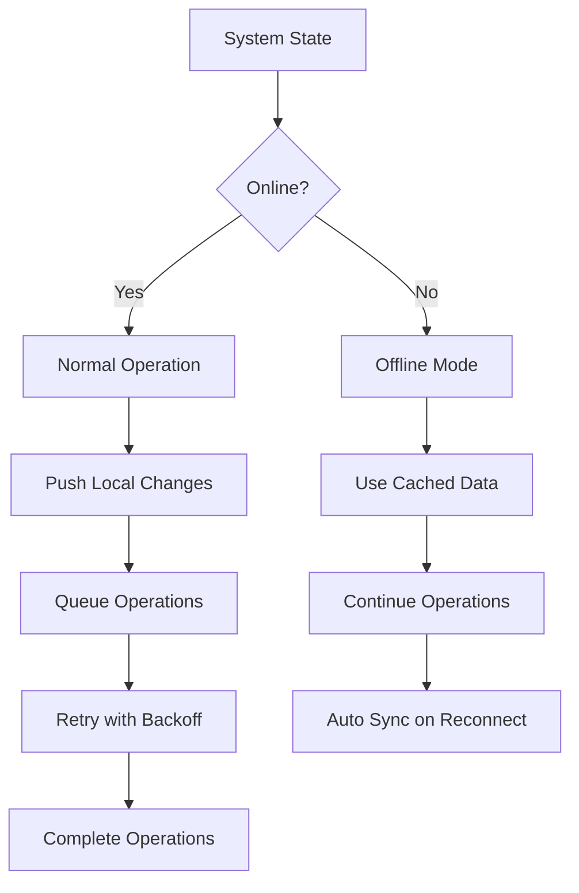
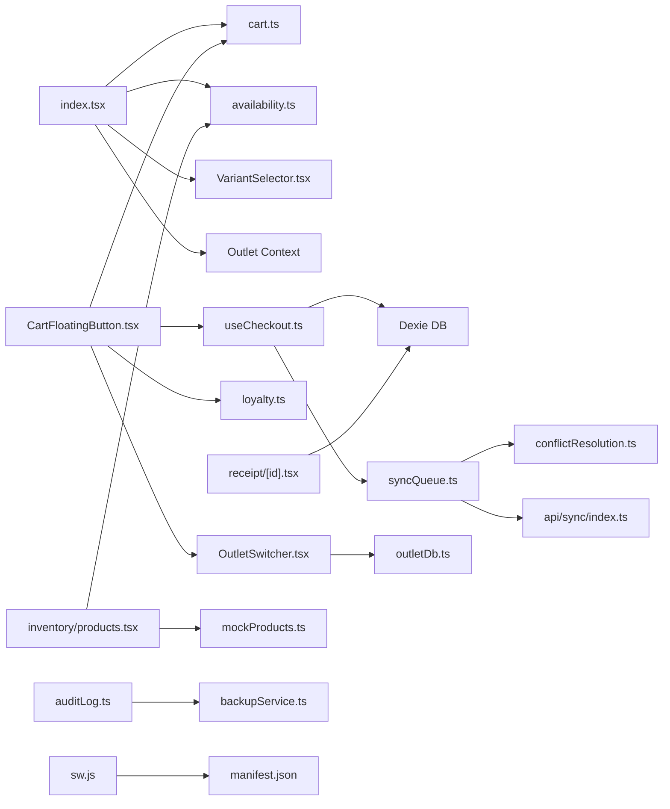

# POS System

<cite>
**Referenced Files in This Document**
- [README.md](file://README.md)
- [PRD.txt](file://PRD.txt)
- [src/app.tsx](file://src/app.tsx)
- [src/routes/app/index.tsx](file://src/routes/app/index.tsx)
- [src/routes/app/inventory/products.tsx](file://src/routes/app/inventory/products.tsx)
- [src/routes/app/receipt/[id].tsx](file://src/routes/app/receipt/[id].tsx)
- [src/components/ProductImage.tsx](file://src/components/ProductImage.tsx)
- [src/components/VariantSelector.tsx](file://src/components/VariantSelector.tsx)
- [src/components/CartFloatingButton.tsx](file://src/components/CartFloatingButton.tsx)
- [src/components/OutletSwitcher.tsx](file://src/components/OutletSwitcher.tsx)
- [src/stores/cart.ts](file://src/stores/cart.ts)
- [src/hooks/useCheckout.ts](file://src/hooks/useCheckout.ts)
- [src/lib/availability.ts](file://src/lib/availability.ts)
- [src/lib/syncQueue.ts](file://src/lib/syncQueue.ts)
- [src/lib/syncService.ts](file://src/lib/syncService.ts)
- [src/lib/conflictResolution.ts](file://src/lib/conflictResolution.ts)
- [src/lib/auditLog.ts](file://src/lib/auditLog.ts)
- [src/lib/backupService.ts](file://src/lib/backupService.ts)
- [src/db/outletDb.ts](file://src/db/outletDb.ts)
- [src/routes/api/sync/index.ts](file://src/routes/api/sync/index.ts)
- [public/sw.js](file://public/sw.js)
- [public/manifest.json](file://public/manifest.json)
- [src/data/mockProducts.ts](file://src/data/mockProducts.ts)
- [src/stores/loyalty.ts](file://src/stores/loyalty.ts)
</cite>

## Update Summary
**Changes Made**
- Added comprehensive multi-outlet support with outlet switching and management
- Enhanced synchronization system with advanced conflict resolution and queue management
- Implemented enterprise-grade audit logging and backup capabilities
- Added Progressive Web App (PWA) support with service worker and offline functionality
- Updated architecture to support enterprise-scale POS operations

## Table of Contents
1. [Introduction](#introduction)
2. [Project Structure](#project-structure)
3. [Core Components](#core-components)
4. [Architecture Overview](#architecture-overview)
5. [Detailed Component Analysis](#detailed-component-analysis)
6. [Multi-Outlet Support](#multi-outlet-support)
7. [Enhanced Synchronization System](#enhanced-synchronization-system)
8. [Enterprise Features](#enterprise-features)
9. [PWA Implementation](#pwa-implementation)
10. [Dependency Analysis](#dependency-analysis)
11. [Performance Considerations](#performance-considerations)
12. [Troubleshooting Guide](#troubleshooting-guide)
13. [Conclusion](#conclusion)
14. [Appendices](#appendices)

## Introduction
NgePos is a comprehensive mobile-first Point of Sale (POS) system tailored for enterprise-scale food and beverage (F&B) businesses in Indonesia. The system has undergone a comprehensive transformation to support multi-outlet operations, enhanced synchronization, audit logging, backup capabilities, and Progressive Web App (PWA) functionality. It emphasizes instant checkout, offline-first operation using IndexedDB via Dexie.js, and a streamlined POS interface optimized for quick transactions on mobile devices.

Key enterprise features include multi-outlet management with real-time switching, advanced conflict resolution for concurrent data modifications, comprehensive audit trails, automated backup and restore capabilities, and robust offline-first PWA architecture. The system supports product catalogs with search and category filtering, variant selection, shopping cart management with real-time totals, and checkout with multiple payment methods including cash, QRIS, and delivery platforms. It also includes receipt generation, backdated transaction recording, and comprehensive financial reporting.

**Section sources**
- [PRD.txt: 1-330:1-330](file://PRD.txt#L1-L330)
- [README.md: 1-33:1-33](file://README.md#L1-L33)

## Project Structure
The project is organized around a SPA built with SolidStart, using a custom component library, TailwindCSS for styling, and Dexie.js for local data persistence. The POS interface resides primarily under routes/app, with dedicated pages for the instant checkout grid, product catalog, receipts, and settings. The system now includes comprehensive multi-outlet support, enhanced synchronization infrastructure, audit logging, backup services, and PWA capabilities.

```mermaid
graph TB
subgraph "App Shell"
APP["src/app.tsx"]
PWA["PWA Manifest & Service Worker"]
end
subgraph "POS Routes"
HOME["src/routes/app/index.tsx"]
PRODUCTS["src/routes/app/inventory/products.tsx"]
RECEIPT["src/routes/app/receipt/[id].tsx"]
SETTINGS["src/routes/app/settings/index.tsx"]
OUTLET["src/routes/app/settings/outlet.tsx"]
end
subgraph "Multi-Outlet Support"
OUTLETDB["src/db/outletDb.ts"]
OUTLET_SWITCHER["src/components/OutletSwitcher.tsx"]
END
subgraph "Enhanced Sync System"
SYNC_QUEUE["src/lib/syncQueue.ts"]
SYNC_SERVICE["src/lib/syncService.ts"]
CONFLICT_RES["src/lib/conflictResolution.ts"]
API_SYNC["src/routes/api/sync/index.ts"]
end
subgraph "Enterprise Features"
AUDIT_LOG["src/lib/auditLog.ts"]
BACKUP["src/lib/backupService.ts"]
end
subgraph "Core Components"
CARTBTN["src/components/CartFloatingButton.tsx"]
VARIANTSEL["src/components/VariantSelector.tsx"]
PRODIMG["src/components/ProductImage.tsx"]
end
subgraph "Stores & Hooks"
CARTSTORE["src/stores/cart.ts"]
LOYALTY["src/stores/loyalty.ts"]
USECHECKOUT["src/hooks/useCheckout.ts"]
end
subgraph "Libraries"
AVAIL["src/lib/availability.ts"]
MOCK["src/data/mockProducts.ts"]
end
APP --> HOME
APP --> PRODUCTS
APP --> RECEIPT
APP --> SETTINGS
SETTINGS --> OUTLET
HOME --> CARTBTN
HOME --> VARIANTSEL
HOME --> PRODIMG
CARTBTN --> USECHECKOUT
CARTBTN --> CARTSTORE
CARTBTN --> LOYALTY
PRODUCTS --> AVAIL
PRODUCTS --> MOCK
OUTLET_SWITCHER --> OUTLETDB
SYNC_QUEUE --> API_SYNC
SYNC_SERVICE --> API_SYNC
AUDIT_LOG --> BACKUP
```

**Diagram sources**
- [src/app.tsx: 1-42:1-42](file://src/app.tsx#L1-L42)
- [src/routes/app/index.tsx: 1-282:1-282](file://src/routes/app/index.tsx#L1-L282)
- [src/routes/app/inventory/products.tsx: 1-800:1-800](file://src/routes/app/inventory/products.tsx#L1-L800)
- [src/routes/app/receipt/[id].tsx: 1-190](file://src/routes/app/receipt/[id].tsx#L1-L190)
- [src/routes/app/settings/index.tsx: 1-140:1-140](file://src/routes/app/settings/index.tsx#L1-L140)
- [src/routes/app/settings/outlet.tsx: 1-167:1-167](file://src/routes/app/settings/outlet.tsx#L1-L167)
- [src/components/CartFloatingButton.tsx: 1-955:1-955](file://src/components/CartFloatingButton.tsx#L1-L955)
- [src/components/VariantSelector.tsx: 1-205:1-205](file://src/components/VariantSelector.tsx#L1-L205)
- [src/components/ProductImage.tsx: 1-60:1-60](file://src/components/ProductImage.tsx#L1-L60)
- [src/components/OutletSwitcher.tsx: 1-203:1-203](file://src/components/OutletSwitcher.tsx#L1-L203)
- [src/db/outletDb.ts: 1-169:1-169](file://src/db/outletDb.ts#L1-L169)
- [src/lib/syncQueue.ts: 1-597:1-597](file://src/lib/syncQueue.ts#L1-L597)
- [src/lib/syncService.ts: 1-111:1-111](file://src/lib/syncService.ts#L1-L111)
- [src/lib/conflictResolution.ts: 1-258:1-258](file://src/lib/conflictResolution.ts#L1-L258)
- [src/lib/auditLog.ts: 1-111:1-111](file://src/lib/auditLog.ts#L1-L111)
- [src/lib/backupService.ts: 1-264:1-264](file://src/lib/backupService.ts#L1-L264)
- [src/routes/api/sync/index.ts: 1-155:1-155](file://src/routes/api/sync/index.ts#L1-L155)
- [public/sw.js: 1-107:1-107](file://public/sw.js#L1-L107)
- [public/manifest.json: 1-28:1-28](file://public/manifest.json#L1-L28)
- [src/stores/cart.ts: 1-257:1-257](file://src/stores/cart.ts#L1-L257)
- [src/hooks/useCheckout.ts: 1-217:1-217](file://src/hooks/useCheckout.ts#L1-L217)
- [src/lib/availability.ts: 1-40:1-40](file://src/lib/availability.ts#L1-L40)
- [src/data/mockProducts.ts: 1-85:1-85](file://src/data/mockProducts.ts#L1-L85)
- [src/stores/loyalty.ts: 1-174:1-174](file://src/stores/loyalty.ts#L1-L174)

**Section sources**
- [src/app.tsx: 1-42:1-42](file://src/app.tsx#L1-L42)
- [src/routes/app/index.tsx: 1-282:1-282](file://src/routes/app/index.tsx#L1-L282)
- [src/routes/app/inventory/products.tsx: 1-800:1-800](file://src/routes/app/inventory/products.tsx#L1-L800)
- [src/routes/app/receipt/[id].tsx: 1-190](file://src/routes/app/receipt/[id].tsx#L1-L190)
- [src/routes/app/settings/index.tsx: 1-140:1-140](file://src/routes/app/settings/index.tsx#L1-L140)
- [src/routes/app/settings/outlet.tsx: 1-167:1-167](file://src/routes/app/settings/outlet.tsx#L1-L167)
- [src/components/CartFloatingButton.tsx: 1-955:1-955](file://src/components/CartFloatingButton.tsx#L1-L955)
- [src/components/VariantSelector.tsx: 1-205:1-205](file://src/components/VariantSelector.tsx#L1-L205)
- [src/components/ProductImage.tsx: 1-60:1-60](file://src/components/ProductImage.tsx#L1-L60)
- [src/components/OutletSwitcher.tsx: 1-203:1-203](file://src/components/OutletSwitcher.tsx#L1-L203)
- [src/db/outletDb.ts: 1-169:1-169](file://src/db/outletDb.ts#L1-L169)
- [src/lib/syncQueue.ts: 1-597:1-597](file://src/lib/syncQueue.ts#L1-L597)
- [src/lib/syncService.ts: 1-111:1-111](file://src/lib/syncService.ts#L1-L111)
- [src/lib/conflictResolution.ts: 1-258:1-258](file://src/lib/conflictResolution.ts#L1-L258)
- [src/lib/auditLog.ts: 1-111:1-111](file://src/lib/auditLog.ts#L1-L111)
- [src/lib/backupService.ts: 1-264:1-264](file://src/lib/backupService.ts#L1-L264)
- [src/routes/api/sync/index.ts: 1-155:1-155](file://src/routes/api/sync/index.ts#L1-L155)
- [public/sw.js: 1-107:1-107](file://public/sw.js#L1-L107)
- [public/manifest.json: 1-28:1-28](file://public/manifest.json#L1-L28)
- [src/stores/cart.ts: 1-257:1-257](file://src/stores/cart.ts#L1-L257)
- [src/hooks/useCheckout.ts: 1-217:1-217](file://src/hooks/useCheckout.ts#L1-L217)
- [src/lib/availability.ts: 1-40:1-40](file://src/lib/availability.ts#L1-L40)
- [src/data/mockProducts.ts: 1-85:1-85](file://src/data/mockProducts.ts#L1-L85)
- [src/stores/loyalty.ts: 1-174:1-174](file://src/stores/loyalty.ts#L1-L174)

## Core Components
- Instant Checkout Interface (Home Grid)
  - Mobile-optimized product grid with category tabs and search.
  - Variant selection via a bottom sheet for products with variants.
  - Real-time cart updates with floating cart button showing count and total.
  - Availability checks and low-stock indicators.

- Shopping Cart Management
  - Add/remove items, adjust quantities, and edit variants.
  - Real-time subtotal, discounts, and total computation.
  - Campaign-based discount logic with bulk and bundle rules.
  - Backdated transaction support with timestamp selection.

- Product Catalog
  - Search and filter by category.
  - Variant templates and material libraries for recipes.
  - Margin analytics with 4-tier status and educational guide.

- Checkout and Payments
  - Cash, QRIS, and delivery platform payment methods.
  - Platform price adjustment with markup/discount tracking.
  - Loyalty stamping and reward claiming integrated into checkout.
  - Receipt generation with variant details and discount notes.

- Multi-Outlet Management
  - Real-time outlet switching with persistent selection.
  - Outlet-specific data isolation and synchronization.
  - Headquarters and branch outlet hierarchy management.
  - Outlet statistics and sync queue monitoring.

- Enhanced Synchronization
  - Advanced conflict detection and resolution system.
  - Queue-based operation queuing with retry mechanisms.
  - Network-aware synchronization with exponential backoff.
  - Version vector tracking for concurrent modifications.

- Enterprise Features
  - Comprehensive audit logging with local and remote tracking.
  - Automated backup and restore with integrity verification.
  - Progressive Web App with offline functionality and caching.
  - Real-time sync status monitoring and notifications.

- Receipt Generation
  - Digital receipt page with thermal-style layout and print support.
  - Includes outlet branding, cashier info, items, discounts, and payment method.

**Section sources**
- [src/routes/app/index.tsx: 1-282:1-282](file://src/routes/app/index.tsx#L1-L282)
- [src/stores/cart.ts: 1-257:1-257](file://src/stores/cart.ts#L1-L257)
- [src/components/CartFloatingButton.tsx: 1-955:1-955](file://src/components/CartFloatingButton.tsx#L1-L955)
- [src/routes/app/inventory/products.tsx: 1-800:1-800](file://src/routes/app/inventory/products.tsx#L1-L800)
- [src/hooks/useCheckout.ts: 1-217:1-217](file://src/hooks/useCheckout.ts#L1-L217)
- [src/routes/app/receipt/[id].tsx: 1-190](file://src/routes/app/receipt/[id].tsx#L1-L190)
- [src/stores/loyalty.ts: 1-174:1-174](file://src/stores/loyalty.ts#L1-L174)
- [src/components/OutletSwitcher.tsx: 1-203:1-203](file://src/components/OutletSwitcher.tsx#L1-L203)
- [src/db/outletDb.ts: 1-169:1-169](file://src/db/outletDb.ts#L1-L169)
- [src/lib/syncQueue.ts: 1-597:1-597](file://src/lib/syncQueue.ts#L1-L597)
- [src/lib/conflictResolution.ts: 1-258:1-258](file://src/lib/conflictResolution.ts#L1-L258)
- [src/lib/auditLog.ts: 1-111:1-111](file://src/lib/auditLog.ts#L1-L111)
- [src/lib/backupService.ts: 1-264:1-264](file://src/lib/backupService.ts#L1-L264)

## Architecture Overview
The POS system uses a reactive store-based architecture with fine-grained signals and resources for state and data fetching. The system has been enhanced with enterprise-grade features including multi-outlet support, advanced synchronization with conflict resolution, comprehensive audit logging, and PWA capabilities. The checkout flow is encapsulated in a hook that performs IndexedDB transactions to ensure atomicity of inventory, COGS, and transaction logs. Payment methods are integrated via UI handlers that delegate to the checkout hook, which writes transaction items and updates inventory logs.



**Diagram sources**
- [src/routes/app/index.tsx: 66-82:66-82](file://src/routes/app/index.tsx#L66-L82)
- [src/components/OutletSwitcher.tsx: 48-65:48-65](file://src/components/OutletSwitcher.tsx#L48-L65)
- [src/stores/cart.ts: 16-48:16-48](file://src/stores/cart.ts#L16-L48)
- [src/components/CartFloatingButton.tsx: 195-236:195-L236)
- [src/hooks/useCheckout.ts: 38-213:38-213](file://src/hooks/useCheckout.ts#L38-L213)
- [src/lib/syncQueue.ts: 286-338:286-338](file://src/lib/syncQueue.ts#L286-L338)

## Detailed Component Analysis

### Instant Checkout Interface (Home Grid)
- Features
  - Category navigation with horizontal scroll and active state.
  - Search input with live filtering.
  - Dense grid of products with availability badges and stock warnings.
  - Variant badge and add button for variant-enabled products.
  - Floating cart trigger with animated cart count and total.

- Data Flow
  - Reads products, categories, and materials via createResource.
  - Filters products by search and category.
  - Uses availability helper to disable unavailable items.
  - Adds items to cart or opens variant selector.



**Diagram sources**
- [src/routes/app/index.tsx: 27-282:27-282](file://src/routes/app/index.tsx#L27-L282)
- [src/components/VariantSelector.tsx: 99-118:99-118](file://src/components/VariantSelector.tsx#L99-L118)
- [src/stores/cart.ts: 16-48:16-48](file://src/stores/cart.ts#L16-L48)
- [src/lib/availability.ts: 12-39:12-39](file://src/lib/availability.ts#L12-L39)

**Section sources**
- [src/routes/app/index.tsx: 27-282:27-282](file://src/routes/app/index.tsx#L27-L282)
- [src/components/ProductImage.tsx: 10-60:10-L60)
- [src/lib/availability.ts: 12-39:12-L39)

### Shopping Cart Management
- Features
  - Add items with optional variants; variant combinations generate unique cart item IDs.
  - Update quantities with min clamp to zero; remove when quantity reaches zero.
  - Edit variants per cart item; merges with existing items if variant combination matches.
  - Real-time discount calculation using active campaigns.
  - Clear cart and reset loyalty linkage.

- Pricing and Discounts
  - Base price plus cumulative variant modifiers.
  - Campaigns: bulk discounts per target product and bundle/combo rules with requirement fulfillment and reward application.
  - Total computed as subtotal minus campaign discounts minus loyalty reward value.



**Diagram sources**
- [src/stores/cart.ts: 16-106:16-L106)

**Section sources**
- [src/stores/cart.ts: 1-257:1-L257)

### Variant Selector
- Features
  - Single or multiple selection groups with required/optional rules.
  - Real-time price adjustment preview based on selected options.
  - Validation prevents proceeding without required selections.
  - Preserves initial variants when editing from cart.

- Behavior
  - Computes effective base price by subtracting initial variant modifiers if needed.
  - Confirms selection and returns normalized variant array to parent.

**Section sources**
- [src/components/VariantSelector.tsx: 1-205:1-L205)

### Checkout and Payment Integration
- Features
  - Cash: captures final amount equal to cart total.
  - QRIS: displays static QR image; success/failure confirmation triggers transaction.
  - Delivery Platforms: enables GoFood, GrabFood, ShopeeFood; requires setting toggles.
  - Platform Payments: prompts for actual received amount; computes difference/margin.
  - Backdate: allows selecting date/time for historical transactions.

- Processing
  - useCheckout performs a Dexie transaction to:
    - Compute COGS per item (recipe-based and variant modifiers).
    - Deduct raw material stock and log inventory movements.
    - Update product stock and persist transaction items.
    - Write transaction header with totals, discounts, payment method, timestamps, and flags.
  - After successful transaction, triggers background sync and navigates to receipt page.
  - Integrates with loyalty to add stamps and check/claim rewards.



**Diagram sources**
- [src/components/CartFloatingButton.tsx: 195-236:195-L236)
- [src/hooks/useCheckout.ts: 38-213:38-L213)

**Section sources**
- [src/components/CartFloatingButton.tsx: 1-955:1-L955)
- [src/hooks/useCheckout.ts: 1-217:1-L217)
- [src/stores/loyalty.ts: 1-174:1-L174)

### Receipt Generation
- Features
  - Loads transaction and items by ID.
  - Renders outlet branding, cashier name, timestamp, receipt number.
  - Lists items with quantities, unit prices, and variant details.
  - Shows subtotal, promo discount, and platform adjustment if applicable.
  - Provides print action and navigation back to POS.

**Section sources**
- [src/routes/app/receipt/[id].tsx: 1-190](file://src/routes/app/receipt/[id].tsx#L1-L190)

### Product Catalog and Inventory
- Features
  - Search by product or category name.
  - View modes: grid/list with toggle persisted in localStorage.
  - Add/edit products with variants, raw materials, and discount rules.
  - Variant templates and material library with smart sync and auto-registration.
  - Margin analytics with 4-tier status and educational guide.

**Section sources**
- [src/routes/app/inventory/products.tsx: 1-800:1-L800)
- [src/data/mockProducts.ts: 1-85:1-L85)

## Multi-Outlet Support
The system now supports comprehensive multi-outlet operations with real-time switching and data isolation.

### Outlet Management System
- **Outlet Database Schema**: Dedicated Dexie database for outlet management with support for multiple outlets, user-outlet associations, and sync queues.
- **Real-Time Switching**: Seamless outlet switching with persistent selection stored in localStorage.
- **Outlet Hierarchy**: Supports headquarters and branch outlet types with role-based access control.
- **Data Isolation**: Each outlet maintains separate product catalogs, inventory, and transaction data.

### Key Features
- **Outlet Switcher Component**: Interactive bottom sheet allowing users to switch between active outlets with visual indicators.
- **User Outlet Associations**: Links users to multiple outlets with role assignments (OWNER, MANAGER, CASHIER).
- **Outlet Statistics**: Real-time monitoring of outlet activity, sync queue status, and failed operations.
- **Persistent Selection**: Current outlet selection persists across browser sessions and page reloads.



**Diagram sources**
- [src/components/OutletSwitcher.tsx: 29-65:29-L65)
- [src/db/outletDb.ts: 61-91:61-L91)

**Section sources**
- [src/components/OutletSwitcher.tsx: 1-203:1-L203)
- [src/db/outletDb.ts: 1-169:1-L169)

## Enhanced Synchronization System
The synchronization system has been completely redesigned with advanced conflict resolution and queue management.

### Advanced Sync Architecture
- **Queue-Based Operations**: All data modifications are queued for asynchronous processing with retry mechanisms.
- **Conflict Detection**: Sophisticated conflict detection using version vectors and timestamp comparisons.
- **Automatic Resolution**: Multiple conflict resolution strategies including last-write-wins, manual resolution, and merge strategies.
- **Network Awareness**: Intelligent retry with exponential backoff and network state detection.

### Sync Queue Management
- **Operation Types**: Supports CREATE, UPDATE, DELETE operations with entity-specific endpoints.
- **Batch Processing**: Processes operations in batches with configurable batch sizes and delays.
- **Status Tracking**: Real-time status tracking with completion, failed, and conflict states.
- **Error Recovery**: Automatic retry with progressive delays and error accumulation.

### Conflict Resolution Framework
- **Version Vectors**: Tracks operation versions across devices and outlets for accurate conflict detection.
- **Resolution Strategies**: Configurable strategies including local-wins, server-wins, last-write-wins, and manual resolution.
- **Merge Capabilities**: Intelligent merging of conflicting data with conflict identification and resolution.
- **Pending Conflicts**: Centralized management of unresolved conflicts with resolution interfaces.



**Diagram sources**
- [src/lib/syncQueue.ts: 286-338:286-L338)
- [src/lib/conflictResolution.ts: 134-202:134-L202)
- [src/lib/syncService.ts: 12-75:12-L75)

**Section sources**
- [src/lib/syncQueue.ts: 1-597:1-L597)
- [src/lib/conflictResolution.ts: 1-258:1-L258)
- [src/lib/syncService.ts: 1-111:1-L111)
- [src/routes/api/sync/index.ts: 1-155:1-L155)

## Enterprise Features
The system now includes comprehensive enterprise-grade features for business operations.

### Audit Logging System
- **Comprehensive Tracking**: Logs all significant operations with detailed metadata including user actions, entity changes, and system events.
- **Local Storage**: Maintains local audit logs for offline operations and later synchronization.
- **Remote Logging**: Integrates with server-side audit services for centralized logging and compliance.
- **Search and Reporting**: Provides filtering and searching capabilities for audit trail analysis.

### Backup and Restore Services
- **Automated Backups**: Creates periodic backups with configurable frequency and retention policies.
- **Integrity Verification**: SHA-256 checksum validation ensures backup data integrity.
- **Selective Restoration**: Allows restoration of specific data subsets with conflict resolution.
- **Compression and Encryption**: Optional compression and encryption for backup data security.

### Progressive Web App (PWA)
- **Offline Functionality**: Complete offline operation with service worker caching and indexedDB persistence.
- **Installable**: Full PWA support with manifest.json configuration for app installation.
- **Background Sync**: Background synchronization using service worker and background sync API.
- **Notifications**: Push notification support for important system events and sync status updates.



**Diagram sources**
- [public/sw.js: 32-61:32-L61)
- [public/manifest.json: 1-28:1-L28)
- [src/lib/backupService.ts: 57-131:57-L131)
- [src/lib/auditLog.ts: 27-78:27-L78)

**Section sources**
- [src/lib/auditLog.ts: 1-111:1-L111)
- [src/lib/backupService.ts: 1-264:1-L264)
- [public/sw.js: 1-107:1-L107)
- [public/manifest.json: 1-28:1-L28)

## Dependency Analysis
- Component Coupling
  - Home depends on cart store, availability helper, and outlet context.
  - CartFloatingButton orchestrates checkout, reads cart totals, and manages outlet switching.
  - useCheckout encapsulates DB transaction logic and integrates with sync queue.
  - VariantSelector is reusable and communicates via callbacks.
  - Receipt page depends on DB for transaction retrieval and settings for branding.
  - OutletSwitcher manages multi-outlet context and user outlet associations.
  - SyncQueue handles all data synchronization with conflict resolution.
  - AuditLog provides comprehensive logging for all operations.
  - BackupService manages data backup and restore operations.

- External Dependencies
  - Dexie.js for IndexedDB wrapper and multi-outlet database.
  - SolidJS signals/resources for state and data fetching.
  - Lucide icons and custom UI components.
  - Service Worker API for PWA functionality.
  - Crypto API for backup integrity verification.



**Diagram sources**
- [src/routes/app/index.tsx: 1-282:1-L282)
- [src/stores/cart.ts: 1-257:1-L257)
- [src/lib/availability.ts: 1-40:1-L40)
- [src/components/VariantSelector.tsx: 1-205:1-L205)
- [src/components/CartFloatingButton.tsx: 1-955:1-L955)
- [src/hooks/useCheckout.ts: 1-217:1-L217)
- [src/stores/loyalty.ts: 1-174:1-L174)
- [src/components/OutletSwitcher.tsx: 1-203:1-L203)
- [src/db/outletDb.ts: 1-169:1-L169)
- [src/lib/syncQueue.ts: 1-597:1-L597)
- [src/lib/conflictResolution.ts: 1-258:1-L258)
- [src/routes/api/sync/index.ts: 1-155:1-L155)
- [src/lib/auditLog.ts: 1-111:1-L111)
- [src/lib/backupService.ts: 1-264:1-L264)
- [public/sw.js: 1-107:1-L107)
- [public/manifest.json: 1-28:1-L28)

**Section sources**
- [src/routes/app/index.tsx: 1-282:1-L282)
- [src/stores/cart.ts: 1-257:1-L257)
- [src/components/CartFloatingButton.tsx: 1-955:1-L955)
- [src/hooks/useCheckout.ts: 1-217:1-L217)
- [src/routes/app/receipt/[id].tsx: 1-190](file://src/routes/app/receipt/[id].tsx#L1-L190)
- [src/routes/app/inventory/products.tsx: 1-800:1-L800)
- [src/lib/availability.ts: 1-40:1-L40)
- [src/data/mockProducts.ts: 1-85:1-L85)
- [src/stores/loyalty.ts: 1-174:1-L174)
- [src/components/OutletSwitcher.tsx: 1-203:1-L203)
- [src/db/outletDb.ts: 1-169:1-L169)
- [src/lib/syncQueue.ts: 1-597:1-L597)
- [src/lib/conflictResolution.ts: 1-258:1-L258)
- [src/lib/auditLog.ts: 1-111:1-L111)
- [src/lib/backupService.ts: 1-264:1-L264)
- [public/sw.js: 1-107:1-L107)
- [public/manifest.json: 1-28:1-L28)

## Performance Considerations
- Mobile-First UI
  - Large touch targets and simplified flows reduce tap distance and cognitive load.
  - Skeleton loaders for product grid improve perceived performance during initial load.

- Reactive Updates
  - Fine-grained signals minimize re-renders; cart totals and discounts computed on demand.
  - createResource prefetches categories, materials, and products to avoid blocking UI.

- IndexedDB Transactions
  - useCheckout wraps inventory updates and transaction writes in a single IndexedDB transaction to ensure consistency and reduce IO overhead.

- Lazy Loading
  - QR scanner is lazy-loaded to reduce initial bundle size.

- Multi-Outlet Optimization
  - Outlet-specific data loading reduces memory footprint and improves performance.
  - Persistent outlet selection minimizes repeated data loading.

- Enhanced Synchronization
  - Batch processing reduces API calls and server load.
  - Exponential backoff prevents server overload during retry scenarios.
  - Conflict resolution minimizes data conflicts and reprocessing.

- PWA Benefits
  - Service worker caching reduces server requests and improves load times.
  - Offline operation maintains functionality during connectivity issues.
  - Background sync processes occur when network conditions are optimal.

- Recommendations
  - Debounce search input to limit frequent filtering.
  - Virtualize long lists if product catalogs grow large.
  - Persist view preferences and cart state to IndexedDB for continuity.
  - Monitor sync queue status to prevent overwhelming server capacity.

## Troubleshooting Guide
- Empty Cart on Checkout
  - Symptom: Error toast indicates empty cart.
  - Cause: Cart snapshot is empty before checkout.
  - Resolution: Ensure addToCart is called before opening payment dialog.

- Variant Validation Failures
  - Symptom: Alert prompts to select required variants.
  - Cause: Missing selection in required groups.
  - Resolution: Ensure all required groups are selected before confirming.

- QRIS Payment Failure
  - Symptom: Payment marked failed; transaction not saved.
  - Cause: User confirmed failure or network error.
  - Resolution: Allow retry or switch to cash/platform method.

- Platform Adjustment Mismatch
  - Symptom: Discrepancy noted on receipt.
  - Cause: Difference between app total and actual received amount.
  - Resolution: Use adjustment step to set received amount and review margin.

- Database Errors During Checkout
  - Symptom: Critical checkout error toast.
  - Cause: Transaction failure (stock mismatch, invalid variants).
  - Resolution: Verify product availability, variant validity, and material stock.

- Multi-Outlet Issues
  - Symptom: Data appears incorrect after outlet switch.
  - Cause: Cached data from previous outlet.
  - Resolution: Force refresh or wait for automatic sync to complete.

- Synchronization Failures
  - Symptom: Operations stuck in PENDING state.
  - Cause: Network issues or server errors.
  - Resolution: Check network connection, review sync queue status, retry failed operations.

- Conflict Resolution Problems
  - Symptom: Conflicts not resolving automatically.
  - Cause: Manual resolution required or merge conflicts.
  - Resolution: Review pending conflicts, apply appropriate resolution strategy.

- Backup/Restore Issues
  - Symptom: Backup integrity check fails.
  - Cause: Corrupted backup data or checksum mismatch.
  - Resolution: Create new backup, verify data integrity, check storage limits.

**Section sources**
- [src/hooks/useCheckout.ts: 206-213:206-L213)
- [src/components/CartFloatingButton.tsx: 680-747:680-L747)
- [src/components/VariantSelector.tsx: 103-111:103-L111)
- [src/components/OutletSwitcher.tsx: 48-65:48-L65)
- [src/lib/syncQueue.ts: 471-490:471-L490)
- [src/lib/backupService.ts: 147-149:147-L149)

## Conclusion
NgePos has evolved into a comprehensive enterprise-grade POS solution with multi-outlet support, advanced synchronization, and robust operational features. The system delivers a fast, mobile-optimized POS experience with extensive offline capabilities, comprehensive audit logging, automated backup and restore, and Progressive Web App functionality. The instant checkout interface, shopping cart with variant support, and campaign-based discount engine streamline daily operations across multiple business locations. Payment integration spans cash, QRIS, and delivery platforms, while receipts and reporting provide transparency. The modular component architecture, IndexedDB-backed stores, and enterprise-grade features enable scalable operations for growing F&B businesses.

## Appendices

### Practical Examples of POS Operations
- Adding an item with variants
  - Tap product; if variants exist, VariantSelector appears; choose options; confirm; item added to cart with variant modifiers applied.
  - Reference: [src/routes/app/index.tsx: 66-82:66-L82), [src/components/VariantSelector.tsx: 99-118:99-L118), [src/stores/cart.ts: 16-48:16-L48)

- Editing item quantity and variants in cart
  - Open cart sheet; adjust quantity or edit variants; cart updates instantly with recalculated totals and discounts.
  - Reference: [src/components/CartFloatingButton.tsx: 498-526:498-L526), [src/stores/cart.ts: 96-106:96-L106), [src/stores/cart.ts: 50-94:50-L94)

- Completing a cash payment
  - Open payment dialog; select cash; confirm; transaction saved; navigate to receipt.
  - Reference: [src/components/CartFloatingButton.tsx: 195-206:195-L206), [src/hooks/useCheckout.ts: 38-172:38-L172)

- Completing a QRIS payment
  - Open payment dialog; select QRIS; scan and confirm success; transaction saved; navigate to receipt.
  - Reference: [src/components/CartFloatingButton.tsx: 208-223:208-L223), [src/components/CartFloatingButton.tsx: 832-897:832-L897)

- Recording a backdated transaction
  - Open cart sheet; toggle backdate; pick date/time; proceed with payment; receipt shows lampau badge.
  - Reference: [src/components/CartFloatingButton.tsx: 357-447:357-L447)

- Switching between outlets
  - Open outlet switcher; select target outlet; system loads outlet-specific data and refreshes UI.
  - Reference: [src/components/OutletSwitcher.tsx: 48-65:48-L65), [src/db/outletDb.ts: 85-91:85-L91)

- Managing sync conflicts
  - Review pending conflicts in sync status; apply resolution strategy (local/server/merge); retry operation.
  - Reference: [src/lib/syncQueue.ts: 492-519:492-L519), [src/lib/conflictResolution.ts: 170-189:170-L189)

- Creating and restoring backups
  - Generate backup with selective options; verify integrity; restore to clean database state.
  - Reference: [src/lib/backupService.ts: 57-131:57-L131), [src/lib/backupService.ts: 133-177:133-L177)

- Viewing a receipt
  - Navigate to receipt/[id]; receipt displays items, discounts, and payment method; print supported.
  - Reference: [src/routes/app/receipt/[id].tsx: 13-190](file://src/routes/app/receipt/[id].tsx#L13-L190)

### Error Handling During Checkout
- Empty cart
  - Toast error; ensure items are added before checkout.
  - Reference: [src/hooks/useCheckout.ts: 48-51:48-L51)

- Transaction failure
  - Toast critical error; inspect console; retry or switch payment method.
  - Reference: [src/hooks/useCheckout.ts: 206-213:206-L213)

- Variant validation
  - Alert prompts for required selections; ensure all mandatory groups are chosen.
  - Reference: [src/components/VariantSelector.tsx: 103-111:103-L111)

- Multi-outlet data conflicts
  - Data from wrong outlet displayed; switch to correct outlet and refresh.
  - Reference: [src/components/OutletSwitcher.tsx: 50-65:50-L65)

- Sync queue failures
  - Operations stuck in PENDING; check network, review queue status, retry failed items.
  - Reference: [src/lib/syncQueue.ts: 471-490:471-L490)

- Backup integrity errors
  - Checksum mismatch during restore; recreate backup or verify data corruption.
  - Reference: [src/lib/backupService.ts: 147-149:147-L149)

### Performance Optimization Tips
- Minimize re-renders by leveraging signals and memoized computations.
- Use createResource for preloading categories, materials, and products.
- Defer heavy UI like QR scanner until needed.
- Keep cart and product lists virtualized if scaling to thousands of items.
- Monitor outlet-specific data loading to optimize memory usage.
- Implement proper sync queue batching to reduce server load.
- Utilize PWA caching for improved offline performance.
- Regularly clean up old audit logs and backup data to maintain optimal storage usage.