# Product Management

<cite>
**Referenced Files in This Document**
- [products.tsx](file://src/routes/app/inventory/products.tsx)
- [categories.tsx](file://src/routes/app/inventory/categories.tsx)
- [materials.tsx](file://src/routes/app/inventory/materials.tsx)
- [variations.tsx](file://src/routes/app/inventory/variations.tsx)
- [ProductImage.tsx](file://src/components/ProductImage.tsx)
- [VariantSelector.tsx](file://src/components/VariantSelector.tsx)
- [product-selector.tsx](file://src/components/ui/product-selector.tsx)
- [db.ts](file://src/db/db.ts)
- [availability.ts](file://src/lib/availability.ts)
- [schema.ts](file://src/server/db/schema.ts)
- [seed.ts](file://src/server/db/seed.ts)
- [index.tsx](file://src/routes/app/inventory/index.tsx)
</cite>

## Table of Contents
1. [Introduction](#introduction)
2. [Project Structure](#project-structure)
3. [Core Components](#core-components)
4. [Architecture Overview](#architecture-overview)
5. [Detailed Component Analysis](#detailed-component-analysis)
6. [Dependency Analysis](#dependency-analysis)
7. [Performance Considerations](#performance-considerations)
8. [Troubleshooting Guide](#troubleshooting-guide)
9. [Conclusion](#conclusion)
10. [Appendices](#appendices)

## Introduction
This document describes the product management subsystem within the POS system. It covers the product catalog interface (listing, search, filtering), category management, product images, CRUD operations, variants and recipes, visibility controls, pricing strategies, and integration with inventory tracking. Practical examples and performance guidance are included for managing large product catalogs.

## Project Structure
The product management UI is organized under the inventory hub with dedicated routes for products, categories, materials, and variations. The local database schema defines the data model for products, categories, variants, materials, and related entities. Server-side schema supports backend reporting and inventory logs.

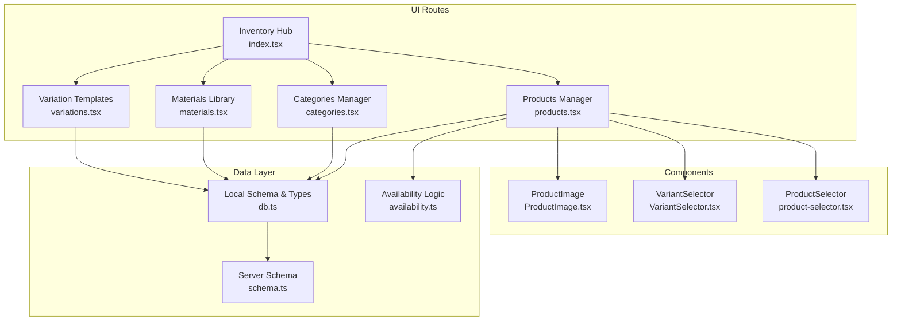

**Diagram sources**
- [index.tsx:13-46](file://src/routes/app/inventory/index.tsx#L13-L46)
- [products.tsx:92-111](file://src/routes/app/inventory/products.tsx#L92-L111)
- [categories.tsx:16-20](file://src/routes/app/inventory/categories.tsx#L16-L20)
- [materials.tsx:14-18](file://src/routes/app/inventory/materials.tsx#L14-L18)
- [variations.tsx:9-13](file://src/routes/app/inventory/variations.tsx#L9-L13)
- [ProductImage.tsx:10-19](file://src/components/ProductImage.tsx#L10-L19)
- [VariantSelector.tsx:16-46](file://src/components/VariantSelector.tsx#L16-L46)
- [product-selector.tsx:14-24](file://src/components/ui/product-selector.tsx#L14-L24)
- [db.ts:62-73](file://src/db/db.ts#L62-L73)
- [availability.ts:12-39](file://src/lib/availability.ts#L12-L39)
- [schema.ts:82-92](file://src/server/db/schema.ts#L82-L92)

**Section sources**
- [index.tsx:13-46](file://src/routes/app/inventory/index.tsx#L13-L46)

## Core Components
- Product Catalog Manager: Lists, filters, and edits products; manages images, visibility, variants, and recipes.
- Category Manager: Adds, edits, and deletes categories with ordering and icons.
- Materials Library: Maintains raw materials with units, costs, and activity status.
- Variations Library: Stores reusable variant templates for consistent product configurations.
- Product Image Component: Renders product images with fallback placeholders and error handling.
- Availability Utility: Computes product availability based on product toggle and ingredient/library status.
- Local Database Schema: Defines product, category, variant, material, discount, bundle, and campaign entities.

**Section sources**
- [products.tsx:92-111](file://src/routes/app/inventory/products.tsx#L92-L111)
- [categories.tsx:16-20](file://src/routes/app/inventory/categories.tsx#L16-L20)
- [materials.tsx:14-18](file://src/routes/app/inventory/materials.tsx#L14-L18)
- [variations.tsx:9-13](file://src/routes/app/inventory/variations.tsx#L9-L13)
- [ProductImage.tsx:10-19](file://src/components/ProductImage.tsx#L10-L19)
- [availability.ts:12-39](file://src/lib/availability.ts#L12-L39)
- [db.ts:62-73](file://src/db/db.ts#L62-L73)

## Architecture Overview
The product management subsystem combines a local IndexedDB-like store (Dexie) for offline-first UX with server-side relational tables for reporting and audit trails. The UI components coordinate state, persistence, and availability checks.

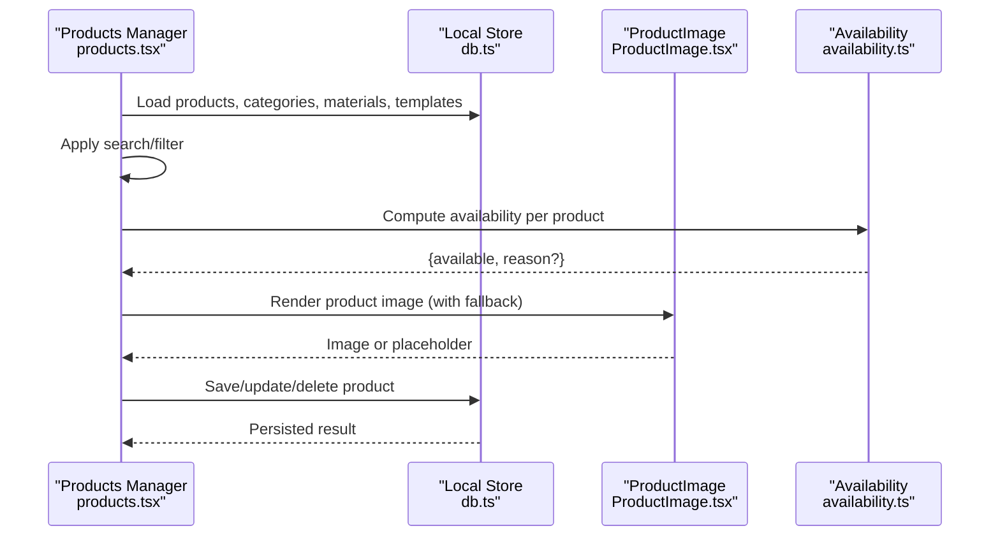

**Diagram sources**
- [products.tsx:94-111](file://src/routes/app/inventory/products.tsx#L94-L111)
- [db.ts:498-499](file://src/db/db.ts#L498-L499)
- [ProductImage.tsx:10-19](file://src/components/ProductImage.tsx#L10-L19)
- [availability.ts:12-39](file://src/lib/availability.ts#L12-L39)

## Detailed Component Analysis

### Product Catalog Interface
- Listing and Views: Supports list and grid views with toggling persisted in localStorage.
- Search and Filtering: Case-insensitive filter on product name and category.
- Visibility Controls: Per-product activation/deactivation; reflected in UI and availability checks.
- CRUD Operations: Add, edit, duplicate, and delete products; saving updates discounts and variants.
- Recipe Management: Tracks raw materials with quantities, units, and computed totals; syncs with materials library.
- Variants: Configurable variant groups (single/multiple selection) with price/cogs modifiers and ingredient adjustments.
- Pricing Strategies: Base price plus variant modifiers; HPP calculation and margin indicators.

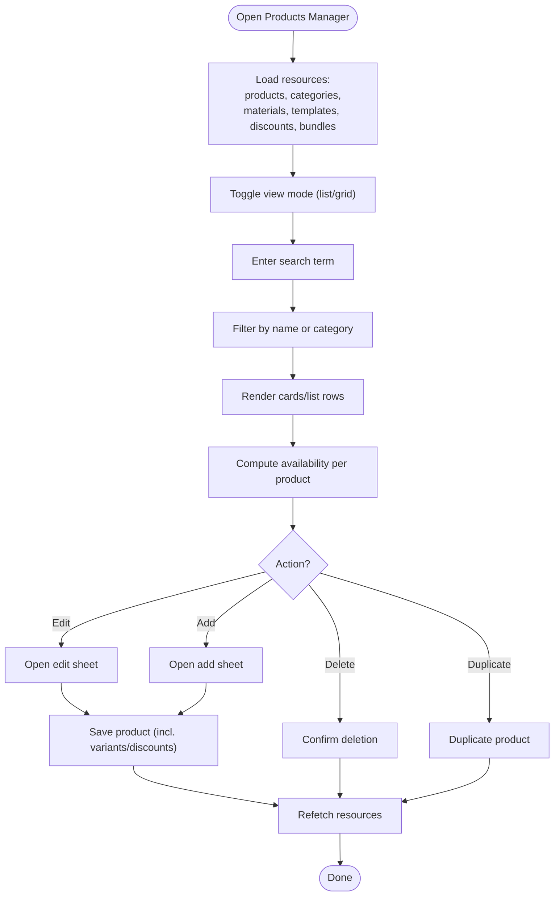

**Diagram sources**
- [products.tsx:94-111](file://src/routes/app/inventory/products.tsx#L94-L111)
- [products.tsx:155-166](file://src/routes/app/inventory/products.tsx#L155-L166)
- [products.tsx:237-279](file://src/routes/app/inventory/products.tsx#L237-L279)
- [products.tsx:437-449](file://src/routes/app/inventory/products.tsx#L437-L449)
- [products.tsx:281-303](file://src/routes/app/inventory/products.tsx#L281-L303)

**Section sources**
- [products.tsx:144-166](file://src/routes/app/inventory/products.tsx#L144-L166)
- [products.tsx:237-279](file://src/routes/app/inventory/products.tsx#L237-L279)
- [products.tsx:338-409](file://src/routes/app/inventory/products.tsx#L338-L409)
- [products.tsx:533-571](file://src/routes/app/inventory/products.tsx#L533-L571)
- [products.tsx:573-609](file://src/routes/app/inventory/products.tsx#L573-L609)
- [products.tsx:1018-1162](file://src/routes/app/inventory/products.tsx#L1018-L1162)
- [products.tsx:1165-1511](file://src/routes/app/inventory/products.tsx#L1165-L1511)
- [products.tsx:1514-1992](file://src/routes/app/inventory/products.tsx#L1514-L1992)

### Category Management
- Hierarchical Organization: Categories are ordered by index; icons are selectable.
- CRUD: Add, edit, and delete categories; prevents deletion if products exist in category.
- Integration: Products reference category names; updates propagate to product listings.

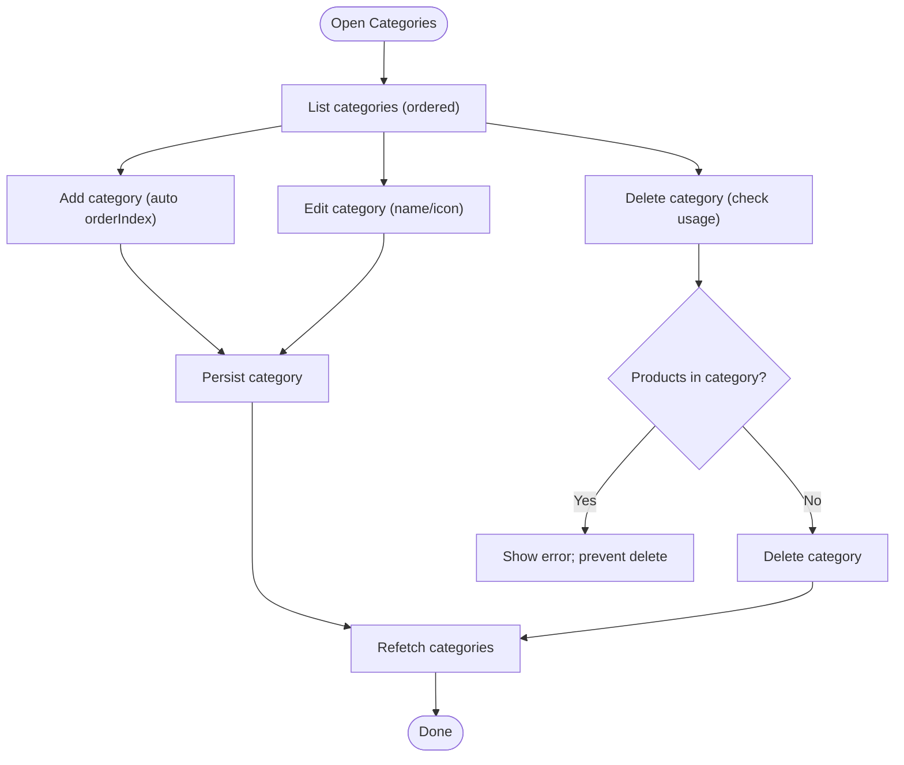

**Diagram sources**
- [categories.tsx:16-20](file://src/routes/app/inventory/categories.tsx#L16-L20)
- [categories.tsx:34-66](file://src/routes/app/inventory/categories.tsx#L34-L66)
- [categories.tsx:68-89](file://src/routes/app/inventory/categories.tsx#L68-L89)

**Section sources**
- [categories.tsx:16-20](file://src/routes/app/inventory/categories.tsx#L16-L20)
- [categories.tsx:34-66](file://src/routes/app/inventory/categories.tsx#L34-L66)
- [categories.tsx:68-89](file://src/routes/app/inventory/categories.tsx#L68-L89)

### Product Image Management
- Rendering: Uses ProductImage component to show uploaded images or fallback placeholders.
- Fallback: Generates initials-based gradient placeholder; decorative icons and lazy loading.
- Error Handling: Swaps to fallback when image fails to load.

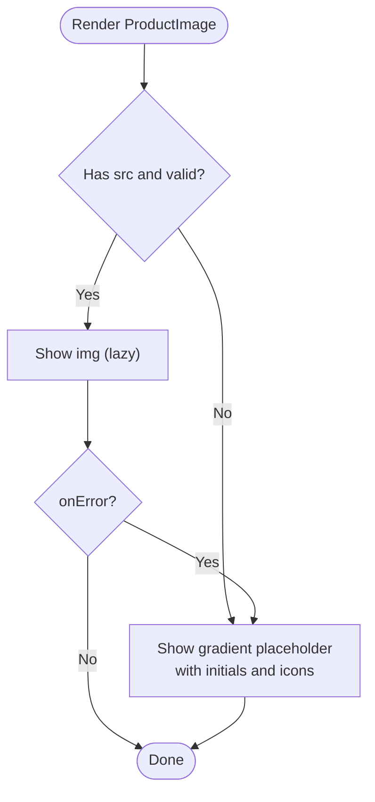

**Diagram sources**
- [ProductImage.tsx:10-19](file://src/components/ProductImage.tsx#L10-L19)
- [ProductImage.tsx:48-56](file://src/components/ProductImage.tsx#L48-L56)

**Section sources**
- [ProductImage.tsx:10-19](file://src/components/ProductImage.tsx#L10-L19)

### Recipe Management (Raw Materials)
- Ingredients Tracking: Each product maintains a list of raw materials with name, unit, quantity, and cost.
- Sync with Library: Smart matching by ID or name; auto-register unknown materials; update linked costs.
- HPP Calculation: Sum of ingredient costs; margin computation and status indicators.
- Material Library: Centralized library with units, costs, and activity status; supports bulk operations.

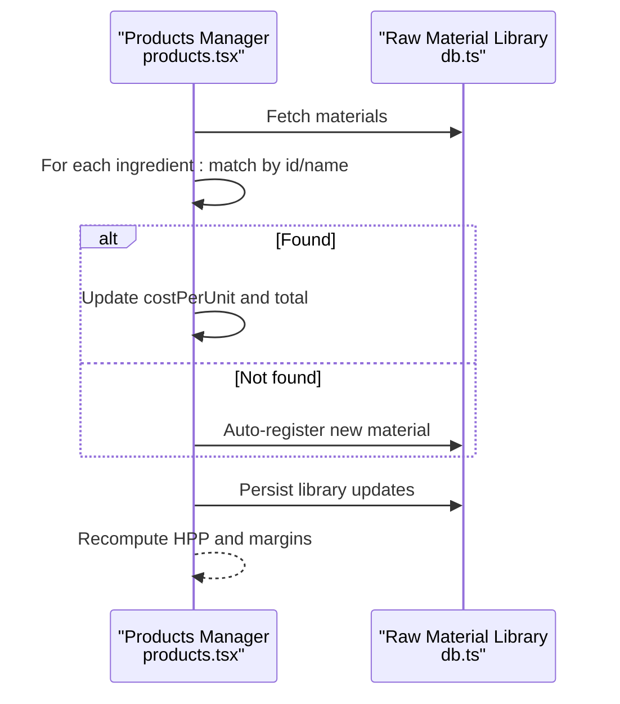

**Diagram sources**
- [products.tsx:338-409](file://src/routes/app/inventory/products.tsx#L338-L409)
- [db.ts:16-24](file://src/db/db.ts#L16-L24)

**Section sources**
- [products.tsx:305-409](file://src/routes/app/inventory/products.tsx#L305-L409)
- [materials.tsx:14-18](file://src/routes/app/inventory/materials.tsx#L14-L18)

### Variants and Variant Templates
- Variant Groups: Define required/single-or-multiple selection, optional max selectable, and options with price/cogs modifiers.
- Ingredient Adjustments: Per-option adjustments to ingredients; auto-calculate cogs modifiers.
- Templates: Save reusable variant groups; assign templates to products; manage template library.

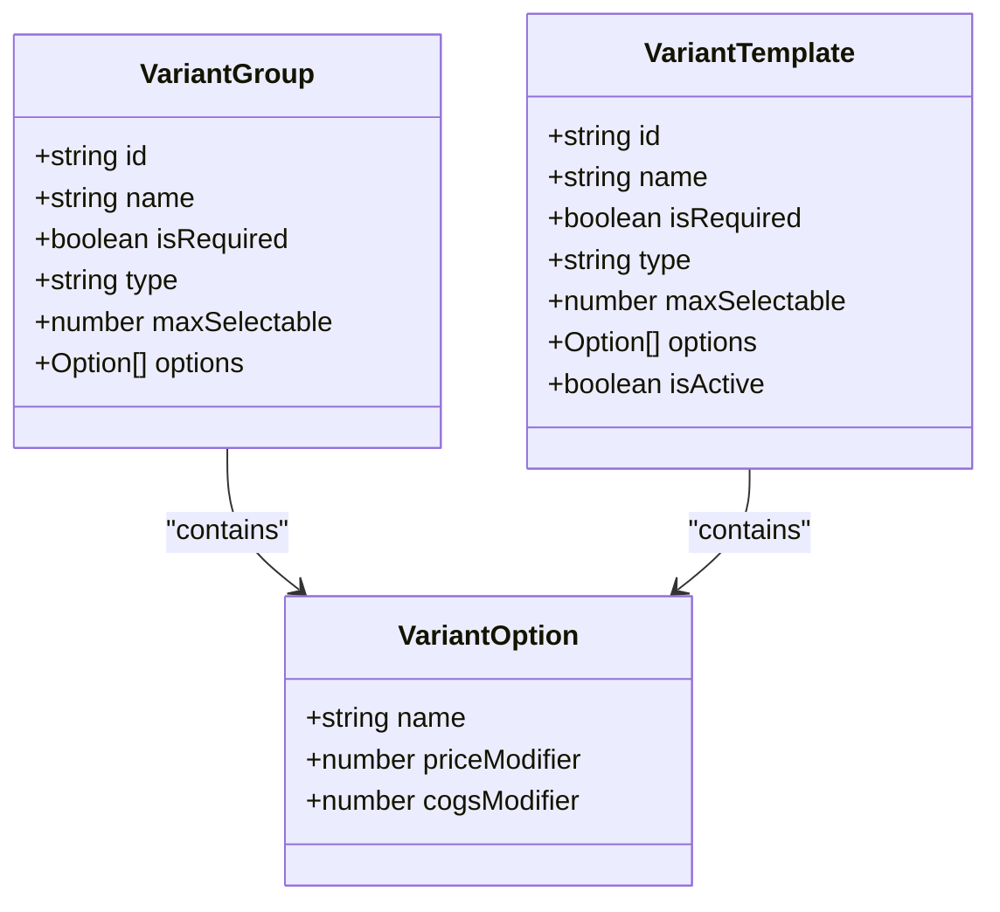

**Diagram sources**
- [db.ts:42-60](file://src/db/db.ts#L42-L60)
- [products.tsx:533-571](file://src/routes/app/inventory/products.tsx#L533-L571)
- [products.tsx:1772-1899](file://src/routes/app/inventory/products.tsx#L1772-L1899)
- [variations.tsx:9-13](file://src/routes/app/inventory/variations.tsx#L9-L13)

**Section sources**
- [products.tsx:533-571](file://src/routes/app/inventory/products.tsx#L533-L571)
- [products.tsx:1772-1899](file://src/routes/app/inventory/products.tsx#L1772-L1899)
- [variations.tsx:59-79](file://src/routes/app/inventory/variations.tsx#L59-L79)

### Variant Selection UI
- VariantSelector: Presents active variant groups for a product; enforces required selections; computes effective base price and final price; supports initial selections.

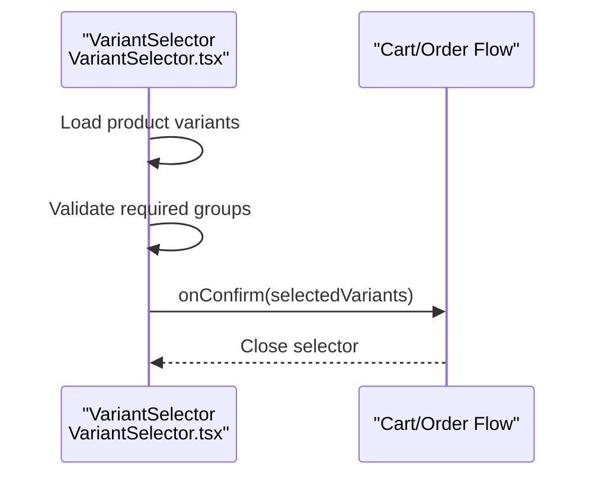

**Diagram sources**
- [VariantSelector.tsx:16-46](file://src/components/VariantSelector.tsx#L16-L46)
- [VariantSelector.tsx:99-118](file://src/components/VariantSelector.tsx#L99-L118)

**Section sources**
- [VariantSelector.tsx:16-46](file://src/components/VariantSelector.tsx#L16-L46)
- [VariantSelector.tsx:99-118](file://src/components/VariantSelector.tsx#L99-L118)

### Product Selector (Bulk Operations)
- ProductSelector: Allows selecting one or multiple products with search, preview, and bulk actions; integrates with product images and pricing.

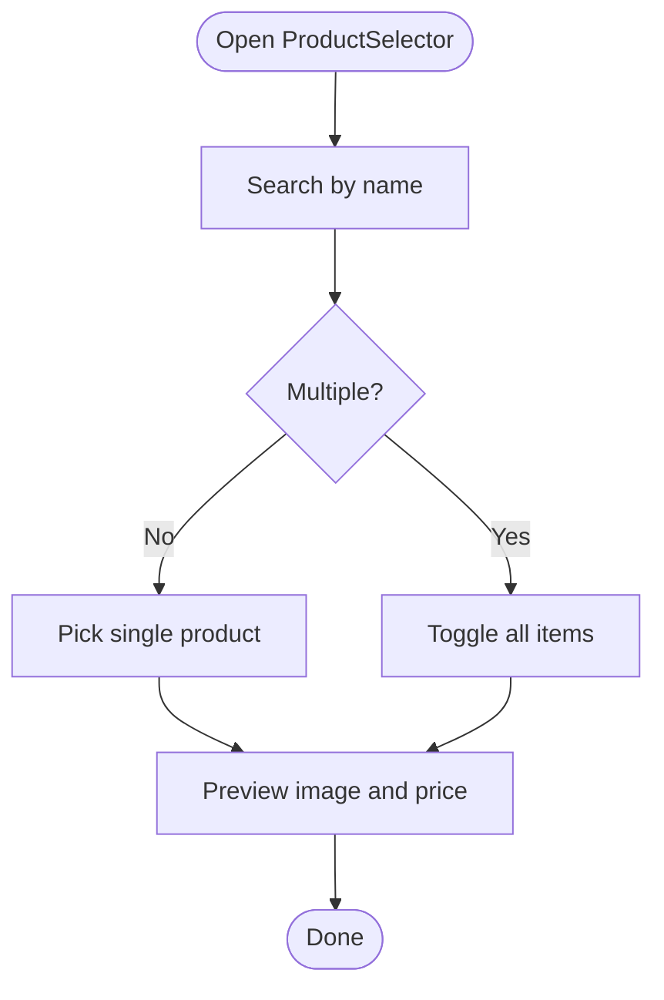

**Diagram sources**
- [product-selector.tsx:14-24](file://src/components/ui/product-selector.tsx#L14-L24)
- [product-selector.tsx:26-37](file://src/components/ui/product-selector.tsx#L26-L37)
- [product-selector.tsx:162-217](file://src/components/ui/product-selector.tsx#L162-L217)

**Section sources**
- [product-selector.tsx:14-24](file://src/components/ui/product-selector.tsx#L14-L24)
- [product-selector.tsx:26-37](file://src/components/ui/product-selector.tsx#L26-L37)
- [product-selector.tsx:162-217](file://src/components/ui/product-selector.tsx#L162-L217)

### Visibility Controls and Availability
- Product-level isActive flag governs visibility in UI and checkout.
- Availability logic checks product toggle and ingredient/library statuses; returns reasons for unavailability.

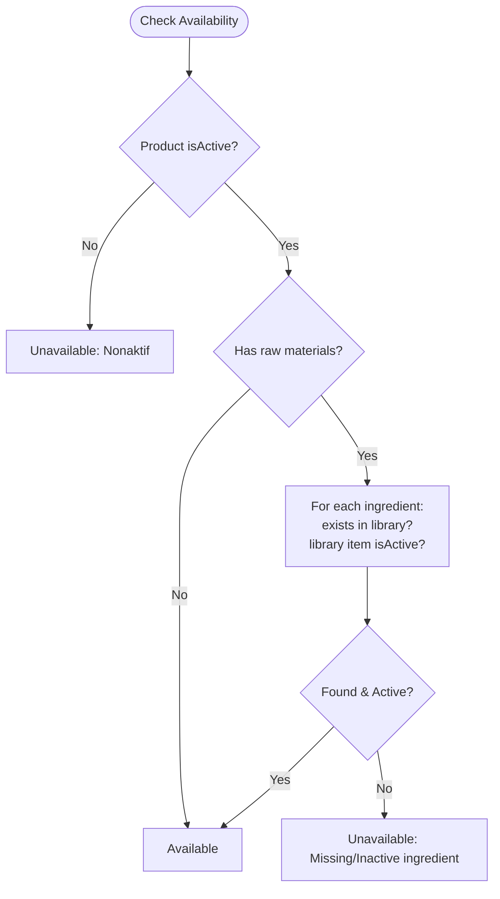

**Diagram sources**
- [availability.ts:12-39](file://src/lib/availability.ts#L12-L39)
- [products.tsx:724-728](file://src/routes/app/inventory/products.tsx#L724-L728)

**Section sources**
- [availability.ts:12-39](file://src/lib/availability.ts#L12-L39)
- [products.tsx:724-728](file://src/routes/app/inventory/products.tsx#L724-L728)

### Pricing Strategies
- Base Price + Modifiers: Variants add/subtract from base price; HPP derived from ingredients or configured COGS.
- Margin Indicators: Real-time margin percent with color-coded status tiers.
- Discounts: Optional per-product discounts (percent/fixed/quantity) managed alongside products.

**Section sources**
- [products.tsx:56-89](file://src/routes/app/inventory/products.tsx#L56-L89)
- [products.tsx:1165-1267](file://src/routes/app/inventory/products.tsx#L1165-L1267)
- [db.ts:162-171](file://src/db/db.ts#L162-L171)

### Integration with Inventory Tracking
- Local Store: Products, categories, variants, materials, discounts, bundles, campaigns, and inventory logs.
- Server Schema: Products, raw materials, modifier groups/options, product ingredients, and inventory logs for reporting.

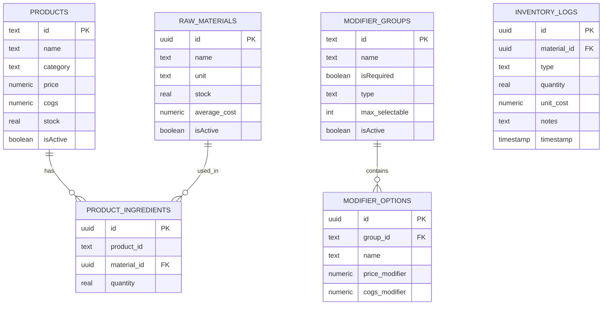

**Diagram sources**
- [db.ts:62-73](file://src/db/db.ts#L62-L73)
- [db.ts:16-24](file://src/db/db.ts#L16-L24)
- [db.ts:42-60](file://src/db/db.ts#L42-L60)
- [schema.ts:82-92](file://src/server/db/schema.ts#L82-L92)
- [schema.ts:94-104](file://src/server/db/schema.ts#L94-L104)
- [schema.ts:106-123](file://src/server/db/schema.ts#L106-L123)
- [schema.ts:125-131](file://src/server/db/schema.ts#L125-L131)
- [schema.ts:133-141](file://src/server/db/schema.ts#L133-L141)

**Section sources**
- [db.ts:270-495](file://src/db/db.ts#L270-L495)
- [schema.ts:82-141](file://src/server/db/schema.ts#L82-L141)

## Dependency Analysis
- UI depends on local database entities and availability logic.
- Product CRUD operations update multiple stores (products, discounts, variants).
- Materials library is shared across products and variants.
- Server schema complements local store for reporting and audit trails.

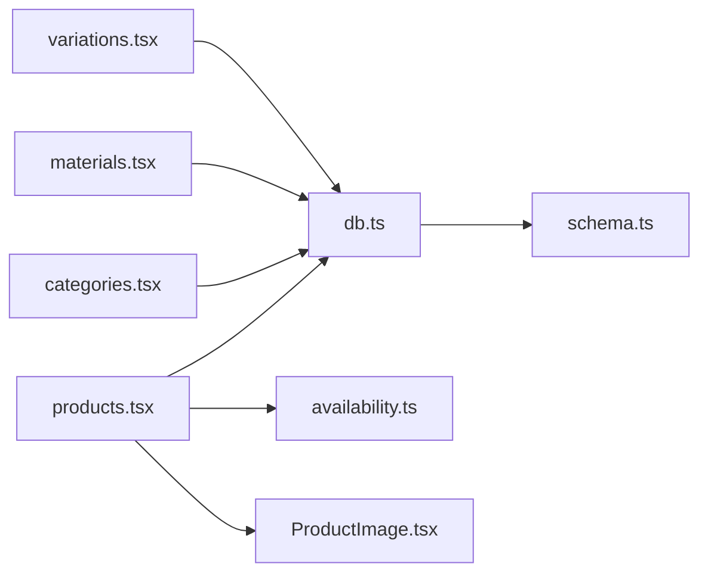

**Diagram sources**
- [products.tsx:92-111](file://src/routes/app/inventory/products.tsx#L92-L111)
- [categories.tsx:16-20](file://src/routes/app/inventory/categories.tsx#L16-L20)
- [materials.tsx:14-18](file://src/routes/app/inventory/materials.tsx#L14-L18)
- [variations.tsx:9-13](file://src/routes/app/inventory/variations.tsx#L9-L13)
- [db.ts:498-499](file://src/db/db.ts#L498-L499)
- [availability.ts:12-39](file://src/lib/availability.ts#L12-L39)
- [schema.ts:82-92](file://src/server/db/schema.ts#L82-L92)

**Section sources**
- [products.tsx:92-111](file://src/routes/app/inventory/products.tsx#L92-L111)
- [categories.tsx:16-20](file://src/routes/app/inventory/categories.tsx#L16-L20)
- [materials.tsx:14-18](file://src/routes/app/inventory/materials.tsx#L14-L18)
- [variations.tsx:9-13](file://src/routes/app/inventory/variations.tsx#L9-L13)
- [db.ts:498-499](file://src/db/db.ts#L498-L499)
- [availability.ts:12-39](file://src/lib/availability.ts#L12-L39)
- [schema.ts:82-92](file://src/server/db/schema.ts#L82-L92)

## Performance Considerations
- Virtualization and Pagination: For very large catalogs, consider virtualized lists or pagination to reduce DOM nodes.
- Memoization: Use memoized computations for HPP, margins, and availability to avoid recalculating on every render.
- Debounced Search: Debounce search input to limit frequent filtering operations.
- Lazy Loading Images: Already implemented via lazy loading; keep placeholder strategy for perceived performance.
- Batch Updates: Group updates to materials library and products to minimize re-renders and database writes.
- IndexedDB Indexes: Ensure appropriate indexes on frequently queried fields (e.g., category, name) to speed up queries.

## Troubleshooting Guide
- Product appears inactive: Verify product isActive flag and ingredient/library statuses; check availability reasons.
- Missing images: Confirm image URLs are valid; fallback placeholder indicates missing or broken images.
- Sync issues with materials: Use the “Sync Library” action to reconcile ingredient costs and auto-register missing materials.
- Deleting categories/products: Ensure no dependent records exist; the system prevents deletion if items belong to the category.
- Variant validation errors: Required variant groups must be selected; ensure selections meet SINGLE/MULTIPLE constraints.

**Section sources**
- [availability.ts:12-39](file://src/lib/availability.ts#L12-L39)
- [ProductImage.tsx:48-56](file://src/components/ProductImage.tsx#L48-L56)
- [products.tsx:338-409](file://src/routes/app/inventory/products.tsx#L338-L409)
- [categories.tsx:68-89](file://src/routes/app/inventory/categories.tsx#L68-L89)
- [VariantSelector.tsx:103-118](file://src/components/VariantSelector.tsx#L103-L118)

## Conclusion
The product management subsystem provides a robust, offline-capable interface for managing products, categories, materials, and variants. It integrates visibility controls, pricing strategies, and inventory alignment through availability checks and material library synchronization. With structured components and clear data models, it supports efficient operations across small and large catalogs.

## Appendices

### Practical Examples
- Adding a New Product: Use the add sheet to set name, price, category, image, and visibility; configure variants and recipe; save to persist.
- Bulk Operations: Use ProductSelector to select multiple products for batch actions (e.g., applying discounts or visibility toggles).
- Managing Variants: Create reusable templates in the variations library; assign templates to products to maintain consistency.
- Performance Optimization: Enable grid/list view toggling, debounce search, and leverage memoized calculations for HPP and margins.

### Data Model Highlights
- Product: id, name, category, price, cogs, stock, isActive, image, rawMaterials, variants.
- Category: id, name, orderIndex, icon.
- RawMaterialLibrary: id, name, unit, stock, costPerUnit, isActive.
- VariantGroup/Option: id, name, isRequired, type, maxSelectable, options with price/cogs modifiers.
- Discount/Bundles/Campaigns: Support promotional pricing and composite offerings.

**Section sources**
- [db.ts:62-73](file://src/db/db.ts#L62-L73)
- [db.ts:75-80](file://src/db/db.ts#L75-L80)
- [db.ts:16-24](file://src/db/db.ts#L16-L24)
- [db.ts:42-60](file://src/db/db.ts#L42-L60)
- [db.ts:162-171](file://src/db/db.ts#L162-L171)
- [db.ts:179-187](file://src/db/db.ts#L179-L187)