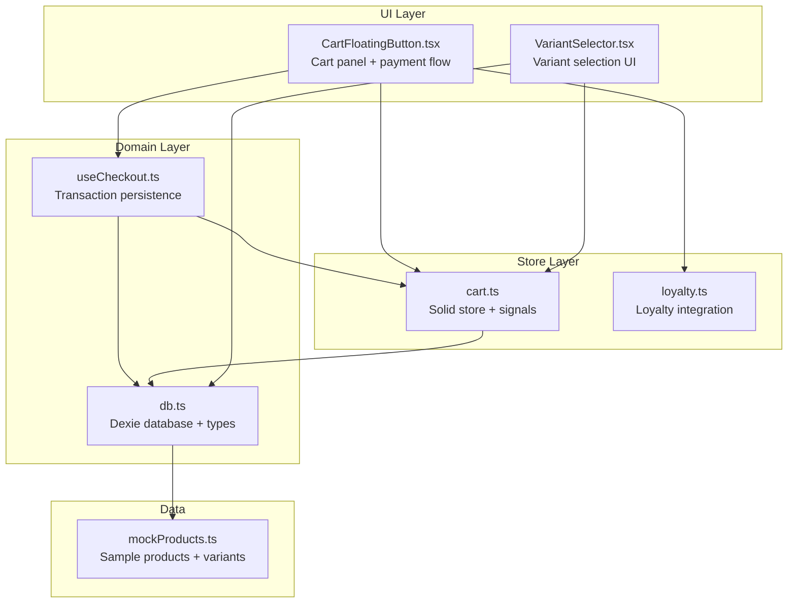
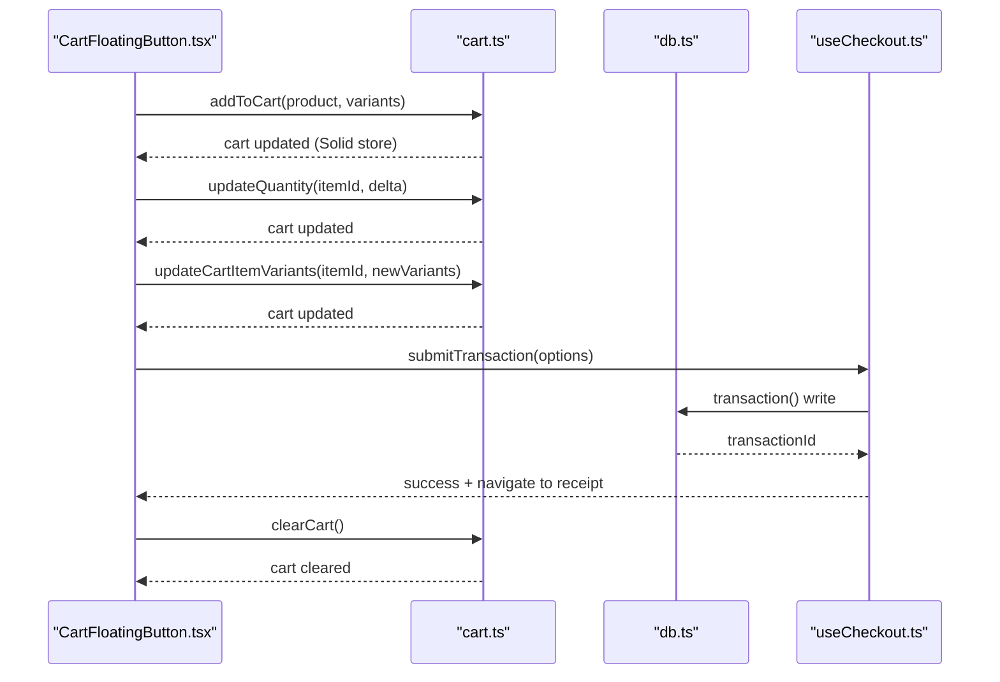
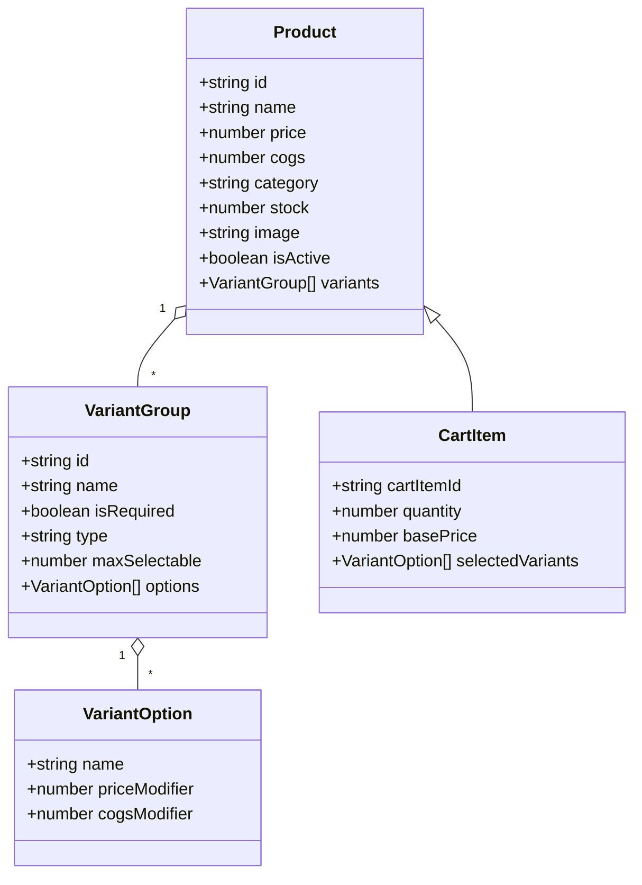
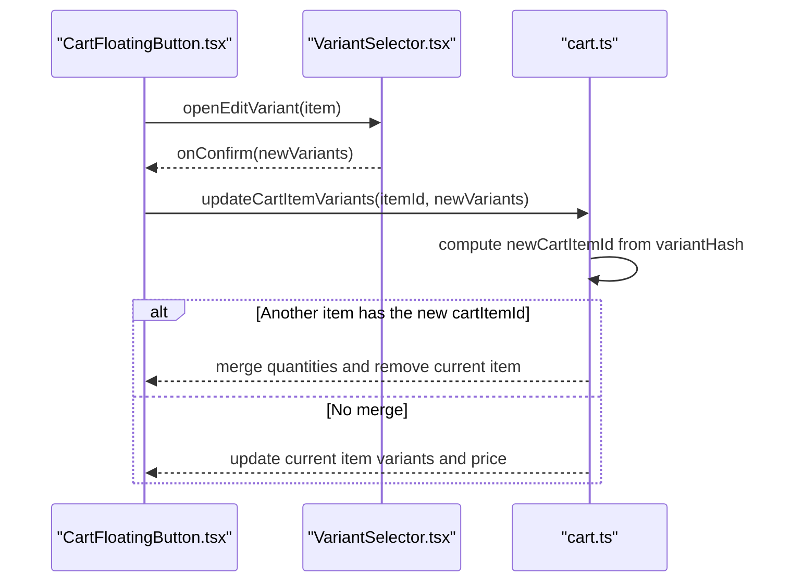
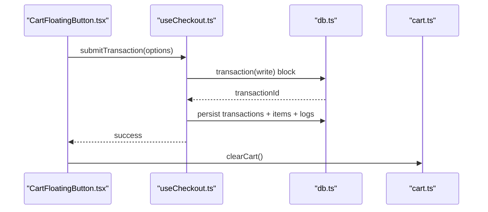
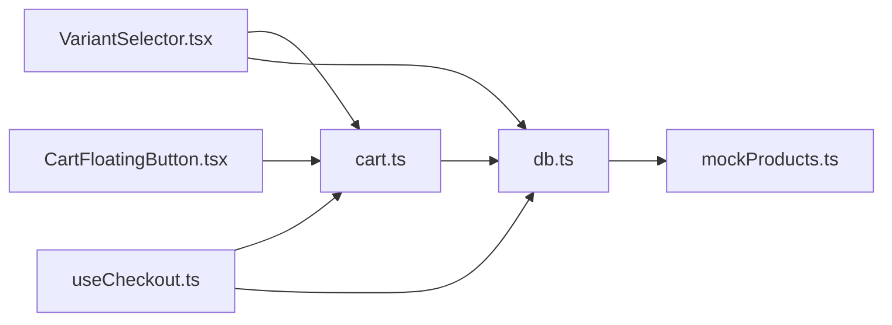

# Shopping Cart System

<cite>
**Referenced Files in This Document**
- [cart.ts](file://src/stores/cart.ts)
- [CartFloatingButton.tsx](file://src/components/CartFloatingButton.tsx)
- [VariantSelector.tsx](file://src/components/VariantSelector.tsx)
- [useCheckout.ts](file://src/hooks/useCheckout.ts)
- [db.ts](file://src/db/db.ts)
- [mockProducts.ts](file://src/data/mockProducts.ts)
- [loyalty.ts](file://src/stores/loyalty.ts)
</cite>

## Table of Contents
1. [Introduction](#introduction)
2. [Project Structure](#project-structure)
3. [Core Components](#core-components)
4. [Architecture Overview](#architecture-overview)
5. [Detailed Component Analysis](#detailed-component-analysis)
6. [Dependency Analysis](#dependency-analysis)
7. [Performance Considerations](#performance-considerations)
8. [Troubleshooting Guide](#troubleshooting-guide)
9. [Conclusion](#conclusion)

## Introduction
This document describes the shopping cart system built with Solid.js stores and signals. It covers cart state management, item addition and quantity modification, variant handling, real-time updates, discount calculation integration, campaign-based pricing strategies, cart persistence and cleanup, error handling for invalid variants, and performance optimization for large cart contents.

## Project Structure
The cart system spans several modules:
- Store: central cart state and calculations
- UI: floating cart panel and variant selector
- Checkout: transaction persistence and side effects
- Database: product and campaign data access
- Mock data: sample product definitions with variants

**Diagram sources**
- [cart.ts:1-257](file://src/stores/cart.ts#L1-L257)
- [CartFloatingButton.tsx:1-955](file://src/components/CartFloatingButton.tsx#L1-L955)
- [VariantSelector.tsx:1-205](file://src/components/VariantSelector.tsx#L1-L205)
- [useCheckout.ts:1-217](file://src/hooks/useCheckout.ts#L1-L217)
- [db.ts:1-570](file://src/db/db.ts#L1-L570)
- [mockProducts.ts:1-85](file://src/data/mockProducts.ts#L1-L85)

**Section sources**
- [cart.ts:1-257](file://src/stores/cart.ts#L1-L257)
- [CartFloatingButton.tsx:1-955](file://src/components/CartFloatingButton.tsx#L1-L955)
- [VariantSelector.tsx:1-205](file://src/components/VariantSelector.tsx#L1-L205)
- [useCheckout.ts:1-217](file://src/hooks/useCheckout.ts#L1-L217)
- [db.ts:1-570](file://src/db/db.ts#L1-L570)
- [mockProducts.ts:1-85](file://src/data/mockProducts.ts#L1-L85)

## Core Components
- Cart store: maintains the cart array, linked customer, applied reward, and exposes actions to add/update/remove items and calculate totals.
- Cart UI: floating cart panel with item list, quantity controls, variant editing, and payment flow.
- Variant selector: interactive UI to pick required and optional variants with validation.
- Checkout hook: persists transactions, computes costs of goods, applies discounts, and triggers loyalty updates.
- Database: typed access to products, campaigns, and related entities.

Key exports and responsibilities:
- Cart store exports: addToCart, updateCartItemVariants, updateQuantity, getCartCount, getCartSubtotal, getCartTotal, calculateDiscounts, clearCart, and reactive signals for customer linkage and applied reward.
- UI components depend on cart store and checkout hook to render and commit purchases.
- Database types define product variants, campaign rules, and transaction items.

**Section sources**
- [cart.ts:1-257](file://src/stores/cart.ts#L1-L257)
- [CartFloatingButton.tsx:1-955](file://src/components/CartFloatingButton.tsx#L1-L955)
- [VariantSelector.tsx:1-205](file://src/components/VariantSelector.tsx#L1-L205)
- [useCheckout.ts:1-217](file://src/hooks/useCheckout.ts#L1-L217)
- [db.ts:1-570](file://src/db/db.ts#L1-L570)

## Architecture Overview
The cart system follows a unidirectional data flow:
- UI triggers actions in the cart store.
- Cart store updates the Solid store and signals.
- UI reads reactive signals to re-render.
- On checkout, the checkout hook unwraps the cart snapshot, computes totals and discounts, persists the transaction, and updates loyalty.

**Diagram sources**
- [CartFloatingButton.tsx:1-955](file://src/components/CartFloatingButton.tsx#L1-L955)
- [cart.ts:1-257](file://src/stores/cart.ts#L1-L257)
- [useCheckout.ts:1-217](file://src/hooks/useCheckout.ts#L1-L217)
- [db.ts:1-570](file://src/db/db.ts#L1-L570)

## Detailed Component Analysis

### Cart Store: State, Actions, and Calculations
The cart store defines the CartItem type and manages:
- Cart items with cartItemId, quantity, basePrice, and selectedVariants.
- Signals for linkedCustomerId and appliedRewardId.
- Item lifecycle: add, update variants, update quantity, clear.
- Totals: subtotal, total, and discount calculation integrated with campaigns.

Data model and hashing:
- cartItemId is generated from productId and a variantHash derived from selected variants.
- Variant hash is computed by sorting selected variants by optionName and joining with hyphens, enabling deterministic merging and variant separation.

Actions and behaviors:
- addToCart: generates variantHash, computes additionalPrice, and merges with existing item if cartItemId matches.
- updateCartItemVariants: recalculates new cartItemId and merges with another item if it already exists in cart.
- updateQuantity: clamps quantity to zero and filters out items with zero quantity.
- getCartCount/getCartSubtotal/getCartTotal: reduce cart items to compute counts and monetary totals.
- calculateDiscounts: evaluates active campaigns and applies bulk discounts and bundle/buy-x-get-y offers respecting priority and quantity consumption.

Campaign evaluation logic:
- Loads active campaigns and eager-loads campaignItems and campaignRewards for performance.
- Supports BULK_DISCOUNT (per-item discount on target products) and BUNDLE/BUY_X_GET_Y (multi-product requirement sets).
- Tracks used quantities per cartItemId to avoid double-dipping across campaigns.

Real-time updates:
- Uses Solid’s createStore and createResource to keep UI reactive to cart changes and campaign updates.

**Section sources**
- [cart.ts:1-257](file://src/stores/cart.ts#L1-L257)

#### Class Diagram: CartItem and Related Types

**Diagram sources**
- [db.ts:36-73](file://src/db/db.ts#L36-L73)
- [cart.ts:5-10](file://src/stores/cart.ts#L5-L10)

### Cart UI: Floating Panel and Variant Editing
The floating cart panel integrates:
- Real-time cart rendering with Solid’s For and reactive signals.
- Quantity increment/decrement buttons invoking updateQuantity.
- Variant editing via VariantSelector dialog.
- Payment flow with multiple methods and backdate support.
- Final total computation combining cart subtotal, campaign discounts, and loyalty reward.

Variant editing flow:
- Opens VariantSelector with initial variants mapped from cart item.
- Validates required groups and confirms changes by calling updateCartItemVariants.

Payment flow:
- Supports cash, QRIS, and third-party delivery platforms.
- Computes final amount and triggers submitTransaction.
- Clears cart upon successful completion.

**Section sources**
- [CartFloatingButton.tsx:1-955](file://src/components/CartFloatingButton.tsx#L1-L955)
- [VariantSelector.tsx:1-205](file://src/components/VariantSelector.tsx#L1-L205)

#### Sequence Diagram: Variant Change and Merge

**Diagram sources**
- [CartFloatingButton.tsx:266-278](file://src/components/CartFloatingButton.tsx#L266-L278)
- [VariantSelector.tsx:99-118](file://src/components/VariantSelector.tsx#L99-L118)
- [cart.ts:50-94](file://src/stores/cart.ts#L50-L94)

### Checkout Integration: Persistence and Side Effects
The checkout hook:
- Unwraps the cart snapshot and computes original subtotal and discount info.
- Persists a transaction inside a Dexie transaction with products, transactionItems, raw material logs, and inventory logs.
- Computes cost of goods (COGS) per item, including recipe-based costs and variant modifiers.
- Adds a free reward item if applicable and updates COGS accordingly.
- Records discount totals and notes, and links customer if present.
- Triggers loyalty stamping and reward claiming after successful transaction.
- Triggers background sync service.

**Section sources**
- [useCheckout.ts:1-217](file://src/hooks/useCheckout.ts#L1-L217)
- [cart.ts:238-246](file://src/stores/cart.ts#L238-L246)

#### Sequence Diagram: Checkout Flow

**Diagram sources**
- [CartFloatingButton.tsx:195-248](file://src/components/CartFloatingButton.tsx#L195-L248)
- [useCheckout.ts:38-213](file://src/hooks/useCheckout.ts#L38-L213)
- [cart.ts:250-254](file://src/stores/cart.ts#L250-L254)

### Variant Handling and Validation
VariantSelector:
- Synchronizes initial variants when opening the dialog.
- Enforces required SINGLE-type groups and respects max selectable for MULTIPLE groups.
- Calculates effective base price fallback when basePrice is not present.
- Validates required groups before confirming.

Variant hash generation:
- Sorting selected variants by optionName ensures consistent ordering regardless of selection order.
- Joining with hyphens produces a stable variantHash used to construct cartItemId.

**Section sources**
- [VariantSelector.tsx:1-205](file://src/components/VariantSelector.tsx#L1-L205)
- [cart.ts:16-48](file://src/stores/cart.ts#L16-L48)

### Campaign-Based Pricing Strategies
Active campaigns are fetched and cached via createResource, then evaluated in calculateDiscounts:
- BULK_DISCOUNT: Applies percent or fixed discount per target product in cart.
- BUNDLE/BUY_X_GET_Y: Requires multiple products meeting quantities; calculates reward (free product or discount) and consumes quantities across items to avoid double-dipping.

Priority-driven evaluation:
- Campaigns are sorted by priority descending to ensure higher-priority rules apply first.

Quantity consumption tracking:
- usedQty per cartItemId prevents the same item from contributing to multiple campaign sets.

**Section sources**
- [cart.ts:115-236](file://src/stores/cart.ts#L115-L236)

### Cart Persistence, Session Management, and Cleanup
- Cart state is maintained in-memory using Solid store and signals.
- Clearing the cart resets cart items, linked customer, and applied reward.
- Checkout clears the cart upon successful transaction completion.
- Loyalty integration tracks customer linkage and reward application.

Note: There is no explicit localStorage synchronization in the cart store. Persistence occurs through the checkout transaction process.

**Section sources**
- [cart.ts:250-254](file://src/stores/cart.ts#L250-L254)
- [CartFloatingButton.tsx:238-248](file://src/components/CartFloatingButton.tsx#L238-L248)

## Dependency Analysis
The cart system exhibits low coupling and high cohesion:
- UI components depend on cart store and checkout hook.
- Cart store depends on database types and Dexie for campaign data.
- Checkout hook encapsulates transaction persistence and side effects.
- VariantSelector depends on product variants and validates selections.

**Diagram sources**
- [CartFloatingButton.tsx:1-955](file://src/components/CartFloatingButton.tsx#L1-L955)
- [VariantSelector.tsx:1-205](file://src/components/VariantSelector.tsx#L1-L205)
- [cart.ts:1-257](file://src/stores/cart.ts#L1-L257)
- [useCheckout.ts:1-217](file://src/hooks/useCheckout.ts#L1-L217)
- [db.ts:1-570](file://src/db/db.ts#L1-L570)
- [mockProducts.ts:1-85](file://src/data/mockProducts.ts#L1-L85)

**Section sources**
- [cart.ts:1-257](file://src/stores/cart.ts#L1-L257)
- [CartFloatingButton.tsx:1-955](file://src/components/CartFloatingButton.tsx#L1-L955)
- [VariantSelector.tsx:1-205](file://src/components/VariantSelector.tsx#L1-L205)
- [useCheckout.ts:1-217](file://src/hooks/useCheckout.ts#L1-L217)
- [db.ts:1-570](file://src/db/db.ts#L1-L570)

## Performance Considerations
- Campaign data preloading: activeCampaigns eager loads campaignItems and campaignRewards to minimize repeated queries during discount calculation.
- Sorting variants: variantHash generation sorts selected variants by optionName to ensure deterministic hashing and stable cartItemId construction.
- Quantity filtering: updateQuantity removes items with zero quantity immediately, preventing accumulation of empty entries.
- Snapshotting: checkout unwraps the cart to a plain array to avoid accidental reactivity during transaction writes.
- Memoization: VariantSelector uses createMemo to derive active groups and effective base price efficiently.

Recommendations:
- For very large carts, consider virtualizing the cart list in the UI.
- Debounce discount recalculation if UI triggers frequent updates.
- Batch updates to cart items when adding multiple variants to minimize re-renders.

**Section sources**
- [cart.ts:115-130](file://src/stores/cart.ts#L115-L130)
- [cart.ts:96-106](file://src/stores/cart.ts#L96-L106)
- [useCheckout.ts:43-44](file://src/hooks/useCheckout.ts#L43-L44)
- [VariantSelector.tsx:19-46](file://src/components/VariantSelector.tsx#L19-L46)

## Troubleshooting Guide
Common issues and resolutions:
- Invalid variant selection: VariantSelector enforces required groups and alerts when missing selections. Ensure all required SINGLE groups are selected before confirming.
- Duplicate items after variant change: updateCartItemVariants merges with existing items sharing the new cartItemId. If unexpected, verify variantHash generation and that variant options match product templates.
- Zero or negative quantities: updateQuantity clamps to zero and filters out items with zero quantity. Verify delta values passed to updateQuantity.
- Discount not applying: verify campaign isActive, priority, and targetProducts. For BUNDLE/BUY_X_GET_Y, ensure all requirements are met and quantities are sufficient.
- Checkout errors: useCheckout wraps persistence in a transaction and logs critical errors. Check console for detailed messages and ensure product stock and raw materials are valid.

**Section sources**
- [VariantSelector.tsx:103-118](file://src/components/VariantSelector.tsx#L103-L118)
- [cart.ts:96-106](file://src/stores/cart.ts#L96-L106)
- [cart.ts:168-228](file://src/stores/cart.ts#L168-L228)
- [useCheckout.ts:206-212](file://src/hooks/useCheckout.ts#L206-L212)

## Conclusion
The shopping cart system leverages Solid.js stores and signals for efficient, reactive state management. It supports robust variant handling, real-time cart updates, campaign-based discount strategies, and seamless checkout integration with cost of goods computation and loyalty updates. While cart state is in-memory, persistence is achieved through transaction writes, and cleanup is performed upon successful checkout. The system is designed for scalability with preloaded campaign data and efficient hashing for variant merging.