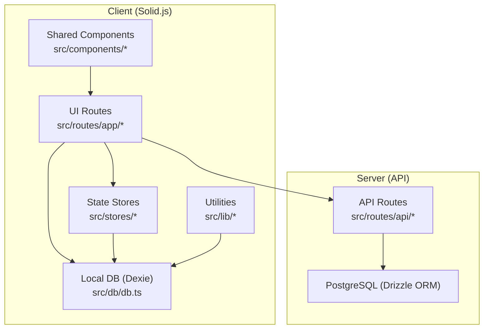
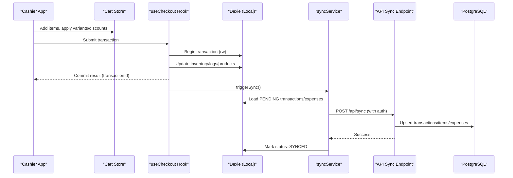
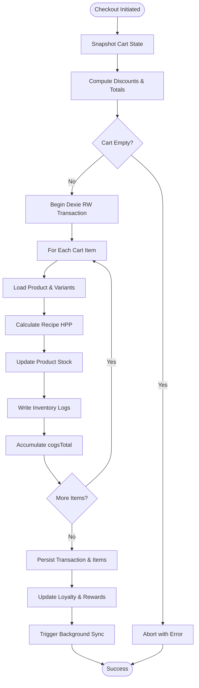
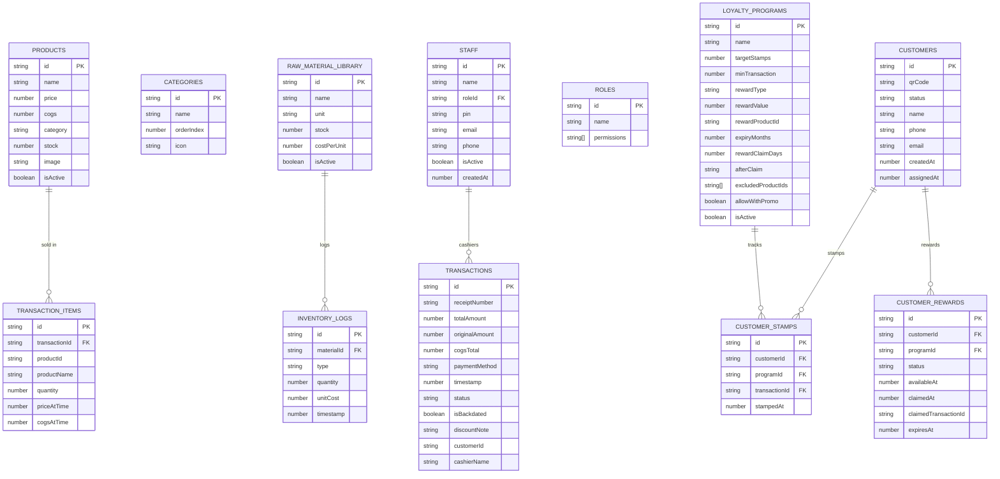
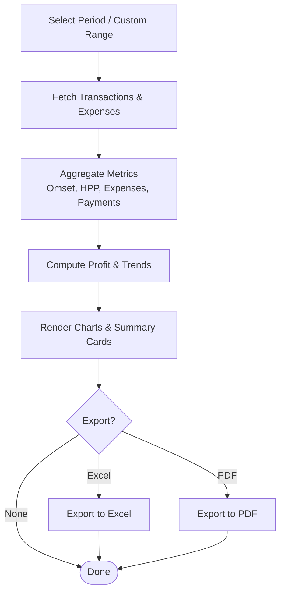
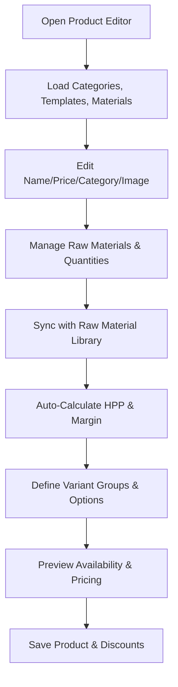
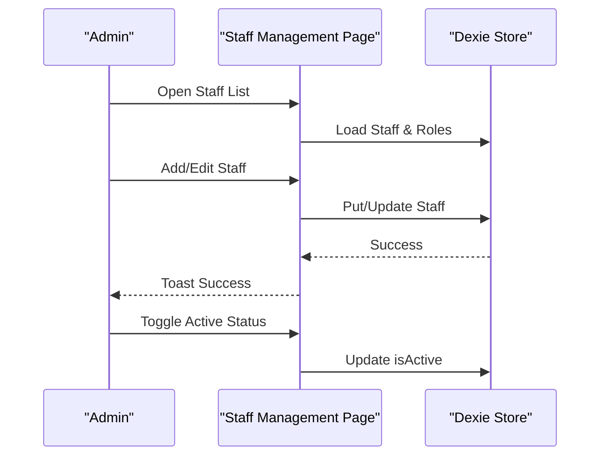
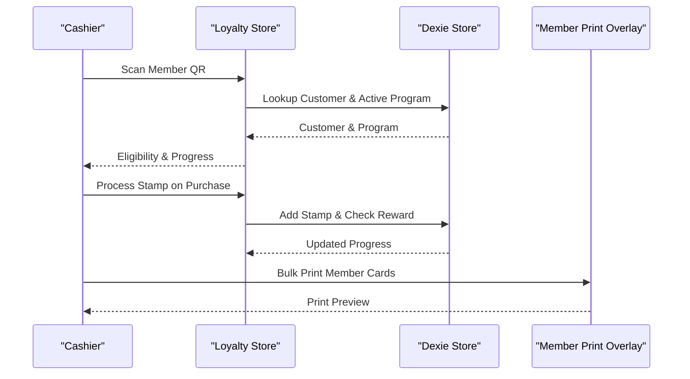
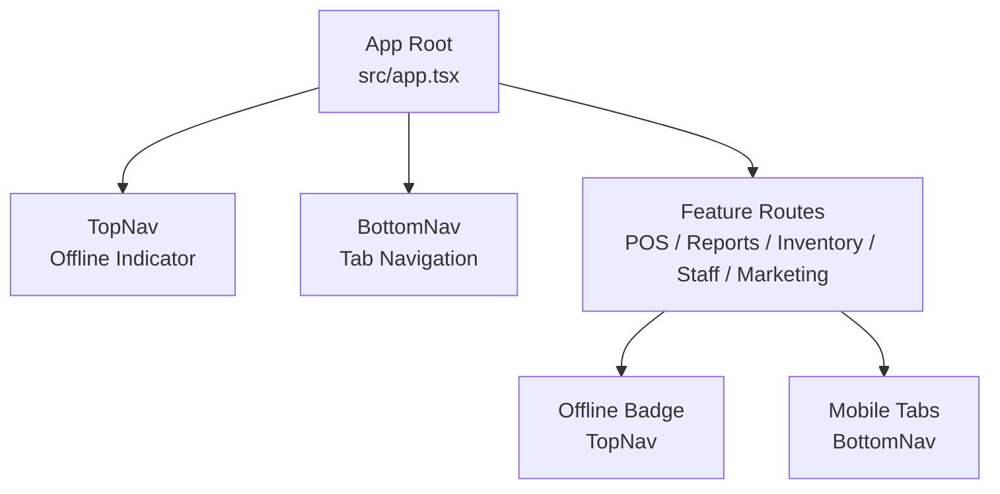
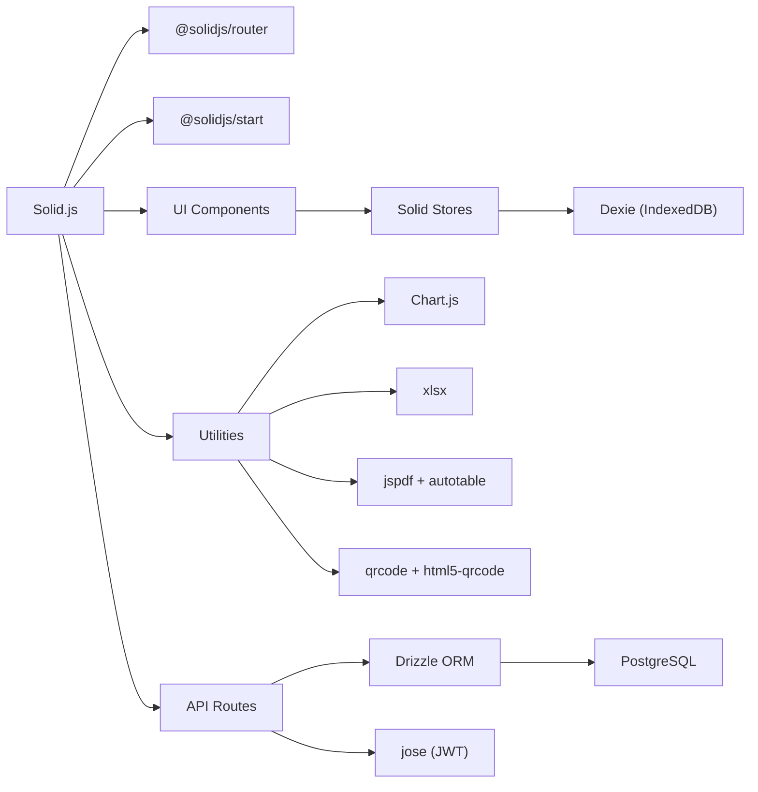

# Project Overview

<cite>
**Referenced Files in This Document**
- [README.md](file://README.md)
- [package.json](file://package.json)
- [src/app.tsx](file://src/app.tsx)
- [src/routes/app/index.tsx](file://src/routes/app/index.tsx)
- [src/stores/cart.ts](file://src/stores/cart.ts)
- [src/hooks/useCheckout.ts](file://src/hooks/useCheckout.ts)
- [src/db/db.ts](file://src/db/db.ts)
- [src/lib/syncService.ts](file://src/lib/syncService.ts)
- [src/routes/api/sync/index.ts](file://src/routes/api/sync/index.ts)
- [src/routes/app/reports/index.tsx](file://src/routes/app/reports/index.tsx)
- [src/routes/app/inventory/products.tsx](file://src/routes/app/inventory/products.tsx)
- [src/routes/app/settings/staff.tsx](file://src/routes/app/settings/staff.tsx)
- [src/routes/app/marketing/members.tsx](file://src/routes/app/marketing/members.tsx)
- [src/lib/availability.ts](file://src/lib/availability.ts)
- [src/stores/loyalty.ts](file://src/stores/loyalty.ts)
- [src/components/BottomNav.tsx](file://src/components/BottomNav.tsx)
- [src/components/TopNav.tsx](file://src/components/TopNav.tsx)
</cite>

## Table of Contents
1. [Introduction](#introduction)
2. [Project Structure](#project-structure)
3. [Core Components](#core-components)
4. [Architecture Overview](#architecture-overview)
5. [Detailed Component Analysis](#detailed-component-analysis)
6. [Dependency Analysis](#dependency-analysis)
7. [Performance Considerations](#performance-considerations)
8. [Troubleshooting Guide](#troubleshooting-guide)
9. [Conclusion](#conclusion)

## Introduction
NgePos is an Indonesian F&B Point-of-Sale system designed with an offline-first architecture for reliability in diverse environments. It targets small to medium-sized coffee shops, restaurants, and food-and-beverage outlets that need a modern, mobile-optimized POS with robust inventory tracking, financial reporting, and staff management. The system blends a responsive Solid.js frontend with a local IndexedDB-backed store and a PostgreSQL backend for synchronization, enabling seamless operation whether online or offline.

Key value propositions:
- Reliable offline operation with automatic synchronization when connectivity resumes
- Real-time POS checkout with variant support, promotions, and loyalty stamps
- Comprehensive inventory management with recipe-based costing (HPP)
- Financial reporting with profit analysis and export capabilities
- Staff and role-based access control with integrated QR-based member management

## Project Structure
The project follows a modular, feature-based structure under src/, with clear separation between client-side UI, stores, database, and server-side APIs.

**Diagram sources**
- [src/app.tsx:24-41](file://src/app.tsx#L24-L41)
- [src/db/db.ts:270-498](file://src/db/db.ts#L270-L498)
- [src/lib/syncService.ts:4-58](file://src/lib/syncService.ts#L4-L58)
- [src/routes/api/sync/index.ts:10-97](file://src/routes/api/sync/index.ts#L10-L97)

**Section sources**
- [src/app.tsx:1-42](file://src/app.tsx#L1-L42)
- [src/db/db.ts:270-498](file://src/db/db.ts#L270-L498)
- [src/lib/syncService.ts:4-58](file://src/lib/syncService.ts#L4-L58)
- [src/routes/api/sync/index.ts:10-97](file://src/routes/api/sync/index.ts#L10-L97)

## Core Components
- POS Checkout Pipeline: Handles cart assembly, variant modifiers, pricing, discounts, and inventory updates with atomic transactions.
- Local Database (Dexie): Provides offline-first persistence for products, transactions, inventory logs, staff, and marketing data.
- Sync Engine: Pushes pending transactions and expenses to the backend and marks them synced upon successful confirmation.
- Reporting Dashboard: Computes financial metrics, trends, and payment distributions with export to Excel/PDF.
- Inventory Manager: Manages recipes, HPP calculation, stock visibility, and variant templates.
- Staff Management: CRUD for staff, role assignment, and permission enforcement.
- Loyalty & Members: QR-based member cards, stamp accumulation, and reward automation.

**Section sources**
- [src/stores/cart.ts:16-257](file://src/stores/cart.ts#L16-L257)
- [src/hooks/useCheckout.ts:30-216](file://src/hooks/useCheckout.ts#L30-L216)
- [src/db/db.ts:270-498](file://src/db/db.ts#L270-L498)
- [src/lib/syncService.ts:4-58](file://src/lib/syncService.ts#L4-L58)
- [src/routes/app/reports/index.tsx:49-715](file://src/routes/app/reports/index.tsx#L49-L715)
- [src/routes/app/inventory/products.tsx:92-800](file://src/routes/app/inventory/products.tsx#L92-L800)
- [src/routes/app/settings/staff.tsx:22-462](file://src/routes/app/settings/staff.tsx#L22-L462)
- [src/stores/loyalty.ts:1-174](file://src/stores/loyalty.ts#L1-L174)

## Architecture Overview
NgePos employs an offline-first architecture:
- Client runs locally with Solid.js and Dexie for immediate responsiveness.
- Backend is a PostgreSQL database accessed via Drizzle ORM and secured with JWT.
- A lightweight sync endpoint accepts batches of transactions and expenses, upserting records transactionally.

**Diagram sources**
- [src/stores/cart.ts:16-257](file://src/stores/cart.ts#L16-L257)
- [src/hooks/useCheckout.ts:30-216](file://src/hooks/useCheckout.ts#L30-L216)
- [src/lib/syncService.ts:4-58](file://src/lib/syncService.ts#L4-L58)
- [src/routes/api/sync/index.ts:10-97](file://src/routes/api/sync/index.ts#L10-L97)

## Detailed Component Analysis

### POS Checkout and Cart Management
The checkout pipeline integrates cart state, discounts, and inventory updates atomically. It computes dynamic HPP from recipes and variant modifiers, persists transaction items, and triggers background sync.

**Diagram sources**
- [src/hooks/useCheckout.ts:38-213](file://src/hooks/useCheckout.ts#L38-L213)
- [src/stores/cart.ts:132-246](file://src/stores/cart.ts#L132-L246)

**Section sources**
- [src/stores/cart.ts:16-257](file://src/stores/cart.ts#L16-L257)
- [src/hooks/useCheckout.ts:30-216](file://src/hooks/useCheckout.ts#L30-L216)

### Local Database Schema and Offline Persistence
NgePos uses Dexie to define a versioned schema covering products, categories, transactions, inventory logs, staff, roles, discounts, campaigns, memberships, and loyalty data. The schema evolves with migrations to add new capabilities while preserving backward compatibility.

**Diagram sources**
- [src/db/db.ts:62-289](file://src/db/db.ts#L62-L289)

**Section sources**
- [src/db/db.ts:270-498](file://src/db/db.ts#L270-L498)

### Financial Reporting and Export
The reporting dashboard aggregates sales, expenses, and payment methods, computes profit metrics, and exports summaries to Excel or PDF. It supports filtering by predefined periods and custom date ranges.

**Diagram sources**
- [src/routes/app/reports/index.tsx:211-370](file://src/routes/app/reports/index.tsx#L211-L370)

**Section sources**
- [src/routes/app/reports/index.tsx:49-715](file://src/routes/app/reports/index.tsx#L49-L715)

### Inventory Management and HPP Calculation
The inventory module manages products with optional recipes and variants. It calculates HPP from raw materials and variant modifiers, enforces availability checks, and maintains inventory logs for traceability.

**Diagram sources**
- [src/routes/app/inventory/products.tsx:92-800](file://src/routes/app/inventory/products.tsx#L92-L800)
- [src/lib/availability.ts:12-39](file://src/lib/availability.ts#L12-L39)

**Section sources**
- [src/routes/app/inventory/products.tsx:92-800](file://src/routes/app/inventory/products.tsx#L92-L800)
- [src/lib/availability.ts:1-40](file://src/lib/availability.ts#L1-L40)

### Staff Management and Permissions
Staff management supports adding, editing, activating/deactivating employees, assigning roles, and enforcing permission-based navigation tabs.

**Diagram sources**
- [src/routes/app/settings/staff.tsx:35-138](file://src/routes/app/settings/staff.tsx#L35-L138)

**Section sources**
- [src/routes/app/settings/staff.tsx:22-462](file://src/routes/app/settings/staff.tsx#L22-L462)
- [src/components/BottomNav.tsx:14-64](file://src/components/BottomNav.tsx#L14-L64)

### Loyalty Program and Member Management
Members are managed with QR codes, stamp accumulation, and reward automation. The system tracks eligibility, expiry, and claim status.

**Diagram sources**
- [src/stores/loyalty.ts:28-174](file://src/stores/loyalty.ts#L28-L174)
- [src/routes/app/marketing/members.tsx:56-236](file://src/routes/app/marketing/members.tsx#L56-L236)

**Section sources**
- [src/stores/loyalty.ts:1-174](file://src/stores/loyalty.ts#L1-L174)
- [src/routes/app/marketing/members.tsx:34-791](file://src/routes/app/marketing/members.tsx#L34-L791)

### Mobile-Optimized UI and Offline Awareness
The UI adapts to mobile screens with a bottom navigation bar and top header that displays offline status. The app seeds initial data on mount and provides loading states for smooth UX.

**Diagram sources**
- [src/app.tsx:24-41](file://src/app.tsx#L24-L41)
- [src/components/TopNav.tsx:4-42](file://src/components/TopNav.tsx#L4-L42)
- [src/components/BottomNav.tsx:22-64](file://src/components/BottomNav.tsx#L22-L64)

**Section sources**
- [src/app.tsx:1-42](file://src/app.tsx#L1-L42)
- [src/components/TopNav.tsx:1-43](file://src/components/TopNav.tsx#L1-L43)
- [src/components/BottomNav.tsx:1-65](file://src/components/BottomNav.tsx#L1-L65)

## Dependency Analysis
Technology stack highlights:
- Frontend: Solid.js with router and start framework
- Styling: TailwindCSS with custom utilities
- State: Solid stores and resources
- Database (client): Dexie for IndexedDB
- Database (server): PostgreSQL with Drizzle ORM
- Authentication: JWT-based API protection
- Utilities: Chart.js for charts, xlsx/pdf generation, QR code generation/printing

**Diagram sources**
- [package.json:11-39](file://package.json#L11-L39)
- [src/routes/api/sync/index.ts:3-8](file://src/routes/api/sync/index.ts#L3-L8)

**Section sources**
- [package.json:1-56](file://package.json#L1-L56)
- [src/routes/api/sync/index.ts:10-97](file://src/routes/api/sync/index.ts#L10-L97)

## Performance Considerations
- Offline-first design ensures responsive UI even without network connectivity.
- Debounced sync service prevents excessive server calls and reduces bandwidth usage.
- Resource-based rendering minimizes DOM updates and improves perceived performance.
- IndexedDB-backed local queries enable fast filtering and sorting of products, categories, and reports.
- Recommendation: Use createResource for heavy computations and memoized selectors for derived data to further optimize rendering.

## Troubleshooting Guide
Common issues and resolutions:
- Offline mode detected: The top header displays an offline indicator. Transactions are saved locally and synced when connectivity returns.
- Sync failures: Verify JWT token presence and validity. Check server logs for sync endpoint errors.
- Empty cart on checkout: Ensure items are added to the cart and variants are confirmed before submitting.
- Inventory discrepancies: Review inventory logs and raw material library entries for accurate HPP calculations.
- Reporting delays: Allow sync to complete; reports reflect synced data.

**Section sources**
- [src/components/TopNav.tsx:21-27](file://src/components/TopNav.tsx#L21-L27)
- [src/lib/syncService.ts:4-58](file://src/lib/syncService.ts#L4-L58)
- [src/hooks/useCheckout.ts:38-51](file://src/hooks/useCheckout.ts#L38-L51)
- [src/db/db.ts:270-498](file://src/db/db.ts#L270-L498)
- [src/routes/app/reports/index.tsx:211-370](file://src/routes/app/reports/index.tsx#L211-L370)

## Conclusion
NgePos delivers a practical, offline-first POS solution tailored for Indonesian F&B businesses. Its combination of Solid.js, Dexie, and PostgreSQL enables reliable, real-time operations with powerful reporting and inventory controls. The system’s modular design, permission-aware navigation, and mobile-first UI make it suitable for diverse operational needs, from daily cash register tasks to strategic financial oversight.