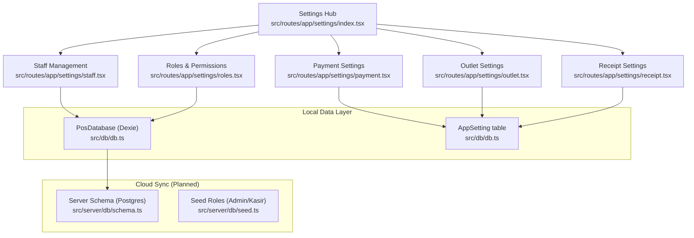
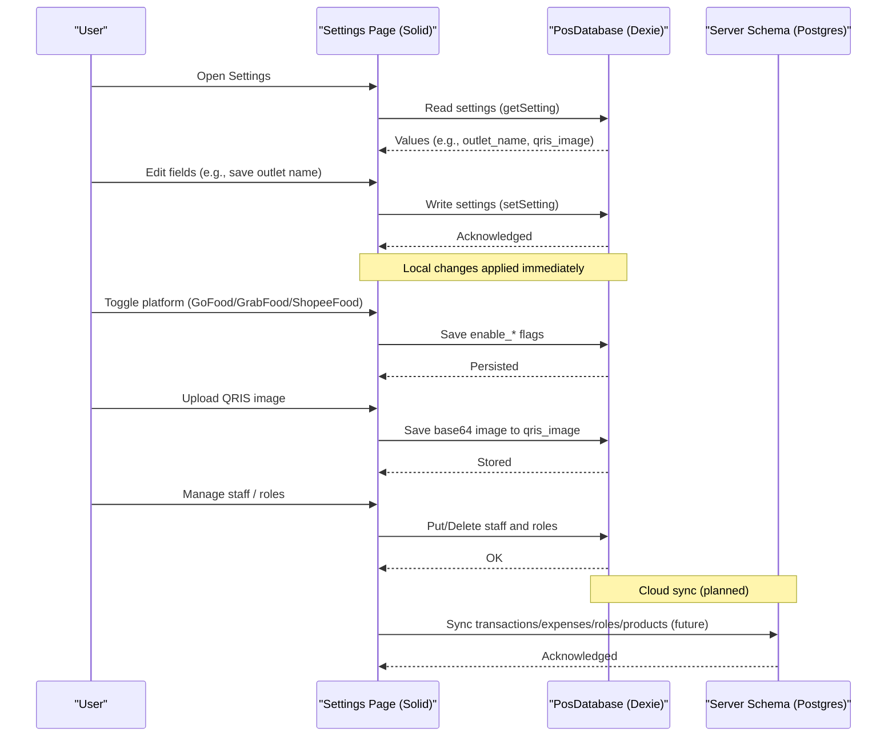
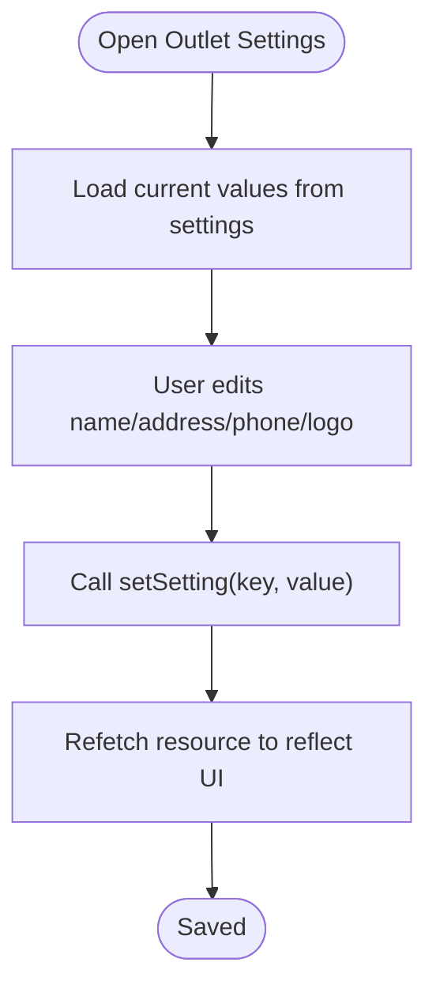
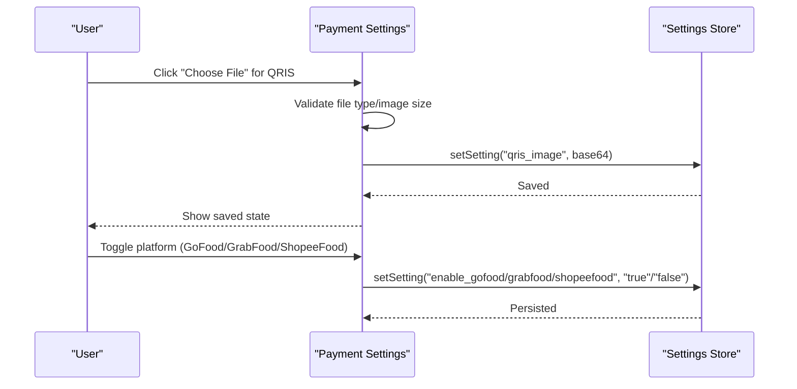
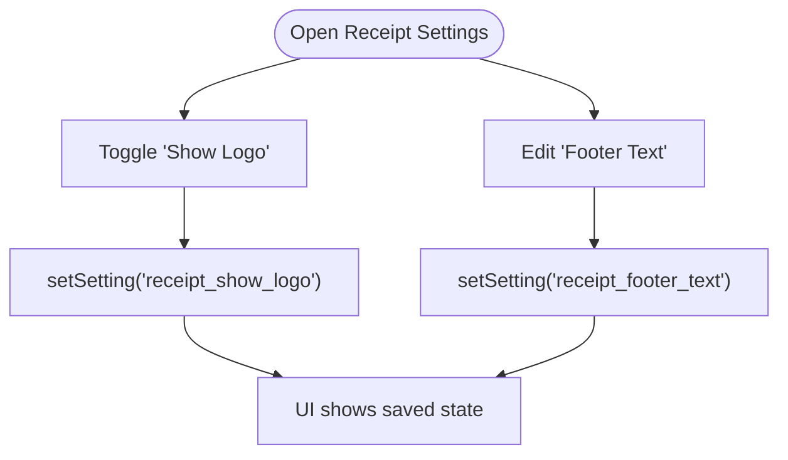
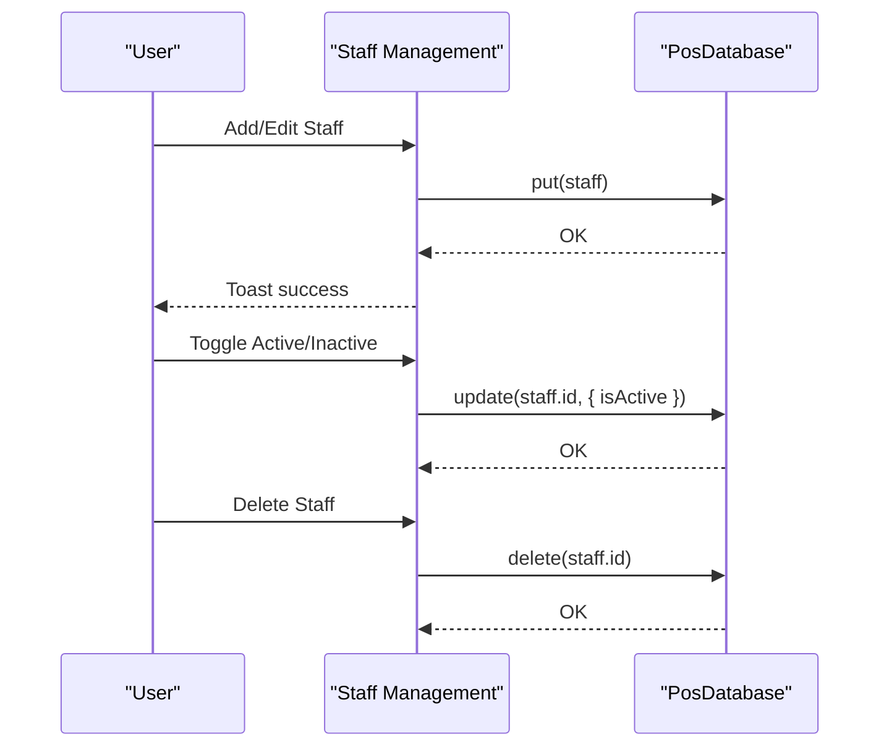
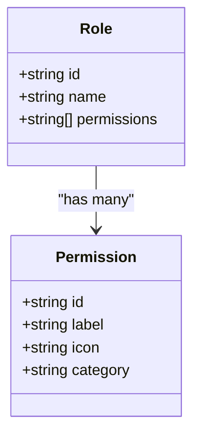
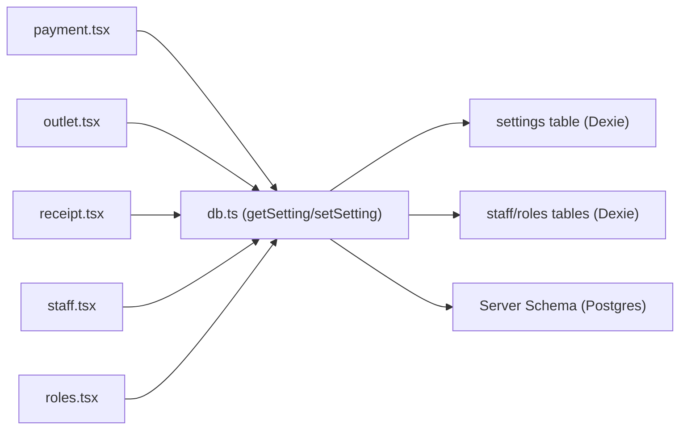

# Settings & Configuration

<cite>
**Referenced Files in This Document**
- [src/routes/app/settings/index.tsx](file://src/routes/app/settings/index.tsx)
- [src/routes/app/settings/outlet.tsx](file://src/routes/app/settings/outlet.tsx)
- [src/routes/app/settings/payment.tsx](file://src/routes/app/settings/payment.tsx)
- [src/routes/app/settings/receipt.tsx](file://src/routes/app/settings/receipt.tsx)
- [src/routes/app/settings/staff.tsx](file://src/routes/app/settings/staff.tsx)
- [src/routes/app/settings/roles.tsx](file://src/routes/app/settings/roles.tsx)
- [src/db/db.ts](file://src/db/db.ts)
- [src/data/permissions.ts](file://src/data/permissions.ts)
- [src/server/db/schema.ts](file://src/server/db/schema.ts)
- [src/server/db/seed.ts](file://src/server/db/seed.ts)
- [package.json](file://package.json)
- [README.md](file://README.md)
- [ROADMAP.md](file://ROADMAP.md)
- [PRD.txt](file://PRD.txt)
</cite>

## Table of Contents
1. [Introduction](#introduction)
2. [Project Structure](#project-structure)
3. [Core Components](#core-components)
4. [Architecture Overview](#architecture-overview)
5. [Detailed Component Analysis](#detailed-component-analysis)
6. [Dependency Analysis](#dependency-analysis)
7. [Performance Considerations](#performance-considerations)
8. [Troubleshooting Guide](#troubleshooting-guide)
9. [Conclusion](#conclusion)
10. [Appendices](#appendices)

## Introduction
This document explains how to configure and customize the NgePos POS system. It covers:
- Outlet configuration (brand identity, contact info)
- Payment method setup (cash handling, QRIS static image, delivery platform integrations)
- Receipt configuration (printer-friendly layout, footer messaging)
- Staff and role management (access control via granular permissions)
- Operational parameters and practical setup examples
- Backup and restore procedures, maintenance, and troubleshooting

NgePos is a mobile-first, offline-first POS built with SolidStart and Dexie.js, enabling local data storage and optional cloud synchronization in later phases.

## Project Structure
The settings module is organized as a dedicated route group under the application shell. Each settings page is a standalone Solid component that reads and writes to the local database and a simple key-value settings store.

**Diagram sources**
- [src/routes/app/settings/index.tsx:30-81](file://src/routes/app/settings/index.tsx#L30-L81)
- [src/routes/app/settings/outlet.tsx:1-167](file://src/routes/app/settings/outlet.tsx#L1-L167)
- [src/routes/app/settings/receipt.tsx:1-113](file://src/routes/app/settings/receipt.tsx#L1-L113)
- [src/routes/app/settings/payment.tsx:1-269](file://src/routes/app/settings/payment.tsx#L1-L269)
- [src/routes/app/settings/staff.tsx:1-462](file://src/routes/app/settings/staff.tsx#L1-L462)
- [src/routes/app/settings/roles.tsx:1-366](file://src/routes/app/settings/roles.tsx#L1-L366)
- [src/db/db.ts:270-496](file://src/db/db.ts#L270-L496)
- [src/server/db/schema.ts:27-32](file://src/server/db/schema.ts#L27-L32)
- [src/server/db/seed.ts:5-35](file://src/server/db/seed.ts#L5-L35)

**Section sources**
- [src/routes/app/settings/index.tsx:18-81](file://src/routes/app/settings/index.tsx#L18-L81)
- [src/db/db.ts:270-496](file://src/db/db.ts#L270-L496)

## Core Components
- Settings Hub: Presents quick-access tiles for outlet, receipt, payment, staff, roles, and cloud sync.
- Outlet Settings: Stores and updates brand identity (logo, name, address, phone) via the settings store.
- Receipt Settings: Controls whether the logo appears on receipts and sets a footer message.
- Payment Settings: Manages QRIS static image upload and toggles for third-party delivery platforms.
- Staff Management: CRUD for staff members and activation/deactivation.
- Roles & Permissions: Dynamic role creation with granular permission categories.

**Section sources**
- [src/routes/app/settings/index.tsx:30-81](file://src/routes/app/settings/index.tsx#L30-L81)
- [src/routes/app/settings/outlet.tsx:7-167](file://src/routes/app/settings/outlet.tsx#L7-L167)
- [src/routes/app/settings/receipt.tsx:6-113](file://src/routes/app/settings/receipt.tsx#L6-L113)
- [src/routes/app/settings/payment.tsx:7-269](file://src/routes/app/settings/payment.tsx#L7-L269)
- [src/routes/app/settings/staff.tsx:22-462](file://src/routes/app/settings/staff.tsx#L22-L462)
- [src/routes/app/settings/roles.tsx:21-366](file://src/routes/app/settings/roles.tsx#L21-L366)

## Architecture Overview
NgePos uses a local-first architecture:
- Client-side data is persisted in IndexedDB via Dexie.
- A simple key-value settings store holds runtime configuration (e.g., outlet branding, QRIS image, receipt preferences).
- Optional cloud sync is planned to connect to a PostgreSQL backend via Drizzle ORM.

**Diagram sources**
- [src/db/db.ts:502-509](file://src/db/db.ts#L502-L509)
- [src/routes/app/settings/outlet.tsx:25-37](file://src/routes/app/settings/outlet.tsx#L25-L37)
- [src/routes/app/settings/payment.tsx:25-66](file://src/routes/app/settings/payment.tsx#L25-L66)
- [src/routes/app/settings/receipt.tsx:17-28](file://src/routes/app/settings/receipt.tsx#L17-L28)
- [src/server/db/schema.ts:27-32](file://src/server/db/schema.ts#L27-L32)
- [ROADMAP.md:27-41](file://ROADMAP.md#L27-L41)

## Detailed Component Analysis

### Outlet Configuration
Outlet settings define the store’s identity and contact details. Values are stored as key-value pairs in the settings table.

Key settings managed:
- outlet_logo: Base64 image string for the store logo
- outlet_name: Store name
- outlet_address: Full address
- outlet_phone: Contact phone number

Operational flow:
- Load defaults if missing
- On blur/save, persist to settings
- Logo upload uses a file input and FileReader to convert to base64

**Diagram sources**
- [src/routes/app/settings/outlet.tsx:9-48](file://src/routes/app/settings/outlet.tsx#L9-L48)
- [src/db/db.ts:502-509](file://src/db/db.ts#L502-L509)

Practical example:
- Set outlet_name to “Ngepos Coffee”
- Paste outlet_address with full street details
- Upload a square PNG/JPG logo under 1 MB

**Section sources**
- [src/routes/app/settings/outlet.tsx:7-167](file://src/routes/app/settings/outlet.tsx#L7-L167)
- [src/db/db.ts:156-160](file://src/db/db.ts#L156-L160)

### Payment Method Setup
Two primary areas:
- QRIS Static Image: Upload a static QR code image for QRIS payments. Includes validation for image type and size.
- Delivery Platform Integrations: Toggle for GoFood, GrabFood, and ShopeeFood. Enabling a platform exposes it as a payment channel at checkout.

**Diagram sources**
- [src/routes/app/settings/payment.tsx:25-66](file://src/routes/app/settings/payment.tsx#L25-L66)
- [src/db/db.ts:502-509](file://src/db/db.ts#L502-L509)

Practical example:
- Upload a QRIS image sized to 2 MB max
- Enable only the platforms you accept orders through
- Use the footer note to communicate promo messages or thanks

**Section sources**
- [src/routes/app/settings/payment.tsx:7-269](file://src/routes/app/settings/payment.tsx#L7-L269)

### Receipt Configuration
Controls:
- Show Logo: Boolean toggle to include the logo at the top of the receipt
- Footer Text: Customizable message printed at the bottom

Printer guidance:
- Thermal 58 mm format
- Adjust browser print margins to “None” for crisp printing

**Diagram sources**
- [src/routes/app/settings/receipt.tsx:17-28](file://src/routes/app/settings/receipt.tsx#L17-L28)
- [src/db/db.ts:502-509](file://src/db/db.ts#L502-L509)

Practical example:
- Enable logo for brand visibility
- Add a short message like “Thank you — Follow us @ngepos”

**Section sources**
- [src/routes/app/settings/receipt.tsx:6-113](file://src/routes/app/settings/receipt.tsx#L6-L113)

### Staff Management
Features:
- Create, edit, activate/deactivate staff
- Assign roles with granular permissions
- Search and filter staff
- Default PIN is applied if not provided

**Diagram sources**
- [src/routes/app/settings/staff.tsx:83-138](file://src/routes/app/settings/staff.tsx#L83-L138)
- [src/db/db.ts:270-496](file://src/db/db.ts#L270-L496)

Practical example:
- Add a new cashier with a default PIN
- Assign a role with POS access and view transactions
- Deactivate staff who are no longer working

**Section sources**
- [src/routes/app/settings/staff.tsx:22-462](file://src/routes/app/settings/staff.tsx#L22-L462)

### Roles & Permissions
- Define roles with human-readable names
- Select from permission categories (Transactions, Inventory, Marketing, Finance, System)
- Admin role receives all permissions by design
- Prevent deletion of Admin role

**Diagram sources**
- [src/routes/app/settings/roles.tsx:139-143](file://src/routes/app/settings/roles.tsx#L139-L143)
- [src/data/permissions.ts:1-45](file://src/data/permissions.ts#L1-L45)

Practical example:
- Create a “Shift Supervisor” role with permissions to view transactions and manage products
- Assign a staff member to this role and verify UI access gates

**Section sources**
- [src/routes/app/settings/roles.tsx:21-366](file://src/routes/app/settings/roles.tsx#L21-L366)
- [src/data/permissions.ts:8-44](file://src/data/permissions.ts#L8-L44)

## Dependency Analysis
- Settings pages depend on:
  - getSetting/setSetting helpers for key-value persistence
  - Solid resources for reactive loading
  - UI components (buttons, toggles, dialogs)
- Staff and roles rely on the Dexie database tables
- Cloud sync (planned) will use server-side schema and seed logic

**Diagram sources**
- [src/routes/app/settings/payment.tsx:4-5](file://src/routes/app/settings/payment.tsx#L4-L5)
- [src/routes/app/settings/outlet.tsx](file://src/routes/app/settings/outlet.tsx#L4)
- [src/routes/app/settings/receipt.tsx](file://src/routes/app/settings/receipt.tsx#L4)
- [src/routes/app/settings/staff.tsx](file://src/routes/app/settings/staff.tsx#L18)
- [src/routes/app/settings/roles.tsx](file://src/routes/app/settings/roles.tsx#L14)
- [src/db/db.ts:502-509](file://src/db/db.ts#L502-L509)
- [src/server/db/schema.ts:27-32](file://src/server/db/schema.ts#L27-L32)

**Section sources**
- [src/db/db.ts:270-496](file://src/db/db.ts#L270-L496)
- [src/server/db/schema.ts:27-32](file://src/server/db/schema.ts#L27-L32)

## Performance Considerations
- Settings operations are lightweight key-value writes; UI updates reactively via Solid resources.
- Image uploads (QRIS logo, outlet logo) are base64-encoded; keep files under recommended sizes to avoid bloating IndexedDB.
- Receipt rendering is optimized for thermal printers; avoid excessive images or long footers to prevent truncation.

[No sources needed since this section provides general guidance]

## Troubleshooting Guide
Common issues and resolutions:
- QRIS image not appearing
  - Ensure the file is an image and under 2 MB
  - Re-upload after confirming the file type and size
  - Verify the setting key exists and is readable
- Platform integrations not visible
  - Confirm the enable flags are set to true
  - Restart the app to refresh cached settings
- Receipt logo not printing
  - Toggle the “Show Logo” setting
  - Adjust browser print margins to “None”
- Staff not receiving access
  - Verify the staff member has an active role with required permissions
  - Check that the Admin role cannot be edited or deleted
- Cloud sync not available
  - Feature is marked as upcoming; ensure backend endpoints are configured

**Section sources**
- [src/routes/app/settings/payment.tsx:25-66](file://src/routes/app/settings/payment.tsx#L25-L66)
- [src/routes/app/settings/receipt.tsx:17-28](file://src/routes/app/settings/receipt.tsx#L17-L28)
- [src/routes/app/settings/staff.tsx:83-138](file://src/routes/app/settings/staff.tsx#L83-L138)
- [src/routes/app/settings/roles.tsx:33-105](file://src/routes/app/settings/roles.tsx#L33-L105)
- [ROADMAP.md:27-41](file://ROADMAP.md#L27-L41)

## Conclusion
NgePos provides a practical, offline-first settings system covering branding, payment channels, receipts, staff, and roles. Use the settings hub to tailor the POS to your business needs today, and prepare for cloud sync in future releases.

[No sources needed since this section summarizes without analyzing specific files]

## Appendices

### Backup and Restore Procedures
- Local backup (recommended)
  - Export IndexedDB data using browser developer tools or Dexie utilities
  - Keep a copy of the exported data locally
- Restore
  - Import the saved data back into IndexedDB on the same device
- Cloud backup (planned)
  - Connect to the backend and synchronize data via REST API
  - Use seed scripts to initialize default roles if needed

**Section sources**
- [ROADMAP.md:27-41](file://ROADMAP.md#L27-L41)
- [src/server/db/seed.ts:5-35](file://src/server/db/seed.ts#L5-L35)

### System Maintenance
- Regularly review and update:
  - Outlet branding and contact info
  - Payment method coverage and QRIS image freshness
  - Staff role assignments and activity status
  - Receipt layout and footer messaging
- Monitor storage usage for base64 images and logs

**Section sources**
- [src/routes/app/settings/outlet.tsx:39-48](file://src/routes/app/settings/outlet.tsx#L39-L48)
- [src/routes/app/settings/payment.tsx:25-66](file://src/routes/app/settings/payment.tsx#L25-L66)
- [src/routes/app/settings/receipt.tsx:17-28](file://src/routes/app/settings/receipt.tsx#L17-L28)

### Practical Examples Index
- Outlet branding: set outlet_name, outlet_address, outlet_phone, and upload outlet_logo
- Payment configuration: upload QRIS image and enable delivery platforms
- Receipt customization: toggle logo and set footer text
- Operational customization: create roles with appropriate permissions and assign staff

**Section sources**
- [src/routes/app/settings/outlet.tsx:25-48](file://src/routes/app/settings/outlet.tsx#L25-L48)
- [src/routes/app/settings/payment.tsx:25-66](file://src/routes/app/settings/payment.tsx#L25-L66)
- [src/routes/app/settings/receipt.tsx:17-28](file://src/routes/app/settings/receipt.tsx#L17-L28)
- [src/routes/app/settings/staff.tsx:83-138](file://src/routes/app/settings/staff.tsx#L83-L138)
- [src/routes/app/settings/roles.tsx:60-84](file://src/routes/app/settings/roles.tsx#L60-L84)