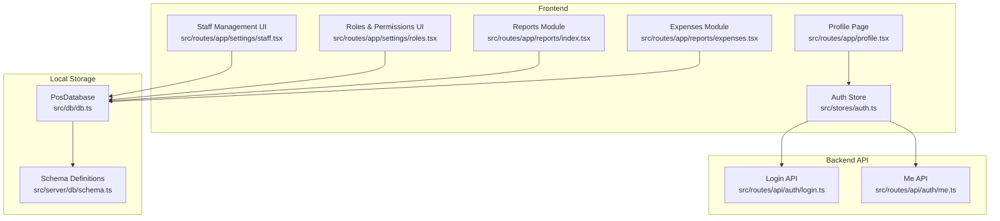
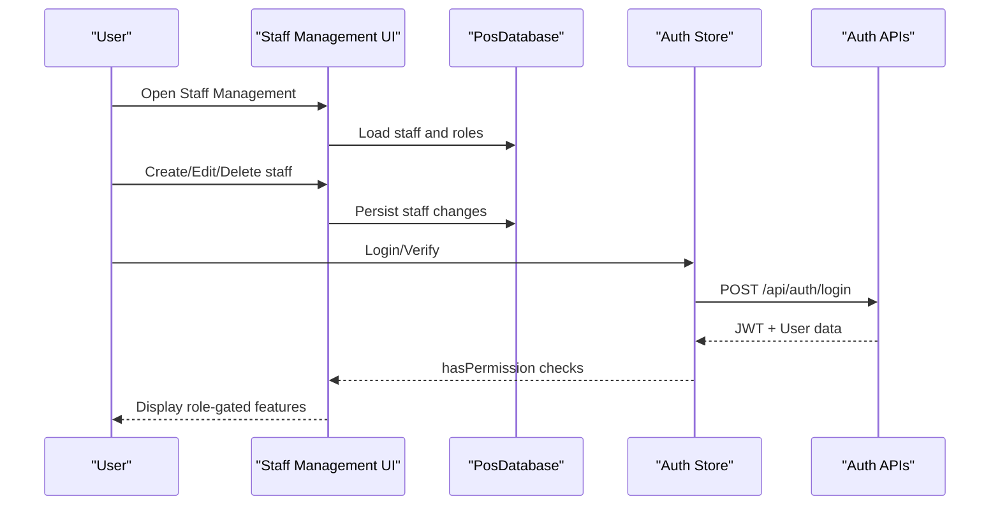
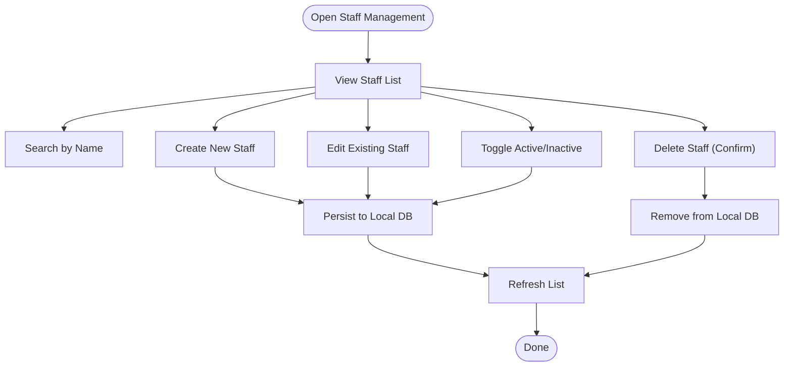
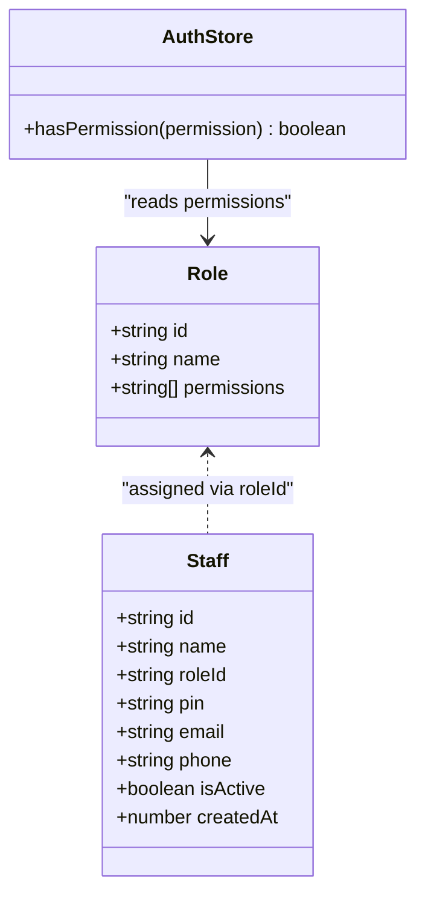
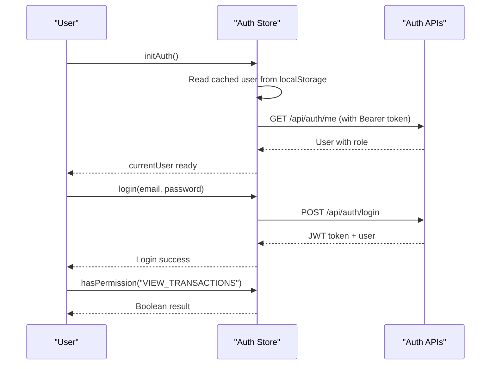
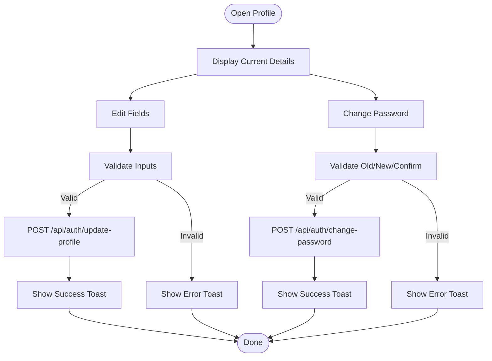
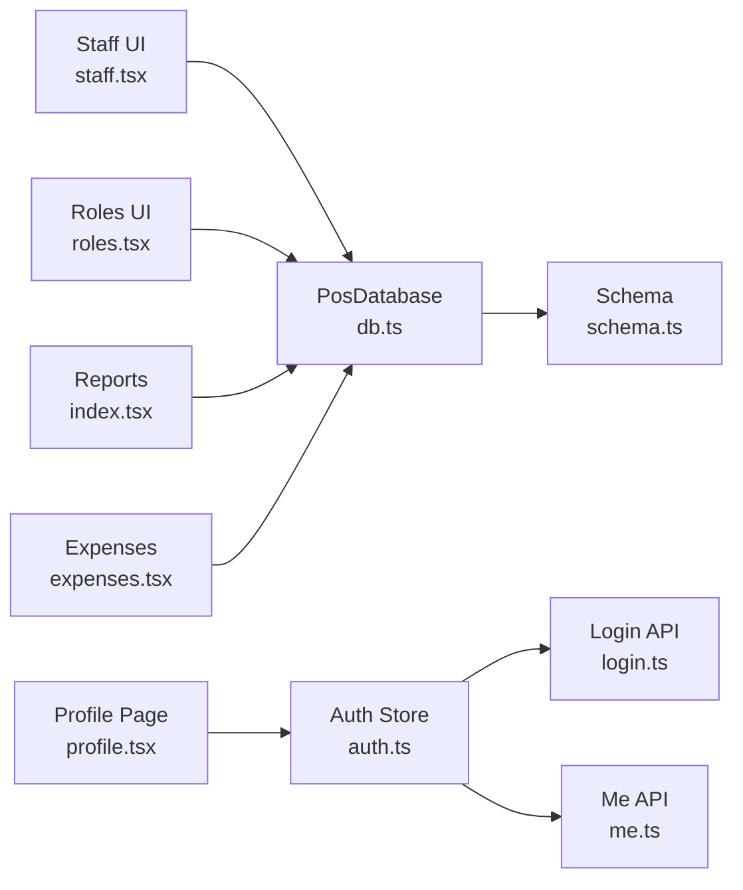

# Staff Management

<cite>
**Referenced Files in This Document**
- [staff.tsx](file://src/routes/app/settings/staff.tsx)
- [roles.tsx](file://src/routes/app/settings/roles.tsx)
- [permissions.ts](file://src/data/permissions.ts)
- [schema.ts](file://src/server/db/schema.ts)
- [db.ts](file://src/db/db.ts)
- [auth.ts](file://src/stores/auth.ts)
- [login.ts](file://src/routes/api/auth/login.ts)
- [me.ts](file://src/routes/api/auth/me.ts)
- [profile.tsx](file://src/routes/app/profile.tsx)
- [index.tsx](file://src/routes/app/reports/index.tsx)
- [expenses.tsx](file://src/routes/app/reports/expenses.tsx)
- [PRD.txt](file://PRD.txt)
- [ROADMAP.md](file://ROADMAP.md)
</cite>

## Table of Contents
1. [Introduction](#introduction)
2. [Project Structure](#project-structure)
3. [Core Components](#core-components)
4. [Architecture Overview](#architecture-overview)
5. [Detailed Component Analysis](#detailed-component-analysis)
6. [Dependency Analysis](#dependency-analysis)
7. [Performance Considerations](#performance-considerations)
8. [Troubleshooting Guide](#troubleshooting-guide)
9. [Conclusion](#conclusion)
10. [Appendices](#appendices)

## Introduction
This document provides comprehensive staff management documentation for the NgePos POS system. It covers user administration (staff CRUD operations, profile management, and account lifecycle), role-based access control (RBAC) including role creation, permission assignment, and access level management, and outlines current capabilities around staff scheduling, shift tracking, and commission calculation. It also documents staff training management, performance metrics, and communication tools, along with practical examples of staff setup, permission configuration, and administrative workflows. Finally, it addresses staff security, access logging, and compliance requirements.

## Project Structure
The staff management functionality spans frontend components, local IndexedDB storage, and backend authentication APIs. Key areas include:
- Staff management UI for creating, updating, deactivating, and deleting staff
- Role and permission management with dynamic permission categories
- Authentication and authorization store for enforcing permissions
- Local database schema for staff and roles
- Reports and expenses modules that can be leveraged for performance metrics and operational insights

**Diagram sources**
- [staff.tsx:22-461](file://src/routes/app/settings/staff.tsx#L22-L461)
- [roles.tsx:21-366](file://src/routes/app/settings/roles.tsx#L21-L366)
- [auth.ts:11-205](file://src/stores/auth.ts#L11-L205)
- [profile.tsx:8-280](file://src/routes/app/profile.tsx#L8-L280)
- [index.tsx:49-715](file://src/routes/app/reports/index.tsx#L49-L715)
- [expenses.tsx:33-478](file://src/routes/app/reports/expenses.tsx#L33-L478)
- [db.ts:270-496](file://src/db/db.ts#L270-L496)
- [schema.ts:1-134](file://src/server/db/schema.ts#L1-L134)
- [login.ts:11-55](file://src/routes/api/auth/login.ts#L11-L55)
- [me.ts:10-60](file://src/routes/api/auth/me.ts#L10-L60)

**Section sources**
- [staff.tsx:22-461](file://src/routes/app/settings/staff.tsx#L22-L461)
- [roles.tsx:21-366](file://src/routes/app/settings/roles.tsx#L21-L366)
- [auth.ts:11-205](file://src/stores/auth.ts#L11-L205)
- [db.ts:270-496](file://src/db/db.ts#L270-L496)
- [schema.ts:1-134](file://src/server/db/schema.ts#L1-L134)
- [login.ts:11-55](file://src/routes/api/auth/login.ts#L11-L55)
- [me.ts:10-60](file://src/routes/api/auth/me.ts#L10-L60)
- [profile.tsx:8-280](file://src/routes/app/profile.tsx#L8-L280)
- [index.tsx:49-715](file://src/routes/app/reports/index.tsx#L49-L715)
- [expenses.tsx:33-478](file://src/routes/app/reports/expenses.tsx#L33-L478)

## Core Components
- Staff Management UI: Provides CRUD operations for staff, including activation/deactivation and deletion. Supports searching and role assignment.
- Role & Permission Management UI: Allows creation and modification of roles with granular permissions organized into categories (Transactions, Inventory, Marketing, Finance, System).
- Authentication Store: Handles login, token verification, user session, and permission checks via hasPermission.
- Local Database: Dexie-based schema for staff and roles, with IndexedDB-backed persistence.
- Backend Authentication APIs: JWT-based login and profile retrieval endpoints.
- Reports and Expenses: Modules that can be used to derive performance metrics and operational insights for staff-related activities.

**Section sources**
- [staff.tsx:22-461](file://src/routes/app/settings/staff.tsx#L22-L461)
- [roles.tsx:21-366](file://src/routes/app/settings/roles.tsx#L21-L366)
- [permissions.ts:1-45](file://src/data/permissions.ts#L1-L45)
- [auth.ts:11-205](file://src/stores/auth.ts#L11-L205)
- [db.ts:270-496](file://src/db/db.ts#L270-L496)
- [schema.ts:1-134](file://src/server/db/schema.ts#L1-L134)
- [login.ts:11-55](file://src/routes/api/auth/login.ts#L11-L55)
- [me.ts:10-60](file://src/routes/api/auth/me.ts#L10-L60)
- [index.tsx:49-715](file://src/routes/app/reports/index.tsx#L49-L715)
- [expenses.tsx:33-478](file://src/routes/app/reports/expenses.tsx#L33-L478)

## Architecture Overview
The staff management system integrates frontend UI components with local IndexedDB storage and backend authentication APIs. The authentication store enforces permissions using role data fetched from the local database. Reports and expenses modules provide complementary data sources for performance analysis.

**Diagram sources**
- [staff.tsx:35-138](file://src/routes/app/settings/staff.tsx#L35-L138)
- [auth.ts:58-202](file://src/stores/auth.ts#L58-L202)
- [login.ts:11-55](file://src/routes/api/auth/login.ts#L11-L55)
- [me.ts:10-60](file://src/routes/api/auth/me.ts#L10-L60)
- [db.ts:270-496](file://src/db/db.ts#L270-L496)

**Section sources**
- [staff.tsx:35-138](file://src/routes/app/settings/staff.tsx#L35-L138)
- [auth.ts:58-202](file://src/stores/auth.ts#L58-L202)
- [login.ts:11-55](file://src/routes/api/auth/login.ts#L11-L55)
- [me.ts:10-60](file://src/routes/api/auth/me.ts#L10-L60)
- [db.ts:270-496](file://src/db/db.ts#L270-L496)

## Detailed Component Analysis

### Staff CRUD Operations
The Staff Management UI enables:
- Viewing staff with role badges and contact info
- Searching by name
- Creating new staff with default role selection
- Editing existing staff profiles
- Activating/deactivating staff accounts
- Deleting staff with confirmation

**Diagram sources**
- [staff.tsx:35-138](file://src/routes/app/settings/staff.tsx#L35-L138)

**Section sources**
- [staff.tsx:22-461](file://src/routes/app/settings/staff.tsx#L22-L461)

### Role-Based Access Control (RBAC)
The RBAC system consists of:
- Roles with unique identifiers and permission arrays
- Permission categories (Transactions, Inventory, Marketing, Finance, System)
- Dynamic permission toggling in the Roles UI
- Super Admin role with all permissions
- Enforcement via hasPermission in the auth store

**Diagram sources**
- [roles.tsx:21-105](file://src/routes/app/settings/roles.tsx#L21-L105)
- [permissions.ts:1-45](file://src/data/permissions.ts#L1-L45)
- [db.ts:139-154](file://src/db/db.ts#L139-L154)
- [auth.ts:197-202](file://src/stores/auth.ts#L197-L202)

**Section sources**
- [roles.tsx:21-366](file://src/routes/app/settings/roles.tsx#L21-L366)
- [permissions.ts:1-45](file://src/data/permissions.ts#L1-L45)
- [db.ts:139-154](file://src/db/db.ts#L139-L154)
- [auth.ts:197-202](file://src/stores/auth.ts#L197-L202)

### Authentication and Authorization Flow
The authentication store manages:
- Initialization with cached user data
- Login via JWT with backend API
- Profile updates and password changes
- Permission checks using role permissions

**Diagram sources**
- [auth.ts:11-205](file://src/stores/auth.ts#L11-L205)
- [login.ts:11-55](file://src/routes/api/auth/login.ts#L11-L55)
- [me.ts:10-60](file://src/routes/api/auth/me.ts#L10-L60)

**Section sources**
- [auth.ts:11-205](file://src/stores/auth.ts#L11-L205)
- [login.ts:11-55](file://src/routes/api/auth/login.ts#L11-L55)
- [me.ts:10-60](file://src/routes/api/auth/me.ts#L10-L60)

### Staff Profile Management
The Profile Page supports:
- Viewing and editing personal details (name, email, phone)
- Changing passwords with validation
- Logout functionality

**Diagram sources**
- [profile.tsx:50-96](file://src/routes/app/profile.tsx#L50-L96)
- [auth.ts:141-189](file://src/stores/auth.ts#L141-L189)

**Section sources**
- [profile.tsx:8-280](file://src/routes/app/profile.tsx#L8-L280)
- [auth.ts:141-189](file://src/stores/auth.ts#L141-L189)

### Staff Scheduling, Shift Tracking, and Commission Calculation
Current Implementation Status:
- Staff scheduling, shift tracking, and commission calculation are not implemented in the current codebase.
- The roadmap indicates future work on activity logging (audit trail) which could support shift tracking and commission calculations.

Recommendations:
- Introduce a dedicated shifts table with start/end timestamps, staff assignments, and optional commission rates.
- Track transaction counts and totals per staff member within a period to compute commissions.
- Implement shift clock-in/out events and integrate with transaction data for accurate attribution.

**Section sources**
- [ROADMAP.md:62-63](file://ROADMAP.md#L62-L63)

### Staff Training Management, Performance Metrics, and Communication Tools
Current Implementation Status:
- Training management and communication tools are not implemented.
- Performance metrics can be derived from reports and expenses modules.

Recommendations:
- Training management: Create a training module to track completion, certifications, and reminders.
- Performance metrics: Use reports to analyze transaction volumes, revenue per staff member, and expense allocations.
- Communication tools: Integrate messaging or announcements within the app for staff updates.

**Section sources**
- [index.tsx:276-604](file://src/routes/app/reports/index.tsx#L276-L604)
- [expenses.tsx:162-163](file://src/routes/app/reports/expenses.tsx#L162-L163)
- [ROADMAP.md:62-63](file://ROADMAP.md#L62-L63)

### Practical Examples

#### Example 1: Adding a New Staff Member
- Navigate to Staff Management
- Click "New Staff"
- Enter name and select role
- Optionally add email and phone
- Save to persist in local database

**Section sources**
- [staff.tsx:63-114](file://src/routes/app/settings/staff.tsx#L63-L114)

#### Example 2: Assigning Permissions to a Role
- Navigate to Roles & Permissions
- Click "New Role"
- Enter role name
- Toggle desired permissions from categories
- Save role to persist in local database

**Section sources**
- [roles.tsx:32-84](file://src/routes/app/settings/roles.tsx#L32-L84)
- [permissions.ts:16-44](file://src/data/permissions.ts#L16-L44)

#### Example 3: Enforcing Access Based on Permissions
- Use hasPermission in UI components to gate features
- Super Admin bypasses permission checks

**Section sources**
- [auth.ts:197-202](file://src/stores/auth.ts#L197-L202)

#### Example 4: Viewing Performance Metrics
- Use Reports module to analyze revenue, expenses, and profit trends
- Use Expenses module to track operational costs

**Section sources**
- [index.tsx:276-604](file://src/routes/app/reports/index.tsx#L276-L604)
- [expenses.tsx:162-163](file://src/routes/app/reports/expenses.tsx#L162-L163)

### Administrative Workflows
- Staff Lifecycle: Create, activate/deactivate, edit, delete
- Role Lifecycle: Create, modify, delete (with safeguards for Super Admin)
- Permission Lifecycle: Assign, revoke, review
- Profile Lifecycle: Update details, change password, logout

**Section sources**
- [staff.tsx:116-138](file://src/routes/app/settings/staff.tsx#L116-L138)
- [roles.tsx:86-105](file://src/routes/app/settings/roles.tsx#L86-L105)
- [profile.tsx:43-96](file://src/routes/app/profile.tsx#L43-L96)

## Dependency Analysis
The staff management system exhibits clear separation of concerns:
- UI components depend on local database for data persistence
- Authentication store depends on backend APIs for session management
- Reports and expenses modules consume local data for analytics
- Schema definitions define the data model for staff and roles

**Diagram sources**
- [staff.tsx:18-37](file://src/routes/app/settings/staff.tsx#L18-L37)
- [roles.tsx:14-29](file://src/routes/app/settings/roles.tsx#L14-L29)
- [auth.ts:11-205](file://src/stores/auth.ts#L11-L205)
- [login.ts:1-55](file://src/routes/api/auth/login.ts#L1-L55)
- [me.ts:1-60](file://src/routes/api/auth/me.ts#L1-L60)
- [profile.tsx:1-10](file://src/routes/app/profile.tsx#L1-L10)
- [index.tsx:18-23](file://src/routes/app/reports/index.tsx#L18-L23)
- [expenses.tsx:5-21](file://src/routes/app/reports/expenses.tsx#L5-L21)
- [db.ts:270-496](file://src/db/db.ts#L270-L496)
- [schema.ts:1-134](file://src/server/db/schema.ts#L1-L134)

**Section sources**
- [staff.tsx:18-37](file://src/routes/app/settings/staff.tsx#L18-L37)
- [roles.tsx:14-29](file://src/routes/app/settings/roles.tsx#L14-L29)
- [auth.ts:11-205](file://src/stores/auth.ts#L11-L205)
- [login.ts:1-55](file://src/routes/api/auth/login.ts#L1-L55)
- [me.ts:1-60](file://src/routes/api/auth/me.ts#L1-L60)
- [profile.tsx:1-10](file://src/routes/app/profile.tsx#L1-L10)
- [index.tsx:18-23](file://src/routes/app/reports/index.tsx#L18-L23)
- [expenses.tsx:5-21](file://src/routes/app/reports/expenses.tsx#L5-L21)
- [db.ts:270-496](file://src/db/db.ts#L270-L496)
- [schema.ts:1-134](file://src/server/db/schema.ts#L1-L134)

## Performance Considerations
- Local IndexedDB storage ensures fast UI interactions without network latency.
- Permission checks are performed client-side using cached role data, minimizing API calls.
- Reports and expenses modules aggregate data locally, enabling responsive analytics.

[No sources needed since this section provides general guidance]

## Troubleshooting Guide
Common issues and resolutions:
- Login failures: Verify credentials and ensure email is verified; check token validity.
- Permission errors: Confirm role permissions and Super Admin bypass behavior.
- Data persistence: Ensure IndexedDB is accessible and not blocked by browser settings.
- Reports not loading: Check date filters and confirm data availability in local storage.

**Section sources**
- [login.ts:20-32](file://src/routes/api/auth/login.ts#L20-L32)
- [me.ts:13-18](file://src/routes/api/auth/me.ts#L13-L18)
- [auth.ts:197-202](file://src/stores/auth.ts#L197-L202)
- [index.tsx:454-461](file://src/routes/app/reports/index.tsx#L454-L461)

## Conclusion
NgePos provides a robust foundation for staff management with comprehensive staff CRUD, dynamic role-based access control, and integrated authentication. While scheduling, shift tracking, and commission calculation are not yet implemented, the architecture supports future enhancements. The combination of local data persistence, permission enforcement, and reporting modules offers a strong basis for operational oversight and compliance.

[No sources needed since this section summarizes without analyzing specific files]

## Appendices

### Appendix A: Permission Categories and Examples
- Transactions: POS access, view transactions, void transactions
- Inventory: View/manage products, manage materials, manage categories
- Marketing: Manage promotions, view/manage members, manage loyalty
- Finance: View reports, manage expenses
- System: Manage outlet, printer, payment methods, manage staff

**Section sources**
- [permissions.ts:8-44](file://src/data/permissions.ts#L8-L44)

### Appendix B: Staff and Role Data Model
- Staff fields: id, name, roleId, pin, email, phone, isActive, createdAt
- Role fields: id, name, permissions array

**Section sources**
- [db.ts:139-154](file://src/db/db.ts#L139-L154)
- [schema.ts:4-25](file://src/server/db/schema.ts#L4-L25)

### Appendix C: Security and Compliance Notes
- Super Admin role has all permissions; admin role is protected from deletion.
- Email verification requirement during login.
- JWT-based session management with expiration.
- Future roadmap includes activity logging for audit trails.

**Section sources**
- [roles.tsx:86-105](file://src/routes/app/settings/roles.tsx#L86-L105)
- [login.ts:26-28](file://src/routes/api/auth/login.ts#L26-L28)
- [auth.ts:197-202](file://src/stores/auth.ts#L197-L202)
- [ROADMAP.md:62-63](file://ROADMAP.md#L62-L63)