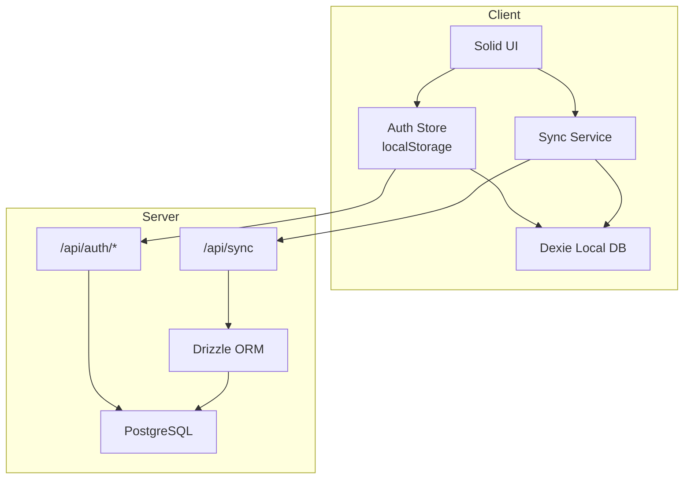
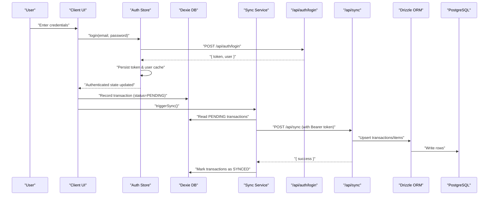
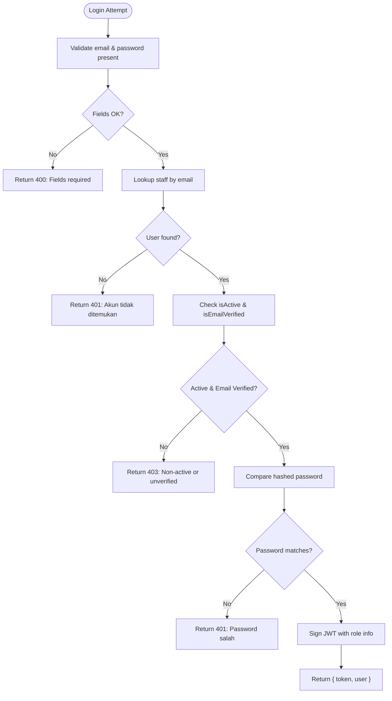
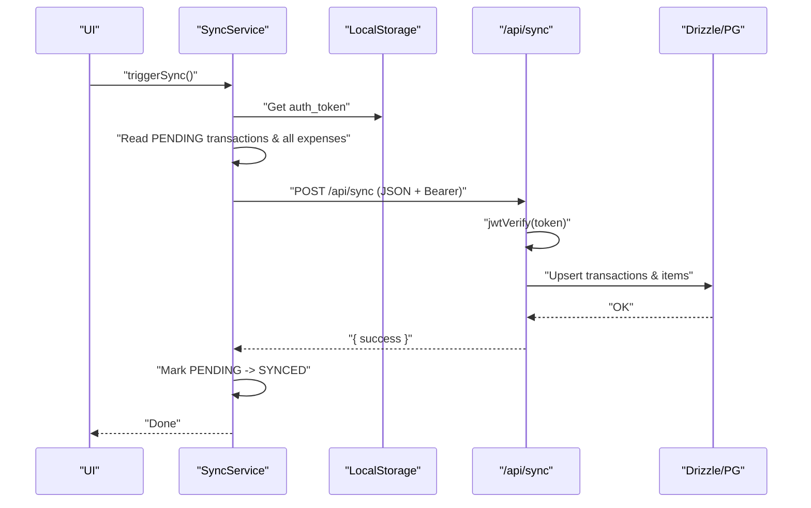
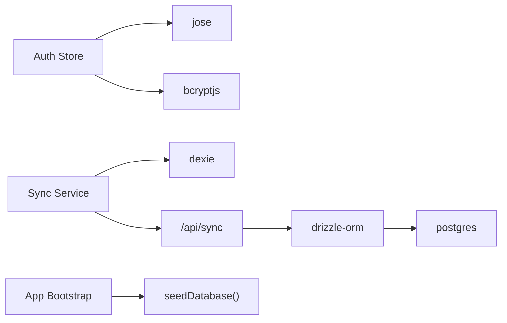

# Troubleshooting & FAQ

<cite>
**Referenced Files in This Document**
- [README.md](file://README.md)
- [package.json](file://package.json)
- [drizzle.config.ts](file://drizzle.config.ts)
- [src/app.tsx](file://src/app.tsx)
- [src/db/db.ts](file://src/db/db.ts)
- [src/server/db/index.ts](file://src/server/db/index.ts)
- [src/server/db/schema.ts](file://src/server/db/schema.ts)
- [src/routes/api/auth/login.ts](file://src/routes/api/auth/login.ts)
- [src/stores/auth.ts](file://src/stores/auth.ts)
- [src/routes/api/sync/index.ts](file://src/routes/api/sync/index.ts)
- [src/lib/syncService.ts](file://src/lib/syncService.ts)
- [src/hooks/useCheckout.ts](file://src/hooks/useCheckout.ts)
</cite>

## Table of Contents
1. [Introduction](#introduction)
2. [Project Structure](#project-structure)
3. [Core Components](#core-components)
4. [Architecture Overview](#architecture-overview)
5. [Detailed Component Analysis](#detailed-component-analysis)
6. [Dependency Analysis](#dependency-analysis)
7. [Performance Considerations](#performance-considerations)
8. [Troubleshooting Guide](#troubleshooting-guide)
9. [Conclusion](#conclusion)
10. [Appendices](#appendices)

## Introduction
This document provides comprehensive troubleshooting and FAQ guidance for the NgePos POS system. It focuses on diagnosing and resolving common issues related to authentication, synchronization, database migrations, and performance. It also covers error diagnosis procedures, log analysis techniques, debugging tools, recovery and rollback procedures, and answers to frequently asked questions about system capabilities and configuration.

## Project Structure
NgePos is a SolidStart-based POS application with:
- Frontend state and persistence using Dexie (client-side IndexedDB)
- Backend API written in server routes
- PostgreSQL-backed schema managed via Drizzle ORM
- Authentication via signed JWT tokens
- Synchronization pipeline pushing local changes to the backend

**Diagram sources**
- [src/stores/auth.ts:11-205](file://src/stores/auth.ts#L11-L205)
- [src/lib/syncService.ts:4-57](file://src/lib/syncService.ts#L4-L57)
- [src/routes/api/auth/login.ts:11-54](file://src/routes/api/auth/login.ts#L11-L54)
- [src/routes/api/sync/index.ts:10-101](file://src/routes/api/sync/index.ts#L10-L101)
- [src/server/db/index.ts:1-27](file://src/server/db/index.ts#L1-L27)
- [src/server/db/schema.ts:1-142](file://src/server/db/schema.ts#L1-L142)
- [src/db/db.ts:270-496](file://src/db/db.ts#L270-L496)

**Section sources**
- [README.md:1-33](file://README.md#L1-L33)
- [package.json:1-56](file://package.json#L1-L56)

## Core Components
- Authentication service: handles login, registration, verification, profile updates, and password changes. It validates credentials against the backend and manages JWT tokens and local user cache.
- Synchronization service: batches local changes (transactions and expenses) and pushes them to the backend endpoint with a bearer token.
- Local database: Dexie-based client-side schema with multiple tables for products, transactions, expenses, staff, roles, and loyalty.
- Backend API: exposes authentication endpoints and a sync endpoint protected by JWT verification.
- Database connectivity: Drizzle ORM connects to PostgreSQL using a configurable connection string.

Key responsibilities and integration points are covered in the sections below.

**Section sources**
- [src/stores/auth.ts:11-205](file://src/stores/auth.ts#L11-L205)
- [src/lib/syncService.ts:4-57](file://src/lib/syncService.ts#L4-L57)
- [src/db/db.ts:270-496](file://src/db/db.ts#L270-L496)
- [src/routes/api/auth/login.ts:11-54](file://src/routes/api/auth/login.ts#L11-L54)
- [src/routes/api/sync/index.ts:10-101](file://src/routes/api/sync/index.ts#L10-L101)
- [src/server/db/index.ts:1-27](file://src/server/db/index.ts#L1-L27)

## Architecture Overview
The system follows a client-local-first architecture:
- Client persists state locally and marks transactions as PENDING until synced.
- Background sync triggers periodically to push PENDING data to the server.
- Server verifies JWT and upserts transactions and items into PostgreSQL.

**Diagram sources**
- [src/stores/auth.ts:58-79](file://src/stores/auth.ts#L58-L79)
- [src/routes/api/auth/login.ts:11-54](file://src/routes/api/auth/login.ts#L11-L54)
- [src/lib/syncService.ts:5-56](file://src/lib/syncService.ts#L5-L56)
- [src/routes/api/sync/index.ts:10-101](file://src/routes/api/sync/index.ts#L10-L101)
- [src/db/db.ts:82-98](file://src/db/db.ts#L82-L98)

## Detailed Component Analysis

### Authentication Troubleshooting
Common symptoms:
- Login returns “Email & Password wajib” (missing fields)
- Login returns “Akun tidak ditemukan” (unknown user)
- Login returns “Password salah” (invalid credentials)
- Returned error “Email belum verifikasi” with requireVerification flag
- Returned error “Akun nonaktif”
- Server Error 500 during login

Resolution steps:
- Verify request payload includes both email and password.
- Confirm the user exists and is active and email is verified.
- Ensure the JWT secret environment variable is configured consistently on client and server.
- Check network connectivity and backend availability.
- Review server logs for stack traces.

**Diagram sources**
- [src/routes/api/auth/login.ts:11-54](file://src/routes/api/auth/login.ts#L11-L54)

**Section sources**
- [src/routes/api/auth/login.ts:11-54](file://src/routes/api/auth/login.ts#L11-L54)
- [src/stores/auth.ts:58-79](file://src/stores/auth.ts#L58-L79)

### Synchronization Troubleshooting
Common symptoms:
- No data sync despite PENDING transactions
- Sync endpoint returns Unauthorized
- Sync endpoint returns Internal Server Error
- Local PENDING entries remain after network outage

Resolution steps:
- Ensure a valid auth token is present in localStorage.
- Confirm the sync endpoint receives Authorization: Bearer header.
- Verify JWT secret is identical on client and server.
- Check that the client’s debounce timer completes before retrying.
- Inspect server logs for sync errors and database write failures.

**Diagram sources**
- [src/lib/syncService.ts:4-57](file://src/lib/syncService.ts#L4-L57)
- [src/routes/api/sync/index.ts:10-101](file://src/routes/api/sync/index.ts#L10-L101)
- [src/db/db.ts:82-98](file://src/db/db.ts#L82-L98)

**Section sources**
- [src/lib/syncService.ts:4-57](file://src/lib/syncService.ts#L4-L57)
- [src/routes/api/sync/index.ts:10-101](file://src/routes/api/sync/index.ts#L10-L101)
- [src/hooks/useCheckout.ts:201-203](file://src/hooks/useCheckout.ts#L201-L203)

### Database Migration Troubleshooting
Observed schema versions and upgrades:
- Versions 2 → 3: Added expenses and settings; backfilled cogsTotal
- Versions 3 → 5: Added originalAmount to transactions
- Versions 5 → 6: Added variantTemplates
- Versions 6 → 8: Added staff table
- Versions 8 → 9: Added email to staff and roles
- Versions 9 → 10: Added maxSelectable to variants
- Versions 10 → 11: Added rawMaterialLibrary
- Versions 11 → 12: Added discounts and bundles
- Versions 12 → 13: Added campaigns, campaignItems, campaignRewards
- Versions 13 → 14: Added customers, loyaltyPrograms, customerStamps, customerRewards
- Versions 14 → 15: Added inventoryLogs; backfilled rawMaterialLibrary stock
- Versions 15 → 16: Added isActive to products, materials, templates; backfilled defaults

Resolution steps:
- Ensure DATABASE_URL is configured and reachable.
- Run migrations using Drizzle Kit to align schema with the latest version.
- If encountering conflicts, re-run migrations after backing up data.
- For manual fixes, review upgrade blocks and apply missing defaults.

**Section sources**
- [src/db/db.ts:295-473](file://src/db/db.ts#L295-L473)
- [drizzle.config.ts:1-11](file://drizzle.config.ts#L1-L11)
- [src/server/db/index.ts:1-27](file://src/server/db/index.ts#L1-L27)

### Checkout and Local Data Integrity
Symptoms:
- Checkout fails with “Item tidak terdeteksi”
- Stock not reduced or inventory logs not recorded
- COGS not updated for products with recipes

Resolution steps:
- Ensure cart is not empty before checkout.
- Verify product records exist and raw materials are available for recipes.
- Confirm transaction timestamps are valid.
- After successful checkout, confirm PENDING transaction is created and sync runs.

**Section sources**
- [src/hooks/useCheckout.ts:38-213](file://src/hooks/useCheckout.ts#L38-L213)
- [src/db/db.ts:82-98](file://src/db/db.ts#L82-L98)

## Dependency Analysis
Key external dependencies impacting reliability and performance:
- Drizzle ORM and PostgreSQL for server-side persistence
- jose for JWT signing/verification
- bcryptjs for password hashing
- dexie for client-side persistence
- solid-toast for user feedback

**Diagram sources**
- [package.json:11-40](file://package.json#L11-L40)
- [src/stores/auth.ts:11-205](file://src/stores/auth.ts#L11-L205)
- [src/lib/syncService.ts:4-57](file://src/lib/syncService.ts#L4-L57)
- [src/routes/api/sync/index.ts:10-101](file://src/routes/api/sync/index.ts#L10-L101)
- [src/server/db/index.ts:1-27](file://src/server/db/index.ts#L1-L27)
- [src/app.tsx:24-27](file://src/app.tsx#L24-L27)

**Section sources**
- [package.json:11-40](file://package.json#L11-L40)

## Performance Considerations
- Debounced sync: The sync service debounces requests to reduce server load. Tune the delay if needed.
- Batch writes: Sync batches PENDING transactions and expenses to minimize round trips.
- IndexedDB queries: Dexie indexes are defined for key fields; ensure queries leverage indexes (e.g., transaction status, timestamps).
- JWT verification: Keep secrets secure and consistent to avoid unnecessary retries.
- Database writes: Upserts are used to handle duplicates; ensure PostgreSQL indexes are aligned with frequent filters.

[No sources needed since this section provides general guidance]

## Troubleshooting Guide

### Authentication Problems
Symptoms and resolutions:
- Missing credentials: Ensure both email and password are provided.
- Unknown account: Verify the email exists and is registered.
- Incorrect password: Confirm the password matches the stored hash.
- Unverified email: Trigger OTP resend and complete verification.
- Inactive account: Activate the staff record.
- Server errors: Check backend logs for stack traces and environment configuration.

**Section sources**
- [src/routes/api/auth/login.ts:11-54](file://src/routes/api/auth/login.ts#L11-L54)
- [src/stores/auth.ts:58-79](file://src/stores/auth.ts#L58-L79)

### Synchronization Errors
Symptoms and resolutions:
- Unauthorized sync: Confirm Authorization header and valid JWT.
- No sync: Ensure localStorage contains a token and PENDING transactions exist.
- Server errors: Inspect server logs for sync handler exceptions.
- Stuck PENDING: Retry sync after network recovery; verify debounce interval.

**Section sources**
- [src/lib/syncService.ts:4-57](file://src/lib/syncService.ts#L4-L57)
- [src/routes/api/sync/index.ts:10-101](file://src/routes/api/sync/index.ts#L10-L101)

### Database Migration Issues
Symptoms and resolutions:
- Schema mismatch: Run Drizzle Kit migrations to align with the latest version.
- Missing fields: Apply upgrade blocks that backfill defaults.
- Connection failures: Verify DATABASE_URL and PostgreSQL accessibility.

**Section sources**
- [src/db/db.ts:295-473](file://src/db/db.ts#L295-L473)
- [drizzle.config.ts:1-11](file://drizzle.config.ts#L1-L11)
- [src/server/db/index.ts:1-27](file://src/server/db/index.ts#L1-L27)

### Performance Optimization
- Adjust sync debounce timing to balance responsiveness and server load.
- Monitor IndexedDB storage growth and clear obsolete entries.
- Ensure PostgreSQL indexes match query patterns (e.g., timestamps, statuses).
- Minimize large bulk operations during peak hours.

**Section sources**
- [src/lib/syncService.ts:49-56](file://src/lib/syncService.ts#L49-L56)

### Error Diagnosis Procedures
- Client-side logs: Inspect console for login and sync errors.
- Server-side logs: Review backend logs for JWT verification and sync failures.
- Network checks: Validate connectivity to the backend and database.
- Environment variables: Confirm JWT_SECRET and DATABASE_URL are set.

**Section sources**
- [src/routes/api/auth/login.ts:50-53](file://src/routes/api/auth/login.ts#L50-L53)
- [src/routes/api/sync/index.ts:93-100](file://src/routes/api/sync/index.ts#L93-L100)
- [src/server/db/index.ts:12-19](file://src/server/db/index.ts#L12-L19)

### Log Analysis Techniques
- Filter by error keywords: “Login Error”, “Sync Service Error”, “Sync API Error”.
- Correlate timestamps: Match client PENDING creation with server sync completion.
- Validate JWT secrets: Ensure identical secrets on client and server.

**Section sources**
- [src/stores/auth.ts:51-52](file://src/stores/auth.ts#L51-L52)
- [src/lib/syncService.ts:44-46](file://src/lib/syncService.ts#L44-L46)
- [src/routes/api/sync/index.ts:93-100](file://src/routes/api/sync/index.ts#L93-L100)

### Debugging Tools
- Browser DevTools: Network tab for API calls, Application tab for localStorage and IndexedDB.
- Backend logs: Enable verbose logging for JWT and sync endpoints.
- Database inspection: Query recent transactions and expenses to validate upserts.

**Section sources**
- [src/stores/auth.ts:51-52](file://src/stores/auth.ts#L51-L52)
- [src/lib/syncService.ts:44-46](file://src/lib/syncService.ts#L44-L46)
- [src/routes/api/sync/index.ts:93-100](file://src/routes/api/sync/index.ts#L93-L100)

### System Recovery Procedures
- Clear stale sessions: Remove auth_token and auth_user_cache from localStorage.
- Re-seed local data: Invoke seedDatabase to restore baseline categories and roles.
- Re-authenticate: Perform login again to refresh tokens and caches.

**Section sources**
- [src/stores/auth.ts:191-195](file://src/stores/auth.ts#L191-L195)
- [src/db/db.ts:513-569](file://src/db/db.ts#L513-L569)
- [src/app.tsx:24-27](file://src/app.tsx#L24-L27)

### Data Restoration Methods
- Local restoration: Dexie-backed tables can be cleared and re-seeded.
- Remote restoration: Restore PostgreSQL from backups and re-run migrations.

**Section sources**
- [src/db/db.ts:513-569](file://src/db/db.ts#L513-L569)
- [drizzle.config.ts:1-11](file://drizzle.config.ts#L1-L11)

### Rollback Processes
- Database rollback: Use Drizzle migrations to revert to previous versions.
- Client rollback: Revert to a known-good frontend build and re-seed local data.

**Section sources**
- [src/db/db.ts:295-473](file://src/db/db.ts#L295-L473)
- [drizzle.config.ts:1-11](file://drizzle.config.ts#L1-L11)

### Frequently Asked Questions

Q: What are the system limitations?
- Node.js runtime requirement: Node >= 22.
- JWT expiration: Tokens expire after 30 days.
- Client-side storage: Relies on IndexedDB via Dexie.

Q: How do I configure authentication and sync?
- Set JWT_SECRET on both client and server.
- Configure DATABASE_URL for PostgreSQL connectivity.
- Ensure Authorization header is included in sync requests.

Q: Can I customize sync behavior?
- Yes, adjust the debounce delay in the sync service to fit your environment.

Q: How do I verify database connectivity?
- Check server logs for connection attempts and fallback messages.

**Section sources**
- [package.json:41-43](file://package.json#L41-L43)
- [src/routes/api/auth/login.ts:7-9](file://src/routes/api/auth/login.ts#L7-L9)
- [src/routes/api/sync/index.ts:6-8](file://src/routes/api/sync/index.ts#L6-L8)
- [src/server/db/index.ts:12-19](file://src/server/db/index.ts#L12-L19)
- [src/lib/syncService.ts:49-56](file://src/lib/syncService.ts#L49-L56)

### Step-by-Step Resolution Guides

- Resolve login failures:
  1. Confirm email/password presence.
  2. Verify user existence and activation.
  3. Check email verification status.
  4. Validate JWT secret consistency.
  5. Inspect server logs for errors.

- Fix synchronization issues:
  1. Ensure a valid token exists.
  2. Confirm Authorization header presence.
  3. Verify JWT secret alignment.
  4. Check server logs for sync errors.
  5. Retry after network recovery.

- Resolve database migration conflicts:
  1. Confirm DATABASE_URL.
  2. Run Drizzle migrations.
  3. Apply upgrade blocks if needed.
  4. Validate schema versions.

- Optimize performance:
  1. Adjust sync debounce timing.
  2. Monitor IndexedDB storage.
  3. Ensure PostgreSQL indexes are aligned with queries.

**Section sources**
- [src/routes/api/auth/login.ts:11-54](file://src/routes/api/auth/login.ts#L11-L54)
- [src/lib/syncService.ts:4-57](file://src/lib/syncService.ts#L4-L57)
- [src/db/db.ts:295-473](file://src/db/db.ts#L295-L473)
- [src/server/db/index.ts:1-27](file://src/server/db/index.ts#L1-L27)

### Preventive Measures
- Enforce environment variable validation at startup.
- Monitor sync latency and adjust debounce accordingly.
- Regularly back up PostgreSQL and test restore procedures.
- Keep client and server JWT secrets synchronized.

**Section sources**
- [src/server/db/index.ts:12-19](file://src/server/db/index.ts#L12-L19)
- [src/lib/syncService.ts:49-56](file://src/lib/syncService.ts#L49-L56)

### Escalation Procedures
- Capture client and server logs.
- Validate environment variables and connectivity.
- Re-run migrations and re-seed local data if necessary.
- Engage database administrators for PostgreSQL issues.

**Section sources**
- [src/stores/auth.ts:51-52](file://src/stores/auth.ts#L51-L52)
- [src/lib/syncService.ts:44-46](file://src/lib/syncService.ts#L44-L46)
- [src/db/db.ts:513-569](file://src/db/db.ts#L513-L569)

### Security Incidents, Downtime, and Emergency Response
- Incident response:
  - Isolate affected systems.
  - Rotate JWT secrets.
  - Audit authentication logs.
- Downtime recovery:
  - Restore database from backup.
  - Re-run migrations.
  - Re-seed local data if needed.
- Emergency protocols:
  - Notify stakeholders.
  - Follow runbooks for authentication and sync failures.
  - Validate connectivity and secrets post-incident.

**Section sources**
- [src/routes/api/auth/login.ts:50-53](file://src/routes/api/auth/login.ts#L50-L53)
- [src/routes/api/sync/index.ts:93-100](file://src/routes/api/sync/index.ts#L93-L100)
- [src/db/db.ts:513-569](file://src/db/db.ts#L513-L569)

## Conclusion
This guide consolidates actionable steps to diagnose and resolve common NgePos issues across authentication, synchronization, database migrations, and performance. By following the outlined procedures, leveraging the provided diagrams and references, and applying preventive measures, teams can maintain system stability and recover quickly from incidents.

## Appendices

### Appendix A: Environment Variables Checklist
- JWT_SECRET: Must be set and identical on client and server.
- DATABASE_URL: Must be set for PostgreSQL connectivity.

**Section sources**
- [src/routes/api/auth/login.ts:7-9](file://src/routes/api/auth/login.ts#L7-L9)
- [src/routes/api/sync/index.ts:6-8](file://src/routes/api/sync/index.ts#L6-L8)
- [src/server/db/index.ts:10-11](file://src/server/db/index.ts#L10-L11)