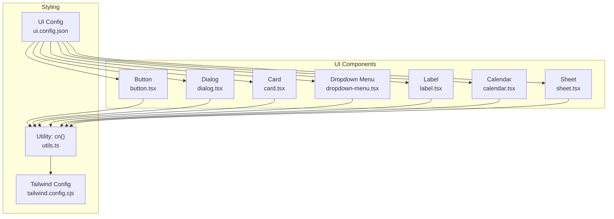
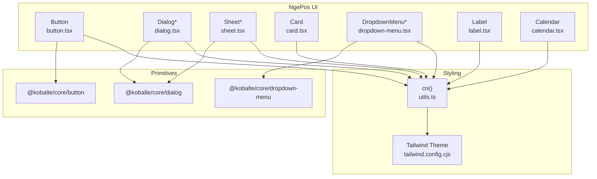
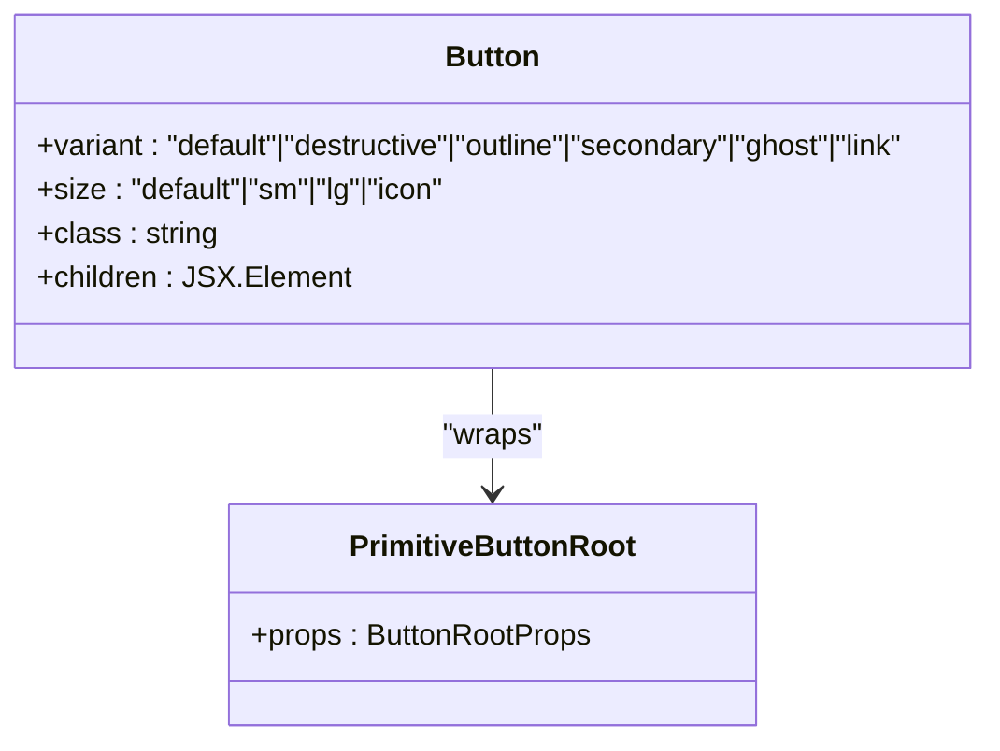
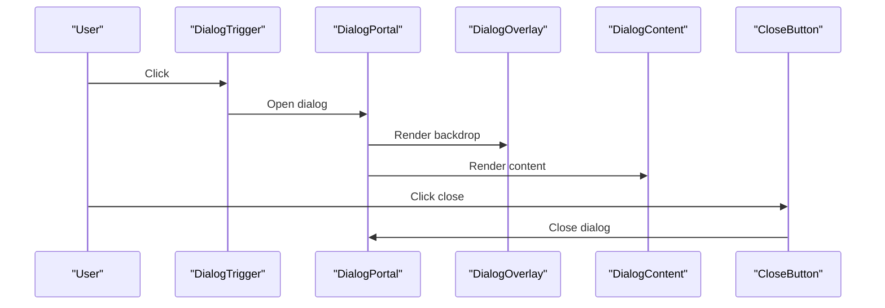
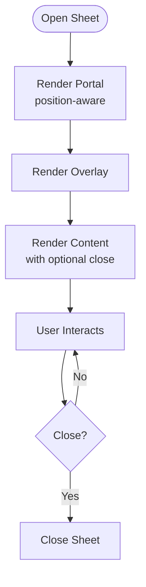
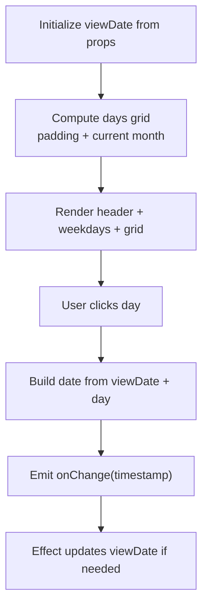
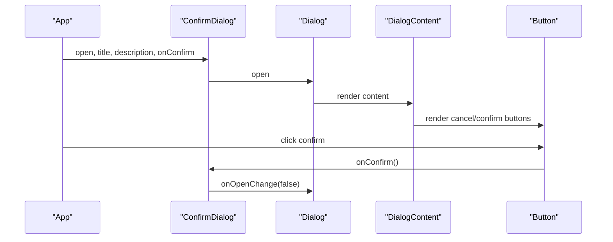
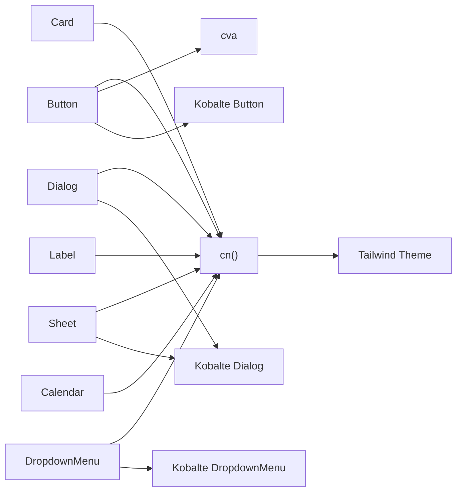

# Core Components

<cite>
**Referenced Files in This Document**
- [button.tsx](file://src/components/ui/button.tsx)
- [dialog.tsx](file://src/components/ui/dialog.tsx)
- [card.tsx](file://src/components/ui/card.tsx)
- [calendar.tsx](file://src/components/ui/calendar.tsx)
- [dropdown-menu.tsx](file://src/components/ui/dropdown-menu.tsx)
- [label.tsx](file://src/components/ui/label.tsx)
- [sheet.tsx](file://src/components/ui/sheet.tsx)
- [utils.ts](file://src/lib/utils.ts)
- [tailwind.config.cjs](file://tailwind.config.cjs)
- [ui.config.json](file://ui.config.json)
- [ConfirmDialog.tsx](file://src/components/ConfirmDialog.tsx)
- [VariantSelector.tsx](file://src/components/VariantSelector.tsx)
</cite>

## Table of Contents
1. [Introduction](#introduction)
2. [Project Structure](#project-structure)
3. [Core Components](#core-components)
4. [Architecture Overview](#architecture-overview)
5. [Detailed Component Analysis](#detailed-component-analysis)
6. [Dependency Analysis](#dependency-analysis)
7. [Performance Considerations](#performance-considerations)
8. [Troubleshooting Guide](#troubleshooting-guide)
9. [Conclusion](#conclusion)
10. [Appendices](#appendices)

## Introduction
This document describes the core UI components used in the NgePos POS system. It focuses on:
- Button component variants and sizes
- Dialog and Sheet modal systems with overlays and accessibility
- Card components for content organization
- Form elements including labels and dropdown menus
- Calendar component for date selection
- Props interfaces, event handling patterns, and customization options
- Styling guidelines with TailwindCSS integration
- Practical usage examples and best practices for composition
- Responsive design and cross-browser considerations

## Project Structure
The UI components are located under src/components/ui and are built with SolidJS and Kobalte primitives. Styling relies on TailwindCSS with a centralized theme configuration.

**Diagram sources**
- [button.tsx:1-54](file://src/components/ui/button.tsx#L1-L54)
- [dialog.tsx:1-142](file://src/components/ui/dialog.tsx#L1-L142)
- [card.tsx:1-44](file://src/components/ui/card.tsx#L1-L44)
- [dropdown-menu.tsx:1-36](file://src/components/ui/dropdown-menu.tsx#L1-L36)
- [label.tsx:1-20](file://src/components/ui/label.tsx#L1-L20)
- [calendar.tsx:1-183](file://src/components/ui/calendar.tsx#L1-L183)
- [sheet.tsx:1-175](file://src/components/ui/sheet.tsx#L1-L175)
- [utils.ts:1-7](file://src/lib/utils.ts#L1-L7)
- [tailwind.config.cjs:1-88](file://tailwind.config.cjs#L1-L88)
- [ui.config.json:1-13](file://ui.config.json#L1-L13)

**Section sources**
- [button.tsx:1-54](file://src/components/ui/button.tsx#L1-L54)
- [dialog.tsx:1-142](file://src/components/ui/dialog.tsx#L1-L142)
- [card.tsx:1-44](file://src/components/ui/card.tsx#L1-L44)
- [dropdown-menu.tsx:1-36](file://src/components/ui/dropdown-menu.tsx#L1-L36)
- [label.tsx:1-20](file://src/components/ui/label.tsx#L1-L20)
- [calendar.tsx:1-183](file://src/components/ui/calendar.tsx#L1-L183)
- [sheet.tsx:1-175](file://src/components/ui/sheet.tsx#L1-L175)
- [utils.ts:1-7](file://src/lib/utils.ts#L1-L7)
- [tailwind.config.cjs:1-88](file://tailwind.config.cjs#L1-L88)
- [ui.config.json:1-13](file://ui.config.json#L1-L13)

## Core Components
This section summarizes the primary UI components and their capabilities.

- Button
  - Variants: default, destructive, outline, secondary, ghost, link
  - Sizes: default, sm, lg, icon
  - Polymorphic root element support
  - Uses class variance authority (cva) and cn() merging
- Dialog
  - Modal overlay with backdrop and animations
  - Close button with accessibility label
  - Header, Footer, Title, Description helpers
- Sheet
  - Slide-in panel variants (top, bottom, left, right)
  - Overlay and content with animations
  - Optional close button
- Card
  - Card, CardHeader, CardTitle, CardDescription, CardContent, CardFooter
- Dropdown Menu
  - Trigger, Portal, Content, Item
- Label
  - Styled label for form controls
- Calendar
  - Month navigation, weekday headers, selectable dates
  - Range selection support (from/to), current selection, today indicator

**Section sources**
- [button.tsx:11-35](file://src/components/ui/button.tsx#L11-L35)
- [dialog.tsx:9-141](file://src/components/ui/dialog.tsx#L9-L141)
- [sheet.tsx:10-174](file://src/components/ui/sheet.tsx#L10-L174)
- [card.tsx:6-43](file://src/components/ui/card.tsx#L6-L43)
- [dropdown-menu.tsx:1-36](file://src/components/ui/dropdown-menu.tsx#L1-L36)
- [label.tsx:6-17](file://src/components/ui/label.tsx#L6-L17)
- [calendar.tsx:5-11](file://src/components/ui/calendar.tsx#L5-L11)

## Architecture Overview
The UI components are thin wrappers around Kobalte primitives, adding Tailwind-based styling and optional animations. They rely on a shared cn() utility to merge and deduplicate classes.

**Diagram sources**
- [button.tsx:4-49](file://src/components/ui/button.tsx#L4-L49)
- [dialog.tsx:9-80](file://src/components/ui/dialog.tsx#L9-L80)
- [sheet.tsx:10-114](file://src/components/ui/sheet.tsx#L10-L114)
- [dropdown-menu.tsx:1-35](file://src/components/ui/dropdown-menu.tsx#L1-L35)
- [utils.ts:4-6](file://src/lib/utils.ts#L4-L6)
- [tailwind.config.cjs:15-50](file://tailwind.config.cjs#L15-L50)

## Detailed Component Analysis

### Button
- Purpose: Unified button primitive with variant and size control.
- Props
  - variant: default | destructive | outline | secondary | ghost | link
  - size: default | sm | lg | icon
  - polymorphic: accepts any valid DOM tag
  - class: optional override
- Implementation highlights
  - Uses cva for variant/size styles
  - Splits props to separate local variant/size/class from forwarded attributes
  - Applies cn() to merge with user-provided classes
- Accessibility and UX
  - Inherits focus ring and disabled state from primitives
  - Supports SVG icons inside button
- Styling and customization
  - Tailwind utilities applied via cn()
  - Extendable by passing additional class names
- Usage examples
  - Variant and size combinations for primary actions, destructive actions, and subtle links
  - Icon buttons using size "icon"

**Diagram sources**
- [button.tsx:37-50](file://src/components/ui/button.tsx#L37-L50)

**Section sources**
- [button.tsx:11-35](file://src/components/ui/button.tsx#L11-L35)
- [button.tsx:37-50](file://src/components/ui/button.tsx#L37-L50)

### Dialog
- Purpose: Modal dialog with overlay, portal, and close button.
- Features
  - Portal centers content responsively (sm breakpoint)
  - Animated overlay and content
  - Close button with aria-label
  - Helper components: Header, Footer, Title, Description
- Props
  - DialogContent: class, children
  - DialogOverlay: class
  - DialogTitle/Description: class
- Accessibility
  - Uses Kobalte primitives for ARIA roles and keyboard handling
  - Focus trapping and escape-to-close behavior inherited from primitives
- Styling
  - Responsive centering and animations via Tailwind
  - Optional class overrides for layout and appearance

**Diagram sources**
- [dialog.tsx:9-81](file://src/components/ui/dialog.tsx#L9-L81)

**Section sources**
- [dialog.tsx:12-21](file://src/components/ui/dialog.tsx#L12-L21)
- [dialog.tsx:26-39](file://src/components/ui/dialog.tsx#L26-L39)
- [dialog.tsx:47-81](file://src/components/ui/dialog.tsx#L47-L81)
- [dialog.tsx:83-98](file://src/components/ui/dialog.tsx#L83-L98)
- [dialog.tsx:104-131](file://src/components/ui/dialog.tsx#L104-L131)

### Sheet
- Purpose: Slide-in panel (drawer) for contextual content or forms.
- Variants
  - position: top | bottom | left | right
- Features
  - Portal with directional alignment
  - Overlay with backdrop
  - Content with animations and optional close button
  - Header/Footer/Title/Description helpers
- Props
  - SheetContent: position, class, children, hideClose
  - Other helpers mirror Dialog helpers
- Accessibility
  - Inherits focus management from primitives
- Styling
  - Directional slide animations and responsive width for sides

**Diagram sources**
- [sheet.tsx:28-114](file://src/components/ui/sheet.tsx#L28-L114)

**Section sources**
- [sheet.tsx:14-24](file://src/components/ui/sheet.tsx#L14-L24)
- [sheet.tsx:28-54](file://src/components/ui/sheet.tsx#L28-L54)
- [sheet.tsx:78-115](file://src/components/ui/sheet.tsx#L78-L115)
- [sheet.tsx:117-163](file://src/components/ui/sheet.tsx#L117-L163)

### Card
- Purpose: Organize content with consistent spacing and typography.
- Components
  - Card, CardHeader, CardTitle, CardDescription, CardContent, CardFooter
- Styling
  - Standardized border, background, and shadow tokens
  - Flexible class overrides

**Section sources**
- [card.tsx:6-43](file://src/components/ui/card.tsx#L6-L43)

### Dropdown Menu
- Purpose: Context menu with trigger, portal, content, and items.
- Components
  - DropdownMenu, DropdownMenuTrigger, DropdownMenuPortal
  - DropdownMenuContent, DropdownMenuItem
- Styling
  - Animations and positioning via portal and Tailwind classes

**Section sources**
- [dropdown-menu.tsx:5-35](file://src/components/ui/dropdown-menu.tsx#L5-L35)

### Label
- Purpose: Label for form controls with disabled state styling.
- Props
  - class: optional override
- Behavior
  - Inherits disabled cursor/opacity styles

**Section sources**
- [label.tsx:6-17](file://src/components/ui/label.tsx#L6-L17)

### Calendar
- Purpose: Date picker with month navigation and range selection.
- Props
  - value?: timestamp (currently selected)
  - from?: timestamp (range start)
  - to?: timestamp (range end)
  - onChange: (timestamp) => void
  - class?: string
- Behavior
  - Computes days grid with padding for start-of-month
  - Highlights today, selected date, range start/end, and middle dates
  - Navigation via previous/next month buttons
- Accessibility
  - Interactive buttons with clear semantics
- Styling
  - Responsive grid and hover/active states

**Diagram sources**
- [calendar.tsx:13-96](file://src/components/ui/calendar.tsx#L13-L96)

**Section sources**
- [calendar.tsx:5-11](file://src/components/ui/calendar.tsx#L5-L11)
- [calendar.tsx:13-96](file://src/components/ui/calendar.tsx#L13-L96)
- [calendar.tsx:98-182](file://src/components/ui/calendar.tsx#L98-L182)

### Practical Usage Examples and Composition Patterns
- ConfirmDialog composes Dialog and Button to present a themed confirmation prompt with optional loading state and action buttons.
- VariantSelector composes Sheet, Button, and form-like interactions to manage product variants and pricing.

**Diagram sources**
- [ConfirmDialog.tsx:31-113](file://src/components/ConfirmDialog.tsx#L31-L113)

**Section sources**
- [ConfirmDialog.tsx:16-27](file://src/components/ConfirmDialog.tsx#L16-L27)
- [ConfirmDialog.tsx:31-113](file://src/components/ConfirmDialog.tsx#L31-L113)
- [VariantSelector.tsx:16-204](file://src/components/VariantSelector.tsx#L16-L204)

## Dependency Analysis
- Internal dependencies
  - All UI components depend on cn() for class merging
  - Dialog and Sheet share similar portal/overlay/content patterns
- External dependencies
  - @kobalte/core primitives for accessible base behavior
  - class-variance-authority for variant sizing
  - lucide-solid for icons
- Tailwind integration
  - Tailwind theme defines color scales and utilities consumed by components
  - UI config maps aliases for components and utilities

**Diagram sources**
- [button.tsx:4-49](file://src/components/ui/button.tsx#L4-L49)
- [dialog.tsx:4-80](file://src/components/ui/dialog.tsx#L4-L80)
- [sheet.tsx:4-114](file://src/components/ui/sheet.tsx#L4-L114)
- [dropdown-menu.tsx:1-35](file://src/components/ui/dropdown-menu.tsx#L1-L35)
- [utils.ts:4-6](file://src/lib/utils.ts#L4-L6)
- [tailwind.config.cjs:15-50](file://tailwind.config.cjs#L15-L50)

**Section sources**
- [button.tsx:1-10](file://src/components/ui/button.tsx#L1-L10)
- [dialog.tsx:1-8](file://src/components/ui/dialog.tsx#L1-L8)
- [sheet.tsx:1-8](file://src/components/ui/sheet.tsx#L1-L8)
- [dropdown-menu.tsx:1-3](file://src/components/ui/dropdown-menu.tsx#L1-L3)
- [utils.ts:1-7](file://src/lib/utils.ts#L1-L7)
- [tailwind.config.cjs:1-88](file://tailwind.config.cjs#L1-L88)
- [ui.config.json:1-13](file://ui.config.json#L1-L13)

## Performance Considerations
- Prefer memoization for derived values (e.g., computed days in Calendar)
- Use minimal re-renders by forwarding only necessary props and splitting local vs. forwarded props
- Keep animations lightweight; avoid heavy transforms on large DOM subtrees
- Defer effect updates when appropriate to prevent layout thrashing

## Troubleshooting Guide
- Dialog does not close on overlay click
  - Ensure the overlay and content are rendered within the same portal
  - Verify the DialogTrigger and DialogContent are composed correctly
- Sheet content not visible
  - Confirm the position prop matches the intended direction
  - Check that the portal wrapper aligns items/justify correctly
- Button styles not applying
  - Verify variant and size values are valid
  - Ensure additional class names do not unintentionally override styles
- Calendar selection not updating
  - Confirm value/from/to props are passed and onChange is wired
  - Check that the viewDate effect updates when props change

**Section sources**
- [dialog.tsx:12-21](file://src/components/ui/dialog.tsx#L12-L21)
- [sheet.tsx:28-54](file://src/components/ui/sheet.tsx#L28-L54)
- [button.tsx:37-50](file://src/components/ui/button.tsx#L37-L50)
- [calendar.tsx:13-24](file://src/components/ui/calendar.tsx#L13-L24)

## Conclusion
NgePos’s UI components provide a cohesive, accessible, and extensible foundation for building POS interfaces. By leveraging Kobalte primitives, cva, and Tailwind, the system balances flexibility with consistency. The included examples demonstrate effective composition patterns for dialogs, sheets, and interactive forms.

## Appendices

### Props Reference Summary
- Button
  - variant: default | destructive | outline | secondary | ghost | link
  - size: default | sm | lg | icon
  - polymorphic root supported
- Dialog
  - DialogContent: class, children
  - DialogOverlay: class
  - DialogHeader/Footer: class
  - DialogTitle/Description: class
- Sheet
  - SheetContent: position, class, children, hideClose
  - Others mirror Dialog helpers
- Card
  - Card/CardHeader/CardTitle/CardDescription/CardContent/CardFooter: class
- DropdownMenu
  - DropdownMenuContent/Item: class
- Label
  - class
- Calendar
  - value?, from?, to?, onChange, class?

**Section sources**
- [button.tsx:37-38](file://src/components/ui/button.tsx#L37-L38)
- [dialog.tsx:41-45](file://src/components/ui/dialog.tsx#L41-L45)
- [dialog.tsx:23-24](file://src/components/ui/dialog.tsx#L23-L24)
- [dialog.tsx:83-98](file://src/components/ui/dialog.tsx#L83-L98)
- [dialog.tsx:100-131](file://src/components/ui/dialog.tsx#L100-L131)
- [sheet.tsx:75-76](file://src/components/ui/sheet.tsx#L75-L76)
- [card.tsx:6-43](file://src/components/ui/card.tsx#L6-L43)
- [dropdown-menu.tsx:24-35](file://src/components/ui/dropdown-menu.tsx#L24-L35)
- [label.tsx:6-17](file://src/components/ui/label.tsx#L6-L17)
- [calendar.tsx:5-11](file://src/components/ui/calendar.tsx#L5-L11)

### Styling Guidelines with TailwindCSS
- Use semantic color tokens from the theme (primary, secondary, destructive, muted, etc.)
- Apply spacing with consistent units (e.g., multiples of 4 for paddings/margins)
- Prefer component-specific utilities; avoid global resets
- Maintain responsive breakpoints (e.g., sm) for mobile-first layouts
- Merge classes with cn() to avoid specificity conflicts

**Section sources**
- [utils.ts:4-6](file://src/lib/utils.ts#L4-L6)
- [tailwind.config.cjs:15-50](file://tailwind.config.cjs#L15-L50)
- [ui.config.json:4-12](file://ui.config.json#L4-L12)

### Best Practices for Component Composition
- Compose higher-order components (e.g., ConfirmDialog, VariantSelector) to encapsulate state and behavior
- Use helpers (Header/Footer/Title/Description) to keep markup consistent
- Pass class overrides minimally and intentionally
- Ensure focus order and keyboard navigation remain intact when wrapping primitives

**Section sources**
- [ConfirmDialog.tsx:31-113](file://src/components/ConfirmDialog.tsx#L31-L113)
- [VariantSelector.tsx:16-204](file://src/components/VariantSelector.tsx#L16-L204)
- [dialog.tsx:83-131](file://src/components/ui/dialog.tsx#L83-L131)
- [sheet.tsx:117-163](file://src/components/ui/sheet.tsx#L117-L163)