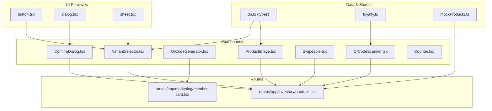
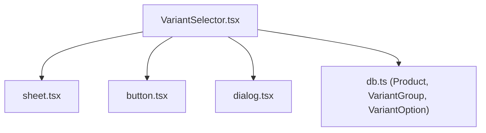
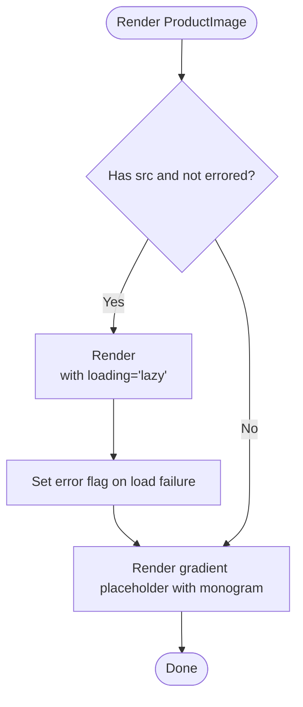
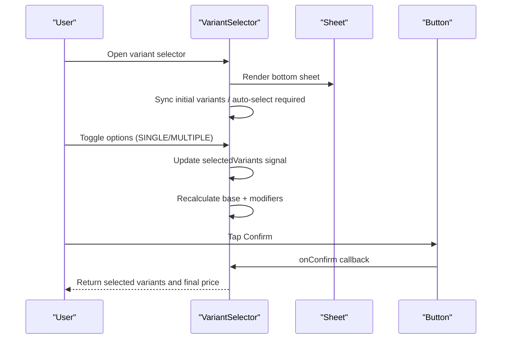
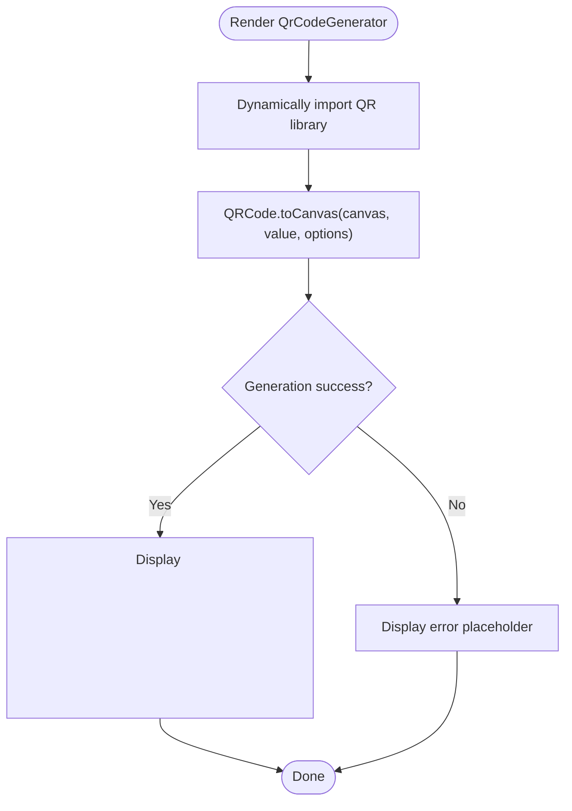
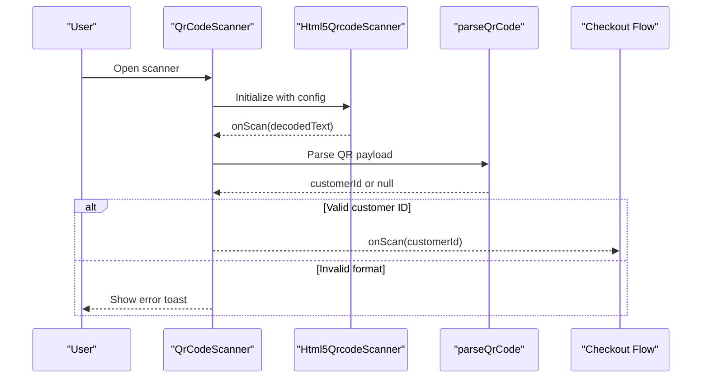
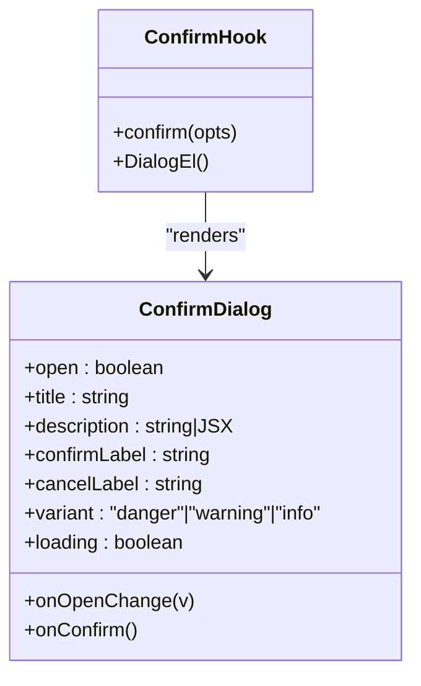
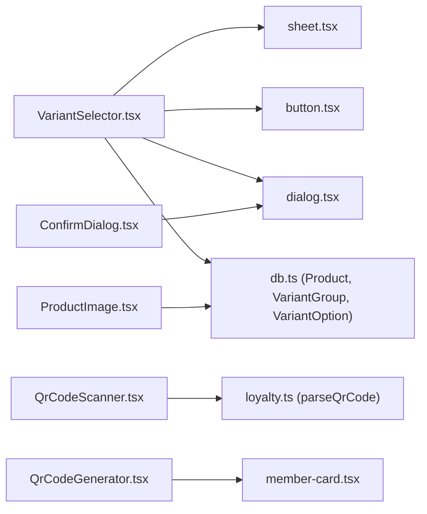

# POS-Specific Components

<cite>
**Referenced Files in This Document**
- [ProductImage.tsx](file://src/components/ProductImage.tsx)
- [VariantSelector.tsx](file://src/components/VariantSelector.tsx)
- [QrCodeGenerator.tsx](file://src/components/QrCodeGenerator.tsx)
- [QrCodeScanner.tsx](file://src/components/QrCodeScanner.tsx)
- [Counter.tsx](file://src/components/Counter.tsx)
- [Swipeable.tsx](file://src/components/Swipeable.tsx)
- [ConfirmDialog.tsx](file://src/components/ConfirmDialog.tsx)
- [button.tsx](file://src/components/ui/button.tsx)
- [dialog.tsx](file://src/components/ui/dialog.tsx)
- [sheet.tsx](file://src/components/ui/sheet.tsx)
- [mockProducts.ts](file://src/data/mockProducts.ts)
- [db.ts](file://src/db/db.ts)
- [loyalty.ts](file://src/stores/loyalty.ts)
- [products.tsx](file://src/routes/app/inventory/products.tsx)
- [member-card.tsx](file://src/routes/app/marketing/member-card.tsx)
</cite>

## Table of Contents
1. [Introduction](#introduction)
2. [Project Structure](#project-structure)
3. [Core Components](#core-components)
4. [Architecture Overview](#architecture-overview)
5. [Detailed Component Analysis](#detailed-component-analysis)
6. [Dependency Analysis](#dependency-analysis)
7. [Performance Considerations](#performance-considerations)
8. [Troubleshooting Guide](#troubleshooting-guide)
9. [Conclusion](#conclusion)
10. [Appendices](#appendices)

## Introduction
This document provides detailed, implementation-focused documentation for POS-specific UI components designed for retail operations. It covers:
- ProductImage for product media display with fallback handling and lazy loading
- VariantSelector for product customization including size, flavor, and add-ons with real-time price updates
- QrCodeGenerator for customer engagement and member card creation
- QrCodeScanner for barcode and QR code processing during checkout
- Counter for quantity adjustment with increment/decrement controls
- Swipeable for mobile-friendly horizontal navigation and gesture handling
- ConfirmDialog for critical user confirmations

It includes integration patterns with POS workflows, mobile-optimized usage guidelines, and diagrams to illustrate component interactions.

## Project Structure
The POS UI components are located under src/components and integrate with shared UI primitives, data models, and routes.

**Diagram sources**
- [ProductImage.tsx:1-60](file://src/components/ProductImage.tsx#L1-L60)
- [VariantSelector.tsx:1-205](file://src/components/VariantSelector.tsx#L1-L205)
- [QrCodeGenerator.tsx:1-222](file://src/components/QrCodeGenerator.tsx#L1-L222)
- [QrCodeScanner.tsx:1-157](file://src/components/QrCodeScanner.tsx#L1-L157)
- [Swipeable.tsx:1-88](file://src/components/Swipeable.tsx#L1-L88)
- [ConfirmDialog.tsx:1-155](file://src/components/ConfirmDialog.tsx#L1-L155)
- [button.tsx:1-54](file://src/components/ui/button.tsx#L1-L54)
- [dialog.tsx:1-142](file://src/components/ui/dialog.tsx#L1-L142)
- [sheet.tsx:1-175](file://src/components/ui/sheet.tsx#L1-L175)
- [db.ts:36-110](file://src/db/db.ts#L36-L110)
- [loyalty.ts:1-174](file://src/stores/loyalty.ts#L1-L174)
- [mockProducts.ts:1-85](file://src/data/mockProducts.ts#L1-L85)
- [products.tsx:1-800](file://src/routes/app/inventory/products.tsx#L1-L800)
- [member-card.tsx:1-283](file://src/routes/app/marketing/member-card.tsx#L1-L283)

**Section sources**
- [ProductImage.tsx:1-60](file://src/components/ProductImage.tsx#L1-L60)
- [VariantSelector.tsx:1-205](file://src/components/VariantSelector.tsx#L1-L205)
- [QrCodeGenerator.tsx:1-222](file://src/components/QrCodeGenerator.tsx#L1-L222)
- [QrCodeScanner.tsx:1-157](file://src/components/QrCodeScanner.tsx#L1-L157)
- [ConfirmDialog.tsx:1-155](file://src/components/ConfirmDialog.tsx#L1-L155)
- [Swipeable.tsx:1-88](file://src/components/Swipeable.tsx#L1-L88)
- [Counter.tsx:1-14](file://src/components/Counter.tsx#L1-L14)
- [button.tsx:1-54](file://src/components/ui/button.tsx#L1-L54)
- [dialog.tsx:1-142](file://src/components/ui/dialog.tsx#L1-L142)
- [sheet.tsx:1-175](file://src/components/ui/sheet.tsx#L1-L175)
- [db.ts:36-110](file://src/db/db.ts#L36-L110)
- [loyalty.ts:1-174](file://src/stores/loyalty.ts#L1-L174)
- [mockProducts.ts:1-85](file://src/data/mockProducts.ts#L1-L85)
- [products.tsx:1-800](file://src/routes/app/inventory/products.tsx#L1-L800)
- [member-card.tsx:1-283](file://src/routes/app/marketing/member-card.tsx#L1-L283)

## Core Components
This section summarizes each component’s purpose, key behaviors, and integration points.

- ProductImage
  - Purpose: Render product images with graceful fallback to a monogram placeholder and decorative background when no image is available.
  - Key behaviors: Lazy loading via native loading="lazy", error fallback via onError, initials derived from product name.
  - Integration: Used in product listings and detail views.

- VariantSelector
  - Purpose: Allow users to configure product variants (size, flavor, add-ons) with real-time price calculation and validation.
  - Key behaviors: Single/multiple selection modes, required group enforcement, auto-default selection for required SINGLE groups, live total price update.
  - Integration: Sheets-based bottom drawer UI with confirmation action.

- QrCodeGenerator
  - Purpose: Generate QR codes client-side and support batch printing layouts for member cards.
  - Key behaviors: Canvas-based generation with error handling, print-ready grid layouts (portrait/horizontal), theming support.
  - Integration: Member card settings and print previews.

- QrCodeScanner
  - Purpose: Capture and parse QR codes from device camera for customer identification during checkout.
  - Key behaviors: Html5-Qrcode scanner setup, viewfinder overlay, parsing of QR payload to extract customer ID.
  - Integration: Modal scanner UI invoked during checkout flows.

- Counter
  - Purpose: Provide a simple numeric counter with increment control.
  - Key behaviors: Local signal-based state, straightforward click handler.
  - Integration: Can be embedded in product selection or cart contexts.

- Swipeable
  - Purpose: Enable swipe-to-reveal actions (e.g., delete) with smooth animations and threshold-based snapping.
  - Key behaviors: Pointer event handling, translateX transform, opacity-based reveal of action background.
  - Integration: List rows or cart items for quick destructive actions.

- ConfirmDialog
  - Purpose: Present critical confirmations with variant styling (danger, warning, info) and optional loading state.
  - Key behaviors: Imperative createConfirmDialog hook for global confirmation UX.
  - Integration: Centralized confirmation dialogs across POS screens.

**Section sources**
- [ProductImage.tsx:1-60](file://src/components/ProductImage.tsx#L1-L60)
- [VariantSelector.tsx:1-205](file://src/components/VariantSelector.tsx#L1-L205)
- [QrCodeGenerator.tsx:1-222](file://src/components/QrCodeGenerator.tsx#L1-L222)
- [QrCodeScanner.tsx:1-157](file://src/components/QrCodeScanner.tsx#L1-L157)
- [Counter.tsx:1-14](file://src/components/Counter.tsx#L1-L14)
- [Swipeable.tsx:1-88](file://src/components/Swipeable.tsx#L1-L88)
- [ConfirmDialog.tsx:1-155](file://src/components/ConfirmDialog.tsx#L1-L155)

## Architecture Overview
The POS UI components rely on SolidJS primitives and reusable UI primitives. VariantSelector composes Sheet and Button; ConfirmDialog composes Dialog. Data types for products and variants are defined centrally and consumed by components.

**Diagram sources**
- [VariantSelector.tsx:1-205](file://src/components/VariantSelector.tsx#L1-L205)
- [sheet.tsx:1-175](file://src/components/ui/sheet.tsx#L1-L175)
- [button.tsx:1-54](file://src/components/ui/button.tsx#L1-L54)
- [dialog.tsx:1-142](file://src/components/ui/dialog.tsx#L1-L142)
- [db.ts:62-73](file://src/db/db.ts#L62-L73)

**Section sources**
- [VariantSelector.tsx:1-205](file://src/components/VariantSelector.tsx#L1-L205)
- [sheet.tsx:1-175](file://src/components/ui/sheet.tsx#L1-L175)
- [button.tsx:1-54](file://src/components/ui/button.tsx#L1-L54)
- [dialog.tsx:1-142](file://src/components/ui/dialog.tsx#L1-L142)
- [db.ts:62-73](file://src/db/db.ts#L62-L73)

## Detailed Component Analysis

### ProductImage
- Purpose: Display product media with robust fallback and lazy loading.
- Implementation highlights:
  - Uses a Show branch to conditionally render either the image or a gradient placeholder with decorative icons and a monogram derived from the product name.
  - Applies native lazy loading and sets an error flag to trigger fallback rendering.
  - Accepts a class prop to customize sizing and layout.
- Mobile-optimized usage:
  - Works well in grid/list layouts; ensure aspect ratio and overflow are controlled via parent containers.
- Integration pattern:
  - Rendered within product cards and lists; paired with product metadata to improve perceived performance.

**Diagram sources**
- [ProductImage.tsx:10-58](file://src/components/ProductImage.tsx#L10-L58)

**Section sources**
- [ProductImage.tsx:1-60](file://src/components/ProductImage.tsx#L1-L60)

### VariantSelector
- Purpose: Configure product variants and compute real-time price.
- Implementation highlights:
  - Maintains selected variants in a signal and syncs initial selections when the dialog opens.
  - Supports SINGLE and MULTIPLE selection modes with required group enforcement and maximum selectable limits.
  - Computes effective base price and modifier-based totals; validates required groups before confirming.
  - Uses Sheet for bottom drawer presentation and Button for confirmation.
- POS workflow integration:
  - Invoked from product listing/detail to add items with chosen variants.
  - Integrates with cart/store logic to attach selected variants and price modifiers to cart items.

**Diagram sources**
- [VariantSelector.tsx:16-204](file://src/components/VariantSelector.tsx#L16-L204)
- [sheet.tsx:78-114](file://src/components/ui/sheet.tsx#L78-L114)
- [button.tsx:40-50](file://src/components/ui/button.tsx#L40-L50)
- [db.ts:36-73](file://src/db/db.ts#L36-L73)

**Section sources**
- [VariantSelector.tsx:1-205](file://src/components/VariantSelector.tsx#L1-L205)
- [db.ts:36-73](file://src/db/db.ts#L36-L73)

### QrCodeGenerator
- Purpose: Generate QR codes and support print layouts for member cards.
- Implementation highlights:
  - Dynamically imports the QR library and renders to a canvas with configurable size and colors.
  - Provides a print grid layout with portrait/horizontal orientations, theming (light/dark/gradient/lines/custom), and optional stamp grids.
  - Includes error handling and a plain mode for embedding within other designs.
- POS workflow integration:
  - Used in member card settings to preview and print QR-enabled loyalty cards.
  - Generates QR payloads for member profiles and supports custom branding.

**Diagram sources**
- [QrCodeGenerator.tsx:16-33](file://src/components/QrCodeGenerator.tsx#L16-L33)

**Section sources**
- [QrCodeGenerator.tsx:1-222](file://src/components/QrCodeGenerator.tsx#L1-L222)
- [member-card.tsx:1-283](file://src/routes/app/marketing/member-card.tsx#L1-L283)

### QrCodeScanner
- Purpose: Scan customer QR codes via device camera for checkout.
- Implementation highlights:
  - Initializes Html5QrcodeScanner with a square viewport and QR_CODE format.
  - Parses scanned text to extract customer ID using a dedicated parser.
  - Provides a modal scanner UI with animated scanning overlay and instructions.
- POS workflow integration:
  - Invoked during checkout to quickly identify members and apply benefits.

**Diagram sources**
- [QrCodeScanner.tsx:17-65](file://src/components/QrCodeScanner.tsx#L17-L65)
- [loyalty.ts:17-23](file://src/stores/loyalty.ts#L17-L23)

**Section sources**
- [QrCodeScanner.tsx:1-157](file://src/components/QrCodeScanner.tsx#L1-L157)
- [loyalty.ts:1-174](file://src/stores/loyalty.ts#L1-L174)

### Counter
- Purpose: Increment a numeric counter.
- Implementation highlights:
  - Minimal component using a local signal and a click handler.
- POS workflow integration:
  - Useful for adjusting quantities in product selection or cart editing contexts.

**Section sources**
- [Counter.tsx:1-14](file://src/components/Counter.tsx#L1-L14)

### Swipeable
- Purpose: Provide swipe-to-reveal actions with threshold-based snapping.
- Implementation highlights:
  - Tracks pointer events, computes translateX within a constrained range, and reveals an action background with opacity proportional to drag distance.
  - Disables interaction when disabled prop is true.
- POS workflow integration:
  - Ideal for list rows to expose destructive actions (e.g., remove from cart).

**Section sources**
- [Swipeable.tsx:1-88](file://src/components/Swipeable.tsx#L1-L88)

### ConfirmDialog
- Purpose: Present critical confirmations with variant styling and optional loading state.
- Implementation highlights:
  - Composes Dialog primitives with iconography and action buttons.
  - Provides an imperative createConfirmDialog hook to manage global confirmation dialogs.
- POS workflow integration:
  - Used across inventory and checkout flows for destructive actions and warnings.

**Diagram sources**
- [ConfirmDialog.tsx:31-112](file://src/components/ConfirmDialog.tsx#L31-L112)
- [ConfirmDialog.tsx:132-154](file://src/components/ConfirmDialog.tsx#L132-L154)

**Section sources**
- [ConfirmDialog.tsx:1-155](file://src/components/ConfirmDialog.tsx#L1-L155)

## Dependency Analysis
- Component-level dependencies:
  - VariantSelector depends on Sheet, Button, and Dialog primitives; consumes Product and Variant types from db.ts.
  - ProductImage depends on SolidJS Show and Lucide icons; integrates with product metadata.
  - QrCodeGenerator depends on dynamic import of the QR library and Tailwind classes for layout.
  - QrCodeScanner depends on Html5Qrcode and the loyalty store’s QR parsing utilities.
  - ConfirmDialog composes Dialog primitives and exposes an imperative hook.
- Data model dependencies:
  - Product, VariantGroup, and VariantOption types define the shape of variant configurations used by VariantSelector and UI integrations.

**Diagram sources**
- [VariantSelector.tsx:1-205](file://src/components/VariantSelector.tsx#L1-L205)
- [sheet.tsx:1-175](file://src/components/ui/sheet.tsx#L1-L175)
- [button.tsx:1-54](file://src/components/ui/button.tsx#L1-L54)
- [dialog.tsx:1-142](file://src/components/ui/dialog.tsx#L1-L142)
- [db.ts:62-73](file://src/db/db.ts#L62-L73)
- [ProductImage.tsx:1-60](file://src/components/ProductImage.tsx#L1-L60)
- [QrCodeScanner.tsx:1-157](file://src/components/QrCodeScanner.tsx#L1-L157)
- [loyalty.ts:1-174](file://src/stores/loyalty.ts#L1-L174)
- [QrCodeGenerator.tsx:1-222](file://src/components/QrCodeGenerator.tsx#L1-L222)
- [member-card.tsx:1-283](file://src/routes/app/marketing/member-card.tsx#L1-L283)
- [ConfirmDialog.tsx:1-155](file://src/components/ConfirmDialog.tsx#L1-L155)

**Section sources**
- [VariantSelector.tsx:1-205](file://src/components/VariantSelector.tsx#L1-L205)
- [ProductImage.tsx:1-60](file://src/components/ProductImage.tsx#L1-L60)
- [QrCodeScanner.tsx:1-157](file://src/components/QrCodeScanner.tsx#L1-L157)
- [QrCodeGenerator.tsx:1-222](file://src/components/QrCodeGenerator.tsx#L1-L222)
- [ConfirmDialog.tsx:1-155](file://src/components/ConfirmDialog.tsx#L1-L155)
- [db.ts:62-73](file://src/db/db.ts#L62-L73)
- [loyalty.ts:1-174](file://src/stores/loyalty.ts#L1-L174)
- [member-card.tsx:1-283](file://src/routes/app/marketing/member-card.tsx#L1-L283)

## Performance Considerations
- ProductImage
  - Native lazy loading reduces initial bundle size and improves perceived performance.
  - Fallback rendering avoids blank spaces and maintains visual consistency.
- VariantSelector
  - Memoization of derived values (effective base price, current modifiers) prevents unnecessary recalculations.
  - Sheet-based bottom drawer minimizes layout thrashing compared to full-page modals.
- QrCodeGenerator
  - Dynamic import defers heavy QR library loading until needed.
  - Print grid uses CSS grid and media queries to optimize for print media.
- QrCodeScanner
  - Initialization is deferred slightly to ensure DOM readiness; scanning errors are suppressed to reduce noise.
- Swipeable
  - Uses CSS transforms for smooth animations; thresholds constrain expensive calculations.

[No sources needed since this section provides general guidance]

## Troubleshooting Guide
- ProductImage
  - If placeholders do not appear, verify that src is empty or undefined and that error handling is not overridden externally.
- VariantSelector
  - If required groups are not enforced, ensure isRequired flags are set on variant groups and initial variants align with group names.
  - If price does not update, confirm that priceModifier is present on options and that base price derivation logic is consistent with stored values.
- QrCodeGenerator
  - If QR generation fails, check browser compatibility and network access for the dynamic import; inspect error state rendering.
  - For print layouts, verify orientation and theme classes are applied correctly.
- QrCodeScanner
  - If camera fails to initialize, ensure permissions are granted and the device supports getUserMedia; check error toast messages.
  - If QR payload is not recognized, validate the parsing logic and expected QR format.
- ConfirmDialog
  - If confirm actions do not fire, ensure onConfirm is passed and not awaited synchronously; verify loading state transitions.

**Section sources**
- [ProductImage.tsx:10-58](file://src/components/ProductImage.tsx#L10-L58)
- [VariantSelector.tsx:99-118](file://src/components/VariantSelector.tsx#L99-L118)
- [QrCodeGenerator.tsx:16-33](file://src/components/QrCodeGenerator.tsx#L16-L33)
- [QrCodeScanner.tsx:22-58](file://src/components/QrCodeScanner.tsx#L22-L58)
- [ConfirmDialog.tsx:94-98](file://src/components/ConfirmDialog.tsx#L94-L98)

## Conclusion
These POS-specific components are designed for reliability, performance, and mobile-first usability. They integrate cleanly with SolidJS and shared UI primitives, while leveraging centralized data models and store utilities. Their modular architecture enables seamless integration into POS workflows such as product configuration, checkout, and member engagement.

[No sources needed since this section summarizes without analyzing specific files]

## Appendices

### Integration Patterns with POS Workflows
- Product catalog and variants
  - VariantSelector is opened from product listing/detail to configure options and compute price before adding to cart.
  - ProductImage is used in grid/list views to maintain visual consistency and performance.
- Checkout and member engagement
  - QrCodeScanner is invoked to identify members and apply benefits; QrCodeGenerator supports member card creation and printing.
- Safety and UX
  - ConfirmDialog centralizes critical confirmations across inventory and checkout flows to prevent accidental destructive actions.

**Section sources**
- [products.tsx:723-800](file://src/routes/app/inventory/products.tsx#L723-L800)
- [member-card.tsx:1-283](file://src/routes/app/marketing/member-card.tsx#L1-L283)
- [QrCodeScanner.tsx:17-65](file://src/components/QrCodeScanner.tsx#L17-L65)
- [ConfirmDialog.tsx:132-154](file://src/components/ConfirmDialog.tsx#L132-L154)