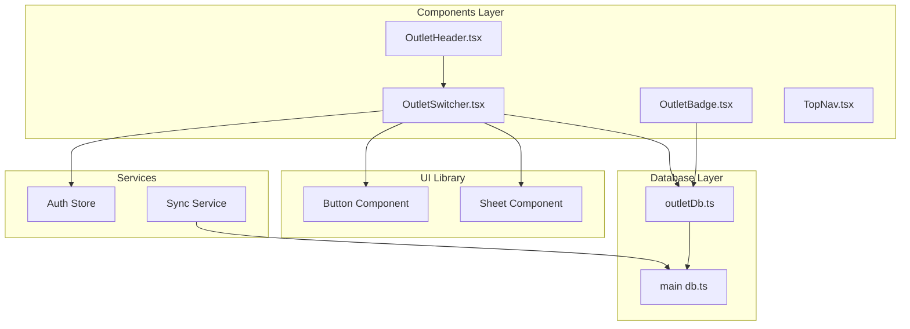
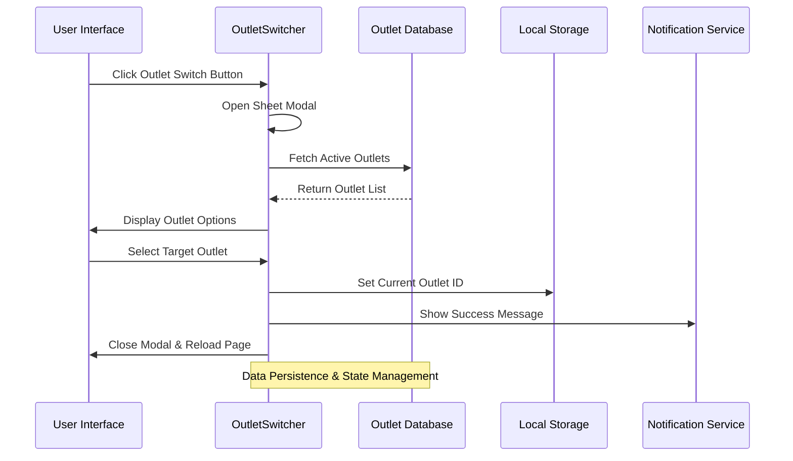
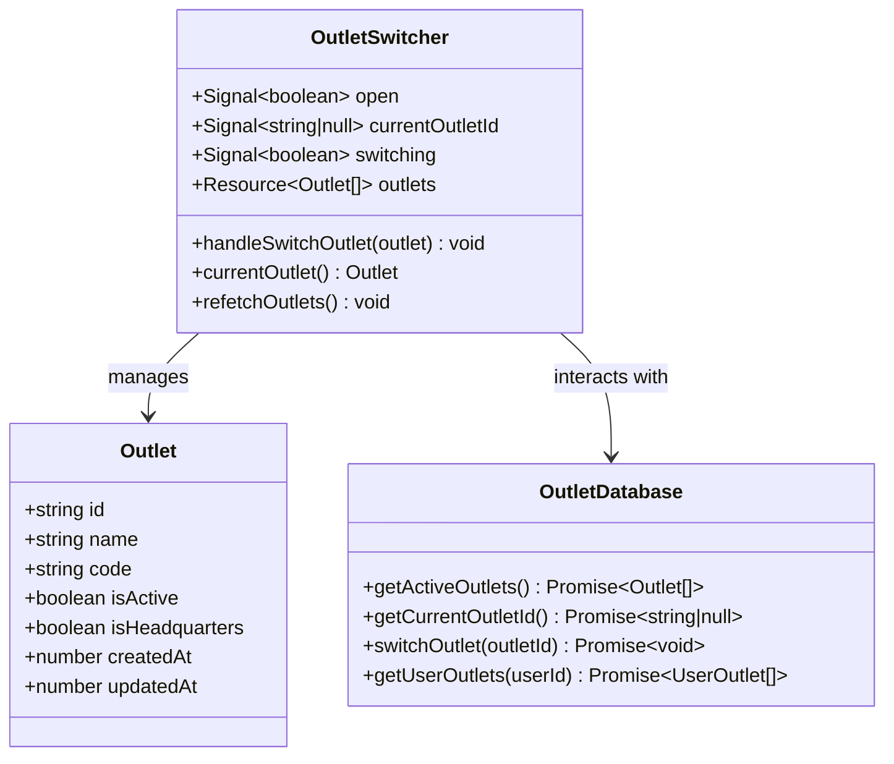
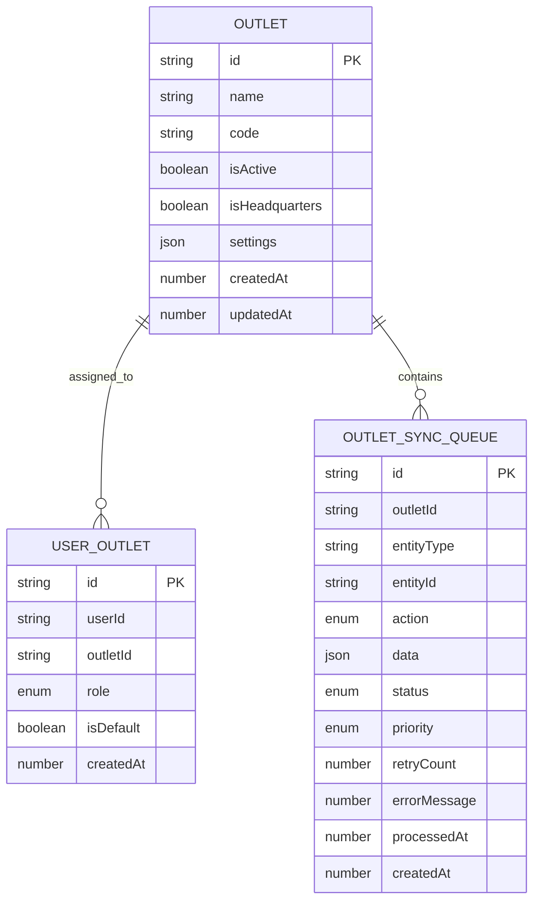
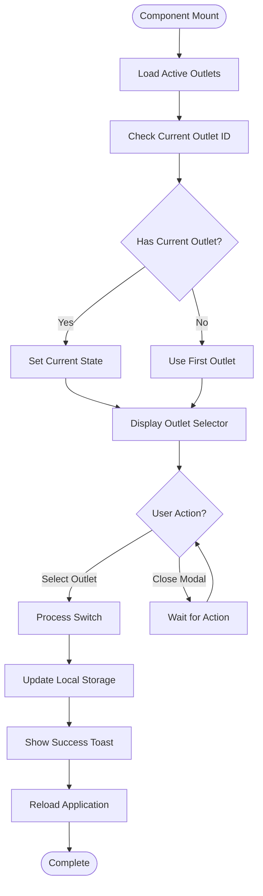
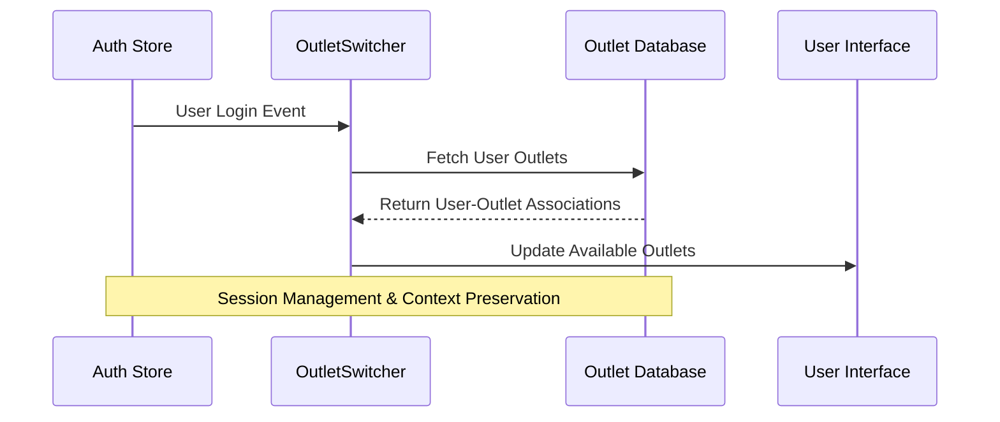

# Outlet Switcher Component

<cite>
**Referenced Files in This Document**
- [OutletSwitcher.tsx](file://src/components/OutletSwitcher.tsx)
- [outletDb.ts](file://src/db/outletDb.ts)
- [sheet.tsx](file://src/components/ui/sheet.tsx)
- [button.tsx](file://src/components/ui/button.tsx)
- [auth.ts](file://src/stores/auth.ts)
- [db.ts](file://src/db/db.ts)
- [syncService.ts](file://src/lib/syncService.ts)
- [TopNav.tsx](file://src/components/TopNav.tsx)
- [app.tsx](file://src/app.tsx)
</cite>

## Table of Contents
1. [Introduction](#introduction)
2. [Project Structure](#project-structure)
3. [Core Components](#core-components)
4. [Architecture Overview](#architecture-overview)
5. [Detailed Component Analysis](#detailed-component-analysis)
6. [Data Flow Analysis](#data-flow-analysis)
7. [Integration Points](#integration-points)
8. [Performance Considerations](#performance-considerations)
9. [Troubleshooting Guide](#troubleshooting-guide)
10. [Conclusion](#conclusion)

## Introduction

The Outlet Switcher Component is a critical feature in the Ngepos Point-of-Sale system that enables users to seamlessly switch between different physical locations (outlets) within a multi-location business. This component provides an intuitive interface for managing business locations, displaying current outlet information, and facilitating smooth transitions between different operational contexts.

The component leverages SolidJS reactive primitives, local storage persistence, and a sophisticated database architecture to deliver a responsive and reliable outlet switching experience. It integrates deeply with the application's authentication system and maintains synchronization with backend services for seamless multi-outlet operations.

## Project Structure

The Outlet Switcher Component is organized within the components directory alongside other UI elements and follows a modular architecture pattern:

**Diagram sources**
- [OutletSwitcher.tsx:1-203](file://src/components/OutletSwitcher.tsx#L1-L203)
- [outletDb.ts:1-169](file://src/db/outletDb.ts#L1-L169)

**Section sources**
- [OutletSwitcher.tsx:1-203](file://src/components/OutletSwitcher.tsx#L1-L203)
- [outletDb.ts:1-169](file://src/db/outletDb.ts#L1-L169)

## Core Components

The Outlet Switcher system consists of three primary components that work together to provide comprehensive outlet management functionality:

### Main OutletSwitcher Component
The primary component responsible for displaying the current outlet and providing the interface for switching between different outlets. It manages state, handles user interactions, and coordinates with the database layer.

### OutletBadge Component  
A lightweight component that displays the current outlet's code in a compact badge format, commonly used in header areas or status displays.

### OutletHeader Component
A specialized header component that integrates the OutletSwitcher into navigation contexts, providing seamless outlet switching within the application's navigation structure.

**Section sources**
- [OutletSwitcher.tsx:24-167](file://src/components/OutletSwitcher.tsx#L24-L167)
- [OutletSwitcher.tsx:169-194](file://src/components/OutletSwitcher.tsx#L169-L194)
- [OutletSwitcher.tsx:196-202](file://src/components/OutletSwitcher.tsx#L196-L202)

## Architecture Overview

The Outlet Switcher follows a reactive architecture pattern built on SolidJS's fine-grained reactivity system. The architecture emphasizes separation of concerns, with clear boundaries between UI presentation, data management, and persistence layers.

**Diagram sources**
- [OutletSwitcher.tsx:48-65](file://src/components/OutletSwitcher.tsx#L48-L65)
- [outletDb.ts:85-91](file://src/db/outletDb.ts#L85-L91)

The architecture implements several key design patterns:

- **Reactive State Management**: Utilizes SolidJS signals and resources for efficient state updates
- **Database Abstraction**: Provides clean interfaces for outlet data operations
- **Local Storage Integration**: Ensures persistent state across browser sessions
- **Error Handling**: Implements robust error handling with user feedback mechanisms

## Detailed Component Analysis

### OutletSwitcher Component Implementation

The main OutletSwitcher component demonstrates sophisticated state management and user interaction handling:

**Diagram sources**
- [OutletSwitcher.tsx:24-65](file://src/components/OutletSwitcher.tsx#L24-L65)
- [outletDb.ts:3-21](file://src/db/outletDb.ts#L3-L21)

#### State Management Architecture

The component employs a multi-layered state management approach:

1. **Local Component State**: Manages UI-specific state including modal visibility and switching status
2. **Resource State**: Handles outlet data fetching and caching through SolidJS createResource
3. **Persistent State**: Maintains current outlet selection in local storage for session continuity

#### User Interface Design

The interface follows modern design principles with clear visual hierarchy and responsive feedback:

- **Visual Indicators**: Selected outlet highlighted with primary color accents
- **Accessibility**: Proper focus management and keyboard navigation support
- **Responsive Design**: Adapts to different screen sizes and orientations
- **Loading States**: Graceful loading indicators during data operations

**Section sources**
- [OutletSwitcher.tsx:24-65](file://src/components/OutletSwitcher.tsx#L24-L65)
- [OutletSwitcher.tsx:67-166](file://src/components/OutletSwitcher.tsx#L67-L166)

### Database Integration Layer

The outlet database layer provides comprehensive data management capabilities:

**Diagram sources**
- [outletDb.ts:3-45](file://src/db/outletDb.ts#L3-L45)

#### Data Operations

The database layer supports various operations essential for outlet management:

- **Outlet Retrieval**: Efficient queries for active outlets with proper indexing
- **User Association**: Manages user-outlet relationships with role-based access control
- **Synchronization Queue**: Handles background sync operations with retry logic
- **Statistics Generation**: Provides insights into outlet and sync operation metrics

**Section sources**
- [outletDb.ts:61-91](file://src/db/outletDb.ts#L61-L91)
- [outletDb.ts:93-168](file://src/db/outletDb.ts#L93-L168)

### UI Component Integration

The Outlet Switcher integrates seamlessly with the application's UI framework:

#### Sheet Component Integration
The component utilizes a custom Sheet implementation that provides modal functionality with smooth animations and proper accessibility support.

#### Button Component Integration
Standard button components are used throughout the interface to maintain consistency with the application's design system.

**Section sources**
- [sheet.tsx:1-175](file://src/components/ui/sheet.tsx#L1-L175)
- [button.tsx:1-54](file://src/components/ui/button.tsx#L1-L54)

## Data Flow Analysis

The data flow within the Outlet Switcher component demonstrates sophisticated reactive programming patterns:

**Diagram sources**
- [OutletSwitcher.tsx:29-65](file://src/components/OutletSwitcher.tsx#L29-L65)

### Reactive Data Patterns

The component implements several reactive data patterns:

1. **Resource-Based Loading**: Uses SolidJS createResource for efficient data fetching and caching
2. **Signal-Based State**: Employs createSignal for local component state management
3. **Effect-Based Side Effects**: Leverages createEffect for automatic data refreshes
4. **Computed Properties**: Utilizes reactive functions for derived state calculations

**Section sources**
- [OutletSwitcher.tsx:29-46](file://src/components/OutletSwitcher.tsx#L29-L46)
- [OutletSwitcher.tsx:36-41](file://src/components/OutletSwitcher.tsx#L36-L41)

## Integration Points

The Outlet Switcher component integrates with multiple system components to provide comprehensive functionality:

### Authentication System Integration

The component works closely with the authentication system to ensure proper user context:

**Diagram sources**
- [auth.ts:11-56](file://src/stores/auth.ts#L11-L56)
- [OutletSwitcher.tsx:36-41](file://src/components/OutletSwitcher.tsx#L36-L41)

### Database Integration

Deep integration with the main application database ensures data consistency and reliability:

- **Primary Database**: Main POS database for product, transaction, and inventory data
- **Outlet Database**: Separate database for outlet-specific configurations and settings
- **Synchronization**: Background sync service handles data coordination between databases

**Section sources**
- [db.ts:270-498](file://src/db/db.ts#L270-L498)
- [syncService.ts:12-75](file://src/lib/syncService.ts#L12-L75)

### Navigation Integration

The component integrates with the application's navigation system:

- **Top Navigation**: Displays current outlet in the main navigation bar
- **Mobile Navigation**: Adapts to mobile-first design patterns
- **Breadcrumb Integration**: Provides contextual outlet information in navigation breadcrumbs

**Section sources**
- [TopNav.tsx:1-43](file://src/components/TopNav.tsx#L1-L43)
- [OutletSwitcher.tsx:196-202](file://src/components/OutletSwitcher.tsx#L196-L202)

## Performance Considerations

The Outlet Switcher component is designed with performance optimization in mind:

### Memory Management
- **Efficient Resource Usage**: Minimal memory footprint through proper resource cleanup
- **Lazy Loading**: Outlet data loaded only when needed
- **State Optimization**: Reactive state updates minimize unnecessary re-renders

### Network Performance
- **Caching Strategy**: Local caching reduces network requests
- **Background Sync**: Non-blocking operations prevent UI freezing
- **Debouncing**: Input debouncing prevents excessive API calls

### User Experience
- **Instant Feedback**: Immediate visual feedback for user actions
- **Graceful Degradation**: Fallbacks when data is unavailable
- **Progressive Enhancement**: Enhanced functionality when resources are available

## Troubleshooting Guide

Common issues and their solutions:

### Outlet Loading Issues
**Problem**: Outlets fail to load or display incorrectly
**Solution**: Check database connectivity and verify outlet records exist

### Switching Failures  
**Problem**: Unable to switch between outlets
**Solution**: Verify user permissions and outlet associations

### State Synchronization Problems
**Problem**: Outlet state not persisting across sessions
**Solution**: Check local storage availability and clear corrupted data

### Performance Issues
**Problem**: Slow response times or UI freezes
**Solution**: Monitor resource usage and optimize data fetching patterns

**Section sources**
- [OutletSwitcher.tsx:50-64](file://src/components/OutletSwitcher.tsx#L50-L64)
- [outletDb.ts:128-144](file://src/db/outletDb.ts#L128-L144)

## Conclusion

The Outlet Switcher Component represents a sophisticated implementation of multi-location business management within the Ngepos ecosystem. Its architecture demonstrates best practices in reactive programming, state management, and user interface design.

Key achievements include:

- **Robust State Management**: Comprehensive reactive state handling with proper cleanup
- **Seamless User Experience**: Intuitive interface with immediate feedback
- **Scalable Architecture**: Modular design supporting future enhancements
- **Performance Optimization**: Efficient resource usage and responsive interactions

The component serves as a foundation for advanced multi-outlet operations while maintaining simplicity and reliability. Its integration with the broader application ecosystem ensures consistent behavior across all business contexts.

Future enhancements could include advanced filtering capabilities, outlet hierarchy management, and enhanced analytics for multi-location operations.