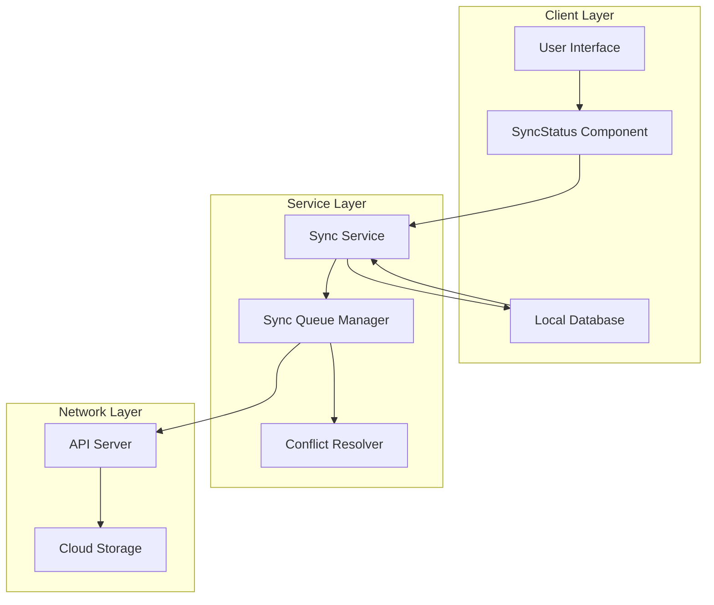
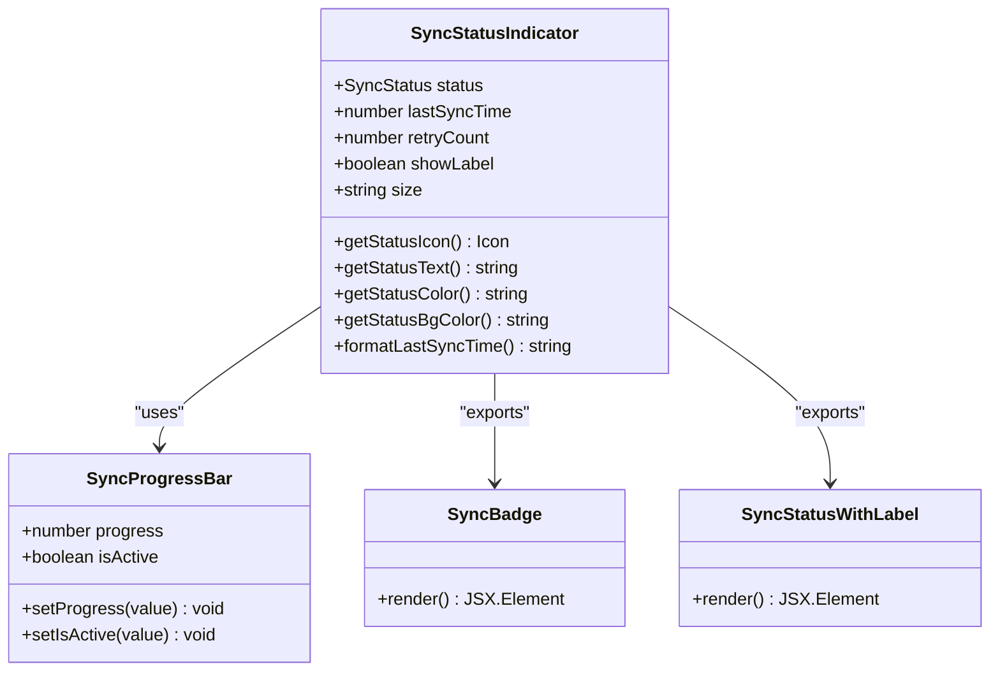
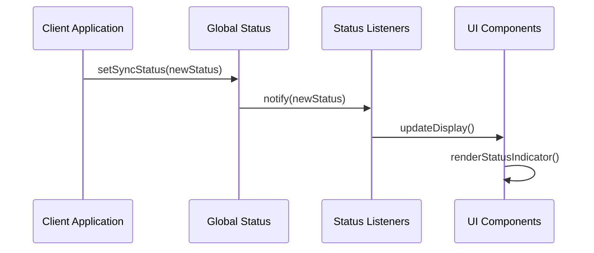
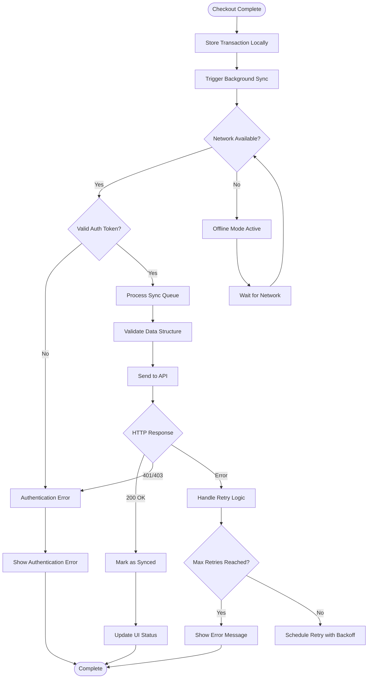
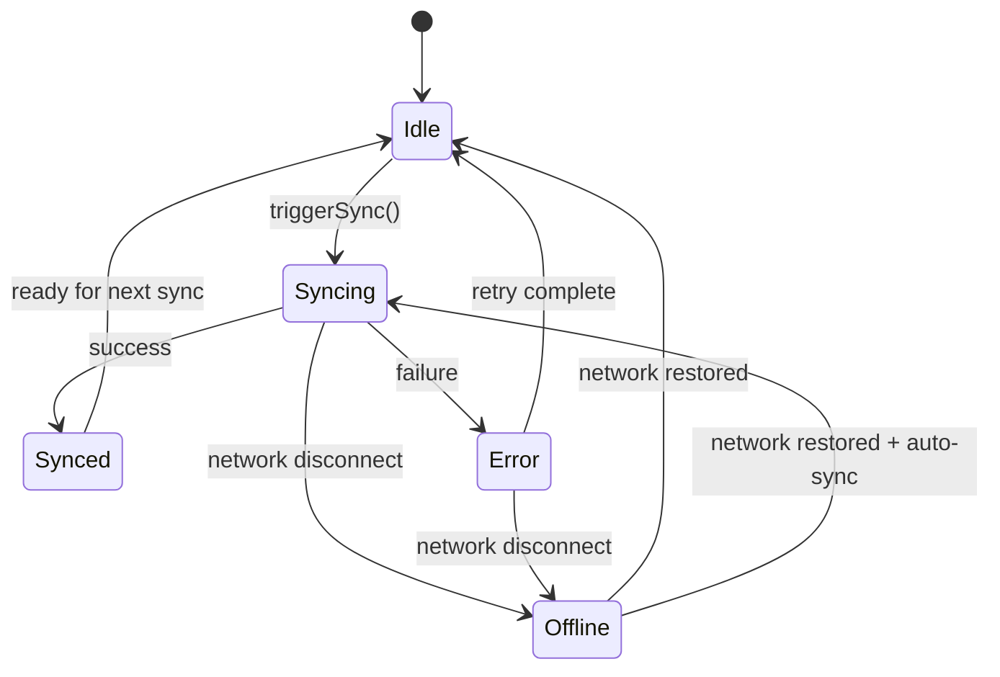
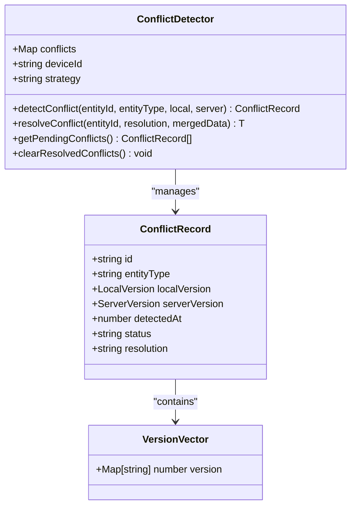
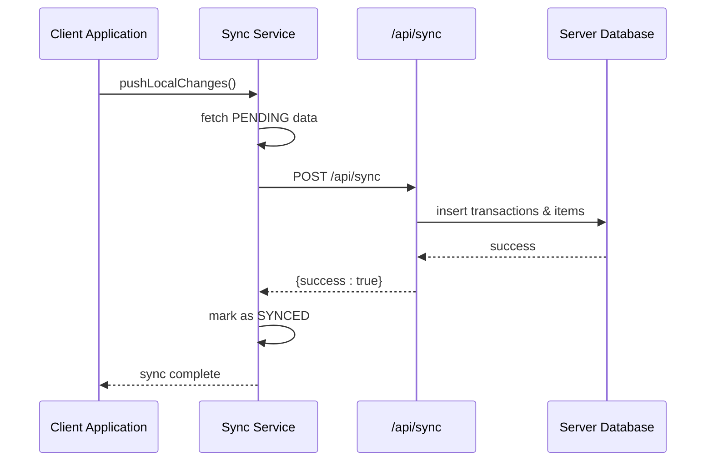

# Synchronization Status Indicator

<cite>
**Referenced Files in This Document**
- [SyncStatus.tsx](file://src/components/SyncStatus.tsx)
- [syncService.ts](file://src/lib/syncService.ts)
- [syncQueue.ts](file://src/lib/syncQueue.ts)
- [conflictResolution.ts](file://src/lib/conflictResolution.ts)
- [useCheckout.ts](file://src/hooks/useCheckout.ts)
- [index.ts](file://src/routes/api/sync/index.ts)
- [TopNav.tsx](file://src/components/TopNav.tsx)
</cite>

## Table of Contents
1. [Introduction](#introduction)
2. [System Architecture](#system-architecture)
3. [Core Components](#core-components)
4. [Synchronization Workflow](#synchronization-workflow)
5. [Status Management](#status-management)
6. [Conflict Resolution](#conflict-resolution)
7. [Integration Points](#integration-points)
8. [Performance Considerations](#performance-considerations)
9. [Troubleshooting Guide](#troubleshooting-guide)
10. [Conclusion](#conclusion)

## Introduction

The Synchronization Status Indicator is a critical component in the ngepos Point of Sale system that provides real-time feedback on the synchronization status between the local client application and the remote cloud server. This component ensures users have immediate visibility into their connection state, sync progress, and any potential issues that may arise during the data synchronization process.

The system implements a sophisticated offline-first architecture where all transactions are initially stored locally and synchronized asynchronously when network connectivity is available. The SyncStatus component serves as the primary interface for communicating the current state of this synchronization process to users.

## System Architecture

The synchronization system follows a layered architecture pattern with clear separation of concerns:

**Diagram sources**
- [SyncStatus.tsx:1-202](file://src/components/SyncStatus.tsx#L1-L202)
- [syncService.ts:1-111](file://src/lib/syncService.ts#L1-L111)
- [syncQueue.ts:69-571](file://src/lib/syncQueue.ts#L69-L571)

## Core Components

### SyncStatusIndicator Component

The SyncStatusIndicator is the primary visual component responsible for displaying synchronization status to users. It implements a comprehensive state management system that tracks various synchronization states and provides appropriate visual feedback.

**Diagram sources**
- [SyncStatus.tsx:11-133](file://src/components/SyncStatus.tsx#L11-L133)
- [SyncStatus.tsx:135-172](file://src/components/SyncStatus.tsx#L135-L172)
- [SyncStatus.tsx:174-180](file://src/components/SyncStatus.tsx#L174-L180)

**Section sources**
- [SyncStatus.tsx:1-202](file://src/components/SyncStatus.tsx#L1-L202)

### Global Status Management

The system maintains a global synchronization state that can be monitored and updated across different parts of the application:

**Diagram sources**
- [SyncStatus.tsx:182-197](file://src/components/SyncStatus.tsx#L182-L197)

**Section sources**
- [SyncStatus.tsx:182-197](file://src/components/SyncStatus.tsx#L182-L197)

## Synchronization Workflow

The synchronization process follows a multi-stage workflow designed to handle various scenarios including offline mode, retry mechanisms, and conflict resolution:

**Diagram sources**
- [useCheckout.ts:226-233](file://src/hooks/useCheckout.ts#L226-L233)
- [syncService.ts:12-75](file://src/lib/syncService.ts#L12-L75)
- [syncService.ts:81-100](file://src/lib/syncService.ts#L81-L100)

**Section sources**
- [useCheckout.ts:55-263](file://src/hooks/useCheckout.ts#L55-L263)
- [syncService.ts:12-111](file://src/lib/syncService.ts#L12-L111)

## Status Management

The synchronization system manages five distinct states, each with specific visual representations and behaviors:

| Status | Icon | Color | Description |
|--------|------|-------|-------------|
| idle | Cloud | Gray | Ready for synchronization |
| syncing | RefreshCw (spinning) | Blue | Currently synchronizing data |
| synced | Check | Green | Successfully synchronized |
| error | AlertCircle | Red | Synchronization failed |
| offline | CloudOff | Orange | No network connectivity |

### Status Transitions

**Diagram sources**
- [SyncStatus.tsx:49-92](file://src/components/SyncStatus.tsx#L49-L92)

**Section sources**
- [SyncStatus.tsx:49-133](file://src/components/SyncStatus.tsx#L49-L133)

## Conflict Resolution

The system implements sophisticated conflict resolution mechanisms to handle concurrent modifications to the same data across multiple devices:

**Diagram sources**
- [conflictResolution.ts:134-202](file://src/lib/conflictResolution.ts#L134-L202)
- [conflictResolution.ts:10-18](file://src/lib/conflictResolution.ts#L10-L18)

**Section sources**
- [conflictResolution.ts:1-258](file://src/lib/conflictResolution.ts#L1-L258)

### Conflict Resolution Strategies

The system supports four conflict resolution strategies:

1. **Local Wins**: Local changes take precedence over server changes
2. **Server Wins**: Server changes override local modifications
3. **Last Write Wins**: Based on timestamp comparisons
4. **Manual**: Conflicts require user intervention

## Integration Points

### API Endpoint Integration

The synchronization service integrates with the backend API through a dedicated endpoint that handles transaction and expense synchronization:

**Diagram sources**
- [syncService.ts:12-75](file://src/lib/syncService.ts#L12-L75)
- [index.ts:10-155](file://src/routes/api/sync/index.ts#L10-L155)

**Section sources**
- [index.ts:10-155](file://src/routes/api/sync/index.ts#L10-L155)

### Navigation Integration

The system integrates with the application navigation to provide offline indicators and status updates:

**Section sources**
- [TopNav.tsx:1-43](file://src/components/TopNav.tsx#L1-L43)

## Performance Considerations

### Retry Mechanisms

The synchronization system implements exponential backoff with jitter to prevent overwhelming the server during retry attempts:

- **Base Delay**: 1 second
- **Maximum Retries**: 5 attempts
- **Backoff Formula**: `BASE_DELAY * 2^(retryCount-1) + random_jitter`
- **Maximum Delay**: 30 seconds

### Debouncing Strategy

To optimize network usage, the system implements debouncing to batch multiple sync requests:

- **Debounce Interval**: 3 seconds
- **Purpose**: Prevents excessive API calls during rapid data changes

### Memory Management

The system includes proper cleanup mechanisms to prevent memory leaks:

- **Event Listener Cleanup**: Automatic removal of network event listeners
- **Interval Cleanup**: Proper disposal of background sync intervals
- **Storage Cleanup**: Efficient local storage management

## Troubleshooting Guide

### Common Issues and Solutions

| Issue | Symptoms | Solution |
|-------|----------|----------|
| Sync Not Starting | Status remains idle despite network | Check authentication token validity |
| Frequent Failures | Error state with retry attempts | Verify server connectivity and API availability |
| Offline Mode | Persistent offline status | Check browser network detection and event listeners |
| Stuck Progress | Progress bar stuck at 0% | Review sync queue processing and conflict resolution |
| Authentication Errors | 401/403 responses | Clear cached tokens and re-authenticate |

### Debug Information

The system provides comprehensive logging for troubleshooting:

- **Network Events**: Online/offline state changes
- **Sync Attempts**: Individual retry logs with timing
- **Conflict Detection**: Detailed conflict resolution traces
- **API Responses**: HTTP status codes and error messages

**Section sources**
- [syncService.ts:81-100](file://src/lib/syncService.ts#L81-L100)
- [syncQueue.ts:286-338](file://src/lib/syncQueue.ts#L286-L338)

## Conclusion

The Synchronization Status Indicator represents a comprehensive solution for managing offline-first applications with robust synchronization capabilities. The system successfully balances user experience with technical reliability through:

- **Real-time Status Updates**: Immediate visual feedback on sync state
- **Intelligent Retry Logic**: Smart backoff mechanisms preventing server overload
- **Conflict Resolution**: Sophisticated handling of concurrent modifications
- **Offline Support**: Seamless operation without network connectivity
- **Performance Optimization**: Efficient resource management and memory cleanup

The modular architecture ensures maintainability and extensibility while the comprehensive error handling provides resilience against various failure scenarios. This implementation serves as a foundation for building reliable offline-capable applications in the modern web ecosystem.