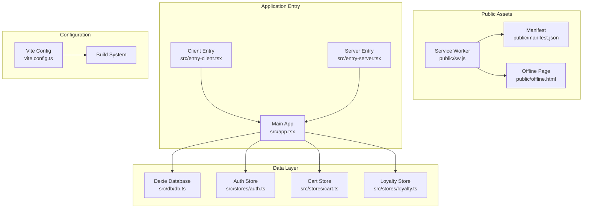
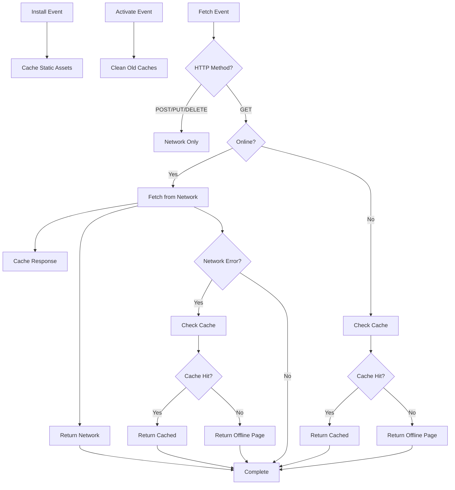
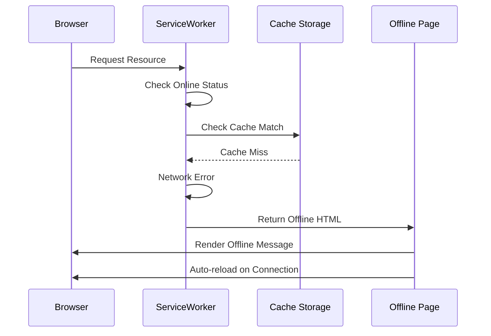
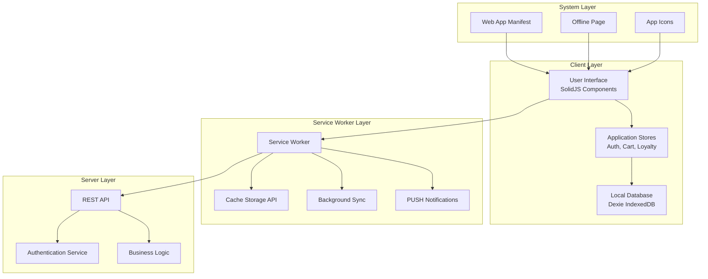
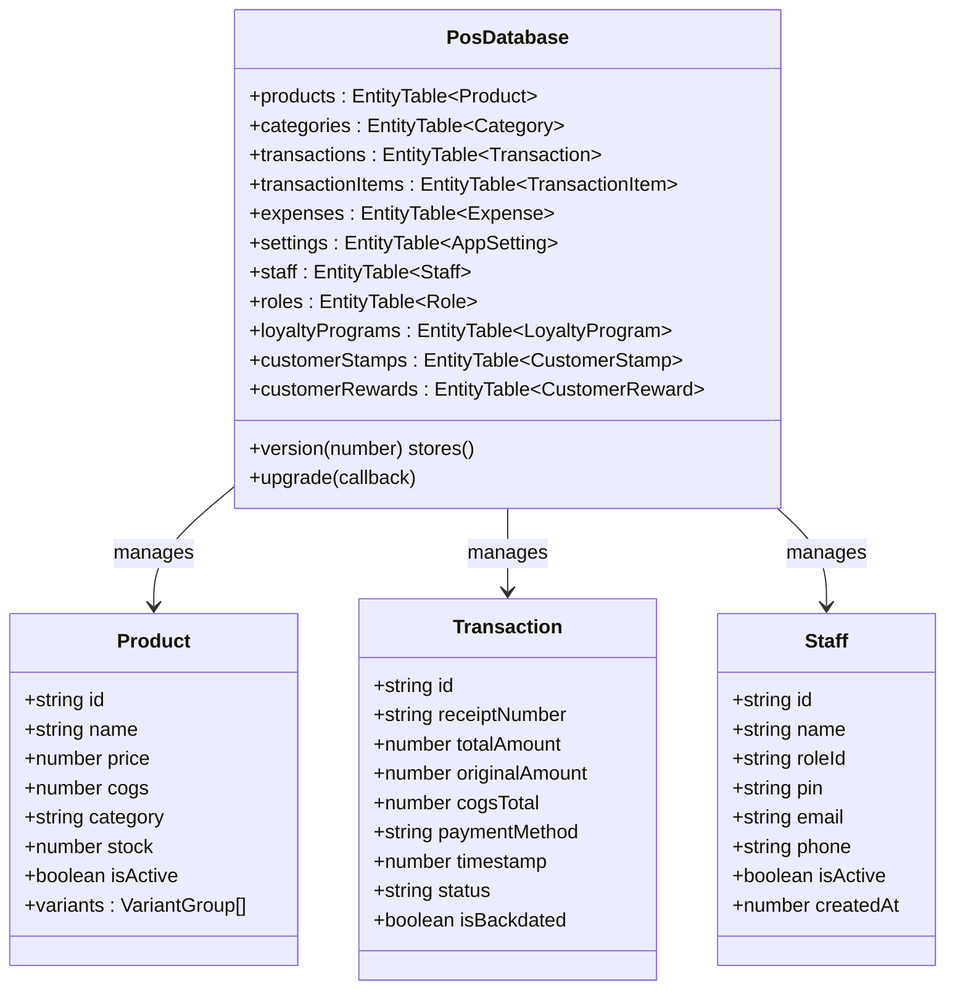
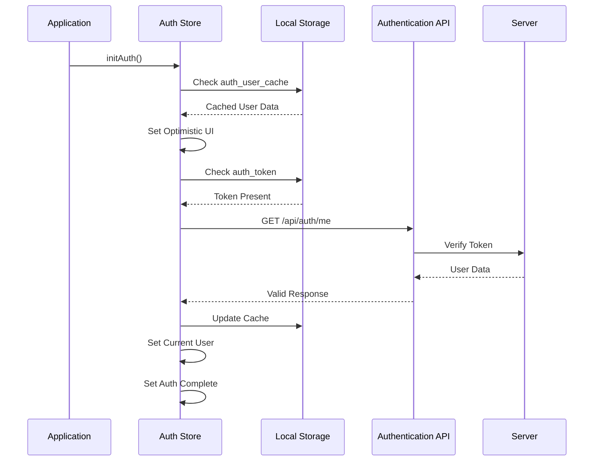
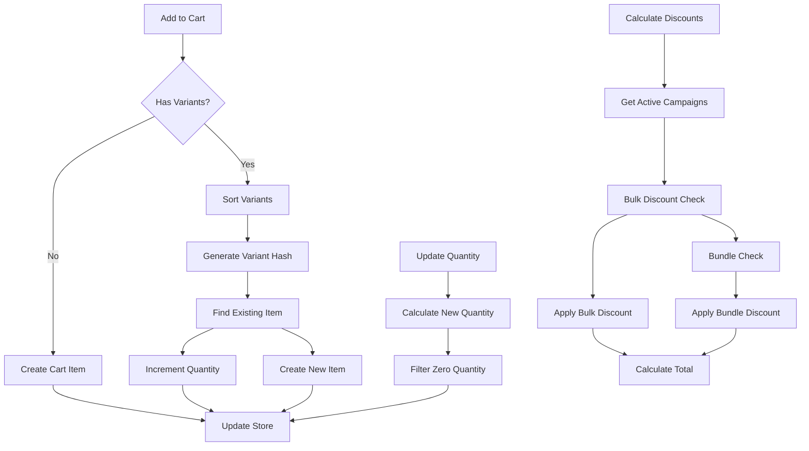
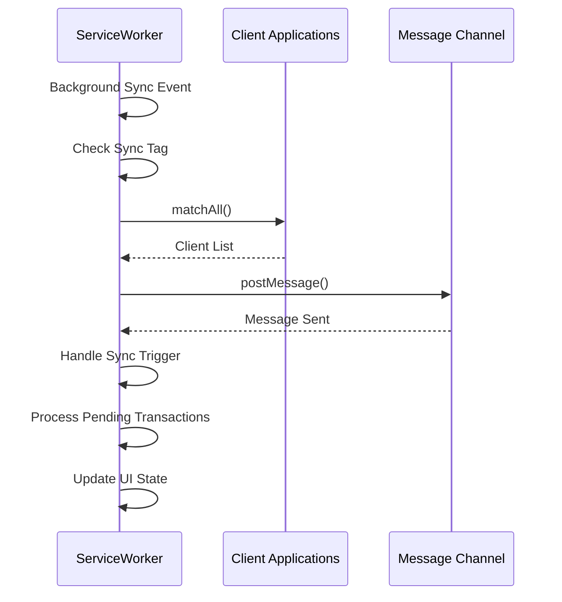
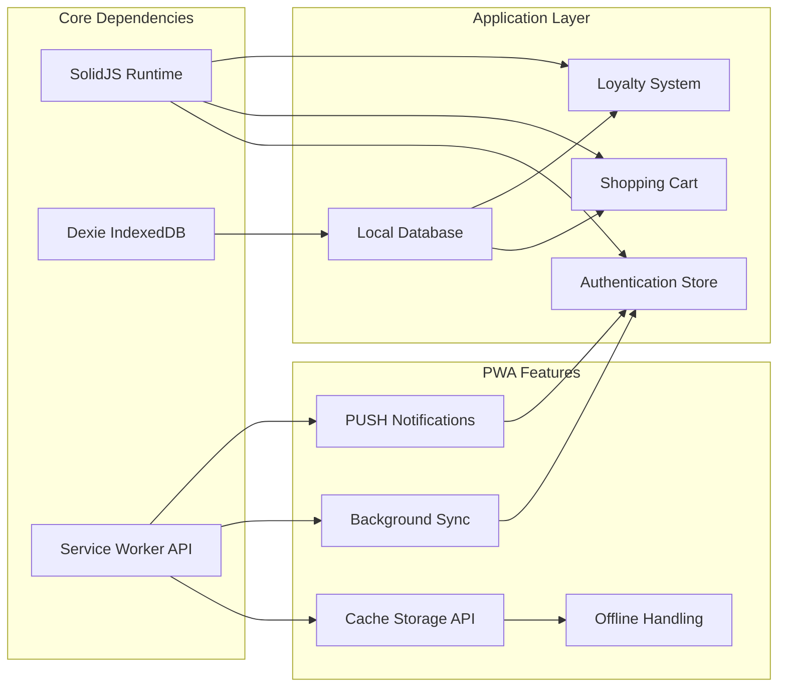

# Progressive Web App Support

<cite>
**Referenced Files in This Document**
- [sw.js](file://public/sw.js)
- [manifest.json](file://public/manifest.json)
- [offline.html](file://public/offline.html)
- [app.tsx](file://src/app.tsx)
- [entry-client.tsx](file://src/entry-client.tsx)
- [entry-server.tsx](file://src/entry-server.tsx)
- [vite.config.ts](file://vite.config.ts)
- [db.ts](file://src/db/db.ts)
- [auth.ts](file://src/stores/auth.ts)
- [cart.ts](file://src/stores/cart.ts)
- [loyalty.ts](file://src/stores/loyalty.ts)
</cite>

## Table of Contents
1. [Introduction](#introduction)
2. [Project Structure](#project-structure)
3. [Core Components](#core-components)
4. [Architecture Overview](#architecture-overview)
5. [Detailed Component Analysis](#detailed-component-analysis)
6. [Dependency Analysis](#dependency-analysis)
7. [Performance Considerations](#performance-considerations)
8. [Troubleshooting Guide](#troubleshooting-guide)
9. [Conclusion](#conclusion)

## Introduction

This document provides comprehensive documentation for the Progressive Web App (PWA) support implementation in the Ngepos Point of Sale system. The application leverages modern web technologies to deliver an offline-first, installable, and responsive mobile-first POS solution for Indonesian F&B businesses.

The PWA implementation encompasses service worker caching, offline page handling, manifest configuration, and background synchronization capabilities. The system is built with SolidJS and follows a client-side rendering architecture optimized for both desktop and mobile environments.

## Project Structure

The PWA implementation is organized across several key directories and files:

**Diagram sources**
- [sw.js:1-107](file://public/sw.js#L1-L107)
- [manifest.json:1-28](file://public/manifest.json#L1-L28)
- [offline.html:1-142](file://public/offline.html#L1-L142)
- [app.tsx:1-42](file://src/app.tsx#L1-L42)
- [entry-client.tsx:1-5](file://src/entry-client.tsx#L1-L5)
- [entry-server.tsx:1-36](file://src/entry-server.tsx#L1-L36)
- [vite.config.ts:1-26](file://vite.config.ts#L1-L26)

**Section sources**
- [sw.js:1-107](file://public/sw.js#L1-L107)
- [manifest.json:1-28](file://public/manifest.json#L1-L28)
- [offline.html:1-142](file://public/offline.html#L1-L142)
- [app.tsx:1-42](file://src/app.tsx#L1-L42)
- [entry-client.tsx:1-5](file://src/entry-client.tsx#L1-L5)
- [entry-server.tsx:1-36](file://src/entry-server.tsx#L1-L36)
- [vite.config.ts:1-26](file://vite.config.ts#L1-L26)

## Core Components

### Service Worker Implementation

The service worker provides comprehensive offline functionality and background synchronization:

**Diagram sources**
- [sw.js:10-62](file://public/sw.js#L10-L62)

### Manifest Configuration

The web app manifest defines installation properties and appearance characteristics:

| Property | Value | Purpose |
|----------|-------|---------|
| `name` | "Ngepos - Point of Sale" | Full application name |
| `short_name` | "Ngepos" | Abbreviated display name |
| `description` | Mobile-first POS system... | Application purpose |
| `start_url` | "/" | Initial page load |
| `display` | "standalone" | Fullscreen experience |
| `background_color` | "#ffffff" | Splash screen color |
| `theme_color` | "#e65a14" | Browser theme |
| `orientation` | "portrait-primary" | Preferred orientation |

**Section sources**
- [manifest.json:1-28](file://public/manifest.json#L1-L28)

### Offline Page Implementation

The offline page provides graceful degradation when connectivity is unavailable:

**Diagram sources**
- [sw.js:32-62](file://public/sw.js#L32-L62)
- [offline.html:134-141](file://public/offline.html#L134-L141)

**Section sources**
- [sw.js:32-62](file://public/sw.js#L32-L62)
- [offline.html:1-142](file://public/offline.html#L1-L142)

## Architecture Overview

The PWA architecture integrates multiple layers for optimal offline functionality and user experience:

**Diagram sources**
- [app.tsx:24-41](file://src/app.tsx#L24-L41)
- [sw.js:10-98](file://public/sw.js#L10-L98)
- [db.ts:270-496](file://src/db/db.ts#L270-L496)

The architecture follows an offline-first principle where the service worker intercepts network requests and serves cached content when available, falling back to the offline page when connectivity is lost.

**Section sources**
- [app.tsx:24-41](file://src/app.tsx#L24-L41)
- [sw.js:10-98](file://public/sw.js#L10-L98)
- [db.ts:270-496](file://src/db/db.ts#L270-L496)

## Detailed Component Analysis

### Database Layer Integration

The application uses Dexie for client-side data persistence with comprehensive versioning:

**Diagram sources**
- [db.ts:270-496](file://src/db/db.ts#L270-L496)
- [db.ts:62-154](file://src/db/db.ts#L62-L154)
- [db.ts:82-154](file://src/db/db.ts#L82-L154)

The database supports multiple versions with automatic migration, ensuring backward compatibility as features evolve.

**Section sources**
- [db.ts:270-496](file://src/db/db.ts#L270-L496)
- [db.ts:62-154](file://src/db/db.ts#L62-L154)

### Authentication Store Architecture

The authentication system implements optimistic loading with local storage caching:

**Diagram sources**
- [auth.ts:11-56](file://src/stores/auth.ts#L11-L56)

**Section sources**
- [auth.ts:11-56](file://src/stores/auth.ts#L11-L56)

### Shopping Cart Management

The cart system handles complex variant combinations and promotional calculations:

**Diagram sources**
- [cart.ts:16-106](file://src/stores/cart.ts#L16-L106)
- [cart.ts:132-236](file://src/stores/cart.ts#L132-L236)

**Section sources**
- [cart.ts:16-106](file://src/stores/cart.ts#L16-L106)
- [cart.ts:132-236](file://src/stores/cart.ts#L132-L236)

### Background Synchronization

The service worker implements background synchronization for transaction data:

**Diagram sources**
- [sw.js:64-79](file://public/sw.js#L64-L79)

**Section sources**
- [sw.js:64-79](file://public/sw.js#L64-L79)

## Dependency Analysis

The PWA implementation relies on several key dependencies and their interactions:

**Diagram sources**
- [app.tsx:1-42](file://src/app.tsx#L1-L42)
- [db.ts:1-570](file://src/db/db.ts#L1-L570)
- [sw.js:1-107](file://public/sw.js#L1-L107)

The dependency graph shows how the application maintains loose coupling between components while leveraging shared PWA capabilities.

**Section sources**
- [app.tsx:1-42](file://src/app.tsx#L1-L42)
- [db.ts:1-570](file://src/db/db.ts#L1-L570)
- [sw.js:1-107](file://public/sw.js#L1-L107)

## Performance Considerations

The PWA implementation incorporates several performance optimization strategies:

### Caching Strategy
- **Static Assets**: Cached during installation for immediate offline access
- **Dynamic Content**: Network-first approach with intelligent caching
- **Cache Invalidation**: Pattern-based invalidation for real-time data updates

### Database Optimization
- **IndexedDB**: Efficient client-side storage with structured data
- **Version Migration**: Seamless database upgrades without data loss
- **Query Optimization**: Indexed fields for fast data retrieval

### Memory Management
- **Store Patterns**: Efficient state management with SolidJS signals
- **Lazy Loading**: On-demand resource loading
- **Cleanup Procedures**: Proper resource deallocation

## Troubleshooting Guide

### Common Issues and Solutions

**Service Worker Not Activating**
- Clear browser cache and service worker registrations
- Check console for installation errors
- Verify manifest.json validity

**Offline Mode Problems**
- Ensure offline.html is properly cached
- Check network requests during offline periods
- Verify cache storage limits

**Authentication Issues**
- Clear local storage tokens
- Check token expiration
- Verify server connectivity

**Database Migration Failures**
- Review version upgrade logs
- Check for data consistency
- Implement manual migration if needed

**Section sources**
- [sw.js:19-30](file://public/sw.js#L19-L30)
- [offline.html:134-141](file://public/offline.html#L134-L141)
- [auth.ts:42-46](file://src/stores/auth.ts#L42-L46)

## Conclusion

The Ngepos PWA implementation provides a robust, offline-first solution for Indonesian F&B businesses. The architecture successfully combines modern web technologies with practical business requirements, delivering an installable, responsive, and resilient point-of-sale system.

Key achievements include comprehensive offline functionality, efficient client-side data management, and seamless background synchronization. The modular design ensures maintainability while the offline-first approach guarantees reliable operation in challenging network conditions.

Future enhancements could include push notification implementation, improved cache management strategies, and expanded offline functionality for additional business features.