# UI Component Library

<cite>
**Referenced Files in This Document**
- [button.tsx](file://src/components/ui/button.tsx)
- [dialog.tsx](file://src/components/ui/dialog.tsx)
- [sheet.tsx](file://src/components/ui/sheet.tsx)
- [dropdown-menu.tsx](file://src/components/ui/dropdown-menu.tsx)
- [label.tsx](file://src/components/ui/label.tsx)
- [card.tsx](file://src/components/ui/card.tsx)
- [calendar.tsx](file://src/components/ui/calendar.tsx)
- [product-selector.tsx](file://src/components/ui/product-selector.tsx)
- [VariantSelector.tsx](file://src/components/VariantSelector.tsx)
- [QrCodeGenerator.tsx](file://src/components/QrCodeGenerator.tsx)
- [utils.ts](file://src/lib/utils.ts)
- [tailwind.config.cjs](file://tailwind.config.cjs)
- [ui.config.json](file://ui.config.json)
- [package.json](file://package.json)
- [mockProducts.ts](file://src/data/mockProducts.ts)
- [db.ts](file://src/db/db.ts)
- [app.tsx](file://src/routes/app.tsx)
- [BottomNav.tsx](file://src/components/BottomNav.tsx)
</cite>

## Table of Contents
1. [Introduction](#introduction)
2. [Project Structure](#project-structure)
3. [Core Components](#core-components)
4. [Architecture Overview](#architecture-overview)
5. [Detailed Component Analysis](#detailed-component-analysis)
6. [Dependency Analysis](#dependency-analysis)
7. [Performance Considerations](#performance-considerations)
8. [Troubleshooting Guide](#troubleshooting-guide)
9. [Conclusion](#conclusion)
10. [Appendices](#appendices)

## Introduction
This document describes the UI component library used in the NgePos POS system. It focuses on the reusable SolidJS components that power the application’s user interface, including foundational elements (buttons, dialogs, sheets, forms), specialized POS components (product selector, variant selector, QR generator, calendar), and supporting utilities for styling and theming. The guide explains component APIs, composition patterns, responsive design, accessibility, customization, and integration with TailwindCSS and Kobalte primitives.

## Project Structure
The UI components are organized under a dedicated UI module and integrated with shared utilities and configuration:
- UI primitives and layouts: src/components/ui/*
- Specialized POS components: src/components/* (e.g., VariantSelector, QrCodeGenerator)
- Styling and theming: src/lib/utils.ts, tailwind.config.cjs
- Component aliases and Tailwind config: ui.config.json
- Type definitions and data models: src/db/db.ts, src/data/mockProducts.ts

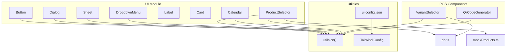

**Diagram sources**
- [button.tsx:1-54](file://src/components/ui/button.tsx#L1-L54)
- [dialog.tsx:1-142](file://src/components/ui/dialog.tsx#L1-L142)
- [sheet.tsx:1-175](file://src/components/ui/sheet.tsx#L1-L175)
- [dropdown-menu.tsx:1-36](file://src/components/ui/dropdown-menu.tsx#L1-L36)
- [label.tsx:1-20](file://src/components/ui/label.tsx#L1-L20)
- [card.tsx:1-44](file://src/components/ui/card.tsx#L1-L44)
- [calendar.tsx:1-183](file://src/components/ui/calendar.tsx#L1-L183)
- [product-selector.tsx:1-236](file://src/components/ui/product-selector.tsx#L1-L236)
- [VariantSelector.tsx:1-205](file://src/components/VariantSelector.tsx#L1-L205)
- [QrCodeGenerator.tsx:1-222](file://src/components/QrCodeGenerator.tsx#L1-L222)
- [utils.ts:1-7](file://src/lib/utils.ts#L1-L7)
- [tailwind.config.cjs:1-88](file://tailwind.config.cjs#L1-L88)
- [ui.config.json:1-13](file://ui.config.json#L1-L13)
- [mockProducts.ts:1-85](file://src/data/mockProducts.ts#L1-L85)
- [db.ts:1-569](file://src/db/db.ts#L1-L569)

**Section sources**
- [button.tsx:1-54](file://src/components/ui/button.tsx#L1-L54)
- [dialog.tsx:1-142](file://src/components/ui/dialog.tsx#L1-L142)
- [sheet.tsx:1-175](file://src/components/ui/sheet.tsx#L1-L175)
- [dropdown-menu.tsx:1-36](file://src/components/ui/dropdown-menu.tsx#L1-L36)
- [label.tsx:1-20](file://src/components/ui/label.tsx#L1-L20)
- [card.tsx:1-44](file://src/components/ui/card.tsx#L1-L44)
- [calendar.tsx:1-183](file://src/components/ui/calendar.tsx#L1-L183)
- [product-selector.tsx:1-236](file://src/components/ui/product-selector.tsx#L1-L236)
- [VariantSelector.tsx:1-205](file://src/components/VariantSelector.tsx#L1-L205)
- [QrCodeGenerator.tsx:1-222](file://src/components/QrCodeGenerator.tsx#L1-L222)
- [utils.ts:1-7](file://src/lib/utils.ts#L1-L7)
- [tailwind.config.cjs:1-88](file://tailwind.config.cjs#L1-L88)
- [ui.config.json:1-13](file://ui.config.json#L1-L13)
- [mockProducts.ts:1-85](file://src/data/mockProducts.ts#L1-L85)
- [db.ts:1-569](file://src/db/db.ts#L1-L569)

## Core Components
This section documents the foundational UI components and their capabilities.

- Button
  - Purpose: Base interactive element with variants and sizes.
  - Props:
    - polymorphic props from the underlying primitive
    - variant: default, destructive, outline, secondary, ghost, link
    - size: default, sm, lg, icon
    - class: optional className override
  - Events: Inherits all pointer and keyboard events from the primitive.
  - Accessibility: Inherits focus management and ARIA attributes from the primitive.
  - Customization: Uses class variance authority for variants and cn() for merging Tailwind classes.

- Dialog
  - Purpose: Modal overlay with header, footer, title, and description slots.
  - Composition:
    - Root, Trigger, Portal, Overlay, Content
    - Header/Footer for layout
    - Title/Description for semantics
  - Props:
    - Root and Trigger accept primitive props
    - Portal centers content responsively
    - Overlay supports custom class
    - Content supports custom class and children
  - Accessibility: Uses Kobalte’s dialog primitives with proper focus trapping and ARIA roles.

- Sheet
  - Purpose: Slide-in panel from a given edge (top, bottom, left, right).
  - Props:
    - position: top, bottom, left, right
    - hideClose: optionally hide close button
    - class and children
  - Accessibility: Same focus and ARIA benefits as Dialog.

- DropdownMenu
  - Purpose: Context menu with trigger, portal, and styled items.
  - Props:
    - Content: styled container with animations
    - Item: styled list item with focus styles
  - Accessibility: Keyboard navigation and ARIA support via primitives.

- Label
  - Purpose: Associates text with form controls.
  - Props: standard label props plus optional class.

- Card
  - Purpose: Container with header, title, description, content, and footer slots.
  - Props: standard div props plus optional class for each slot.

**Section sources**
- [button.tsx:1-54](file://src/components/ui/button.tsx#L1-L54)
- [dialog.tsx:1-142](file://src/components/ui/dialog.tsx#L1-L142)
- [sheet.tsx:1-175](file://src/components/ui/sheet.tsx#L1-L175)
- [dropdown-menu.tsx:1-36](file://src/components/ui/dropdown-menu.tsx#L1-L36)
- [label.tsx:1-20](file://src/components/ui/label.tsx#L1-L20)
- [card.tsx:1-44](file://src/components/ui/card.tsx#L1-L44)

## Architecture Overview
The UI layer builds on:
- SolidJS primitives for reactivity and DOM updates
- Kobalte primitives for accessible overlays and menus
- TailwindCSS for styling with a custom theme and animations
- class-variance-authority and clsx/tailwind-merge for composable variants

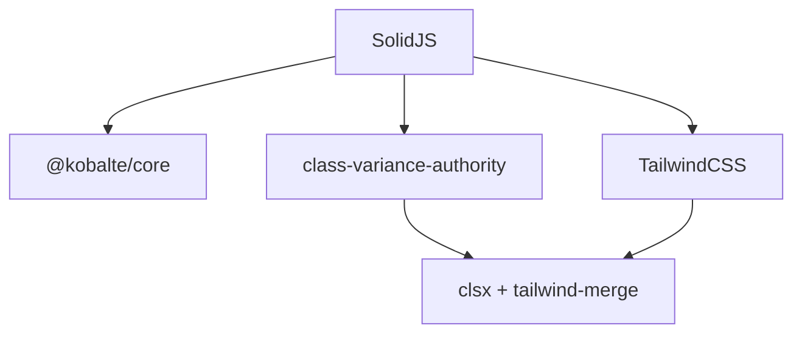

**Diagram sources**
- [button.tsx:1-54](file://src/components/ui/button.tsx#L1-L54)
- [utils.ts:1-7](file://src/lib/utils.ts#L1-L7)
- [tailwind.config.cjs:1-88](file://tailwind.config.cjs#L1-L88)
- [package.json:1-56](file://package.json#L1-L56)

**Section sources**
- [button.tsx:1-54](file://src/components/ui/button.tsx#L1-L54)
- [utils.ts:1-7](file://src/lib/utils.ts#L1-L7)
- [tailwind.config.cjs:1-88](file://tailwind.config.cjs#L1-L88)
- [package.json:1-56](file://package.json#L1-L56)

## Detailed Component Analysis

### Button
- Implementation pattern: Polymorphic component with variant sizing via class variance authority.
- Props and behavior:
  - variant and size map to computed class sets
  - Accepts polymorphic component type and forwards all other props
- Accessibility: Inherits focus-visible outlines and keyboard interaction from the primitive.
- Customization:
  - Extend variants/sizes by updating the variant factory
  - Override with additional class prop

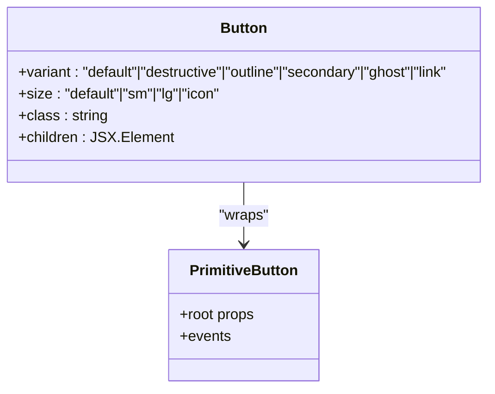

**Diagram sources**
- [button.tsx:1-54](file://src/components/ui/button.tsx#L1-L54)

**Section sources**
- [button.tsx:1-54](file://src/components/ui/button.tsx#L1-L54)

### Dialog
- Composition:
  - Portal centers content and ensures z-index stacking
  - Overlay animates in/out with fade transitions
  - Content supports responsive positioning and scroll behavior
  - Close button with semantic label
- Slots:
  - Header/Footer for layout
  - Title/Description for semantics
- Accessibility:
  - Focus trap, ARIA modal, keyboard support handled by primitives

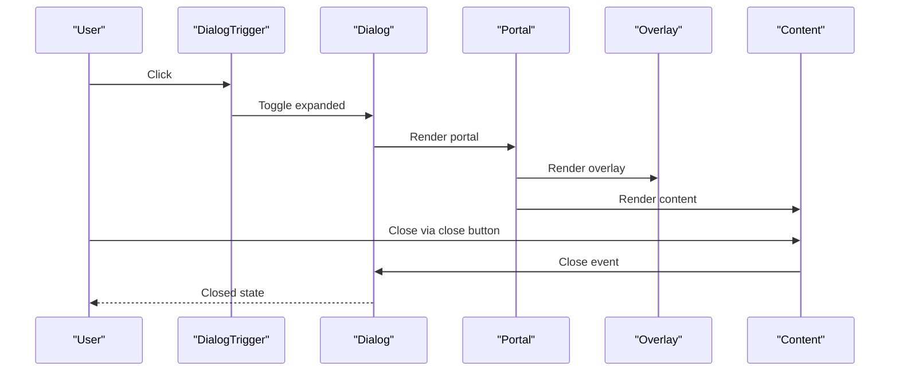

**Diagram sources**
- [dialog.tsx:1-142](file://src/components/ui/dialog.tsx#L1-L142)

**Section sources**
- [dialog.tsx:1-142](file://src/components/ui/dialog.tsx#L1-L142)

### Sheet
- Positioning:
  - Supports top, bottom, left, right slide-in panels
  - Animations align with position
- Props:
  - position, hideClose, class, children
- Accessibility:
  - Same focus and ARIA benefits as Dialog

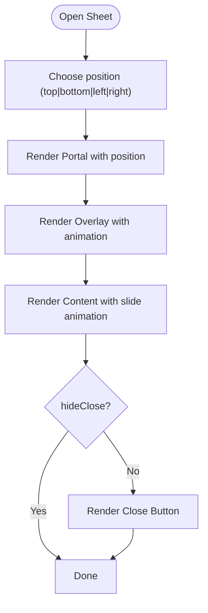

**Diagram sources**
- [sheet.tsx:1-175](file://src/components/ui/sheet.tsx#L1-L175)

**Section sources**
- [sheet.tsx:1-175](file://src/components/ui/sheet.tsx#L1-L175)

### DropdownMenu
- Provides a styled dropdown with animated entrance and focus management.
- Props:
  - Content: styled container
  - Item: styled list item

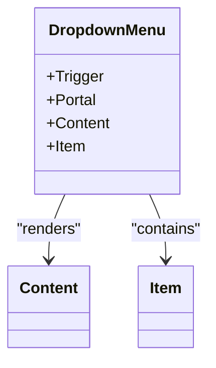

**Diagram sources**
- [dropdown-menu.tsx:1-36](file://src/components/ui/dropdown-menu.tsx#L1-L36)

**Section sources**
- [dropdown-menu.tsx:1-36](file://src/components/ui/dropdown-menu.tsx#L1-L36)

### Label
- Associates labels with form controls; forwards class for styling.

**Section sources**
- [label.tsx:1-20](file://src/components/ui/label.tsx#L1-L20)

### Card
- Layout primitives for consistent card-based UI.

**Section sources**
- [card.tsx:1-44](file://src/components/ui/card.tsx#L1-L44)

### Calendar
- Props:
  - value: active selection timestamp
  - from/to: selectable range boundaries
  - onChange: callback receiving timestamp
  - class: optional wrapper class
- Behavior:
  - Tracks view date and recomputes days memoized
  - Highlights today, selected, range start/end, and between dates
  - Navigation buttons adjust month
- Accessibility:
  - Buttons are keyboard focusable; semantic labels via aria attributes

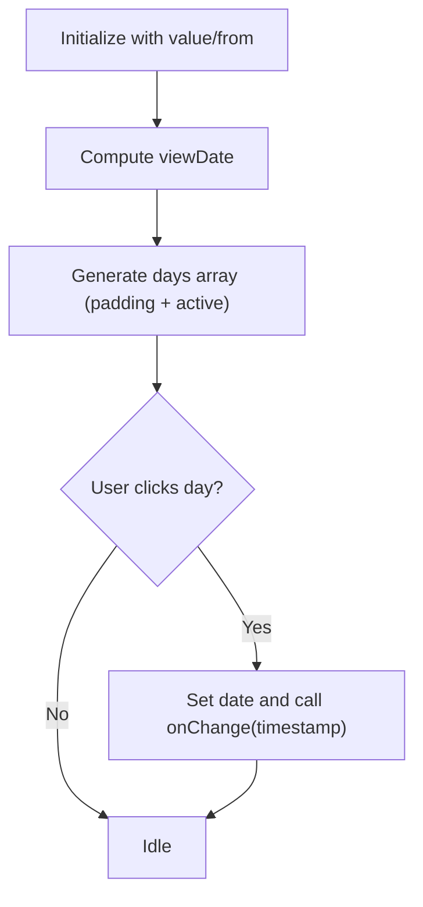

**Diagram sources**
- [calendar.tsx:1-183](file://src/components/ui/calendar.tsx#L1-L183)

**Section sources**
- [calendar.tsx:1-183](file://src/components/ui/calendar.tsx#L1-L183)

### ProductSelector
- Props:
  - products: Product[]
  - selectedIds: string[]
  - onSelect: (ids: string[]) => void
  - placeholder?: string
  - multiple?: boolean
  - label?: string
- Behavior:
  - Opens dropdown panel with search and filtered list
  - Supports single/multiple selection modes
  - Shows selected product(s) with images and pricing
  - Handles image fallbacks and clears search
- Accessibility:
  - Focus management in dropdown; keyboard navigation supported by list interactions

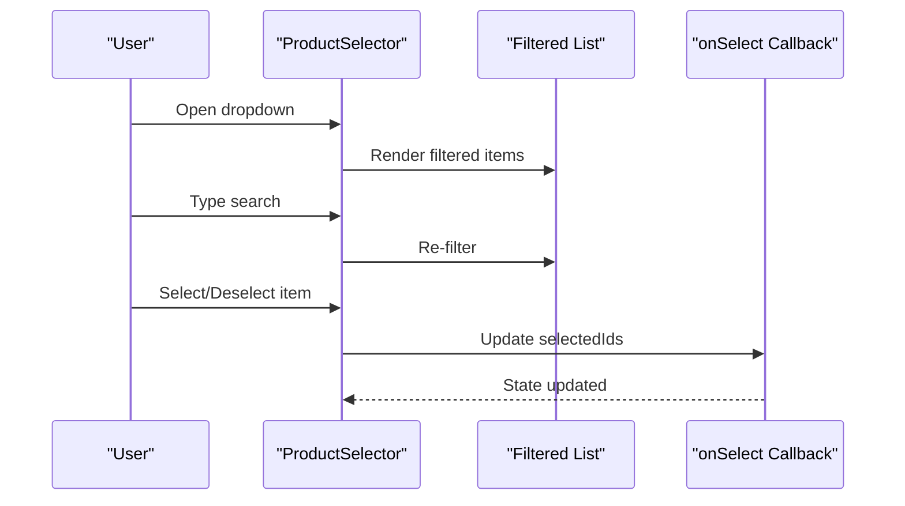

**Diagram sources**
- [product-selector.tsx:1-236](file://src/components/ui/product-selector.tsx#L1-L236)

**Section sources**
- [product-selector.tsx:1-236](file://src/components/ui/product-selector.tsx#L1-L236)
- [mockProducts.ts:1-85](file://src/data/mockProducts.ts#L1-L85)
- [db.ts:62-73](file://src/db/db.ts#L62-L73)

### VariantSelector
- Props:
  - product: Product | null
  - open: boolean
  - onOpenChange: (open: boolean) => void
  - initialVariants?: { groupName; optionName; priceModifier }[]
  - onConfirm: (variants) => void
  - confirmLabel?: string
- Behavior:
  - Initializes selections from product variants or initial mapping
  - Enforces required SINGLE groups
  - Computes effective base price and modifier totals
  - Validates required groups before confirming
- Accessibility:
  - Uses Sheet for bottom drawer with focus management

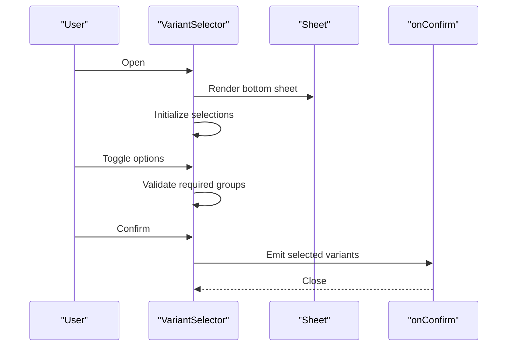

**Diagram sources**
- [VariantSelector.tsx:1-205](file://src/components/VariantSelector.tsx#L1-L205)

**Section sources**
- [VariantSelector.tsx:1-205](file://src/components/VariantSelector.tsx#L1-L205)
- [db.ts:36-49](file://src/db/db.ts#L36-L49)

### QrCodeGenerator
- Props:
  - value: string
  - size?: number
  - label?: string
  - subLabel?: string
  - plain?: boolean
- Behavior:
  - Generates QR code asynchronously on mount
  - Fallback UI on generation errors
  - Print-friendly grid layout with multiple themes and orientations
- Accessibility:
  - Non-decorative; labels provide context

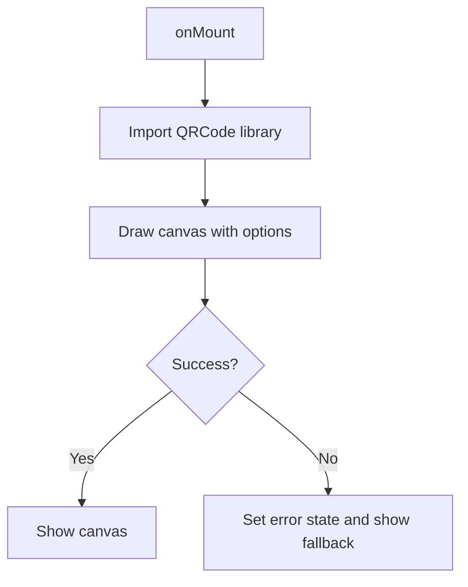

**Diagram sources**
- [QrCodeGenerator.tsx:1-222](file://src/components/QrCodeGenerator.tsx#L1-L222)

**Section sources**
- [QrCodeGenerator.tsx:1-222](file://src/components/QrCodeGenerator.tsx#L1-L222)

## Dependency Analysis
- Styling pipeline:
  - utils.cn() merges clsx and tailwind-merge for deterministic class ordering
  - Tailwind config defines theme tokens, animations, and dark mode strategy
  - ui.config.json maps aliases for components and utilities
- External libraries:
  - @kobalte/core for accessible overlays and menus
  - lucide-solid for icons
  - qrcode for QR generation
  - class-variance-authority for variant composition

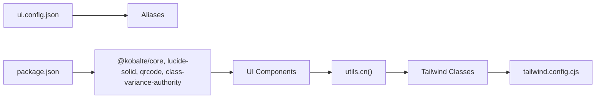

**Diagram sources**
- [utils.ts:1-7](file://src/lib/utils.ts#L1-L7)
- [tailwind.config.cjs:1-88](file://tailwind.config.cjs#L1-L88)
- [ui.config.json:1-13](file://ui.config.json#L1-L13)
- [package.json:1-56](file://package.json#L1-L56)

**Section sources**
- [utils.ts:1-7](file://src/lib/utils.ts#L1-L7)
- [tailwind.config.cjs:1-88](file://tailwind.config.cjs#L1-L88)
- [ui.config.json:1-13](file://ui.config.json#L1-L13)
- [package.json:1-56](file://package.json#L1-L56)

## Performance Considerations
- Memoization:
  - Calendar computes days memoized to avoid redundant renders
  - VariantSelector initializes selections via memoization on open
- Rendering:
  - ProductSelector filters and lists are rendered efficiently with keyed lists
  - QR generation deferred to onMount to prevent blocking render
- Theming and CSS:
  - Tailwind utilities keep styles declarative and scoped
  - Avoid excessive nested variants to minimize class churn

[No sources needed since this section provides general guidance]

## Troubleshooting Guide
- Dialog/Sheet not closing:
  - Ensure CloseButton is present and not hidden via hideClose
  - Verify that onOpenChange is wired correctly
- Calendar date mismatch:
  - Confirm value/from props update triggers viewDate recalculation
- ProductSelector image errors:
  - Image onError handlers insert fallback icons; verify network and image URLs
- QR generation failures:
  - Check console for import errors; fallback UI displays error state
- Accessibility:
  - Confirm focus trap and keyboard navigation via Kobalte primitives

**Section sources**
- [dialog.tsx:1-142](file://src/components/ui/dialog.tsx#L1-L142)
- [sheet.tsx:1-175](file://src/components/ui/sheet.tsx#L1-L175)
- [calendar.tsx:1-183](file://src/components/ui/calendar.tsx#L1-L183)
- [product-selector.tsx:1-236](file://src/components/ui/product-selector.tsx#L1-L236)
- [QrCodeGenerator.tsx:1-222](file://src/components/QrCodeGenerator.tsx#L1-L222)

## Conclusion
The NgePos UI component library combines accessible primitives, composability, and Tailwind-driven styling to deliver a cohesive, responsive, and extensible interface. The POS-specific components encapsulate domain logic while remaining customizable and testable. Following the patterns documented here ensures consistent behavior, accessibility, and maintainability across the application.

[No sources needed since this section summarizes without analyzing specific files]

## Appendices

### Responsive Design Principles
- Mobile-first breakpoints and spacing tokens from Tailwind
- Bottom navigation and sheet drawers optimized for touch targets
- Adaptive grids for print layouts (QR code grid)

**Section sources**
- [tailwind.config.cjs:1-88](file://tailwind.config.cjs#L1-L88)
- [BottomNav.tsx:31-64](file://src/components/BottomNav.tsx#L31-L64)
- [QrCodeGenerator.tsx:76-222](file://src/components/QrCodeGenerator.tsx#L76-L222)

### Accessibility Compliance
- Dialogs and Sheets manage focus traps and ARIA roles
- Buttons and form labels provide semantic context
- Keyboard navigation supported by primitives

**Section sources**
- [dialog.tsx:1-142](file://src/components/ui/dialog.tsx#L1-L142)
- [sheet.tsx:1-175](file://src/components/ui/sheet.tsx#L1-L175)
- [label.tsx:1-20](file://src/components/ui/label.tsx#L1-L20)
- [button.tsx:1-54](file://src/components/ui/button.tsx#L1-L54)

### Style Customization and Theming
- Extend button variants via the variant factory
- Customize Tailwind tokens and dark mode selectors
- Use cn() to merge additional classes safely

**Section sources**
- [button.tsx:1-54](file://src/components/ui/button.tsx#L1-L54)
- [tailwind.config.cjs:1-88](file://tailwind.config.cjs#L1-L88)
- [utils.ts:1-7](file://src/lib/utils.ts#L1-L7)

### Integration with TailwindCSS
- Configure alias paths and CSS entry in ui.config.json
- Ensure content paths include UI components

**Section sources**
- [ui.config.json:1-13](file://ui.config.json#L1-L13)

### Practical Examples and Best Practices
- Example usage patterns:
  - Dialog: Wrap content with Dialog and use Header/Footer slots
  - Sheet: Use bottom position for mobile-friendly drawers
  - ProductSelector: Wire onSelect to update cart store state
  - VariantSelector: Validate required groups before confirming
  - QrCodeGenerator: Use print grid for batch printing with themes
- Best practices:
  - Keep variant factories centralized for consistency
  - Prefer memoization for heavy computations
  - Use semantic labels and ARIA attributes for accessibility

**Section sources**
- [dialog.tsx:1-142](file://src/components/ui/dialog.tsx#L1-L142)
- [sheet.tsx:1-175](file://src/components/ui/sheet.tsx#L1-L175)
- [product-selector.tsx:1-236](file://src/components/ui/product-selector.tsx#L1-L236)
- [VariantSelector.tsx:1-205](file://src/components/VariantSelector.tsx#L1-L205)
- [QrCodeGenerator.tsx:1-222](file://src/components/QrCodeGenerator.tsx#L1-L222)

### Cross-Platform Compatibility
- SolidJS runs on web, SSR, and can be adapted to native via platform-specific renderers
- Kobalte primitives provide consistent behavior across environments
- QR generation relies on browser APIs; consider server-side alternatives for SSR

**Section sources**
- [package.json:1-56](file://package.json#L1-L56)
- [QrCodeGenerator.tsx:1-222](file://src/components/QrCodeGenerator.tsx#L1-L222)