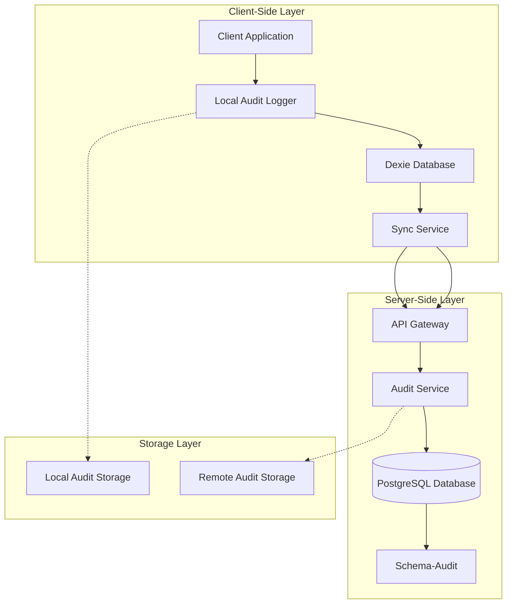
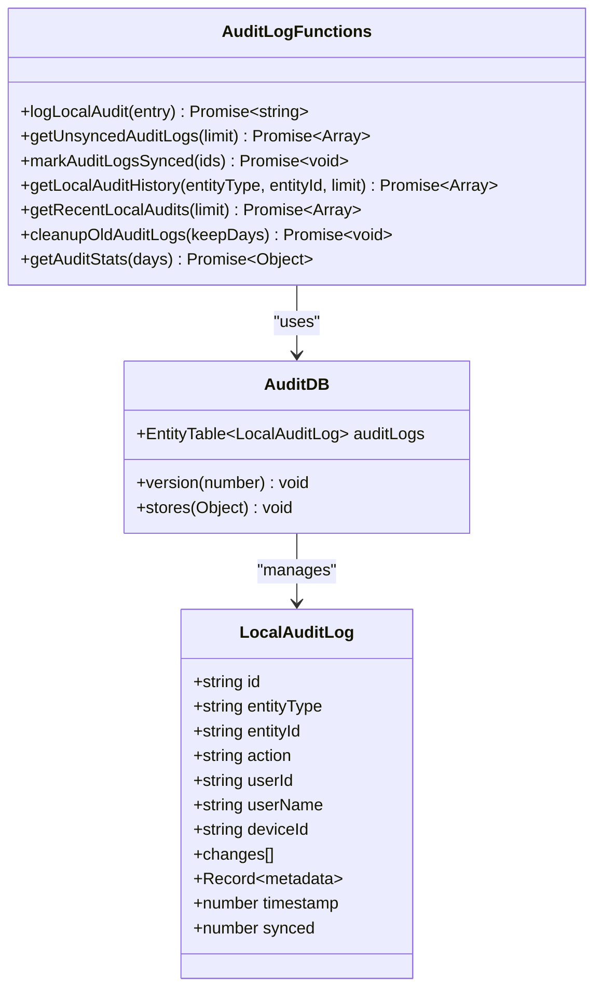
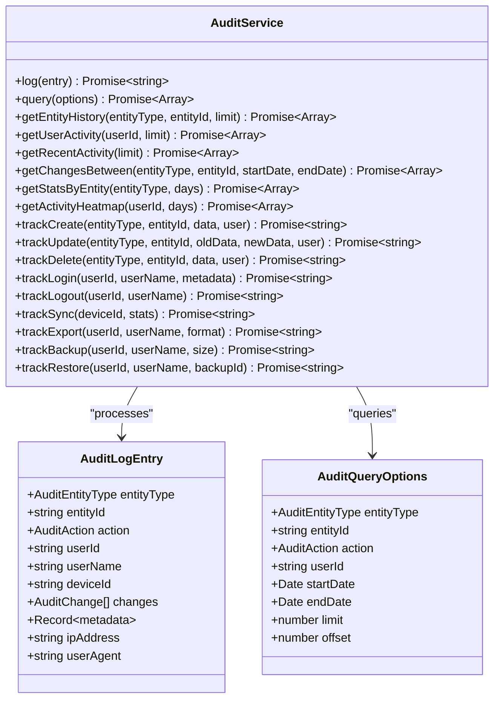
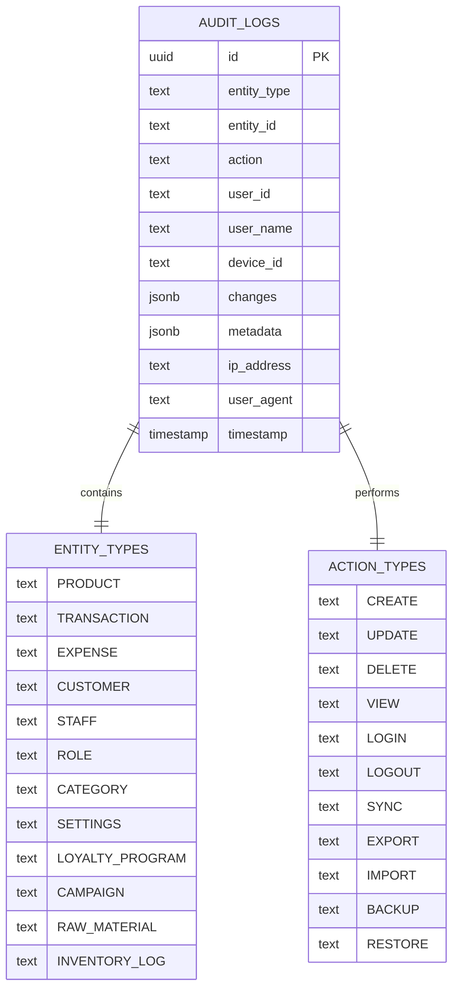
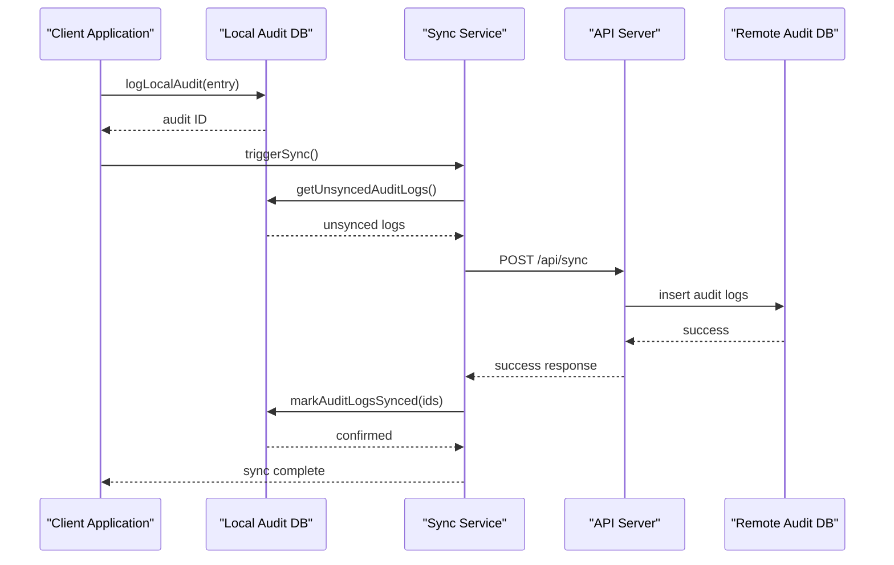
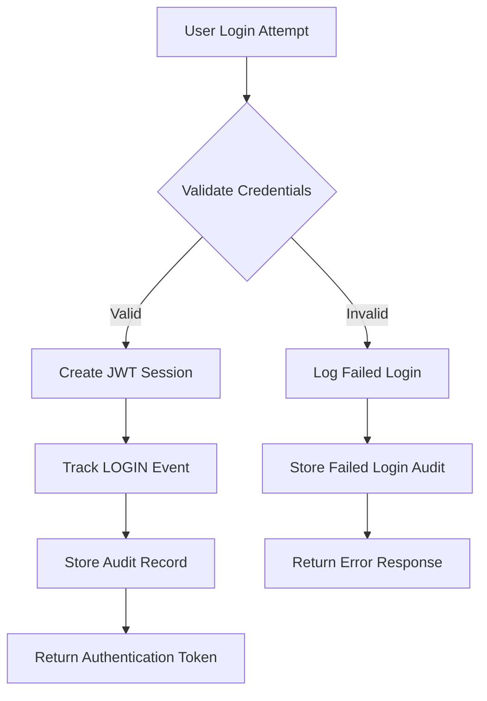

# Audit Logging System

<cite>
**Referenced Files in This Document**
- [auditLog.ts](file://src/lib/auditLog.ts)
- [auditService.ts](file://src/server/utils/auditService.ts)
- [schema-audit.ts](file://src/server/db/schema-audit.ts)
- [logger.ts](file://src/server/utils/logger.ts)
- [sync/index.ts](file://src/routes/api/sync/index.ts)
- [syncService.ts](file://src/lib/syncService.ts)
- [login.ts](file://src/routes/api/auth/login.ts)
</cite>

## Table of Contents
1. [Introduction](#introduction)
2. [System Architecture](#system-architecture)
3. [Core Components](#core-components)
4. [Data Model](#data-model)
5. [Audit Logging Implementation](#audit-logging-implementation)
6. [Synchronization Integration](#synchronization-integration)
7. [Usage Patterns](#usage-patterns)
8. [Performance Considerations](#performance-considerations)
9. [Monitoring and Analytics](#monitoring-and-analytics)
10. [Troubleshooting Guide](#troubleshooting-guide)
11. [Conclusion](#conclusion)

## Introduction

The Audit Logging System is a comprehensive solution designed to track and monitor all significant activities within the ngepos application. This system provides detailed audit trails for user actions, system events, and operational metrics, enabling compliance, security monitoring, and operational insights. The system operates on two primary levels: client-side local logging for immediate event capture and server-side centralized logging for persistent storage and analysis.

The audit logging system supports multiple entity types including products, transactions, expenses, customers, staff, roles, categories, settings, loyalty programs, campaigns, raw materials, and inventory logs. It captures various actions such as CREATE, UPDATE, DELETE, VIEW, LOGIN, LOGOUT, SYNC, EXPORT, IMPORT, BACKUP, and RESTORE operations.

## System Architecture

The audit logging system follows a distributed architecture with clear separation between client-side and server-side components:

**Diagram sources**
- [auditLog.ts:1-111](file://src/lib/auditLog.ts#L1-L111)
- [auditService.ts:1-298](file://src/server/utils/auditService.ts#L1-L298)
- [schema-audit.ts:1-84](file://src/server/db/schema-audit.ts#L1-L84)

The architecture ensures real-time logging capabilities while maintaining data consistency and performance across distributed operations.

## Core Components

### Local Audit Logger (Client-Side)

The client-side audit logger provides immediate event capture and local storage capabilities:

**Diagram sources**
- [auditLog.ts:3-15](file://src/lib/auditLog.ts#L3-L15)
- [auditLog.ts:17-25](file://src/lib/auditLog.ts#L17-L25)

### Server-Side Audit Service

The server-side audit service handles centralized logging and advanced analytics:

**Diagram sources**
- [auditService.ts:29-298](file://src/server/utils/auditService.ts#L29-L298)

**Section sources**
- [auditLog.ts:1-111](file://src/lib/auditLog.ts#L1-L111)
- [auditService.ts:1-298](file://src/server/utils/auditService.ts#L1-L298)

## Data Model

The audit logging system uses a comprehensive data model supporting multiple entity types and actions:

**Diagram sources**
- [schema-audit.ts:36-83](file://src/server/db/schema-audit.ts#L36-L83)

The data model supports detailed change tracking with field-level modifications, user identification, device information, and contextual metadata for comprehensive audit trails.

**Section sources**
- [schema-audit.ts:1-84](file://src/server/db/schema-audit.ts#L1-L84)

## Audit Logging Implementation

### Client-Side Logging Functions

The client-side implementation provides comprehensive logging capabilities for immediate event capture:

#### Local Audit Functions

| Function | Purpose | Parameters | Return Type |
|----------|---------|------------|-------------|
| `logLocalAudit(entry)` | Creates a new local audit entry | Audit entry without ID/timestamp/synced | Promise<string> (entry ID) |
| `getUnsyncedAuditLogs(limit)` | Retrieves unsynchronized logs | Optional limit (default: 100) | Promise<Array<LocalAuditLog>> |
| `markAuditLogsSynced(ids)` | Marks logs as synchronized | Array of log IDs | Promise<void> |
| `getLocalAuditHistory(entityType, entityId, limit)` | Gets audit history for entity | Optional filters + limit | Promise<Array<LocalAuditLog>> |
| `getRecentLocalAudits(limit)` | Gets most recent audits | Limit (default: 100) | Promise<Array<LocalAuditLog>> |
| `cleanupOldAuditLogs(keepDays)` | Removes old audit logs | Days to keep (default: 30) | Promise<void> |
| `getAuditStats(days)` | Gets audit statistics | Days range (default: 7) | Promise<Object> |

#### Server-Side Audit Operations

| Method | Purpose | Parameters | Return Type |
|--------|---------|------------|-------------|
| `log(entry)` | Inserts audit record | AuditLogEntry | Promise<string> |
| `query(options)` | Searches audit records | AuditQueryOptions | Promise<Array> |
| `trackCreate()` | Logs entity creation | Entity details + user | Promise<string> |
| `trackUpdate()` | Logs entity updates | Old/new data + user | Promise<string> |
| `trackDelete()` | Logs entity deletion | Entity data + user | Promise<string> |
| `trackLogin()` | Logs user login | User credentials + metadata | Promise<string> |
| `trackLogout()` | Logs user logout | User credentials | Promise<string> |
| `trackSync()` | Logs synchronization | Device info + stats | Promise<string> |
| `trackExport()` | Logs data export | User + format | Promise<string> |
| `trackBackup()` | Logs backup operation | User + size | Promise<string> |
| `trackRestore()` | Logs restore operation | User + backup ID | Promise<string> |

**Section sources**
- [auditLog.ts:27-111](file://src/lib/auditLog.ts#L27-L111)
- [auditService.ts:30-298](file://src/server/utils/auditService.ts#L30-L298)

## Synchronization Integration

The audit logging system integrates seamlessly with the synchronization service to maintain data consistency across client and server:

**Diagram sources**
- [auditLog.ts:40-53](file://src/lib/auditLog.ts#L40-L53)
- [syncService.ts:12-75](file://src/lib/syncService.ts#L12-L75)
- [sync/index.ts:10-155](file://src/routes/api/sync/index.ts#L10-L155)

The synchronization process includes exponential backoff for retry mechanisms, debouncing to prevent server overload, and comprehensive error handling for various failure scenarios.

**Section sources**
- [syncService.ts:1-111](file://src/lib/syncService.ts#L1-L111)
- [sync/index.ts:1-155](file://src/routes/api/sync/index.ts#L1-L155)

## Usage Patterns

### Authentication Event Tracking

The system automatically tracks authentication events for security monitoring:

**Diagram sources**
- [login.ts:13-79](file://src/routes/api/auth/login.ts#L13-L79)
- [auditService.ts:233-252](file://src/server/utils/auditService.ts#L233-L252)

### CRUD Operation Logging

The system provides comprehensive logging for database operations:

| Operation | Trigger Point | Audit Details | Change Tracking |
|-----------|---------------|---------------|-----------------|
| CREATE | After successful insert | Entity type + ID, user info | Field values as new data |
| UPDATE | Before/after update | Old vs new values, diff | Field-level changes |
| DELETE | Before delete | Entity data snapshot | Fields as deleted values |
| VIEW | On data retrieval | Access pattern, filters | N/A |
| SYNC | On successful sync | Device info, counts | N/A |
| EXPORT | On export completion | Format, size, records | N/A |
| BACKUP | On backup completion | Size, files, timestamp | N/A |
| RESTORE | On restore completion | Backup ID, success/failure | N/A |

**Section sources**
- [auditService.ts:162-294](file://src/server/utils/auditService.ts#L162-L294)

## Performance Considerations

### Indexing Strategy

The audit system employs strategic indexing for optimal query performance:

| Index | Columns | Purpose | Query Patterns |
|-------|---------|---------|----------------|
| idx_audit_logs_entity | entityType, entityId | Entity-specific queries | History lookup, filtering |
| idx_audit_logs_user | userId | User activity tracking | User timeline, permissions |
| idx_audit_logs_timestamp | timestamp | Time-based queries | Recent activity, reports |
| idx_audit_logs_action | action | Action-type filtering | Activity analysis |

### Storage Management

The system implements automatic cleanup policies to manage storage growth:

- **Default Retention**: 30 days for local audit logs
- **Cleanup Frequency**: Daily maintenance operations
- **Size Limits**: Configurable limits for concurrent operations
- **Memory Management**: Efficient pagination for large datasets

### Synchronization Optimization

- **Batch Processing**: Groups multiple audit entries for efficient transfer
- **Conflict Resolution**: Handles concurrent modifications gracefully
- **Compression**: Reduces network bandwidth for audit data
- **Caching**: Minimizes repeated queries for frequently accessed data

**Section sources**
- [auditLog.ts:80-87](file://src/lib/auditLog.ts#L80-L87)
- [schema-audit.ts:78-83](file://src/server/db/schema-audit.ts#L78-L83)

## Monitoring and Analytics

### Real-Time Dashboards

The audit system supports comprehensive monitoring through:

- **Activity Heatmaps**: User activity patterns by time and day
- **Action Statistics**: Distribution of audit actions over time
- **Entity Trends**: Popular entities and their activity levels
- **User Analytics**: Individual user activity and permissions

### Reporting Capabilities

Advanced reporting features include:

- **Custom Time Ranges**: Flexible date-based filtering
- **Entity-Specific Reports**: Detailed activity for specific resources
- **User Activity Logs**: Complete audit trails per user
- **Export Functionality**: Data export in multiple formats

### Alerting System

The system can trigger alerts for:

- **Security Events**: Unusual login patterns, failed attempts
- **Critical Actions**: Modifications to sensitive data
- **System Events**: Backup failures, sync issues
- **Performance Issues**: Slow queries, storage warnings

**Section sources**
- [auditService.ts:142-160](file://src/server/utils/auditService.ts#L142-L160)
- [auditService.ts:123-140](file://src/server/utils/auditService.ts#L123-L140)

## Troubleshooting Guide

### Common Issues and Solutions

#### Audit Logs Not Syncing

**Symptoms**: Local logs accumulate but never sync to server
**Causes**: 
- Network connectivity issues
- Authentication failures
- Server-side validation errors
- Rate limiting restrictions

**Solutions**:
1. Verify network connectivity and server availability
2. Check authentication tokens and permissions
3. Review server logs for validation errors
4. Monitor rate limit counters

#### Performance Degradation

**Symptoms**: Slow audit queries, memory issues
**Causes**:
- Large audit datasets
- Missing indexes
- Inefficient queries
- Memory leaks

**Solutions**:
1. Implement proper indexing strategy
2. Add pagination to queries
3. Configure cleanup policies
4. Monitor query performance

#### Data Consistency Issues

**Symptoms**: Duplicate entries, missing logs
**Causes**:
- Concurrent operations
- Network interruptions
- Database conflicts
- Race conditions

**Solutions**:
1. Implement proper locking mechanisms
2. Add conflict resolution strategies
3. Use transactional operations
4. Monitor for race conditions

### Debugging Tools

The system provides comprehensive debugging capabilities:

- **Structured Logging**: Consistent log formatting with timestamps
- **Error Tracking**: Detailed error messages and stack traces
- **Performance Metrics**: Query timing and resource usage
- **Audit Trail Analysis**: Complete event reconstruction

**Section sources**
- [logger.ts:1-69](file://src/server/utils/logger.ts#L1-L69)
- [auditLog.ts:48-53](file://src/lib/auditLog.ts#L48-L53)

## Conclusion

The Audit Logging System provides a robust, scalable solution for comprehensive event tracking and monitoring within the ngepos application. The system's dual-layer architecture ensures reliable logging capabilities while maintaining performance and data integrity across distributed operations.

Key strengths of the system include:

- **Comprehensive Coverage**: Supports all major entity types and actions
- **Real-Time Processing**: Immediate client-side logging with asynchronous synchronization
- **Advanced Analytics**: Built-in reporting and monitoring capabilities
- **Performance Optimization**: Strategic indexing and storage management
- **Security Focus**: Detailed audit trails for compliance and security monitoring

The system successfully balances immediate operational needs with long-term analytical requirements, providing valuable insights into application usage patterns, user behavior, and system performance. Future enhancements could include additional analytics capabilities, extended retention policies, and enhanced alerting mechanisms.