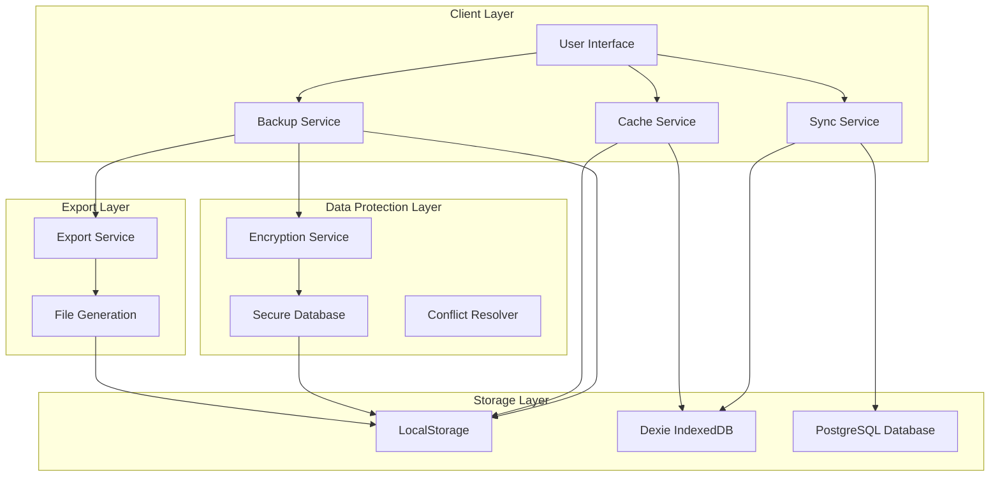
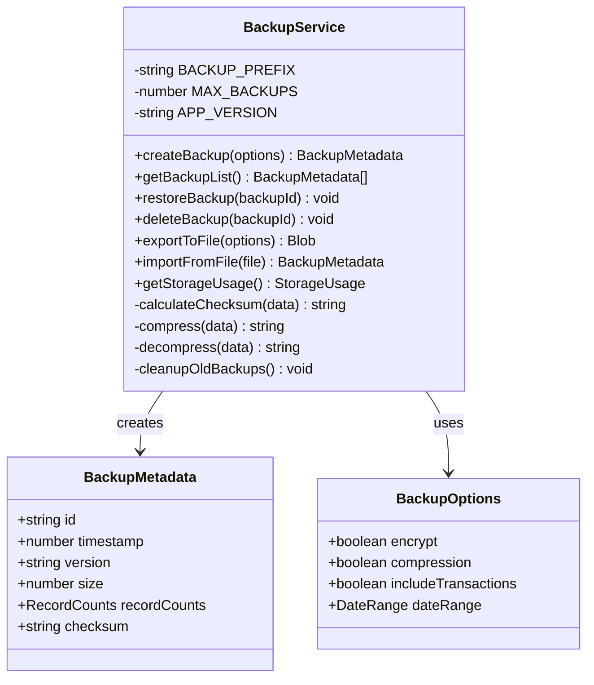
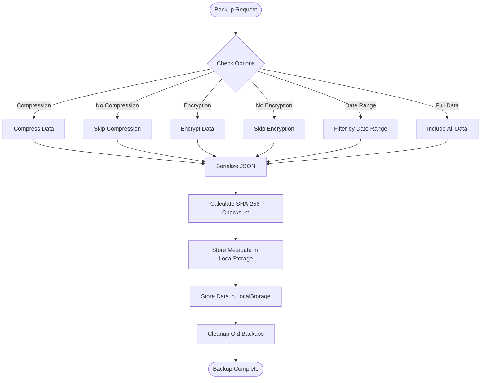
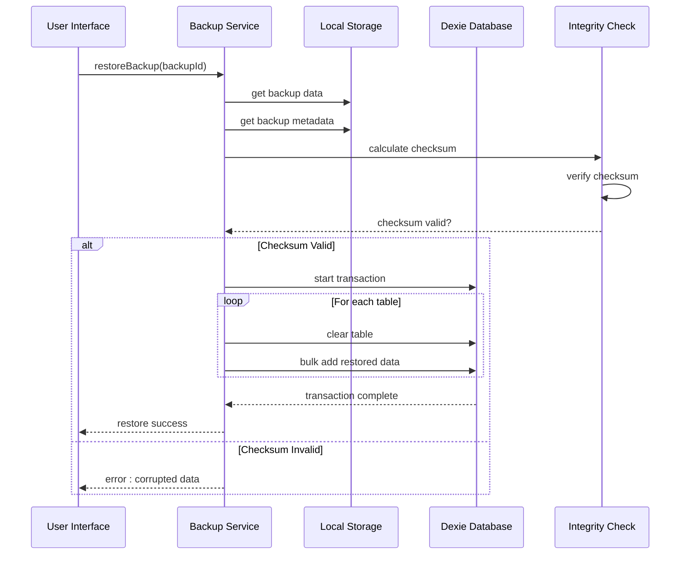
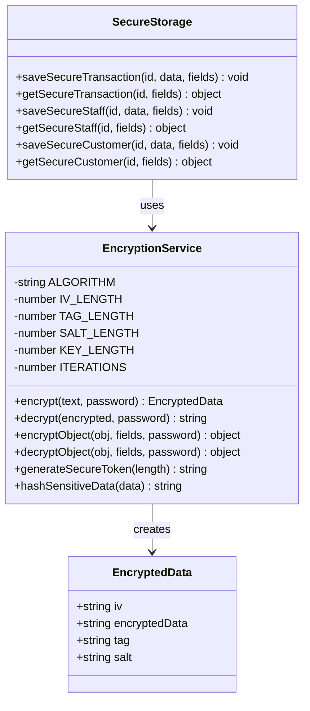
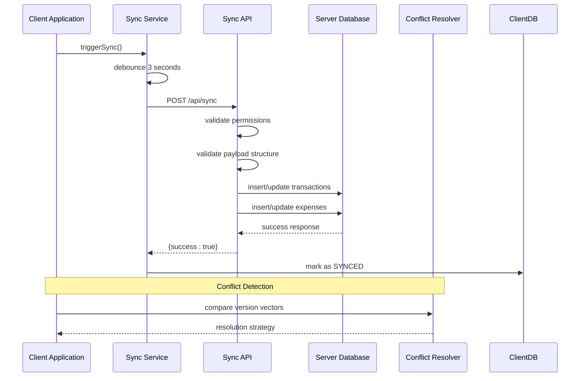
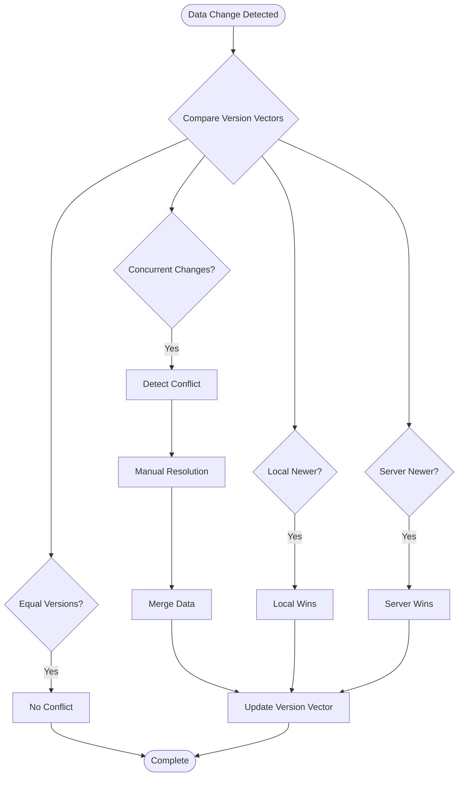
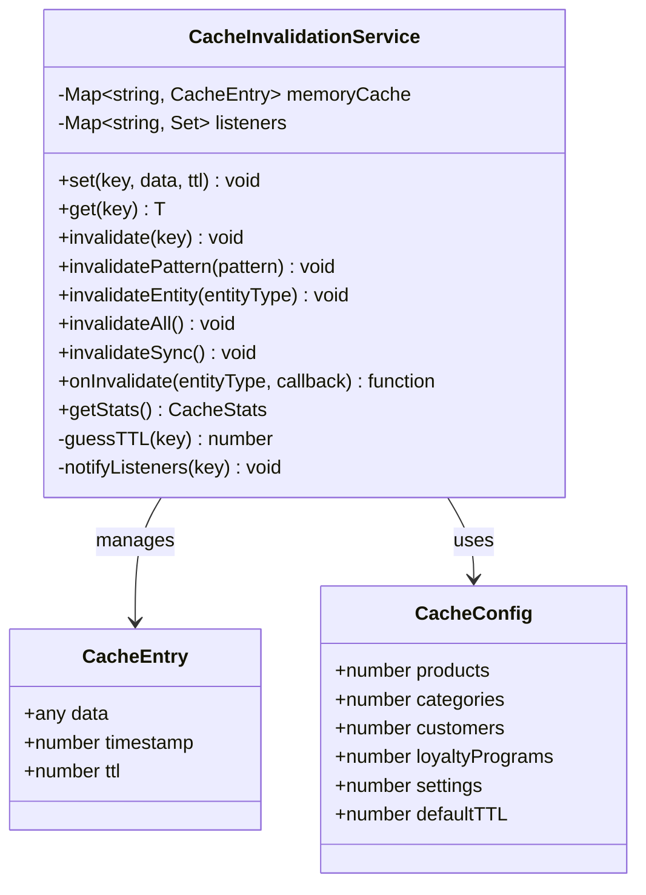
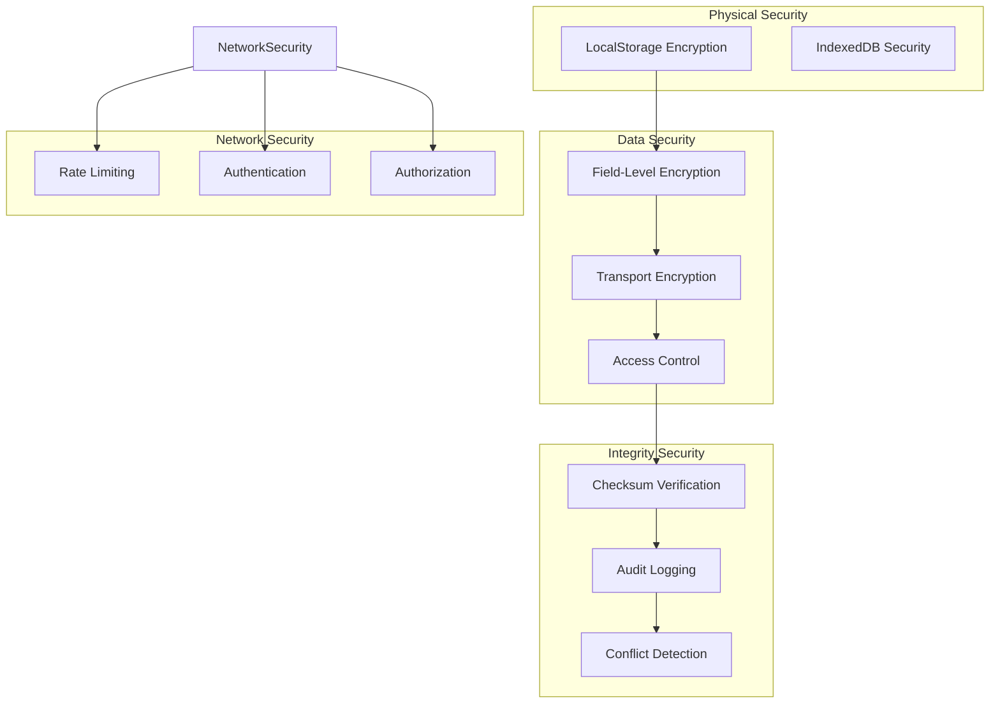

# Backup and Recovery System

<cite>
**Referenced Files in This Document**
- [backupService.ts](file://src/lib/backupService.ts)
- [exportService.ts](file://src/lib/exportService.ts)
- [secureDb.ts](file://src/lib/secureDb.ts)
- [encryption.ts](file://src/lib/encryption.ts)
- [syncService.ts](file://src/lib/syncService.ts)
- [index.ts](file://src/routes/api/sync/index.ts)
- [db.ts](file://src/db/db.ts)
- [schema.ts](file://src/server/db/schema.ts)
- [conflictResolution.ts](file://src/lib/conflictResolution.ts)
- [cacheInvalidation.ts](file://src/lib/cacheInvalidation.ts)
</cite>

## Table of Contents
1. [Introduction](#introduction)
2. [System Architecture](#system-architecture)
3. [Backup Service](#backup-service)
4. [Recovery and Restore](#recovery-and-restore)
5. [Data Encryption](#data-encryption)
6. [Synchronization System](#synchronization-system)
7. [Conflict Resolution](#conflict-resolution)
8. [Cache Management](#cache-management)
9. [Security Considerations](#security-considerations)
10. [Performance Analysis](#performance-analysis)
11. [Troubleshooting Guide](#troubleshooting-guide)
12. [Conclusion](#conclusion)

## Introduction

The NGEPOS backup and recovery system is a comprehensive data protection solution designed to ensure business continuity and data integrity for point-of-sale operations. This system provides multiple layers of protection including local backup storage, secure data encryption, automated synchronization, and robust recovery mechanisms.

The system operates on a hybrid approach combining client-side local storage with server-side PostgreSQL database, offering both immediate local access and centralized data management. It supports various backup strategies including selective data backup, date-range filtering, and compression capabilities.

## System Architecture

The backup and recovery system follows a multi-tiered architecture with distinct components handling different aspects of data protection:

**Diagram sources**
- [backupService.ts:30-264](file://src/lib/backupService.ts#L30-L264)
- [syncService.ts:8-111](file://src/lib/syncService.ts#L8-L111)
- [encryption.ts:1-151](file://src/lib/encryption.ts#L1-L151)

## Backup Service

The backup service provides comprehensive data backup capabilities with multiple configuration options and integrity verification.

### Core Backup Features

The backup service implements a sophisticated backup mechanism with the following key features:

**Diagram sources**
- [backupService.ts:30-264](file://src/lib/backupService.ts#L30-L264)

### Backup Data Structure

The backup system captures comprehensive data including:

| Data Category | Tables Included | Purpose |
|---------------|----------------|---------|
| **Core Data** | products, categories, staff, roles | Essential business data |
| **Customer Data** | customers, loyaltyPrograms, customerStamps, customerRewards | Customer relationship management |
| **Inventory Data** | rawMaterialLibrary, inventoryLogs, discounts, bundles | Stock and inventory tracking |
| **Campaign Data** | campaigns, campaignItems, campaignRewards | Promotional activities |
| **Financial Data** | transactions, transactionItems, expenses | Revenue and expense tracking |

### Backup Options and Configuration

The backup service supports flexible configuration through the `BackupOptions` interface:

**Diagram sources**
- [backupService.ts:57-131](file://src/lib/backupService.ts#L57-L131)

**Section sources**
- [backupService.ts:3-28](file://src/lib/backupService.ts#L3-L28)
- [backupService.ts:57-131](file://src/lib/backupService.ts#L57-L131)

## Recovery and Restore

The recovery system provides robust restoration capabilities with integrity verification and transactional safety.

### Restore Process Architecture

**Diagram sources**
- [backupService.ts:133-177](file://src/lib/backupService.ts#L133-L177)

### Recovery Validation

The system implements comprehensive validation mechanisms:

1. **Checksum Verification**: SHA-256 hash comparison ensures data integrity
2. **Metadata Validation**: Backup metadata verification prevents corrupted restores
3. **Transaction Safety**: Atomic database operations ensure rollback capability
4. **Data Type Validation**: Structured data validation prevents malformed restores

**Section sources**
- [backupService.ts:133-177](file://src/lib/backupService.ts#L133-L177)

## Data Encryption

The encryption system provides multiple layers of data protection for sensitive information.

### Encryption Implementation

**Diagram sources**
- [encryption.ts:1-151](file://src/lib/encryption.ts#L1-L151)
- [secureDb.ts:29-132](file://src/lib/secureDb.ts#L29-L132)

### Sensitive Data Protection

The system encrypts critical data fields:

| Data Type | Sensitive Fields | Encryption Method |
|-----------|------------------|-------------------|
| **Transactions** | receiptNumber, paymentMethod, cashierName | AES-256-GCM |
| **Staff** | password, pin, otpCode | AES-256-GCM |
| **Customers** | phone, email | AES-256-GCM |

### Key Management

The encryption system implements secure key management:

1. **Dynamic Key Generation**: Random 32-byte keys for each installation
2. **PBKDF2 Derivation**: Password-based key derivation with 100,000 iterations
3. **Salt Generation**: Unique random salts for each encrypted field
4. **Automatic Key Storage**: Secure local storage with fallback mechanisms

**Section sources**
- [encryption.ts:17-125](file://src/lib/encryption.ts#L17-L125)
- [secureDb.ts:55-129](file://src/lib/secureDb.ts#L55-L129)

## Synchronization System

The synchronization service provides reliable data synchronization between client and server with conflict detection and resolution.

### Sync Architecture

**Diagram sources**
- [syncService.ts:12-75](file://src/lib/syncService.ts#L12-L75)
- [index.ts:10-155](file://src/routes/api/sync/index.ts#L10-L155)

### Sync Configuration

The synchronization system includes several protective mechanisms:

| Feature | Implementation | Purpose |
|---------|----------------|---------|
| **Rate Limiting** | 20 requests per minute per IP | Prevent abuse and server overload |
| **Authentication** | Bearer token validation | Secure API access |
| **Payload Validation** | Structured validation | Data integrity assurance |
| **Transactional Inserts** | PostgreSQL atomic operations | Data consistency |
| **Exponential Backoff** | Up to 5 retry attempts | Resilient network handling |

**Section sources**
- [syncService.ts:4-111](file://src/lib/syncService.ts#L4-L111)
- [index.ts:10-155](file://src/routes/api/sync/index.ts#L10-L155)

## Conflict Resolution

The conflict resolution system handles data conflicts that occur during synchronization using advanced version vector comparison.

### Conflict Detection and Resolution

**Diagram sources**
- [conflictResolution.ts:33-258](file://src/lib/conflictResolution.ts#L33-L258)

### Version Vector Management

The system maintains distributed version vectors for conflict-free replication:

| Vector Type | Purpose | Example |
|-------------|---------|---------|
| **Local Vector** | Tracks local changes | `{device1: 5, device2: 2}` |
| **Server Vector** | Tracks server changes | `{server: 7}` |
| **Merged Vector** | Combined state | `{device1: 5, device2: 3, server: 7}` |

### Conflict Resolution Strategies

The system supports multiple conflict resolution strategies:

1. **Local Wins**: Local changes take precedence
2. **Server Wins**: Server changes take precedence  
3. **Last Write Wins**: Most recent timestamp wins
4. **Manual Resolution**: Human intervention required
5. **Smart Merge**: Intelligent field-by-field merging

**Section sources**
- [conflictResolution.ts:1-258](file://src/lib/conflictResolution.ts#L1-L258)

## Cache Management

The cache invalidation service provides intelligent caching with automatic invalidation and TTL management.

### Cache Architecture

**Diagram sources**
- [cacheInvalidation.ts:29-171](file://src/lib/cacheInvalidation.ts#L29-L171)

### Cache Configuration

The cache system implements intelligent TTL (Time-To-Live) policies:

| Entity Type | TTL Duration | Purpose |
|-------------|--------------|---------|
| **Products** | 10 minutes | Frequently changing product data |
| **Categories** | 30 minutes | Relatively static category data |
| **Customers** | 5 minutes | Customer data with moderate changes |
| **Loyalty Programs** | 15 minutes | Dynamic loyalty calculations |
| **Settings** | 1 hour | Configuration data |
| **Default** | 5 minutes | Generic entity caching |

### Cache Invalidation Triggers

The system automatically invalidates cache entries on data changes:

1. **Direct Invalidation**: Specific entity updates
2. **Pattern Matching**: Bulk invalidation by entity type
3. **Sync Events**: Cache invalidation during sync operations
4. **Database Hooks**: Automatic invalidation on database changes

**Section sources**
- [cacheInvalidation.ts:18-171](file://src/lib/cacheInvalidation.ts#L18-L171)

## Security Considerations

The backup and recovery system implements comprehensive security measures to protect sensitive data.

### Security Layers

### Security Features

| Security Aspect | Implementation | Protection Level |
|-----------------|----------------|------------------|
| **Data At Rest** | AES-256-GCM encryption | High |
| **Data In Transit** | HTTPS/TLS encryption | High |
| **Access Control** | JWT token validation | Medium |
| **Rate Limiting** | 20 requests/minute/IP | Medium |
| **Integrity Checking** | SHA-256 checksums | High |
| **Audit Logging** | Comprehensive logging | Medium |
| **Conflict Prevention** | Version vector system | High |

### Compliance Considerations

The system addresses several compliance requirements:

1. **Data Protection**: Encryption of sensitive personal data
2. **Audit Trails**: Comprehensive logging of backup and restore operations
3. **Access Controls**: Proper authentication and authorization
4. **Data Retention**: Configurable backup retention policies
5. **Disaster Recovery**: Automated backup and recovery procedures

## Performance Analysis

The backup and recovery system is designed for optimal performance with efficient resource utilization.

### Performance Metrics

| Operation | Time Complexity | Space Complexity | Notes |
|-----------|----------------|------------------|-------|
| **Backup Creation** | O(n) where n = total records | O(n) | Linear with data volume |
| **Backup Restoration** | O(n) | O(n) | Transactional operations |
| **Integrity Check** | O(n) | O(1) | SHA-256 computation |
| **Sync Operations** | O(n) | O(1) | Batch processing |
| **Conflict Resolution** | O(k) | O(k) | k = conflicting fields |

### Memory Management

The system implements efficient memory management:

1. **Lazy Loading**: Data loaded only when needed
2. **Compression**: Optional data compression reduces storage
3. **Cleanup**: Automatic removal of old backups
4. **Cache Management**: Intelligent caching with TTL expiration

### Scalability Considerations

The system scales effectively with increasing data volumes:

1. **Incremental Backups**: Future enhancement possibility
2. **Parallel Processing**: Multi-threaded operations
3. **Database Optimization**: Efficient indexing and queries
4. **Storage Optimization**: Configurable storage limits

## Troubleshooting Guide

Common issues and their solutions in the backup and recovery system.

### Backup Issues

**Problem**: Backup creation fails with "Insufficient Storage"
- **Cause**: Local storage quota exceeded (5MB limit)
- **Solution**: Delete old backups using `backupService.deleteBackup()`
- **Prevention**: Monitor storage usage with `backupService.getStorageUsage()`

**Problem**: Backup integrity check fails
- **Cause**: Data corruption or tampering
- **Solution**: Recreate backup or restore from previous backup
- **Prevention**: Verify checksum before storing backup data

**Problem**: Backup compression fails
- **Cause**: Large data size causing memory issues
- **Solution**: Disable compression or split backup into smaller chunks
- **Prevention**: Test compression with representative data sizes

### Restore Issues

**Problem**: Restore operation fails with "Backup data not found"
- **Cause**: Corrupted or missing backup files
- **Solution**: Verify backup exists in LocalStorage with correct naming
- **Prevention**: Implement backup validation before restore operations

**Problem**: Partial restore occurs
- **Cause**: Transaction failure during restore process
- **Solution**: Check database transaction logs and retry restore
- **Prevention**: Ensure sufficient disk space before restore

### Synchronization Issues

**Problem**: Sync operations fail with rate limiting
- **Cause**: Exceeded rate limit (20 requests/minute/IP)
- **Solution**: Wait for rate limit reset or reduce sync frequency
- **Prevention**: Implement exponential backoff in client applications

**Problem**: Authentication failures during sync
- **Cause**: Expired or invalid authentication tokens
- **Solution**: Refresh authentication token and retry sync
- **Prevention**: Implement automatic token refresh mechanisms

### Encryption Issues

**Problem**: Decryption fails with "Invalid encrypted data"
- **Cause**: Corrupted encrypted data or wrong key
- **Solution**: Recreate encryption key or restore from backup
- **Prevention**: Implement proper error handling and validation

**Problem**: Performance degradation with encryption
- **Cause**: Large dataset encryption overhead
- **Solution**: Use selective encryption for sensitive fields only
- **Prevention**: Profile encryption performance with representative datasets

**Section sources**
- [backupService.ts:133-177](file://src/lib/backupService.ts#L133-L177)
- [syncService.ts:69-100](file://src/lib/syncService.ts#L69-L100)
- [encryption.ts:42-104](file://src/lib/encryption.ts#L42-L104)

## Conclusion

The NGEPOS backup and recovery system provides a comprehensive solution for data protection and business continuity. The system combines multiple layers of security, efficient synchronization, and robust recovery mechanisms to ensure reliable data management.

### Key Strengths

1. **Multi-Layer Security**: Encryption, access controls, and integrity verification
2. **Flexible Backup Options**: Selective data backup with compression and encryption
3. **Robust Recovery**: Transactional restores with integrity verification
4. **Conflict Resolution**: Advanced version vector system for distributed data
5. **Performance Optimization**: Efficient caching and memory management
6. **Scalability**: Designed to handle growing data volumes efficiently

### Future Enhancements

Potential improvements for future development:

1. **Incremental Backups**: Reduce backup time and storage requirements
2. **Cloud Integration**: Centralized backup storage with encryption
3. **Advanced Compression**: More efficient compression algorithms
4. **Real-time Sync**: WebSocket-based real-time synchronization
5. **Enhanced Conflict Resolution**: Machine learning-based conflict detection
6. **Monitoring and Alerts**: Comprehensive monitoring dashboard

The system successfully balances security, performance, and usability while providing comprehensive data protection for POS operations.