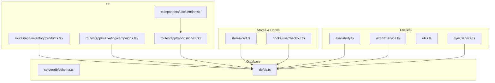
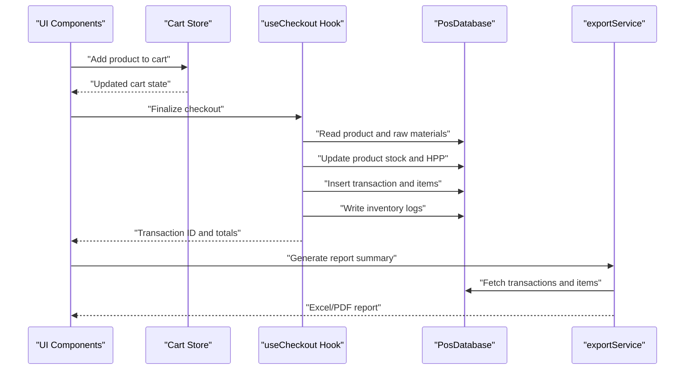
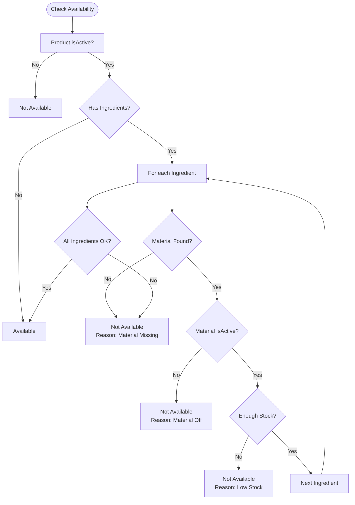
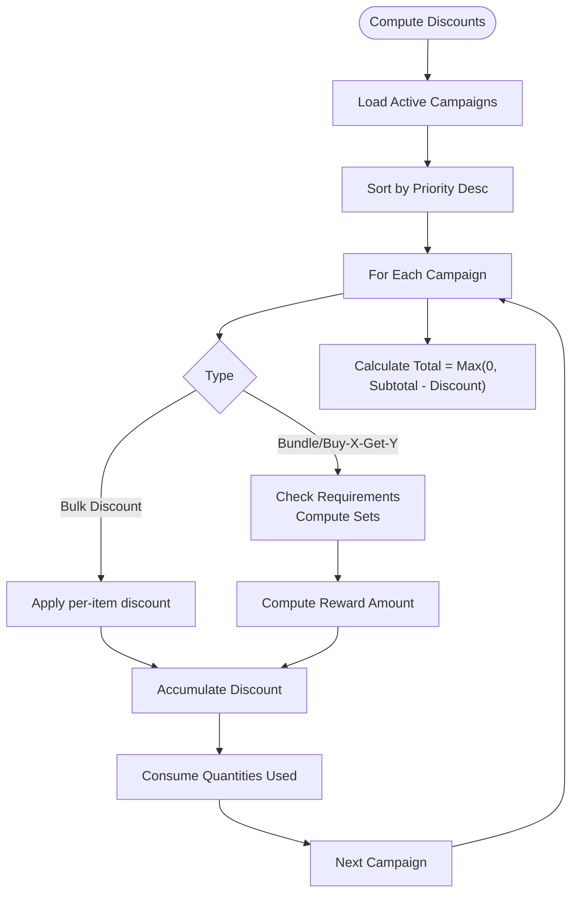
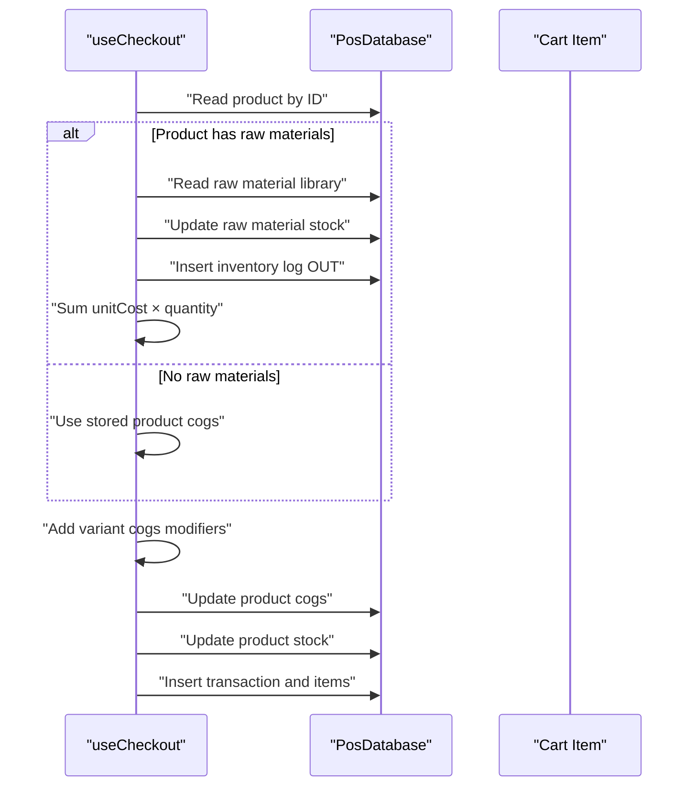
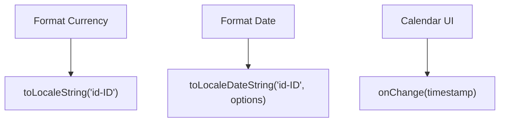
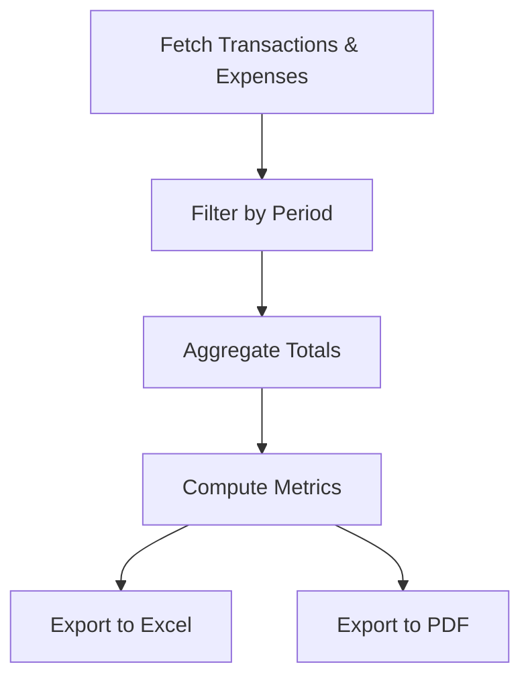
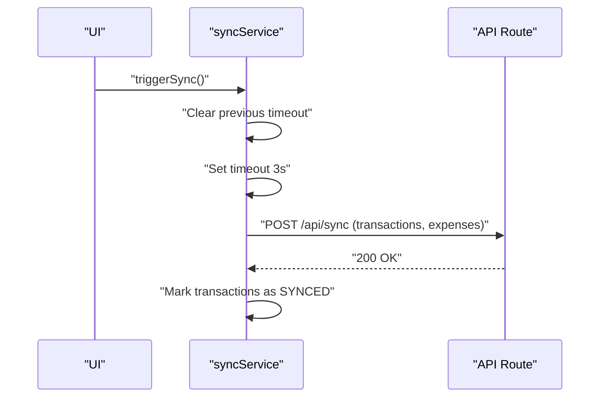
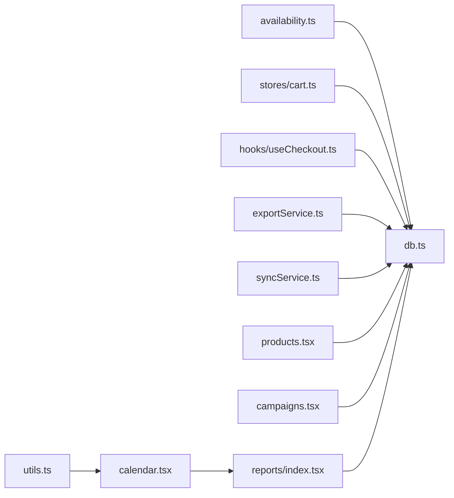

# Business Utilities

<cite>
**Referenced Files in This Document**
- [availability.ts](file://src/lib/availability.ts)
- [exportService.ts](file://src/lib/exportService.ts)
- [utils.ts](file://src/lib/utils.ts)
- [syncService.ts](file://src/lib/syncService.ts)
- [cart.ts](file://src/stores/cart.ts)
- [useCheckout.ts](file://src/hooks/useCheckout.ts)
- [schema.ts](file://src/server/db/schema.ts)
- [db.ts](file://src/db/db.ts)
- [products.tsx](file://src/routes/app/inventory/products.tsx)
- [campaigns.tsx](file://src/routes/app/marketing/campaigns.tsx)
- [index.tsx](file://src/routes/app/reports/index.tsx)
- [calendar.tsx](file://src/components/ui/calendar.tsx)
- [loyalty.ts](file://src/stores/loyalty.ts)
</cite>

## Table of Contents
1. [Introduction](#introduction)
2. [Project Structure](#project-structure)
3. [Core Components](#core-components)
4. [Architecture Overview](#architecture-overview)
5. [Detailed Component Analysis](#detailed-component-analysis)
6. [Dependency Analysis](#dependency-analysis)
7. [Performance Considerations](#performance-considerations)
8. [Troubleshooting Guide](#troubleshooting-guide)
9. [Conclusion](#conclusion)

## Introduction
This document focuses on the business logic utilities that power inventory availability checks, pricing and promotion calculations, financial reporting, and operational data handling in the NgePos POS system. It explains how raw material tracking, stock level monitoring, and COGS computation integrate with the UI and backend, and how utilities support date manipulation, currency formatting, and business rule enforcement. Practical examples illustrate inventory availability checks, price calculations with variants and promotions, and integration patterns with the main business logic. Performance considerations and caching strategies are included for real-time calculations and frequently accessed metrics.

## Project Structure
The business utilities span several layers:
- Local utilities for formatting and UI helpers
- Stores and hooks for cart and checkout logic
- Availability and export services for inventory and reporting
- Database schema and typed models for inventory, transactions, and promotions
- UI components for selection, calendars, and reporting

**Diagram sources**
- [availability.ts:1-40](file://src/lib/availability.ts#L1-L40)
- [exportService.ts:1-293](file://src/lib/exportService.ts#L1-L293)
- [utils.ts:1-7](file://src/lib/utils.ts#L1-L7)
- [syncService.ts:1-110](file://src/lib/syncService.ts#L1-L110)
- [cart.ts:1-256](file://src/stores/cart.ts#L1-L256)
- [useCheckout.ts:56-128](file://src/hooks/useCheckout.ts#L56-L128)
- [schema.ts:1-142](file://src/server/db/schema.ts#L1-L142)
- [db.ts:1-569](file://src/db/db.ts#L1-L569)
- [products.tsx:760-800](file://src/routes/app/inventory/products.tsx#L760-L800)
- [campaigns.tsx:137-180](file://src/routes/app/marketing/campaigns.tsx#L137-L180)
- [index.tsx:76-335](file://src/routes/app/reports/index.tsx#L76-L335)
- [calendar.tsx:1-90](file://src/components/ui/calendar.tsx#L1-L90)

**Section sources**
- [availability.ts:1-40](file://src/lib/availability.ts#L1-L40)
- [exportService.ts:1-293](file://src/lib/exportService.ts#L1-L293)
- [utils.ts:1-7](file://src/lib/utils.ts#L1-L7)
- [syncService.ts:1-110](file://src/lib/syncService.ts#L1-L110)
- [cart.ts:1-256](file://src/stores/cart.ts#L1-L256)
- [useCheckout.ts:56-128](file://src/hooks/useCheckout.ts#L56-L128)
- [schema.ts:1-142](file://src/server/db/schema.ts#L1-L142)
- [db.ts:1-569](file://src/db/db.ts#L1-L569)
- [products.tsx:760-800](file://src/routes/app/inventory/products.tsx#L760-L800)
- [campaigns.tsx:137-180](file://src/routes/app/marketing/campaigns.tsx#L137-L180)
- [index.tsx:76-335](file://src/routes/app/reports/index.tsx#L76-L335)
- [calendar.tsx:1-90](file://src/components/ui/calendar.tsx#L1-L90)

## Core Components
- Inventory availability checker: Validates product availability based on activation and raw material stock.
- Pricing and promotion calculator: Computes cart totals, applies campaign discounts, and integrates variant modifiers.
- COGS computation: Calculates unit and total cost of goods sold during checkout, updates inventory logs and product HPP.
- Reporting utilities: Formats currency and dates, aggregates financial metrics, and exports reports to Excel/PDF.
- Sync service: Pushes local changes to the backend with debounced synchronization.
- UI helpers: Calendar component for date selection and Tailwind utility for class merging.

**Section sources**
- [availability.ts:12-39](file://src/lib/availability.ts#L12-L39)
- [cart.ts:132-236](file://src/stores/cart.ts#L132-L236)
- [useCheckout.ts:67-128](file://src/hooks/useCheckout.ts#L67-L128)
- [exportService.ts:9-22](file://src/lib/exportService.ts#L9-L22)
- [syncService.ts:4-57](file://src/lib/syncService.ts#L4-L57)
- [calendar.tsx:13-90](file://src/components/ui/calendar.tsx#L13-L90)
- [utils.ts:4-6](file://src/lib/utils.ts#L4-L6)

## Architecture Overview
The business utilities orchestrate data from local stores and IndexedDB through typed models, apply business rules, and persist outcomes to the database. Reporting and export utilities transform numeric and temporal data into localized strings and structured documents.

**Diagram sources**
- [cart.ts:16-48](file://src/stores/cart.ts#L16-L48)
- [useCheckout.ts:56-128](file://src/hooks/useCheckout.ts#L56-L128)
- [db.ts:270-498](file://src/db/db.ts#L270-L498)
- [exportService.ts:49-132](file://src/lib/exportService.ts#L49-L132)

## Detailed Component Analysis

### Inventory Availability Utility
The availability checker enforces two rules:
- Product must be active.
- If a product has ingredients, all ingredients must be active and available in stock.

**Diagram sources**
- [availability.ts:12-39](file://src/lib/availability.ts#L12-L39)

**Section sources**
- [availability.ts:12-39](file://src/lib/availability.ts#L12-L39)

### Pricing and Promotion Calculator
The cart store computes:
- Base subtotal from item prices and quantities.
- Discounts from active campaigns, considering priority and quantity consumption to avoid double-dipping.
- Rounded discount amounts using integer arithmetic to prevent floating-point drift.
- Final cart total as the maximum of zero and subtotal minus total discount.

**Diagram sources**
- [cart.ts:115-130](file://src/stores/cart.ts#L115-L130)
- [cart.ts:132-236](file://src/stores/cart.ts#L132-L236)

**Section sources**
- [cart.ts:132-236](file://src/stores/cart.ts#L132-L236)

### COGS Computation and Inventory Updates
During checkout:
- Unit COGS is derived from either stored product HPP or a recipe-based calculation using raw material library costs.
- Variant modifiers adjust unit COGS.
- Product stock and raw material stock are decremented, and inventory logs are written with unit cost and notes.

**Diagram sources**
- [useCheckout.ts:67-128](file://src/hooks/useCheckout.ts#L67-L128)
- [db.ts:270-498](file://src/db/db.ts#L270-L498)

**Section sources**
- [useCheckout.ts:67-128](file://src/hooks/useCheckout.ts#L67-L128)

### Currency Formatting and Date Helpers
Currency formatting uses Indonesian locale formatting for Rupiah. Date helpers format timestamps into readable strings and support calendar UI components.

**Diagram sources**
- [exportService.ts:9-22](file://src/lib/exportService.ts#L9-L22)
- [calendar.tsx:13-90](file://src/components/ui/calendar.tsx#L13-L90)

**Section sources**
- [exportService.ts:9-22](file://src/lib/exportService.ts#L9-L22)
- [calendar.tsx:13-90](file://src/components/ui/calendar.tsx#L13-L90)

### Reporting and Export Utilities
Financial summaries compute:
- Revenue, platform adjustment, COGS total, gross profit, expenses, net profit, modal return, true profit.
- Aggregated trends by hourly/daily depending on period.
Exports support Excel and PDF generation with localized formatting and tables.

**Diagram sources**
- [index.tsx:122-139](file://src/routes/app/reports/index.tsx#L122-L139)
- [index.tsx:285-298](file://src/routes/app/reports/index.tsx#L285-L298)
- [exportService.ts:49-132](file://src/lib/exportService.ts#L49-L132)
- [exportService.ts:137-291](file://src/lib/exportService.ts#L137-L291)

**Section sources**
- [index.tsx:122-139](file://src/routes/app/reports/index.tsx#L122-L139)
- [index.tsx:285-298](file://src/routes/app/reports/index.tsx#L285-L298)
- [exportService.ts:49-132](file://src/lib/exportService.ts#L49-L132)
- [exportService.ts:137-291](file://src/lib/exportService.ts#L137-L291)

### Sync Service
Pushes local changes to the backend with a debounced trigger to avoid server overload.

**Diagram sources**
- [syncService.ts:49-57](file://src/lib/syncService.ts#L49-L57)
- [syncService.ts:5-47](file://src/lib/syncService.ts#L5-L47)
- [index.ts:6-39](file://src/routes/api/sync/index.ts#L6-L39)

**Section sources**
- [syncService.ts:49-57](file://src/lib/syncService.ts#L49-L57)
- [syncService.ts:5-47](file://src/lib/syncService.ts#L5-L47)
- [index.ts:6-39](file://src/routes/api/sync/index.ts#L6-L39)

### Validation Helpers and Data Transformation
- Variant hashing ensures consistent grouping of variant sets in the cart.
- Variant modifiers are sorted and combined deterministically to compute price and COGS adjustments.
- Promotion eligibility considers minimum transaction thresholds and whether promotions are allowed alongside stamps.

**Section sources**
- [cart.ts:16-48](file://src/stores/cart.ts#L16-L48)
- [cart.ts:50-94](file://src/stores/cart.ts#L50-L94)
- [loyalty.ts:36-46](file://src/stores/loyalty.ts#L36-L46)

## Dependency Analysis
Key dependencies and relationships:
- availability.ts depends on typed product and raw material library models.
- cart.ts orchestrates campaign loading and discount computation; it reads from and writes to the local database.
- useCheckout.ts coordinates transaction creation, inventory updates, and logging.
- exportService.ts formats currency and dates and consumes transaction and expense datasets.
- syncService.ts reads local pending data and pushes to the backend API route.
- UI components depend on utilities for class merging and calendar interactions.

**Diagram sources**
- [availability.ts:1-40](file://src/lib/availability.ts#L1-L40)
- [cart.ts:1-256](file://src/stores/cart.ts#L1-L256)
- [useCheckout.ts:56-128](file://src/hooks/useCheckout.ts#L56-L128)
- [exportService.ts:1-293](file://src/lib/exportService.ts#L1-L293)
- [syncService.ts:1-110](file://src/lib/syncService.ts#L1-L110)
- [products.tsx:760-800](file://src/routes/app/inventory/products.tsx#L760-L800)
- [campaigns.tsx:137-180](file://src/routes/app/marketing/campaigns.tsx#L137-L180)
- [index.tsx:76-335](file://src/routes/app/reports/index.tsx#L76-L335)
- [calendar.tsx:1-90](file://src/components/ui/calendar.tsx#L1-L90)
- [utils.ts:1-7](file://src/lib/utils.ts#L1-L7)
- [db.ts:1-569](file://src/db/db.ts#L1-L569)

**Section sources**
- [availability.ts:1-40](file://src/lib/availability.ts#L1-L40)
- [cart.ts:1-256](file://src/stores/cart.ts#L1-L256)
- [useCheckout.ts:56-128](file://src/hooks/useCheckout.ts#L56-L128)
- [exportService.ts:1-293](file://src/lib/exportService.ts#L1-L293)
- [syncService.ts:1-110](file://src/lib/syncService.ts#L1-L110)
- [products.tsx:760-800](file://src/routes/app/inventory/products.tsx#L760-L800)
- [campaigns.tsx:137-180](file://src/routes/app/marketing/campaigns.tsx#L137-L180)
- [index.tsx:76-335](file://src/routes/app/reports/index.tsx#L76-L335)
- [calendar.tsx:1-90](file://src/components/ui/calendar.tsx#L1-L90)
- [utils.ts:1-7](file://src/lib/utils.ts#L1-L7)
- [db.ts:1-569](file://src/db/db.ts#L1-L569)

## Performance Considerations
- Real-time calculations
  - Cart discount computation: Use memoization for campaign lists and pre-fetch campaign items and rewards to minimize repeated queries.
  - COGS computation: Prefer recipe-based unit COGS only when raw materials exist; otherwise fall back to stored product HPP to reduce DB reads.
  - Rounding: Apply integer rounding early in discount computations to avoid cumulative floating-point errors.
- Caching strategies
  - Campaigns cache: Load campaigns once and refresh on changes; keep campaign items and rewards cached for quick access.
  - Product and material caches: Cache frequently accessed product and raw material data in memory to speed up availability checks and checkout updates.
  - Reports aggregation: Cache aggregated trend data keyed by period and date range to avoid re-computation.
- Debouncing and batching
  - Use debounced sync to batch local changes and avoid frequent network requests.
  - Batch UI updates after bulk operations (e.g., applying multiple campaigns) to reduce re-renders.

[No sources needed since this section provides general guidance]

## Troubleshooting Guide
- Availability checks fail unexpectedly
  - Verify product activation flag and ingredient presence in the raw material library.
  - Ensure ingredient stock is positive and materials are active.
- COGS mismatch after checkout
  - Confirm raw material library entries exist and unit costs are accurate.
  - Check that variant cogs modifiers are applied consistently.
- Promotion not applied
  - Validate campaign priority and requirement fulfillment.
  - Ensure quantities are not double-consumed by prior campaigns.
- Export formatting issues
  - Confirm currency formatting uses Indonesian locale and date formatting options align with regional preferences.
- Sync failures
  - Check authentication token and API endpoint accessibility.
  - Review debounced sync timing and server response codes.

**Section sources**
- [availability.ts:12-39](file://src/lib/availability.ts#L12-L39)
- [cart.ts:132-236](file://src/stores/cart.ts#L132-L236)
- [useCheckout.ts:67-128](file://src/hooks/useCheckout.ts#L67-L128)
- [exportService.ts:9-22](file://src/lib/exportService.ts#L9-L22)
- [syncService.ts:49-57](file://src/lib/syncService.ts#L49-L57)

## Conclusion
NgePos leverages focused business utilities to enforce inventory availability, compute accurate pricing and promotions, track COGS, and produce financial reports. By combining deterministic variant handling, robust discount logic, and efficient syncing, the system maintains correctness and responsiveness. Applying the recommended performance and caching strategies further enhances real-time capabilities and user experience.