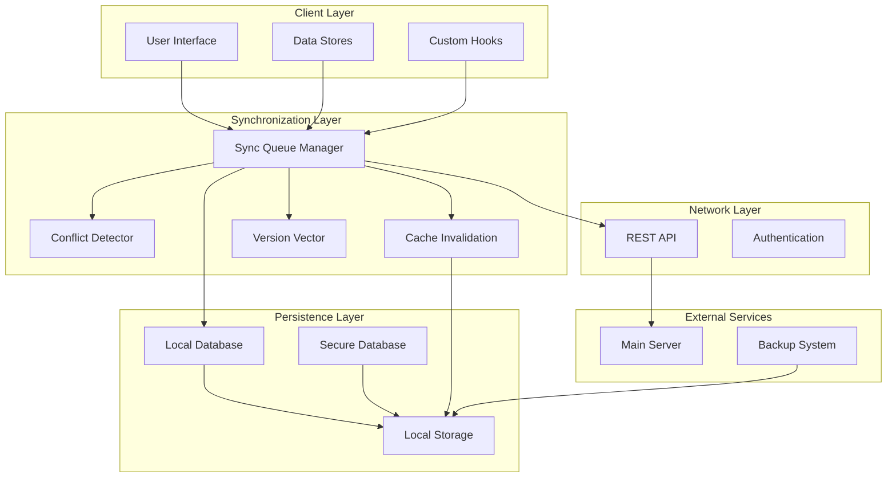
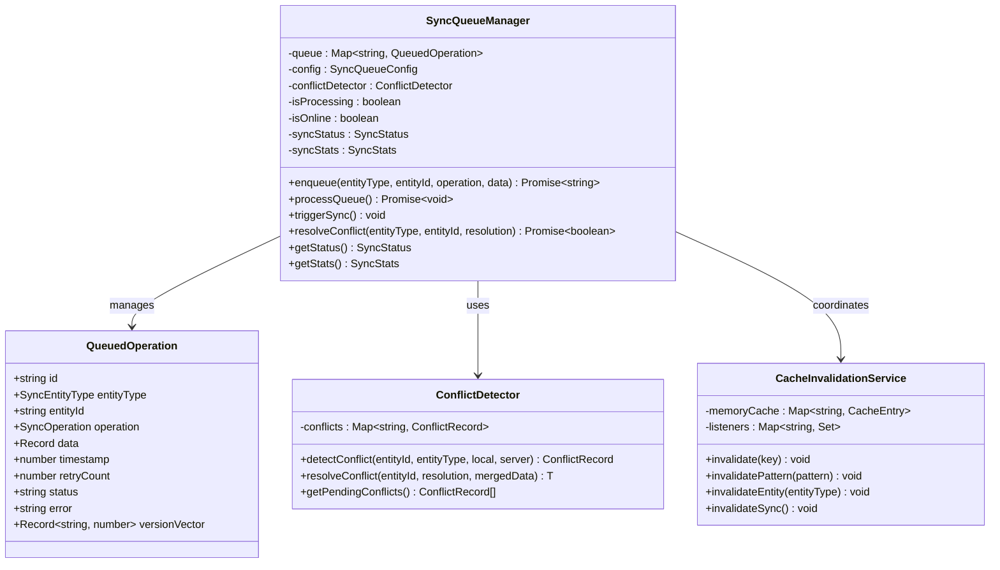
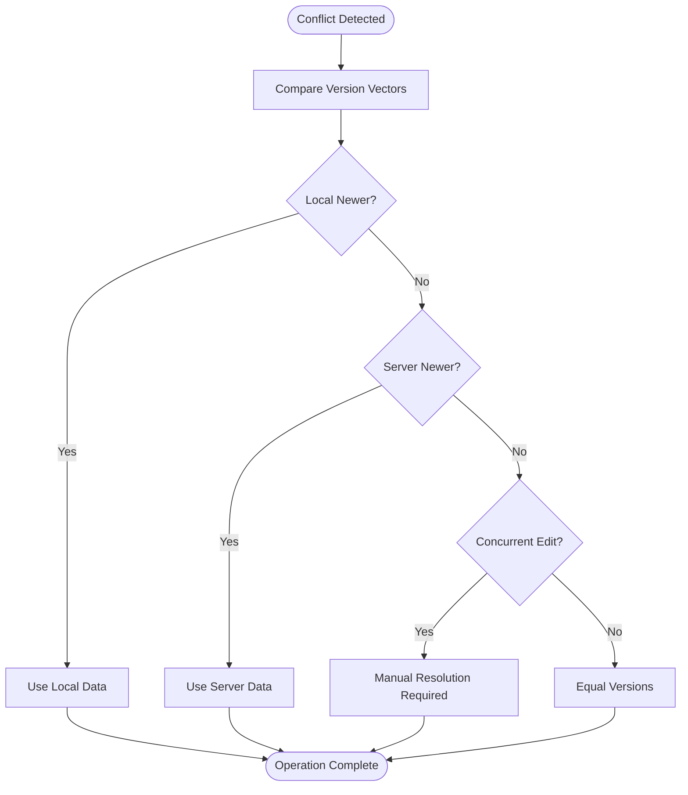
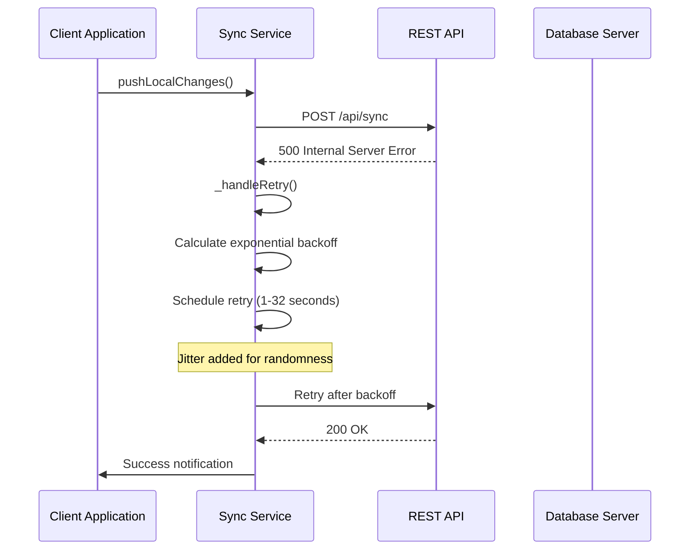
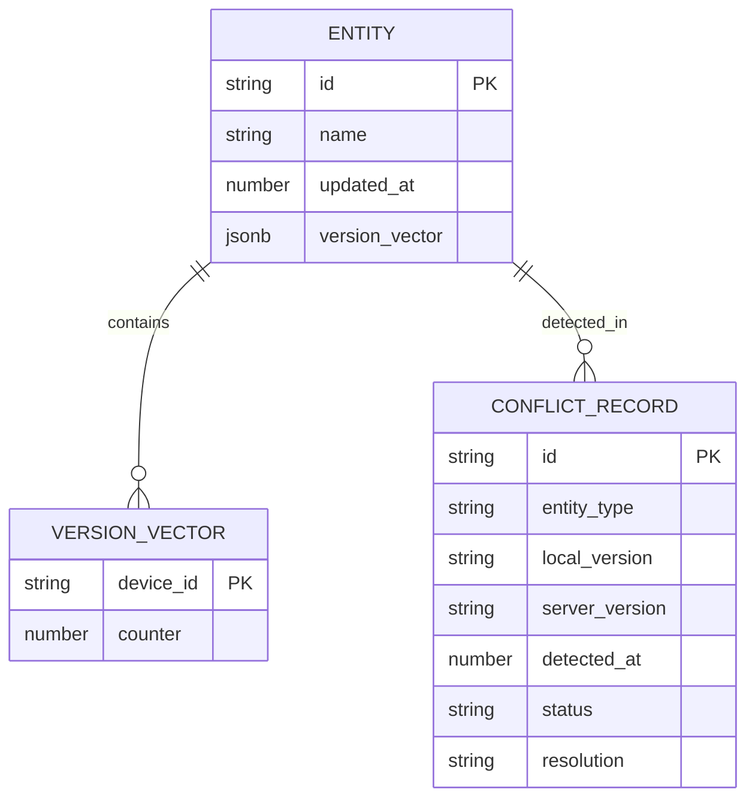
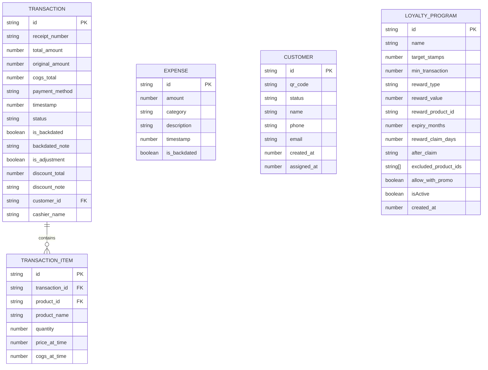
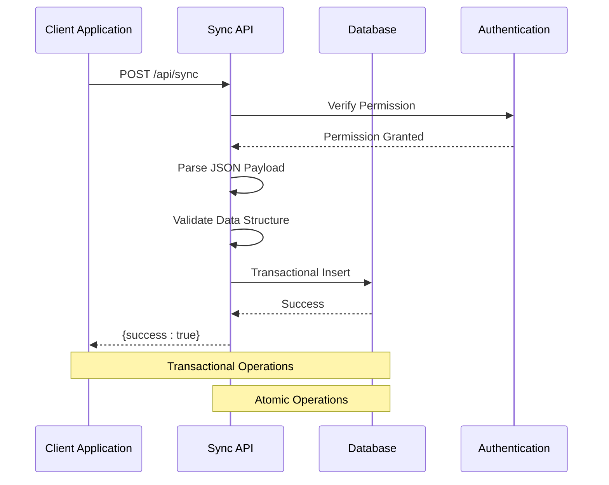
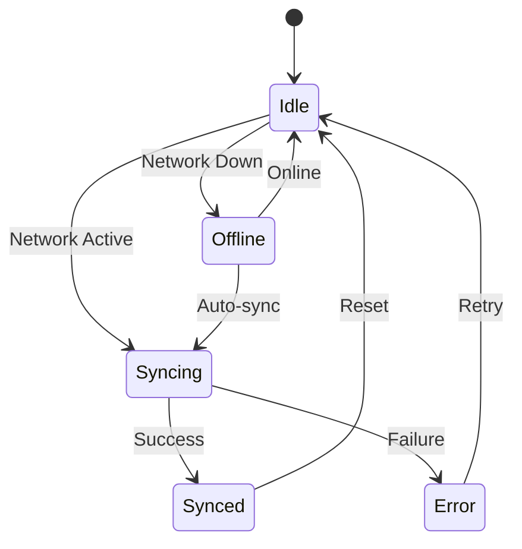
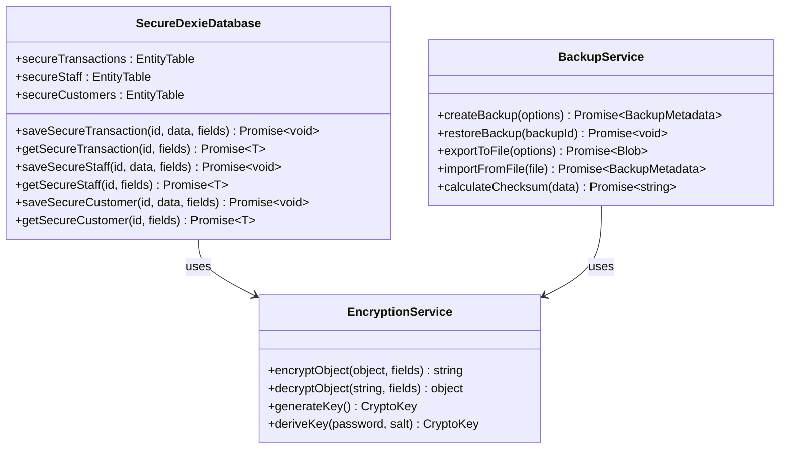

# Enhanced Synchronization System

<cite>
**Referenced Files in This Document**
- [syncService.ts](file://src/lib/syncService.ts)
- [syncQueue.ts](file://src/lib/syncQueue.ts)
- [conflictResolution.ts](file://src/lib/conflictResolution.ts)
- [cacheInvalidation.ts](file://src/lib/cacheInvalidation.ts)
- [index.ts](file://src/routes/api/sync/index.ts)
- [SyncStatus.tsx](file://src/components/SyncStatus.tsx)
- [useCheckout.ts](file://src/hooks/useCheckout.ts)
- [db.ts](file://src/db/db.ts)
- [cart.ts](file://src/stores/cart.ts)
- [loyalty.ts](file://src/stores/loyalty.ts)
- [auth.ts](file://src/stores/auth.ts)
- [backupService.ts](file://src/lib/backupService.ts)
- [secureDb.ts](file://src/lib/secureDb.ts)
- [version.ts](file://src/lib/version.ts)
- [package.json](file://package.json)
</cite>

## Table of Contents
1. [Introduction](#introduction)
2. [System Architecture](#system-architecture)
3. [Core Components](#core-components)
4. [Synchronization Mechanisms](#synchronization-mechanisms)
5. [Conflict Resolution System](#conflict-resolution-system)
6. [Data Persistence Layer](#data-persistence-layer)
7. [API Integration](#api-integration)
8. [User Interface Components](#user-interface-components)
9. [Security and Encryption](#security-and-encryption)
10. [Performance Optimization](#performance-optimization)
11. [Troubleshooting Guide](#troubleshooting-guide)
12. [Conclusion](#conclusion)

## Introduction

The Enhanced Synchronization System is a comprehensive real-time data synchronization solution designed for the NGEPOS point-of-sale application. This system ensures seamless data consistency across multiple devices and locations while maintaining data integrity and providing robust conflict resolution capabilities.

The system operates on a sophisticated queuing mechanism that handles both immediate and delayed synchronization tasks, with intelligent conflict detection and resolution strategies. It supports multiple entity types including transactions, expenses, products, customers, and loyalty programs, making it suitable for complex retail environments.

## System Architecture

The synchronization system follows a layered architecture pattern with clear separation of concerns:

**Diagram sources**
- [syncQueue.ts:69-571](file://src/lib/syncQueue.ts#L69-L571)
- [conflictResolution.ts:134-202](file://src/lib/conflictResolution.ts#L134-L202)
- [cacheInvalidation.ts:29-134](file://src/lib/cacheInvalidation.ts#L29-L134)

## Core Components

### Sync Queue Manager

The Sync Queue Manager serves as the central coordinator for all synchronization operations. It maintains a persistent queue of operations with advanced retry mechanisms and conflict resolution capabilities.

**Diagram sources**
- [syncQueue.ts:69-571](file://src/lib/syncQueue.ts#L69-L571)
- [conflictResolution.ts:134-202](file://src/lib/conflictResolution.ts#L134-L202)
- [cacheInvalidation.ts:29-134](file://src/lib/cacheInvalidation.ts#L29-L134)

**Section sources**
- [syncQueue.ts:69-571](file://src/lib/syncQueue.ts#L69-L571)

### Conflict Resolution Engine

The conflict resolution system implements sophisticated algorithms to handle concurrent modifications across multiple devices. It supports multiple strategies including last-write-wins, manual resolution, and custom merge logic.

**Diagram sources**
- [conflictResolution.ts:33-57](file://src/lib/conflictResolution.ts#L33-L57)

**Section sources**
- [conflictResolution.ts:1-258](file://src/lib/conflictResolution.ts#L1-L258)

## Synchronization Mechanisms

### Real-time Sync Triggers

The system implements multiple synchronization triggers to ensure data consistency:

1. **Immediate Sync**: Triggered on checkout completion
2. **Debounced Sync**: Prevents API flooding during rapid operations
3. **Background Sync**: Automatic sync when network connectivity resumes
4. **Manual Sync**: User-initiated synchronization

### Retry and Backoff Strategy

The system employs exponential backoff with jitter to handle transient network failures:

**Diagram sources**
- [syncService.ts:81-100](file://src/lib/syncService.ts#L81-L100)

**Section sources**
- [syncService.ts:1-111](file://src/lib/syncService.ts#L1-L111)

### Batch Processing

The sync queue processes operations in configurable batches to optimize network usage and server performance:

- **Default Batch Size**: 50 operations
- **Max Batch Size**: 100 operations
- **Batch Processing**: Sequential with progress tracking
- **Memory Management**: Automatic cleanup of completed operations

## Conflict Resolution System

### Version Vector Implementation

The system uses vector clocks for distributed conflict detection:

**Diagram sources**
- [conflictResolution.ts:20-31](file://src/lib/conflictResolution.ts#L20-L31)

### Conflict Resolution Strategies

The system supports four primary conflict resolution strategies:

1. **Last-Write-Wins**: Uses timestamps to determine the most recent modification
2. **Manual Resolution**: Requires user intervention for complex conflicts
3. **Local-Wins**: Prioritizes local modifications over server changes
4. **Server-Wins**: Prioritizes server modifications over local changes

**Section sources**
- [conflictResolution.ts:1-258](file://src/lib/conflictResolution.ts#L1-L258)

## Data Persistence Layer

### Local Database Schema

The system uses Dexie.js for client-side data persistence with comprehensive schema support:

**Diagram sources**
- [db.ts:82-266](file://src/db/db.ts#L82-L266)

**Section sources**
- [db.ts:1-570](file://src/db/db.ts#L1-L570)

### Cache Management

The cache invalidation service provides intelligent cache management with TTL-based expiration:

- **Entity-specific TTL**: Configurable per entity type
- **Pattern-based Invalidation**: Supports wildcard matching
- **Event-driven Updates**: Automatic cache updates on data changes
- **Memory Optimization**: Automatic cleanup of expired entries

## API Integration

### REST API Endpoints

The system integrates with a comprehensive REST API supporting multiple entity types:

**Diagram sources**
- [index.ts:10-155](file://src/routes/api/sync/index.ts#L10-L155)

**Section sources**
- [index.ts:1-155](file://src/routes/api/sync/index.ts#L1-L155)

### Authentication and Authorization

The API implements robust authentication with JWT tokens and permission-based access control:

- **Token-based Authentication**: Bearer token verification
- **Permission Validation**: Role-based access control
- **Rate Limiting**: Protection against abuse
- **Input Validation**: Comprehensive data sanitization

## User Interface Components

### Sync Status Indicator

The system provides comprehensive visual feedback for synchronization status:

**Diagram sources**
- [SyncStatus.tsx:1-202](file://src/components/SyncStatus.tsx#L1-L202)

**Section sources**
- [SyncStatus.tsx:1-202](file://src/components/SyncStatus.tsx#L1-L202)

### Progress Tracking

The UI provides detailed progress tracking for ongoing synchronization operations:

- **Real-time Progress**: Percentage completion indicator
- **Operation Details**: Current operation being processed
- **Error Display**: Clear error messages with retry options
- **Visual Feedback**: Animated indicators for active states

## Security and Encryption

### Secure Data Storage

The system implements multiple layers of data protection:

**Diagram sources**
- [secureDb.ts:29-132](file://src/lib/secureDb.ts#L29-L132)
- [backupService.ts:30-263](file://src/lib/backupService.ts#L30-L263)

**Section sources**
- [secureDb.ts:1-166](file://src/lib/secureDb.ts#L1-L166)
- [backupService.ts:1-264](file://src/lib/backupService.ts#L1-L264)

### Data Encryption

The system provides end-to-end encryption for sensitive data:

- **Field-level Encryption**: Selective encryption of sensitive fields
- **Automatic Key Management**: Secure key generation and rotation
- **Backup Encryption**: Optional encryption for backup data
- **Transport Security**: HTTPS enforcement for all API communications

## Performance Optimization

### Memory Management

The system implements aggressive memory optimization strategies:

- **Lazy Loading**: Data loaded only when needed
- **Weak References**: Prevents memory leaks in long-running sessions
- **Batch Processing**: Optimizes memory usage during bulk operations
- **Garbage Collection**: Proactive cleanup of unused resources

### Network Optimization

The synchronization system includes several network optimization features:

- **Connection Pooling**: Reuses HTTP connections for better performance
- **Compression**: Automatic gzip compression for large payloads
- **Caching**: Intelligent caching reduces redundant network requests
- **Throttling**: Prevents network saturation during heavy sync loads

**Section sources**
- [syncQueue.ts:280-338](file://src/lib/syncQueue.ts#L280-L338)

## Troubleshooting Guide

### Common Issues and Solutions

#### Sync Failures
- **Symptom**: Transactions remain in PENDING status
- **Cause**: Network connectivity issues or server errors
- **Solution**: Check network connection, review server logs, manual retry

#### Conflict Resolution Required
- **Symptom**: Sync shows CONFLICT status
- **Cause**: Concurrent modifications on multiple devices
- **Solution**: Review conflict details, choose appropriate resolution strategy

#### Authentication Errors
- **Symptom**: 401/403 responses during sync
- **Cause**: Expired or invalid authentication tokens
- **Solution**: Re-authenticate user, refresh tokens, check server certificate

#### Performance Issues
- **Symptom**: Slow sync operations or UI lag
- **Cause**: Large dataset or insufficient device resources
- **Solution**: Optimize device storage, reduce concurrent operations, upgrade hardware

### Debugging Tools

The system provides comprehensive debugging capabilities:

- **Console Logging**: Detailed operation logs with timestamps
- **Error Tracking**: Automatic error reporting and categorization
- **Performance Metrics**: Real-time monitoring of sync performance
- **State Inspection**: Live inspection of sync queue and conflict states

**Section sources**
- [syncService.ts:69-100](file://src/lib/syncService.ts#L69-L100)
- [syncQueue.ts:471-490](file://src/lib/syncQueue.ts#L471-L490)

## Conclusion

The Enhanced Synchronization System represents a comprehensive solution for real-time data consistency in distributed POS environments. Its sophisticated architecture provides robust conflict resolution, extensive security measures, and optimal performance characteristics.

Key strengths of the system include:

- **Robust Conflict Resolution**: Advanced algorithms handle complex concurrent modifications
- **Comprehensive Security**: Multi-layered encryption and authentication
- **Performance Optimization**: Efficient memory and network resource management
- **User Experience**: Intuitive status indicators and progress tracking
- **Extensibility**: Modular design supports future enhancements

The system successfully addresses the challenges of modern retail environments where data consistency, security, and performance are paramount concerns. Its design ensures reliable operation across diverse network conditions while maintaining data integrity and user satisfaction.