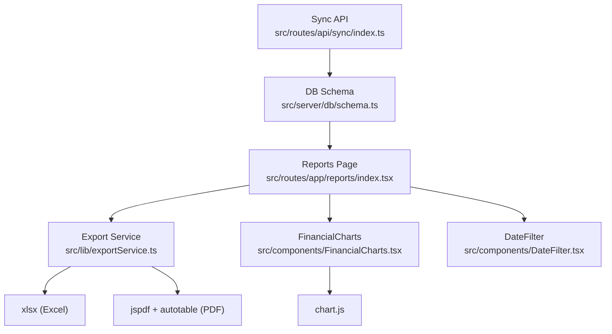
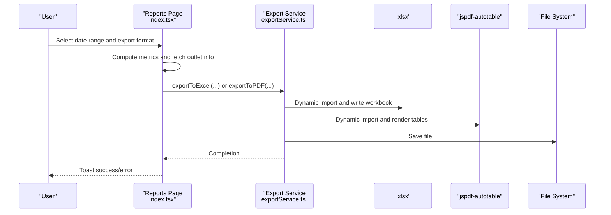
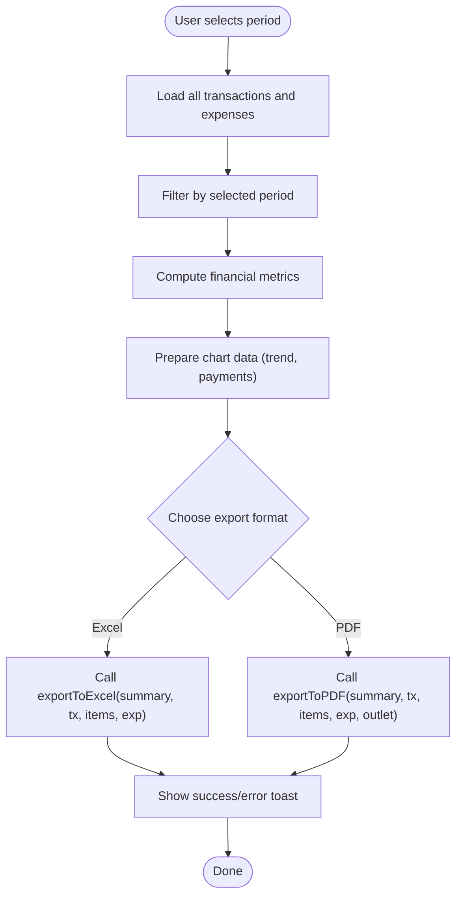
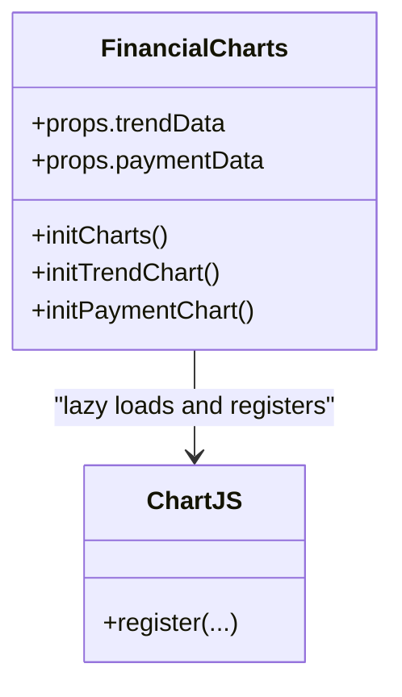
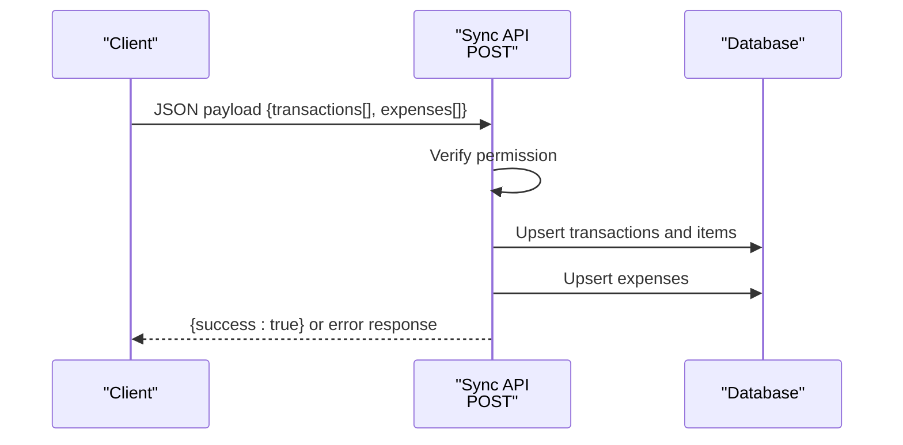
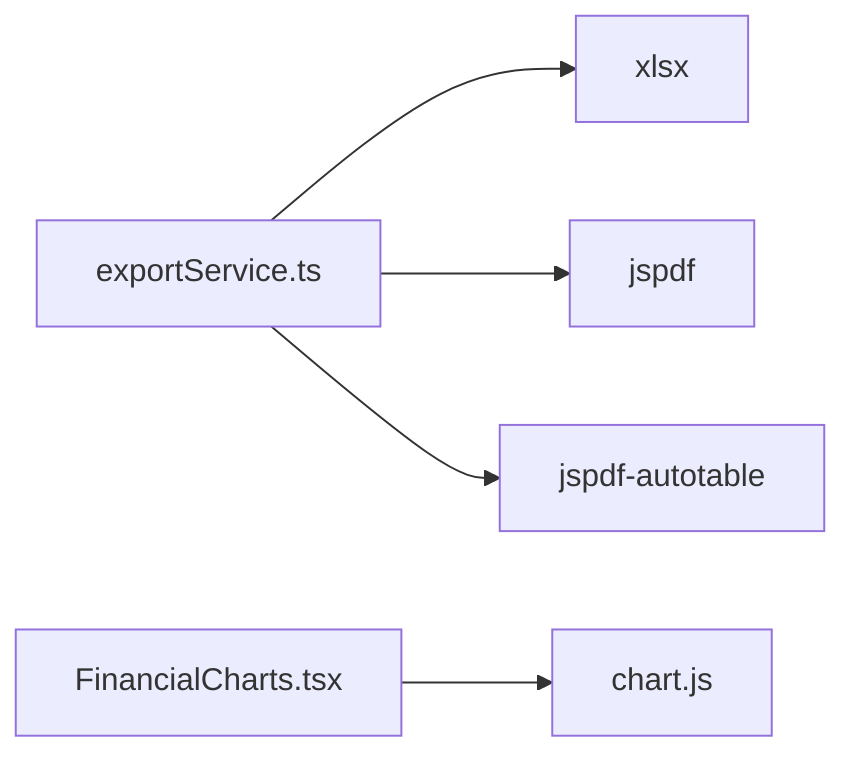

# Export Service

<cite>
**Referenced Files in This Document**
- [exportService.ts](file://src/lib/exportService.ts)
- [index.tsx](file://src/routes/app/reports/index.tsx)
- [FinancialCharts.tsx](file://src/components/FinancialCharts.tsx)
- [schema.ts](file://src/server/db/schema.ts)
- [db.ts](file://src/db/db.ts)
- [package.json](file://package.json)
- [index.ts](file://src/routes/api/sync/index.ts)
- [DateFilter.tsx](file://src/components/DateFilter.tsx)
- [receipt/[id].tsx](file://src/routes/app/receipt/[id].tsx)
</cite>

## Table of Contents
1. [Introduction](#introduction)
2. [Project Structure](#project-structure)
3. [Core Components](#core-components)
4. [Architecture Overview](#architecture-overview)
5. [Detailed Component Analysis](#detailed-component-analysis)
6. [Dependency Analysis](#dependency-analysis)
7. [Performance Considerations](#performance-considerations)
8. [Troubleshooting Guide](#troubleshooting-guide)
9. [Conclusion](#conclusion)
10. [Appendices](#appendices)

## Introduction
This document describes the export service utility in the NgePos POS system. It covers how financial reports are generated and exported to Excel (.xlsx) and PDF formats, including data aggregation, formatting, and integration with Chart.js for financial visualization. It also documents the export workflow from data extraction to file generation, error handling, and user feedback mechanisms. Practical examples illustrate generating sales reports, expense summaries, and financial analytics, along with guidance for performance optimization, scheduling, and integration with the financial reporting system.

## Project Structure
The export service spans several parts of the application:
- Frontend report page orchestrates export actions and filters data by date ranges.
- Export service provides two export functions: Excel and PDF.
- Chart.js integration renders financial charts for trend and payment distribution.
- Backend synchronization API supports ingestion of transactions and expenses for reporting.
- Database schemas define the shape of transaction, item, and expense records.

**Diagram sources**
- [index.tsx:1-210](file://src/routes/app/reports/index.tsx#L1-L210)
- [exportService.ts:1-293](file://src/lib/exportService.ts#L1-L293)
- [FinancialCharts.tsx:1-333](file://src/components/FinancialCharts.tsx#L1-L333)
- [DateFilter.tsx:1-237](file://src/components/DateFilter.tsx#L1-L237)
- [index.ts:1-96](file://src/routes/api/sync/index.ts#L1-L96)
- [schema.ts:1-142](file://src/server/db/schema.ts#L1-L142)
- [package.json:11-39](file://package.json#L11-L39)

**Section sources**
- [index.tsx:1-210](file://src/routes/app/reports/index.tsx#L1-L210)
- [exportService.ts:1-293](file://src/lib/exportService.ts#L1-L293)
- [FinancialCharts.tsx:1-333](file://src/components/FinancialCharts.tsx#L1-L333)
- [DateFilter.tsx:1-237](file://src/components/DateFilter.tsx#L1-L237)
- [index.ts:1-96](file://src/routes/api/sync/index.ts#L1-L96)
- [schema.ts:1-142](file://src/server/db/schema.ts#L1-L142)
- [package.json:11-39](file://package.json#L11-L39)

## Core Components
- Export Service: Provides two primary export functions:
  - exportToExcel(summary, transactions, txItems, expenses): Generates a multi-sheet Excel workbook with summary metrics, transactions, product detail, and expenses.
  - exportToPDF(summary, transactions, txItems, expenses, outlet): Produces a styled PDF report with header, summary metrics, recent transactions, product detail, and expenses.
- Reports Page: Orchestrates export actions, applies date filters, aggregates financial metrics, and triggers exports.
- FinancialCharts: Renders Chart.js visualizations for financial trends and payment distributions.
- Sync API: Accepts bulk transaction and expense payloads and upserts them into the database for reporting.
- Database Schemas: Define transaction, transaction item, and expense structures used by export functions.

Key responsibilities:
- Data extraction and filtering by date range.
- Aggregation of financial metrics (revenue, COGS, platform adjustments, expenses, profit).
- Formatting for localization (currency and date).
- Dynamic module loading for export libraries to reduce bundle size.
- User feedback via toast notifications and disabled export controls during processing.

**Section sources**
- [exportService.ts:45-132](file://src/lib/exportService.ts#L45-L132)
- [exportService.ts:137-291](file://src/lib/exportService.ts#L137-L291)
- [index.tsx:56-209](file://src/routes/app/reports/index.tsx#L56-L209)
- [FinancialCharts.tsx:35-333](file://src/components/FinancialCharts.tsx#L35-L333)
- [index.ts:6-95](file://src/routes/api/sync/index.ts#L6-L95)
- [schema.ts:34-80](file://src/server/db/schema.ts#L34-L80)

## Architecture Overview
The export workflow begins on the Reports page, where users select a date filter and choose an export format. The page computes financial metrics and fetches outlet settings. It then delegates to the export service, which formats data and writes files using dynamic imports. Chart.js visualizations are rendered independently and do not block export.

**Diagram sources**
- [index.tsx:56-209](file://src/routes/app/reports/index.tsx#L56-L209)
- [exportService.ts:49-132](file://src/lib/exportService.ts#L49-L132)
- [exportService.ts:137-291](file://src/lib/exportService.ts#L137-L291)

## Detailed Component Analysis

### Export Service
The export service encapsulates all export logic and formatting. It defines:
- ReportSummary: Aggregated metrics for the report period.
- OutletInfo: Branding and contact details for PDF header.
- Helper formatters: Currency and localized date formatting.
- exportToExcel: Builds a workbook with four sheets:
  - Summary: Key financial metrics and counts.
  - Transactions: Transaction-level details.
  - Product Detail: Line items with variants and computed totals.
  - Expenses: Expense entries with categorized labels.
- exportToPDF: Creates a branded PDF with:
  - Header and optional logo.
  - Summary metrics grid.
  - Recent transactions table (sample limited).
  - Product detail table.
  - Expenses table (if present).
  - Footer with page numbers and timestamp.

Dynamic imports ensure lightweight initial load:
- xlsx for Excel export.
- jspdf and jspdf-autotable for PDF export.

Error handling:
- PDF logo loading errors are caught and logged.
- Export failures surface via toast messages.

Formatting options:
- Currency formatting uses Indonesian locale.
- Dates use Indonesian locale with short month/day/year/hours:minutes.
- Expense categories are mapped to human-readable labels.

**Section sources**
- [exportService.ts:24-43](file://src/lib/exportService.ts#L24-L43)
- [exportService.ts:49-132](file://src/lib/exportService.ts#L49-L132)
- [exportService.ts:137-291](file://src/lib/exportService.ts#L137-L291)

### Reports Page Workflow
The Reports page coordinates export:
- DateFilter integration: Supports predefined periods (today, this month) and custom ranges.
- Data extraction: Loads all transactions and expenses, then filters by selected period.
- Metrics computation: Calculates revenue, COGS, platform adjustments, gross profit, expenses, net profit, modal return, and true profit.
- Chart data preparation: Builds trend data (hourly for today, daily otherwise) and payment method distribution.
- Export invocation: Calls exportToExcel or exportToPDF with computed summary and outlet info.
- User feedback: Disables export controls while exporting and shows success/error toasts.

**Diagram sources**
- [index.tsx:211-370](file://src/routes/app/reports/index.tsx#L211-L370)
- [index.tsx:56-209](file://src/routes/app/reports/index.tsx#L56-L209)

**Section sources**
- [index.tsx:56-209](file://src/routes/app/reports/index.tsx#L56-L209)
- [index.tsx:211-370](file://src/routes/app/reports/index.tsx#L211-L370)
- [DateFilter.tsx:1-237](file://src/components/DateFilter.tsx#L1-L237)

### FinancialCharts Integration
FinancialCharts renders:
- A line chart of revenue vs. COGS over time (hourly for today, daily otherwise).
- A doughnut chart of payment method distribution.

It lazy-loads Chart.js modules and registers controllers and elements. Data updates reactively when props change.

**Diagram sources**
- [FinancialCharts.tsx:35-333](file://src/components/FinancialCharts.tsx#L35-L333)

**Section sources**
- [FinancialCharts.tsx:35-333](file://src/components/FinancialCharts.tsx#L35-L333)

### Sync API and Data Ingestion
The Sync API endpoint accepts transaction and expense batches and upserts them into the database. This ensures the Reports page has fresh data for export.

**Diagram sources**
- [index.ts:6-95](file://src/routes/api/sync/index.ts#L6-L95)

**Section sources**
- [index.ts:6-95](file://src/routes/api/sync/index.ts#L6-L95)
- [schema.ts:34-80](file://src/server/db/schema.ts#L34-L80)

### Data Models Used by Export
The export functions operate on typed data from both IndexedDB (client-side) and PostgreSQL (server-side):
- Transaction: identifiers, amounts, timestamps, payment method, status, backdated flags.
- TransactionItem: product linkage, quantities, pricing at time of sale, COGS at time of sale, selected variants.
- Expense: amount, category, description, timestamp, backdated flag.

These types inform how export data is structured and formatted.

**Section sources**
- [db.ts:82-137](file://src/db/db.ts#L82-L137)
- [schema.ts:34-80](file://src/server/db/schema.ts#L34-L80)

## Dependency Analysis
External dependencies used by the export service:
- xlsx: Excel workbook creation and download.
- jspdf + jspdf-autotable: PDF generation and automatic table rendering.
- chart.js: Financial chart rendering.

**Diagram sources**
- [exportService.ts:55-149](file://src/lib/exportService.ts#L55-L149)
- [FinancialCharts.tsx:5-79](file://src/components/FinancialCharts.tsx#L5-L79)
- [package.json:27-39](file://package.json#L27-L39)

**Section sources**
- [exportService.ts:1-293](file://src/lib/exportService.ts#L1-L293)
- [FinancialCharts.tsx:1-333](file://src/components/FinancialCharts.tsx#L1-L333)
- [package.json:11-39](file://package.json#L11-L39)

## Performance Considerations
- Dynamic imports: Both Excel and PDF libraries are imported lazily to minimize initial bundle size.
- Data sampling: PDF transaction table limits rows to a recent sample to keep file sizes manageable.
- Efficient aggregation: Metrics are computed in-memory using reduce and Map-based grouping.
- Reactive updates: Charts update efficiently when data changes without reinitializing the entire DOM.
- Large dataset handling: For very large datasets, consider pagination or server-side export APIs to avoid heavy client-side processing.

[No sources needed since this section provides general guidance]

## Troubleshooting Guide
Common issues and resolutions:
- Export fails silently:
  - Verify that the Reports page is not loading and that the export action is triggered only when data is ready.
  - Check toast feedback for error messages.
- PDF logo missing:
  - The export service catches logo loading errors; confirm the outlet logo setting is valid.
- Empty or incomplete Excel/PDF:
  - Ensure the selected date range captures data; confirm Sync API has ingested recent transactions and expenses.
- Chart not rendering:
  - Confirm the FinancialCharts component is expanded and that data props are populated.

**Section sources**
- [index.tsx:202-208](file://src/routes/app/reports/index.tsx#L202-L208)
- [exportService.ts:155-161](file://src/lib/exportService.ts#L155-L161)
- [FinancialCharts.tsx:48-98](file://src/components/FinancialCharts.tsx#L48-L98)

## Conclusion
The export service in NgePos provides robust, user-friendly financial reporting across Excel and PDF formats. It integrates seamlessly with the Reports page, leverages Chart.js for visualization, and uses dynamic imports for optimal performance. By combining client-side aggregation with backend ingestion, it supports accurate, timely exports for sales reports, expense summaries, and financial analytics.

[No sources needed since this section summarizes without analyzing specific files]

## Appendices

### Practical Examples
- Sales report (Excel):
  - Trigger export from the Reports page dropdown.
  - The Excel workbook includes a summary sheet, transactions sheet, product detail sheet, and expenses sheet.
- Expense summary (PDF):
  - Choose PDF export from the Reports page.
  - The PDF includes a branded header, summary metrics, recent transactions, product detail, and expenses.
- Financial analytics:
  - Use the FinancialCharts component to visualize revenue vs. COGS trends and payment method distribution.

**Section sources**
- [index.tsx:396-444](file://src/routes/app/reports/index.tsx#L396-L444)
- [exportService.ts:49-132](file://src/lib/exportService.ts#L49-L132)
- [exportService.ts:137-291](file://src/lib/exportService.ts#L137-L291)
- [FinancialCharts.tsx:35-333](file://src/components/FinancialCharts.tsx#L35-L333)

### Export Templates and Customization
- Excel template:
  - Four sheets: Summary, Transactions, Product Detail, Expenses.
  - Customizable period label and filename.
- PDF template:
  - Branded header with optional logo, summary metrics grid, recent transactions table, product detail table, and expenses table.
  - Footer with page numbers and timestamp.
- Customization options:
  - Outlet branding via settings (name, address, phone, logo).
  - Expense category labels mapped to readable strings.

**Section sources**
- [exportService.ts:49-132](file://src/lib/exportService.ts#L49-L132)
- [exportService.ts:137-291](file://src/lib/exportService.ts#L137-L291)
- [db.ts:120-128](file://src/db/db.ts#L120-L128)
- [index.tsx:141-154](file://src/routes/app/reports/index.tsx#L141-L154)

### Data Filtering and Period Selection
- Predefined periods: Today, This Month, All Time.
- Custom range selection with quick presets (7, 14, 30 days).
- Filtering logic applies to both transaction and expense datasets.

**Section sources**
- [DateFilter.tsx:8-13](file://src/components/DateFilter.tsx#L8-L13)
- [index.tsx:211-262](file://src/routes/app/reports/index.tsx#L211-L262)

### Integration with Financial Reporting System
- Sync API ingestion ensures transactions and expenses are persisted for reporting.
- Reports page aggregates metrics and prepares export-ready datasets.
- Chart.js visualizations complement exports by providing interactive insights.

**Section sources**
- [index.ts:6-95](file://src/routes/api/sync/index.ts#L6-L95)
- [index.tsx:264-370](file://src/routes/app/reports/index.tsx#L264-L370)
- [FinancialCharts.tsx:35-333](file://src/components/FinancialCharts.tsx#L35-L333)

### Receipt Context
While receipts are separate from exports, the receipt page demonstrates how outlet branding and settings integrate with the POS UI, reinforcing the importance of consistent branding across documents.

**Section sources**
- [receipt/[id].tsx](file://src/routes/app/receipt/[id].tsx#L20-L25)